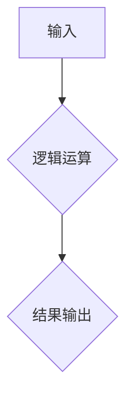

> 计算，零，二进制，逻辑运算，算法，计算机科学，历史发展

## 1. 背景介绍

从人类文明的起源，我们便开始对世界进行抽象和建模。我们用语言记录经验，用工具改造环境，用符号表达思想。而计算，作为一种基本的认知活动，是人类理解和操控世界的重要手段。

早期的人类计算主要依靠简单的加减乘除，以及一些基本的计数方法。随着社会的发展，人们对计算的需求越来越高，出现了更复杂的计算工具，例如算盘、机械计算器等。然而，这些工具仍然局限于有限的运算能力和操作效率。

直到19世纪末，随着电气技术的进步，出现了能够进行高速、高精度计算的电子计算机。电子计算机的出现标志着计算技术的飞跃，它为现代社会的发展提供了强大的技术支撑。

## 2. 核心概念与联系

在计算机科学中，计算的基本单位是“比特”，它可以表示0或1两种状态。通过组合多个比特，我们可以表示更复杂的数字和符号。

**二进制数制**是计算机使用的基本数制，它使用0和1两个数字来表示所有数字。

**逻辑运算**是计算机进行计算的基础，它包括AND、OR、NOT等运算符。这些运算符可以用来组合比特，实现更复杂的逻辑判断和计算。

**算法**是解决特定问题的步骤序列，它可以被计算机执行。算法的效率和正确性直接影响到计算机程序的性能和可靠性。

**Mermaid 流程图**



## 3. 核心算法原理 & 具体操作步骤

### 3.1  算法原理概述

零的诞生是计算机科学发展中的一个重要里程碑。它为计算机提供了表示“无”的概念，并为二进制数制和逻辑运算奠定了基础。

### 3.2  算法步骤详解

1. 确定一个基本的计算单元，例如一个开关，它可以处于“开”或“关”两种状态。
2. 将“开”状态表示为1，“关”状态表示为0。
3. 使用多个计算单元组合，可以表示不同的数字和符号。
4. 定义逻辑运算符，例如AND、OR、NOT，用于组合计算单元。
5. 设计算法，利用逻辑运算符和计算单元进行计算。

### 3.3  算法优缺点

**优点:**

* 简洁易懂：二进制数制和逻辑运算的原理简单易懂，易于理解和学习。
* 高效可靠：计算机硬件可以高效地执行二进制运算，保证计算的准确性和可靠性。
* 可扩展性强：二进制数制可以表示任意大小的数字，逻辑运算可以组合成更复杂的计算逻辑。

**缺点:**

* 运算效率有限：与其他数制相比，二进制数制在某些情况下运算效率可能较低。
* 存储空间占用大：表示相同大小的数字，二进制数制需要更多的存储空间。

### 3.4  算法应用领域

二进制数制和逻辑运算是计算机科学的基础，广泛应用于各种领域，例如：

* **数据存储和处理:** 计算机使用二进制数制存储和处理数据。
* **软件开发:** 程序员使用逻辑运算符编写程序逻辑。
* **人工智能:** 人工智能算法依赖于逻辑运算和数据处理。
* **网络通信:** 网络协议使用二进制数制和逻辑运算进行数据传输。

## 4. 数学模型和公式 & 详细讲解 & 举例说明

### 4.1  数学模型构建

二进制数制可以看作是一种有限域上的数制，其中域元素为0和1。

**定义:**

* **有限域:** 一个包含有限个元素的集合，并定义了加法和乘法运算。
* **二进制数:** 使用0和1组成的数，每个数字位代表一个2的幂次方。

### 4.2  公式推导过程

**二进制数到十进制数的转换公式:**

$$
decimal = \sum_{i=0}^{n-1} b_i \cdot 2^i
$$

其中:

* $decimal$ 是十进制数
* $b_i$ 是二进制数的第 $i$ 位数字
* $n$ 是二进制数的位数

**举例说明:**

二进制数 1011 的十进制数转换:

$$
decimal = 1 \cdot 2^3 + 0 \cdot 2^2 + 1 \cdot 2^1 + 1 \cdot 2^0 = 8 + 0 + 2 + 1 = 11
$$

### 4.3  案例分析与讲解

**案例:**

将十进制数 25 转换为二进制数。

**分析:**

1. 找到最大的2的幂次方，小于等于25，即 $2^4 = 16$。
2. 将16从25中减去，剩余9。
3. 找到最大的2的幂次方，小于等于9，即 $2^3 = 8$。
4. 将8从9中减去，剩余1。
5. 找到最大的2的幂次方，小于等于1，即 $2^0 = 1$。

**结果:**

二进制数为 $11001$。

## 5. 项目实践：代码实例和详细解释说明

### 5.1  开发环境搭建

本项目使用Python语言进行开发，需要安装Python环境和相关库。

### 5.2  源代码详细实现

```python
def decimal_to_binary(decimal):
  """
  将十进制数转换为二进制数。

  Args:
    decimal: 十进制数。

  Returns:
    二进制数。
  """
  if decimal == 0:
    return "0"
  binary = ""
  while decimal > 0:
    remainder = decimal % 2
    binary = str(remainder) + binary
    decimal //= 2
  return binary

# 测试代码
decimal_num = 25
binary_num = decimal_to_binary(decimal_num)
print(f"十进制数 {decimal_num} 的二进制数为: {binary_num}")
```

### 5.3  代码解读与分析

* 函数 `decimal_to_binary(decimal)` 接受一个十进制数作为输入，并返回其对应的二进制数。
* 函数内部使用循环迭代，每次将输入数除以2，并将余数添加到二进制数的开头。
* 循环结束后，返回生成的二进制数字符串。

### 5.4  运行结果展示

```
十进制数 25 的二进制数为: 11001
```

## 6. 实际应用场景

### 6.1  计算机硬件

* **存储器:** 计算机存储器使用二进制数制存储数据。
* **处理器:** 处理器使用逻辑运算和二进制数制进行计算。

### 6.2  软件开发

* **编程语言:** 许多编程语言使用二进制数制和逻辑运算进行数据处理和程序执行。
* **数据结构:** 数据结构，例如数组、链表、树等，都依赖于二进制数制和逻辑运算进行存储和操作。

### 6.3  网络通信

* **网络协议:** 网络协议使用二进制数制和逻辑运算进行数据传输和处理。
* **IP地址:** IP地址使用二进制数制表示网络设备的唯一标识。

### 6.4  未来应用展望

随着人工智能、大数据等技术的快速发展，二进制数制和逻辑运算将在更广泛的领域得到应用，例如：

* **量子计算:** 量子计算机使用量子比特进行计算，量子比特可以处于叠加态，从而实现更强大的计算能力。
* **生物信息学:** 二进制数制和逻辑运算可以用于分析生物序列数据，例如DNA和蛋白质序列。

## 7. 工具和资源推荐

### 7.1  学习资源推荐

* **书籍:**
    * 《计算机科学导论》
    * 《算法导论》
* **在线课程:**
    * Coursera: 计算机科学基础
    * edX: 算法与数据结构

### 7.2  开发工具推荐

* **Python:** 
    * PyCharm
    * VS Code
* **C++:**
    * Visual Studio
    * Code::Blocks

### 7.3  相关论文推荐

* **The Turing Test: A Fifty-Year Perspective**
* **A Survey of Quantum Computing**

## 8. 总结：未来发展趋势与挑战

### 8.1  研究成果总结

零的诞生是计算机科学发展中的一个重要里程碑，它为计算机提供了表示“无”的概念，并为二进制数制和逻辑运算奠定了基础。

### 8.2  未来发展趋势

随着人工智能、大数据等技术的快速发展，二进制数制和逻辑运算将在更广泛的领域得到应用，例如量子计算、生物信息学等。

### 8.3  面临的挑战

* **计算效率:** 如何提高二进制数制和逻辑运算的计算效率，特别是对于大规模数据处理。
* **可解释性:** 如何提高人工智能算法的可解释性，使其能够更好地理解和解释其决策过程。

### 8.4  研究展望

未来研究方向包括：

* **新型数制:** 研究新的数制，例如三进制数制、四进制数制等，以提高计算效率。
* **量子计算:** 研究量子计算的原理和应用，探索其在人工智能、材料科学等领域的潜力。

## 9. 附录：常见问题与解答

**问题:** 为什么计算机使用二进制数制？

**答案:** 二进制数制简单易懂，易于硬件实现，并且可以表示任意大小的数字。

**问题:** 如何将十进制数转换为二进制数？

**答案:** 可以使用除法和取余法，将十进制数不断除以2，并将余数添加到二进制数的开头。

**问题:** 二进制数制有什么缺点？

**答案:** 二进制数制在某些情况下运算效率可能较低，并且存储空间占用大。


作者：禅与计算机程序设计艺术 / Zen and the Art of Computer Programming 
<end_of_turn>