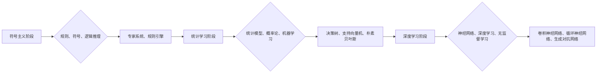

> 认知发展，三阶段模型，人工智能，机器学习，深度学习，自然语言处理，计算机视觉

## 1. 背景介绍

认知发展是人工智能领域的核心议题之一，它旨在使机器能够像人类一样学习、理解和应用知识。从早期规则驱动的系统到如今的深度学习模型，人工智能的发展经历了多个阶段，每一次进步都离不开对认知发展机制的深入探索。

传统的认知科学研究主要关注人类的认知发展过程，而人工智能则试图借鉴这些机制，构建能够模拟人类认知能力的智能系统。近年来，随着深度学习技术的兴起，人工智能取得了显著进展，在自然语言处理、计算机视觉等领域展现出强大的能力。然而，深度学习模型仍然存在一些局限性，例如缺乏泛化能力、对数据依赖性强等。

为了更好地理解和推动人工智能的认知发展，我们需要建立一个清晰的认知发展模型，并探索不同阶段模型的特征和发展路径。本文将介绍一个基于三阶段模型的认知发展路径，并探讨每个阶段的算法原理、应用场景以及未来发展趋势。

## 2. 核心概念与联系

### 2.1 三阶段模型

我们认为人工智能的认知发展可以分为三个阶段：

* **阶段一：符号主义阶段**： 
    * 核心概念：规则、符号、逻辑推理
    * 特点：依赖于人工设计的规则和符号系统，通过逻辑推理进行知识表示和处理。
    * 代表算法：专家系统、规则引擎
* **阶段二：统计学习阶段**：
    * 核心概念：统计模型、概率论、机器学习
    * 特点：利用统计方法学习数据中的模式，构建概率模型进行知识表示和处理。
    * 代表算法：决策树、支持向量机、朴素贝叶斯
* **阶段三：深度学习阶段**：
    * 核心概念：神经网络、深度学习、无监督学习
    * 特点：模拟生物神经网络结构，通过多层神经网络进行特征提取和知识表示，能够学习更复杂的模式和关系。
    * 代表算法：卷积神经网络、循环神经网络、生成对抗网络

**Mermaid 流程图**



### 2.2 阶段之间的联系

三个阶段模型并非完全独立，而是相互关联和递进的。

* 符号主义阶段为统计学习阶段和深度学习阶段奠定了基础，提供了符号表示和逻辑推理的框架。
* 统计学习阶段在符号主义阶段的基础上，引入了概率论和机器学习方法，能够处理更复杂的数据和模式。
* 深度学习阶段则进一步借鉴了生物神经网络的结构和功能，能够学习更抽象和复杂的知识表示。

## 3. 核心算法原理 & 具体操作步骤

### 3.1 算法原理概述

**符号主义阶段**的核心算法是专家系统和规则引擎。专家系统通过人工设计的规则库和知识库，模拟专家决策过程，解决特定领域的专业问题。规则引擎则根据预先定义的规则，对输入数据进行处理和推理。

**统计学习阶段**的核心算法包括决策树、支持向量机和朴素贝叶斯等。这些算法通过统计学习方法，从数据中学习出模式和规律，并将其转化为决策规则或概率模型。

**深度学习阶段**的核心算法是神经网络，包括卷积神经网络、循环神经网络和生成对抗网络等。这些算法通过多层神经网络结构，模拟生物神经网络的功能，能够学习更复杂的特征表示和知识结构。

### 3.2 算法步骤详解

**符号主义阶段**

1. **知识表示**: 将领域知识以符号形式表示，包括概念、关系和规则。
2. **推理机制**: 设计逻辑推理机制，根据规则库和知识库，对输入问题进行推理和解决。

**统计学习阶段**

1. **数据预处理**: 对输入数据进行清洗、转换和特征提取。
2. **模型训练**: 使用训练数据，训练统计模型，例如决策树、支持向量机或朴素贝叶斯模型。
3. **模型评估**: 使用测试数据，评估模型的性能，例如准确率、召回率和F1-score。

**深度学习阶段**

1. **数据预处理**: 对输入数据进行清洗、转换和特征提取。
2. **网络结构设计**: 设计深度神经网络结构，包括层数、节点数和激活函数等。
3. **模型训练**: 使用训练数据，训练深度神经网络模型，例如卷积神经网络、循环神经网络或生成对抗网络模型。
4. **模型评估**: 使用测试数据，评估模型的性能，例如准确率、召回率和F1-score。

### 3.3 算法优缺点

**符号主义阶段**

* **优点**: 能够处理明确的逻辑推理问题，解释性强。
* **缺点**: 难以处理复杂、模糊的知识，规则设计困难，扩展性差。

**统计学习阶段**

* **优点**: 能够处理复杂的数据和模式，无需人工设计规则，具有较好的泛化能力。
* **缺点**: 解释性较弱，对数据质量要求高，容易过拟合。

**深度学习阶段**

* **优点**: 能够学习更复杂的特征表示和知识结构，具有强大的学习能力和泛化能力。
* **缺点**: 计算资源消耗大，训练时间长，解释性较弱，对数据规模要求高。

### 3.4 算法应用领域

**符号主义阶段**

* 专家系统：医学诊断、金融风险评估
* 规则引擎：业务流程自动化、安全策略管理

**统计学习阶段**

* 机器翻译：Google Translate
* 垃圾邮件过滤：Gmail
* 推荐系统：Amazon、Netflix

**深度学习阶段**

* 自然语言处理：机器翻译、文本摘要、情感分析
* 计算机视觉：图像识别、目标检测、图像生成
* 语音识别：Siri、Alexa

## 4. 数学模型和公式 & 详细讲解 & 举例说明

### 4.1 数学模型构建

**符号主义阶段**

* **逻辑推理**: 使用命题逻辑、谓词逻辑等形式化语言进行推理。

**统计学习阶段**

* **概率模型**: 使用贝叶斯定理、最大似然估计等方法构建概率模型，例如朴素贝叶斯模型、高斯混合模型。

**深度学习阶段**

* **神经网络**: 使用激活函数、权重和偏置等参数构建神经网络模型，并使用反向传播算法进行训练。

### 4.2 公式推导过程

**朴素贝叶斯模型**

$$P(C|X) = \frac{P(X|C)P(C)}{P(X)}$$

其中：

* $P(C|X)$ 是给定特征 $X$ 的条件下类别 $C$ 的概率。
* $P(X|C)$ 是给定类别 $C$ 的条件下特征 $X$ 的概率。
* $P(C)$ 是类别 $C$ 的先验概率。
* $P(X)$ 是特征 $X$ 的边缘概率。

**反向传播算法**

$$ \Delta w = \eta \frac{\partial E}{\partial w} $$

其中：

* $\Delta w$ 是权重 $w$ 的更新量。
* $\eta$ 是学习率。
* $\frac{\partial E}{\partial w}$ 是误差函数 $E$ 对权重 $w$ 的梯度。

### 4.3 案例分析与讲解

**朴素贝叶斯模型**

用于垃圾邮件过滤，假设给定一封邮件的特征（例如单词频率、邮件地址等），可以预测其是否为垃圾邮件。

**反向传播算法**

用于训练卷积神经网络进行图像识别，通过调整网络权重，使网络能够将图像特征映射到相应的类别。

## 5. 项目实践：代码实例和详细解释说明

### 5.1 开发环境搭建

使用 Python 语言和 TensorFlow 或 PyTorch 深度学习框架进行开发。

### 5.2 源代码详细实现

```python
# 使用 TensorFlow 构建一个简单的卷积神经网络模型

import tensorflow as tf

# 定义模型结构
model = tf.keras.models.Sequential([
    tf.keras.layers.Conv2D(32, (3, 3), activation='relu', input_shape=(28, 28, 1)),
    tf.keras.layers.MaxPooling2D((2, 2)),
    tf.keras.layers.Conv2D(64, (3, 3), activation='relu'),
    tf.keras.layers.MaxPooling2D((2, 2)),
    tf.keras.layers.Flatten(),
    tf.keras.layers.Dense(10, activation='softmax')
])

# 编译模型
model.compile(optimizer='adam',
              loss='sparse_categorical_crossentropy',
              metrics=['accuracy'])

# 训练模型
model.fit(x_train, y_train, epochs=5)

# 评估模型
loss, accuracy = model.evaluate(x_test, y_test)
print('Test loss:', loss)
print('Test accuracy:', accuracy)
```

### 5.3 代码解读与分析

* 使用 TensorFlow 的 Keras API构建一个简单的卷积神经网络模型。
* 模型包含两个卷积层、两个最大池化层、一个全连接层和一个输出层。
* 使用 Adam 优化器、交叉熵损失函数和准确率指标进行训练。
* 训练模型并评估其在测试集上的性能。

### 5.4 运行结果展示

训练完成后，打印出测试集上的损失值和准确率。

## 6. 实际应用场景

### 6.1 自然语言处理

* **机器翻译**: 使用深度学习模型将文本从一种语言翻译成另一种语言。
* **文本摘要**: 使用深度学习模型自动生成文本的摘要。
* **情感分析**: 使用深度学习模型分析文本的情感倾向。

### 6.2 计算机视觉

* **图像识别**: 使用深度学习模型识别图像中的物体。
* **目标检测**: 使用深度学习模型在图像中定位和识别多个目标。
* **图像生成**: 使用深度学习模型生成新的图像。

### 6.3 其他领域

* **语音识别**: 使用深度学习模型将语音转换为文本。
* **医疗诊断**: 使用深度学习模型辅助医生进行疾病诊断。
* **金融风险评估**: 使用深度学习模型评估金融风险。

### 6.4 未来应用展望

随着人工智能技术的不断发展，认知发展模型将应用于更多领域，例如：

* **个性化教育**: 根据学生的学习情况，提供个性化的学习内容和教学方法。
* **智能客服**: 使用深度学习模型构建智能客服系统，自动回答用户问题。
* **自动驾驶**: 使用深度学习模型构建自动驾驶系统，实现车辆自动驾驶。

## 7. 工具和资源推荐

### 7.1 学习资源推荐

* **书籍**:
    * 《深度学习》
    * 《人工智能：现代方法》
    * 《机器学习》
* **在线课程**:
    * Coursera
    * edX
    * Udacity

### 7.2 开发工具推荐

* **Python**: 
* **TensorFlow**: 
* **PyTorch**: 
* **Keras**: 

### 7.3 相关论文推荐

* **《ImageNet Classification with Deep Convolutional Neural Networks》**
* **《Attention Is All You Need》**
* **《BERT: Pre-training of Deep Bidirectional Transformers for Language Understanding》**

## 8. 总结：未来发展趋势与挑战

### 8.1 研究成果总结

人工智能的认知发展取得了显著进展，特别是深度学习技术的突破，使得人工智能在自然语言处理、计算机视觉等领域取得了突破性进展。

### 8.2 未来发展趋势

* **更