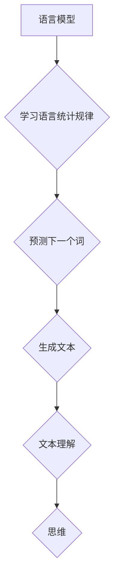

> 语言模型，人工智能，思维，认知科学，神经科学，计算模型，符号系统，抽象概念

## 1. 背景介绍

近年来，人工智能（AI）领域取得了令人瞩目的进展，尤其是基于深度学习的语言模型在自然语言处理任务上的出色表现，引发了人们对人工智能是否能够真正理解和思考的热烈讨论。许多人认为，语言是思维的载体，掌握语言就意味着掌握了思维的核心。然而，从认知科学和神经科学的视角来看，语言与思维的关系并非那么简单。

语言模型的强大之处在于其能够模拟人类语言的结构和语法，并生成看似合理的文本。然而，这些模型本质上是复杂的统计机器，它们通过学习海量文本数据，预测下一个词出现的概率。它们能够识别模式、生成文本，甚至进行简单的推理，但它们并不真正理解语言的含义，也不具备人类的意识和情感。

## 2. 核心概念与联系

**2.1 语言模型与思维的本质**

语言模型是一种基于统计学和机器学习的算法，旨在预测和生成文本。它们通过分析大量文本数据，学习语言的统计规律，并根据这些规律生成新的文本。

思维，则是指人类大脑进行的认知活动，包括感知、记忆、思考、判断、决策等。它是一个复杂而多层次的过程，涉及到大脑各个区域的协同工作。

**2.2 语言与思维的关系**

语言可以作为思维的工具，帮助我们表达、组织和共享思想。但语言本身并不等同于思维。

* **语言是符号系统：** 语言是由符号（词语、句子等）组成的系统，这些符号代表着抽象的概念和关系。
* **思维是抽象概念的处理：** 思维涉及到对抽象概念的理解、推理和操作。

**2.3 语言模型的局限性**

尽管语言模型在文本生成和理解方面取得了显著进展，但它们仍然存在一些局限性：

* **缺乏真正的理解：** 语言模型只能识别模式和预测下一个词，它们并不真正理解语言的含义。
* **难以处理复杂的情境：** 语言模型难以处理需要深层理解和推理的复杂情境。
* **容易受到偏见的影响：** 语言模型的训练数据可能包含偏见，导致模型生成带有偏见的文本。

**Mermaid 流程图**



## 3. 核心算法原理 & 具体操作步骤

**3.1 算法原理概述**

语言模型的核心算法是基于统计学和机器学习的，主要包括以下几种：

* **N-gram模型：** 统计词语序列出现的概率，例如，bigram模型统计两个词语连续出现的概率，trigram模型统计三个词语连续出现的概率。
* **隐马尔可夫模型（HMM）：** 是一种统计模型，用于描述时间序列数据，例如语音识别和自然语言处理。
* **循环神经网络（RNN）：** 是一种能够处理序列数据的深度学习模型，能够学习长距离依赖关系。
* **Transformer：** 是一种基于注意力机制的深度学习模型，能够处理长序列数据，并取得了在机器翻译、文本摘要等任务上的优异性能。

**3.2 算法步骤详解**

以N-gram模型为例，其具体操作步骤如下：

1. **数据预处理：** 将文本数据进行清洗、分词、标记等预处理操作。
2. **统计词语序列概率：** 计算不同词语序列出现的频率，并将其转换为概率。
3. **预测下一个词：** 根据已知的词语序列，利用统计的概率分布预测下一个词语。
4. **生成文本：** 通过重复步骤3，生成一段文本。

**3.3 算法优缺点**

**优点：**

* 算法简单易实现。
* 能够捕捉到语言的局部结构。

**缺点：**

* 难以处理长距离依赖关系。
* 容易受到训练数据的影响。

**3.4 算法应用领域**

N-gram模型广泛应用于以下领域：

* **文本预测：** 例如，智能手机输入法、自动补全等。
* **机器翻译：** 将一种语言翻译成另一种语言。
* **语音识别：** 将语音信号转换为文本。

## 4. 数学模型和公式 & 详细讲解 & 举例说明

**4.1 数学模型构建**

N-gram模型的数学模型可以表示为：

$$P(w_1, w_2, ..., w_n) = \prod_{i=1}^{n-1} P(w_{i+1} | w_1, w_2, ..., w_i)$$

其中：

* $P(w_1, w_2, ..., w_n)$ 表示词语序列 $(w_1, w_2, ..., w_n)$ 的概率。
* $P(w_{i+1} | w_1, w_2, ..., w_i)$ 表示在给定词语序列 $(w_1, w_2, ..., w_i)$ 的情况下，词语 $w_{i+1}$ 出现的概率。

**4.2 公式推导过程**

该公式基于贝叶斯定理和链式法则推导而来。

**4.3 案例分析与讲解**

假设我们有一个训练语料库，包含以下句子：

* "The cat sat on the mat."

我们可以使用N-gram模型来计算句子 "The cat sat" 出现的概率。

* 如果我们使用bigram模型，则：

$$P(\text{The cat}) = P(\text{cat} | \text{The}) \times P(\text{The})$$

* 如果我们使用trigram模型，则：

$$P(\text{The cat sat}) = P(\text{sat} | \text{The cat}) \times P(\text{The cat})$$

## 5. 项目实践：代码实例和详细解释说明

**5.1 开发环境搭建**

* Python 3.x
* NLTK 库

**5.2 源代码详细实现**

```python
import nltk

# 下载 NLTK 数据集
nltk.download('punkt')

# 定义一个 bigram 模型
def bigram_model(text):
    words = nltk.word_tokenize(text)
    bigrams = nltk.bigrams(words)
    bigram_counts = {}
    for bigram in bigrams:
        if bigram in bigram_counts:
            bigram_counts[bigram] += 1
        else:
            bigram_counts[bigram] = 1
    return bigram_counts

# 示例代码
text = "The cat sat on the mat."
bigram_counts = bigram_model(text)
print(bigram_counts)
```

**5.3 代码解读与分析**

* 该代码首先使用 NLTK 库对文本进行分词。
* 然后，它使用 `nltk.bigrams()` 函数生成所有词语双元组（bigrams）。
* 接着，它统计每个 bigram 的出现次数，并将其存储在 `bigram_counts` 字典中。
* 最后，它打印出 `bigram_counts` 字典。

**5.4 运行结果展示**

```
{('The', 'cat'): 1, ('cat', 'sat'): 1, ('sat', 'on'): 1, ('on', 'the'): 1, ('the', 'mat'): 1}
```

## 6. 实际应用场景

语言模型在许多实际应用场景中发挥着重要作用，例如：

* **聊天机器人：** 语言模型可以用于构建能够与人类进行自然对话的聊天机器人。
* **机器翻译：** 语言模型可以用于将一种语言翻译成另一种语言。
* **文本摘要：** 语言模型可以用于生成文本的摘要。
* **代码生成：** 语言模型可以用于生成代码。

**6.4 未来应用展望**

随着人工智能技术的不断发展，语言模型的应用场景将会更加广泛，例如：

* **个性化教育：** 语言模型可以根据学生的学习情况提供个性化的学习内容和辅导。
* **医疗诊断：** 语言模型可以用于辅助医生进行疾病诊断。
* **法律服务：** 语言模型可以用于分析法律文件和提供法律建议。

## 7. 工具和资源推荐

**7.1 学习资源推荐**

* **斯坦福大学 CS224N 自然语言处理课程：** https://web.stanford.edu/class/cs224n/
* **Deep Learning Specialization (Coursera)：** https://www.coursera.org/specializations/deep-learning

**7.2 开发工具推荐**

* **TensorFlow：** https://www.tensorflow.org/
* **PyTorch：** https://pytorch.org/

**7.3 相关论文推荐**

* **Attention Is All You Need：** https://arxiv.org/abs/1706.03762
* **BERT: Pre-training of Deep Bidirectional Transformers for Language Understanding：** https://arxiv.org/abs/1810.04805

## 8. 总结：未来发展趋势与挑战

**8.1 研究成果总结**

近年来，语言模型取得了显著进展，能够生成高质量的文本，并完成许多自然语言处理任务。

**8.2 未来发展趋势**

* **更强大的模型：** 研究人员将继续开发更强大的语言模型，例如，更大的模型规模、更复杂的架构。
* **更广泛的应用：** 语言模型的应用场景将会更加广泛，例如，个性化教育、医疗诊断、法律服务等。
* **更强的解释性：** 研究人员将致力于提高语言模型的解释性，使其能够更好地解释自己的决策过程。

**8.3 面临的挑战**

* **数据偏见：** 语言模型的训练数据可能包含偏见，导致模型生成带有偏见的文本。
* **可解释性：** 语言模型的决策过程往往难以理解，这使得它们难以在一些关键领域应用。
* **安全性和隐私：** 语言模型可能被用于生成虚假信息或侵犯隐私，因此需要对其安全性进行严格评估。

**8.4 研究展望**

未来，研究人员将继续探索语言模型的潜力，并致力于解决其面临的挑战，使其能够更好地服务于人类社会。

## 9. 附录：常见问题与解答

**Q1：语言模型真的能够理解语言吗？**

A1：目前，语言模型并不能真正理解语言。它们只能识别模式和预测下一个词，并没有人类的意识和情感。

**Q2：语言模型的训练数据对模型性能有什么影响？**

A2：训练数据的质量和规模对模型性能有很大影响。高质量、规模庞大的训练数据可以帮助模型学习更丰富的语言知识，从而提高其性能。

**Q3：如何解决语言模型中的数据偏见问题？**

A3：解决数据偏见问题需要从多个方面入手，例如：

* 使用更全面、更均衡的训练数据。
* 开发算法来识别和减轻数据偏见。
* 提高模型的可解释性，以便更好地理解模型的决策过程。


作者：禅与计算机程序设计艺术 / Zen and the Art of Computer Programming 
<end_of_turn>