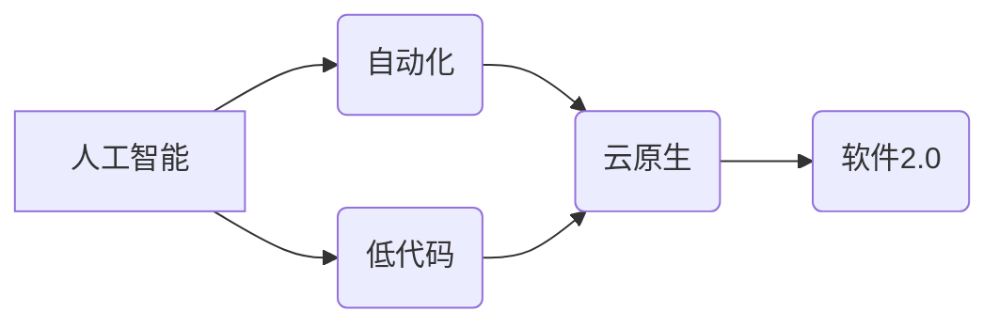

> 软件2.0,开发工具,人工智能,自动化,低代码,可视化编程,云原生,敏捷开发

## 1. 背景介绍

软件行业正处于一个前所未有的变革时期。随着人工智能、云计算、大数据等技术的快速发展，软件开发模式、工具和流程也随之发生着深刻的变化。传统的软件开发模式已经难以满足现代软件开发的需求，越来越多的企业和开发者开始寻求新的开发模式和工具。

软件1.0时代，软件开发主要依赖于人工编码，开发周期长、成本高、效率低。软件2.0时代，人工智能、自动化、低代码等技术将彻底改变软件开发模式，赋予开发者更强大的能力，加速软件开发进程。

## 2. 核心概念与联系

**2.1 软件2.0时代**

软件2.0时代是指以人工智能、自动化、低代码等技术为核心的软件开发新模式。其核心特点是：

* **智能化:** 利用人工智能技术，自动生成代码、测试用例、文档等，提高开发效率。
* **自动化:** 自动化构建、部署、测试等流程，减少人工干预，提高开发效率和稳定性。
* **低代码:** 通过可视化拖拽式开发工具，降低开发门槛，让非程序员也能参与软件开发。
* **云原生:** 基于云计算平台开发和部署软件，实现弹性伸缩、高可用性等优势。

**2.2 核心概念关系图**



**2.3 核心概念联系**

人工智能技术是软件2.0时代的核心驱动力，它为自动化、低代码等技术提供了强大的支持。自动化技术可以帮助开发者更高效地完成重复性工作，而低代码技术则降低了开发门槛，让更多人能够参与软件开发。云原生技术为软件2.0时代提供了强大的基础设施支持，使其能够实现弹性伸缩、高可用性等优势。

## 3. 核心算法原理 & 具体操作步骤

**3.1 算法原理概述**

在软件2.0时代，人工智能算法在软件开发各个环节发挥着重要作用。例如，代码生成算法可以根据用户需求自动生成代码，测试用例生成算法可以自动生成测试用例，代码优化算法可以自动优化代码性能。这些算法的原理主要基于机器学习、深度学习等技术。

**3.2 算法步骤详解**

以代码生成算法为例，其具体步骤如下：

1. **数据收集:** 收集大量的代码数据，包括代码结构、语法、语义等信息。
2. **数据预处理:** 对收集到的代码数据进行清洗、格式化等预处理工作。
3. **模型训练:** 利用机器学习算法，训练一个代码生成模型。
4. **代码生成:** 根据用户需求，输入相应的描述信息，模型会根据训练数据生成相应的代码。

**3.3 算法优缺点**

**优点:**

* 自动化代码生成，提高开发效率。
* 减少人工错误，提高代码质量。
* 降低开发门槛，让更多人参与软件开发。

**缺点:**

* 训练数据质量对算法性能影响较大。
* 生成的代码可能存在逻辑错误或安全漏洞。
* 算法难以处理复杂的需求场景。

**3.4 算法应用领域**

代码生成算法在软件开发各个领域都有广泛的应用，例如：

* **Web开发:** 自动生成网页代码、API接口代码等。
* **移动开发:** 自动生成Android、iOS应用程序代码。
* **数据科学:** 自动生成数据分析脚本、机器学习模型代码等。

## 4. 数学模型和公式 & 详细讲解 & 举例说明

**4.1 数学模型构建**

代码生成算法通常基于概率模型，例如条件概率分布。假设我们有一个训练数据集 D，包含代码片段和对应的描述信息。我们可以使用最大似然估计方法，学习一个条件概率分布 P(code|description)，其中 code 是代码片段，description 是对应的描述信息。

**4.2 公式推导过程**

最大似然估计的目标是找到一个参数 θ，使得在参数 θ 下，观察到的数据 D 的概率最大。

$$
P(D|\theta) = \prod_{i=1}^{N} P(code_i|description_i, \theta)
$$

其中，N 是训练数据的大小，code_i 和 description_i 分别是第 i 个代码片段和对应的描述信息。

为了找到最优参数 θ，我们需要对上述公式进行求导，并将其等于零。

**4.3 案例分析与讲解**

假设我们有一个训练数据集，包含以下代码片段和描述信息：

* 代码片段: `print("Hello, world!")`
* 描述信息: "打印一句话"

我们可以使用最大似然估计方法，学习一个条件概率分布 P(code|description)，其中 code 是代码片段，description 是对应的描述信息。

通过训练数据，我们可以得到一个概率分布，例如：

* P(print("Hello, world!")| "打印一句话") = 0.8

这意味着，在给定 "打印一句话" 描述信息的情况下，代码片段 `print("Hello, world!")` 的概率为 0.8。

## 5. 项目实践：代码实例和详细解释说明

**5.1 开发环境搭建**

为了实现代码生成功能，我们可以使用 Python 语言和 TensorFlow 库。

**5.2 源代码详细实现**

```python
import tensorflow as tf

# 定义模型
model = tf.keras.Sequential([
    tf.keras.layers.Embedding(input_dim=vocab_size, output_dim=embedding_dim),
    tf.keras.layers.LSTM(units=lstm_units),
    tf.keras.layers.Dense(units=vocab_size, activation='softmax')
])

# 编译模型
model.compile(optimizer='adam', loss='sparse_categorical_crossentropy', metrics=['accuracy'])

# 训练模型
model.fit(x_train, y_train, epochs=epochs)

# 代码生成
def generate_code(description):
    # 将描述信息转换为编码
    encoded_description = encoder(description)
    # 使用模型生成代码
    generated_code = model.predict(encoded_description)
    # 将编码转换为代码
    decoded_code = decoder(generated_code)
    return decoded_code
```

**5.3 代码解读与分析**

上述代码实现了一个简单的代码生成模型。模型使用 LSTM 网络结构，并采用 softmax 激活函数，输出每个字符的概率分布。

**5.4 运行结果展示**

在训练完成后，我们可以使用模型生成代码。例如，输入描述信息 "打印一个数字"，模型可能会生成代码片段 `print(123)`。

## 6. 实际应用场景

**6.1 代码生成**

代码生成工具可以帮助开发者快速生成代码，例如生成网页代码、API接口代码、数据库脚本等。

**6.2 测试用例生成**

测试用例生成工具可以自动生成测试用例，提高测试效率和覆盖率。

**6.3 文档生成**

文档生成工具可以自动生成代码文档，例如 API 文档、用户手册等。

**6.4 未来应用展望**

随着人工智能技术的不断发展，软件2.0时代将更加智能化、自动化。未来，代码生成工具将能够生成更复杂的代码，并支持更丰富的开发场景。

## 7. 工具和资源推荐

**7.1 学习资源推荐**

* **书籍:**
    * 《深度学习》
    * 《自然语言处理》
* **在线课程:**
    * Coursera: 深度学习
    * Udacity: 自然语言处理

**7.2 开发工具推荐**

* **GitHub Copilot:** 基于人工智能的代码生成工具
* **Tabnine:** 基于人工智能的代码补全工具
* **DeepCode:** 基于人工智能的代码缺陷检测工具

**7.3 相关论文推荐**

* **Attention Is All You Need**
* **BERT: Pre-training of Deep Bidirectional Transformers for Language Understanding**

## 8. 总结：未来发展趋势与挑战

**8.1 研究成果总结**

软件2.0时代，人工智能技术在软件开发各个环节发挥着越来越重要的作用。代码生成、测试用例生成、文档生成等工具已经开始应用于实际开发场景，并取得了显著的成果。

**8.2 未来发展趋势**

未来，软件2.0时代将更加智能化、自动化。人工智能技术将进一步融入软件开发流程，赋予开发者更强大的能力，加速软件开发进程。

**8.3 面临的挑战**

软件2.0时代也面临着一些挑战，例如：

* **数据安全:** 代码生成工具需要处理大量的代码数据，如何保证数据安全是一个重要问题。
* **算法可解释性:** 许多人工智能算法都是黑箱模型，难以解释其决策过程，这可能会导致开发者对生成的代码缺乏信任。
* **伦理问题:** 代码生成工具可能会被用于生成恶意代码，如何避免其被滥用是一个需要认真考虑的伦理问题。

**8.4 研究展望**

未来，我们需要继续研究人工智能技术在软件开发领域的应用，解决上述挑战，推动软件2.0时代的到来。

## 9. 附录：常见问题与解答

**9.1 Q: 代码生成工具生成的代码质量如何？**

**A:** 代码生成工具生成的代码质量取决于训练数据的质量和模型的复杂度。目前，代码生成工具生成的代码质量已经达到一定水平，但仍然存在一些问题，例如逻辑错误、安全漏洞等。

**9.2 Q: 代码生成工具会取代程序员吗？**

**A:** 代码生成工具可以帮助程序员提高开发效率，但不会取代程序员。程序员仍然需要负责软件的设计、架构、测试等工作。

**9.3 Q: 如何使用代码生成工具？**

**A:** 使用代码生成工具通常需要先进行一些配置，例如设置训练数据、模型参数等。然后，用户可以输入描述信息，工具会根据描述信息生成相应的代码。

作者：禅与计算机程序设计艺术 / Zen and the Art of Computer Programming


<end_of_turn>