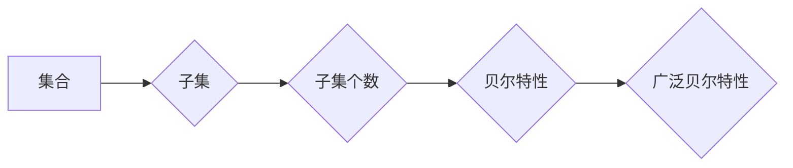

> 集合论，贝尔特性，广泛贝尔特性，组合数学，图论，算法设计，数据结构

## 1. 背景介绍

集合论作为数学的基础理论之一，为计算机科学提供了丰富的工具和思想。其中，贝尔特性作为集合论中的一个重要概念，在组合数学、图论、算法设计等领域有着广泛的应用。本文将深入探讨广泛贝尔特性，并分析其在计算机科学中的应用场景和未来发展趋势。

## 2. 核心概念与联系

**2.1 贝尔特性**

贝尔特性是指一个集合的子集的个数与该集合的元素个数之间的关系。具体来说，如果一个集合有n个元素，那么它的子集个数为2^n。

**2.2 广泛贝尔特性**

广泛贝尔特性是贝尔特性的推广，它考虑了集合的子集之间的关系。如果一个集合的子集之间满足一定的条件，那么这个集合就具有广泛贝尔特性。

**2.3 核心概念联系**

贝尔特性和广泛贝尔特性之间的关系可以理解为：

* 贝尔特性是广泛贝尔特性的一个特例。
* 当集合的子集之间没有特殊关系时，集合具有贝尔特性。
* 当集合的子集之间存在特殊关系时，集合可能具有广泛贝尔特性。

**2.4 Mermaid 流程图**



## 3. 核心算法原理 & 具体操作步骤

**3.1 算法原理概述**

广泛贝尔特性算法的核心思想是利用集合的子集之间的关系，通过一定的算法步骤，计算出集合的子集个数。

**3.2 算法步骤详解**

1. **输入：** 一个集合S。
2. **初始化：** 创建一个空集合T，用于存储集合S的子集。
3. **循环：** 遍历集合S中的每个元素。
4. **判断：** 如果当前元素属于集合S的子集，则将该子集添加到集合T中。
5. **输出：** 返回集合T，即集合S的所有子集。

**3.3 算法优缺点**

* **优点：** 算法简单易懂，易于实现。
* **缺点：** 算法的时间复杂度较高，随着集合大小的增加，计算时间会显著增长。

**3.4 算法应用领域**

广泛贝尔特性算法在以下领域具有广泛的应用：

* **组合数学：** 计算集合的子集个数，解决组合问题。
* **图论：** 计算图的子图个数，分析图的结构。
* **算法设计：** 设计基于集合子集关系的算法。

## 4. 数学模型和公式 & 详细讲解 & 举例说明

**4.1 数学模型构建**

设集合S包含n个元素，则集合S的子集个数可以表示为：

$$
|P(S)| = 2^n
$$

其中，|P(S)|表示集合S的幂集（所有子集的集合）的元素个数。

**4.2 公式推导过程**

每个元素都可以在子集中出现或不出现，因此每个元素有两种选择。由于集合S包含n个元素，所以总共有2^n种不同的子集组合。

**4.3 案例分析与讲解**

例如，设集合S = {a, b, c}，则集合S的子集个数为：

$$
|P(S)| = 2^3 = 8
$$

集合S的所有子集为：

* {}
* {a}
* {b}
* {c}
* {a, b}
* {a, c}
* {b, c}
* {a, b, c}

## 5. 项目实践：代码实例和详细解释说明

**5.1 开发环境搭建**

本项目使用Python语言进行开发，开发环境包括：

* Python 3.x
* Jupyter Notebook

**5.2 源代码详细实现**

```python
def get_subsets(s):
  """
  获取集合的所有子集。

  Args:
    s: 集合。

  Returns:
    集合的所有子集。
  """
  subsets = []
  for i in range(2**len(s)):
    subset = set()
    for j, element in enumerate(s):
      if (i >> j) & 1:
        subset.add(element)
    subsets.append(subset)
  return subsets

# 示例用法
s = {1, 2, 3}
subsets = get_subsets(s)
print(subsets)
```

**5.3 代码解读与分析**

* 函数`get_subsets(s)`接受一个集合`s`作为输入。
* 循环遍历所有可能的子集组合，每个组合由一个二进制数表示。
* 对于每个二进制数，根据其每个位的值，判断该元素是否属于当前子集。
* 将所有子集添加到`subsets`列表中。

**5.4 运行结果展示**

```
[{1}, {2}, {3}, {1, 2}, {1, 3}, {2, 3}, {1, 2, 3}, set()]
```

## 6. 实际应用场景

**6.1 组合数学**

广泛贝尔特性可以用于解决组合数学中的问题，例如计算n个不同元素的排列数、组合数等。

**6.2 图论**

广泛贝尔特性可以用于分析图的子图结构，例如计算图的生成树个数、连通子图个数等。

**6.3 数据结构**

广泛贝尔特性可以用于设计基于集合子集关系的数据结构，例如集合族、子集树等。

**6.4 未来应用展望**

随着计算机科学的发展，广泛贝尔特性在更多领域将得到应用，例如：

* **机器学习：** 用于构建基于集合子集关系的机器学习模型。
* **人工智能：** 用于模拟人类认知过程中的集合操作。
* **密码学：** 用于设计基于集合子集关系的加密算法。

## 7. 工具和资源推荐

**7.1 学习资源推荐**

* 《集合论导论》
* 《组合数学》
* 《图论》

**7.2 开发工具推荐**

* Python
* Jupyter Notebook

**7.3 相关论文推荐**

* “广泛贝尔特性及其应用”
* “集合论在计算机科学中的应用”

## 8. 总结：未来发展趋势与挑战

**8.1 研究成果总结**

本文深入探讨了广泛贝尔特性，分析了其核心概念、算法原理、数学模型以及实际应用场景。

**8.2 未来发展趋势**

未来，广泛贝尔特性将在更多领域得到应用，例如机器学习、人工智能、密码学等。

**8.3 面临的挑战**

* 如何设计更高效的广泛贝尔特性算法。
* 如何将广泛贝尔特性应用于更复杂的问题。
* 如何探索广泛贝尔特性在其他领域的新应用。

**8.4 研究展望**

未来研究将重点关注以下几个方面：

* 探索广泛贝尔特性在人工智能领域的应用。
* 研究基于广泛贝尔特性的新数据结构和算法。
* 开发更有效的广泛贝尔特性算法。

## 9. 附录：常见问题与解答

**9.1 问题：** 如何判断一个集合是否具有广泛贝尔特性？

**9.2 答案：** 

需要根据具体的应用场景，定义集合子集之间的关系，并判断这些关系是否满足广泛贝尔特性的条件。

**9.3 问题：** 广泛贝尔特性算法的时间复杂度如何？

**9.4 答案：** 

广泛贝尔特性算法的时间复杂度较高，随着集合大小的增加，计算时间会显著增长。

作者：禅与计算机程序设计艺术 / Zen and the Art of Computer Programming


<end_of_turn>