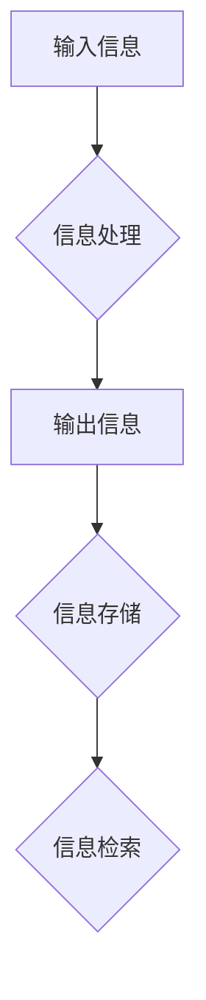

> 信息论，香农，图灵机，计算复杂度，算法效率，人工智能

## 1. 背景介绍

信息论作为现代通信和计算机科学的基础理论，为我们理解信息处理、存储和传输提供了强大的工具。而图灵机作为一种抽象的计算模型，奠定了计算机科学的理论基础。这两者看似独立，实则密不可分。香农的信息论为图灵机的运行提供了信息量的度量，而图灵机的计算能力则为信息论的应用提供了实质基础。

本篇文章将深入探讨香农的信息论与图灵机的联系，分析它们在计算机科学发展中的重要作用，并展望未来发展趋势。

## 2. 核心概念与联系

### 2.1 香农信息论

香农信息论的核心概念是“信息量”。信息量是指一个事件发生的可能性越低，其带来的信息量就越大。香农定义了信息量的度量单位为“比特”，1比特的信息量对应于一个二元事件（0或1）的确定性。

**信息熵**是衡量信息不确定性的度量，它反映了随机事件发生的不确定性程度。信息熵越大，信息的不确定性就越大。

### 2.2 图灵机

图灵机是一种抽象的计算模型，由一个无限长的带、一个读写头和一个状态机组成。它通过一系列的规则，在带上的符号上进行读写操作，从而实现计算。图灵机的计算能力被认为是所有可能的算法的极限，它可以模拟任何有效的算法。

### 2.3 联系

香农信息论为图灵机的运行提供了信息量的度量。图灵机通过一系列的计算步骤，将输入的信息转换为输出信息。每个计算步骤都涉及到信息的处理，例如：

* **输入信息:** 图灵机从输入带读取信息，这些信息可以被量化为比特数。
* **内部状态:** 图灵机的内部状态也包含信息，它决定了图灵机下一步的计算步骤。
* **输出信息:** 图灵机将计算结果写入输出带，这些信息也包含着信息量。

通过香农信息论的理论，我们可以量化图灵机在计算过程中处理的信息量，并分析其计算效率。

**Mermaid 流程图**



## 3. 核心算法原理 & 具体操作步骤

### 3.1 算法原理概述

图灵机的核心算法原理是基于状态机和符号操作的。它通过一系列的规则，在带上的符号上进行读写操作，从而实现计算。

* **状态机:** 图灵机的状态机由有限个状态组成，每个状态对应着特定的计算规则。
* **符号操作:** 图灵机的读写头可以读取带上的符号，并根据状态机规则进行相应的操作，例如：写入新的符号、移动读写头、改变状态机状态等。

### 3.2 算法步骤详解

1. **初始化:** 图灵机从初始状态开始，读写头指向带上的第一个符号。
2. **状态转移:** 根据当前状态和读写头读取的符号，图灵机根据状态转移规则进入下一个状态。
3. **符号操作:** 在新的状态下，图灵机根据状态转移规则进行符号操作，例如：写入新的符号、移动读写头等。
4. **重复步骤2和3:** 图灵机重复步骤2和3，直到达到终止状态。

### 3.3 算法优缺点

**优点:**

* **计算能力强大:** 图灵机可以模拟任何有效的算法，其计算能力被认为是所有可能的算法的极限。
* **理论基础完善:** 图灵机的理论基础完善，其计算模型和算法原理被广泛研究和应用。

**缺点:**

* **抽象性高:** 图灵机是一个抽象的计算模型，与实际计算机硬件存在一定的差距。
* **效率问题:** 图灵机的计算效率取决于具体的算法和输入数据，有些算法可能需要大量的计算步骤，导致效率低下。

### 3.4 算法应用领域

图灵机的算法原理广泛应用于计算机科学各个领域，例如：

* **编程语言设计:** 图灵机模型为编程语言的设计提供了理论基础。
* **算法分析:** 图灵机模型可以用来分析算法的复杂度和效率。
* **人工智能:** 图灵机的计算能力为人工智能的发展提供了理论基础。

## 4. 数学模型和公式 & 详细讲解 & 举例说明

### 4.1 数学模型构建

香农信息论的数学模型主要包括信息量、信息熵和联合熵等概念。

* **信息量:**  $$I(x) = -\log_2 P(x)$$
    其中，$x$ 是一个事件，$P(x)$ 是事件$x$发生的概率。
* **信息熵:** $$H(X) = -\sum_{x \in X} P(x) \log_2 P(x)$$
    其中，$X$ 是一个随机变量，$P(x)$ 是随机变量$X$取值为$x$的概率。

### 4.2 公式推导过程

信息熵的推导过程如下：

1. 对于一个随机变量$X$，其所有可能的取值构成了一个集合$X$。
2. 每个取值$x$ 都有一个对应的概率$P(x)$。
3. 信息量$I(x)$ 是事件$x$发生的概率的负对数。
4. 信息熵$H(X)$ 是所有事件的信息量的加权平均，权重为事件发生的概率。

### 4.3 案例分析与讲解

**例子:** 考虑一个随机变量$X$，它可以取值为“正面”或“反面”，概率分别为0.5和0.5。

* 信息量: $I(正面) = -\log_2 0.5 = 1$，$I(反面) = 1$
* 信息熵: $H(X) = - (0.5 \log_2 0.5 + 0.5 \log_2 0.5) = 1$

这个例子说明，当随机变量的概率分布均匀时，其信息熵最大。

## 5. 项目实践：代码实例和详细解释说明

### 5.1 开发环境搭建

本项目使用Python语言进行开发，需要安装Python环境和相关库。

* Python环境: https://www.python.org/downloads/
* 库: numpy, matplotlib

### 5.2 源代码详细实现

```python
import numpy as np
import matplotlib.pyplot as plt

# 定义一个随机变量X，它可以取值为0或1，概率分别为0.5和0.5
X = np.random.choice([0, 1], size=1000, p=[0.5, 0.5])

# 计算信息熵
entropy = -np.sum(X * np.log2(X) + (1 - X) * np.log2(1 - X))

# 打印信息熵
print("信息熵:", entropy)

# 绘制概率分布图
plt.hist(X, bins=2, edgecolor='black')
plt.xlabel("X")
plt.ylabel("频率")
plt.title("随机变量X的概率分布")
plt.show()
```

### 5.3 代码解读与分析

* 代码首先定义了一个随机变量$X$，它可以取值为0或1，概率分别为0.5和0.5。
* 然后，代码计算了随机变量$X$的信息熵。
* 最后，代码绘制了随机变量$X$的概率分布图。

### 5.4 运行结果展示

运行代码后，会输出随机变量$X$的信息熵值，以及其概率分布图。

## 6. 实际应用场景

香农信息论和图灵机的理论在实际应用场景中有着广泛的应用。

### 6.1 通信领域

* **数据压缩:** 利用香农信息论的原理，可以对数据进行压缩，减少存储空间和传输带宽。
* **信道编码:** 利用香农限，设计信道编码方案，提高数据传输的可靠性。

### 6.2 计算领域

* **算法分析:** 利用图灵机的计算模型，可以分析算法的复杂度和效率。
* **人工智能:** 图灵机的计算能力为人工智能的发展提供了理论基础，例如：机器学习、自然语言处理等。

### 6.3 其他领域

* **生物信息学:** 利用香农信息论的原理，可以分析生物序列的信息含量。
* **社会科学:** 利用信息论的原理，可以分析社会网络的信息传播规律。

### 6.4 未来应用展望

随着信息技术的不断发展，香农信息论和图灵机的理论将在更多领域得到应用。例如：

* **量子信息论:** 将香农信息论的原理应用于量子计算领域。
* **脑科学:** 利用图灵机的计算模型，研究大脑的计算机制。

## 7. 工具和资源推荐

### 7.1 学习资源推荐

* **书籍:**
    * 《信息论基础》 - 
    * 《图灵机与算法》 - 
* **在线课程:**
    * Coursera: Information Theory
    * edX: Introduction to Computer Science and Programming Using Python

### 7.2 开发工具推荐

* **Python:** https://www.python.org/
* **NumPy:** https://numpy.org/
* **Matplotlib:** https://matplotlib.org/

### 7.3 相关论文推荐

* **香农的“通信的数学理论”:** https://ieeexplore.ieee.org/document/6793709
* **图灵的“计算机器与智能”:** https://www.jstor.org/stable/233253

## 8. 总结：未来发展趋势与挑战

### 8.1 研究成果总结

香农信息论和图灵机的研究成果为计算机科学的发展做出了巨大贡献。它们为我们理解信息处理、存储和传输提供了理论基础，并为人工智能、通信、计算等领域的发展提供了重要的理论工具。

### 8.2 未来发展趋势

未来，香农信息论和图灵机的研究将朝着以下方向发展：

* **量子信息论:** 将香农信息论的原理应用于量子计算领域。
* **脑科学:** 利用图灵机的计算模型，研究大脑的计算机制。
* **人工智能:** 利用图灵机的计算能力，开发更智能的人工智能系统。

### 8.3 面临的挑战

香农信息论和图灵机的研究也面临着一些挑战：

* **量子计算的理论基础:** 量子信息论的理论基础尚不完善，需要进一步研究。
* **大脑的复杂性:** 大脑的计算机制非常复杂，利用图灵机的模型对其进行研究仍然面临着很大的挑战。
* **人工智能的伦理问题:** 人工智能的发展可能会带来一些伦理问题，需要我们认真思考和解决。

### 8.4 研究展望

尽管面临着挑战，但香农信息论和图灵机的研究仍然充满着希望。随着科学技术的不断发展，我们相信，这些研究将会为人类社会带来更多的福祉。

## 9. 附录：常见问题与解答

### 9.1 什么是香农信息论？

香农信息论是信息处理、存储和传输的理论基础，它为我们理解信息量的度量、信息熵、信道编码等概念提供了理论框架。

### 9.2 什么是图灵机？

图灵机是一种抽象的计算模型，它可以模拟任何有效的算法，其计算能力被认为是所有可能的算法的极限。

### 9.3 香农信息论和图灵机有什么联系？

香农信息论为图灵机的运行提供了信息量的度量，而图灵机的计算能力则为信息论的应用提供了实质基础。

### 9.4 香农信息论和图灵机的应用领域有哪些？

香农信息论和图灵机的应用领域非常广泛，包括通信、计算、生物信息学、社会科学等。

### 9.5 未来香农信息论和图灵机研究的趋势是什么？

未来，香农信息论和图灵机的