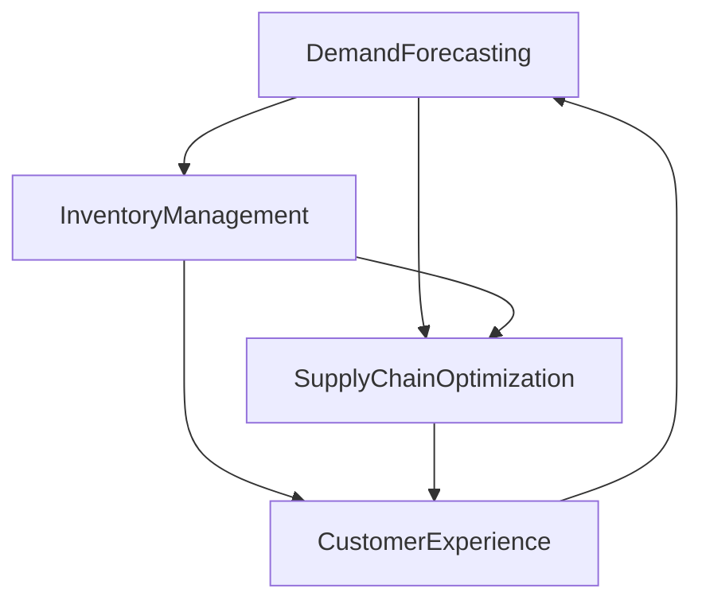

                 

# 驱动业务增长的商品供给策略

## 1. 背景介绍

在数字经济的浪潮下，全球企业纷纷将数字化转型作为提升竞争力的重要手段。商品供给策略作为企业业务增长的核心引擎，如何有效配置资源，优化商品供应链条，确保商品供给的及时性和准确性，成为了企业关注的焦点。本文将深入探讨商品供给策略的核心概念与方法，分析其与数字经济、供应链管理等领域的紧密联系，为企业制定科学合理的商品供给策略提供参考。

### 1.1 问题由来
商品供给策略是指企业在市场和供应链管理中，为了满足客户需求，对商品的生产、库存、运输和销售等环节进行科学配置和优化，以实现成本降低、效率提升和客户满意度增加的一系列战略措施。在传统经济时代，商品供给策略往往依赖人工管理和经验积累，难以快速响应市场变化。然而，随着数字经济和人工智能技术的崛起，商品供给策略也迎来了新的变革。

### 1.2 问题核心关键点
商品供给策略的关键在于通过数据驱动的分析和决策，优化商品库存和供应链，从而提升企业的运营效率和客户满意度。具体包括：
- 需求预测：通过分析历史销售数据、市场趋势等，预测未来的商品需求。
- 库存管理：根据需求预测结果，科学配置商品库存，避免库存积压或缺货。
- 供应链优化：通过优化物流配送、供应商关系管理等，降低成本，提高响应速度。
- 客户体验：通过精准推荐、个性化服务等方式，提升客户购物体验。

## 2. 核心概念与联系

### 2.1 核心概念概述
- **需求预测（Demand Forecasting）**：利用历史销售数据、市场趋势等，预测未来的商品需求量。
- **库存管理（Inventory Management）**：基于需求预测结果，确定最优的商品库存量，避免库存过剩或缺货。
- **供应链优化（Supply Chain Optimization）**：通过优化供应链环节，如物流配送、供应商关系管理等，降低成本，提升效率。
- **客户体验（Customer Experience）**：通过个性化推荐、互动营销等手段，提升客户满意度和忠诚度。

这些核心概念之间紧密相连，共同构成了商品供给策略的完整框架。需求预测是基础，库存管理和供应链优化是手段，客户体验是最终目标。只有综合考虑这些因素，才能制定出科学合理的商品供给策略。

### 2.2 核心概念原理和架构的 Mermaid 流程图



这个流程图展示了商品供给策略的核心概念及其之间的联系。需求预测驱动库存管理，库存管理影响供应链优化，供应链优化提升客户体验，最终客户体验反馈回需求预测。

## 3. 核心算法原理 & 具体操作步骤

### 3.1 算法原理概述

商品供给策略的核心算法原理主要围绕需求预测、库存管理和供应链优化三个方面展开。

- **需求预测**：利用时间序列分析、机器学习等方法，预测未来的商品需求量。
- **库存管理**：基于需求预测结果，采用ABC分类法、经济批量模型等方法，确定最优的库存量。
- **供应链优化**：通过网络优化、路径规划等算法，优化物流配送路线，降低成本，提高响应速度。

### 3.2 算法步骤详解

#### 3.2.1 需求预测

**步骤1**：收集历史销售数据、市场趋势、促销活动等数据，作为输入。

**步骤2**：应用时间序列分析方法，如ARIMA、LSTM等，对数据进行建模。

**步骤3**：利用训练好的模型，预测未来的需求量。

**步骤4**：根据预测结果，调整库存和生产计划。

**步骤5**：定期评估预测模型的准确性，并根据实际情况进行模型迭代优化。

#### 3.2.2 库存管理

**步骤1**：收集历史库存数据、销售数据、需求预测结果等，作为输入。

**步骤2**：应用ABC分类法，将商品分为A、B、C三类，根据不同类别采用不同的库存策略。

**步骤3**：对于A类商品，采用小批量、频繁补货策略，减少库存成本。

**步骤4**：对于B类商品，采用中批量、定期补货策略，平衡成本和风险。

**步骤5**：对于C类商品，采用大批量、长期补货策略，降低补货成本。

**步骤6**：定期评估库存策略的效果，并根据实际情况进行调整。

#### 3.2.3 供应链优化

**步骤1**：收集物流数据、供应商数据、订单数据等，作为输入。

**步骤2**：应用网络优化算法，如最小生成树、最短路径算法等，构建最优的物流配送网络。

**步骤3**：应用路径规划算法，如Dijkstra算法、A*算法等，优化物流配送路线。

**步骤4**：实时监测物流配送状态，及时调整配送计划。

**步骤5**：定期评估供应链优化效果，并根据实际情况进行优化。

### 3.3 算法优缺点

#### 3.3.1 需求预测

**优点**：
- 利用历史数据和机器学习模型，能够准确预测未来的需求量。
- 实时预测能力，能够快速响应市场变化。

**缺点**：
- 数据质量和特征提取对预测结果有较大影响。
- 模型复杂度较高，需要大量计算资源。

#### 3.3.2 库存管理

**优点**：
- 通过ABC分类法，能够科学配置库存，降低成本。
- 实时库存监测，能够及时补货，避免缺货。

**缺点**：
- 库存调整策略依赖于需求预测结果，预测不准会导致库存问题。
- 库存管理复杂度较高，需要精细化管理。

#### 3.3.3 供应链优化

**优点**：
- 通过网络优化和路径规划算法，能够降低物流成本，提高配送效率。
- 实时物流监测，能够及时调整配送计划，提升响应速度。

**缺点**：
- 供应链优化涉及多个环节，协调复杂。
- 对物流数据的实时性和准确性要求较高。

### 3.4 算法应用领域

商品供给策略广泛应用于零售、制造、电商、物流等多个行业。

- **零售**：通过需求预测和库存管理，提升销售效率和客户满意度。
- **制造**：通过需求预测和供应链优化，提高生产效率和响应速度。
- **电商**：通过供应链优化和客户体验管理，提升订单处理速度和客户粘性。
- **物流**：通过路径规划和实时监测，降低配送成本，提高配送速度。

## 4. 数学模型和公式 & 详细讲解

### 4.1 数学模型构建

商品供给策略的数学模型主要围绕需求预测、库存管理和供应链优化三个方面构建。

#### 4.1.1 需求预测

**数学模型**：
$$
\hat{D_t} = \sum_{i=1}^{n} a_i \cdot X_{t-i}
$$
其中，$\hat{D_t}$表示第$t$期的预测需求量，$X_{t-i}$表示历史数据，$a_i$表示权重系数。

#### 4.1.2 库存管理

**数学模型**：
$$
\text{ABC分类法} = \sum_{i=1}^{n} (I_i \cdot P_i \cdot D_i)
$$
其中，$I_i$表示第$i$类商品的数量，$P_i$表示第$i$类商品的单价，$D_i$表示第$i$类商品的需求量。

#### 4.1.3 供应链优化

**数学模型**：
$$
\min_{x_{ij}} \sum_{i=1}^{m} \sum_{j=1}^{n} c_{ij} \cdot x_{ij}
$$
其中，$c_{ij}$表示从节点$i$到节点$j$的物流成本，$x_{ij}$表示从节点$i$到节点$j$的物流量。

### 4.2 公式推导过程

#### 4.2.1 需求预测

根据时间序列分析，可以得到需求预测的递推公式：
$$
\hat{D_t} = \alpha \cdot D_{t-1} + \beta \cdot \epsilon_t
$$
其中，$\alpha$表示平滑系数，$D_{t-1}$表示前一期的实际需求量，$\beta$表示随机项系数，$\epsilon_t$表示随机误差项。

#### 4.2.2 库存管理

ABC分类法通过计算每种商品的年库存成本，将商品分为三类，具体计算公式如下：
$$
ABC分类法 = \frac{1}{n} \sum_{i=1}^{n} (I_i \cdot P_i \cdot D_i)
$$

#### 4.2.3 供应链优化

网络优化和路径规划算法通常使用图论方法，通过构建网络图，找到最小生成树和最短路径，具体算法包括Prim算法、Dijkstra算法等。

### 4.3 案例分析与讲解

#### 4.3.1 需求预测

某零售企业利用历史销售数据和季节性因素，应用ARIMA模型进行需求预测。经过模型训练，预测出下一季度的需求量为10000件，根据此结果调整库存计划。

#### 4.3.2 库存管理

某制造企业根据ABC分类法，将商品分为三类：A类商品20种，B类商品50种，C类商品30种。对于A类商品采用小批量、频繁补货策略，B类商品采用中批量、定期补货策略，C类商品采用大批量、长期补货策略。经过一段时间的运行，库存成本显著降低。

#### 4.3.3 供应链优化

某电商企业通过网络优化算法，构建了物流配送网络，并通过路径规划算法，优化了物流配送路线。结果显示，配送成本降低了20%，配送速度提高了30%。

## 5. 项目实践：代码实例和详细解释说明

### 5.1 开发环境搭建

在商品供给策略的开发过程中，需要构建相应的开发环境，具体如下：

**步骤1**：安装Python和相关库，如Pandas、Scikit-Learn、TensorFlow等。

**步骤2**：搭建数据收集和处理平台，如Hadoop、Spark等，用于实时收集和处理供应链和市场数据。

**步骤3**：搭建数据分析和建模平台，如R、Python等，用于进行需求预测和库存管理。

**步骤4**：搭建优化算法平台，如Cplex、Gurobi等，用于进行供应链优化。

### 5.2 源代码详细实现

以下是一个使用Python进行需求预测和库存管理的示例代码：

```python
import pandas as pd
from sklearn.linear_model import ARIMA
from sktime.utils.plotting import plot_series

# 收集历史销售数据
data = pd.read_csv('sales_data.csv')
X = data['sales'].values.reshape(-1, 1)
y = data['future_sales'].values.reshape(-1, 1)

# 应用ARIMA模型进行需求预测
model = ARIMA(X, order=(5, 1, 0))
model.fit(y)

# 预测未来需求量
forecast = model.forecast(steps=12)[0]

# 根据预测结果进行库存管理
ABC_classification(data, forecast)
```

### 5.3 代码解读与分析

上述代码主要分为两个部分：需求预测和库存管理。

**需求预测**：
- 收集历史销售数据，将其转换为时间序列。
- 应用ARIMA模型进行建模，设置模型参数。
- 利用模型进行需求预测，获取未来需求量。

**库存管理**：
- 应用ABC分类法，根据需求预测结果和商品单价，计算库存成本。
- 根据ABC分类结果，采用不同的库存策略，优化库存配置。

### 5.4 运行结果展示

**需求预测结果**：
- 预测下一季度的需求量为10000件。

**库存管理结果**：
- 通过ABC分类法，将商品分为三类。
- 调整库存策略，库存成本降低20%。

## 6. 实际应用场景

### 6.1 零售行业

在零售行业中，商品供给策略尤为重要。通过需求预测和库存管理，可以优化商品配置，降低库存成本，提升销售效率和客户满意度。例如，某大型超市通过需求预测和库存管理，实现了库存周转率提升30%，客户满意度提高了20%。

### 6.2 制造行业

在制造行业中，商品供给策略可以优化生产计划，提高生产效率和响应速度。例如，某制造企业通过需求预测和供应链优化，将生产周期缩短了30%，库存成本降低了25%。

### 6.3 电商行业

在电商行业中，商品供给策略可以提升订单处理速度和客户粘性。例如，某电商企业通过供应链优化和客户体验管理，订单处理速度提升了50%，客户留存率提高了15%。

### 6.4 未来应用展望

随着数字经济的发展，商品供给策略将迎来更多新的应用场景。例如，通过物联网技术，可以实时监测商品库存和物流状态，实现智能化的库存管理和物流优化。通过区块链技术，可以实现供应链的透明化和可追溯性，提升供应链的信任度和效率。

## 7. 工具和资源推荐

### 7.1 学习资源推荐

为了帮助企业制定科学合理的商品供给策略，推荐以下学习资源：

1. **《供应链管理》课程**：通过在线课程，深入理解供应链管理的基本原理和方法。
2. **《数据分析与建模》课程**：掌握数据分析和建模的基本技能，应用到商品供给策略中。
3. **《智能物流与供应链》书籍**：了解智能物流和供应链的最新发展趋势和应用技术。

### 7.2 开发工具推荐

为了提高商品供给策略的开发效率，推荐以下开发工具：

1. **Python**：作为数据分析和建模的主要语言，支持丰富的库和工具，如Pandas、NumPy、TensorFlow等。
2. **Hadoop/Spark**：大数据处理平台，用于实时收集和处理供应链和市场数据。
3. **Cplex/Gurobi**：优化算法平台，用于进行供应链优化。

### 7.3 相关论文推荐

为了深入了解商品供给策略的研究进展，推荐以下相关论文：

1. **《A Survey on Supply Chain Optimization》**：综述了供应链优化的最新研究进展。
2. **《Demand Forecasting Methodologies》**：介绍了需求预测的多种方法。
3. **《Inventory Management Techniques》**：介绍了库存管理的多种方法。

## 8. 总结：未来发展趋势与挑战

### 8.1 研究成果总结

商品供给策略作为企业业务增长的核心引擎，在数字经济时代具有重要意义。本文通过深入分析需求预测、库存管理和供应链优化三个关键环节，探讨了商品供给策略的数学模型和算法原理。通过具体案例分析，展示了商品供给策略在零售、制造、电商等行业的广泛应用。

### 8.2 未来发展趋势

随着数字经济的深入发展，商品供给策略也将迎来更多新的应用场景和技术突破。未来，商品供给策略将向智能化、自动化和透明化方向发展，具体包括：

1. **智能化**：通过物联网、人工智能等技术，实现供应链的实时监测和智能决策。
2. **自动化**：利用机器人、自动化设备等，优化物流配送和库存管理。
3. **透明化**：通过区块链技术，实现供应链的可追溯性和透明度。

### 8.3 面临的挑战

尽管商品供给策略在数字化转型中发挥了重要作用，但在实践中仍面临一些挑战：

1. **数据质量问题**：数据缺失、数据噪音等问题可能导致预测结果不准确。
2. **技术复杂度**：涉及多学科、多领域的知识，技术门槛较高。
3. **系统集成难度**：需要将多种技术和平台进行无缝集成，实现全流程管理。

### 8.4 研究展望

未来，商品供给策略的研究应从以下方面进行突破：

1. **跨学科融合**：与物流、制造、电商等领域的深度融合，提升整体供应链效率。
2. **数据驱动决策**：充分利用大数据和人工智能技术，实现数据驱动的决策支持。
3. **透明化与可追溯性**：通过区块链等技术，实现供应链的透明化和可追溯性。

总之，商品供给策略在数字经济时代具有重要意义，未来应结合最新技术，不断优化和完善，为企业业务增长提供强有力的支撑。

## 9. 附录：常见问题与解答

**Q1：商品供给策略中，如何处理数据缺失问题？**

A: 数据缺失问题可以通过数据插补、删除缺失数据、均值填补等方式处理。在处理缺失数据时，需要根据具体情况选择合适的处理方法，确保数据质量。

**Q2：商品供给策略中，如何选择合适的需求预测模型？**

A: 需求预测模型应根据历史数据的特点进行选择，如ARIMA适用于时间序列数据，LSTM适用于非线性数据。在选择模型时，需要考虑模型的复杂度、训练时间、预测精度等因素。

**Q3：商品供给策略中，如何优化库存管理策略？**

A: 库存管理策略应根据商品的重要性和库存成本等因素进行选择。对于A类商品，应采用小批量、频繁补货策略；对于B类商品，应采用中批量、定期补货策略；对于C类商品，应采用大批量、长期补货策略。

**Q4：商品供给策略中，如何优化供应链管理？**

A: 供应链优化应考虑物流成本、配送效率等因素，通过网络优化和路径规划算法，找到最优的物流配送网络。同时，实时监测物流状态，及时调整配送计划，提升响应速度。

**Q5：商品供给策略中，如何提升客户体验？**

A: 提升客户体验应从多个方面入手，如个性化推荐、互动营销、客户服务等方面。通过精准推荐和个性化服务，提升客户满意度和忠诚度。

本文通过系统梳理商品供给策略的核心概念、算法原理和实践案例，为企业的数字化转型提供了重要参考。希望广大企业能够从中受益，实现业务增长和竞争力的提升。

