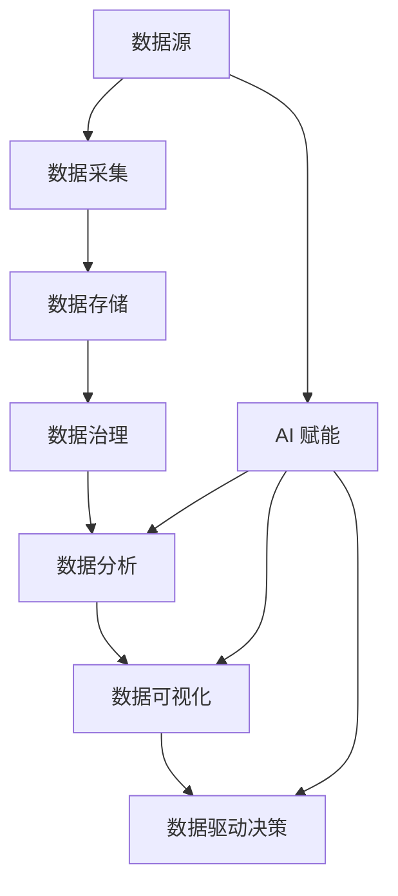

                 

- 数据中台（Data Mesh）
- 数据分析（Data Analysis）
- 数据洞察（Data Insights）
- AI 赋能（AI Empowerment）
- 数据治理（Data Governance）
- 数据可视化（Data Visualization）
- 数据驱动决策（Data-Driven Decision Making）

## 1. 背景介绍

在当今数据爆炸式增长的时代，企业面临着海量数据的挑战。如何有效地管理、分析和利用这些数据，以获取有价值的洞察并驱动决策，已成为企业成功的关键。数据中台（Data Mesh）应运而生，旨在提供一个统一的数据平台，帮助企业实现数据治理、数据分析和数据驱动决策。

本文将深入探讨数据中台在数据分析和洞察中的作用，并提供实践指南，帮助读者构建和利用数据中台以提高企业的数据能力。

## 2. 核心概念与联系

### 2.1 数据中台架构

数据中台的核心架构如下图所示：



### 2.2 数据中台核心概念

- **数据采集（Data Ingestion）**：从各种数据源收集数据。
- **数据存储（Data Storage）**：存储和管理收集到的数据。
- **数据治理（Data Governance）**：确保数据的质量、安全和合规性。
- **数据分析（Data Analysis）**：从数据中提取有价值的信息和洞察。
- **数据可视化（Data Visualization）**：通过可视化工具将数据分析结果直观地展示出来。
- **数据驱动决策（Data-Driven Decision Making）**：基于数据分析结果做出明智的决策。
- **AI 赋能（AI Empowerment）**：利用人工智能技术增强数据分析和可视化的能力。

## 3. 核心算法原理 & 具体操作步骤

### 3.1 算法原理概述

数据中台的核心算法原理是基于机器学习和深度学习的数据分析算法。这些算法旨在从数据中提取有价值的信息和洞察，并帮助企业做出数据驱动的决策。

### 3.2 算法步骤详解

1. **数据预处理**：清洗、转换和标准化数据，以便于分析。
2. **特征工程**：提取和选择有助于模型学习的特征。
3. **模型选择**：选择适合数据和业务需求的机器学习或深度学习模型。
4. **模型训练**：使用预处理后的数据训练模型。
5. **模型评估**：评估模型的性能和准确性。
6. **模型部署**：将模型部署到生产环境中，以便于预测和决策。

### 3.3 算法优缺点

**优点**：

- 提高数据分析的准确性和效率。
- 发现数据中的隐藏模式和关系。
- 支持数据驱动的决策。

**缺点**：

- 算法复杂性高，需要专业的数据科学家。
- 算法训练需要大量的数据和计算资源。
- 算法结果解释性差，难以理解和信任。

### 3.4 算法应用领域

数据中台的核心算法广泛应用于各个领域，包括：

- 客户分析：预测客户行为，提高客户忠诚度和满意度。
- 财务分析：预测销售额，优化成本结构。
- 运营分析：优化供应链，提高运营效率。
- 安全分析：检测异常活动，预防安全威胁。

## 4. 数学模型和公式 & 详细讲解 & 举例说明

### 4.1 数学模型构建

数据中台的数学模型通常基于统计学和机器学习理论构建。以下是一些常用的数学模型：

- **线性回归**：用于预测连续变量，如销售额。
- **逻辑回归**：用于预测二进制变量，如客户流失风险。
- **决策树**：用于预测类别变量，如客户segments。
- **支持向量机（SVM）**：用于分类和回归任务，如异常检测。
- **神经网络**：用于复杂的预测任务，如图像和语音识别。

### 4.2 公式推导过程

以线性回归为例，其数学模型如下：

$$y = β_0 + β_1x_1 + β_2x_2 +... + β_nx_n + ε$$

其中：

- $y$ 是目标变量，
- $β_0, β_1, β_2,..., β_n$ 是模型参数，
- $x_1, x_2,..., x_n$ 是特征变量，
- $ε$ 是误差项。

模型参数可以通过最小化误差平方和的方法来估计：

$$\hat{β} = (X^TX)^{-1}X^Ty$$

其中：

- $X$ 是特征矩阵，
- $y$ 是目标变量向量。

### 4.3 案例分析与讲解

假设我们想要预测客户流失风险。我们可以使用逻辑回归模型，其中目标变量是客户流失（1）或留存（0），特征变量是客户的年龄、收入、客户忠诚度等。

模型的数学表达式为：

$$P(y=1) = \frac{1}{1 + e^{-(β_0 + β_1x_1 + β_2x_2 +... + β_nx_n)}}$$

其中：

- $P(y=1)$ 是客户流失的概率，
- $β_0, β_1, β_2,..., β_n$ 是模型参数，
- $x_1, x_2,..., x_n$ 是特征变量。

通过训练数据，我们可以估计模型参数，并使用模型预测客户流失风险。

## 5. 项目实践：代码实例和详细解释说明

### 5.1 开发环境搭建

数据中台项目需要以下开发环境：

- **编程语言**：Python（推荐）或 R。
- **数据库**：PostgreSQL、MySQL 等。
- **数据处理库**：Pandas、NumPy 等。
- **机器学习库**：Scikit-learn、TensorFlow、PyTorch 等。
- **数据可视化库**：Matplotlib、Seaborn、Plotly 等。

### 5.2 源代码详细实现

以下是一个简单的线性回归示例，使用 Python 和 Scikit-learn 实现：

```python
import pandas as pd
from sklearn.model_selection import train_test_split
from sklearn.linear_model import LinearRegression
from sklearn.metrics import mean_squared_error

# 加载数据
data = pd.read_csv('sales_data.csv')

# 分割数据
X = data[['advertising', 'promotion']]
y = data['sales']
X_train, X_test, y_train, y_test = train_test_split(X, y, test_size=0.2, random_state=42)

# 训练模型
model = LinearRegression()
model.fit(X_train, y_train)

# 预测
y_pred = model.predict(X_test)

# 评估模型
mse = mean_squared_error(y_test, y_pred)
print(f'Mean Squared Error: {mse}')
```

### 5.3 代码解读与分析

- 我们首先加载数据，并将其分为特征变量（广告和促销）和目标变量（销售额）。
- 我们使用 `train_test_split` 函数将数据分为训练集和测试集。
- 我们使用 `LinearRegression` 类训练模型，并使用训练集数据拟合模型。
- 我们使用测试集数据预测销售额，并使用 `mean_squared_error` 函数评估模型的性能。

### 5.4 运行结果展示

运行代码后，我们可以看到模型的均方误差（Mean Squared Error），这表示模型预测的销售额与实际销售额之间的误差。

## 6. 实际应用场景

数据中台在各个行业都有广泛的应用，以下是一些实际应用场景：

### 6.1 金融行业

- **信用风险评估**：使用数据中台预测客户的信用风险，以帮助金融机构做出明智的贷款决策。
- **欺诈检测**：使用数据中台检测异常交易，以防止金融欺诈。

### 6.2 电商行业

- **客户segments**：使用数据中台将客户分为不同的segments，以进行个性化营销。
- **库存优化**：使用数据中台预测销售需求，以优化库存管理。

### 6.3 健康医疗行业

- **疾病预测**：使用数据中台预测患者的疾病风险，以进行早期干预。
- **药物开发**：使用数据中台帮助药物开发，以发现新的药物和疗法。

### 6.4 未来应用展望

随着数据量的不断增长和人工智能技术的不断发展，数据中台的应用将会更加广泛。未来，数据中台将会帮助企业实现实时数据分析和洞察，并支持企业做出更明智的决策。

## 7. 工具和资源推荐

### 7.1 学习资源推荐

- **在线课程**：Coursera、Udacity、edX 等平台上的数据分析和机器学习课程。
- **书籍**："Python for Data Analysis"、 "Hands-On Machine Learning with Scikit-Learn, Keras, and TensorFlow" 等。
- **博客**：KDnuggets、Towards Data Science 等数据分析和机器学习博客。

### 7.2 开发工具推荐

- **数据库**：PostgreSQL、MySQL、MongoDB 等。
- **数据处理**：Pandas、NumPy、Spark 等。
- **机器学习**：Scikit-learn、TensorFlow、PyTorch 等。
- **数据可视化**：Matplotlib、Seaborn、Plotly 等。
- **数据中台平台**：Alation、Erwin、Talend 等。

### 7.3 相关论文推荐

- "Data Mesh: The Modern Data Architecture"（Zhamak Dehghani）
- "Data-Driven Decision Making: A Practical Guide"（Thomas Redman）
- "Data Science for Business"（Foster Provost and Tom Fawcett）

## 8. 总结：未来发展趋势与挑战

### 8.1 研究成果总结

本文介绍了数据中台在数据分析和洞察中的作用，并提供了实践指南，帮助读者构建和利用数据中台以提高企业的数据能力。我们讨论了数据中台的核心概念和架构，并提供了数学模型和算法的详细讲解。我们还提供了项目实践示例，并介绍了数据中台的实际应用场景。

### 8.2 未来发展趋势

未来，数据中台将会朝着以下方向发展：

- **实时数据分析**：随着数据量的不断增长，企业需要实时数据分析和洞察，以支持实时决策。
- **自动化数据治理**：数据治理将会更加自动化，以帮助企业管理和治理海量数据。
- **AI 赋能**：人工智能技术将会更广泛地应用于数据分析和可视化，以增强企业的数据能力。

### 8.3 面临的挑战

数据中台面临的挑战包括：

- **数据质量**：数据质量差会导致数据分析结果不准确，企业需要投入大量资源来确保数据质量。
- **数据安全**：数据安全是企业面临的重大挑战，企业需要采取措施来保护数据安全。
- **数据治理**：数据治理是数据中台的关键，企业需要建立严格的数据治理流程。

### 8.4 研究展望

未来的研究将会关注以下领域：

- **数据中台的标准化**：数据中台的标准化将会帮助企业更轻松地构建和管理数据中台。
- **数据中台的可解释性**：数据中台的可解释性将会帮助企业更好地理解和信任数据分析结果。
- **数据中台的隐私保护**：数据中台的隐私保护将会帮助企业保护数据安全和隐私。

## 9. 附录：常见问题与解答

**Q1：什么是数据中台？**

数据中台是一个统一的数据平台，帮助企业实现数据治理、数据分析和数据驱动决策。

**Q2：数据中台的核心概念是什么？**

数据中台的核心概念包括数据采集、数据存储、数据治理、数据分析、数据可视化、数据驱动决策和 AI 赋能。

**Q3：数据中台的核心算法是什么？**

数据中台的核心算法是基于机器学习和深度学习的数据分析算法，如线性回归、逻辑回归、决策树、支持向量机和神经网络。

**Q4：数据中台的数学模型是什么？**

数据中台的数学模型通常基于统计学和机器学习理论构建，如线性回归、逻辑回归、决策树、支持向量机和神经网络。

**Q5：数据中台的实际应用场景是什么？**

数据中台在各个行业都有广泛的应用，如金融行业的信用风险评估和欺诈检测，电商行业的客户segments 和库存优化，健康医疗行业的疾病预测和药物开发。

**Q6：数据中台的未来发展趋势是什么？**

数据中台的未来发展趋势包括实时数据分析、自动化数据治理和 AI 赋能。

**Q7：数据中台面临的挑战是什么？**

数据中台面临的挑战包括数据质量、数据安全和数据治理。

**Q8：数据中台的研究展望是什么？**

数据中台的研究展望包括数据中台的标准化、数据中台的可解释性和数据中台的隐私保护。

!!!Note
作者：禅与计算机程序设计艺术 / Zen and the Art of Computer Programming

