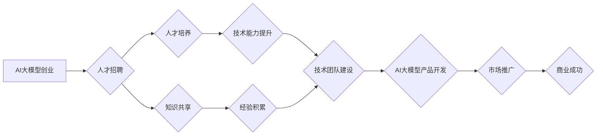

> AI大模型，创业，人才优势，技术团队，人才培养，知识共享，项目管理，风险控制

## 1. 背景介绍

近年来，人工智能（AI）技术突飞猛进，特别是大模型的出现，为各行各业带来了革命性的变革。从自然语言处理到计算机视觉，从药物研发到金融预测，AI大模型正在改变着我们生活的方方面面。

与此同时，AI大模型创业也成为一个炙手可热的话题。众多创业者看到了AI大模型的巨大潜力，纷纷涌入这个领域，希望抓住机遇，创造新的价值。然而，AI大模型创业并非易事，它需要强大的技术实力、丰富的行业经验以及高效的人才管理。

## 2. 核心概念与联系

**2.1 AI大模型**

AI大模型是指在海量数据上训练的深度学习模型，拥有强大的泛化能力和学习能力。它们能够处理复杂的任务，例如文本生成、图像识别、语音合成等。

**2.2 创业**

创业是指创立新企业，开发新产品或服务，并将其推向市场。它是一个充满挑战和机遇的过程，需要创业者具备创新精神、风险承受能力和执行力。

**2.3 人才优势**

人才优势是指企业拥有优秀的人才队伍，能够为企业发展提供核心竞争力。在AI大模型创业中，人才优势尤为重要，因为AI大模型的开发和应用需要高水平的算法工程师、数据科学家、软件工程师等专业人才。

**2.4 人才优势与AI大模型创业的关系**

AI大模型创业的核心在于利用人才优势，构建强大的技术团队，才能开发出具有竞争力的AI大模型产品或服务。

**2.5 人才优势的构建**

构建人才优势需要从以下几个方面入手：

* **人才招聘:** 招募具有相关专业背景和经验的优秀人才。
* **人才培养:** 为人才提供持续学习和成长的机会，提升他们的专业技能和业务能力。
* **知识共享:** 建立良好的知识共享机制，促进团队成员之间的信息交流和协作。
* **项目管理:** 采用高效的项目管理方法，确保项目顺利进行。
* **风险控制:** 制定有效的风险控制措施，降低创业风险。

**2.6 Mermaid 流程图**



## 3. 核心算法原理 & 具体操作步骤

**3.1 算法原理概述**

AI大模型的训练通常基于深度学习算法，例如Transformer、BERT、GPT等。这些算法通过多层神经网络结构，学习数据中的复杂模式和关系，从而实现对数据的理解和预测。

**3.2 算法步骤详解**

1. **数据预处理:** 将原始数据清洗、格式化和转换，使其适合模型训练。
2. **模型构建:** 根据选定的算法架构，搭建深度学习模型。
3. **模型训练:** 使用训练数据，通过反向传播算法，调整模型参数，使其能够准确预测目标变量。
4. **模型评估:** 使用测试数据，评估模型的性能，例如准确率、召回率、F1-score等。
5. **模型调优:** 根据评估结果，调整模型参数或架构，进一步提升模型性能。
6. **模型部署:** 将训练好的模型部署到生产环境中，用于实际应用。

**3.3 算法优缺点**

**优点:**

* 强大的泛化能力：能够处理未知数据，并进行准确预测。
* 学习能力强：能够从海量数据中学习复杂模式和关系。
* 应用领域广泛：可应用于文本生成、图像识别、语音合成等多个领域。

**缺点:**

* 训练成本高：需要大量的计算资源和训练数据。
* 训练时间长：训练大型模型可能需要数天甚至数周的时间。
* 可解释性差：模型内部的决策过程难以理解。

**3.4 算法应用领域**

* 自然语言处理：文本分类、情感分析、机器翻译、对话系统等。
* 计算机视觉：图像识别、物体检测、图像分割、人脸识别等。
* 语音识别：语音转文本、语音助手、语音搜索等。
* 金融预测：股票预测、信用风险评估、欺诈检测等。
* 医疗诊断：疾病诊断、药物研发、医疗影像分析等。

## 4. 数学模型和公式 & 详细讲解 & 举例说明

**4.1 数学模型构建**

AI大模型的训练过程本质上是一个优化问题，目标是找到模型参数，使得模型在训练数据上的损失函数最小。损失函数通常是模型预测值与真实值的差值，例如均方误差（MSE）或交叉熵损失（Cross-Entropy Loss）。

**4.2 公式推导过程**

假设模型的预测值是 $y_i$，真实值是 $t_i$，损失函数是 MSE，则损失函数的表达式为：

$$
L = \frac{1}{N} \sum_{i=1}^{N} (y_i - t_i)^2
$$

其中，N是训练数据的数量。

为了最小化损失函数，可以使用梯度下降算法，更新模型参数。梯度下降算法的基本思想是沿着梯度方向更新参数，直到找到损失函数的最小值。

**4.3 案例分析与讲解**

例如，在训练一个图像分类模型时，模型的输出是一个概率分布，表示图像属于不同类别的概率。真实标签是图像的实际类别。损失函数可以是交叉熵损失，其表达式为：

$$
L = - \sum_{i=1}^{K} t_i \log(y_i)
$$

其中，K是类别数，$t_i$是真实标签的 one-hot 编码，$y_i$是模型预测的概率。

通过梯度下降算法，不断更新模型参数，使得模型预测的概率分布与真实标签的 one-hot 编码越来越接近，从而降低损失函数的值。

## 5. 项目实践：代码实例和详细解释说明

**5.1 开发环境搭建**

AI大模型的开发通常需要使用 Python 语言和相关的深度学习框架，例如 TensorFlow、PyTorch 等。

**5.2 源代码详细实现**

以下是一个简单的图像分类模型的代码示例，使用 TensorFlow 框架实现：

```python
import tensorflow as tf

# 定义模型结构
model = tf.keras.models.Sequential([
    tf.keras.layers.Conv2D(32, (3, 3), activation='relu', input_shape=(28, 28, 1)),
    tf.keras.layers.MaxPooling2D((2, 2)),
    tf.keras.layers.Conv2D(64, (3, 3), activation='relu'),
    tf.keras.layers.MaxPooling2D((2, 2)),
    tf.keras.layers.Flatten(),
    tf.keras.layers.Dense(10, activation='softmax')
])

# 编译模型
model.compile(optimizer='adam',
              loss='sparse_categorical_crossentropy',
              metrics=['accuracy'])

# 训练模型
model.fit(x_train, y_train, epochs=5)

# 评估模型
loss, accuracy = model.evaluate(x_test, y_test)
print('Test loss:', loss)
print('Test accuracy:', accuracy)
```

**5.3 代码解读与分析**

这段代码定义了一个简单的卷积神经网络模型，用于图像分类任务。模型包含两层卷积层、两层最大池化层、一层全连接层和一层 softmax 输出层。

**5.4 运行结果展示**

训练完成后，模型可以用来预测新的图像类别。

## 6. 实际应用场景

AI大模型在各个领域都有着广泛的应用场景，例如：

* **自然语言处理:**

    * **聊天机器人:** 利用大模型生成自然流畅的对话，提供更人性化的用户体验。
    * **机器翻译:** 实现更高效、更准确的语言翻译，打破语言障碍。
    * **文本摘要:** 自动生成文本的摘要，节省时间和精力。

* **计算机视觉:**

    * **图像识别:** 自动识别图像中的物体、场景和人物，应用于安防监控、医疗诊断等领域。
    * **图像生成:** 生成逼真的图像，应用于艺术创作、游戏开发等领域。
    * **视频分析:** 分析视频内容，提取关键信息，应用于监控、体育赛事分析等领域。

* **语音识别:**

    * **语音助手:** 实现语音控制，提供更便捷的用户体验。
    * **语音转文本:** 将语音转换为文本，应用于会议记录、语音搜索等领域。

* **其他领域:**

    * **金融预测:** 利用大模型预测股票价格、信用风险等，辅助金融决策。
    * **医疗诊断:** 利用大模型辅助医生诊断疾病，提高诊断准确率。
    * **药物研发:** 利用大模型加速药物研发过程，降低研发成本。

**6.4 未来应用展望**

随着AI大模型技术的不断发展，其应用场景将更加广泛，例如：

* **个性化推荐:** 根据用户的兴趣和行为，提供更精准的商品、服务和内容推荐。
* **自动驾驶:** 利用大模型实现车辆的自动驾驶功能，提高交通安全和效率。
* **虚拟助手:** 开发更智能、更人性化的虚拟助手，帮助人们完成各种任务。

## 7. 工具和资源推荐

**7.1 学习资源推荐**

* **书籍:**
    * 《深度学习》
    * 《动手学深度学习》
    * 《AI 算法》
* **在线课程:**
    * Coursera: 深度学习
    * edX: 机器学习
    * fast.ai: 深度学习课程
* **博客和网站:**
    * TensorFlow 官方博客
    * PyTorch 官方博客
    * AI 相关的技术博客和网站

**7.2 开发工具推荐**

* **深度学习框架:** TensorFlow, PyTorch, Keras
* **编程语言:** Python
* **云计算平台:** AWS, Azure, Google Cloud

**7.3 相关论文推荐**

* 《Attention Is All You Need》
* 《BERT: Pre-training of Deep Bidirectional Transformers for Language Understanding》
* 《GPT-3: Language Models are Few-Shot Learners》

## 8. 总结：未来发展趋势与挑战

**8.1 研究成果总结**

近年来，AI大模型取得了显著的进展，在多个领域展现出强大的应用潜力。

**8.2 未来发展趋势**

* **模型规模的不断扩大:** 未来，AI大模型的规模将继续扩大，拥有更多的参数和更强的学习能力。
* **模型训练效率的提升:** 研究者将致力于开发更有效的训练算法和硬件平台，降低模型训练成本和时间。
* **模型可解释性的增强:** 如何理解和解释AI大模型的决策过程，将成为未来研究的重要方向。
* **模型安全性和可靠性的提升:** 确保AI大模型的安全性和可靠性，防止其被恶意利用，将是未来发展的关键挑战。

**8.3 面临的挑战**

* **数据获取和标注:** 训练高质量的AI大模型需要海量的数据，而数据获取和标注成本较高。
* **计算资源需求:** 训练大型AI大模型需要大量的计算资源，这对于资源有限的企业来说是一个挑战。
* **模型可解释性和伦理问题:** AI大模型的决策过程难以理解，其潜在的偏见和伦理问题也需要得到重视。

**8.4 研究展望**

未来，AI大模型的研究将更加注重模型的效率、可解释性和安全性，并将其应用于更多领域，为人类社会带来更大的价值。

## 9. 附录：常见问题与解答

**9.1 如何选择合适的AI大模型框架？**

选择合适的AI大模型框架取决于具体的应用场景和需求。 TensorFlow和