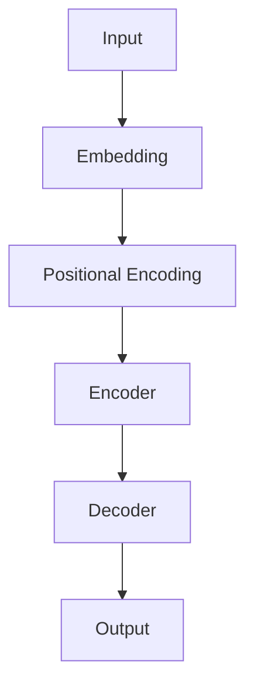

                 

## 1. 背景介绍

当前，人工智能（AI）技术正在迅速发展，大模型（Large Language Models）作为其中一项关键技术，已经引起了广泛的关注。大模型通过学习大量文本数据，能够理解、生成和解释人类语言，从而为各种应用场景提供了强大的能力。然而，如何利用大模型的技术优势进行创业，是一个需要深入思考的问题。本文将从技术原理、算法实现、数学模型、项目实践、应用场景、工具资源等方面，详细阐述如何利用大模型的技术优势进行创业。

## 2. 核心概念与联系

### 2.1 大模型的定义

大模型是指通过学习大量数据而训练出来的模型，具有强大的理解、生成和解释人类语言的能力。大模型通常基于Transformer架构，使用自注意力机制（Self-Attention）和Transformer编码器/解码器结构来处理序列数据。

### 2.2 Transformer架构

Transformer是大模型的核心架构，它由编码器和解码器组成。编码器和解码器都是由多个相同的层组成的，每层包含多头自注意力（Multi-Head Self-Attention）和前馈网络（Feed-Forward Network）。下图是Transformer架构的Mermaid流程图：



### 2.3 自注意力机制

自注意力机制是Transformer的关键组件，它允许模型在处理序列数据时考虑到序列中其他位置的信息。自注意力机制通过计算查询（Query）、键（Key）和值（Value）向量，并将它们组合成注意力权重，从而生成注意力输出。

## 3. 核心算法原理 & 具体操作步骤

### 3.1 算法原理概述

大模型的核心算法是Transformer，它基于自注意力机制和Transformer编码器/解码器结构。大模型的训练过程包括预处理、模型构建、训练和评估等步骤。

### 3.2 算法步骤详解

1. **预处理**：收集大量文本数据，并对其进行清洗、分词和标记等预处理操作。
2. **模型构建**：构建Transformer模型，包括编码器和解码器，并初始化模型参数。
3. **训练**：使用预处理后的数据训练模型，优化模型参数以最小化损失函数。
4. **评估**：在验证集上评估模型性能，并调整模型参数以提高性能。
5. **推理**：使用训练好的模型进行推理，生成文本或回答问题等任务。

### 3.3 算法优缺点

**优点**：

* 大模型具有强大的理解、生成和解释人类语言的能力。
* Transformer架构可以并行处理序列数据，提高了训练效率。
* 自注意力机制允许模型考虑序列中其他位置的信息，提高了模型的表达能力。

**缺点**：

* 大模型需要大量的计算资源和训练数据。
* 大模型可能会受到过拟合和泛化能力差等问题的影响。
* 大模型可能会产生不准确或有偏见的输出。

### 3.4 算法应用领域

大模型的应用领域非常广泛，包括自然语言处理（NLP）、机器翻译、问答系统、文本生成、搜索引擎等。大模型还可以应用于其他领域，如计算机视觉、生物信息学等。

## 4. 数学模型和公式 & 详细讲解 & 举例说明

### 4.1 数学模型构建

大模型的数学模型基于Transformer架构，可以表示为以下公式：

$$h_{i} = \text{Encoder}(x_{i})$$
$$y_{i} = \text{Decoder}(h_{i})$$

其中，$x_{i}$表示输入序列，$h_{i}$表示编码器的输出，$y_{i}$表示解码器的输出。

### 4.2 公式推导过程

自注意力机制的数学公式如下：

$$\text{Attention}(Q, K, V) = \text{softmax}\left(\frac{QK^{T}}{\sqrt{d_{k}}}\right)V$$

其中，$Q$, $K$, $V$分别表示查询、键和值向量，$d_{k}$表示键向量的维度。

前馈网络的数学公式如下：

$$\text{FFN}(x) = \max(0, xW_{1} + b_{1})W_{2} + b_{2}$$

其中，$W_{1}$, $W_{2}$, $b_{1}$, $b_{2}$表示可学习的参数。

### 4.3 案例分析与讲解

例如，在机器翻译任务中，输入序列$x_{i}$是源语言句子，输出序列$y_{i}$是目标语言句子。编码器将源语言句子编码为表示源语言意思的向量$h_{i}$，解码器则根据$h_{i}$生成目标语言句子。

## 5. 项目实践：代码实例和详细解释说明

### 5.1 开发环境搭建

大模型的开发需要强大的计算资源和软件环境。推荐使用NVIDIA A100 GPU和NVIDIA CUDA工具包，以及PyTorch或TensorFlow框架。

### 5.2 源代码详细实现

以下是大模型训练过程的伪代码：

```python
def train_model(data, model, optimizer, criterion, device):
    model.train()
    total_loss = 0

    for batch in data:
        inputs, targets = batch
        inputs, targets = inputs.to(device), targets.to(device)

        optimizer.zero_grad()
        outputs = model(inputs)
        loss = criterion(outputs, targets)
        loss.backward()
        optimizer.step()

        total_loss += loss.item()

    return total_loss / len(data)
```

### 5.3 代码解读与分析

在训练过程中，模型在训练模式下，对每个批次的数据进行前向传播，计算损失函数，并进行反向传播和参数优化。总损失是所有批次损失的平均值。

### 5.4 运行结果展示

训练好的大模型可以在验证集上进行评估，并生成文本或回答问题等任务。以下是一个简单的文本生成示例：

```python
def generate_text(model, start_token, max_length, device):
    model.eval()
    generated_text = [start_token]

    with torch.no_grad():
        for _ in range(max_length):
            inputs = torch.tensor(generated_text).unsqueeze(0).to(device)
            outputs = model(inputs)
            next_token = torch.argmax(outputs, dim=-1)[:, -1].item()
            generated_text.append(next_token)

    return generated_text
```

## 6. 实际应用场景

### 6.1 当前应用

大模型已经在各种应用中得到了广泛的应用，如搜索引擎、虚拟助手、机器翻译、文本生成等。

### 6.2 未来应用展望

未来，大模型可能会应用于更多领域，如自动驾驶、医疗诊断、金融分析等。大模型还可能会与其他技术结合，如物联网、区块链等，从而创造出更多的创业机会。

## 7. 工具和资源推荐

### 7.1 学习资源推荐

* "Attention is All You Need"论文：<https://arxiv.org/abs/1706.03762>
* "The Illustrated Transformer"：<https://jalammar.github.io/illustrated-transformer/>
* "Hugging Face Transformers"库：<https://huggingface.co/transformers/>

### 7.2 开发工具推荐

* PyTorch：<https://pytorch.org/>
* TensorFlow：<https://www.tensorflow.org/>
* NVIDIA CUDA：<https://developer.nvidia.com/cuda-downloads>

### 7.3 相关论文推荐

* "BERT: Pre-training of Deep Bidirectional Transformers for Language Understanding"：<https://arxiv.org/abs/1810.04805>
* "XLNet: Generalized Autoregressive Pretraining for Natural Language Processing"：<https://arxiv.org/abs/1906.08237>
* "T5: Text-to-Text Transfer Transformer"：<https://arxiv.org/abs/1910.10683>

## 8. 总结：未来发展趋势与挑战

### 8.1 研究成果总结

大模型已经取得了显著的成就，在各种NLP任务中表现出色。然而，大模型仍然面临着许多挑战，如过拟合、泛化能力差、计算资源需求等。

### 8.2 未来发展趋势

未来，大模型的发展趋势可能包括：

* 更大规模的模型，需要更强大的计算资源和训练数据。
* 多模式学习，结合文本、图像、音频等多种模式的数据。
* 更强大的泛化能力，能够处理未见过的数据和任务。

### 8.3 面临的挑战

大模型面临的挑战包括：

* 计算资源需求，需要强大的GPU和大量的训练数据。
* 过拟合和泛化能力差，需要开发新的正则化技术和数据增强技术。
* 模型解释性，需要开发新的方法来解释模型的决策过程。

### 8.4 研究展望

未来的研究方向可能包括：

* 更强大的泛化能力，开发新的模型架构和训练技术。
* 多模式学习，结合文本、图像、音频等多种模式的数据。
* 模型解释性，开发新的方法来解释模型的决策过程。

## 9. 附录：常见问题与解答

**Q：大模型需要多少计算资源？**

A：大模型需要强大的GPU和大量的训练数据。例如，训练BERT模型需要数千个GPU小时和大量的文本数据。

**Q：大模型是否会泄露隐私？**

A：大模型在训练过程中可能会泄露隐私信息。需要开发新的技术来保护隐私，如差分隐私（Differential Privacy）等。

**Q：大模型是否会产生不准确或有偏见的输出？**

A：大模型可能会产生不准确或有偏见的输出。需要开发新的技术来检测和减轻模型的偏见。

## 作者：禅与计算机程序设计艺术 / Zen and the Art of Computer Programming

