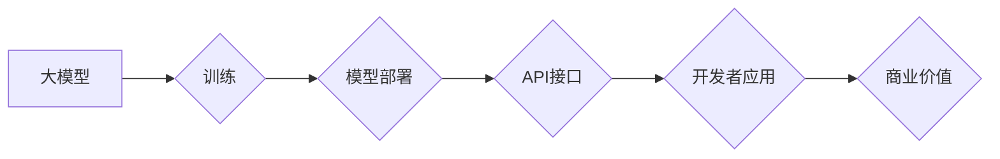

> AI大模型，经济优势，创业，商业模式，应用场景，技术趋势

## 1. 背景介绍

近年来，人工智能（AI）技术取得了飞速发展，特别是大模型的涌现，为各行各业带来了前所未有的机遇。大模型是指参数规模庞大、训练数据海量的人工智能模型，具备强大的泛化能力和学习能力，能够在自然语言处理、计算机视觉、语音识别等领域取得突破性进展。

然而，大模型的开发和应用也面临着巨大的挑战，其中之一就是成本高昂。训练一个大型模型需要大量的计算资源和时间，这对于创业公司来说是一个难以逾越的障碍。因此，如何利用大模型的经济优势，并将其应用于商业场景，成为创业者们亟需解决的问题。

## 2. 核心概念与联系

### 2.1  大模型的经济优势

大模型的经济优势主要体现在以下几个方面：

* **规模效应:** 大模型的训练成本主要集中在前期，随着模型规模的扩大，训练成本的增加率逐渐降低。这意味着，大模型可以实现规模效应，即随着用户数量的增加，每位用户的成本会逐渐降低。
* **复用性:** 大模型可以被用于多种不同的应用场景，例如文本生成、图像识别、语音合成等。这使得大模型具有很高的复用性，可以减少重复开发的成本。
* **持续学习:** 大模型可以通过持续学习的方式不断提升其性能，无需重新训练整个模型。这使得大模型可以随着时间的推移保持其竞争力。

### 2.2  大模型的商业模式

大模型的商业模式主要有以下几种：

* **平台服务:** 提供大模型的训练和部署平台，为开发者提供API接口，让开发者可以轻松地使用大模型进行开发。
* **应用服务:** 基于大模型开发各种应用，例如聊天机器人、智能客服、内容创作工具等，并向用户提供付费服务。
* **数据服务:** 收集和整理海量数据，并将其用于训练大模型，为企业提供数据分析和决策支持服务。

### 2.3  大模型的应用场景

大模型在各个行业都有着广泛的应用场景，例如：

* **教育:** 智能辅导系统、个性化学习平台
* **医疗:** 疾病诊断、药物研发
* **金融:** 风险评估、欺诈检测
* **零售:** 商品推荐、个性化营销
* **娱乐:** 内容创作、游戏开发

**Mermaid 流程图**



## 3. 核心算法原理 & 具体操作步骤

### 3.1  算法原理概述

大模型的训练主要基于深度学习算法，其中Transformer模型是目前最流行的架构之一。Transformer模型利用注意力机制，能够捕捉文本序列中的长距离依赖关系，从而实现更准确的理解和生成文本。

### 3.2  算法步骤详解

大模型的训练过程可以概括为以下几个步骤：

1. **数据预处理:** 收集和清洗训练数据，并将其转换为模型可以理解的格式。
2. **模型构建:** 根据预定的模型架构，搭建模型结构，并初始化模型参数。
3. **模型训练:** 使用训练数据，通过反向传播算法，不断调整模型参数，使得模型的预测结果与真实值尽可能接近。
4. **模型评估:** 使用测试数据，评估模型的性能，例如准确率、召回率、F1-score等。
5. **模型部署:** 将训练好的模型部署到服务器上，并提供API接口，供开发者调用。

### 3.3  算法优缺点

**优点:**

* 强大的泛化能力和学习能力
* 可以处理海量数据
* 可以实现多种应用场景

**缺点:**

* 训练成本高昂
* 需要大量的计算资源和时间
* 模型解释性较差

### 3.4  算法应用领域

大模型的应用领域非常广泛，包括：

* 自然语言处理：文本生成、机器翻译、问答系统、情感分析等
* 计算机视觉：图像识别、物体检测、图像分割等
* 语音识别：语音转文本、语音合成等
* 其他领域：药物研发、金融风险评估、个性化推荐等

## 4. 数学模型和公式 & 详细讲解 & 举例说明

### 4.1  数学模型构建

Transformer模型的核心是注意力机制，其数学模型可以表示为：

$$
Attention(Q, K, V) = softmax(\frac{QK^T}{\sqrt{d_k}})V
$$

其中：

* $Q$：查询矩阵
* $K$：键矩阵
* $V$：值矩阵
* $d_k$：键向量的维度
* $softmax$：softmax函数

### 4.2  公式推导过程

注意力机制的目的是计算查询向量与键向量的相关性，并根据相关性对值向量进行加权求和。

* $QK^T$：计算查询向量与键向量的点积，得到一个得分矩阵。
* $\frac{QK^T}{\sqrt{d_k}}$：对得分矩阵进行归一化，使得每个元素的范围在0到1之间。
* $softmax$：对归一化后的得分矩阵进行softmax操作，得到每个键向量的权重。
* $V$：使用权重对值向量进行加权求和，得到最终的输出。

### 4.3  案例分析与讲解

例如，在机器翻译任务中，查询向量可以表示源语言的词语，键向量可以表示目标语言的词语，值向量可以表示目标语言的词语嵌入。通过注意力机制，模型可以学习到源语言词语与目标语言词语之间的关系，从而实现更准确的翻译。

## 5. 项目实践：代码实例和详细解释说明

### 5.1  开发环境搭建

* Python 3.7+
* PyTorch 1.7+
* CUDA 10.2+
* GPU

### 5.2  源代码详细实现

```python
import torch
import torch.nn as nn

class Transformer(nn.Module):
    def __init__(self, vocab_size, embedding_dim, num_heads, num_layers):
        super(Transformer, self).__init__()
        self.embedding = nn.Embedding(vocab_size, embedding_dim)
        self.transformer_layers = nn.ModuleList([
            nn.TransformerEncoderLayer(embedding_dim, num_heads)
            for _ in range(num_layers)
        ])
        self.linear = nn.Linear(embedding_dim, vocab_size)

    def forward(self, x):
        x = self.embedding(x)
        for layer in self.transformer_layers:
            x = layer(x)
        x = self.linear(x)
        return x
```

### 5.3  代码解读与分析

* `__init__` 方法：初始化模型参数，包括词嵌入层、Transformer编码器层和线性输出层。
* `forward` 方法：定义模型的正向传播过程，将输入序列经过词嵌入层、Transformer编码器层和线性输出层，最终得到输出序列。

### 5.4  运行结果展示

训练好的模型可以用于各种自然语言处理任务，例如文本生成、机器翻译、问答系统等。

## 6. 实际应用场景

### 6.1  聊天机器人

大模型可以用于构建更智能、更自然的聊天机器人，能够理解用户的意图，并提供更准确、更相关的回复。

### 6.2  智能客服

大模型可以用于构建智能客服系统，能够自动处理用户的常见问题，例如订单查询、退换货等，从而提高客服效率。

### 6.3  内容创作工具

大模型可以用于辅助内容创作，例如生成文章、诗歌、剧本等，帮助用户提高创作效率。

### 6.4  未来应用展望

大模型的应用场景还在不断扩展，未来可能会应用于更多领域，例如：

* 个性化教育
* 医疗诊断
* 法律服务
* 科学研究

## 7. 工具和资源推荐

### 7.1  学习资源推荐

* **书籍:**
    * 《深度学习》
    * 《自然语言处理》
* **在线课程:**
    * Coursera: 深度学习
    * Udacity: 自然语言处理
* **博客:**
    * The Gradient
    * Towards Data Science

### 7.2  开发工具推荐

* **框架:**
    * PyTorch
    * TensorFlow
* **库:**
    * Hugging Face Transformers
    * OpenAI API

### 7.3  相关论文推荐

* Attention Is All You Need
* BERT: Pre-training of Deep Bidirectional Transformers for Language Understanding
* GPT-3: Language Models are Few-Shot Learners

## 8. 总结：未来发展趋势与挑战

### 8.1  研究成果总结

近年来，大模型在各个领域取得了显著的成果，例如：

* 自然语言处理：机器翻译、文本生成、问答系统等
* 计算机视觉：图像识别、物体检测、图像分割等
* 语音识别：语音转文本、语音合成等

### 8.2  未来发展趋势

* 模型规模的进一步扩大
* 训练效率的提升
* 模型解释性的增强
* 多模态大模型的开发

### 8.3  面临的挑战

* 训练成本高昂
* 数据获取和标注困难
* 模型安全性与可解释性问题
* 伦理和社会影响问题

### 8.4  研究展望

未来，大模型的研究将继续朝着更强大、更智能、更安全的方向发展，并将在更多领域发挥重要作用。

## 9. 附录：常见问题与解答

### 9.1  Q: 如何选择合适的模型架构？

A: 选择合适的模型架构取决于具体的应用场景和数据特点。例如，对于文本生成任务，GPT模型效果较好；对于图像识别任务，CNN模型效果较好。

### 9.2  Q: 如何训练大模型？

A: 训练大模型需要大量的计算资源和时间，可以使用云计算平台进行训练。

### 9.3  Q: 如何评估大模型的性能？

A: 可以使用各种指标来评估大模型的性能，例如准确率、召回率、F1-score等。

### 9.4  Q: 如何部署大模型？

A: 可以将训练好的模型部署到服务器上，并提供API接口，供开发者调用。


作者：禅与计算机程序设计艺术 / Zen and the Art of Computer Programming 
<end_of_turn>