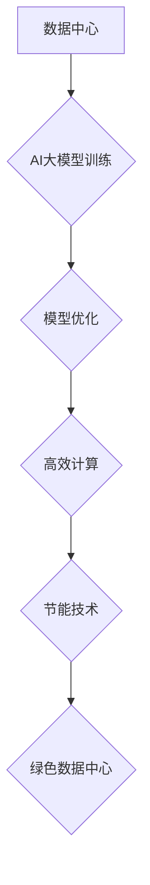

> AI大模型，数据中心，绿色节能，能源效率，可持续发展，人工智能，深度学习，云计算

## 1. 背景介绍

随着人工智能（AI）技术的飞速发展，大规模人工智能模型（AI大模型）的应用日益广泛，涵盖了自然语言处理、计算机视觉、语音识别等多个领域。这些模型的训练和部署都需要大量的计算资源和能源消耗，这给数据中心建设带来了新的挑战。

传统数据中心通常采用高性能计算集群，以满足高强度计算需求。然而，这种模式往往伴随着高能耗、高碳排放等问题，不利于可持续发展。因此，如何构建高效、节能、环保的AI大模型应用数据中心，成为当前研究和实践的热点。

## 2. 核心概念与联系

**2.1 数据中心**

数据中心是用于存储、处理和传输数据的集中式设施。它通常由服务器、网络设备、存储设备、电源系统等组成，为各种应用提供计算、存储和网络服务。

**2.2 AI大模型**

AI大模型是指参数量巨大、训练数据海量的人工智能模型。它们通常基于深度学习算法，能够学习复杂的模式和关系，从而实现更精准、更智能的应用。

**2.3 绿色节能**

绿色节能是指通过提高能源利用效率、减少能源消耗和碳排放，实现可持续发展的一种理念。

**2.4 核心概念联系**

AI大模型应用数据中心建设需要将数据中心、AI大模型和绿色节能理念有机结合。

* 数据中心需要提供足够的计算资源和存储空间，以满足AI大模型的训练和部署需求。
* AI大模型的训练和部署需要优化算法和模型架构，以降低能源消耗。
* 绿色节能技术需要应用于数据中心各个环节，以提高能源利用效率和减少碳排放。

**2.5 数据中心绿色节能架构**



## 3. 核心算法原理 & 具体操作步骤

**3.1 算法原理概述**

AI大模型的训练和部署通常采用深度学习算法，例如卷积神经网络（CNN）、循环神经网络（RNN）和Transformer等。这些算法通过多层神经网络结构，学习数据中的复杂模式和关系。

**3.2 算法步骤详解**

1. **数据预处理:** 将原始数据清洗、转换和格式化，使其适合深度学习模型的训练。
2. **模型构建:** 根据任务需求选择合适的深度学习模型架构，并设置模型参数。
3. **模型训练:** 使用训练数据训练模型，通过调整模型参数，使模型的预测结果与真实值尽可能接近。
4. **模型评估:** 使用测试数据评估模型的性能，例如准确率、召回率和F1-score等。
5. **模型部署:** 将训练好的模型部署到实际应用场景中，用于进行预测或其他任务。

**3.3 算法优缺点**

**优点:**

* 能够学习复杂模式和关系，实现高精度预测。
* 具有强大的泛化能力，能够应用于多种任务。

**缺点:**

* 训练数据量大，训练时间长。
* 计算资源需求高，能源消耗大。

**3.4 算法应用领域**

* 自然语言处理：文本分类、情感分析、机器翻译等。
* 计算机视觉：图像识别、目标检测、图像分割等。
* 语音识别：语音转文本、语音助手等。
* 其他领域：医疗诊断、金融风险评估、推荐系统等。

## 4. 数学模型和公式 & 详细讲解 & 举例说明

**4.1 数学模型构建**

深度学习模型通常采用神经网络结构，其中每个神经元都接收来自其他神经元的输入，并通过激活函数进行处理，输出到下一层神经元。

**4.2 公式推导过程**

神经网络的训练过程是通过优化模型参数，使模型的预测结果与真实值尽可能接近。常用的优化算法包括梯度下降法和其变种算法。

梯度下降法的核心思想是通过计算模型参数的梯度，沿着梯度负方向更新模型参数，从而降低模型的损失函数值。

**损失函数:**

$$L(w) = \frac{1}{N} \sum_{i=1}^{N} (y_i - \hat{y}_i)^2$$

其中：

* $L(w)$ 是损失函数，$w$ 是模型参数。
* $N$ 是训练数据的数量。
* $y_i$ 是第 $i$ 个样本的真实值。
* $\hat{y}_i$ 是第 $i$ 个样本的预测值。

**梯度:**

$$\frac{\partial L(w)}{\partial w}$$

**参数更新:**

$$w = w - \eta \frac{\partial L(w)}{\partial w}$$

其中：

* $\eta$ 是学习率，控制参数更新的步长。

**4.3 案例分析与讲解**

假设我们训练一个简单的线性回归模型，用于预测房价。

模型输入特征包括房屋面积和房间数量，输出目标是房屋价格。

我们可以使用梯度下降法来优化模型参数，使模型的预测结果与真实房价尽可能接近。

## 5. 项目实践：代码实例和详细解释说明

**5.1 开发环境搭建**

* 操作系统：Ubuntu 20.04
* Python 版本：3.8
* 深度学习框架：TensorFlow 2.0

**5.2 源代码详细实现**

```python
import tensorflow as tf

# 定义模型
model = tf.keras.models.Sequential([
    tf.keras.layers.Dense(64, activation='relu', input_shape=(2,)),
    tf.keras.layers.Dense(1)
])

# 定义损失函数和优化器
model.compile(loss='mse', optimizer='adam')

# 训练模型
model.fit(x_train, y_train, epochs=10)

# 评估模型
loss = model.evaluate(x_test, y_test)
print('Loss:', loss)

# 预测房价
new_house = [[100, 2]]
prediction = model.predict(new_house)
print('Prediction:', prediction)
```

**5.3 代码解读与分析**

* 代码首先定义了一个简单的线性回归模型，包含两层全连接神经网络层。
* 损失函数为均方误差（MSE），优化器为Adam算法。
* 使用训练数据训练模型10个 epochs。
* 使用测试数据评估模型的性能。
* 最后，使用训练好的模型预测新房子的价格。

**5.4 运行结果展示**

运行结果将显示模型的训练损失和测试损失，以及对新房子的价格预测。

## 6. 实际应用场景

**6.1 AI大模型应用场景**

* **自然语言处理:**

    * **机器翻译:** 将文本从一种语言翻译成另一种语言。
    * **文本摘要:** 自动生成文本的简短摘要。
    * **情感分析:** 分析文本中的情感倾向，例如正面、负面或中性。

* **计算机视觉:**

    * **图像识别:** 将图像分类到不同的类别。
    * **目标检测:** 在图像中检测和识别特定目标。
    * **图像分割:** 将图像分割成不同的区域。

* **语音识别:**

    * **语音转文本:** 将语音转换为文本。
    * **语音助手:** 理解用户的语音指令并执行相应的操作。

**6.2 数据中心绿色节能应用场景**

* **高效计算:** 使用高性能计算硬件和软件，提高计算效率，降低能耗。
* **节能技术:** 应用节能技术，例如虚拟化、动态电源管理和冷却优化，降低数据中心的能耗。
* **可再生能源:** 使用可再生能源，例如太阳能和风能，为数据中心提供电力。

**6.3 未来应用展望**

随着AI技术的不断发展，AI大模型的应用场景将更加广泛，对数据中心的计算资源和能源消耗需求也将进一步增加。因此，构建高效、节能、环保的AI大模型应用数据中心，将成为未来发展的重要趋势。

## 7. 工具和资源推荐

**7.1 学习资源推荐**

* **书籍:**
    * 深度学习 (Deep Learning) - Ian Goodfellow, Yoshua Bengio, Aaron Courville
    * 人工智能：一种现代方法 (Artificial Intelligence: A Modern Approach) - Stuart Russell, Peter Norvig
* **在线课程:**
    * TensorFlow 官方教程: https://www.tensorflow.org/tutorials
    * Coursera 深度学习课程: https://www.coursera.org/specializations/deep-learning

**7.2 开发工具推荐**

* **深度学习框架:** TensorFlow, PyTorch, Keras
* **云计算平台:** AWS, Azure, Google Cloud

**7.3 相关论文推荐**

* **Attention Is All You Need:** https://arxiv.org/abs/1706.03762
* **BERT: Pre-training of Deep Bidirectional Transformers for Language Understanding:** https://arxiv.org/abs/1810.04805

## 8. 总结：未来发展趋势与挑战

**8.1 研究成果总结**

近年来，AI大模型在各个领域取得了显著的成果，例如自然语言处理、计算机视觉和语音识别等。数据中心绿色节能技术也取得了长足进步，例如高效计算、节能技术和可再生能源等。

**8.2 未来发展趋势**

* **模型规模和能力的提升:** 未来，AI大模型的规模和能力将继续提升，能够处理更复杂的任务和更大的数据量。
* **模型训练和部署的效率提升:** 研究人员将继续探索新的训练和部署方法，以降低模型训练和部署的成本和时间。
* **数据中心绿色节能技术的创新:** 将继续开发新的节能技术，以降低数据中心的能耗和碳排放。

**8.3 面临的挑战**

* **高计算资源需求:** AI大模型的训练和部署需要大量的计算资源，这给数据中心建设带来了挑战。
* **能源消耗问题:** AI大模型的训练和部署消耗大量的能源，这不利于可持续发展。
* **数据安全和隐私问题:** AI大模型的训练需要大量数据，这可能带来数据安全和隐私问题。

**8.4 研究展望**

未来，研究人员将继续探索AI大模型的应用场景，并开发新的训练和部署方法，以提高模型的效率和性能。同时，也将继续研究数据中心绿色节能技术，以降低数据中心的能耗和碳排放，实现可持续发展。

## 9. 附录：常见问题与解答

**9.1 如何选择合适的AI大模型？**

选择合适的AI大模型需要根据具体的应用场景和需求进行考虑。例如，对于文本分类任务，可以选择BERT或RoBERTa模型；对于图像识别任务，可以选择ResNet或EfficientNet模型。

**9.2 如何降低AI大模型的训练和部署成本？**

可以采用以下方法降低AI大模型的训练和部署成本：

* 使用云计算平台进行训练和部署。
* 使用模型压缩和量化技术，减小模型大小。
* 使用分布式训练技术，提高训练效率。

**9.3 如何保证AI大模型的数据安全和隐私？**

可以采用以下方法保证AI大模型的数据安全和隐私：

* 使用加密技术保护数据。
* 使用联邦学习技术，避免数据集中存储。
* 遵守数据隐私法规，保护用户隐私。


作者：禅与计算机程序设计艺术 / Zen and the Art of Computer Programming 
<end_of_turn>