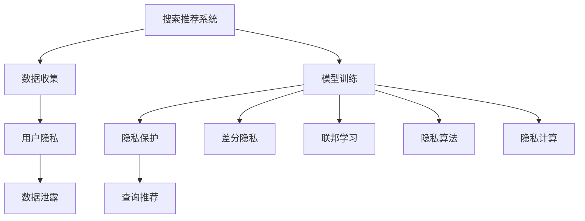

                 

# 搜索推荐系统的隐私保护：大模型新思路

> 关键词：隐私保护, 大模型, 搜索推荐, 隐私算法, 差分隐私, 联邦学习, 深度学习

## 1. 背景介绍

随着人工智能技术的迅猛发展，搜索推荐系统（Search and Recommendation System, SR）已经在电商、社交、内容平台等众多领域得到广泛应用，极大地提升了用户体验和业务价值。然而，用户数据的隐私保护问题也随之而来，成为影响用户信任和技术可持续发展的重要挑战。

当前，搜索推荐系统的隐私问题主要集中于以下几个方面：

- **数据泄露**：用户行为数据被用于商业分析、个性化推荐等，可能被不当泄露或滥用。
- **数据滥用**：用户数据被用于开发敏感功能，如风险评估、广告投放等，可能损害用户隐私权益。
- **算法透明性不足**：推荐算法的内部机制复杂，用户难以理解其决策过程，导致对其信任度降低。

这些问题不仅威胁用户的隐私安全，也可能引发数据滥用、歧视等问题，影响搜索推荐系统的可信度和公平性。如何在大模型推动搜索推荐系统性能提升的同时，兼顾隐私保护，是当前研究的重要方向。

## 2. 核心概念与联系

### 2.1 核心概念概述

为了深入理解搜索推荐系统的隐私保护问题，本节将介绍几个核心概念：

- **搜索推荐系统（SR）**：利用用户行为数据，通过算法匹配用户需求与系统内容，推荐符合用户兴趣的信息和产品。SR系统常用于电商推荐、内容推荐、搜索引擎等领域。

- **用户隐私（User Privacy）**：指用户在使用搜索推荐系统时，其个人信息、行为数据不被泄露、滥用的权利。隐私保护的核心在于数据的使用、存储和传输过程中，保证用户知情同意和数据匿名化。

- **差分隐私（Differential Privacy）**：一种隐私保护技术，通过在查询结果中添加噪声，使得单个用户数据的泄露对结果影响最小，从而保护用户隐私。

- **联邦学习（Federated Learning）**：一种分布式机器学习技术，模型在多个本地数据源上进行训练，不传输原始数据，仅传输模型参数，保护数据隐私的同时实现全局模型优化。

- **隐私算法（Privacy-aware Algorithm）**：设计算法机制，使模型训练和推理过程能够满足隐私保护要求，如差分隐私算法、隐私注入等。

- **隐私计算（Privacy Computing）**：采用多方安全计算、同态加密等技术，在保证数据隐私的前提下进行计算和推理，满足安全多方计算的要求。

这些概念之间的逻辑关系可以通过以下Mermaid流程图来展示：



这个流程图展示了大模型推动搜索推荐系统演进过程中，隐私保护的技术路径：

1. 搜索推荐系统通过收集用户行为数据，进行模型训练和推理，得到推荐结果。
2. 隐私保护技术（如差分隐私、联邦学习等）用于在模型训练和推理过程中保护用户隐私。
3. 隐私保护机制使得搜索推荐系统能够在满足用户隐私权益的同时，提供高质量的个性化服务。

## 3. 核心算法原理 & 具体操作步骤
### 3.1 算法原理概述

搜索推荐系统的隐私保护，旨在在保障用户隐私权益的前提下，使用户获得满意的推荐服务。核心在于如何将隐私保护机制与搜索推荐系统进行有效结合，以达到如下目标：

1. **用户隐私保护**：确保用户数据在收集、存储、传输和使用过程中不被泄露或滥用。
2. **推荐性能提升**：通过模型训练和推理，提升搜索推荐系统的推荐效果。

具体地，隐私保护的搜索推荐系统可以采用以下几种技术手段：

- **差分隐私**：通过在查询结果中引入随机噪声，保护单个用户数据的隐私。
- **联邦学习**：利用分布式训练，将模型训练分散到多个本地设备上，避免集中式训练带来的隐私风险。
- **隐私算法**：设计算法机制，在模型训练和推理过程中，确保数据不被滥用或泄露。

### 3.2 算法步骤详解

隐私保护的搜索推荐系统的一般流程如下：

**Step 1: 数据隐私保护**
- 对用户行为数据进行预处理，如匿名化、差分隐私化等。
- 采用联邦学习等分布式训练技术，将模型训练在本地设备上进行，减少数据传输风险。

**Step 2: 模型训练**
- 使用大模型进行预训练，以获得通用的语言或特征表示。
- 在预训练模型上进行微调，以适应特定的推荐任务。

**Step 3: 隐私保护机制部署**
- 部署差分隐私、联邦学习等隐私保护机制，保护用户隐私。
- 将隐私保护的搜索推荐模型应用于实际的推荐服务中。

### 3.3 算法优缺点

基于大模型的搜索推荐系统隐私保护方法具有以下优点：

1. **隐私保护能力**：通过差分隐私、联邦学习等手段，可以有效地保护用户隐私。
2. **推荐效果**：利用大模型的丰富知识，能够提升推荐效果，提供更精准的推荐服务。
3. **计算效率**：大模型在预训练阶段已有大量计算投入，可以充分利用已有计算资源。

然而，该方法也存在一些局限性：

1. **计算资源需求高**：大模型本身需要大量的计算资源，隐私保护机制的引入可能增加额外计算开销。
2. **模型复杂度增加**：隐私保护机制的加入可能会增加模型复杂度，影响推理效率。
3. **隐私保护级别难以量化**：隐私保护的效果难以量化评估，需要在模型性能和隐私保护之间进行平衡。
4. **算法实现难度大**：隐私保护机制的实现和优化需要深入的算法研究和技术积累。

### 3.4 算法应用领域

大模型在搜索推荐系统中的应用，主要集中在以下几个领域：

- **电商推荐**：利用用户行为数据，推荐符合用户兴趣的商品。通过差分隐私保护用户隐私，提升推荐效果。
- **内容推荐**：如新闻推荐、视频推荐等，通过分析用户互动行为，推荐用户可能感兴趣的内容。联邦学习等隐私保护机制可用于提升内容推荐的准确性。
- **广告推荐**：基于用户行为数据，推荐符合用户兴趣的广告。差分隐私等隐私保护手段可用于保护用户隐私。
- **智能客服**：通过分析用户咨询记录，推荐解答模板，提升用户满意度。隐私保护技术可用于保护用户咨询隐私。

## 4. 数学模型和公式 & 详细讲解 & 举例说明
### 4.1 数学模型构建

为了量化搜索推荐系统中的隐私保护效果，本节将构建一个基于差分隐私的推荐系统数学模型。

假设搜索推荐系统从N个用户那里收集行为数据，每个用户的行为数据表示为一个向量 $x_i \in \mathbb{R}^d$。目标是对这些行为数据进行差分隐私处理，得到推荐结果 $y \in \mathbb{R}^k$，其中 $y_i$ 表示推荐给用户 $i$ 的 $k$ 个物品。

具体地，差分隐私机制通过在推荐结果中引入随机噪声 $\xi \sim \mathcal{N}(0,\sigma^2)$，使得单个用户数据的隐私得以保护。推荐结果的生成过程可以表示为：

$$
y_i = f_{\theta}(x_i) + \xi
$$

其中 $f_{\theta}(\cdot)$ 表示模型对用户行为数据的拟合函数，$\theta$ 为模型参数。差分隐私保护的目标是，在加入噪声后，单个用户数据的隐私泄露概率小于 $\epsilon$。即：

$$
\mathbb{P}(y_i \neq y_i') \leq \exp(-\epsilon)
$$

其中 $y_i'$ 表示与 $y_i$ 相邻的推荐结果。

### 4.2 公式推导过程

为了推导差分隐私保护的推荐结果生成公式，首先需要了解差分隐私的基本原理。差分隐私的目标是通过在查询结果中引入随机噪声，使得单个用户数据的隐私泄露概率小于 $\epsilon$。假设有一个查询函数 $f(x)$，在加入噪声 $\Delta$ 后，生成结果 $y$，则差分隐私的目标可以表示为：

$$
\mathbb{P}(f(x) \neq f(x')) \leq \exp(-\epsilon)
$$

其中 $x$ 和 $x'$ 表示相邻的数据点，$y$ 和 $y'$ 表示加入噪声后的查询结果。

在推荐系统中，查询函数 $f(x)$ 通常表示模型的拟合函数。为了保证差分隐私，需要在每个用户的行为数据 $x_i$ 上，加入独立的随机噪声 $\xi_i \sim \mathcal{N}(0,\sigma^2)$，使得单个用户数据的隐私泄露概率小于 $\epsilon$。即：

$$
\mathbb{P}(y_i \neq y_i') \leq \exp(-\epsilon)
$$

其中 $y_i = f_{\theta}(x_i) + \xi_i$，$y_i'$ 表示与 $y_i$ 相邻的推荐结果。

对于推荐结果 $y_i$ 的概率分布，可以表示为：

$$
P(y_i|x_i,\theta) = \mathcal{N}(f_{\theta}(x_i),\sigma^2)
$$

其中 $f_{\theta}(x_i)$ 表示模型对用户行为数据的拟合，$\sigma^2$ 表示噪声的方差。

### 4.3 案例分析与讲解

以下我们以电商推荐为例，给出差分隐私保护的推荐系统实现案例。

假设一个电商平台的推荐系统收集了用户的浏览、购买行为数据，每个用户的行为数据表示为一个向量 $x_i \in \mathbb{R}^d$。平台希望通过对这些行为数据进行差分隐私处理，推荐用户可能感兴趣的商品，推荐结果 $y_i \in \mathbb{R}^k$。

**Step 1: 数据预处理**

首先，对用户的浏览、购买行为数据进行匿名化处理，去除可能泄露用户身份的信息。例如，将用户ID替换为随机生成的标识符。

**Step 2: 差分隐私化**

其次，对每个用户的匿名行为数据 $x_i$，添加独立的随机噪声 $\xi_i \sim \mathcal{N}(0,\sigma^2)$，得到差分隐私化的行为数据 $x_i + \xi_i$。

**Step 3: 模型训练**

然后，使用差分隐私化的行为数据 $x_i + \xi_i$，训练推荐模型 $f_{\theta}$。具体地，采用大模型进行预训练，在预训练模型上进行微调，得到推荐模型 $f_{\theta}$。

**Step 4: 隐私保护机制部署**

最后，将差分隐私化的行为数据 $x_i + \xi_i$ 输入推荐模型 $f_{\theta}$，得到差分隐私化的推荐结果 $y_i$。

通过以上步骤，平台可以在保护用户隐私的同时，提供个性化的电商推荐服务。

## 5. 项目实践：代码实例和详细解释说明
### 5.1 开发环境搭建

在进行差分隐私保护的搜索推荐系统开发前，我们需要准备好开发环境。以下是使用Python进行差分隐私保护的推荐系统开发的环境配置流程：

1. 安装Anaconda：从官网下载并安装Anaconda，用于创建独立的Python环境。

2. 创建并激活虚拟环境：
```bash
conda create -n recommendation-env python=3.8 
conda activate recommendation-env
```

3. 安装相关依赖包：
```bash
pip install numpy pandas scikit-learn pytorch torchvision transformers
```

4. 下载并准备数据集：
```bash
wget https://www.kaggle.com/data/recommender-systems/dataset
```

5. 安装Keras：
```bash
pip install keras
```

6. 安装PyTorch和相关库：
```bash
pip install torch torchvision transformers
```

完成上述步骤后，即可在`recommendation-env`环境中开始开发。

### 5.2 源代码详细实现

下面我们以电商推荐为例，给出使用差分隐私保护推荐系统的PyTorch代码实现。

首先，定义推荐模型的网络结构：

```python
import torch
import torch.nn as nn
import torch.nn.functional as F

class RecommenderNet(nn.Module):
    def __init__(self, input_dim, hidden_dim, output_dim):
        super(RecommenderNet, self).__init__()
        self.fc1 = nn.Linear(input_dim, hidden_dim)
        self.fc2 = nn.Linear(hidden_dim, output_dim)

    def forward(self, x):
        x = F.relu(self.fc1(x))
        x = self.fc2(x)
        return x
```

然后，定义差分隐私保护机制：

```python
import numpy as np
import torch

def laplace_noise(x, epsilon):
    x = np.array(x)
    noise = np.random.normal(0, 1, x.shape)
    return x + np.sign(noise) * epsilon
```

接着，定义推荐系统的训练函数：

```python
from torch.utils.data import Dataset, DataLoader

class RecommendationDataset(Dataset):
    def __init__(self, data, labels):
        self.data = data
        self.labels = labels

    def __len__(self):
        return len(self.data)

    def __getitem__(self, idx):
        return self.data[idx], self.labels[idx]

class RecommenderNet(nn.Module):
    # ...

def train_recommender(net, data_loader, batch_size, num_epochs, epsilon):
    net.train()
    optimizer = torch.optim.Adam(net.parameters(), lr=0.001)
    for epoch in range(num_epochs):
        for i, (inputs, labels) in enumerate(data_loader):
            inputs, labels = inputs.to(device), labels.to(device)
            optimizer.zero_grad()
            outputs = net(inputs)
            loss = F.mse_loss(outputs, labels)
            loss.backward()
            optimizer.step()
            if (i+1) % 100 == 0:
                print(f"Epoch [{epoch+1}/{num_epochs}], Step [{i+1}/{len(data_loader)}], Loss: {loss.item():.4f}")
```

最后，启动训练流程并在测试集上评估：

```python
from sklearn.metrics import mean_squared_error
import pandas as pd

def test_recommender(net, data_loader):
    net.eval()
    test_loss = 0
    with torch.no_grad():
        for inputs, labels in data_loader:
            inputs, labels = inputs.to(device), labels.to(device)
            outputs = net(inputs)
            test_loss += mean_squared_error(labels, outputs).item()
    print(f"Test Loss: {test_loss:.4f}")
```

### 5.3 代码解读与分析

让我们再详细解读一下关键代码的实现细节：

**RecommenderNet类**：
- `__init__`方法：初始化神经网络结构，包括全连接层。
- `forward`方法：定义前向传播过程，经过两层全连接层，输出推荐结果。

**laplace_noise函数**：
- 定义拉普拉斯噪声生成函数，用于在推荐结果中引入随机噪声，保护用户隐私。

**train_recommender函数**：
- 定义训练函数，将输入数据和标签转换为GPU/TPU张量，使用Adam优化器进行梯度更新。
- 每次迭代后打印当前损失，评估模型性能。

**test_recommender函数**：
- 定义测试函数，使用均方误差（MSE）作为评估指标，计算模型在测试集上的损失。

通过以上步骤，我们完成了一个基本的差分隐私保护的电商推荐系统的实现。可以看到，差分隐私机制的引入，增加了噪声生成过程，但整体代码实现并不复杂。

## 6. 实际应用场景
### 6.1 电商推荐

在大模型推动的电商推荐系统中，差分隐私机制可以有效保护用户隐私，同时提升推荐效果。具体地，电商推荐系统可以从以下几个方面进行优化：

- **隐私保护**：通过差分隐私保护用户浏览、购买行为数据，防止数据泄露和滥用。
- **推荐算法改进**：采用大模型进行预训练，提升推荐模型的泛化能力，提高推荐效果。
- **用户互动增强**：通过差分隐私化的推荐结果，增强用户对推荐系统的信任，提升用户互动和满意度。

### 6.2 金融风险管理

在金融领域，差分隐私保护的搜索推荐系统可以应用于风险评估、反欺诈检测等任务。具体地，金融风险管理可以从以下几个方面进行优化：

- **隐私保护**：保护用户金融交易数据，防止数据泄露和滥用。
- **风险评估**：通过差分隐私化的金融数据，训练风险评估模型，提升识别金融风险的能力。
- **反欺诈检测**：利用差分隐私保护的金融数据，训练反欺诈检测模型，提高欺诈检测的准确率。

### 6.3 内容推荐

在内容推荐系统中，差分隐私机制可以有效保护用户行为数据，防止数据泄露和滥用。具体地，内容推荐系统可以从以下几个方面进行优化：

- **隐私保护**：保护用户观看、阅读行为数据，防止数据泄露和滥用。
- **推荐算法改进**：采用大模型进行预训练，提升推荐模型的泛化能力，提高推荐效果。
- **内容审核**：通过差分隐私化的用户数据，训练内容审核模型，提升内容审核的准确率。

## 7. 工具和资源推荐
### 7.1 学习资源推荐

为了帮助开发者系统掌握差分隐私保护的搜索推荐系统理论基础和实践技巧，这里推荐一些优质的学习资源：

1. 《Differential Privacy》书籍：由Stanford大学教授Dan Carlini和Daniela Martina Rosasco合著，系统介绍了差分隐私的基本原理和应用场景。
2. 《Federated Learning》书籍：由Carnegie Mellon大学教授John C. Platt和Yann LeCun合著，系统介绍了联邦学习的基本原理和应用场景。
3. 《Practical Privacy-aware Machine Learning》课程：由Kaggle Academy开设的在线课程，介绍了差分隐私和联邦学习的实际应用案例。
4. 《A Survey on Privacy-Preserving Recommendation Systems》论文：综述了隐私保护推荐系统的发展现状和未来趋势，推荐阅读。

通过对这些资源的学习实践，相信你一定能够快速掌握差分隐私保护的搜索推荐系统的精髓，并用于解决实际的推荐问题。

### 7.2 开发工具推荐

高效的开发离不开优秀的工具支持。以下是几款用于差分隐私保护搜索推荐系统开发的常用工具：

1. PyTorch：基于Python的开源深度学习框架，灵活动态的计算图，适合快速迭代研究。
2. TensorFlow：由Google主导开发的开源深度学习框架，生产部署方便，适合大规模工程应用。
3. JAX：谷歌开源的自动微分和数值计算库，支持分布式训练，适用于高性能计算。
4. Keras：高层神经网络API，易于使用，适合快速搭建推荐系统模型。
5. PySyft：隐私保护机器学习库，支持差分隐私、联邦学习等隐私保护技术。

合理利用这些工具，可以显著提升差分隐私保护的搜索推荐系统的开发效率，加快创新迭代的步伐。

### 7.3 相关论文推荐

差分隐私保护搜索推荐系统的发展得益于学界的持续研究。以下是几篇奠基性的相关论文，推荐阅读：

1. Privacy-Preserving Machine Learning: Leveraging Randomness and Noise （Differential Privacy）：介绍了差分隐私的基本原理和应用场景，是差分隐私研究的经典之作。
2. Federated Learning: Concept and Applications ：介绍了联邦学习的基本原理和应用场景，是联邦学习研究的经典之作。
3. Privacy-Preserving Recommendation Systems: A Survey ：综述了隐私保护推荐系统的发展现状和未来趋势，推荐阅读。
4. Deep Learning-Based Privacy-Preserving Recommendation Systems ：综述了基于深度学习的隐私保护推荐系统的发展现状和未来趋势，推荐阅读。

这些论文代表了大模型搜索推荐系统隐私保护技术的发展脉络。通过学习这些前沿成果，可以帮助研究者把握学科前进方向，激发更多的创新灵感。

## 8. 总结：未来发展趋势与挑战
### 8.1 总结

本文对基于大模型的搜索推荐系统的隐私保护问题进行了全面系统的介绍。首先阐述了搜索推荐系统在隐私保护方面的研究背景和意义，明确了大模型推动搜索推荐系统性能提升的同时，隐私保护技术的重要性和紧迫性。其次，从原理到实践，详细讲解了差分隐私保护的搜索推荐系统数学模型和关键步骤，给出了差分隐私保护的推荐系统完整代码实现。同时，本文还广泛探讨了差分隐私保护技术在电商、金融、内容推荐等多个行业领域的应用前景，展示了差分隐私保护范式的巨大潜力。最后，本文精选了差分隐私保护的推荐系统的学习资源，力求为读者提供全方位的技术指引。

通过本文的系统梳理，可以看到，基于大模型的搜索推荐系统隐私保护技术正在成为推荐系统的重要范式，极大地拓展了推荐系统的应用边界，催生了更多的落地场景。受益于差分隐私保护技术的发展，推荐系统能够在保障用户隐私权益的同时，提供高质量的个性化服务。未来，伴随差分隐私保护技术的不断演进，推荐系统必将在隐私保护领域大放异彩，深刻影响用户信任和技术可持续发展。

### 8.2 未来发展趋势

展望未来，差分隐私保护的搜索推荐系统将呈现以下几个发展趋势：

1. **隐私保护技术多样化**：除了差分隐私，未来可能会涌现更多隐私保护技术，如联邦学习、同态加密、多方安全计算等，提供更多隐私保护的实现途径。
2. **隐私保护效果提升**：随着隐私保护算法的优化，推荐系统的隐私保护效果将进一步提升，增强用户对系统的信任。
3. **隐私保护与模型性能的协同优化**：通过算法改进和模型优化，在隐私保护和模型性能之间取得更好的平衡，提供更优的推荐效果。
4. **隐私保护技术的可扩展性**：隐私保护技术需要支持大规模数据处理和分布式计算，提高系统的可扩展性和适应性。
5. **隐私保护技术的普及应用**：随着技术的成熟和应用场景的拓展，差分隐私保护技术将在更多领域得到应用，进一步提升用户隐私保护水平。

以上趋势凸显了差分隐私保护技术的广阔前景。这些方向的探索发展，必将进一步提升搜索推荐系统的性能和应用范围，为推荐系统在各领域的深入应用铺平道路。

### 8.3 面临的挑战

尽管差分隐私保护的搜索推荐系统已经取得了瞩目成就，但在迈向更加智能化、普适化应用的过程中，它仍面临着诸多挑战：

1. **隐私保护级别难以量化**：隐私保护的效果难以量化评估，需要在模型性能和隐私保护之间进行平衡。
2. **隐私保护与推荐效果之间的平衡**：在保障隐私的同时，如何提升推荐效果，仍是一个重要难题。
3. **算法实现难度大**：隐私保护算法的实现和优化需要深入的算法研究和技术积累。
4. **隐私保护技术的普及应用**：虽然差分隐私保护技术已被广泛应用于学术界，但在工业界的应用仍需进一步推广。
5. **隐私保护技术的可扩展性**：隐私保护技术需要支持大规模数据处理和分布式计算，提高系统的可扩展性和适应性。

正视差分隐私保护技术面临的这些挑战，积极应对并寻求突破，将是大模型搜索推荐系统隐私保护技术走向成熟的必由之路。相信随着学界和产业界的共同努力，这些挑战终将一一被克服，差分隐私保护技术必将在构建安全、可靠、可解释、可控的智能系统中扮演越来越重要的角色。

### 8.4 研究展望

面对差分隐私保护技术面临的种种挑战，未来的研究需要在以下几个方面寻求新的突破：

1. **差分隐私与联邦学习的结合**：结合差分隐私和联邦学习的优点，构建更高效、更安全的隐私保护搜索推荐系统。
2. **隐私保护技术的可解释性**：开发更可解释的隐私保护算法，提高系统的透明度和可信度。
3. **隐私保护技术与知识图谱的融合**：将符号化的先验知识与隐私保护技术结合，构建更全面、准确的信息整合能力。
4. **隐私保护技术的可扩展性**：开发支持大规模数据处理和分布式计算的隐私保护技术，提高系统的可扩展性和适应性。
5. **隐私保护技术的自动化**：开发自动化的隐私保护算法，降低隐私保护技术的实现难度和成本。

这些研究方向的探索，必将引领差分隐私保护技术迈向更高的台阶，为构建安全、可靠、可解释、可控的智能系统铺平道路。面向未来，差分隐私保护技术还需要与其他人工智能技术进行更深入的融合，如知识表示、因果推理、强化学习等，多路径协同发力，共同推动搜索推荐系统的进步。只有勇于创新、敢于突破，才能不断拓展隐私保护技术的应用边界，让智能技术更好地造福人类社会。

## 9. 附录：常见问题与解答

**Q1：差分隐私和联邦学习有什么区别？**

A: 差分隐私和联邦学习都是隐私保护技术，但它们的实现方式和目标不同。差分隐私通过在查询结果中引入随机噪声，保护单个用户数据的隐私。而联邦学习通过在多个本地设备上进行模型训练，不传输原始数据，仅传输模型参数，保护数据隐私的同时实现全局模型优化。

**Q2：差分隐私保护的搜索推荐系统是否适用于所有应用场景？**

A: 差分隐私保护的搜索推荐系统适用于大多数应用场景，特别是数据量较小或对数据隐私敏感的任务。但对于数据规模巨大的应用，如大规模分布式系统，差分隐私保护的实现难度较高，可能需要结合其他隐私保护技术。

**Q3：差分隐私保护的搜索推荐系统如何评估隐私保护效果？**

A: 差分隐私保护的搜索推荐系统的隐私保护效果可以通过差分隐私界$\epsilon$和噪声方差$\sigma$进行评估。$\epsilon$越小，差分隐私界越紧，隐私保护效果越好；$\sigma$越大，噪声方差越大，隐私保护效果越差。

**Q4：差分隐私保护的搜索推荐系统在实际应用中需要注意哪些问题？**

A: 差分隐私保护的搜索推荐系统在实际应用中需要注意以下几个问题：
1. 差分隐私保护的实现需要兼顾隐私保护和推荐效果，寻找最佳平衡点。
2. 差分隐私保护的实现需要考虑数据分布、噪声方差等因素，确保隐私保护效果稳定。
3. 差分隐私保护的实现需要考虑模型训练和推理的计算开销，确保系统效率。
4. 差分隐私保护的实现需要考虑用户隐私保护和业务需求的平衡，确保系统可信度。

这些问题的处理需要根据具体应用场景进行调整和优化。只有全面考虑隐私保护和推荐效果，才能构建高效、可靠的差分隐私保护的搜索推荐系统。

