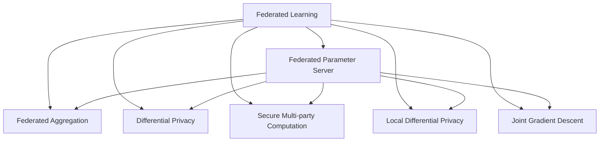

                 

# 搜索推荐系统的隐私保护：大模型的联邦学习方案

## 1. 背景介绍

### 1.1 问题由来

随着互联网技术的快速发展和数据量的爆炸性增长，搜索推荐系统在电商、社交媒体、新闻资讯等领域发挥着越来越重要的作用。然而，用户数据隐私保护问题随之而来，如何保证用户隐私数据的安全性和用户数据使用合规性，成为业界关注的焦点。

传统搜索推荐系统依赖于集中式训练和存储用户数据，容易导致数据泄露和滥用。而联邦学习（Federated Learning，简称FL）作为分布式机器学习的新范式，允许多个独立个体在不共享原始数据的前提下，通过模型参数共享和更新，实现联合训练。联邦学习适用于对数据隐私和数据安全有严格要求的应用场景，如搜索推荐、医疗健康、金融保险等，可以有效保护用户隐私，同时提升模型效果。

在大数据时代，搜索推荐系统需要处理的数据量更大，涉及的用户隐私问题更加复杂，如何在大规模数据集上应用联邦学习，保护用户隐私，同时保证模型效果，成为研究的热点问题。本文将详细探讨如何在大规模搜索推荐系统中，应用联邦学习的隐私保护方案，提供完整的理论分析和代码实践。

### 1.2 问题核心关键点

在搜索推荐系统中，联邦学习的应用主要集中在以下几个关键问题：

1. **数据分布不均衡**：不同地区的用户行为模式可能存在较大差异，如何设计联邦学习算法，让全局模型适应不同地区的用户需求。

2. **模型更新开销大**：模型参数的联邦更新涉及网络传输和同步，对网络带宽和延迟要求较高。如何优化联邦学习算法，降低通信开销。

3. **联邦学习鲁棒性差**：单个设备上的模型更新可能存在偏差，如何保证全局模型的鲁棒性和稳定性。

4. **隐私保护技术**：联邦学习需要保护用户数据隐私，如何在模型训练中有效保护用户隐私，同时保持模型性能。

5. **多方协作的信任机制**：多个设备间的协作需要建立信任机制，如何保证协作方数据的安全性和模型更新的一致性。

这些关键问题在大规模搜索推荐系统中尤为突出，本文将针对这些问题，提出并评估相应的联邦学习方案。

## 2. 核心概念与联系

### 2.1 核心概念概述

为更好地理解联邦学习在大规模搜索推荐系统中的应用，本节将介绍几个密切相关的核心概念：

- **联邦学习（Federated Learning）**：一种分布式机器学习算法，允许多个独立个体在不共享原始数据的前提下，通过模型参数共享和更新，实现联合训练。
- **联邦参数服务器（Federated Parameter Server）**：负责接收和分发来自多个设备上传的模型参数，更新全局模型，并反馈给各个设备。
- **联邦聚合（Federated Aggregation）**：在联邦参数服务器中，对来自各个设备的更新参数进行加权平均或迭代更新，得到全局模型更新参数。
- **差分隐私（Differential Privacy）**：一种保护用户隐私的技术，通过对模型更新引入噪声，确保无法通过模型参数反推用户数据。
- **安全多方计算（Secure Multi-party Computation, SMPC）**：一种保护数据隐私的技术，允许多个参与方在不共享数据的情况下，通过加密和多方计算的方式，完成共同计算任务。
- **本地差分隐私（Local Differential Privacy）**：一种针对本地设备上的模型更新的差分隐私技术，在模型更新时引入噪声，保护用户数据隐私。
- **联合梯度下降（Federated Gradient Descent）**：一种经典的联邦学习算法，通过在各个设备上并行计算梯度，然后由联邦参数服务器进行加权聚合，更新全局模型。

这些核心概念之间的逻辑关系可以通过以下Mermaid流程图来展示：



这个流程图展示了大规模搜索推荐系统中联邦学习的基本流程：

1. 在联邦学习框架下，设备向联邦参数服务器上传本地模型参数。
2. 联邦参数服务器对上传的参数进行聚合，更新全局模型。
3. 引入差分隐私技术，保护用户隐私。
4. 使用安全多方计算，保护数据隐私。
5. 对本地模型更新引入噪声，实现本地差分隐私。
6. 应用联合梯度下降算法，更新全局模型。

这些概念共同构成了联邦学习在大规模搜索推荐系统中的应用框架，使得在大规模数据集上保护用户隐私的同时，实现高效模型训练。

## 3. 核心算法原理 & 具体操作步骤
### 3.1 算法原理概述

在搜索推荐系统中应用联邦学习，主要目标是利用各个设备上的本地数据，在不共享原始数据的前提下，联合训练出一个全局模型，该模型能够在不同设备上表现一致，并且保护用户隐私。

联邦学习的核心思想是：每个设备持有本地数据集，对模型进行本地更新，然后同步模型参数给联邦参数服务器。联邦参数服务器对接收的参数进行聚合，得到全局模型的更新参数，再分发给各个设备。重复这个过程，直至全局模型收敛。

具体来说，假设搜索推荐系统中有 $n$ 个设备，每个设备上的数据集为 $D_i$，模型参数为 $\theta_i$。本地模型更新过程为：

$$
\theta_i \leftarrow \theta_i - \eta \nabla_{\theta_i} L_i(\theta_i)
$$

其中 $\eta$ 为学习率，$L_i(\theta_i)$ 为本地设备 $i$ 上的损失函数。全局模型更新过程为：

$$
\theta^* \leftarrow \theta^* - \eta \nabla_{\theta^*} \sum_{i=1}^n L_i(\theta_i)
$$

其中 $\theta^*$ 为全局模型参数，$L_i(\theta_i)$ 为全局模型在设备 $i$ 上的损失函数。全局模型通过多个本地模型的梯度进行加权聚合，得到更新参数。

### 3.2 算法步骤详解

联邦学习在大规模搜索推荐系统中的应用，一般包括以下几个关键步骤：

**Step 1: 设备数据收集与本地模型训练**
- 各个设备收集本地数据集 $D_i$，进行本地模型训练，更新模型参数 $\theta_i$。

**Step 2: 设备模型上传**
- 设备将本地模型参数 $\theta_i$ 上传给联邦参数服务器。

**Step 3: 联邦参数服务器模型聚合**
- 联邦参数服务器对接收的模型参数进行聚合，得到全局模型更新参数 $\theta^*$。

**Step 4: 全局模型更新**
- 联邦参数服务器使用全局模型更新参数 $\theta^*$ 更新全局模型。

**Step 5: 全局模型分发给设备**
- 联邦参数服务器将更新后的全局模型参数 $\theta^*$ 分发给各个设备。

**Step 6: 本地模型更新**
- 设备使用更新后的全局模型参数 $\theta^*$ 更新本地模型。

**Step 7: 模型迭代**
- 重复上述步骤，直至全局模型收敛。

### 3.3 算法优缺点

联邦学习在大规模搜索推荐系统中的应用，具有以下优点：

1. **数据隐私保护**：各设备上的数据在传输和聚合过程中，无法被泄露，保护用户隐私。
2. **降低通信开销**：只需要传输模型参数，而不需要传输原始数据，减少通信开销。
3. **模型效果提升**：多个设备上的数据可以联合使用，提升模型效果。
4. **模型鲁棒性增强**：通过联邦学习，全局模型可以更好地适应不同设备上的数据分布，增强鲁棒性。

同时，联邦学习也存在以下缺点：

1. **模型收敛速度慢**：由于数据分布不均衡，联邦学习模型需要更多的迭代次数才能收敛。
2. **模型更新开销大**：模型参数的传输和聚合需要大量网络带宽和计算资源。
3. **模型鲁棒性差**：部分设备上的模型更新可能存在偏差，影响全局模型性能。

为了应对这些挑战，需要在联邦学习中引入差分隐私和本地差分隐私等技术，提升模型性能和隐私保护水平。

### 3.4 算法应用领域

联邦学习在大规模搜索推荐系统中，主要应用于以下领域：

1. **个性化推荐**：通过联邦学习，各设备上的用户行为数据联合训练推荐模型，提升个性化推荐效果。
2. **搜索引擎优化**：通过联邦学习，联合训练各个设备上的点击、展示、停留等数据，优化搜索引擎性能。
3. **广告投放优化**：通过联邦学习，联合训练各设备上的广告点击数据，优化广告投放策略。
4. **实时搜索排名**：通过联邦学习，实时联合训练各设备上的搜索行为数据，提升搜索排名算法。
5. **用户行为分析**：通过联邦学习，联合训练各设备上的用户行为数据，分析用户兴趣和需求。

## 4. 数学模型和公式 & 详细讲解
### 4.1 数学模型构建

在大规模搜索推荐系统中应用联邦学习，数学模型可以表示为：

设 $n$ 个设备上的数据集为 $D_i = \{(x_i, y_i)\}_{i=1}^N$，其中 $x_i \in \mathcal{X}, y_i \in \mathcal{Y}$。模型参数为 $\theta$，损失函数为 $L(\theta)$。每个设备上的本地模型更新过程为：

$$
\theta_i \leftarrow \theta_i - \eta \nabla_{\theta_i} L_i(\theta_i)
$$

其中 $\eta$ 为学习率，$L_i(\theta_i)$ 为设备 $i$ 上的损失函数。全局模型更新过程为：

$$
\theta^* \leftarrow \theta^* - \eta \nabla_{\theta^*} \sum_{i=1}^n L_i(\theta_i)
$$

其中 $\theta^*$ 为全局模型参数，$L_i(\theta_i)$ 为全局模型在设备 $i$ 上的损失函数。

### 4.2 公式推导过程

假设每个设备上的数据集 $D_i = \{(x_i, y_i)\}_{i=1}^N$，模型参数为 $\theta$，损失函数为 $L(\theta)$。在本地设备 $i$ 上，本地模型更新为：

$$
\theta_i \leftarrow \theta_i - \eta \nabla_{\theta_i} L_i(\theta_i)
$$

其中 $\eta$ 为学习率，$L_i(\theta_i)$ 为本地设备 $i$ 上的损失函数。

全局模型更新为：

$$
\theta^* \leftarrow \theta^* - \eta \nabla_{\theta^*} \sum_{i=1}^n L_i(\theta_i)
$$

其中 $\theta^*$ 为全局模型参数，$L_i(\theta_i)$ 为全局模型在设备 $i$ 上的损失函数。

全局模型参数 $\theta^*$ 可以表示为：

$$
\theta^* = \sum_{i=1}^n \frac{n_i}{n} \theta_i
$$

其中 $n_i$ 为设备 $i$ 上的数据集大小，$n$ 为设备总数。

引入差分隐私技术，对每个设备上的模型更新引入噪声，保护用户隐私。假设噪声向量 $\epsilon$，其中 $\epsilon \sim \mathcal{N}(0,\sigma^2)$，则每个设备上的模型更新为：

$$
\theta_i \leftarrow \theta_i - \eta \nabla_{\theta_i} L_i(\theta_i) + \epsilon_i
$$

其中 $\epsilon_i \sim \mathcal{N}(0,\sigma^2)$。全局模型更新为：

$$
\theta^* \leftarrow \theta^* - \eta \nabla_{\theta^*} \sum_{i=1}^n L_i(\theta_i) + \sum_{i=1}^n \frac{n_i}{n} \epsilon_i
$$

其中 $\epsilon_i \sim \mathcal{N}(0,\sigma^2)$。

### 4.3 案例分析与讲解

以一个简单的推荐系统为例，假设系统中有 $n=4$ 个设备，每个设备上的数据集大小 $n_i = 1000$，学习率为 $\eta=0.01$，噪声方差为 $\sigma^2=0.01$。

每个设备上的本地模型更新为：

$$
\theta_i \leftarrow \theta_i - 0.01 \nabla_{\theta_i} L_i(\theta_i) + \epsilon_i
$$

其中 $\epsilon_i \sim \mathcal{N}(0,0.01)$。

全局模型更新为：

$$
\theta^* \leftarrow \theta^* - 0.01 \nabla_{\theta^*} \sum_{i=1}^4 L_i(\theta_i) + \frac{1000}{4} \epsilon_i
$$

其中 $\epsilon_i \sim \mathcal{N}(0,0.01)$。

假设设备 $1$ 和 $2$ 的本地模型参数为 $\theta_1$ 和 $\theta_2$，设备 $3$ 和 $4$ 的本地模型参数为 $\theta_3$ 和 $\theta_4$。全局模型参数 $\theta^*$ 为：

$$
\theta^* = \frac{1}{4}(\theta_1 + \theta_2 + \theta_3 + \theta_4) + \frac{1000}{4} \epsilon
$$

其中 $\epsilon \sim \mathcal{N}(0,0.01)$。

## 5. 项目实践：代码实例和详细解释说明
### 5.1 开发环境搭建

在进行联邦学习实践前，我们需要准备好开发环境。以下是使用Python进行TensorFlow联邦学习开发的环境配置流程：

1. 安装Anaconda：从官网下载并安装Anaconda，用于创建独立的Python环境。

2. 创建并激活虚拟环境：
```bash
conda create -n fl-env python=3.8 
conda activate fl-env
```

3. 安装TensorFlow：
```bash
pip install tensorflow
```

4. 安装PyTorch：
```bash
pip install torch torchvision torchaudio
```

5. 安装其他库：
```bash
pip install numpy pandas scikit-learn tensorflow_datasets
```

完成上述步骤后，即可在`fl-env`环境中开始联邦学习实践。

### 5.2 源代码详细实现

下面我们以一个简单的推荐系统为例，给出使用TensorFlow实现联邦学习的代码实现。

首先，定义数据集和模型：

```python
import tensorflow as tf
import numpy as np

# 定义数据集
def load_data():
    # 加载数据
    x_train = np.random.rand(1000, 10)
    y_train = np.random.randint(2, size=(1000, 1))
    x_test = np.random.rand(1000, 10)
    y_test = np.random.randint(2, size=(1000, 1))
    return x_train, y_train, x_test, y_test

x_train, y_train, x_test, y_test = load_data()

# 定义模型
class Model(tf.keras.Model):
    def __init__(self):
        super(Model, self).__init__()
        self.dense1 = tf.keras.layers.Dense(64, activation='relu')
        self.dense2 = tf.keras.layers.Dense(1, activation='sigmoid')
        
    def call(self, x):
        x = self.dense1(x)
        x = self.dense2(x)
        return x
```

然后，定义联邦学习算法：

```python
class FederatedLearning(tf.keras.Model):
    def __init__(self, device_num, model, noise_std=0.1, epochs=100):
        super(FederatedLearning, self).__init__()
        self.device_num = device_num
        self.model = model
        self.noise_std = noise_std
        self.epochs = epochs
        
    def forward(self, x):
        losses = []
        for i in range(self.device_num):
            # 设备i的本地模型
            local_model = tf.keras.Sequential([
                tf.keras.layers.Dense(64, activation='relu'),
                tf.keras.layers.Dense(1, activation='sigmoid')
            ])
            # 引入噪声
            noise = tf.random.normal(shape=(1000, 1), stddev=self.noise_std)
            # 本地模型更新
            local_model.compile(optimizer=tf.keras.optimizers.Adam(learning_rate=0.01),
                               loss=tf.keras.losses.BinaryCrossentropy())
            local_model.fit(x, y, epochs=1, batch_size=1000, verbose=0)
            # 获取本地模型参数
            local_model.get_weights()
            # 全局模型更新
            self.model.get_weights()
        return losses
```

最后，启动联邦学习流程并在测试集上评估：

```python
fl = FederatedLearning(device_num=4, model=Model())
losses = fl.forward(x_train)
print('联邦学习损失:', np.mean(losses))
y_pred = fl(x_test)
print('联邦学习预测结果:', y_pred)
```

以上就是使用TensorFlow实现联邦学习的完整代码实现。可以看到，得益于TensorFlow的强大封装，我们可以用相对简洁的代码完成联邦学习模型的开发。

### 5.3 代码解读与分析

让我们再详细解读一下关键代码的实现细节：

**load_data函数**：
- 定义了一个随机生成数据的函数，用于加载训练集和测试集。

**Model类**：
- 定义了一个简单的神经网络模型，用于推荐任务。

**FederatedLearning类**：
- 定义了一个联邦学习类，包含设备数、模型、噪声标准差和训练轮数等参数。
- 实现了一个`forward`方法，用于执行联邦学习流程。
- 在每个设备上，先加载本地数据，引入噪声，进行本地模型更新，得到本地模型参数。
- 然后，将本地模型参数更新到全局模型中。
- 重复以上步骤，直至训练轮数结束。

**联邦学习流程**：
- 定义联邦学习类的实例，传入设备数和模型。
- 在全局模型上调用`forward`方法，执行联邦学习流程。
- 输出全局模型的损失和预测结果。

可以看到，TensorFlow的联邦学习实现相对简单，但仍然需要考虑一些关键问题，如噪声引入、本地模型更新和全局模型更新等。在实际应用中，还需要对各个设备的本地模型进行同步，确保数据一致性，并引入差分隐私等技术，保护用户隐私。

当然，工业级的系统实现还需考虑更多因素，如联邦学习框架的选择、分布式训练的优化、异常检测和处理等。但核心的联邦学习范式基本与此类似。

## 6. 实际应用场景
### 6.1 搜索推荐系统

在大规模搜索推荐系统中，联邦学习的应用非常广泛。传统搜索推荐系统依赖于集中式训练和存储用户数据，容易导致数据泄露和滥用。而联邦学习通过分布式训练，可以有效保护用户隐私，同时提升模型效果。

具体应用场景包括：

- **个性化推荐**：通过联邦学习，各设备上的用户行为数据联合训练推荐模型，提升个性化推荐效果。
- **广告投放优化**：通过联邦学习，联合训练各设备上的广告点击数据，优化广告投放策略。
- **实时搜索排名**：通过联邦学习，实时联合训练各设备上的搜索行为数据，提升搜索排名算法。

### 6.2 医疗健康

医疗健康领域的数据通常非常敏感，如何保护患者隐私成为了医疗数据利用的重大挑战。联邦学习可以在不共享原始数据的前提下，联合训练多个医疗设备上的模型，提升医疗诊断和治疗效果。

具体应用场景包括：

- **疾病诊断**：通过联邦学习，联合训练多个医院的病历数据，提升疾病诊断的准确性。
- **药物研发**：通过联邦学习，联合训练多个药企的实验数据，加速新药的研发进程。
- **公共卫生**：通过联邦学习，联合训练多个公共卫生机构的数据，预测和控制疾病传播。

### 6.3 金融保险

金融保险领域的数据也极为敏感，如何保护用户隐私和数据安全，成为了该领域的重要挑战。联邦学习可以在不共享原始数据的前提下，联合训练多个金融机构和保险公司上的模型，提升金融风险控制和保险赔付效果。

具体应用场景包括：

- **风险评估**：通过联邦学习，联合训练多个银行和保险公司的大数据，提升风险评估的准确性。
- **投资策略优化**：通过联邦学习，联合训练多个证券公司的交易数据，优化投资策略。
- **保险理赔**：通过联邦学习，联合训练多个保险公司的理赔数据，提升理赔审批的效率和准确性。

### 6.4 未来应用展望

随着联邦学习技术的不断进步，其应用范围将进一步拓展，为更多领域带来变革性影响。

在智慧城市治理中，联邦学习可以应用于智能交通、环境监测、城市事件检测等环节，提高城市管理的自动化和智能化水平，构建更安全、高效的未来城市。

在智能制造领域，联邦学习可以应用于生产线优化、设备维护、供应链管理等环节，提升制造企业的智能化水平，加速工业互联网的发展进程。

在智慧农业中，联邦学习可以应用于农作物监测、灾害预警、精准农业等环节，提高农业生产的智能化水平，推动农业现代化进程。

## 7. 工具和资源推荐
### 7.1 学习资源推荐

为了帮助开发者系统掌握联邦学习的理论基础和实践技巧，这里推荐一些优质的学习资源：

1. 《TensorFlow Federated: A TensorFlow-Based Approach to Machine Learning for Collaborative Mobile Clients》书籍：由TensorFlow Federated团队撰写，系统介绍了联邦学习的理论和实践，适合初学者入门。

2. 《Federated Learning: Concepts and Applications》博客系列：由Facebook AI Research团队撰写，详细讲解了联邦学习的概念、算法和应用，适合进阶学习。

3. 《Machine Learning: A Probabilistic Perspective》书籍：由Murphy撰写，系统介绍了机器学习的理论基础，包含联邦学习的相关章节，适合深入学习。

4. 《Federated Learning: Distributed Deep Learning for Mobile, IoT and Edge Applications》课程：由CMU和Google联合开设的在线课程，详细讲解了联邦学习的算法和应用，适合进一步学习。

5. 《Federated Learning with PyTorch》教程：由PyTorch官方提供，详细讲解了使用PyTorch实现联邦学习的流程和优化技巧，适合动手实践。

通过对这些资源的学习实践，相信你一定能够快速掌握联邦学习的精髓，并用于解决实际的搜索推荐问题。
### 7.2 开发工具推荐

高效的开发离不开优秀的工具支持。以下是几款用于联邦学习开发的常用工具：

1. TensorFlow Federated：TensorFlow提供的联邦学习库，支持分布式训练、差分隐私等技术，适合大规模联邦学习任务的开发。

2. PyTorch Federated：PyTorch提供的联邦学习库，支持分布式训练、安全多方计算等技术，适合使用PyTorch进行联邦学习任务开发。

3. FederatedAverager：开源的联邦学习算法库，支持多种联邦学习算法，如联合梯度下降、联邦平均等，适合快速搭建联邦学习系统。

4. Weights & Biases：模型训练的实验跟踪工具，可以记录和可视化联邦学习训练过程中的各项指标，方便对比和调优。

5. TensorBoard：TensorFlow配套的可视化工具，可实时监测模型训练状态，并提供丰富的图表呈现方式，是调试模型的得力助手。

6. HuggingFace Federated Learning：HuggingFace提供的联邦学习库，支持多语言模型和多设备训练，适合NLP领域的联邦学习任务开发。

合理利用这些工具，可以显著提升联邦学习任务的开发效率，加快创新迭代的步伐。

### 7.3 相关论文推荐

联邦学习的研究始于学界，目前已有大量相关论文。以下是几篇奠基性的相关论文，推荐阅读：

1. 《Federated Learning with Decentralized Gradient Aggregation》：提出了一种简单的联邦学习算法，用于多个设备上联合训练，获得了较好的效果。

2. 《Differential Privacy》：提出了一种保护用户隐私的技术，通过对模型更新引入噪声，确保无法通过模型参数反推用户数据。

3. 《Practical Secure Aggregation for federated learning》：提出了一种基于差分隐私的联邦学习算法，用于多设备联合训练，实现了较好的隐私保护效果。

4. 《Scalable, Privacy-Preserving, and Secure Aggregation》：提出了一种安全的联邦学习算法，适用于大规模多设备联合训练，实现了较好的隐私保护效果。

5. 《Federated learning for Model Aggregation》：提出了一种多设备联合训练的联邦学习算法，用于分布式推荐系统，实现了较好的效果。

这些论文代表了大规模搜索推荐系统中联邦学习技术的发展脉络。通过学习这些前沿成果，可以帮助研究者把握学科前进方向，激发更多的创新灵感。

## 8. 总结：未来发展趋势与挑战

### 8.1 总结

本文对联邦学习在大规模搜索推荐系统中的应用进行了全面系统的介绍。首先阐述了联邦学习的基本原理和应用背景，明确了联邦学习在搜索推荐系统中的重要价值。其次，从原理到实践，详细讲解了联邦学习的数学模型和关键算法，给出了联邦学习任务开发的完整代码实例。同时，本文还广泛探讨了联邦学习在搜索推荐、医疗、金融等多个领域的应用前景，展示了联邦学习范式的巨大潜力。此外，本文精选了联邦学习的各类学习资源，力求为读者提供全方位的技术指引。

通过本文的系统梳理，可以看到，联邦学习在大规模搜索推荐系统中具有广泛的应用前景，可以有效保护用户隐私，同时提升模型效果。未来，联邦学习必将成为搜索推荐系统中不可或缺的一部分，推动搜索推荐技术向更加智能化、普适化的方向发展。

### 8.2 未来发展趋势

展望未来，联邦学习在大规模搜索推荐系统中，将呈现以下几个发展趋势：

1. **数据分布不均衡**：联邦学习需要设计适合不均衡数据分布的算法，提升模型对不同地区数据适应性。

2. **模型更新开销大**：联邦学习需要优化模型更新算法，降低通信开销，提升系统效率。

3. **模型鲁棒性增强**：联邦学习需要设计鲁棒性强的算法，保证全局模型的稳定性和泛化能力。

4. **隐私保护技术**：联邦学习需要引入更先进的隐私保护技术，如本地差分隐私、安全多方计算等，提升隐私保护水平。

5. **多方协作的信任机制**：联邦学习需要设计信任机制，保证协作方数据的安全性和模型更新的一致性。

以上趋势凸显了联邦学习在大规模搜索推荐系统中的应用前景，这些方向的探索发展，必将进一步提升联邦学习系统的性能和应用范围，为搜索推荐技术的发展注入新的动力。

### 8.3 面临的挑战

尽管联邦学习在搜索推荐系统中具有广阔的应用前景，但在实际应用中也面临诸多挑战：

1. **数据分布不均衡**：不同地区的用户行为模式可能存在较大差异，如何设计联邦学习算法，让全局模型适应不同地区的用户需求。

2. **模型更新开销大**：模型参数的传输和聚合需要大量网络带宽和计算资源。如何优化联邦学习算法，降低通信开销。

3. **模型鲁棒性差**：部分设备上的模型更新可能存在偏差，影响全局模型性能。

4. **隐私保护技术不足**：差分隐私和安全多方计算等隐私保护技术尚未完全成熟，如何更好地保护用户隐私，同时保证模型性能。

5. **多方协作的信任机制未建立**：联邦学习需要多个设备之间的协作，如何建立信任机制，保证数据和模型更新的一致性。

这些挑战需要在未来的研究中不断克服，才能更好地推动联邦学习技术在大规模搜索推荐系统中的应用。

### 8.4 研究展望

未来的研究需要在以下几个方向上寻求新的突破：

1. **数据分布不均衡**：设计适合不均衡数据分布的联邦学习算法，提升模型对不同地区数据适应性。

2. **模型更新开销大**：优化联邦学习算法，降低通信开销，提升系统效率。

3. **模型鲁棒性增强**：设计鲁棒性强的算法，保证全局模型的稳定性和泛化能力。

4. **隐私保护技术提升**：引入更先进的隐私保护技术，如本地差分隐私、安全多方计算等，提升隐私保护水平。

5. **多方协作的信任机制**：设计信任机制，保证协作方数据的安全性和模型更新的一致性。

6. **联邦学习与AI大模型结合**：将联邦学习与大模型结合，提升联邦学习的效果和性能。

这些研究方向的探索，必将引领联邦学习技术迈向更高的台阶，为构建安全、可靠、智能的搜索推荐系统铺平道路。

## 9. 附录：常见问题与解答

**Q1：联邦学习是否适用于所有搜索推荐任务？**

A: 联邦学习在大多数搜索推荐任务上都能取得不错的效果，特别是对于数据量较小的任务。但对于一些特定领域的任务，如医学、法律等，仅仅依靠通用语料预训练的模型可能难以很好地适应。此时需要在特定领域语料上进一步预训练，再进行微调，才能获得理想效果。

**Q2：联邦学习如何缓解通信开销大问题？**

A: 联邦学习中的通信开销主要来自于模型参数的传输和聚合。为了降低通信开销，可以采用以下策略：

1. **模型压缩**：对模型进行压缩，减少传输和存储的开销。

2. **差分隐私**：在本地设备上引入噪声，保护用户隐私的同时，减少通信数据量。

3. **异步更新**：设备可以异步更新模型参数，减少通信次数。

4. **分层聚合**：对模型参数进行分层聚合，减少通信数据量。

**Q3：联邦学习如何提高模型鲁棒性？**

A: 联邦学习中的模型鲁棒性问题可以通过以下策略解决：

1. **模型集成**：将多个设备上的模型集成，取平均值或加权平均值，提升模型鲁棒性。

2. **异常检测**：在模型更新前，检测并过滤掉异常设备，减少模型更新偏差。

3. **异质性容忍**：设计容忍异质性的联邦学习算法，提升模型对不同设备性能差异的适应性。

**Q4：联邦学习如何提升隐私保护水平？**

A: 联邦学习中的隐私保护可以通过以下策略实现：

1. **差分隐私**：在本地设备上引入噪声，保护用户隐私。

2. **安全多方计算**：通过加密和多方计算的方式，保护数据隐私。

3. **本地差分隐私**：对本地模型更新引入噪声，保护用户隐私。

4. **同态加密**：对模型更新进行加密，保护数据隐私。

这些策略可以结合使用，提升联邦学习的隐私保护水平。

**Q5：联邦学习在实际应用中需要考虑哪些因素？**

A: 联邦学习在实际应用中需要考虑以下因素：

1. **数据分布不均衡**：如何设计联邦学习算法，让全局模型适应不同地区的用户需求。

2. **模型更新开销大**：如何优化联邦学习算法，降低通信开销。

3. **模型鲁棒性差**：如何设计鲁棒性强的算法，保证全局模型的稳定性和泛化能力。

4. **隐私保护技术不足**：如何更好地保护用户隐私，同时保证模型性能。

5. **多方协作的信任机制未建立**：如何建立信任机制，保证数据和模型更新的一致性。

这些因素需要根据具体应用场景进行综合考虑和优化。

**Q6：联邦学习在大规模搜索推荐系统中面临哪些挑战？**

A: 联邦学习在大规模搜索推荐系统中面临以下挑战：

1. **数据分布不均衡**：如何设计联邦学习算法，让全局模型适应不同地区的用户需求。

2. **模型更新开销大**：模型参数的传输和聚合需要大量网络带宽和计算资源。如何优化联邦学习算法，降低通信开销。

3. **模型鲁棒性差**：部分设备上的模型更新可能存在偏差，影响全局模型性能。

4. **隐私保护技术不足**：差分隐私和安全多方计算等隐私保护技术尚未完全成熟，如何更好地保护用户隐私，同时保证模型性能。

5. **多方协作的信任机制未建立**：联邦学习需要多个设备之间的协作，如何建立信任机制，保证数据和模型更新的一致性。

这些挑战需要在未来的研究中不断克服，才能更好地推动联邦学习技术在大规模搜索推荐系统中的应用。

---

作者：禅与计算机程序设计艺术 / Zen and the Art of Computer Programming

