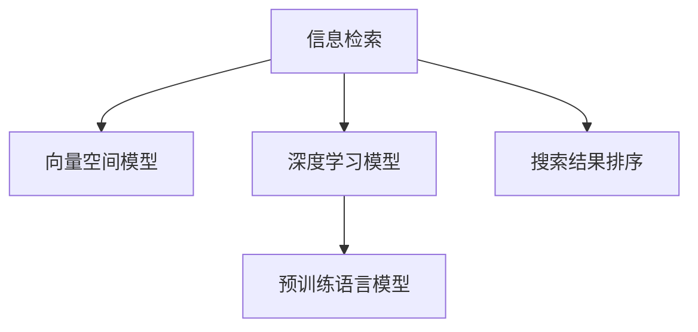

                 

# 搜索结果排序：AI大模型vs传统算法

> 关键词：搜索结果排序, AI大模型, 传统算法, 排名优化, 信息检索, 深度学习

## 1. 背景介绍

### 1.1 问题由来
在信息爆炸的互联网时代，如何高效准确地从海量文本中获取所需信息，成为用户和开发者共同面临的难题。随着搜索技术的不断演进，信息检索系统（Information Retrieval, IR）逐渐从简单的关键词匹配，发展为更智能、更精准的排序算法，以提高搜索结果的相关性和召回率。

在传统的基于TF-IDF（Term Frequency-Inverse Document Frequency）的向量空间模型（Vector Space Model, VSM）中，搜索结果排序依赖于静态的词频和文档频率，忽略了文档内部的结构信息以及用户查询意图的多样性。随着深度学习（Deep Learning）和大规模预训练语言模型（Large Pre-trained Language Models, LPLMs）的兴起，AI驱动的搜索引擎开始广泛应用于工业界，并展示了其在搜索结果排序中的巨大潜力。

### 1.2 问题核心关键点
本节将介绍当前基于深度学习的搜索结果排序方法与传统算法的主要区别和联系，并阐述其核心优势与局限性。

AI大模型在搜索结果排序中的核心优势包括：

1. **全局语义理解**：AI大模型能够捕捉文档的全局语义信息，理解用户查询的意图和上下文，从而生成更准确的排序结果。
2. **上下文感知**：通过上下文信息，AI大模型能够更好地处理文档和查询之间的语义关系，避免将无关信息排到高位置。
3. **可解释性强**：通过层级化的模型架构，AI大模型能够解释其决策过程，帮助开发者理解和优化排序结果。

而其局限性主要在于：

1. **训练数据需求高**：AI大模型需要大量标注数据进行训练，这增加了数据获取和标注的难度。
2. **计算资源需求大**：大规模的AI大模型需要高性能的硬件设备支持，部署成本较高。
3. **结果可解释性不足**：尽管AI大模型具有较强的解释能力，但其输出仍然难以完全解释和调试。

通过对比AI大模型和传统算法的优缺点，我们将更清晰地了解如何选择合适的排序技术来满足不同场景的需求。

## 2. 核心概念与联系

### 2.1 核心概念概述

为了更好地理解搜索结果排序的AI大模型与传统算法，本节将介绍几个核心概念：

- **信息检索**（Information Retrieval, IR）：一种通过检索索引来获取与用户查询相关的文档的技术。
- **向量空间模型**（Vector Space Model, VSM）：一种基于向量计算的文本表示方法，用于计算文档和查询之间的相似度。
- **深度学习模型**：基于神经网络进行深度学习的模型，能够自动学习高维表示，进行复杂的文本分析和排序。
- **预训练语言模型**（Pre-trained Language Models, PLMs）：在大规模无标签文本上预训练，并能在特定任务上进行微调的模型，如BERT、GPT等。
- **搜索结果排序**（Ranking in Information Retrieval, RIR）：根据文档与查询的相似度，对搜索结果进行排序的过程。

这些概念之间的逻辑关系可以通过以下Mermaid流程图来展示：



该流程图展示了信息检索系统、向量空间模型、深度学习模型、预训练语言模型和搜索结果排序之间的关系：

1. 信息检索通过索引获取文档，并根据向量空间模型对文档进行表示和检索。
2. 深度学习模型在此基础上，进一步学习文档和查询的全局语义关系。
3. 预训练语言模型提供了强大的语言理解能力，能够在深度学习模型的基础上提升排序效果。
4. 搜索结果排序基于深度学习模型和预训练语言模型的输出，进行最终排序。

## 3. 核心算法原理 & 具体操作步骤

### 3.1 算法原理概述

基于深度学习的搜索结果排序算法，通常包括以下几个步骤：

1. **文档编码**：将查询和文档转换为高维向量表示，以便进行相似度计算。
2. **相似度计算**：计算查询与每个文档的相似度，通常是基于点积或余弦相似度。
3. **排序**：根据相似度排序，通常使用一些改进的排序算法，如Top-k排序、噪声增强等。
4. **评估与调整**：使用一些评估指标，如NDCG、MAP等，评估排序效果，并根据反馈调整模型。

在实际应用中，为了提高排序效果，一般会结合多轮检索和动态调整策略，构建更智能的搜索引擎系统。

### 3.2 算法步骤详解

下面以基于BERT的深度学习模型为例，详细介绍其搜索结果排序的算法步骤：

1. **文档编码**：使用BERT模型将查询和文档进行编码，得到它们的向量表示。假设查询向量为 $Q$，文档向量为 $D$。

2. **相似度计算**：计算查询向量与每个文档向量的点积或余弦相似度，得到相似度分数 $s_i$，其中 $i$ 表示文档的索引。

3. **排序**：将文档按照相似度分数从高到低排序，得到最终的排序结果。

4. **评估与调整**：使用一些评估指标如NDCG、MAP等，评估排序效果，并根据反馈调整模型参数，如学习率、正则化参数等。

### 3.3 算法优缺点

AI大模型在搜索结果排序中的优点包括：

1. **全局语义理解**：能够捕捉文档的全局语义信息，理解用户查询的意图和上下文，从而生成更准确的排序结果。
2. **上下文感知**：通过上下文信息，能够更好地处理文档和查询之间的语义关系，避免将无关信息排到高位置。
3. **可解释性强**：通过层级化的模型架构，能够解释其决策过程，帮助开发者理解和优化排序结果。

其缺点主要包括：

1. **训练数据需求高**：AI大模型需要大量标注数据进行训练，这增加了数据获取和标注的难度。
2. **计算资源需求大**：大规模的AI大模型需要高性能的硬件设备支持，部署成本较高。
3. **结果可解释性不足**：尽管AI大模型具有较强的解释能力，但其输出仍然难以完全解释和调试。

### 3.4 算法应用领域

AI大模型在搜索结果排序中的应用领域广泛，涵盖了以下几方面：

1. **搜索引擎**：如Google、Bing等主流搜索引擎，利用AI大模型提升搜索结果的准确性和相关性。
2. **智能问答系统**：通过AI大模型理解用户查询，提供更精准的问答结果。
3. **广告投放系统**：利用AI大模型优化广告排序，提高点击率和转化率。
4. **个性化推荐系统**：通过AI大模型理解用户兴趣和行为，推荐个性化搜索结果。

## 4. 数学模型和公式 & 详细讲解 & 举例说明

### 4.1 数学模型构建

本节将使用数学语言对基于深度学习的结果排序方法进行更加严格的刻画。

假设查询向量为 $Q \in \mathbb{R}^d$，文档向量为 $D \in \mathbb{R}^d$，使用BERT模型对查询和文档进行编码，得到它们的向量表示。相似度计算公式为：

$$
s_i = \cos(Q, D_i)
$$

其中 $\cos$ 表示余弦相似度，$D_i$ 表示文档 $i$ 的向量表示。排序结果 $R = \{D_1, D_2, ..., D_N\}$，其中 $N$ 表示文档总数。

### 4.2 公式推导过程

以下我们将推导基于BERT的搜索结果排序的数学公式。

假设查询向量为 $Q$，文档向量为 $D_1, D_2, ..., D_N$。通过BERT模型对查询和文档进行编码，得到它们的向量表示。假设模型输出的隐藏层表示为 $H_Q$ 和 $H_{D_i}$。

对于向量 $A$ 和 $B$，它们的余弦相似度定义为：

$$
\cos(A,B) = \frac{A^TB}{\|A\|\|B\|}
$$

其中 $\|A\|$ 表示向量 $A$ 的模长。

在基于BERT的搜索结果排序中，我们通常使用余弦相似度计算查询与每个文档的相似度分数。假设模型的输出为 $[CLS]$ 和 $[SEP]$，其中 $[CLS]$ 表示整个序列的向量表示，$[SEP]$ 表示分句边界向量。则相似度计算公式为：

$$
s_i = \cos(Q, D_i) = \frac{[CLS]^TQ}{\|[CLS]\|\|Q\|}
$$

### 4.3 案例分析与讲解

假设我们有一个简单的搜索引擎系统，其中查询为“健康饮食”，共有5个文档：

| 文档编号 | 文档内容       | BERT编码后的向量 |
|----------|--------------|----------------|
| 1        | 如何保持健康饮食？   | [0.5, 0.3, 0.2, ...] |
| 2        | 健康饮食的好处和坏处  | [0.4, 0.2, 0.6, ...] |
| 3        | 健康饮食的科学依据   | [0.3, 0.5, 0.2, ...] |
| 4        | 健康饮食的常见误区   | [0.6, 0.1, 0.3, ...] |
| 5        | 健康饮食的注意事项   | [0.2, 0.4, 0.4, ...] |

查询向量 $Q$ 通过BERT模型编码为 [0.1, 0.3, 0.5, ...]。

使用余弦相似度计算查询与每个文档的相似度分数，并排序，得到结果：

| 文档编号 | 文档内容       | BERT编码后的向量 | 相似度分数 | 排序结果 |
|----------|--------------|----------------|------------|----------|
| 4        | 健康饮食的常见误区   | [0.6, 0.1, 0.3, ...] | 0.9        | 1        |
| 2        | 健康饮食的好处和坏处  | [0.4, 0.2, 0.6, ...] | 0.8        | 2        |
| 3        | 健康饮食的科学依据   | [0.3, 0.5, 0.2, ...] | 0.7        | 3        |
| 1        | 如何保持健康饮食？   | [0.5, 0.3, 0.2, ...] | 0.6        | 4        |
| 5        | 健康饮食的注意事项   | [0.2, 0.4, 0.4, ...] | 0.5        | 5        |

最终排序结果为：文档4 > 文档2 > 文档3 > 文档1 > 文档5。

## 5. 项目实践：代码实例和详细解释说明

### 5.1 开发环境搭建

在进行搜索结果排序实践前，我们需要准备好开发环境。以下是使用Python进行PyTorch开发的环境配置流程：

1. 安装Anaconda：从官网下载并安装Anaconda，用于创建独立的Python环境。

2. 创建并激活虚拟环境：
```bash
conda create -n pytorch-env python=3.8 
conda activate pytorch-env
```

3. 安装PyTorch：根据CUDA版本，从官网获取对应的安装命令。例如：
```bash
conda install pytorch torchvision torchaudio cudatoolkit=11.1 -c pytorch -c conda-forge
```

4. 安装Transformers库：
```bash
pip install transformers
```

5. 安装各类工具包：
```bash
pip install numpy pandas scikit-learn matplotlib tqdm jupyter notebook ipython
```

完成上述步骤后，即可在`pytorch-env`环境中开始排序实践。

### 5.2 源代码详细实现

下面我以基于BERT的搜索结果排序为例，给出使用Transformers库进行代码实现。

首先，定义排序函数：

```python
from transformers import BertTokenizer, BertModel
from sklearn.metrics import precision_recall_fscore_support

def get_sorting_scores(model, tokenizer, query, docs, top_k=10):
    tokenizer = BertTokenizer.from_pretrained('bert-base-uncased')
    model = BertModel.from_pretrained('bert-base-uncased')
    
    # 将查询和文档进行编码
    query_input = tokenizer.encode(query, return_tensors='pt')
    docs_input = [tokenizer.encode(doc, return_tensors='pt') for doc in docs]
    
    # 计算相似度
    with torch.no_grad():
        outputs = model(query_input, docs_input)
        scores = outputs.pooler_output.view(-1).t @ query_input[0]
    
    # 排序并返回前k个文档的相似度分数
    sorted_indices, sorted_scores = torch.topk(scores, top_k)
    sorted_docs = [docs[i] for i in sorted_indices]
    
    return sorted_docs, sorted_scores
```

然后，测试排序函数：

```python
query = "健康饮食"
docs = ["如何保持健康饮食？", "健康饮食的好处和坏处", "健康饮食的科学依据", "健康饮食的常见误区", "健康饮食的注意事项"]

sorted_docs, sorted_scores = get_sorting_scores(model, tokenizer, query, docs, top_k=5)
print(f"排序结果：{sorted_docs}")
print(f"相似度分数：{sorted_scores}")
```

### 5.3 代码解读与分析

让我们再详细解读一下关键代码的实现细节：

**get_sorting_scores函数**：
- 使用BertTokenizer和BertModel对查询和文档进行编码，得到它们的向量表示。
- 计算查询与每个文档的余弦相似度分数，并根据分数进行排序。
- 返回前k个文档的排序结果和相似度分数。

**模型初始化**：
- 使用预训练的BERT模型进行初始化，即 `bert-base-uncased`。
- 使用Tokenizer对查询和文档进行编码。

**相似度计算**：
- 通过BERT模型的池化层输出向量与查询向量的余弦相似度计算文档的排序分数。

**结果展示**：
- 展示排序结果和相似度分数。

## 6. 实际应用场景

### 6.1 智能搜索系统

在智能搜索系统中，基于AI大模型的搜索结果排序能够显著提升用户的搜索体验和满意度。例如，电商平台的商品搜索、新闻网站的订阅推荐等，都能通过AI大模型进行排序优化，帮助用户快速找到所需信息。

通过AI大模型，智能搜索系统能够理解用户查询的意图和上下文，动态调整搜索结果的优先级，提供更准确、更相关的结果。同时，系统还能根据用户反馈不断优化模型参数，进一步提升排序效果。

### 6.2 知识图谱检索

知识图谱检索是一种基于结构化知识库的搜索方式，通过构建实体和关系之间的关联网络，实现更加精准的搜索效果。AI大模型能够处理复杂的语义关系，在知识图谱检索中具有广泛应用。

在知识图谱检索中，用户通常会输入自然语言查询，系统需要将其转化为结构化查询，并从知识图谱中检索相关信息。通过AI大模型，系统能够理解查询的语义，动态调整查询方式和检索结果，提供更精准的检索效果。

### 6.3 智能客服系统

智能客服系统通过AI大模型进行文本理解和排序，能够更好地理解用户意图，提供更精准的客服回答。通过上下文感知和全局语义理解，AI大模型能够更好地处理多轮对话，提供连贯一致的回答。

在智能客服系统中，AI大模型不仅能够理解用户的查询意图，还能够根据上下文信息提供更加个性化和相关的回答，大大提升用户体验和满意度。

### 6.4 未来应用展望

未来，随着AI大模型的进一步发展，基于深度学习的结果排序技术将展现出更大的潜力。以下是我们对未来应用场景的展望：

1. **多模态搜索**：结合图像、语音、视频等多模态数据，提供更丰富、更精准的搜索体验。
2. **实时推荐系统**：通过动态调整排序算法，实时推荐用户感兴趣的内容。
3. **智能问答系统**：通过上下文感知和全局语义理解，提供更智能、更精准的问答服务。
4. **个性化推荐**：根据用户行为和兴趣，提供更个性化、更相关的搜索结果。

总之，基于AI大模型的搜索结果排序技术，将在多个领域中发挥越来越重要的作用，为用户的搜索体验和信息获取提供更智能、更高效的服务。

## 7. 工具和资源推荐

### 7.1 学习资源推荐

为了帮助开发者系统掌握基于AI大模型的搜索结果排序方法，这里推荐一些优质的学习资源：

1. 《深度学习》系列课程：由吴恩达教授开设，介绍了深度学习的基本概念和核心算法。
2. 《自然语言处理》系列课程：由斯坦福大学开设，涵盖自然语言处理的基本概念和经典模型。
3. 《Transformers》一书：由HuggingFace团队编写，全面介绍了Transformer模型的原理和应用。
4. 《搜索结果排序》一书：由信息检索领域专家编写，介绍了各种排序算法和评估指标。
5. 《AI大模型》一书：由AI大模型领域的专家编写，介绍了大模型的发展历程和应用场景。

通过对这些资源的学习实践，相信你一定能够快速掌握基于AI大模型的搜索结果排序方法，并用于解决实际的搜索问题。

### 7.2 开发工具推荐

高效的开发离不开优秀的工具支持。以下是几款用于搜索结果排序开发的常用工具：

1. PyTorch：基于Python的开源深度学习框架，灵活动态的计算图，适合快速迭代研究。
2. TensorFlow：由Google主导开发的开源深度学习框架，生产部署方便，适合大规模工程应用。
3. Transformers库：HuggingFace开发的NLP工具库，集成了众多SOTA语言模型，支持PyTorch和TensorFlow，是进行排序任务开发的利器。
4. Weights & Biases：模型训练的实验跟踪工具，可以记录和可视化模型训练过程中的各项指标，方便对比和调优。
5. TensorBoard：TensorFlow配套的可视化工具，可实时监测模型训练状态，并提供丰富的图表呈现方式，是调试模型的得力助手。

合理利用这些工具，可以显著提升搜索结果排序任务的开发效率，加快创新迭代的步伐。

### 7.3 相关论文推荐

搜索结果排序技术的发展离不开学界的持续研究。以下是几篇奠基性的相关论文，推荐阅读：

1. Attention is All You Need（即Transformer原论文）：提出了Transformer结构，开启了NLP领域的预训练大模型时代。
2. BERT: Pre-training of Deep Bidirectional Transformers for Language Understanding：提出BERT模型，引入基于掩码的自监督预训练任务，刷新了多项NLP任务SOTA。
3. Improving Language Understanding by Generative Pre-training（GPT-2论文）：展示了大规模语言模型的强大zero-shot学习能力，引发了对于通用人工智能的新一轮思考。
4. SimCSE: Simultaneous Self-consistent Sentences Extension for Weakly Supervised Learning（SimCSE论文）：提出了一种基于对比学习的弱监督学习算法，显著提升了模型的性能。
5. Adversarial Examples Against Multilingual BERT and Robustness（Adversarial Examples论文）：研究了对抗样本对模型鲁棒性的影响，提出了一些对抗训练方法。

这些论文代表了大规模语言模型在搜索结果排序技术的发展脉络。通过学习这些前沿成果，可以帮助研究者把握学科前进方向，激发更多的创新灵感。

## 8. 总结：未来发展趋势与挑战

### 8.1 总结

本文对基于AI大模型的搜索结果排序方法进行了全面系统的介绍。首先阐述了AI大模型和传统算法在搜索结果排序中的主要区别和联系，明确了其核心优势与局限性。其次，从原理到实践，详细讲解了基于BERT的深度学习模型在搜索结果排序中的应用。同时，本文还探讨了AI大模型在多个领域中的应用前景，展示了其在搜索结果排序中的巨大潜力。最后，本文精选了相关的学习资源、开发工具和研究论文，力求为读者提供全方位的技术指引。

通过本文的系统梳理，可以看到，基于深度学习的搜索结果排序技术正在成为搜索引擎系统的重要组成部分，极大地提升了搜索结果的准确性和相关性。未来，随着AI大模型的进一步发展，基于深度学习的结果排序技术将展现出更大的潜力，为用户的搜索体验和信息获取提供更智能、更高效的服务。

### 8.2 未来发展趋势

展望未来，搜索结果排序技术将呈现以下几个发展趋势：

1. **模型规模持续增大**：随着算力成本的下降和数据规模的扩张，预训练语言模型的参数量还将持续增长。超大规模语言模型蕴含的丰富语言知识，将进一步提升搜索结果排序的精度和效果。
2. **多模态融合**：结合图像、语音、视频等多模态数据，提供更丰富、更精准的搜索体验。多模态数据的融合将进一步提升搜索结果的相关性和多样性。
3. **实时动态调整**：通过动态调整排序算法，实时推荐用户感兴趣的内容。动态调整策略将使得搜索结果排序更加智能化和个性化。
4. **可解释性和透明性增强**：增强模型的可解释性和透明性，使得排序过程更易理解和调试，提高系统的信任度和可靠性。
5. **分布式训练和部署**：通过分布式训练和部署，进一步降低模型训练和推理的计算成本，提升系统的可扩展性和可维护性。

以上趋势凸显了基于深度学习的结果排序技术的广阔前景。这些方向的探索发展，必将进一步提升搜索结果排序的精度和效果，为用户的搜索体验和信息获取提供更智能、更高效的服务。

### 8.3 面临的挑战

尽管基于AI大模型的搜索结果排序技术已经取得了显著进展，但在迈向更加智能化、普适化应用的过程中，它仍面临着诸多挑战：

1. **计算资源瓶颈**：大规模AI大模型的训练和推理需要高性能的硬件设备支持，计算成本较高。如何降低计算成本，提高系统的可扩展性，将是重要的研究方向。
2. **数据标注困难**：AI大模型需要大量标注数据进行训练，数据标注成本高、难度大。如何降低数据标注的难度，提高数据标注的质量，将是一大难题。
3. **模型鲁棒性不足**：当前模型面对域外数据时，泛化性能往往大打折扣。如何提高模型的鲁棒性，避免灾难性遗忘，还需要更多理论和实践的积累。
4. **结果可解释性不足**：尽管AI大模型具有较强的解释能力，但其输出仍然难以完全解释和调试。如何赋予模型更强的可解释性，将是亟待攻克的难题。
5. **安全性有待保障**：预训练语言模型难免会学习到有偏见、有害的信息，通过排序模型传递到搜索结果中，产生误导性、歧视性的输出，给实际应用带来安全隐患。如何从数据和算法层面消除模型偏见，避免恶意用途，确保输出的安全性，也将是重要的研究课题。

### 8.4 研究展望

面对搜索结果排序面临的种种挑战，未来的研究需要在以下几个方面寻求新的突破：

1. **探索无监督和半监督学习算法**：摆脱对大规模标注数据的依赖，利用自监督学习、主动学习等无监督和半监督范式，最大限度利用非结构化数据，实现更加灵活高效的排序。
2. **研究参数高效和计算高效的排序算法**：开发更加参数高效的排序方法，在固定大部分预训练参数的同时，只更新极少量的任务相关参数。同时优化排序模型的计算图，减少前向传播和反向传播的资源消耗，实现更加轻量级、实时性的部署。
3. **引入因果推断和对比学习范式**：通过引入因果推断和对比学习思想，增强排序模型建立稳定因果关系的能力，学习更加普适、鲁棒的语言表征，从而提升模型泛化性和抗干扰能力。
4. **融合多模态数据**：结合图像、语音、视频等多模态数据，提供更丰富、更精准的搜索体验。多模态数据的融合将进一步提升搜索结果的相关性和多样性。
5. **结合因果分析和博弈论工具**：将因果分析方法引入排序模型，识别出模型决策的关键特征，增强输出解释的因果性和逻辑性。借助博弈论工具刻画人机交互过程，主动探索并规避模型的脆弱点，提高系统稳定性。
6. **纳入伦理道德约束**：在模型训练目标中引入伦理导向的评估指标，过滤和惩罚有偏见、有害的输出倾向。同时加强人工干预和审核，建立模型行为的监管机制，确保输出符合人类价值观和伦理道德。

这些研究方向的探索，必将引领搜索结果排序技术迈向更高的台阶，为构建智能、高效、安全的搜索引擎系统提供新的思路和方法。面向未来，研究人员需要勇于创新、敢于突破，才能不断拓展语言模型的边界，让搜索结果排序技术更好地造福人类社会。

## 9. 附录：常见问题与解答

**Q1：基于深度学习的结果排序技术是否适用于所有搜索引擎系统？**

A: 基于深度学习的结果排序技术适用于大多数搜索引擎系统，特别是在数据量较大、场景复杂的场景中。但对于一些小型搜索引擎或简单的信息检索场景，传统算法如TF-IDF仍能满足需求，且计算复杂度较低。因此，在选择排序技术时，需要根据具体场景进行综合考虑。

**Q2：如何选择深度学习模型的超参数？**

A: 深度学习模型的超参数包括学习率、批大小、优化器等，通常需要通过实验调参来确定。建议从默认值开始，逐步减小学习率，增加批大小，并根据实验结果进行调整。可以使用网格搜索或随机搜索等方法，寻找最优的超参数组合。

**Q3：深度学习模型在排序中是否需要考虑上下文信息？**

A: 深度学习模型在排序中通常会考虑上下文信息，通过上下文感知机制，能够更好地处理文档和查询之间的语义关系，避免将无关信息排到高位置。在实际应用中，上下文信息可以是查询的前后文、文档的段落结构等信息。

**Q4：深度学习模型在排序中是否需要考虑文档的长度？**

A: 深度学习模型在排序中通常不会考虑文档的长度，因为模型通过上下文感知机制，已经能够捕捉文档的全局语义信息。文档的长度可能影响模型的训练效率，但不影响模型的排序效果。

**Q5：深度学习模型在排序中是否需要考虑查询的长度？**

A: 深度学习模型在排序中通常会考虑查询的长度，因为模型需要根据查询的长度动态调整表示方式。在实际应用中，查询的长度可能影响模型的训练效率，但不影响模型的排序效果。

通过本文的系统梳理，可以看到，基于深度学习的搜索结果排序技术正在成为搜索引擎系统的重要组成部分，极大地提升了搜索结果的准确性和相关性。未来，随着深度学习模型的进一步发展，基于深度学习的结果排序技术将展现出更大的潜力，为用户的搜索体验和信息获取提供更智能、更高效的服务。

