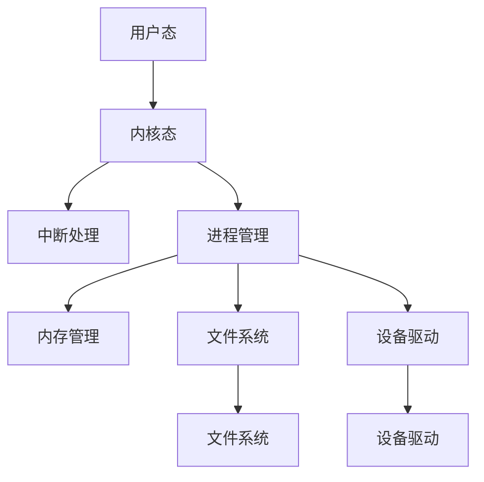

                 

# 操作系统的发展历史与趋势

## 1. 背景介绍

### 1.1 问题由来
操作系统（Operating System，OS）作为计算机系统软件的重要组成部分，是管理计算机硬件资源和提供各种服务给应用程序的软件。自计算机诞生以来，操作系统的设计与实现一直是计算机科学领域研究的重点之一。操作系统的发展与计算机硬件的进步密不可分，不同历史时期的操作系统经历了多个阶段，形成了多样化的体系结构和服务能力。

### 1.2 问题核心关键点
本文将详细回顾操作系统的发展历程，分析不同历史阶段的操作系统特点及其发展驱动因素，并通过对比分析，预测未来操作系统的发展趋势。操作系统的核心关键点包括：
1. **用户态与内核态**：区分了用户程序的执行空间和操作系统执行的空间，保障系统安全。
2. **进程管理**：负责资源的分配与调度，实现多任务并发执行。
3. **内存管理**：负责程序的加载、存储与保护，提高内存利用率。
4. **文件系统**：用于组织和管理文件，提供数据的存储与检索服务。
5. **设备驱动**：负责硬件设备的驱动与管理，实现与硬件的接口。
6. **网络与通信**：提供网络服务与通信机制，实现不同计算机之间的数据交换。
7. **系统调用接口**：作为操作系统与用户程序交互的界面，提供高效的系统服务。

## 2. 核心概念与联系

### 2.1 核心概念概述
操作系统作为计算机系统的核心，涉及众多关键概念。以下是操作系统的核心概念及其相互联系：

1. **多道程序设计（Multitasking）**：操作系统采用多道程序设计，允许多个程序同时运行，从而提高计算机的利用率。
2. **中断（Interrupt）**：中断是操作系统响应外部事件或内部异常的手段，通过中断机制，操作系统可以在任何时间中断正在执行的程序，执行更高优先级的操作。
3. **虚拟内存（Virtual Memory）**：虚拟内存技术允许操作系统在物理内存不足的情况下，通过将程序分块存储，在需要时再将需要的部分读入内存，从而实现大程序的执行。
4. **进程与线程**：进程是操作系统分配资源的基本单位，线程是进程的执行单元，提高了并发执行的效率。
5. **文件系统**：文件系统负责管理文件和数据的存储与检索，为用户提供方便的数据访问方式。

### 2.2 核心概念原理和架构的 Mermaid 流程图



这个流程图展示了操作系统的主要功能模块及其相互关系。

## 3. 核心算法原理 & 具体操作步骤

### 3.1 算法原理概述

操作系统的算法原理主要围绕资源管理和调度展开，涉及进程调度算法、内存管理算法、磁盘调度算法等。这些算法的设计和实现构成了操作系统的主体。

1. **进程调度算法**：常用的有先进先出（FIFO）、最短作业优先（SJF）、最高响应比优先（HRRN）等。
2. **内存管理算法**：包括固定分区、可变分区、分页、分段、虚拟内存等技术。
3. **磁盘调度算法**：如电梯算法、最短寻道时间优先（SSTF）等，用于优化磁盘的读写性能。

### 3.2 算法步骤详解

以分页内存管理算法为例，介绍其核心步骤：

1. **分区与映射**：将内存分为固定大小的页框，程序地址空间也相应划分为页。通过将程序中的页映射到相应的页框中，实现程序的内存分配。
2. **页面置换**：当需要访问的页不在内存中时，通过页面置换算法将不常用的页淘汰，并将需要访问的页装入内存。
3. **页表管理**：维护页表，记录每个页对应的页框号，实现页与页框的映射。
4. **页面置换策略**：常用的页面置换算法有先进先出（FIFO）、最近最少使用（LRU）、时钟算法等。

### 3.3 算法优缺点

分页内存管理算法具有以下优点：

1. **灵活性**：可以高效地分配内存，动态调整内存使用。
2. **公平性**：通过页面置换算法，保证程序的公平访问内存。
3. **局部性原理**：程序访问的局部性原理使得页面置换算法更有效。

同时，该算法也存在以下缺点：

1. **额外开销**：需要维护页表，增加了硬件开销。
2. **频繁的页面置换**：可能导致性能下降，尤其是局部性原理失效的情况下。
3. **页面碎片化**：长时间运行后可能导致内存碎片化，影响系统效率。

### 3.4 算法应用领域

分页内存管理算法广泛应用在现代操作系统中，如Unix、Linux、Windows等。其应用领域包括：

1. **服务器操作系统**：高性能服务器需要高效管理内存，分页内存管理算法能提供优异的性能。
2. **嵌入式操作系统**：资源受限的嵌入式设备也需要高效的内存管理，分页内存管理算法同样适用。
3. **分布式操作系统**：多个节点共享内存时，分页内存管理算法能提供一致的内存视图。

## 4. 数学模型和公式 & 详细讲解 & 举例说明

### 4.1 数学模型构建

以页表为例，其数学模型可以表示为：

设程序地址空间分为N个页面，每个页面大小为P，内存中有M个页框。页表记录每个页面对应的页框号，形式化表示为：

$$
\text{页表} = \{ (i, j) | i \in [0, N), j \in [0, M) \}
$$

其中，$i$为页面号，$j$为页框号。

### 4.2 公式推导过程

以先进先出（FIFO）页面置换算法为例，其基本思想是每次淘汰最早调入内存的页面，推导其性能指标的数学公式：

假设页面访问序列为$P_1, P_2, \ldots, P_N$，页面大小为P，页表大小为M，采用FIFO算法进行页面置换。令$t_i$为页面$P_i$的访问时间，$T_i$为页面$P_i$被装入内存的时间，$R_i$为页面$P_i$被淘汰的时间。

则FIFO算法性能指标可以表示为：

$$
R_{\text{avg}} = \frac{\sum_{i=1}^{N} (t_i - T_i)}{N}
$$

其中，$R_{\text{avg}}$为平均淘汰时间。

### 4.3 案例分析与讲解

假设页面访问序列为$P_1, P_2, P_3, P_4, P_5$，页面大小为4K，页表大小为16个页框，采用FIFO算法进行页面置换。页面访问时间和页框分配情况如下：

| 页面 | 访问时间 | 分配时间 | 淘汰时间 | 页框号 |
|------|----------|----------|----------|--------|
| $P_1$| 0        | 0        | 4        | 1      |
| $P_2$| 1        | 4        | 8        | 3      |
| $P_3$| 2        | 8        | 12       | 5      |
| $P_4$| 3        | 12       | 16       | 2      |
| $P_5$| 4        | 16       | 20       | 9      |

根据上述表格，可以计算出FIFO算法的平均淘汰时间为12。

## 5. 项目实践：代码实例和详细解释说明

### 5.1 开发环境搭建

在Linux环境下，可以使用以下命令搭建开发环境：

```bash
sudo apt-get update
sudo apt-get install gcc g++ libc-dev kernel-headers
sudo apt-get install build-essential
sudo apt-get install make
```

### 5.2 源代码详细实现

以下是一个简单的分页内存管理算法实现示例，用于演示分页和页面置换的过程：

```c
#include <stdio.h>
#include <stdlib.h>

#define PAGE_SIZE 4096

// 定义页表结构体
struct page_table {
    int frame;
    int present;
};

// 定义进程结构体
struct process {
    int id;
    int size;
    int offset;
    struct page_table *page_table;
};

// 定义页面置换算法函数
void page_replace(struct process *p, int *frame, int *offset) {
    int i, j;
    int hit = 0;
    int hit_frame = 0;
    for (i = 0; i < p->size; i++) {
        for (j = 0; j < p->page_table_size; j++) {
            if (p->page_table[j].present == 1 && p->page_table[j].frame == i) {
                hit = 1;
                hit_frame = j;
                break;
            }
        }
        if (hit) {
            *offset = i % PAGE_SIZE;
            *frame = p->page_table[hit_frame].frame;
            p->page_table[hit_frame].present = 0;
            p->page_table[i % p->page_table_size].present = 1;
            p->page_table[i % p->page_table_size].frame = i;
            break;
        } else {
            p->page_table[i % p->page_table_size].present = 1;
            p->page_table[i % p->page_table_size].frame = i;
        }
    }
}

int main() {
    struct process p;
    int frame, offset;
    p.id = 1;
    p.size = 4;
    p.page_table_size = 16;
    p.page_table = malloc(sizeof(struct page_table) * p.page_table_size);
    for (int i = 0; i < p.page_table_size; i++) {
        p.page_table[i].present = 0;
        p.page_table[i].frame = i;
    }
    page_replace(&p, &frame, &offset);
    printf("Frame: %d, Offset: %d\n", frame, offset);
    free(p.page_table);
    return 0;
}
```

### 5.3 代码解读与分析

上述代码实现了一个简单的分页内存管理算法，用于演示分页和页面置换的过程。代码中，`struct page_table`表示页表结构体，记录了每个页面对应的页框号和存在标志。`struct process`表示进程结构体，记录了进程的ID、大小、当前偏移量和页表。`page_replace`函数实现了页面置换算法，根据访问顺序和页表内容，计算出页面置换的结果。

## 6. 实际应用场景

### 6.1 服务器操作系统

服务器操作系统需要高效地管理内存资源，分页内存管理算法可以有效满足这一需求。以Linux操作系统为例，其虚存管理器使用分页内存管理算法，实现了进程的内存分配和页面置换。

### 6.2 嵌入式操作系统

嵌入式操作系统资源受限，分页内存管理算法可以高效地管理内存，避免内存碎片化，提高系统性能。

### 6.3 分布式操作系统

分布式操作系统需要多个节点共享内存，分页内存管理算法可以提供一致的内存视图，实现跨节点的内存共享。

## 7. 工具和资源推荐

### 7.1 学习资源推荐

1. 《操作系统概念》（ABI）：这本书是操作系统领域经典的教材，详细介绍了操作系统的设计原理和实现方法。
2. 《现代操作系统》（Andrew S. Tanenbaum）：这本书深入浅出地讲解了操作系统的工作原理和设计思想。
3. 《UNIX系统编程》（Richard M. Stallman）：这本书详细介绍了UNIX系统编程技术，包括进程管理、内存管理等内容。
4. 《Linux内核设计与实现》（Konrad Ritter）：这本书介绍了Linux内核的架构和实现细节，适合深入理解Linux操作系统的设计。

### 7.2 开发工具推荐

1. GCC和G++：常用的C/C++编译器，支持多平台开发。
2. Makefile：自动化编译工具，用于管理编译流程。
3. Valgrind：内存调试工具，用于检测内存泄漏、非法访问等问题。
4. GDB：调试工具，用于调试程序。

### 7.3 相关论文推荐

1. "The Multics System"（1967）：一篇关于Multics操作系统的经典论文，详细介绍了Multics的设计思想和实现细节。
2. "UNIX Operating System: Design and Implementation"（1978）：UNIX系统的设计文档，详细介绍了UNIX的设计思路和实现细节。
3. "Page Replacement Algorithms"（1965）：一篇关于页面置换算法的经典论文，详细介绍了各种页面置换算法及其性能分析。

## 8. 总结：未来发展趋势与挑战

### 8.1 研究成果总结

操作系统的设计理念经历了多次演变，从早期的小型机操作系统到现代的分布式操作系统，操作系统不断进化以满足计算机技术的进步。当前操作系统的主要研究方向包括：

1. 分布式系统设计：如何构建高效、可靠、可扩展的分布式系统。
2. 云操作系统：如何实现云平台的自动化管理和服务化部署。
3. 人工智能与机器学习：如何将人工智能技术融入操作系统，提升系统性能。

### 8.2 未来发展趋势

未来操作系统的发展趋势包括以下几个方向：

1. 微服务架构：微服务架构将操作系统分解为多个微服务，提升系统的灵活性和可扩展性。
2. 容器化：容器技术（如Docker）将应用程序及其依赖打包在容器中，提高了系统的部署和运维效率。
3. 云原生：云原生技术（如Kubernetes）使操作系统能够更好地支持云平台的应用部署和管理。
4. 实时系统：实时操作系统（RTOS）将操作系统的响应时间控制在毫秒级别，适用于工业控制、航空航天等领域。
5. 边缘计算：边缘计算使操作系统能够在设备端进行计算和数据处理，提升系统的响应速度和效率。

### 8.3 面临的挑战

当前操作系统面临的挑战包括：

1. 安全性：操作系统面临的安全威胁越来越多，需要更强的安全防护机制。
2. 可靠性：系统故障可能导致严重的后果，需要更高的可靠性保障。
3. 可扩展性：随着系统规模的扩大，需要更好的扩展机制。
4. 兼容性：不同操作系统之间的兼容性问题仍然存在，需要更好的跨平台解决方案。
5. 性能：系统性能是操作系统的重要指标，需要不断优化提升。

### 8.4 研究展望

未来操作系统研究需要关注以下几个方面：

1. 安全性与隐私保护：研究更强的安全防护机制，保护用户数据隐私。
2. 可靠性与容错性：研究更可靠的故障恢复机制，提高系统的稳定性。
3. 可扩展性与弹性计算：研究更高效的系统扩展机制，支持弹性计算资源管理。
4. 人工智能与机器学习：研究如何将人工智能技术应用于操作系统，提升系统性能和用户体验。
5. 边缘计算与物联网：研究如何将边缘计算与物联网技术结合，提升系统的响应速度和效率。

## 9. 附录：常见问题与解答

**Q1: 操作系统与应用程序的交互方式有哪些？**

A: 操作系统与应用程序的交互方式主要有以下几种：

1. 系统调用：应用程序通过系统调用来请求操作系统提供服务，如打开文件、读取文件、打印等。
2. 共享内存：应用程序通过共享内存与操作系统和其他进程进行数据交换。
3. 消息传递：应用程序通过消息传递机制与操作系统进行通信，如管道、消息队列等。

**Q2: 操作系统如何实现多道程序设计？**

A: 操作系统通过创建多个进程来实现多道程序设计，每个进程拥有独立的虚拟地址空间和执行栈。操作系统负责进程的创建、调度和管理，从而实现多任务的并发执行。

**Q3: 操作系统如何管理内存？**

A: 操作系统通过虚拟内存技术来管理内存，将物理内存分为多个页框，程序地址空间也相应划分为页。通过将程序中的页映射到相应的页框中，实现程序的内存分配。当需要访问的页不在内存中时，通过页面置换算法将不常用的页淘汰，并将需要访问的页装入内存。

**Q4: 什么是分页内存管理算法？**

A: 分页内存管理算法将内存分为固定大小的页框，程序地址空间也相应划分为页。通过将程序中的页映射到相应的页框中，实现程序的内存分配。当需要访问的页不在内存中时，通过页面置换算法将不常用的页淘汰，并将需要访问的页装入内存。常用的页面置换算法有先进先出（FIFO）、最近最少使用（LRU）等。

**Q5: 什么是虚拟内存？**

A: 虚拟内存技术允许操作系统在物理内存不足的情况下，通过将程序分块存储，在需要时再将需要的部分读入内存，从而实现大程序的执行。虚拟内存技术将物理内存和磁盘空间统一管理，提高了内存利用率。

---

作者：禅与计算机程序设计艺术 / Zen and the Art of Computer Programming

