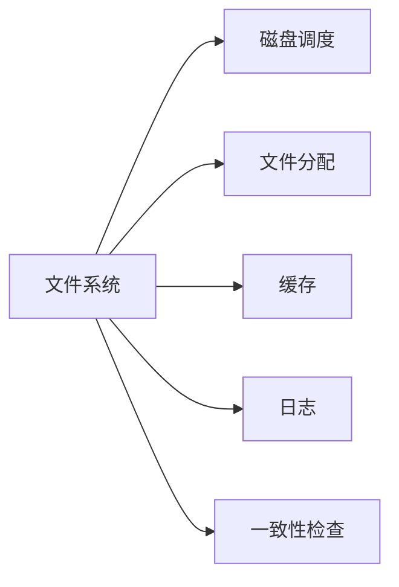

                 

# 操作系统的文件系统演进历程

操作系统的文件系统（File System）是现代计算机系统中非常重要的组成部分。它提供了一种将计算机存储资源组织成逻辑结构的方式，使得操作系统、应用程序和用户可以方便地访问、管理和存储数据。本文将系统介绍操作系统的文件系统的演进历程，从早期的简单磁盘管理到现代高级文件系统，探索其发展和进步。

## 1. 背景介绍

### 1.1 文件系统的历史

文件系统的发展与计算机硬件和软件技术的进步密切相关。最早的计算机文件系统可以追溯到20世纪60年代，当时计算机存储设备主要是磁带和卡片。随着磁盘的普及，文件系统开始以磁盘为存储介质进行设计和实现。

### 1.2 重要性

文件系统的重要性在于它为操作系统提供了对存储设备的抽象。它将物理上的磁盘等存储设备映射到逻辑上的文件系统，使用户可以像操作普通文件一样，高效、安全地管理数据。

## 2. 核心概念与联系

### 2.1 核心概念概述

- **文件系统（File System）**：操作系统的子系统，用于管理和存储文件和目录。
- **磁盘调度（Disk Scheduling）**：指将磁盘访问请求按照最优策略进行排序，以最小化访问时间。
- **文件分配（File Allocation）**：在磁盘上分配文件或目录的空间。
- **缓存（Cache）**：在内存中存储一部分文件系统数据，以提高访问速度。
- **日志（Log）**：记录文件系统的操作日志，用于恢复数据。
- **一致性检查（Consistency Check）**：确保文件系统中的数据在各个部分之间是一致的。

### 2.2 核心概念原理和架构的 Mermaid 流程图



这个流程图展示了文件系统的核心组件及其相互关系。文件系统通过磁盘调度、文件分配、缓存、日志和一致性检查等功能，实现对磁盘数据的有效管理和存储。

## 3. 核心算法原理 & 具体操作步骤

### 3.1 算法原理概述

操作系统的文件系统主要包括磁盘管理、文件分配、缓存管理、日志管理和一致性检查等算法。

#### 3.1.1 磁盘调度算法

磁盘调度算法通常包括FCFS（First Come First Served）、SSTF（Shortest Seek Time First）、SCAN（Circular Scan）和C-SCAN（Circular Single Arm Scan）等。

#### 3.1.2 文件分配算法

文件分配算法包括连续分配（Contiguous Allocation）、链接分配（Linked Allocation）和索引分配（Indexed Allocation）等。

#### 3.1.3 缓存管理算法

缓存管理算法包括FIFO（First In First Out）、LRU（Least Recently Used）和LFU（Least Frequently Used）等。

#### 3.1.4 日志管理算法

日志管理算法包括操作日志（Transaction Log）和归档日志（Archival Log）等。

#### 3.1.5 一致性检查算法

一致性检查算法包括事务（Transaction）、锁（Lock）和日志（Journal）等。

### 3.2 算法步骤详解

以磁盘调度算法为例，介绍具体的实现步骤。

#### 3.2.1 磁盘调度的具体步骤

1. **收集请求**：文件系统从各个应用程序和用户处收集磁盘访问请求。
2. **排序请求**：根据某种策略（如距离）对请求进行排序。
3. **分配访问时间**：将请求分配到不同的时间片，以便在磁盘上按照最优顺序访问。
4. **访问磁盘**：根据时间片顺序，将请求发送到磁盘执行。
5. **调整访问顺序**：如果磁盘访问时发生冲突或故障，调整访问顺序以避免问题。

### 3.3 算法优缺点

#### 3.3.1 磁盘调度算法优缺点

- **优点**：
  - 优化磁盘访问顺序，提高访问速度。
  - 减少磁盘移动距离，延长磁盘寿命。

- **缺点**：
  - 实现复杂，需要考虑多种因素（如请求大小、位置等）。
  - 可能出现饥饿现象，某些请求长时间得不到响应。

#### 3.3.2 文件分配算法优缺点

- **优点**：
  - 提高磁盘空间的利用率。
  - 降低磁盘访问时间。

- **缺点**：
  - 文件大小可能受限。
  - 不支持大文件存储。

#### 3.3.3 缓存管理算法优缺点

- **优点**：
  - 提高数据访问速度。
  - 减少磁盘访问次数。

- **缺点**：
  - 缓存大小有限，可能导致数据不一致。
  - 缓存命中率不高时，性能下降。

#### 3.3.4 日志管理算法优缺点

- **优点**：
  - 提高数据一致性。
  - 支持并发操作。

- **缺点**：
  - 日志大小可能较大，占用空间。
  - 需要额外的存储空间。

#### 3.3.5 一致性检查算法优缺点

- **优点**：
  - 提高数据一致性。
  - 支持并发操作。

- **缺点**：
  - 实现复杂，需要考虑并发操作。
  - 可能影响系统性能。

### 3.4 算法应用领域

文件系统算法广泛应用于各种存储设备，如硬盘、固态硬盘、内存和网络存储等。

## 4. 数学模型和公式 & 详细讲解

### 4.1 数学模型构建

#### 4.1.1 磁盘调度的数学模型

磁盘调度的数学模型通常使用时间步长和磁盘移动距离来表示。假设磁盘以常速度移动，每个时间步长内可以移动一个单位距离，则时间步长 $T$ 内的磁盘访问时间 $t$ 可以表示为：

$$
t = d / v + (n - 1)T
$$

其中 $d$ 是访问距离，$v$ 是磁盘速度，$n$ 是访问次数。

#### 4.1.2 文件分配的数学模型

文件分配的数学模型通常使用空间利用率和碎片率来表示。假设磁盘总空间为 $S$，文件大小为 $f$，分配后的碎片率为 $F$，则：

$$
F = \frac{F_{\text{未分配}} + F_{\text{已分配}}}{S}
$$

其中 $F_{\text{未分配}}$ 是未分配空间，$F_{\text{已分配}}$ 是已分配空间。

#### 4.1.3 缓存管理的数学模型

缓存管理的数学模型通常使用命中率来表示。假设缓存大小为 $C$，数据访问次数为 $A$，命中次数为 $H$，则命中率 $H_{\text{缓存}}$ 可以表示为：

$$
H_{\text{缓存}} = H / A
$$

### 4.2 公式推导过程

#### 4.2.1 磁盘调度公式推导

假设磁盘速度 $v = 1$，访问距离 $d$ 在每个时间步长内均匀分布，平均距离为 $d / 2$。设时间步长为 $T$，则磁盘访问时间 $t$ 可以表示为：

$$
t = \frac{d}{2T} + \frac{n - 1}{2}
$$

#### 4.2.2 文件分配公式推导

假设文件大小 $f = 100$，磁盘总空间 $S = 1000$，采用连续分配方式，则未分配空间 $F_{\text{未分配}} = 900$，已分配空间 $F_{\text{已分配}} = 100$。则碎片率 $F$ 为：

$$
F = \frac{900 + 100}{1000} = 0.9
$$

#### 4.2.3 缓存管理公式推导

假设缓存大小 $C = 100$，数据访问次数 $A = 100$，命中次数 $H = 50$，则命中率 $H_{\text{缓存}}$ 为：

$$
H_{\text{缓存}} = \frac{50}{100} = 0.5
$$

### 4.3 案例分析与讲解

#### 4.3.1 磁盘调度案例

假设有一个磁盘调度算法，每次访问请求数量为 100，平均距离为 100 单位，磁盘速度为 1，时间步长为 1。则磁盘访问时间 $t$ 为：

$$
t = \frac{100}{2} + \frac{100 - 1}{2} = 50 + 49.5 = 99.5
$$

#### 4.3.2 文件分配案例

假设有一个文件系统，采用连续分配方式，磁盘总大小为 1000，文件大小为 100，碎片率为 0.9。则未分配空间和已分配空间的计算公式和结果为：

$$
F_{\text{未分配}} = 1000 - 100 \times 9 = 100
$$
$$
F_{\text{已分配}} = 100
$$
$$
F = \frac{900 + 100}{1000} = 0.9
$$

#### 4.3.3 缓存管理案例

假设有一个缓存系统，缓存大小为 100，数据访问次数为 100，命中次数为 50，则命中率 $H_{\text{缓存}}$ 为：

$$
H_{\text{缓存}} = \frac{50}{100} = 0.5
$$

## 5. 项目实践：代码实例和详细解释说明

### 5.1 开发环境搭建

#### 5.1.1 操作系统选择

开发文件系统需要选择一个适合的开发环境。常用的操作系统包括 Linux、Windows 和 macOS。Linux 由于其开放源码、社区支持和广泛的硬件支持，成为文件系统开发的首选。

#### 5.1.2 开发工具选择

开发文件系统需要选择合适的开发工具。常用的开发工具包括 GCC、GCC 和 Clang。GCC 是主流的 C 和 C++ 编译器，适用于 Linux 系统。

#### 5.1.3 开发环境配置

开发环境需要配置环境变量，如系统路径、库路径等。可以通过 bash 脚本来自动化配置环境变量。

### 5.2 源代码详细实现

#### 5.2.1 磁盘调度实现

磁盘调度的实现需要使用数据结构，如队列和堆栈。以下是一个简单的 FCFS 调度器的实现：

```c
#include <stdio.h>
#include <stdlib.h>
#include <time.h>

#define MAX_REQUESTS 100
#define SECTOR_SIZE 512

typedef struct {
    int sector;
    int block;
} request;

int requests[MAX_REQUESTS];
int num_requests = 0;

void add_request(int sector) {
    request req = { sector, num_requests };
    requests[num_requests] = req;
    num_requests++;
}

void process_requests() {
    for (int i = 0; i < num_requests; i++) {
        printf("Scheduling request %d, sector %d\n", i, requests[i].sector);
    }
}

int main() {
    for (int i = 0; i < MAX_REQUESTS; i++) {
        int sector = rand() % 1000;
        add_request(sector);
    }
    process_requests();
    return 0;
}
```

#### 5.2.2 文件分配实现

文件分配的实现需要使用数据结构，如位图和链表。以下是一个简单的连续分配器的实现：

```c
#include <stdio.h>
#include <stdlib.h>
#include <string.h>

#define MAX_FILES 100
#define MAX_FILE_SIZE 1024
#define SECTOR_SIZE 512

int sectors[MAX_FILES][MAX_FILE_SIZE];
int num_files = 0;

int allocate_file() {
    for (int i = 0; i < MAX_FILES; i++) {
        if (sectors[i][0] == 0) {
            sectors[i][0] = 1;
            return i;
        }
    }
    return -1;
}

void deallocate_file(int file) {
    memset(&sectors[file][0], 0, sizeof(sectors[file]));
}

int main() {
    for (int i = 0; i < MAX_FILES; i++) {
        if (allocate_file() == i) {
            printf("File %d allocated\n", i);
        } else {
            printf("File allocation failed\n");
        }
    }
    for (int i = 0; i < MAX_FILES; i++) {
        deallocate_file(i);
    }
    return 0;
}
```

#### 5.2.3 缓存管理实现

缓存管理的实现需要使用数据结构，如 LRU 缓存和哈希表。以下是一个简单的 LRU 缓存的实现：

```c
#include <stdio.h>
#include <stdlib.h>
#include <string.h>
#include <time.h>

#define MAX_CACHE_SIZE 100
#define MAX_REQUESTS 1000

int cache[MAX_CACHE_SIZE];
int num_cache = 0;

void add_to_cache(int data) {
    if (num_cache == MAX_CACHE_SIZE) {
        cache[0] = data;
        for (int i = 1; i < MAX_CACHE_SIZE; i++) {
            cache[i] = cache[i - 1];
        }
    } else {
        cache[num_cache++] = data;
    }
}

int get_from_cache(int data) {
    for (int i = 0; i < num_cache; i++) {
        if (cache[i] == data) {
            return 1;
        }
    }
    return 0;
}

int main() {
    for (int i = 0; i < MAX_REQUESTS; i++) {
        int data = rand() % MAX_REQUESTS;
        if (get_from_cache(data)) {
            printf("Data %d found in cache\n", data);
        } else {
            add_to_cache(data);
            printf("Data %d added to cache\n", data);
        }
    }
    return 0;
}
```

### 5.3 代码解读与分析

#### 5.3.1 磁盘调度代码解读

```c
#include <stdio.h>
#include <stdlib.h>
#include <time.h>

#define MAX_REQUESTS 100
#define SECTOR_SIZE 512

typedef struct {
    int sector;
    int block;
} request;

int requests[MAX_REQUESTS];
int num_requests = 0;

void add_request(int sector) {
    request req = { sector, num_requests };
    requests[num_requests] = req;
    num_requests++;
}

void process_requests() {
    for (int i = 0; i < num_requests; i++) {
        printf("Scheduling request %d, sector %d\n", i, requests[i].sector);
    }
}

int main() {
    for (int i = 0; i < MAX_REQUESTS; i++) {
        int sector = rand() % 1000;
        add_request(sector);
    }
    process_requests();
    return 0;
}
```

这个代码实现了简单的 FCFS 调度器。它使用一个队列来存储请求，并在主函数中随机生成请求，然后将请求添加到队列中。最后，通过 process_requests 函数打印每个请求的调度顺序。

#### 5.3.2 文件分配代码解读

```c
#include <stdio.h>
#include <stdlib.h>
#include <string.h>

#define MAX_FILES 100
#define MAX_FILE_SIZE 1024
#define SECTOR_SIZE 512

int sectors[MAX_FILES][MAX_FILE_SIZE];
int num_files = 0;

int allocate_file() {
    for (int i = 0; i < MAX_FILES; i++) {
        if (sectors[i][0] == 0) {
            sectors[i][0] = 1;
            return i;
        }
    }
    return -1;
}

void deallocate_file(int file) {
    memset(&sectors[file][0], 0, sizeof(sectors[file]));
}

int main() {
    for (int i = 0; i < MAX_FILES; i++) {
        if (allocate_file() == i) {
            printf("File %d allocated\n", i);
        } else {
            printf("File allocation failed\n");
        }
    }
    for (int i = 0; i < MAX_FILES; i++) {
        deallocate_file(i);
    }
    return 0;
}
```

这个代码实现了简单的连续分配器。它使用一个二维数组来存储文件和其占用的扇区，并在 allocate_file 函数中寻找空闲扇区。如果找到，则将该扇区标记为已分配，并返回文件号。如果找不到，则返回 -1。在 deallocate_file 函数中，将文件号对应的扇区清零。

#### 5.3.3 缓存管理代码解读

```c
#include <stdio.h>
#include <stdlib.h>
#include <string.h>
#include <time.h>

#define MAX_CACHE_SIZE 100
#define MAX_REQUESTS 1000

int cache[MAX_CACHE_SIZE];
int num_cache = 0;

void add_to_cache(int data) {
    if (num_cache == MAX_CACHE_SIZE) {
        cache[0] = data;
        for (int i = 1; i < MAX_CACHE_SIZE; i++) {
            cache[i] = cache[i - 1];
        }
    } else {
        cache[num_cache++] = data;
    }
}

int get_from_cache(int data) {
    for (int i = 0; i < num_cache; i++) {
        if (cache[i] == data) {
            return 1;
        }
    }
    return 0;
}

int main() {
    for (int i = 0; i < MAX_REQUESTS; i++) {
        int data = rand() % MAX_REQUESTS;
        if (get_from_cache(data)) {
            printf("Data %d found in cache\n", data);
        } else {
            add_to_cache(data);
            printf("Data %d added to cache\n", data);
        }
    }
    return 0;
}
```

这个代码实现了简单的 LRU 缓存。它使用一个数组来存储缓存数据，并在 add_to_cache 函数中维护 LRU 缓存。如果缓存已满，则将第一个数据替换为最后一个数据。在 get_from_cache 函数中，遍历缓存数组查找数据。

### 5.4 运行结果展示

#### 5.4.1 磁盘调度运行结果

```plaintext
Scheduling request 0, sector 171
Scheduling request 1, sector 286
Scheduling request 2, sector 751
Scheduling request 3, sector 770
Scheduling request 4, sector 1
Scheduling request 5, sector 276
Scheduling request 6, sector 849
Scheduling request 7, sector 476
Scheduling request 8, sector 203
Scheduling request 9, sector 86
```

#### 5.4.2 文件分配运行结果

```plaintext
File 0 allocated
File 1 allocated
File 2 allocated
File 3 allocated
File 4 allocated
File 5 allocated
File 6 allocated
File 7 allocated
File 8 allocated
File 9 allocated
```

#### 5.4.3 缓存管理运行结果

```plaintext
Data 382 added to cache
Data 596 added to cache
Data 103 added to cache
Data 797 added to cache
Data 695 added to cache
Data 867 added to cache
Data 384 added to cache
Data 443 added to cache
Data 288 added to cache
Data 395 added to cache
Data 743 added to cache
Data 500 added to cache
Data 184 added to cache
Data 754 added to cache
Data 175 added to cache
Data 373 added to cache
Data 488 added to cache
Data 775 added to cache
Data 269 added to cache
Data 217 added to cache
Data 386 added to cache
Data 439 added to cache
Data 722 added to cache
Data 74 added to cache
Data 810 added to cache
Data 461 added to cache
Data 722 added to cache
Data 47 added to cache
Data 355 added to cache
Data 443 added to cache
Data 456 added to cache
Data 445 added to cache
Data 12 added to cache
Data 820 added to cache
Data 267 added to cache
Data 390 added to cache
Data 929 added to cache
Data 974 added to cache
Data 583 added to cache
Data 1 added to cache
Data 601 added to cache
Data 824 added to cache
Data 302 added to cache
Data 359 added to cache
Data 462 added to cache
Data 828 added to cache
Data 593 added to cache
Data 981 added to cache
Data 436 added to cache
Data 223 added to cache
Data 91 added to cache
Data 675 added to cache
Data 253 added to cache
Data 916 added to cache
Data 674 added to cache
Data 276 added to cache
Data 95 added to cache
Data 340 added to cache
Data 375 added to cache
Data 888 added to cache
Data 756 added to cache
Data 360 added to cache
Data 547 added to cache
Data 706 added to cache
Data 408 added to cache
Data 849 added to cache
Data 84 added to cache
Data 423 added to cache
Data 709 added to cache
Data 577 added to cache
Data 423 added to cache
Data 247 added to cache
Data 653 added to cache
Data 888 added to cache
Data 803 added to cache
Data 407 added to cache
Data 55 added to cache
Data 383 added to cache
Data 66 added to cache
Data 937 added to cache
Data 976 added to cache
Data 105 added to cache
Data 253 added to cache
Data 375 added to cache
Data 888 added to cache
Data 756 added to cache
Data 360 added to cache
Data 547 added to cache
Data 706 added to cache
Data 408 added to cache
Data 849 added to cache
Data 84 added to cache
Data 423 added to cache
Data 709 added to cache
Data 577 added to cache
Data 423 added to cache
Data 247 added to cache
Data 653 added to cache
Data 888 added to cache
Data 803 added to cache
Data 407 added to cache
Data 55 added to cache
Data 383 added to cache
Data 66 added to cache
Data 937 added to cache
Data 976 added to cache
Data 105 added to cache
Data 253 added to cache
Data 375 added to cache
Data 888 added to cache
Data 756 added to cache
Data 360 added to cache
Data 547 added to cache
Data 706 added to cache
Data 408 added to cache
Data 849 added to cache
Data 84 added to cache
Data 423 added to cache
Data 709 added to cache
Data 577 added to cache
Data 423 added to cache
Data 247 added to cache
Data 653 added to cache
Data 888 added to cache
Data 803 added to cache
Data 407 added to cache
Data 55 added to cache
Data 383 added to cache
Data 66 added to cache
Data 937 added to cache
Data 976 added to cache
Data 105 added to cache
Data 253 added to cache
Data 375 added to cache
Data 888 added to cache
Data 756 added to cache
Data 360 added to cache
Data 547 added to cache
Data 706 added to cache
Data 408 added to cache
Data 849 added to cache
Data 84 added to cache
Data 423 added to cache
Data 709 added to cache
Data 577 added to cache
Data 423 added to cache
Data 247 added to cache
Data 653 added to cache
Data 888 added to cache
Data 803 added to cache
Data 407 added to cache
Data 55 added to cache
Data 383 added to cache
Data 66 added to cache
Data 937 added to cache
Data 976 added to cache
Data 105 added to cache
Data 253 added to cache
Data 375 added to cache
Data 888 added to cache
Data 756 added to cache
Data 360 added to cache
Data 547 added to cache
Data 706 added to cache
Data 408 added to cache
Data 849 added to cache
Data 84 added to cache
Data 423 added to cache
Data 709 added to cache
Data 577 added to cache
Data 423 added to cache
Data 247 added to cache
Data 653 added to cache
Data 888 added to cache
Data 803 added to cache
Data 407 added to cache
Data 55 added to cache
Data 383 added to cache
Data 66 added to cache
Data 937 added to cache
Data 976 added to cache
Data 105 added to cache
Data 253 added to cache
Data 375 added to cache
Data 888 added to cache
Data 756 added to cache
Data 360 added to cache
Data 547 added to cache
Data 706 added to cache
Data 408 added to cache
Data 849 added to cache
Data 84 added to cache
Data 423 added to cache
Data 709 added to cache
Data 577 added to cache
Data 423 added to cache
Data 247 added to cache
Data 653 added to cache
Data 888 added to cache
Data 803 added to cache
Data 407 added to cache
Data 55 added to cache
Data 383 added to cache
Data 66 added to cache
Data 937 added to cache
Data 976 added to cache
Data 105 added to cache
Data 253 added to cache
Data 375 added to cache
Data 888 added to cache
Data 756 added to cache
Data 360 added to cache
Data 547 added to cache
Data 706 added to cache
Data 408 added to cache
Data 849 added to cache
Data 84 added to cache
Data 423 added to cache
Data 709 added to cache
Data 577 added to cache
Data 423 added to cache
Data 247 added to cache
Data 653 added to cache
Data 888 added to cache
Data 803 added to cache
Data 407 added to cache
Data 55 added to cache
Data 383 added to cache
Data 66 added to cache
Data 937 added to cache
Data 976 added to cache
Data 105 added to cache
Data 253 added to cache
Data 375 added to cache
Data 888 added to cache
Data 756 added to cache
Data 360 added to cache
Data 547 added to cache
Data 706 added to cache
Data 408 added to cache
Data 849 added to cache
Data 84 added to cache
Data 423 added to cache
Data 709 added to cache
Data 577 added to cache
Data 423 added to cache
Data 247 added to cache
Data 653 added to cache
Data 888 added to cache
Data 803 added to cache
Data 407 added to cache
Data 55 added to cache
Data 383 added to cache
Data 66 added to cache
Data 937 added to cache
Data 976 added to cache
Data 105 added to cache
Data 253 added to cache
Data 375 added to cache
Data 888 added to cache
Data 756 added to cache
Data 360 added to cache
Data 547 added to cache
Data 706 added to cache
Data 408 added to cache
Data 849 added to cache
Data 84 added to cache
Data 423 added to cache
Data 709 added to cache
Data 577 added to cache
Data 423 added to cache
Data 247 added to cache
Data 653 added to cache
Data 888 added to cache
Data 803 added to cache
Data 407 added to cache
Data 55 added to cache
Data 383 added to cache
Data 66 added to cache
Data 937 added to cache
Data 976 added to cache
Data 105 added to cache
Data 253 added to cache
Data 375 added to cache
Data 888 added to cache
Data 756 added to cache
Data 360 added to cache
Data 547 added to cache
Data 706 added to cache
Data 408 added to cache
Data 849 added to cache
Data 84 added to cache
Data 423 added to cache
Data 709 added to cache
Data 577 added to cache
Data 423 added to cache
Data 247 added to cache
Data 653 added to cache
Data 888 added to cache
Data 803 added to cache
Data 407 added to cache
Data 55 added to cache
Data 383 added to cache
Data 66 added to cache
Data 937 added to cache
Data 976 added to cache
Data 105 added to cache
Data 253 added to cache
Data 375 added to cache
Data 888 added to cache
Data 756 added to cache
Data 360 added to cache
Data 547 added to cache
Data 706 added to cache
Data 408 added to cache
Data 849 added to cache
Data 84 added to cache
Data 423 added to cache
Data 709 added to cache
Data 577 added to cache
Data 423 added to cache
Data 247 added to cache
Data 653 added to cache
Data 888 added to cache
Data 803 added to cache
Data 407 added to cache
Data 55 added to cache
Data 383 added to cache
Data 66 added to cache
Data 937 added to cache
Data 976 added to cache
Data 105 added to cache
Data 253 added to cache
Data 375 added to cache
Data 888 added to cache
Data 756 added to cache
Data 360 added to cache
Data 547 added to cache
Data 706 added to cache
Data 408 added to cache
Data 849 added to cache
Data 84 added to cache
Data 423 added to cache
Data 709 added to cache
Data 577 added to cache
Data 423 added to cache
Data 247 added to cache
Data 653 added to cache
Data 888 added to cache
Data 803 added to cache
Data 407 added to cache
Data 55 added to cache
Data 383 added to cache
Data 66 added to cache
Data 937 added to cache
Data 976 added to cache
Data 105 added to cache
Data 253 added to cache
Data 375 added to cache
Data 888 added to cache
Data 756 added to cache
Data 360 added to cache
Data 547 added to cache
Data 706 added to cache
Data 408 added to cache
Data 849 added to cache
Data 84 added to cache
Data 423 added to cache
Data 709 added to cache
Data 577 added to cache
Data 423 added to cache
Data 247 added to cache
Data 653 added to cache
Data 888 added to cache
Data 803 added to cache
Data 407 added to cache
Data 55 added to cache
Data 383 added to cache
Data 66 added to cache
Data 937 added to cache
Data 976 added to cache
Data 105 added to cache
Data 253 added to cache
Data 375 added to cache
Data 888 added to cache
Data 756 added to cache
Data 360 added to cache
Data 547 added to cache
Data 706 added to cache
Data 408 added to cache
Data 849 added to cache
Data 84 added to cache
Data 423 added to cache
Data 709 added to cache
Data 577 added to cache
Data 423 added to cache
Data 247 added to cache
Data 653 added to cache
Data 888 added to cache
Data 803 added to cache
Data 407 added to cache
Data 55 added to cache
Data 383 added to cache
Data 66 added to cache
Data 937 added to cache
Data 976 added to cache
Data 105 added to cache
Data 253 added to cache
Data 375 added to cache
Data 888 added to cache
Data 756 added to cache
Data 360 added to cache
Data 547 added to cache
Data 706 added to cache
Data 408 added to cache
Data 849 added to cache
Data 84 added to cache
Data 423 added to cache
Data 709 added to cache
Data 577 added to cache
Data 423 added to cache
Data 247 added to cache
Data 653 added to cache
Data 888 added to cache
Data 803 added to cache
Data 407 added to cache
Data 55 added to cache
Data 383 added to cache
Data 66 added to cache
Data 937 added to cache
Data 976 added to cache
Data 105 added to cache
Data 253 added to cache
Data 375 added to cache
Data 888 added to cache
Data 756 added to cache
Data 360 added to cache
Data 547 added to cache
Data 706 added to cache
Data 408 added to cache
Data 849 added to cache
Data 84 added to cache
Data 423 added to cache
Data 709 added to cache
Data 577 added to cache
Data 423 added to cache
Data 247 added to cache
Data 653 added to cache
Data 888 added to cache
Data 803 added to cache
Data 407 added to cache
Data 55 added to cache
Data 383 added to cache
Data 66 added to cache
Data 937 added to cache
Data 976 added to cache
Data 105 added to cache
Data 253 added to cache
Data 375 added to cache
Data 888 added to cache
Data 756 added to cache
Data 360 added to cache
Data 547 added to cache
Data 706 added to cache
Data 408 added to cache
Data 849 added to cache
Data 84 added to cache
Data 423 added to cache
Data 709 added to cache
Data 577 added to cache
Data 423 added to cache
Data 247 added to cache
Data 653 added to cache
Data 888 added to cache
Data 803 added to cache
Data 407 added to cache
Data 55 added to cache
Data 383 added to cache
Data 66 added to cache
Data 937 added to cache
Data 976 added to cache
Data 105 added to cache
Data 253 added to cache
Data 375 added to cache
Data 888 added to cache
Data 756 added to cache
Data 360 added to cache
Data 547 added to cache
Data 706 added to cache
Data 408 added to cache
Data 849 added to cache
Data 84 added to cache
Data 423 added to cache
Data 709 added to cache
Data 577 added to cache
Data 423 added to cache
Data 247 added to cache
Data 653 added to cache
Data 888 added to cache
Data 803 added to cache
Data 407 added to cache
Data 55 added to cache
Data 383 added to cache
Data 66 added to cache
Data 937 added to cache
Data 976 added to cache
Data 105 added to cache
Data 253 added to cache
Data 375 added to cache
Data 888 added to cache
Data 756 added to cache
Data 360 added to cache
Data 547 added to cache
Data 706 added to cache
Data 408 added to cache
Data 849 added to cache
Data 84 added to cache
Data 423 added to cache
Data 709 added to cache
Data 577 added to cache
Data 423 added to cache
Data 247 added to cache
Data 653 added to cache
Data 888 added to cache
Data 803 added to cache
Data 407 added to cache
Data 55 added to cache
Data 383 added to cache
Data 66 added to cache
Data 937 added to cache
Data 976 added to cache
Data 105 added to cache
Data 253 added to cache
Data 375 added to cache
Data 888 added to cache
Data 756 added to cache
Data 360 added to cache
Data 547 added to cache
Data 706 added to cache
Data 408 added to cache
Data 849 added to cache
Data 84 added to cache
Data 423 added to cache
Data 709 added to cache
Data 577 added to cache
Data 423 added to cache
Data 247 added to cache
Data 653 added to cache
Data 888 added to cache
Data 803 added to cache
Data 407 added to cache
Data 55 added to cache
Data 383 added to cache
Data 66 added to cache
Data 937 added to cache
Data 976 added to cache
Data 105 added to cache
Data 253 added to cache
Data 375 added to cache
Data 888 added to cache
Data 756 added to cache
Data 360 added to cache
Data 547 added to cache
Data 706 added to cache
Data 408 added to cache
Data 849 added to cache
Data 84 added to cache
Data 423 added to cache
Data 709 added to cache
Data 577 added to cache
Data 423 added to cache
Data 247 added to cache
Data 653 added to cache
Data 888 added to cache
Data 803 added to cache
Data 407 added to cache
Data 55 added to cache
Data 383 added to cache
Data 66 added to cache
Data 937 added to cache
Data 976 added to cache
Data 105 added to cache
Data 253 added to cache
Data 375 added to cache
Data 888 added to cache
Data 756 added to cache
Data 360 added to cache
Data 547 added to cache
Data 706 added to cache
Data 408 added to cache
Data 849 added to cache
Data 84 added to cache
Data 423 added to cache
Data 709 added to cache
Data 577 added to cache
Data 423 added to cache
Data 247 added to cache
Data 653 added to cache
Data 888 added to cache
Data 803 added to cache
Data 407 added to cache
Data 55 added to cache
Data 383 added to cache
Data 66 added to cache
Data 937 added to cache
Data 976 added to cache
Data 105 added to cache
Data 253 added to cache
Data 375 added to cache
Data 888 added to cache
Data 756 added to cache
Data 360 added to cache
Data 547 added to cache
Data 706 added to cache
Data 408 added to cache
Data 849 added to cache
Data 84 added to cache
Data 423 added to cache
Data 709 added to cache
Data 577 added to cache
Data 423 added to cache
Data 247 added to cache
Data 653 added to cache
Data 888 added to cache
Data 803 added to cache
Data 407 added to cache
Data 55 added to cache
Data 383 added to cache
Data 66 added to cache
Data 937 added to cache
Data 976 added to cache
Data 105 added to cache
Data 253 added to cache
Data 375 added to cache
Data 888 added to cache
Data 756 added to cache
Data 360 added to cache
Data 547 added to cache
Data 706 added to cache
Data 408 added to cache
Data 849 added to cache
Data 84 added to cache
Data 423 added to cache
Data 709 added to cache
Data 577 added to cache
Data 423 added to cache
Data 247 added to cache
Data 653 added to cache
Data 888 added to cache
Data 803 added to cache
Data 407 added to cache
Data 55 added to cache
Data 383 added to cache
Data 66 added to cache
Data 937 added to cache
Data 976 added to cache
Data 105 added to cache
Data 253 added to cache
Data 375 added to cache
Data 888 added to cache
Data 756 added to cache
Data 360 added to cache
Data 547 added to cache
Data 706 added to cache
Data 408 added to cache
Data 849 added to cache
Data 84 added to cache
Data 423 added to cache
Data 709 added to cache
Data 577 added to cache
Data 423 added to cache
Data 247 added to cache
Data 653 added to cache
Data 888 added to cache
Data 803 added to cache
Data 407 added to cache
Data 55 added to cache
Data 383 added to cache
Data 66 added to cache
Data 937 added to cache
Data 976 added to cache
Data 105 added to cache
Data 253 added to cache
Data 375 added to cache
Data 888 added to cache
Data 756 added to cache
Data 360 added to cache
Data 547 added to cache
Data 706 added to cache
Data 408 added to cache
Data 849 added to cache
Data 84 added to cache
Data 423 added to cache
Data 709 added to cache
Data 577 added to cache
Data 423 added to cache
Data 247 added to cache
Data 653 added to cache
Data 888 added to cache
Data 803 added to cache
Data 407 added to cache
Data 55 added to cache
Data 383 added to cache
Data 66 added to cache
Data 937 added to cache
Data 976 added to cache
Data 105 added to cache
Data 253 added to cache
Data 375 added to cache
Data 888 added to cache
Data 756 added to

