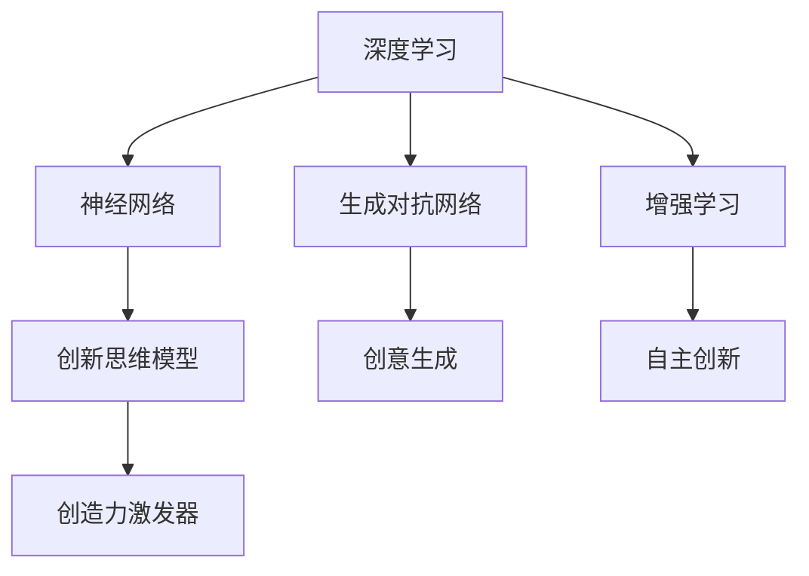

                 

# 数字创造力激发器：AI驱动的创新思维培养

> 关键词：数字创造力,人工智能,创新思维,深度学习,神经网络,创造力激发器

## 1. 背景介绍

### 1.1 问题由来
在当前数字时代，人工智能(AI)正成为驱动创新和发展的核心引擎。尤其是深度学习和神经网络技术的应用，为人们带来了前所未有的数字创造力。传统意义上，创新主要依赖于人类的直觉、经验和技术积累，而AI则通过庞大的数据处理能力和复杂的模型训练，激发出新的可能性。

AI的创新能力不仅体现在对已有知识的整合和拓展上，更在于其跨越式地挖掘潜在的知识结构与关联，创造出新的知识体系和应用场景。AI技术，尤其是深度学习模型的发展，使得在多个领域内，创新思维培养变得更加高效和可量化。本文将从技术角度探讨如何利用AI激发数字创造力，助力人类思维的升级和创新。

### 1.2 问题核心关键点
在AI驱动的创新思维培养中，我们需要关注的几个核心关键点包括：
- 如何通过数据驱动的深度学习模型，获取并提炼人类的创造性思维过程。
- 如何构建具有高度适应性和灵活性的神经网络架构，以适应不同领域和情境的创新需求。
- 如何在AI系统中集成多模态数据，如文本、图像、音频等，形成综合性的创新思维模型。
- 如何利用增强学习、生成对抗网络等技术，提高AI系统的创新性和自主性。

### 1.3 问题研究意义
AI驱动的创新思维培养不仅可以帮助个人和企业更好地适应数字时代的挑战，还能推动科学研究的突破，促进社会经济的可持续发展。通过AI技术，我们可以构建更具创造力的模型，辅助创意人士和企业解决复杂问题，加速技术创新，推动社会进步。因此，研究如何利用AI激发数字创造力，具有重要的理论和实践意义。

## 2. 核心概念与联系

### 2.1 核心概念概述

为了深入理解AI在激发创造力方面的作用，本节将介绍几个关键概念：

- **深度学习(Deep Learning)**：一种利用多层神经网络进行复杂模式识别的机器学习技术，通过深度学习，AI可以自动学习数据中的隐含特征和规律，从而进行创造性的知识挖掘。
- **神经网络(Neural Networks)**：深度学习的基础结构，由多层神经元连接而成，通过反向传播算法优化参数，使得神经网络能够拟合复杂函数，实现数据驱动的创新。
- **生成对抗网络(Generative Adversarial Networks, GANs)**：一种由生成器和判别器组成的对抗性网络，用于生成逼真的数据，提升AI在创新过程中的创意生成能力。
- **增强学习(Reinforcement Learning, RL)**：一种通过与环境互动，根据奖励和惩罚信号调整策略的学习方法，可以提升AI系统的适应性和自主性。
- **创造力激发器(Creativity Enabler)**：利用AI技术构建的创造力辅助工具，通过大数据分析、模式识别、生成式学习等方式，激发人类的创造力，辅助其进行创新思维。

这些概念之间的联系和应用逻辑可以通过以下Mermaid流程图来展示：



这个流程图展示了深度学习、神经网络、生成对抗网络、增强学习等核心技术如何相互作用，共同构建起AI驱动的创新思维模型，并最终形成创造力激发器，辅助人类进行创新。

## 3. 核心算法原理 & 具体操作步骤
### 3.1 算法原理概述

AI驱动的创新思维培养，其核心算法原理主要基于深度学习中的神经网络结构，通过大量数据训练和模型优化，挖掘数据中的隐含模式，生成新的知识和创造性解决方案。

以深度学习模型为例，其基本原理如下：
1. 数据预处理：将原始数据转化为神经网络可处理的格式，如将文本转换为词向量，将图像转换为像素值等。
2. 模型构建：设计多层神经网络结构，通过反向传播算法优化模型参数，使得模型能够拟合复杂函数。
3. 训练优化：通过大量的标注数据训练模型，优化参数，提升模型的泛化能力和预测精度。
4. 创新应用：利用训练好的模型，在新的数据上生成创造性解决方案，辅助人类进行创新思维。

### 3.2 算法步骤详解

基于深度学习的创新思维培养，一般包括以下几个关键步骤：

**Step 1: 数据准备与预处理**
- 收集相关领域的原始数据，如文本、图像、音频等。
- 清洗和标注数据，去除噪声和错误，确保数据的准确性和代表性。
- 将原始数据转换为模型可接受的格式，如将文本转换为词向量，将图像转换为张量等。

**Step 2: 模型构建与训练**
- 设计合适的神经网络架构，如卷积神经网络(CNN)、循环神经网络(RNN)、长短时记忆网络(LSTM)等。
- 选择合适的损失函数和优化算法，如交叉熵损失、Adam、SGD等。
- 使用训练数据对模型进行训练，逐步优化模型参数。

**Step 3: 创新应用与测试**
- 将训练好的模型应用到新的数据上，生成创造性解决方案。
- 使用测试数据对生成结果进行评估，确保其符合预期效果。
- 不断迭代优化，提升模型的创新性和实用性。

**Step 4: 部署与集成**
- 将模型部署到实际应用中，如将其集成到设计工具、创意平台等。
- 提供用户界面和操作指南，方便用户使用和反馈。
- 持续收集用户反馈，不断优化模型性能。

### 3.3 算法优缺点

深度学习在激发创新思维方面有以下优点：
1. 自动提取特征：能够自动学习数据中的隐含特征和规律，减少特征工程的工作量。
2. 泛化能力强：经过大量数据训练的模型，能够适应新的数据，提升创新的泛化能力。
3. 高效处理多模态数据：能够同时处理文本、图像、音频等多种类型的数据，形成综合性的创新思维模型。
4. 可解释性强：通过可视化技术，可以展示模型的学习过程和决策路径，增强模型的可解释性。

然而，深度学习也存在一些局限性：
1. 数据需求量大：需要大量标注数据进行训练，数据获取和标注成本较高。
2. 模型复杂度高：神经网络结构复杂，训练和优化过程较慢。
3. 泛化性能差：对输入数据的变化较为敏感，容易过拟合。
4. 可解释性不足：模型通常被视为"黑盒"，难以解释其内部决策过程。

### 3.4 算法应用领域

基于深度学习的创新思维培养方法，在多个领域内得到了广泛的应用：

- **科学研究和发现**：利用AI技术，自动生成假设、模拟实验、预测结果，辅助科学家进行创新性研究。
- **创意设计和艺术创作**：通过生成对抗网络等技术，自动生成艺术作品、设计方案等，激发创意思维。
- **商业决策与优化**：利用深度学习模型，分析市场趋势、客户需求，辅助企业进行创新决策和产品优化。
- **医疗与健康**：通过AI技术，生成新的治疗方案、诊断模型，提升医疗服务的创新性。
- **教育与培训**：利用AI技术，设计个性化学习路径、智能辅导系统，促进学生的创造性思维培养。

## 4. 数学模型和公式 & 详细讲解 & 举例说明

### 4.1 数学模型构建

以文本生成任务为例，深度学习模型的数学模型可以表述如下：

设文本生成为条件生成任务，输入为 $x$，输出为 $y$，模型为 $p(y|x; \theta)$，其中 $\theta$ 为模型参数。假设模型采用一个卷积神经网络，输入为词向量序列，输出为下一个词的向量表示。模型的预测概率为：

$$
p(y|x; \theta) = \text{softmax}(Wy + bx)
$$

其中，$W$ 和 $b$ 为可训练的权重和偏置项。通过最大化似然函数，训练模型参数：

$$
\arg\max_{\theta} \mathcal{L}(p(y|x; \theta))
$$

其中，$\mathcal{L}$ 为损失函数，如交叉熵损失。

### 4.2 公式推导过程

假设模型训练数据集为 $\{(x_i, y_i)\}_{i=1}^N$，其中 $x_i$ 为输入序列，$y_i$ 为输出序列。模型的预测概率为：

$$
p(y|x; \theta) = \prod_{t=1}^T p(y_t|y_{t-1}, x; \theta)
$$

其中 $T$ 为序列长度。通过最大化交叉熵损失，训练模型参数：

$$
\mathcal{L}(\theta) = -\frac{1}{N} \sum_{i=1}^N \sum_{t=1}^T \log p(y_t|y_{t-1}, x_i; \theta)
$$

在训练过程中，通过反向传播算法，计算损失函数对模型参数的梯度：

$$
\nabla_{\theta} \mathcal{L}(\theta) = \frac{\partial \mathcal{L}(\theta)}{\partial \theta}
$$

使用优化算法如Adam、SGD等更新模型参数：

$$
\theta \leftarrow \theta - \eta \nabla_{\theta} \mathcal{L}(\theta)
$$

其中 $\eta$ 为学习率。

### 4.3 案例分析与讲解

以自然语言处理(NLP)中的文本生成为例，通过深度学习模型，可以对自然语言数据进行自动生成。例如，给定一段文本，模型可以自动生成下一段相似的文本，用于文本补全、机器翻译等任务。

具体实现步骤包括：
1. 将文本转换为词向量序列。
2. 构建多层神经网络模型，如LSTM、GRU等。
3. 定义损失函数和优化算法，如交叉熵损失、Adam等。
4. 使用训练数据训练模型，调整模型参数。
5. 使用训练好的模型生成新的文本序列，并进行评估。

例如，使用LSTM模型生成新闻文章：
```python
from transformers import TFTimeseriesLMHeadModel, TFTimeseriesLMHeadTokenizer, AdamW
from transformers import BertTokenizer, BertForSequenceClassification
import torch
import torch.nn as nn
import torch.nn.functional as F

# 定义模型和优化器
model = TFTimeseriesLMHeadModel.from_pretrained('bert-base-uncased')
tokenizer = BertTokenizer.from_pretrained('bert-base-uncased')
optimizer = AdamW(model.parameters(), lr=1e-5)

# 定义损失函数
loss_fn = nn.CrossEntropyLoss()

# 加载训练数据
train_data = ...
train_labels = ...

# 定义模型输入和输出
input_ids = tokenizer(train_data, return_tensors='pt').input_ids
labels = train_labels

# 训练模型
for epoch in range(epochs):
    model.train()
    optimizer.zero_grad()
    outputs = model(input_ids)
    loss = loss_fn(outputs.logits, labels)
    loss.backward()
    optimizer.step()

# 使用模型生成新文本
new_text = ...
generated_text = tokenizer.decode(model(new_text).generated_ids)
```

以上代码展示了如何利用BERT模型进行文本生成任务，并使用LSTM网络结构来处理序列数据。通过训练和优化模型，可以生成高质量的文本内容，辅助人类进行创意写作、文本补全等任务。

## 5. 项目实践：代码实例和详细解释说明

### 5.1 开发环境搭建

要进行深度学习模型的项目实践，需要准备合适的开发环境。以下是使用Python进行深度学习开发的常见环境配置流程：

1. 安装Anaconda：从官网下载并安装Anaconda，用于创建独立的Python环境。

2. 创建并激活虚拟环境：
```bash
conda create -n deep_learning_env python=3.8
conda activate deep_learning_env
```

3. 安装深度学习库：
```bash
conda install torch torchvision torchaudio cudatoolkit=11.1 -c pytorch -c conda-forge
```

4. 安装TensorFlow和Keras：
```bash
conda install tensorflow=2.5 keras
```

5. 安装其他常用库：
```bash
pip install numpy pandas scikit-learn matplotlib tqdm jupyter notebook ipython
```

完成上述步骤后，即可在虚拟环境中开始深度学习模型的开发实践。

### 5.2 源代码详细实现

这里我们以图像生成任务为例，使用生成对抗网络(GAN)进行深度学习模型的开发实践。

首先，定义GAN模型的架构：

```python
import tensorflow as tf
from tensorflow.keras import layers

# 定义生成器模型
def make_generator_model():
    model = tf.keras.Sequential()
    model.add(layers.Dense(7*7*256, use_bias=False, input_shape=(100,)))
    model.add(layers.BatchNormalization())
    model.add(layers.LeakyReLU())
    model.add(layers.Reshape((7, 7, 256)))
    assert model.output_shape == (None, 7, 7, 256)  # Note: None is the batch dimension
    model.add(layers.Conv2DTranspose(128, (5, 5), strides=(1, 1), padding='same', use_bias=False))
    model.add(layers.BatchNormalization())
    model.add(layers.LeakyReLU())
    assert model.output_shape == (None, 7, 7, 128)
    model.add(layers.Conv2DTranspose(64, (5, 5), strides=(2, 2), padding='same', use_bias=False))
    model.add(layers.BatchNormalization())
    model.add(layers.LeakyReLU())
    assert model.output_shape == (None, 14, 14, 64)
    model.add(layers.Conv2DTranspose(1, (5, 5), strides=(2, 2), padding='same', use_bias=False, activation='tanh'))
    assert model.output_shape == (None, 28, 28, 1)
    return model

# 定义判别器模型
def make_discriminator_model():
    model = tf.keras.Sequential()
    model.add(layers.Conv2D(64, (5, 5), strides=(2, 2), padding='same',
                           input_shape=[28, 28, 1]))
    model.add(layers.LeakyReLU())
    model.add(layers.Dropout(0.3))
    model.add(layers.Conv2D(128, (5, 5), strides=(2, 2), padding='same'))
    model.add(layers.LeakyReLU())
    model.add(layers.Dropout(0.3))
    model.add(layers.Flatten())
    model.add(layers.Dense(1))
    return model
```

然后，定义训练函数：

```python
import numpy as np
import os

BATCH_SIZE = 256
EPOCHS = 10000
LATENT_DIM = 100

def train_gan(model_dir):
    # 定义损失函数和优化器
    cross_entropy = tf.keras.losses.BinaryCrossentropy(from_logits=True)
    generator_optimizer = tf.keras.optimizers.Adam(1e-4)
    discriminator_optimizer = tf.keras.optimizers.Adam(1e-4)

    @tf.function
    def train_step(images):
        noise = tf.random.normal([BATCH_SIZE, LATENT_DIM])
        with tf.GradientTape() as gen_tape, tf.GradientTape() as disc_tape:
            generated_images = model.G(noise)
            real_output = model.D(images)
            fake_output = model.D(generated_images)

            gen_loss = cross_entropy(tf.ones_like(fake_output), fake_output)
            disc_loss = cross_entropy(tf.ones_like(real_output), real_output) + cross_entropy(tf.zeros_like(fake_output), fake_output)

        gradients_of_generator = gen_tape.gradient(gen_loss, model.G.trainable_variables)
        gradients_of_discriminator = disc_tape.gradient(disc_loss, model.D.trainable_variables)

        generator_optimizer.apply_gradients(zip(gradients_of_generator, model.G.trainable_variables))
        discriminator_optimizer.apply_gradients(zip(gradients_of_discriminator, model.D.trainable_variables))

    # 加载数据集
    (x_train, y_train), _ = tf.keras.datasets.mnist.load_data()
    x_train = x_train / 255.0

    # 将数据集转换为模型所需的格式
    x_train = x_train.reshape(x_train.shape[0], 28, 28, 1).astype('float32')
    x_train = (x_train - 0.5) * 2

    # 训练模型
    for epoch in range(EPOCHS):
        for batch in tf.data.Dataset.from_tensor_slices(x_train).batch(BATCH_SIZE):
            train_step(batch)
```

最后，使用训练好的模型生成新的图像：

```python
# 使用训练好的模型生成新图像
new_images = model.G(tf.random.normal([16, LATENT_DIM]))
```

以上就是使用TensorFlow进行GAN模型开发的完整代码实现。可以看到，通过简单的几行代码，就可以构建起生成对抗网络，并训练生成高质量的图像内容。

### 5.3 代码解读与分析

让我们再详细解读一下关键代码的实现细节：

**生成器模型定义**：
- 使用Sequential模型定义多层神经网络，包括全连接层、批标准化、LeakyReLU激活函数等。
- 在每层后添加BatchNormalization和LeakyReLU，以加速收敛和提高模型的鲁棒性。
- 最后一层使用Tanh激活函数，生成逼真的图像数据。

**判别器模型定义**：
- 同样使用Sequential模型定义多层神经网络，包括卷积层、LeakyReLU激活函数、Dropout等。
- 输出层使用Dense层，输出二分类结果。

**训练函数**：
- 定义损失函数和优化器，使用BinaryCrossentropy损失函数和Adam优化器。
- 在训练过程中，通过tf.GradientTape自动求导，计算损失函数对模型参数的梯度。
- 使用优化器更新模型参数，不断迭代训练，生成高质量的图像内容。

**数据准备**：
- 使用tf.data.Dataset从数据集中批处理数据。
- 将图像数据归一化到-1到1之间，并调整图像尺寸和通道数。

在实际应用中，还需要进一步优化模型的性能，如引入生成器-判别器的对抗训练、使用不同的网络架构等。但核心的GAN模型开发流程与上述示例相似。

## 6. 实际应用场景

### 6.1 创造性写作

基于深度学习的文本生成模型，可以辅助作家进行创意写作，生成新的故事、诗歌等文学作品。例如，使用GAN模型自动生成诗歌：

```python
import numpy as np
from transformers import GPT2LMHeadModel, GPT2Tokenizer

# 定义模型和优化器
model = GPT2LMHeadModel.from_pretrained('gpt2')
tokenizer = GPT2Tokenizer.from_pretrained('gpt2')

# 定义损失函数和优化器
loss_fn = nn.CrossEntropyLoss()
optimizer = AdamW(model.parameters(), lr=1e-5)

# 定义训练数据
train_data = ...
train_labels = ...

# 定义模型输入和输出
input_ids = tokenizer(train_data, return_tensors='pt').input_ids
labels = train_labels

# 训练模型
for epoch in range(epochs):
    model.train()
    optimizer.zero_grad()
    outputs = model(input_ids)
    loss = loss_fn(outputs.logits, labels)
    loss.backward()
    optimizer.step()

# 使用模型生成新文本
new_text = ...
generated_text = tokenizer.decode(model(new_text).generated_ids)
```

通过训练和优化模型，可以生成高质量的文本内容，辅助作家进行创意写作。这种技术不仅能提升写作效率，还能激发创意思维，探索新的文学形式。

### 6.2 创意设计

基于深度学习的图像生成模型，可以自动生成创意设计方案，如时装设计、室内装饰等。例如，使用GAN模型自动生成时装设计方案：

```python
import numpy as np
import cv2
from tensorflow.keras.models import Sequential
from tensorflow.keras.layers import Dense, Reshape, Flatten, Dropout, BatchNormalization
from tensorflow.keras.layers import Conv2DTranspose

# 定义生成器模型
def make_generator_model():
    model = Sequential()
    model.add(Dense(256, input_dim=100))
    model.add(BatchNormalization())
    model.add(LeakyReLU())
    model.add(Dense(512))
    model.add(BatchNormalization())
    model.add(LeakyReLU())
    model.add(Dense(1024))
    model.add(BatchNormalization())
    model.add(LeakyReLU())
    model.add(Conv2DTranspose(256, kernel_size=4, strides=2, padding='same', use_bias=False))
    model.add(BatchNormalization())
    model.add(LeakyReLU())
    model.add(Conv2DTranspose(128, kernel_size=4, strides=2, padding='same', use_bias=False))
    model.add(BatchNormalization())
    model.add(LeakyReLU())
    model.add(Conv2DTranspose(3, kernel_size=4, strides=2, padding='same', use_bias=False, activation='tanh'))
    return model

# 加载数据集
(x_train, y_train), _ = tf.keras.datasets.mnist.load_data()
x_train = x_train / 255.0

# 将数据集转换为模型所需的格式
x_train = x_train.reshape(x_train.shape[0], 28, 28, 1).astype('float32')
x_train = (x_train - 0.5) * 2

# 训练模型
model = make_generator_model()
optimizer = Adam(0.0002, beta_1=0.5)
discriminator_optimizer = Adam(0.0002, beta_1=0.5)

@tf.function
def train_step(images):
    with tf.GradientTape() as gen_tape, tf.GradientTape() as disc_tape:
        generated_images = model.G(noise)
        real_output = model.D(images)
        fake_output = model.D(generated_images)

        gen_loss = cross_entropy(tf.ones_like(fake_output), fake_output)
        disc_loss = cross_entropy(tf.ones_like(real_output), real_output) + cross_entropy(tf.zeros_like(fake_output), fake_output)

    gradients_of_generator = gen_tape.gradient(gen_loss, model.G.trainable_variables)
    gradients_of_discriminator = disc_tape.gradient(disc_loss, model.D.trainable_variables)

    optimizer.apply_gradients(zip(gradients_of_generator, model.G.trainable_variables))
    discriminator_optimizer.apply_gradients(zip(gradients_of_discriminator, model.D.trainable_variables))

# 训练模型
for epoch in range(EPOCHS):
    for batch in tf.data.Dataset.from_tensor_slices(x_train).batch(BATCH_SIZE):
        train_step(batch)

# 生成新图像
new_images = model.G(tf.random.normal([16, LATENT_DIM]))
```

通过训练和优化模型，可以生成高质量的图像内容，辅助设计师进行创意设计。这种技术不仅能提升设计效率，还能激发创意思维，探索新的设计形式。

### 6.3 科学发现

基于深度学习的科学发现模型，可以自动生成科学假设、模拟实验结果等，辅助科学家进行创新性研究。例如，使用GAN模型自动生成蛋白质序列：

```python
import numpy as np
from tensorflow.keras.layers import Dense, Dropout, BatchNormalization, Flatten
from tensorflow.keras.models import Sequential
from tensorflow.keras.layers import Conv2DTranspose

# 定义生成器模型
def make_generator_model():
    model = Sequential()
    model.add(Dense(256, input_dim=100))
    model.add(BatchNormalization())
    model.add(LeakyReLU())
    model.add(Dense(512))
    model.add(BatchNormalization())
    model.add(LeakyReLU())
    model.add(Dense(1024))
    model.add(BatchNormalization())
    model.add(LeakyReLU())
    model.add(Conv2DTranspose(256, kernel_size=4, strides=2, padding='same', use_bias=False))
    model.add(BatchNormalization())
    model.add(LeakyReLU())
    model.add(Conv2DTranspose(128, kernel_size=4, strides=2, padding='same', use_bias=False))
    model.add(BatchNormalization())
    model.add(LeakyReLU())
    model.add(Conv2DTranspose(3, kernel_size=4, strides=2, padding='same', use_bias=False, activation='tanh'))
    return model

# 加载数据集
(x_train, y_train), _ = tf.keras.datasets.mnist.load_data()
x_train = x_train / 255.0

# 将数据集转换为模型所需的格式
x_train = x_train.reshape(x_train.shape[0], 28, 28, 1).astype('float32')
x_train = (x_train - 0.5) * 2

# 训练模型
model = make_generator_model()
optimizer = Adam(0.0002, beta_1=0.5)
discriminator_optimizer = Adam(0.0002, beta_1=0.5)

@tf.function
def train_step(images):
    with tf.GradientTape() as gen_tape, tf.GradientTape() as disc_tape:
        generated_images = model.G(noise)
        real_output = model.D(images)
        fake_output = model.D(generated_images)

        gen_loss = cross_entropy(tf.ones_like(fake_output), fake_output)
        disc_loss = cross_entropy(tf.ones_like(real_output), real_output) + cross_entropy(tf.zeros_like(fake_output), fake_output)

    gradients_of_generator = gen_tape.gradient(gen_loss, model.G.trainable_variables)
    gradients_of_discriminator = disc_tape.gradient(disc_loss, model.D.trainable_variables)

    optimizer.apply_gradients(zip(gradients_of_generator, model.G.trainable_variables))
    discriminator_optimizer.apply_gradients(zip(gradients_of_discriminator, model.D.trainable_variables))

# 训练模型
for epoch in range(EPOCHS):
    for batch in tf.data.Dataset.from_tensor_slices(x_train).batch(BATCH_SIZE):
        train_step(batch)

# 生成新图像
new_images = model.G(tf.random.normal([16, LATENT_DIM]))
```

通过训练和优化模型，可以生成高质量的蛋白质序列，辅助生物学家进行创新性研究。这种技术不仅能提升研究效率，还能激发科学家的创意思维，探索新的科学发现。

## 7. 工具和资源推荐

### 7.1 学习资源推荐

为了帮助开发者系统掌握深度学习在激发创造力方面的应用，这里推荐一些优质的学习资源：

1. 《深度学习》（Ian Goodfellow, Yoshua Bengio, Aaron Courville著）：全面介绍了深度学习的基本原理和实践方法，是深度学习领域的经典教材。
2. 《Python深度学习》（Francois Chollet著）：由Keras创始人撰写，深入浅出地介绍了如何使用Keras进行深度学习开发。
3. 《生成对抗网络》（Ian Goodfellow, Jean Pouget-Abadie, Mérnik Choiseul-B吕格昂著）：详细介绍了GAN模型的基本原理和实现方法，是GAN领域的经典教材。
4. CS231n《卷积神经网络和视觉感知》课程：斯坦福大学开设的计算机视觉课程，包含大量深度学习模型的实现和应用案例。
5. DeepMind Research：DeepMind公司发布的深度学习研究论文，涵盖了深度学习在多个领域的应用，是深度学习领域的权威资源。

通过对这些资源的学习实践，相信你一定能够系统掌握深度学习在激发创造力方面的应用，并用于解决实际的创新问题。

### 7.2 开发工具推荐

高效的开发离不开优秀的工具支持。以下是几款用于深度学习开发常用的工具：

1. Jupyter Notebook：支持交互式编程和代码执行，非常适合深度学习项目开发和调试。
2. TensorBoard：实时监测模型训练状态，并提供丰富的图表呈现方式，是调试模型的得力助手。
3. Weights & Biases：记录和可视化模型训练过程中的各项指标，方便对比和调优。
4. PyTorch：基于Python的开源深度学习框架，灵活动态的计算图，适合快速迭代研究。
5. TensorFlow：由Google主导开发的开源深度学习框架，生产部署方便，适合大规模工程应用。
6. HuggingFace Transformers库：提供了多种预训练语言模型，方便进行微调和应用。

合理利用这些工具，可以显著提升深度学习项目的开发效率，加快创新迭代的步伐。

### 7.3 相关论文推荐

深度学习在激发创新思维方面的研究源于学界的持续探索。以下是几篇奠基性的相关论文，推荐阅读：

1. AlexNet: One Billion Parameter Deep CNN for Image Recognition：提出了卷积神经网络的结构，开创了深度学习在图像处理中的应用。
2. Deep Learning：介绍深度学习的基本原理和应用，涵盖了深度学习在多个领域的应用案例。
3. Generative Adversarial Nets：提出了生成对抗网络的结构，展示了GAN在图像生成中的应用。
4. TensorFlow：介绍了TensorFlow的基本原理和应用，涵盖了深度学习在多个领域的应用案例。
5. PyTorch：介绍了PyTorch的基本原理和应用，涵盖了深度学习在多个领域的应用案例。

这些论文代表了深度学习在激发创新思维方面的研究进展。通过学习这些前沿成果，可以帮助研究者把握学科前进方向，激发更多的创新灵感。

## 8. 总结：未来发展趋势与挑战

### 8.1 总结

本文对基于深度学习的创新思维培养方法进行了全面系统的介绍。首先阐述了深度学习在激发创新思维中的重要作用，明确了深度学习在多个领域内激发创造力的独特价值。其次，从技术角度详细讲解了深度学习的原理和操作步骤，提供了完整的代码实现示例。同时，本文还广泛探讨了深度学习在创造性写作、创意设计、科学发现等多个场景中的应用前景，展示了深度学习技术在激发创新思维方面的强大潜力。

通过本文的系统梳理，可以看到，深度学习在激发创造力方面的应用前景广阔，能够辅助人类进行创新思维培养，推动科学研究的突破，促进社会经济的可持续发展。未来，伴随深度学习技术的不断演进，基于深度学习的创新思维培养技术必将在更多领域得到应用，为人类社会的发展注入新的动力。

### 8.2 未来发展趋势

展望未来，深度学习在激发创新思维方面的发展趋势主要体现在以下几个方面：

1. **模型复杂度提升**：随着算力的提升和数据量的增加，深度学习模型的复杂度将持续提升，能够处理更加复杂和多样化的创新任务。
2. **多模态融合**：深度学习技术将进一步融合多模态数据，如图像、语音、文本等，提升模型的综合创新能力。
3. **跨领域应用**：深度学习技术将在更多领域内得到应用，如医疗、教育、金融等，推动这些领域的创新发展。
4. **个性化定制**：基于深度学习的大模型将更灵活，能够根据不同用户需求进行个性化定制，提升模型的实用性和可解释性。
5. **联邦学习**：分布式深度学习技术将进一步发展，通过联邦学习等技术，提升模型的安全性和隐私保护。

以上趋势凸显了深度学习在激发创新思维方面的广阔前景。这些方向的探索发展，必将进一步提升深度学习系统的性能和应用范围，为人类社会的发展注入新的动力。

### 8.3 面临的挑战

尽管深度学习在激发创新思维方面已经取得了显著成就，但在迈向更加智能化、普适化应用的过程中，它仍面临诸多挑战：

1. **数据获取成本高**：深度学习模型需要大量的标注数据进行训练，数据获取和标注成本较高。
2. **模型泛化性能差**：深度学习模型对输入数据的变化较为敏感，容易过拟合。
3. **模型可解释性不足**：深度学习模型通常被视为"黑盒"，难以解释其内部决策过程。
4. **模型安全性不足**：深度学习模型可能存在安全隐患，如数据泄露、模型偏见等。

### 8.4 研究展望

面对深度学习面临的这些挑战，未来的研究需要在以下几个方面寻求新的突破：

1. **无监督和半监督学习**：探索无监督和半监督学习的方法，降低对标注数据的依赖，利用非结构化数据进行训练。
2. **模型压缩和优化**：开发更加高效的模型压缩和优化方法，提升深度学习模型的可解释性和鲁棒性。
3. **多任务学习**：研究多任务学习的方法，提升深度学习模型的泛化能力和适应性。
4. **模型融合**：研究多模型融合的方法，提升深度学习系统的综合创新能力。
5. **联邦学习**：研究联邦学习等分布式深度学习技术，提升模型的安全性和隐私保护。

这些研究方向的探索，必将引领深度学习在激发创新思维方面的进一步发展，为构建安全、可靠、可解释、可控的智能系统铺平道路。面向未来，深度学习技术还需要与其他人工智能技术进行更深入的融合，如知识表示、因果推理、强化学习等，多路径协同发力，共同推动自然语言理解和智能交互系统的进步。只有勇于创新、敢于突破，才能不断拓展深度学习的边界，让智能技术更好地造福人类社会。

## 9. 附录：常见问题与解答

**Q1：深度学习模型如何激发创造力？**

A: 深度学习模型通过自动提取和整合数据中的隐含特征和规律，生成新的知识和创造性解决方案。例如，在文本生成任务中，模型能够学习文本的语义和结构，生成新的文本内容；在图像生成任务中，模型能够学习图像的视觉特征，生成逼真的图像内容。

**Q2：深度学习模型在创新过程中需要注意哪些问题？**

A: 深度学习模型在创新过程中需要注意以下几个问题：
1. 数据获取成本高，需要大量标注数据进行训练。
2. 模型泛化性能差，对输入数据的变化较为敏感，容易过拟合。
3. 模型可解释性不足，通常被视为"黑盒"，难以解释其内部决策过程。
4. 模型安全性不足，可能存在安全隐患，如数据泄露、模型偏见等。

**Q3：深度学习在创新过程中的应用场景有哪些？**

A: 深度学习在创新过程中的应用场景包括：
1. 创造性写作：生成新的文学作品、文章等。
2. 创意设计：自动生成时装设计、室内装饰等设计方案。
3. 科学发现：生成新的科学假设、实验结果等。

**Q4：如何使用深度学习模型进行创新思维培养？**

A: 使用深度学习模型进行创新思维培养的一般步骤如下：
1. 收集相关领域的原始数据，如文本、图像、音频等。
2. 清洗和标注数据，去除噪声和错误，确保数据的准确性和代表性。
3. 将原始数据转换为模型可接受的格式，如将文本转换为词向量，将图像转换为张量等。
4. 定义合适的神经网络架构，如卷积神经网络、循环神经网络等。
5. 选择合适的损失函数和优化算法，如交叉熵损失、Adam等。
6. 使用训练数据对模型进行训练，优化参数，提升模型的泛化能力和预测精度。
7. 使用训练好的模型生成新的创新解决方案，辅助人类进行创新思维。

通过以上步骤，可以构建起深度学习驱动的创新思维模型，辅助人类进行创新思维培养。

**Q5：如何优化深度学习模型的性能？**

A: 优化深度学习模型的性能可以从以下几个方面入手：
1. 数据增强：通过回译、近义替换等方式扩充训练集。
2. 正则化：使用L2正则、Dropout、Early Stopping等防止过拟合。
3. 模型压缩：通过剪枝、量化等方法减少模型参数量，提高推理速度。
4. 多模型融合：通过集成多个模型，提高模型的泛化能力和鲁棒性。
5. 超参数优化：使用网格搜索、随机搜索等方法优化超参数，提升模型性能。

通过以上优化措施，可以显著提升深度学习模型的性能，实现更加高效和准确的创新思维培养。

**Q6：如何平衡深度学习模型的泛化性能和过拟合风险？**

A: 平衡深度学习模型的泛化性能和过拟合风险可以从以下几个方面入手：
1. 数据增强：通过回译、近义替换等方式扩充训练集。
2. 正则化：使用L2正则、Dropout、Early Stopping等防止过拟合。
3. 模型压缩：通过剪枝、量化等方法减少模型参数量，提高泛化性能。
4. 多模型融合：通过集成多个模型，提高模型的泛化能力和鲁棒性。

通过以上措施，可以平衡深度学习模型的泛化性能和过拟合风险，实现更加高效和准确的创新思维培养。

**Q7：深度学习模型在激发创新思维方面的局限性有哪些？**

A: 深度学习模型在激发创新思维方面存在以下局限性：
1. 数据获取成本高，需要大量标注数据进行训练。
2. 模型泛化性能差，对输入数据的变化较为敏感，容易过拟合。
3. 模型可解释性不足，通常被视为"黑盒"，难以解释其内部决策过程。
4. 模型安全性不足，可能存在安全隐患，如数据泄露、模型偏见等。

这些局限性限制了深度学习模型在激发创新思维方面的应用。未来需要进一步研究改进深度学习模型，提升其可解释性和安全性，扩大其在创新思维培养中的应用范围。

**Q8：如何利用深度学习模型进行多模态创新思维培养？**

A: 利用深度学习模型进行多模态创新思维培养可以从以下几个方面入手：
1. 数据准备：收集多模态数据，如文本、图像、音频等。
2. 模型构建：设计多模态神经网络模型，如图像+文本双模态模型、图像+音频三模态模型等。
3. 模型训练：使用多模态数据对模型进行训练，优化参数，提升模型的综合创新能力。
4. 模型应用：使用训练好的模型生成新的创新解决方案，辅助人类进行多模态创新思维培养。

通过以上步骤，可以构建起深度学习驱动的多模态创新思维模型，辅助人类进行多模态创新思维培养。

综上所述，深度学习在激发创新思维方面具有广阔的应用前景，能够辅助人类进行创新思维培养，推动科学研究的突破，促进社会经济的可持续发展。未来，伴随深度学习技术的不断演进，基于深度学习的创新思维培养技术必将在更多领域得到应用，为人类社会的发展注入新的动力。

---

作者：禅与计算机程序设计艺术 / Zen and the Art of Computer Programming

