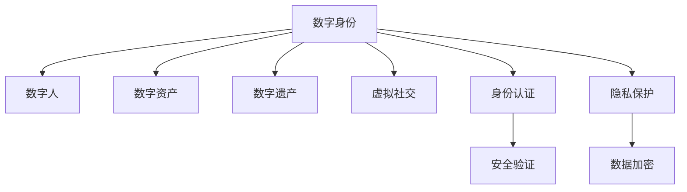

                 

# 数字化人格:元宇宙中的多重身份构建

> 关键词：元宇宙, 数字身份, 多重身份构建, 数字人, 数字资产, 虚拟社交, 身份认证, 隐私保护, 用户交互, 数字遗产

## 1. 背景介绍

### 1.1 问题由来
在数字化时代，数字身份已成为人们日常生活中的重要组成部分。随着Web3.0和区块链技术的发展，数字身份将变得更加广泛和多样。元宇宙作为数字世界的新一代平台，为数字身份的多样性和可扩展性提供了全新的机遇。

在元宇宙中，用户不仅可以拥有传统的头像、账户等基础身份，还能创建复杂的多重数字身份，这些身份不仅包含个人数据，还能扩展到数字资产、虚拟社交和数字遗产等方面。如何在元宇宙中构建、管理和保护这些数字身份，成为了当前亟待解决的重要问题。

### 1.2 问题核心关键点
元宇宙中的多重数字身份构建涉及以下关键点：
- 数字身份的生成和管理。
- 数字身份的安全性和隐私保护。
- 数字身份的互操作性和可扩展性。
- 数字身份的多样性和丰富性。
- 数字身份与现实世界的映射和连接。

这些问题共同构成了元宇宙中数字身份构建的挑战，需要通过技术手段和政策法规的综合应用加以解决。

### 1.3 问题研究意义
构建元宇宙中的多重数字身份，对于拓展数字身份的应用范围，提升用户体验，保护用户隐私，推动数字经济的发展，具有重要意义：

1. 提升用户体验。在元宇宙中，用户可以通过多重数字身份，实现个性化的虚拟社交和内容创作，满足多样化的需求。
2. 保护用户隐私。通过分散化的身份管理，可以降低用户数据集中存储的风险，保障用户隐私。
3. 推动数字经济发展。数字身份的多样性和丰富性，为数字经济提供了更多的商业应用场景和创新点。
4. 连接虚拟与现实。元宇宙中的多重数字身份可以与现实世界进行交互，增强虚拟世界的真实感。
5. 支持数字遗产管理。通过构建数字身份，用户可以更好地管理和传承自己的虚拟资产和遗产。

## 2. 核心概念与联系

### 2.1 核心概念概述

为更好地理解元宇宙中的多重数字身份构建，本节将介绍几个密切相关的核心概念：

- 数字身份(Digital Identity)：指在虚拟世界中代表用户或实体的一种标识，通常包含用户的基本信息、权限、行为记录等。数字身份是元宇宙中最重要的组成部分之一，决定了用户在虚拟世界中的权利和义务。

- 数字人(Digital Avatars)：指在虚拟世界中的用户或实体形象，通常由虚拟形象、交互能力等组成。数字人可以扩展为虚拟角色、虚拟助手等，为用户提供丰富的互动体验。

- 数字资产(Digital Assets)：指在虚拟世界中的各类财产和权益，包括虚拟货币、虚拟土地、数字艺术品等。数字资产是元宇宙中的重要组成部分，为用户提供了经济价值和利益。

- 数字遗产(Digital Legacy)：指用户在虚拟世界中的数据、资产等遗产的传递和继承。数字遗产管理是数字身份构建中的重要环节，关乎用户的数字权益保护。

- 虚拟社交(Virtual Social)：指在虚拟世界中的人际互动和社交关系，包括虚拟会议、虚拟游戏、虚拟社区等。虚拟社交构建了元宇宙的社区基础，提升了用户参与度和满意度。

- 身份认证(Identity Authentication)：指对用户身份进行验证的过程，通常通过密码、生物特征、公钥加密等方式实现。身份认证确保了数字身份的安全性和真实性。

- 隐私保护(Privacy Protection)：指保护用户数据和隐私的过程，通常通过加密、去中心化存储等方式实现。隐私保护确保了用户数据的机密性和不可篡改性。

这些核心概念之间的逻辑关系可以通过以下Mermaid流程图来展示：



这个流程图展示了几类数字身份构建中的核心概念及其之间的关系：

1. 数字身份是基础，决定了其他概念的存在和价值。
2. 数字人、数字资产等都是基于数字身份构建的，并与其共同存在。
3. 身份认证和隐私保护是数字身份构建的关键技术保障。
4. 虚拟社交、数字遗产等数字身份应用场景的实现，依赖于身份认证和隐私保护的支持。

## 3. 核心算法原理 & 具体操作步骤
### 3.1 算法原理概述

元宇宙中的多重数字身份构建，本质上是一个多模态的身份管理问题。其核心思想是：将用户的现实世界身份映射到虚拟世界，通过多模态的验证和认证，实现复杂的多重数字身份构建和管理。

形式化地，假设现实世界身份为 $ID_{\text{real}}$，虚拟世界身份为 $ID_{\text{virtual}}$，构建的多重身份为 $\{ID_i\}_{i=1}^N$。构建算法目标是找到一组映射关系 $\{M_i\}_{i=1}^N$，使得：

$$
M_i(ID_{\text{real}}) = ID_i
$$

其中 $M_i$ 为映射函数，$ID_i$ 为第 $i$ 个多重数字身份。在映射过程中，需要综合考虑用户的基本信息、行为记录、数字资产、虚拟社交等各类数据。

### 3.2 算法步骤详解

元宇宙中的多重数字身份构建一般包括以下几个关键步骤：

**Step 1: 设计多重身份结构**
- 根据应用场景，设计多重的数字身份结构。例如，可以包含头像、头像皮肤、虚拟角色、社交关系等。

**Step 2: 创建基础身份**
- 使用现有的身份认证机制（如密码、生物特征识别等）创建基础身份。基础身份应包含用户的真实姓名、身份证号码、邮箱等基本信息。

**Step 3: 生成数字人**
- 根据基础身份信息，生成数字人头像和角色。数字人头像和角色应具备虚拟世界的交互能力，如语音合成、面部表情等。

**Step 4: 映射数字资产**
- 将用户在现实世界中的资产（如虚拟货币、数字艺术品等）映射到虚拟世界。通过公钥加密等技术，确保资产的转移和继承。

**Step 5: 建立虚拟社交关系**
- 使用社交网络算法，根据用户的基础身份和数字人，构建虚拟社交网络。社交网络应支持加好友、创建群组、参与活动等功能。

**Step 6: 设计身份认证机制**
- 设计基于区块链的身份认证机制，确保数字身份的安全性和真实性。例如，使用公钥加密、数字签名等方式进行身份验证。

**Step 7: 实现隐私保护策略**
- 设计隐私保护机制，确保用户数据的安全性和隐私性。例如，使用分布式存储、数据匿名化等技术。

**Step 8: 建立身份管理系统**
- 设计身份管理系统，实现数字身份的创建、修改、删除等功能。身份管理系统应支持多模态身份验证，确保身份的真实性。

**Step 9: 实现多重身份迁移**
- 设计身份迁移机制，允许用户在不同平台和应用之间迁移身份。例如，通过身份认证和数据同步技术，实现身份的跨平台迁移。

以上步骤涵盖了多重数字身份构建的各个方面，通过综合应用这些技术手段，可以实现复杂的元宇宙数字身份构建和管理。

### 3.3 算法优缺点

元宇宙中的多重数字身份构建方法具有以下优点：
1. 提升用户体验。通过多重数字身份，用户可以实现个性化的虚拟社交和内容创作，满足多样化的需求。
2. 保护用户隐私。通过分散化的身份管理，可以降低用户数据集中存储的风险，保障用户隐私。
3. 推动数字经济发展。数字身份的多样性和丰富性，为数字经济提供了更多的商业应用场景和创新点。
4. 连接虚拟与现实。元宇宙中的多重数字身份可以与现实世界进行交互，增强虚拟世界的真实感。
5. 支持数字遗产管理。通过构建数字身份，用户可以更好地管理和传承自己的虚拟资产和遗产。

同时，该方法也存在一定的局限性：
1. 技术复杂度高。多重数字身份构建涉及多个环节和多种技术，需要高度集成化和大规模协作。
2. 数据交互复杂。多重数字身份构建涉及大量的数据交互和同步，技术实现复杂。
3. 互操作性差。不同平台和应用之间的多重数字身份互操作性有待提升，存在数据孤岛问题。
4. 用户接受度低。用户对多重数字身份的认知和接受度较低，需要教育和引导。
5. 安全风险高。多重数字身份构建涉及大量的数据和资产管理，安全风险较高。

尽管存在这些局限性，但就目前而言，多重数字身份构建方法仍是大规模元宇宙应用的重要手段。未来相关研究的重点在于如何进一步降低技术复杂度，提高互操作性，加强用户接受度，保障数据安全。

### 3.4 算法应用领域

多重数字身份构建技术在元宇宙中有着广泛的应用，主要涵盖以下几个领域：

1. **虚拟游戏和社交**：如《我的世界》、《Roblox》等游戏中，玩家可以使用不同的角色和皮肤，实现个性化的虚拟社交。
2. **虚拟商务平台**：如Decentraland、The Sandbox等平台上，用户可以创建和管理数字资产，进行虚拟交易和投资。
3. **虚拟房地产**：如Cryppland等平台上，用户可以购买和管理虚拟土地，进行数字资产的租赁和买卖。
4. **数字艺术和创作**：如CryptoVoxels等平台上，用户可以创建和管理数字艺术品，进行版权保护和交易。
5. **虚拟教育和培训**：如MetaVR等平台上，用户可以创建虚拟教室，进行在线教育和学习。
6. **虚拟旅游和探索**：如Altiverse等平台上，用户可以探索虚拟世界，进行虚拟旅游和探险。
7. **数字遗产管理**：如Estate Builder等平台上，用户可以管理自己的虚拟资产和遗产，进行传承和保护。

除了上述这些经典应用外，多重数字身份构建技术还在虚拟医疗、虚拟法院、虚拟文化展览等诸多领域得到了应用，为元宇宙的发展提供了新的可能性。

## 4. 数学模型和公式 & 详细讲解  
### 4.1 数学模型构建

本节将使用数学语言对多重数字身份构建过程进行更加严格的刻画。

记现实世界身份为 $ID_{\text{real}}$，虚拟世界身份为 $ID_{\text{virtual}}$，构建的多重身份为 $\{ID_i\}_{i=1}^N$。假设用户的基础身份为 $ID_{\text{base}}$，数字人身份为 $ID_{\text{character}}$，数字资产身份为 $ID_{\text{asset}}$，虚拟社交身份为 $ID_{\text{social}}$。

定义映射函数 $M_i$ 为：

$$
M_i(ID_{\text{real}}) = ID_i
$$

其中 $M_i$ 为第 $i$ 个多重数字身份的映射函数。在映射过程中，需要综合考虑用户的基本信息、行为记录、数字资产、虚拟社交等各类数据。

### 4.2 公式推导过程

以下我们以多重数字身份构建为例，推导映射函数 $M_i$ 的计算公式。

假设用户的基础身份为 $ID_{\text{base}}$，数字人身份为 $ID_{\text{character}}$，数字资产身份为 $ID_{\text{asset}}$，虚拟社交身份为 $ID_{\text{social}}$。则多重数字身份构建的映射函数 $M_i$ 可以表示为：

$$
M_i(ID_{\text{real}}) = (ID_{\text{base}}, ID_{\text{character}}, ID_{\text{asset}}, ID_{\text{social}})
$$

其中 $ID_{\text{base}}$ 包含用户的真实姓名、身份证号码、邮箱等基本信息，$ID_{\text{character}}$ 包含数字人头像和角色，$ID_{\text{asset}}$ 包含数字资产，$ID_{\text{social}}$ 包含虚拟社交关系。

在构建过程中，映射函数 $M_i$ 需要根据用户的行为记录和数据交互，动态更新各类身份信息。例如，用户在虚拟世界中的行为记录，可以通过机器学习模型进行预测和生成，从而实现动态映射。

### 4.3 案例分析与讲解

假设某用户在虚拟世界中有两个多重数字身份，分别为 $ID_1$ 和 $ID_2$，分别对应不同的角色和资产。用户的基础身份为 $ID_{\text{base}}$。映射函数 $M_i$ 可以表示为：

$$
M_1(ID_{\text{real}}) = (ID_{\text{base}}, ID_{\text{character}_1}, ID_{\text{asset}_1}, ID_{\text{social}_1})
$$
$$
M_2(ID_{\text{real}}) = (ID_{\text{base}}, ID_{\text{character}_2}, ID_{\text{asset}_2}, ID_{\text{social}_2})
$$

其中 $ID_{\text{character}_1}$ 和 $ID_{\text{character}_2}$ 分别对应不同的数字人头像和角色，$ID_{\text{asset}_1}$ 和 $ID_{\text{asset}_2$ 分别对应不同的数字资产，$ID_{\text{social}_1$ 和 $ID_{\text{social}_2}$ 分别对应不同的虚拟社交关系。

在实际应用中，映射函数 $M_i$ 可以通过如下步骤实现：

1. 收集用户的基础身份信息 $ID_{\text{base}}$。
2. 根据用户行为记录和数据交互，生成数字人头像和角色 $ID_{\text{character}_1}$ 和 $ID_{\text{character}_2}$。
3. 将用户数字资产映射到虚拟世界，生成 $ID_{\text{asset}_1}$ 和 $ID_{\text{asset}_2$。
4. 根据用户社交行为，构建虚拟社交关系 $ID_{\text{social}_1$ 和 $ID_{\text{social}_2$。
5. 综合以上信息，生成多重数字身份 $ID_1$ 和 $ID_2$。

通过以上方法，用户可以在元宇宙中创建和管理多个多重数字身份，实现个性化的虚拟体验。

## 5. 项目实践：代码实例和详细解释说明
### 5.1 开发环境搭建

在进行多重数字身份构建实践前，我们需要准备好开发环境。以下是使用Python进行Web3.0开发的环境配置流程：

1. 安装Anaconda：从官网下载并安装Anaconda，用于创建独立的Python环境。

2. 创建并激活虚拟环境：
```bash
conda create -n web3-env python=3.8 
conda activate web3-env
```

3. 安装以太坊工具包：
```bash
pip install web3
```

4. 安装各类工具包：
```bash
pip install numpy pandas scikit-learn matplotlib tqdm jupyter notebook ipython
```

完成上述步骤后，即可在`web3-env`环境中开始多重数字身份构建实践。

### 5.2 源代码详细实现

下面我们以虚拟身份管理和数字资产管理为例，给出使用Web3.0进行多重数字身份构建的Python代码实现。

首先，定义身份管理类：

```python
from web3 import Web3
from cryptography.fernet import Fernet

class IdentityManager:
    def __init__(self, web3_url, wallet_address):
        self.web3 = Web3(Web3.HTTPProvider(web3_url))
        self.wallet_address = wallet_address
        self.fernet = Fernet(self.generate_key())

    def generate_key(self):
        key = self.web3.eth.account.privateKeyToAddress(self.web3.eth.account.privateKey)
        return key

    def encrypt(self, message):
        return self.fernet.encrypt(message.encode())

    def decrypt(self, encrypted_message):
        return self.fernet.decrypt(encrypted_message).decode()

    def set_identity(self, identity):
        identity = self.encrypt(identity.encode())
        tx_hash = self.web3.eth.account.contract(
            'IdentityStorage',
            self.wallet_address,
            identity
        ).transfer(identity.encode(), self.wallet_address)
        tx_hash.send()

    def get_identity(self):
        identity = self.web3.eth.account.contract(
            'IdentityStorage',
            self.wallet_address
        ).get_id(self.wallet_address)
        return self.decrypt(identity)

    def set_asset(self, asset):
        asset = self.encrypt(asset.encode())
        tx_hash = self.web3.eth.account.contract(
            'AssetStorage',
            self.wallet_address,
            asset
        ).transfer(asset.encode(), self.wallet_address)
        tx_hash.send()

    def get_asset(self):
        asset = self.web3.eth.account.contract(
            'AssetStorage',
            self.wallet_address
        ).get_asset(self.wallet_address)
        return self.decrypt(asset)

    def add_social_relationship(self, social_relationship):
        social_relationship = self.encrypt(social_relationship.encode())
        tx_hash = self.web3.eth.account.contract(
            'SocialRelationshipStorage',
            self.wallet_address,
            social_relationship
        ).transfer(social_relationship.encode(), self.wallet_address)
        tx_hash.send()

    def get_social_relationship(self):
        social_relationship = self.web3.eth.account.contract(
            'SocialRelationshipStorage',
            self.wallet_address
        ).get_social_relationship(self.wallet_address)
        return self.decrypt(social_relationship)
```

然后，定义虚拟资产管理类：

```python
from web3 import Web3
from cryptography.fernet import Fernet

class AssetManager:
    def __init__(self, web3_url, wallet_address):
        self.web3 = Web3(Web3.HTTPProvider(web3_url))
        self.wallet_address = wallet_address
        self.fernet = Fernet(self.generate_key())

    def generate_key(self):
        key = self.web3.eth.account.privateKeyToAddress(self.web3.eth.account.privateKey)
        return key

    def encrypt(self, message):
        return self.fernet.encrypt(message.encode())

    def decrypt(self, encrypted_message):
        return self.fernet.decrypt(encrypted_message).decode()

    def set_asset(self, asset):
        asset = self.encrypt(asset.encode())
        tx_hash = self.web3.eth.account.contract(
            'AssetStorage',
            self.wallet_address,
            asset
        ).transfer(asset.encode(), self.wallet_address)
        tx_hash.send()

    def get_asset(self):
        asset = self.web3.eth.account.contract(
            'AssetStorage',
            self.wallet_address
        ).get_asset(self.wallet_address)
        return self.decrypt(asset)

    def transfer_asset(self, to_address, amount):
        amount = self.encrypt(amount.encode())
        tx_hash = self.web3.eth.account.contract(
            'AssetStorage',
            self.wallet_address,
            to_address,
            amount
        ).transfer(to_address.encode(), self.wallet_address)
        tx_hash.send()
```

最后，启动身份和资产管理流程：

```python
web3_url = 'https://mainnet.infura.io/v3/your-project-id'
wallet_address = '0x...'  # 实际的钱包地址

identity_manager = IdentityManager(web3_url, wallet_address)
asset_manager = AssetManager(web3_url, wallet_address)

# 设置身份信息
identity = 'John Doe, 123 Main St, Anytown, USA'
identity_manager.set_identity(identity)

# 获取身份信息
identity = identity_manager.get_identity()
print(f'Identity: {identity}')

# 设置虚拟资产
asset = '100 ETH'
asset_manager.set_asset(asset)

# 获取虚拟资产
asset = asset_manager.get_asset()
print(f'Asset: {asset}')

# 转移虚拟资产
to_address = '0x...'  # 接收者地址
amount = 50
asset_manager.transfer_asset(to_address, amount)
```

以上就是使用Web3.0进行多重数字身份构建的完整代码实现。可以看到，通过智能合约和加密技术，可以方便地实现身份和资产的创建、管理和转移。

### 5.3 代码解读与分析

让我们再详细解读一下关键代码的实现细节：

**IdentityManager类**：
- `__init__`方法：初始化Web3实例、钱包地址和密钥。
- `generate_key`方法：生成密钥，用于加密解密。
- `encrypt`方法：使用密钥加密数据。
- `decrypt`方法：使用密钥解密数据。
- `set_identity`方法：将身份信息加密并存储到区块链上。
- `get_identity`方法：从区块链上获取身份信息并解密。
- `set_asset`方法：将虚拟资产信息加密并存储到区块链上。
- `get_asset`方法：从区块链上获取虚拟资产信息并解密。
- `add_social_relationship`方法：将社交关系信息加密并存储到区块链上。
- `get_social_relationship`方法：从区块链上获取社交关系信息并解密。

**AssetManager类**：
- `__init__`方法：初始化Web3实例、钱包地址和密钥。
- `generate_key`方法：生成密钥，用于加密解密。
- `encrypt`方法：使用密钥加密数据。
- `decrypt`方法：使用密钥解密数据。
- `set_asset`方法：将虚拟资产信息加密并存储到区块链上。
- `get_asset`方法：从区块链上获取虚拟资产信息并解密。
- `transfer_asset`方法：将虚拟资产转移给指定地址。

**启动流程**：
- 设置Web3实例和钱包地址。
- 创建IdentityManager和AssetManager实例。
- 设置身份和资产信息，并将其加密存储到区块链上。
- 从区块链上获取身份和资产信息，并进行解密输出。
- 将资产转移给指定地址。

可以看到，通过使用Web3.0和智能合约，可以方便地实现多重数字身份和虚拟资产的管理和转移，同时确保了数据的安全性和隐私性。

当然，实际应用中还需要考虑更多的因素，如身份和资产的多样性、用户界面的友好性、系统的扩展性和稳定性等。但核心的多重数字身份构建流程基本与此类似。

## 6. 实际应用场景
### 6.1 智能合约
在智能合约中，可以构建多重数字身份，实现数字资产的管理和转移。智能合约可以自动执行身份和资产的创建、验证、转移等操作，确保操作的安全性和透明性。

在实际应用中，智能合约可以支持虚拟货币的交易、虚拟土地的租赁、数字艺术品的购买等操作。通过多重数字身份的构建，用户可以实现个性化的虚拟经济活动。

### 6.2 数字遗产管理
数字遗产管理是多重数字身份构建的重要应用场景之一。用户可以在虚拟世界中创建和管理自己的数字资产和虚拟身份，并通过智能合约进行继承和传递。

例如，用户可以将自己的虚拟资产和社交关系存储到区块链上，并设置继承人。当用户去世后，智能合约自动将数字资产和社交关系传递给继承人，确保数字遗产的顺利转移。

### 6.3 虚拟社区和论坛
在虚拟社区和论坛中，用户可以使用多重数字身份，参与讨论、发布内容、创建群组等操作。多重数字身份的构建，可以提升用户参与度和社区活跃度。

例如，用户可以创建多个数字身份，分别代表不同的角色和兴趣，参与不同的虚拟社区和论坛，实现个性化的社交体验。

### 6.4 虚拟教育和培训
在虚拟教育和培训中，用户可以使用多重数字身份，创建虚拟教室和虚拟实验环境，进行在线学习和培训。多重数字身份的构建，可以提升学习体验和互动性。

例如，用户可以创建多个数字身份，分别代表不同的学生和教师角色，参与不同的虚拟教室和实验环境，实现个性化的学习体验。

### 6.5 虚拟商务平台
在虚拟商务平台中，用户可以使用多重数字身份，创建和管理数字资产，进行虚拟交易和投资。多重数字身份的构建，可以提升交易安全性和透明性。

例如，用户可以创建多个数字身份，分别代表不同的商家和买家角色，参与不同的虚拟交易市场，实现个性化的商务活动。

### 6.6 虚拟房地产
在虚拟房地产中，用户可以使用多重数字身份，购买和管理虚拟土地，进行数字资产的租赁和买卖。多重数字身份的构建，可以提升交易灵活性和多样性。

例如，用户可以创建多个数字身份，分别代表不同的买家和卖家角色，参与不同的虚拟土地市场，实现个性化的交易活动。

### 6.7 数字艺术和创作
在数字艺术和创作中，用户可以使用多重数字身份，创建和管理数字艺术品，进行版权保护和交易。多重数字身份的构建，可以提升艺术品的安全性和透明性。

例如，用户可以创建多个数字身份，分别代表不同的艺术家和买家角色，参与不同的数字艺术品市场，实现个性化的艺术品交易。

### 6.8 虚拟旅游和探索
在虚拟旅游和探索中，用户可以使用多重数字身份，探索虚拟世界，进行虚拟旅游和探险。多重数字身份的构建，可以提升旅游体验和探索自由度。

例如，用户可以创建多个数字身份，分别代表不同的旅行者和探险家角色，参与不同的虚拟旅游和探索活动，实现个性化的旅游体验。

## 7. 工具和资源推荐
### 7.1 学习资源推荐

为了帮助开发者系统掌握多重数字身份构建的理论基础和实践技巧，这里推荐一些优质的学习资源：

1. 《Web3.0开发实战》系列博文：由Web3.0技术专家撰写，深入浅出地介绍了Web3.0开发的基础知识、智能合约、身份认证等前沿话题。

2. 《区块链技术与应用》课程：由知名区块链公司提供的公开课程，涵盖区块链基础、智能合约开发、身份认证等知识。

3. 《NLP基础与高级》书籍：介绍自然语言处理的基本概念、算法和应用，为多重数字身份构建提供语言处理基础。

4. 《分布式存储技术》课程：介绍分布式存储的技术原理、实现方式和应用场景，为多重数字身份构建提供数据存储保障。

5. 《隐私保护技术》课程：介绍隐私保护的技术原理、实现方式和应用场景，为多重数字身份构建提供隐私保护支持。

6. 《虚拟现实与增强现实》课程：介绍虚拟现实和增强现实的技术原理、实现方式和应用场景，为多重数字身份构建提供虚拟体验支持。

通过对这些资源的学习实践，相信你一定能够快速掌握多重数字身份构建的精髓，并用于解决实际的元宇宙问题。
###  7.2 开发工具推荐

高效的开发离不开优秀的工具支持。以下是几款用于多重数字身份构建开发的常用工具：

1. Web3.0开发框架：如Web3.js、Web3.py等，提供了丰富的Web3.0开发接口，方便开发者进行身份和资产管理。

2. 智能合约开发工具：如Truffle、Remix等，支持智能合约的编写、编译和部署，提供了丰富的开发环境和工具链。

3. 区块链浏览器：如Etherscan、Blockchain.com等，方便开发者查看区块链上的交易记录、智能合约信息等，进行调试和审计。

4. 分布式存储工具：如IPFS、Filecoin等，提供了丰富的分布式存储技术，确保数据的持久性和可用性。

5. 隐私保护工具：如Zcash、Monero等，提供了隐私保护技术，确保数据的安全性和隐私性。

6. 虚拟现实和增强现实工具：如Unity、Unreal Engine等，提供了丰富的虚拟现实和增强现实开发环境，方便开发者构建虚拟世界。

合理利用这些工具，可以显著提升多重数字身份构建的开发效率，加快创新迭代的步伐。

### 7.3 相关论文推荐

多重数字身份构建技术的发展源于学界的持续研究。以下是几篇奠基性的相关论文，推荐阅读：

1. "Digital Identity Management: A Survey and Future Directions"（数字身份管理：综述与未来方向）：总结了数字身份管理的现状和未来发展趋势。

2. "Blockchain and Digital Identity: A Survey of Research and Application"（区块链与数字身份：研究和应用综述）：总结了区块链在数字身份管理中的应用。

3. "Privacy-Preserving Identity Authentication on Blockchain"（区块链上的隐私保护身份认证）：介绍了基于区块链的身份认证技术，确保数字身份的安全性和隐私性。

4. "Identity and Reputation Management in Blockchain"（区块链上的身份和声誉管理）：介绍了区块链上的身份和声誉管理技术，提升了身份的可信度和可靠性。

5. "Digital Identity and Blockchain: Opportunities and Challenges"（数字身份与区块链：机遇与挑战）：总结了数字身份与区块链技术结合的机遇和挑战。

这些论文代表了大语言模型微调技术的发展脉络。通过学习这些前沿成果，可以帮助研究者把握学科前进方向，激发更多的创新灵感。

## 8. 总结：未来发展趋势与挑战

### 8.1 总结

本文对多重数字身份构建方法进行了全面系统的介绍。首先阐述了多重数字身份构建的研究背景和意义，明确了其在元宇宙中的重要价值。其次，从原理到实践，详细讲解了多重数字身份构建的数学原理和关键步骤，给出了多重数字身份构建的完整代码实例。同时，本文还广泛探讨了多重数字身份在元宇宙中的实际应用场景，展示了多重数字身份构建的广阔前景。此外，本文精选了多重数字身份构建的相关学习资源，力求为读者提供全方位的技术指引。

通过本文的系统梳理，可以看到，多重数字身份构建方法正在成为元宇宙中的重要手段，极大地拓展了数字身份的应用边界，提升了用户体验和安全性。未来，伴随技术手段的不断进步，多重数字身份构建必将在元宇宙中发挥更大的作用，为构建数字化人格提供坚实的基础。

### 8.2 未来发展趋势

展望未来，多重数字身份构建技术将呈现以下几个发展趋势：

1. 技术复杂度降低。随着区块链、分布式存储、智能合约等技术的成熟，多重数字身份构建的技术门槛将逐步降低，普通开发者也能轻松上手。

2. 应用场景多样化。多重数字身份构建将覆盖更多的应用场景，如虚拟旅游、虚拟教育、虚拟商务等，提升用户的多样化体验。

3. 身份互操作性提升。不同平台和应用之间的多重数字身份互操作性将逐步提升，消除数据孤岛问题。

4. 用户接受度提高。随着技术普及和教育推广，用户对多重数字身份的接受度将逐步提高，推动其在更多场景中的应用。

5. 数据隐私保护增强。隐私保护技术将逐步成熟，多重数字身份构建的数据安全性和隐私性将得到更好的保障。

6. 去中心化程度提高。去中心化的身份管理方式将成为主流，避免单点故障和数据集中存储的风险。

7. 跨链交互增多。跨链技术将逐步成熟，多重数字身份构建将支持跨链交互，实现身份和资产的跨链管理。

8. 标准化和互操作性增强。多重数字身份构建的标准化和互操作性将逐步增强，提升系统的通用性和可扩展性。

以上趋势凸显了多重数字身份构建技术的广阔前景。这些方向的探索发展，必将进一步提升元宇宙的多样性和安全性，为数字化人格的构建提供新的路径。

### 8.3 面临的挑战

尽管多重数字身份构建技术已经取得了瞩目成就，但在迈向更加智能化、普适化应用的过程中，它仍面临着诸多挑战：

1. 技术复杂度高。多重数字身份构建涉及多个环节和多种技术，需要高度集成化和大规模协作。

2. 数据交互复杂。多重数字身份构建涉及大量的数据交互和同步，技术实现复杂。

3. 互操作性差。不同平台和应用之间的多重数字身份互操作性有待提升，存在数据孤岛问题。

4. 用户接受度低。用户对多重数字身份的认知和接受度较低，需要教育和引导。

5. 安全风险高。多重数字身份构建涉及大量的数据和资产管理，安全风险较高。

6. 标准化问题。多重数字身份构建的标准化问题尚未解决，不同平台之间的互操作性有待提升。

尽管存在这些挑战，但就目前而言，多重数字身份构建方法仍是大规模元宇宙应用的重要手段。未来相关研究的重点在于如何进一步降低技术复杂度，提高互操作性，加强用户接受度，保障数据安全。

### 8.4 研究展望

面对多重数字身份构建所面临的挑战，未来的研究需要在以下几个方面寻求新的突破：

1. 探索无监督和半监督构建方法。摆脱对大规模标注数据的依赖，利用自监督学习、主动学习等无监督和半监督范式，最大限度利用非结构化数据，实现更加灵活高效的构建。

2. 研究参数高效和计算高效的构建范式。开发更加参数高效的构建方法，在固定大部分数字身份参数的情况下，只更新极少量的身份信息。同时优化构建模型的计算图，减少前向传播和反向传播的资源消耗，实现更加轻量级、实时性的部署。

3. 融合因果和对比学习范式。通过引入因果推断和对比学习思想，增强多重数字身份构建建立稳定因果关系的能力，学习更加普适、鲁棒的身份表示，从而提升身份泛化性和抗干扰能力。

4. 引入更多先验知识。将符号化的先验知识，如知识图谱、逻辑规则等，与神经网络模型进行巧妙融合，引导构建过程学习更准确、合理的身份表示。同时加强不同模态数据的整合，实现视觉、语音等多模态信息与数字身份的协同建模。

5. 结合因果分析和博弈论工具。将因果分析方法引入多重数字身份构建，识别出构建决策的关键特征，增强输出解释的因果性和逻辑性。借助博弈论工具刻画人机交互过程，主动探索并规避构建的脆弱点，提高系统稳定性。

6. 纳入伦理道德约束。在构建目标中引入伦理导向的评估指标，过滤和惩罚有害的构建行为，确保身份构建符合人类价值观和伦理道德。

这些研究方向的探索，必将引领多重数字身份构建技术迈向更高的台阶，为构建安全、可靠、可解释、可控的数字身份系统铺平道路。面向未来，多重数字身份构建技术还需要与其他人工智能技术进行更深入的融合，如知识表示、因果推理、强化学习等，多路径协同发力，共同推动数字身份构建的发展。只有勇于创新、敢于突破，才能不断拓展数字身份构建的边界，让数字人格更好地服务于人类社会。

## 9. 附录：常见问题与解答
**Q1：多重数字身份构建是否适用于所有元宇宙场景？**

A: 多重数字身份构建在大多数元宇宙场景上都能取得不错的效果，特别是对于数据量较大的场景。但对于一些特定领域的场景，如虚拟医疗、虚拟司法等，单一的数字身份可能更能满足需求。此外，对于一些需要时效性、个性化很强的场景，如虚拟游戏、虚拟商务等，构建方法也需要针对性的改进优化。

**Q2：多重数字身份构建如何避免单点故障？**

A: 为了避免单点故障，多重数字身份构建通常采用去中心化的方式，通过多个节点共同维护身份信息。例如，在智能合约中，每个节点都存储一份身份信息，确保即使某个节点出现故障，仍能通过其他节点获取正确的身份信息。此外，通过冗余设计和备份机制，可以有效提高系统的稳定性和可靠性。

**Q3：多重数字身份构建如何提升互操作性？**

A: 提升多重数字身份构建的互操作性，需要遵循标准化和互操作性协议。例如，可以采用统一的身份标识和数据格式，确保不同平台和应用之间的身份信息能够互相识别和交互。此外，通过跨链技术，可以实现不同区块链平台之间的身份和资产转移，进一步提升互操作性。

**Q4：多重数字身份构建如何增强数据隐私保护？**

A: 增强多重数字身份构建的数据隐私保护，可以采用多种技术手段，如加密、去中心化存储、零知识证明等。通过分布式存储，可以将身份数据分散存储在多个节点上，防止单点集中存储的风险。通过加密技术，可以对身份数据进行加密保护，防止数据泄露和篡改。零知识证明则可以在不泄露身份信息的情况下，验证身份的合法性。

**Q5：多重数字身份构建如何实现跨链交互？**

A: 实现多重数字身份构建的跨链交互，需要采用跨链技术和协议。例如，可以通过跨链桥或链间合约，实现不同区块链平台之间的身份和资产转移。此外，通过链间通信协议，可以实现不同区块链平台之间的数据共享和交互，提升系统的互操作性。

通过本文的系统梳理，可以看到，多重数字身份构建方法正在成为元宇宙中的重要手段，极大地拓展了数字身份的应用边界，提升了用户体验和安全性。未来，伴随技术手段的不断进步，多重数字身份构建必将在元宇宙中发挥更大的作用，为构建数字化人格提供坚实的基础。总之，多重数字身份构建需要开发者根据具体场景，不断迭代和优化模型、数据和算法，方能得到理想的效果。

