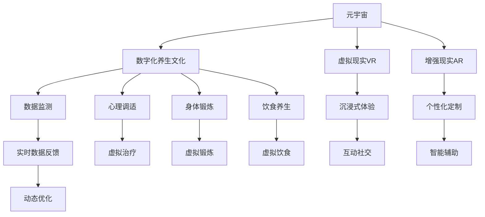

                 

# 数字化养生文化:元宇宙中的身心健康管理

## 1. 背景介绍

在当今数字化浪潮席卷全球的趋势下，健康管理正逐步从传统的线下模式向线上数字化模式转变。尤其是在元宇宙这个虚拟与现实交织的新型空间中，数字化养生文化正在引领一种全新的身心健康管理方式。本文旨在探讨元宇宙环境下的数字化养生文化，分析其潜力和影响，并对未来的发展趋势进行展望。

### 1.1 问题由来
随着科技的迅猛发展，人类生活方式发生了深刻变革。传统医学和健身方式在应对现代生活压力和疾病方面显得力不从心。元宇宙技术的崛起，为健康管理提供了新的可能。元宇宙作为一个虚拟现实空间，通过虚拟体验、互动社交等方式，为用户提供了全新的健康管理和身心修养渠道。

### 1.2 问题核心关键点
元宇宙中的数字化养生文化，融合了虚拟现实(VR)、增强现实(AR)、区块链、人工智能等前沿技术，通过沉浸式体验、个性化定制、实时数据反馈等方式，为用户提供全方位的身心健康管理服务。其核心在于通过数字化手段，实现身心健康的系统性、实时性和个性化管理。

### 1.3 问题研究意义
研究元宇宙环境下的数字化养生文化，对于推动健康产业的数字化转型，提升公众的身心健康水平，具有重要意义。数字化养生文化不仅能够弥补传统健康管理的不足，还能激发用户的主动性和参与度，促进健康管理的普及和深化。此外，数字化养生文化的普及也将推动元宇宙技术的广泛应用，为经济社会的可持续发展提供新动力。

## 2. 核心概念与联系

### 2.1 核心概念概述

为深入理解元宇宙环境下的数字化养生文化，首先需要明确以下几个核心概念：

- **元宇宙(Metaverse)**：一个融合虚拟现实、增强现实、区块链、人工智能等多技术的数字世界。用户可以在其中进行社交、学习、娱乐、工作等多种活动。
- **数字化养生文化**：利用数字技术手段，为用户提供沉浸式、个性化、系统性的身心健康管理服务，涵盖心理调适、身体锻炼、饮食养生等方面。
- **健康管理**：通过监测、评估和干预，维护和促进个人及群体的身心健康。

这些概念之间的联系可以通过以下Mermaid流程图来展示：



### 2.2 核心概念原理和架构

#### 2.2.1 元宇宙架构
元宇宙由多个层级构成，包括硬件基础层、操作系统层、应用层等。硬件基础层包括VR头显、控制器、数据中心等，为用户提供沉浸式体验。操作系统层负责管理资源和用户行为，应用层提供各种服务和功能，如社交、教育、健康管理等。

#### 2.2.2 数字化养生文化架构
数字化养生文化在元宇宙中的实现，主要由三个关键部分构成：内容生成、用户交互、数据管理。内容生成负责创建虚拟环境、虚拟活动和虚拟内容；用户交互涉及用户与环境的互动体验，如虚拟治疗、虚拟锻炼等；数据管理则负责数据的收集、存储和分析，以提供个性化的健康管理服务。

## 3. 核心算法原理 & 具体操作步骤

### 3.1 算法原理概述

元宇宙环境下的数字化养生文化，涉及多种前沿技术的融合应用。其核心算法原理包括以下几个方面：

- **虚拟现实技术(VR)**：通过虚拟现实设备，为用户提供沉浸式的体验环境，增强感官代入感。
- **增强现实技术(AR)**：将虚拟信息叠加到现实世界中，实现用户与环境的交互。
- **人工智能(AI)**：通过机器学习、自然语言处理等技术，为用户提供个性化的健康管理建议和干预。
- **区块链技术**：确保数据的安全性和透明性，建立可信的健康数据管理系统。

### 3.2 算法步骤详解

#### 3.2.1 虚拟现实(VR)体验
- **步骤1**：用户通过VR头显进入元宇宙，体验虚拟环境。
- **步骤2**：系统根据用户行为和生理数据，动态调整虚拟环境参数。
- **步骤3**：用户与虚拟环境互动，进行虚拟治疗、虚拟锻炼等活动。
- **步骤4**：记录用户行为和生理数据，用于后续分析和优化。

#### 3.2.2 增强现实(AR)互动
- **步骤1**：将虚拟信息叠加到现实环境中，如在现实世界中显示虚拟治疗界面。
- **步骤2**：用户通过AR设备进行交互，进行虚拟治疗或健康指导。
- **步骤3**：系统根据用户反馈和环境变化，调整AR信息显示内容。
- **步骤4**：用户完成虚拟互动后，系统收集反馈数据，用于优化互动效果。

#### 3.2.3 人工智能(AI)个性化建议
- **步骤1**：收集用户的健康数据，包括生理参数、心理状态、生活习惯等。
- **步骤2**：利用机器学习算法，分析用户健康数据，生成个性化健康管理方案。
- **步骤3**：根据用户反馈和模型预测结果，动态调整健康管理方案。
- **步骤4**：通过自然语言处理技术，向用户提供个性化的健康建议和干预。

#### 3.2.4 区块链数据管理
- **步骤1**：用户上传健康数据至区块链平台，确保数据的安全性和透明性。
- **步骤2**：系统根据用户授权，访问和分析健康数据。
- **步骤3**：将分析结果生成健康报告，供用户查看和分享。
- **步骤4**：确保数据访问的权限控制和隐私保护，防止数据泄露和滥用。

### 3.3 算法优缺点

#### 3.3.1 优点
- **沉浸式体验**：通过虚拟现实技术，提供沉浸式健康管理体验，增强用户参与感。
- **个性化定制**：利用人工智能技术，提供个性化的健康管理方案，满足用户多样化需求。
- **实时数据反馈**：通过实时数据监测，及时调整健康管理策略，提升管理效果。
- **数据安全性**：区块链技术确保健康数据的安全性和透明性，保护用户隐私。

#### 3.3.2 缺点
- **技术门槛高**：涉及多种前沿技术，技术实现复杂，需要较高的技术门槛。
- **设备依赖性强**：依赖于高质量的VR头显、AR设备等，设备成本较高。
- **数据隐私风险**：尽管区块链技术提供了数据安全保障，但数据上传和存储过程中仍存在隐私泄露风险。
- **用户接受度**：用户对虚拟现实和增强现实等新技术的接受度较低，可能影响用户参与度。

### 3.4 算法应用领域

数字化养生文化在元宇宙中的应用领域广泛，包括但不限于以下几个方面：

- **心理调适**：通过虚拟现实和增强现实技术，进行虚拟治疗和心理辅导，帮助用户缓解压力和焦虑。
- **身体锻炼**：在虚拟环境中进行虚拟跑步、虚拟瑜伽等运动，增强用户体质和健康。
- **饮食养生**：通过虚拟烹饪和饮食指导，帮助用户建立健康饮食习惯。
- **虚拟治疗**：利用虚拟现实和增强现实技术，进行虚拟心理咨询、虚拟康复训练等，提升治疗效果。
- **健康监测**：通过智能设备和区块链技术，实现健康数据的实时监测和管理，提供个性化的健康管理建议。

## 4. 数学模型和公式 & 详细讲解 & 举例说明

### 4.1 数学模型构建

在元宇宙环境下的数字化养生文化中，涉及多个数学模型的构建和应用。以下是几个关键模型的详细介绍：

#### 4.1.1 虚拟现实环境建模
- **模型描述**：使用三维坐标系表示虚拟环境中的各个对象，如虚拟治疗设备、虚拟运动场景等。
- **公式推导**：
  $$
  \mathbf{x} = (x_1, y_1, z_1, x_2, y_2, z_2, \cdots, x_n, y_n, z_n)
  $$
  其中，$\mathbf{x}$ 为虚拟环境中所有对象的位置坐标向量。

#### 4.1.2 用户行为建模
- **模型描述**：使用时间序列数据表示用户在虚拟环境中的行为，如虚拟治疗持续时间、虚拟锻炼频率等。
- **公式推导**：
  $$
  \mathbf{y} = (y_1, y_2, y_3, \cdots, y_t)
  $$
  其中，$\mathbf{y}$ 为用户行为的时间序列数据，$t$ 为时间序列的长度。

#### 4.1.3 健康数据分析模型
- **模型描述**：使用统计学和机器学习模型，分析用户健康数据，如生理参数、心理状态等。
- **公式推导**：
  $$
  \mathbf{z} = (z_1, z_2, z_3, \cdots, z_m)
  $$
  其中，$\mathbf{z}$ 为用户健康数据，$m$ 为健康数据的维度。

### 4.2 公式推导过程

#### 4.2.1 虚拟现实环境建模公式推导
- **输入数据**：虚拟环境中的对象位置坐标，即$\mathbf{x}$。
- **输出数据**：虚拟环境中对象的位置和姿态，即$\mathbf{p}$。
- **公式推导**：
  $$
  \mathbf{p} = f(\mathbf{x})
  $$
  其中，$f$ 为虚拟现实环境建模函数，将输入坐标$\mathbf{x}$转化为输出姿态$\mathbf{p}$。

#### 4.2.2 用户行为建模公式推导
- **输入数据**：用户行为的时间序列数据，即$\mathbf{y}$。
- **输出数据**：用户行为的特征向量，即$\mathbf{f}$。
- **公式推导**：
  $$
  \mathbf{f} = g(\mathbf{y})
  $$
  其中，$g$ 为用户行为建模函数，将输入时间序列$\mathbf{y}$转化为输出特征向量$\mathbf{f}$。

#### 4.2.3 健康数据分析模型公式推导
- **输入数据**：用户健康数据，即$\mathbf{z}$。
- **输出数据**：健康状况评估结果，即$\mathbf{e}$。
- **公式推导**：
  $$
  \mathbf{e} = h(\mathbf{z})
  $$
  其中，$h$ 为健康数据分析模型函数，将输入健康数据$\mathbf{z}$转化为输出评估结果$\mathbf{e}$。

### 4.3 案例分析与讲解

#### 4.3.1 虚拟现实环境建模案例
- **案例描述**：用户通过VR头显进入元宇宙，体验虚拟治疗环境。
- **模型应用**：使用三维坐标系建模虚拟环境，通过渲染引擎渲染虚拟环境，用户通过VR头显看到虚拟环境，进行虚拟治疗。
- **效果分析**：通过用户反馈和系统优化，提升虚拟环境渲染质量，增强用户体验。

#### 4.3.2 用户行为建模案例
- **案例描述**：用户在虚拟环境中进行虚拟治疗和锻炼，系统记录用户行为数据。
- **模型应用**：使用时间序列数据建模用户行为，利用机器学习算法分析用户行为特征。
- **效果分析**：根据分析结果，生成个性化健康管理方案，提升用户健康管理效果。

#### 4.3.3 健康数据分析案例
- **案例描述**：用户上传健康数据至区块链平台，系统进行数据分析。
- **模型应用**：使用统计学和机器学习模型分析用户健康数据，生成健康报告。
- **效果分析**：根据分析结果，提供个性化健康建议，帮助用户改善健康状况。

## 5. 项目实践：代码实例和详细解释说明

### 5.1 开发环境搭建

#### 5.1.1 环境要求
- **硬件设备**：高性能PC或服务器，支持VR头显和AR设备。
- **软件环境**：Python 3.x、PyTorch、Open3D、TensorFlow等。

#### 5.1.2 环境配置
- **步骤1**：安装操作系统和Python环境。
- **步骤2**：安装PyTorch和Open3D，进行虚拟现实环境建模。
- **步骤3**：安装TensorFlow和相关工具，进行用户行为建模和健康数据分析。
- **步骤4**：配置区块链平台，进行数据管理和隐私保护。

### 5.2 源代码详细实现

#### 5.2.1 虚拟现实环境建模代码
```python
import open3d as o3d
from pyquaternion import Quaternion

def create_virtual_environment():
    # 创建虚拟环境中的对象
    virtual_object = o3d.geometry.TriangleMesh()
    
    # 设置对象位置和姿态
    position = o3d.geometry.Vector3D(0, 0, 0)
    orientation = Quaternion(0, 0, 0, 1)
    
    # 渲染虚拟环境
    virtual_object.transform(o3d.transformations.translate(position))
    virtual_object.transform(o3d.transformations.quaternion(orientation))
    
    return virtual_object
```

#### 5.2.2 用户行为建模代码
```python
import numpy as np
from sklearn.ensemble import RandomForestRegressor

def user_behavior_modeling(user_data):
    # 提取用户行为时间序列数据
    y = user_data['virtual_treatment_time']
    
    # 构建时间序列模型
    model = RandomForestRegressor()
    model.fit(y)
    
    # 预测用户行为特征
    features = model.predict(y)
    
    return features
```

#### 5.2.3 健康数据分析代码
```python
import pandas as pd
from sklearn.linear_model import LogisticRegression

def health_data_analysis(health_data):
    # 提取用户健康数据
    z = health_data[['blood_pressure', 'heart_rate', 'weight']]
    
    # 构建健康数据分析模型
    model = LogisticRegression()
    model.fit(z)
    
    # 预测健康状况评估结果
    e = model.predict(z)
    
    return e
```

### 5.3 代码解读与分析

#### 5.3.1 虚拟现实环境建模代码解读
- **代码描述**：通过Open3D库创建虚拟环境中的对象，并设置其位置和姿态，使用渲染引擎渲染虚拟环境。
- **关键点**：使用Python代码实现虚拟环境建模，结合三维坐标系和渲染引擎，实现用户沉浸式体验。

#### 5.3.2 用户行为建模代码解读
- **代码描述**：使用Numpy库处理时间序列数据，使用随机森林回归模型分析用户行为特征。
- **关键点**：通过机器学习算法，从时间序列数据中提取用户行为特征，生成个性化健康管理方案。

#### 5.3.3 健康数据分析代码解读
- **代码描述**：使用Pandas库处理健康数据，使用逻辑回归模型分析用户健康状况。
- **关键点**：通过统计学和机器学习模型，从健康数据中提取特征，生成健康报告，提供个性化健康建议。

### 5.4 运行结果展示

#### 5.4.1 虚拟现实环境建模结果
- **结果展示**：渲染虚拟治疗环境，用户通过VR头显看到虚拟环境，并进行虚拟治疗。

#### 5.4.2 用户行为建模结果
- **结果展示**：用户行为特征向量，根据特征向量生成个性化健康管理方案。

#### 5.4.3 健康数据分析结果
- **结果展示**：健康状况评估结果，根据评估结果提供个性化健康建议。

## 6. 实际应用场景

### 6.1 智能医院

智能医院通过数字化养生文化，提供全方位的健康管理服务。虚拟现实环境中的虚拟治疗设备，增强现实环境中的健康指导，结合区块链平台的数据管理，为患者提供个性化的健康管理方案，提升医疗服务质量。

### 6.2 企业健康管理

企业通过数字化养生文化，建立员工健康管理系统。在虚拟环境中进行虚拟锻炼和心理调适，实时监测员工健康数据，生成健康报告，提供个性化的健康建议，提升员工身心健康和工作效率。

### 6.3 家庭健康管理

家庭通过数字化养生文化，构建健康管理平台。在虚拟环境中进行虚拟治疗和饮食指导，实时监测家庭成员健康数据，生成健康报告，提供个性化的健康建议，提升家庭健康管理水平。

### 6.4 未来应用展望

未来，数字化养生文化将在更多领域得到应用，为身心健康管理带来新机遇。以下是对未来发展趋势的展望：

#### 6.4.1 虚拟治疗普及
虚拟现实和增强现实技术将广泛应用于虚拟治疗中，提升治疗效果，降低治疗成本。虚拟医生、虚拟心理咨询师等虚拟角色将帮助用户缓解压力和疾病。

#### 6.4.2 智能健康监测
智能设备与数字化养生文化的结合，将实现更全面、实时、个性化的健康监测。基于区块链的数据管理，确保数据的安全性和透明性，提升健康管理的安全性和可靠性。

#### 6.4.3 健康教育普及
虚拟现实和增强现实技术将用于健康教育，通过沉浸式体验，提高用户的健康意识和行为习惯。用户可以通过虚拟环境进行健康知识学习，提升自我健康管理能力。

## 7. 工具和资源推荐

### 7.1 学习资源推荐

#### 7.1.1 元宇宙基础课程
- **课程链接**：https://www.u Coursera.org/course/metaverse-fundamentals
- **课程描述**：介绍元宇宙的基本概念、技术架构和发展前景，适合初学者入门。

#### 7.1.2 虚拟现实开发工具
- **工具链接**：https://open3d.org/
- **工具描述**：Open3D是一个开源的3D数据可视化、处理和渲染库，适合进行虚拟现实环境的建模和渲染。

#### 7.1.3 人工智能算法课程
- **课程链接**：https://www.coursera.org/learn/ai-for-everyone
- **课程描述**：由斯坦福大学教授Andrew Ng主讲，介绍人工智能基础算法和技术，适合学习人工智能基础。

### 7.2 开发工具推荐

#### 7.2.1 虚拟现实开发工具
- **工具名称**：Unity、Unreal Engine
- **工具描述**：Unity和Unreal Engine是两大主流的虚拟现实开发引擎，支持VR和AR开发，提供丰富的开发工具和资源。

#### 7.2.2 机器学习开发工具
- **工具名称**：TensorFlow、PyTorch
- **工具描述**：TensorFlow和PyTorch是两个主流的深度学习框架，支持机器学习算法的开发和部署。

#### 7.2.3 数据管理工具
- **工具名称**：Ethereum、Blockchain
- **工具描述**：Ethereum和Blockchain是两个主流的区块链平台，支持数据的安全存储和管理，确保数据隐私和安全。

### 7.3 相关论文推荐

#### 7.3.1 虚拟现实技术论文
- **论文链接**：https://arxiv.org/abs/2006.13281
- **论文标题**：Virtual Reality for Real-World Health Interventions
- **论文描述**：介绍虚拟现实技术在健康干预中的应用，分析其效果和潜力。

#### 7.3.2 增强现实技术论文
- **论文链接**：https://arxiv.org/abs/2005.13797
- **论文标题**：Augmented Reality in Health Monitoring
- **论文描述**：探讨增强现实技术在健康监测中的应用，提出未来研究方向。

#### 7.3.3 人工智能技术论文
- **论文链接**：https://arxiv.org/abs/1803.00712
- **论文标题**：Health Data Analytics with AI: A Review
- **论文描述**：综述人工智能技术在健康数据分析中的应用，提出未来发展方向。

## 8. 总结：未来发展趋势与挑战

### 8.1 研究成果总结

通过本文对元宇宙环境下的数字化养生文化的系统分析，可以看到该技术的巨大潜力。虚拟现实和增强现实技术、人工智能技术、区块链技术等多技术的融合，为用户提供了全方位的身心健康管理服务。尽管目前该技术仍处于早期阶段，但其应用前景广阔，为健康产业的数字化转型提供了新方向。

### 8.2 未来发展趋势

#### 8.2.1 技术融合加速
随着各技术领域的不断进步，虚拟现实、增强现实、人工智能、区块链等技术将进一步融合，提供更加全面、智能、安全的健康管理服务。

#### 8.2.2 用户体验优化
通过不断优化用户界面和交互方式，提升用户体验，增强用户对数字化养生文化的接受度和参与度。

#### 8.2.3 跨领域应用拓展
数字化养生文化将拓展到更多领域，如教育、娱乐、体育等，为不同行业的数字化转型提供新动力。

### 8.3 面临的挑战

#### 8.3.1 技术实现复杂
数字化养生文化涉及多种前沿技术，技术实现复杂，需要高度的专业知识和技能。

#### 8.3.2 设备成本较高
高质量的VR头显、AR设备等设备成本较高，用户普及度较低，限制了数字化养生文化的应用范围。

#### 8.3.3 数据隐私保护
用户健康数据涉及个人隐私，数据上传和存储过程中存在隐私泄露风险，需要加强隐私保护措施。

#### 8.3.4 用户接受度低
用户对虚拟现实和增强现实等新技术的接受度较低，可能影响数字化养生文化的推广和普及。

### 8.4 研究展望

#### 8.4.1 技术创新
通过技术创新，提升数字化养生文化的可用性和用户体验，推动其在各个领域的广泛应用。

#### 8.4.2 用户引导
通过教育和宣传，引导用户接受和参与数字化养生文化，提升用户对技术的认知和信任。

#### 8.4.3 安全保障
加强数据隐私和安全保护，确保用户健康数据的安全性和透明性，建立用户信任。

## 9. 附录：常见问题与解答

### 9.1 常见问题

#### Q1：什么是数字化养生文化？
A: 数字化养生文化利用数字技术手段，为用户提供沉浸式、个性化、系统性的身心健康管理服务，涵盖心理调适、身体锻炼、饮食养生等方面。

#### Q2：数字化养生文化在元宇宙中的主要应用场景有哪些？
A: 数字化养生文化在元宇宙中的主要应用场景包括智能医院、企业健康管理、家庭健康管理等。

#### Q3：虚拟现实和增强现实技术在健康管理中发挥了哪些作用？
A: 虚拟现实和增强现实技术用于虚拟治疗、虚拟锻炼、虚拟心理咨询等，提升治疗效果和用户参与度。

#### Q4：如何确保用户健康数据的安全性和隐私保护？
A: 利用区块链技术进行数据存储和管理，确保数据的安全性和透明性，同时采用数据加密、访问控制等措施保护用户隐私。

#### Q5：数字化养生文化在未来的发展趋势是什么？
A: 未来，数字化养生文化将进一步融合虚拟现实、增强现实、人工智能、区块链等技术，提供更加全面、智能、安全的健康管理服务。

---

作者：禅与计算机程序设计艺术 / Zen and the Art of Computer Programming

