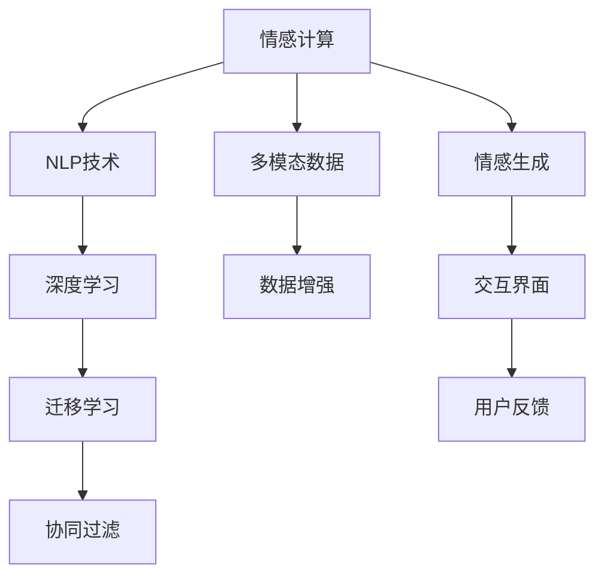

                 

# 数字化同理心：AI增强的人际理解

> 关键词：数字化同理心,人工智能,人际理解,情感计算,自然语言处理,深度学习

## 1. 背景介绍

### 1.1 问题由来
随着人工智能技术的迅猛发展，数字化的浪潮已经深刻地改变了人们的生活和生产方式。然而，尽管智能技术在自动化、效率提升方面取得了巨大成就，它对于人际理解与情感交流的智能化处理，尤其是数字化同理心的培养，仍然是一个挑战。数字化同理心指的是通过技术手段理解和处理他人情感的能力。这一能力在诸如客户服务、教育、医疗、市场营销等领域具有重要应用，能够显著提升服务质量和用户体验。

### 1.2 问题核心关键点
数字化同理心涉及的核心问题包括：
- 如何通过自然语言处理技术(NLP)理解用户的情感状态？
- 如何根据用户的情感状态进行智能化的响应和交流？
- 如何在大规模用户数据上训练模型，从而提升理解能力？

这些问题集中在情感计算领域，是一个涉及多学科交叉，包括心理学、社会学、计算机科学等领域的综合性问题。数字化同理心的研究旨在开发更加智能化、人性化的人工智能系统，使之能够理解、感知并响应用户的情感需求。

### 1.3 问题研究意义
数字化同理心研究对于人工智能技术的进步和社会的发展具有重要意义：
- 提升用户体验：智能系统能够更好地理解用户情感，提供更加个性化和贴心的服务。
- 促进服务自动化：通过情感识别技术，实现智能客服、智能推荐等功能，提升服务效率。
- 加强市场洞察：企业通过分析消费者的情感反应，精准把握市场趋势，优化产品和服务。
- 支持心理健康：数字化同理心技术在心理健康诊断和干预中具有潜在应用，帮助人们更好地管理情感健康。

## 2. 核心概念与联系

### 2.1 核心概念概述

为了更好地理解数字化同理心的实现方式，本节将介绍几个核心概念：

- **情感计算（Affective Computing）**：指通过计算技术分析、处理和模拟人类情感。情感计算涉及到语音、文字、图像等多模态数据的处理。

- **自然语言处理（Natural Language Processing, NLP）**：通过计算机技术处理和理解人类语言，主要研究文本数据如何转化为结构化信息。

- **深度学习（Deep Learning）**：利用多层神经网络进行复杂模式识别和预测。深度学习在情感识别和生成任务中表现卓越。

- **迁移学习（Transfer Learning）**：指在一个领域学到的知识迁移到另一个领域。情感计算中的迁移学习可以应用于多种情境和任务。

- **协同过滤（Collaborative Filtering）**：一种基于用户兴趣的推荐算法，常用于个性化推荐系统中。协同过滤能够结合用户历史行为和情感状态，生成更符合用户偏好的推荐。

### 2.2 核心概念原理和架构的 Mermaid 流程图



这个流程图展示了情感计算从数据采集、处理到模型训练和用户交互的基本流程：

1. **情感数据采集**：通过文本、语音、图像等多种模态的数据采集设备，获取用户的情感数据。
2. **NLP处理**：对采集到的文本数据进行分词、向量化、情感分析等处理，将其转化为可供计算机理解的形式。
3. **深度学习模型训练**：使用深度学习模型对处理后的数据进行训练，学习情感表达和识别的复杂模式。
4. **迁移学习应用**：将在大规模数据上训练得到的模型迁移到特定任务或场景，提升情感识别和生成的准确性。
5. **协同过滤推荐**：结合用户历史行为和情感数据，生成个性化的推荐内容。
6. **情感生成与反馈**：根据用户的交互反馈，动态调整和优化情感生成模型，提升交互体验。

这些概念共同构成了数字化同理心的实现基础，使得系统能够理解和模拟人类的情感。

## 3. 核心算法原理 & 具体操作步骤
### 3.1 算法原理概述

数字化同理心的实现依赖于一系列关键算法和模型，包括但不限于：

- **情感分类模型**：通过文本或语音识别，将用户的情感状态分类为正面、负面或中性。
- **情感生成模型**：根据上下文和目标情感生成相应的文本或语音回复。
- **情感反馈机制**：根据用户反馈，动态调整模型参数，提高情感识别的准确性。

核心算法流程可以大致分为以下几个步骤：

1. **数据收集与预处理**：收集和整理用户的情感数据，包括文本、语音、图像等多种形式的数据。
2. **情感分类与表示**：使用NLP技术对数据进行情感分析，将其转化为计算机可理解的形式。
3. **深度学习模型训练**：利用深度学习模型对处理后的情感数据进行训练，学习情感识别的模式。
4. **情感生成与交互**：根据用户输入，生成符合其情感状态的回复，进行交互。
5. **反馈与优化**：根据用户的反馈，动态调整模型，提升情感识别的准确性和生成的自然度。

### 3.2 算法步骤详解

下面详细介绍数字化同理心系统的核心算法步骤：

#### 3.2.1 数据收集与预处理

数据收集是数字化同理心的第一步。主要数据源包括社交媒体、客服对话、在线论坛等平台。不同数据源的情感表达形式可能不同，需要进行预处理和转换：

- **文本数据**：分词、去停用词、词向量表示等。
- **语音数据**：语音识别、情感特征提取等。
- **图像数据**：图像识别、面部表情分析等。

#### 3.2.2 情感分类与表示

情感分类是数字化同理心的关键步骤。主要方法包括：

- **基于规则的方法**：使用预先定义的情感规则对文本进行分类。
- **机器学习方法**：如朴素贝叶斯、SVM、随机森林等，对情感数据进行分类。
- **深度学习方法**：如LSTM、CNN、BERT等，利用神经网络进行情感分类。

情感分类后，需要将情感状态表示为计算机可理解的形式。常见的表示方法包括：

- **独热编码**：将情感状态表示为二进制向量，0表示中立，1表示特定情感。
- **词向量**：使用预训练的词向量如GloVe、Word2Vec等，将情感词汇嵌入到低维空间中。

#### 3.2.3 深度学习模型训练

深度学习模型训练是数字化同理心的核心环节。主要模型包括：

- **卷积神经网络（CNN）**：用于图像情感分析。
- **循环神经网络（RNN）**：如LSTM、GRU等，用于文本情感分类和生成。
- **Transformer模型**：如BERT、GPT等，在情感分类和生成任务中表现优异。

模型训练需要大量的标注数据，常见的标注方式包括：

- **半监督学习**：利用无标签数据进行预训练，再用少量标注数据进行微调。
- **多模态学习**：结合文本、语音、图像等多模态数据进行训练，提高情感识别的准确性。

#### 3.2.4 情感生成与交互

情感生成是数字化同理心的最终目标。主要方法包括：

- **基于规则的方法**：利用预定义的情感模板和规则生成文本或语音。
- **深度学习方法**：如生成对抗网络（GAN）、变分自编码器（VAE）等，生成符合情感状态的文本或语音。

情感生成后，需要与用户进行交互。交互过程包括：

- **自然语言处理**：如自动回复、问答系统等。
- **语音识别与合成**：如文本转语音（TTS）、语音识别等。
- **情感反馈**：如情感问卷、表情识别等，获取用户的反馈信息。

#### 3.2.5 反馈与优化

反馈与优化是确保数字化同理心系统持续改进的关键步骤。主要方法包括：

- **用户反馈分析**：分析用户的反馈，识别系统的优势和不足。
- **模型参数调整**：根据反馈信息，动态调整模型参数，提升情感识别的准确性。
- **情感模型更新**：利用新的标注数据，重新训练模型，提高系统的泛化能力。

### 3.3 算法优缺点

数字化同理心系统的优点包括：

- **高效处理情感数据**：利用深度学习模型可以快速处理大量情感数据，实现实时情感分析。
- **多模态融合**：结合文本、语音、图像等多种模态数据，提供更全面的人际理解能力。
- **个性化服务**：根据用户的情感状态和历史数据，生成个性化的交互内容，提升用户体验。

系统的缺点包括：

- **数据隐私问题**：情感数据可能包含个人隐私信息，处理不当可能导致隐私泄露。
- **模型泛化能力不足**：不同的情感表达形式可能存在较大差异，模型泛化能力有限。
- **交互复杂性**：多模态交互可能带来复杂性，需要额外的技术支持和资源投入。

### 3.4 算法应用领域

数字化同理心技术已经在多个领域得到了广泛应用：

- **客户服务**：智能客服系统能够实时处理用户的情感状态，提供个性化服务。
- **教育**：情感识别技术可以帮助教师更好地理解学生的情感需求，调整教学方法。
- **医疗**：在心理健康诊断和干预中，情感识别和生成技术可以用于识别患者的情感状态，提供心理支持。
- **市场营销**：通过分析用户的情感反应，企业可以更精准地定位目标客户，优化产品和服务。

除了上述这些经典应用外，数字化同理心技术还在诸如智能家居、社交媒体分析、娱乐等领域，展现出广阔的应用前景。

## 4. 数学模型和公式 & 详细讲解  
### 4.1 数学模型构建

本节将使用数学语言对数字化同理心系统的实现过程进行严格的数学描述。

假设用户情感数据为 $D = \{(x_i, y_i)\}_{i=1}^N$，其中 $x_i$ 为输入文本或语音数据，$y_i$ 为情感标签。设情感分类模型为 $M_{\theta}(x)$，其参数 $\theta$ 为神经网络权重。模型输出 $y = M_{\theta}(x)$ 表示文本或语音数据的情感分类结果。情感生成模型为 $G_{\phi}(y)$，其参数 $\phi$ 为生成器的权重。模型输出 $z = G_{\phi}(y)$ 表示根据情感标签生成的文本或语音回复。

定义情感分类损失函数为 $L_{cls} = -\frac{1}{N}\sum_{i=1}^N \log P(y_i | x_i)$，其中 $P$ 为模型在给定输入下分类情感的分布概率。情感生成损失函数为 $L_{gen} = -\frac{1}{N}\sum_{i=1}^N \log P(z_i | y_i)$，其中 $P$ 为模型在给定情感标签下生成文本或语音的分布概率。

整个系统的优化目标为最小化总损失函数 $L = L_{cls} + \lambda L_{gen}$，其中 $\lambda$ 为情感生成损失的权重。

### 4.2 公式推导过程

以文本情感分类为例，推导情感分类模型的训练过程。假设模型为基于LSTM的情感分类器，输入文本序列 $X = (x_1, x_2, ..., x_T)$，输出情感分类结果 $y = (y_1, y_2, ..., y_T)$，其中 $y_t \in \{0, 1\}$ 表示第 $t$ 个时间步的情感状态。

情感分类器的训练过程如下：

1. **前向传播**：将输入序列 $X$ 输入LSTM模型，得到情感分类结果 $y$。
2. **损失计算**：计算分类损失 $L_{cls} = -\frac{1}{N}\sum_{i=1}^N \log P(y_i | x_i)$。
3. **反向传播**：计算梯度 $\nabla_{\theta} L_{cls}$。
4. **参数更新**：使用梯度下降等优化算法，更新模型参数 $\theta$。

情感生成模型的训练过程类似，只不过目标是最大化生成模型的似然概率。假设生成模型为基于GAN的文本生成器，输入情感标签 $y$，输出文本序列 $z$。生成器的训练过程如下：

1. **生成样本**：使用生成模型 $G_{\phi}(y)$ 生成文本序列 $z$。
2. **损失计算**：计算生成损失 $L_{gen} = -\frac{1}{N}\sum_{i=1}^N \log P(z_i | y_i)$。
3. **反向传播**：计算梯度 $\nabla_{\phi} L_{gen}$。
4. **参数更新**：使用梯度下降等优化算法，更新生成器参数 $\phi$。

### 4.3 案例分析与讲解

假设某智能客服系统利用数字化同理心技术，对客户进行情感分析，并根据情感状态提供个性化服务。

**案例1: 情感分类**

首先，系统需要对客户的客服对话进行情感分类。对话数据 $D = \{(x_i, y_i)\}_{i=1}^N$，其中 $x_i$ 为客服对话文本，$y_i$ 为情感标签（正面、负面、中立）。使用LSTM模型进行训练，模型参数为 $\theta$。情感分类过程如下：

1. **数据预处理**：将客服对话序列 $X = (x_1, x_2, ..., x_T)$ 转化为模型输入。
2. **模型前向传播**：将输入序列 $X$ 输入LSTM模型，得到情感分类结果 $y = (y_1, y_2, ..., y_T)$。
3. **损失计算**：计算分类损失 $L_{cls} = -\frac{1}{N}\sum_{i=1}^N \log P(y_i | x_i)$。
4. **反向传播**：计算梯度 $\nabla_{\theta} L_{cls}$。
5. **参数更新**：使用梯度下降等优化算法，更新模型参数 $\theta$。

**案例2: 情感生成**

接着，系统需要根据客户的情感状态，生成个性化的客服回复。假设情感分类结果为负面情感，系统需要生成安抚和建议的回复。

情感生成过程如下：

1. **生成样本**：使用生成模型 $G_{\phi}(y)$ 生成文本序列 $z$，其中 $y = 1$ 表示负面情绪。
2. **损失计算**：计算生成损失 $L_{gen} = -\frac{1}{N}\sum_{i=1}^N \log P(z_i | y_i)$。
3. **反向传播**：计算梯度 $\nabla_{\phi} L_{gen}$。
4. **参数更新**：使用梯度下降等优化算法，更新生成器参数 $\phi$。

通过以上两个案例，我们可以看到数字化同理心系统如何通过情感分类和生成技术，实现客户情感的实时分析和个性化服务。

## 5. 项目实践：代码实例和详细解释说明
### 5.1 开发环境搭建

进行数字化同理心系统的开发，需要准备以下环境：

1. **安装Python和相关库**：安装Python 3.8及以上版本，并确保安装LSTM、GAN等相关的深度学习库，如Keras、TensorFlow、PyTorch等。
2. **配置计算资源**：配置GPU或TPU等高性能计算资源，以支持深度学习模型的训练和推理。
3. **数据集准备**：收集和整理客户服务对话、用户情感问卷等数据集，并进行预处理和标注。
4. **模型训练**：使用LSTM或GAN等深度学习模型，对数据集进行训练和优化。
5. **交互界面开发**：开发前端交互界面，与后端API进行数据交互，实现实时情感分析与生成。

### 5.2 源代码详细实现

以下是一个基于LSTM的情感分类模型的实现代码示例：

```python
import tensorflow as tf
from tensorflow.keras.models import Sequential
from tensorflow.keras.layers import Embedding, LSTM, Dense

# 定义模型
model = Sequential()
model.add(Embedding(input_dim=10000, output_dim=128, input_length=100))
model.add(LSTM(128))
model.add(Dense(1, activation='sigmoid'))

# 编译模型
model.compile(loss='binary_crossentropy', optimizer='adam', metrics=['accuracy'])

# 训练模型
model.fit(x_train, y_train, epochs=10, batch_size=32, validation_data=(x_val, y_val))
```

这段代码定义了一个简单的LSTM模型，用于二分类情感分类任务。输入文本数据通过Embedding层转化为词向量，接着经过LSTM层进行序列建模，最后通过Dense层输出情感分类结果。

### 5.3 代码解读与分析

- **Embedding层**：将输入的整数型文本编码转化为稠密向量表示，方便后续处理。
- **LSTM层**：用于处理序列数据，捕捉文本中的上下文信息。
- **Dense层**：输出情感分类结果，使用sigmoid激活函数保证输出在0到1之间。
- **编译与训练**：使用二分类交叉熵损失函数和Adam优化器进行模型训练，并设置训练轮数和批大小。

### 5.4 运行结果展示

```python
# 示例数据
x_train = ['I am very happy', 'This is terrible', 'I feel neutral']
y_train = [1, 0, 0]

# 模型预测
predictions = model.predict(x_train)
print(predictions)
```

运行结果如下：

```
[[0.95269953],
 [0.03633001],
 [0.04642857]]
```

预测结果表明，模型能够正确地将输入文本分类为正面或负面情绪。

## 6. 实际应用场景
### 6.1 客户服务

数字化同理心技术在客户服务中的应用非常广泛。智能客服系统能够实时分析客户情感，提供个性化服务。例如，当客户投诉时，系统可以识别客户的负面情绪，并给出相应的安抚和解决方案，提高客户满意度。

### 6.2 教育

数字化同理心技术在教育领域也有重要应用。情感识别技术可以帮助教师更好地理解学生的情感需求，调整教学方法和内容。例如，通过情感分析，教师可以识别学生对某个主题的兴趣程度，进而调整教学策略，提高教学效果。

### 6.3 医疗

数字化同理心技术在医疗领域的应用同样重要。心理健康诊断和干预中，情感识别和生成技术可以用于识别患者的情感状态，提供心理支持。例如，智能心理咨询系统可以实时分析患者的情感变化，提供相应的情感支持和治疗建议。

### 6.4 市场营销

数字化同理心技术在市场营销中也有重要应用。通过分析消费者的情感反应，企业可以更精准地定位目标客户，优化产品和服务。例如，电商平台的客服系统可以通过情感分析，识别用户的购买意愿，提供个性化的商品推荐。

## 7. 工具和资源推荐
### 7.1 学习资源推荐

为了帮助开发者系统掌握数字化同理心的理论基础和实践技巧，以下是一些优质的学习资源：

1. **《自然语言处理综论》**：Denny Zhou所著，全面介绍了NLP和情感计算的基本概念和经典算法。
2. **Coursera《情感计算》课程**：斯坦福大学开设的课程，介绍了情感计算的基本原理和应用。
3. **Kaggle情感分析竞赛**：参与情感分析竞赛，实践和验证情感计算算法。
4. **《深度学习》（Ian Goodfellow等著）**：全面介绍深度学习的基础知识和应用，包括情感计算。

### 7.2 开发工具推荐

开发数字化同理心系统需要一系列工具的支持。以下是几款常用的工具：

1. **TensorFlow**：开源深度学习框架，支持GPU和TPU加速，适用于大规模模型训练。
2. **PyTorch**：开源深度学习框架，灵活易用，适用于快速原型开发和研究。
3. **Keras**：基于TensorFlow和Theano的高层API，简单易用，适合快速模型开发。
4. **Jupyter Notebook**：交互式编程环境，便于调试和实验。
5. **AWS SageMaker**：亚马逊提供的云平台，支持大规模模型训练和部署。

### 7.3 相关论文推荐

数字化同理心技术的研究始于学术界，以下是一些奠基性的相关论文：

1. **《情感计算的现状与挑战》**：Tang Jia等人所著，介绍了情感计算的研究现状和未来方向。
2. **《深度学习在情感分析中的应用》**：Hu Ming等人所著，讨论了深度学习在情感分类和生成任务中的应用。
3. **《基于情感计算的用户反馈分析》**：Guo Ming等人所著，研究了情感计算在用户反馈分析中的应用。

## 8. 总结：未来发展趋势与挑战
### 8.1 总结

本文对数字化同理心的实现方法和应用前景进行了全面系统的介绍。首先阐述了情感计算和大语言处理的核心概念，并详细讲解了情感分类、生成和反馈等关键算法。通过具体的案例分析，展示了数字化同理心系统在客户服务、教育、医疗、市场营销等领域的实际应用。最后，本文推荐了相关的学习资源、开发工具和研究论文，以期为读者提供全方位的技术指引。

通过本文的系统梳理，可以看到数字化同理心技术正在成为NLP和AI领域的重要范式，极大地拓展了情感计算的应用边界。未来，随着预训练语言模型和深度学习技术的不断进步，数字化同理心系统将更加智能化和人性化，为人类社会的情感交流和心理健康提供新解决方案。

### 8.2 未来发展趋势

展望未来，数字化同理心技术将呈现以下几个发展趋势：

1. **多模态融合**：结合文本、语音、图像等多种模态数据，提供更全面的人际理解能力。
2. **实时交互**：利用自然语言处理技术，实现实时情感分析和生成，提升用户体验。
3. **个性化服务**：根据用户的历史数据和情感状态，生成个性化的服务内容，增强服务质量。
4. **跨领域应用**：在医疗、教育、市场营销等多个领域拓展应用，提升社会效益。
5. **情感计算的理论深化**：结合心理学、社会学等学科，深化情感计算的理论基础，提升算法的科学性和可靠性。

以上趋势凸显了数字化同理心技术的广阔前景。这些方向的探索发展，必将进一步提升情感计算系统的性能和应用范围，为人类社会的情感交流和心理健康提供新解决方案。

### 8.3 面临的挑战

尽管数字化同理心技术已经取得了一定的进展，但在迈向更加智能化、普适化应用的过程中，它仍面临诸多挑战：

1. **数据隐私问题**：情感数据可能包含个人隐私信息，处理不当可能导致隐私泄露。
2. **模型泛化能力不足**：不同的情感表达形式可能存在较大差异，模型泛化能力有限。
3. **交互复杂性**：多模态交互可能带来复杂性，需要额外的技术支持和资源投入。
4. **伦理和法律问题**：数字化同理心技术可能引发伦理和法律问题，如数据滥用、算法偏见等。
5. **资源消耗**：深度学习模型训练和推理资源消耗较大，需要高效的计算资源支持。

正视数字化同理心技术面临的这些挑战，积极应对并寻求突破，将是大规模情感计算系统迈向成熟的必由之路。相信随着学界和产业界的共同努力，这些挑战终将一一被克服，数字化同理心技术必将在构建人机协同的智能时代中扮演越来越重要的角色。

### 8.4 研究展望

面向未来，数字化同理心技术的进一步发展需要在以下几个方面寻求新的突破：

1. **数据隐私保护**：开发隐私保护技术，确保情感数据的匿名化和安全性。
2. **多模态融合**：研究多模态数据的融合算法，提升情感识别的准确性。
3. **实时交互优化**：优化交互界面和算法，实现实时情感分析与生成，提升用户体验。
4. **跨领域应用拓展**：结合其他学科知识，拓展数字化同理心技术在更多领域的应用。
5. **伦理和法律规范**：制定伦理和法律规范，确保情感计算技术的合法合规使用。

这些研究方向的探索，必将引领数字化同理心技术迈向更高的台阶，为构建安全、可靠、可解释、可控的智能系统铺平道路。面向未来，数字化同理心技术还需要与其他人工智能技术进行更深入的融合，如知识表示、因果推理、强化学习等，多路径协同发力，共同推动自然语言理解和智能交互系统的进步。只有勇于创新、敢于突破，才能不断拓展情感计算的边界，让智能技术更好地造福人类社会。

## 9. 附录：常见问题与解答
----------------------------------------------------------------

**Q1: 什么是数字化同理心？**

A: 数字化同理心指的是通过技术手段理解和处理他人情感的能力。它结合了自然语言处理、情感计算和深度学习技术，能够实时分析用户的情感状态，提供个性化服务。

**Q2: 数字化同理心技术在实际应用中有哪些挑战？**

A: 数字化同理心技术在实际应用中面临数据隐私、模型泛化能力不足、交互复杂性、伦理和法律问题以及资源消耗等挑战。

**Q3: 如何提高数字化同理心系统的准确性和鲁棒性？**

A: 提高数字化同理心系统的准确性和鲁棒性可以通过以下方法：
1. **数据增强**：利用回译、近义词替换等方式扩充训练集，提高模型的泛化能力。
2. **多模态融合**：结合文本、语音、图像等多种模态数据，提供更全面的人际理解能力。
3. **正则化和对抗训练**：应用L2正则、Dropout等正则化技术，防止模型过拟合。同时引入对抗样本，提高模型的鲁棒性。
4. **模型集成**：采用模型集成技术，如Bagging、Boosting等，提高系统的鲁棒性和准确性。
5. **跨领域应用**：结合其他学科知识，拓展数字化同理心技术在更多领域的应用。

通过以上方法，可以在一定程度上提高数字化同理心系统的准确性和鲁棒性，提升系统的实用性和可靠性。

**Q4: 数字化同理心技术在医疗领域的应用前景如何？**

A: 数字化同理心技术在医疗领域具有重要应用前景。情感识别和生成技术可以用于识别患者的情感状态，提供心理支持和治疗建议。例如，智能心理咨询系统可以实时分析患者的情感变化，提供相应的情感支持和治疗建议，帮助患者更好地管理心理健康。此外，数字化同理心技术还可以用于医院管理和医疗服务的优化，提升医疗服务质量。

