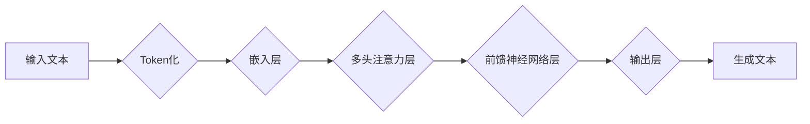

> AIGC, ChatGPT, 自然语言处理, 语言模型, 应用程序场景, 实战应用

## 1. 背景介绍

近年来，人工智能（AI）技术取得了飞速发展，其中自然语言处理（NLP）领域尤为突出。作为NLP领域的重要分支，生成式预训练语言模型（GPT）凭借其强大的文本生成能力，掀起了AI生成内容的热潮。ChatGPT作为其中最具代表性的模型之一，以其流畅自然的对话体验和广泛的应用场景，迅速成为了公众关注的焦点。

ChatGPT由OpenAI开发，基于Transformer架构，经过海量文本数据的训练，能够理解和生成人类语言。它可以完成多种任务，例如：

* **文本生成:**  撰写故事、诗歌、文章、代码等。
* **对话系统:**  与用户进行自然流畅的对话，提供信息、解答问题、进行娱乐互动等。
* **文本摘要:**  提取文本的关键信息，生成简洁的摘要。
* **翻译:**  将文本从一种语言翻译成另一种语言。
* **问答:**  根据给定的上下文，回答用户的问题。

ChatGPT的出现，为我们提供了全新的工具和可能性，推动了AIGC（AI生成内容）的发展，并将在各个领域带来深远的影响。

## 2. 核心概念与联系

### 2.1 自然语言处理（NLP）

自然语言处理（NLP）是人工智能领域的一个重要分支，旨在使计算机能够理解、处理和生成人类语言。NLP的任务包括：

* **文本分类:**  将文本归类到预定义的类别中。
* **情感分析:**  识别文本中表达的情感。
* **文本摘要:**  提取文本的关键信息，生成简洁的摘要。
* **机器翻译:**  将文本从一种语言翻译成另一种语言。
* **问答系统:**  根据给定的上下文，回答用户的问题。

### 2.2 生成式预训练语言模型（GPT）

生成式预训练语言模型（GPT）是一种基于Transformer架构的深度学习模型，能够生成流畅自然的文本。GPT模型通过预训练的方式学习语言的语法和语义知识，并能够根据输入的文本进行预测和生成。

### 2.3 Transformer架构

Transformer架构是一种新型的神经网络架构，专门用于处理序列数据，例如文本。Transformer架构的核心是注意力机制，能够捕捉文本中不同词语之间的关系，从而更好地理解文本的语义。

**Mermaid 流程图**



## 3. 核心算法原理 & 具体操作步骤

### 3.1 算法原理概述

ChatGPT的核心算法原理是基于Transformer架构的生成式预训练语言模型。它通过预训练的方式学习语言的语法和语义知识，并能够根据输入的文本进行预测和生成。

具体来说，ChatGPT的训练过程包括以下步骤：

1. **数据预处理:**  收集大量的文本数据，并进行清洗、分词、标记等预处理操作。
2. **模型训练:**  使用预处理后的数据训练Transformer模型，通过反向传播算法不断优化模型参数。
3. **模型评估:**  使用测试数据评估模型的性能，例如困惑度、BLEU分数等。
4. **模型微调:**  根据评估结果，对模型进行微调，以提高其在特定任务上的性能。

### 3.2 算法步骤详解

1. **Token化:** 将输入文本分割成一个个独立的单位，称为token。token可以是单词、子单词或字符。
2. **嵌入层:** 将每个token映射到一个低维度的向量空间中，称为词向量。词向量能够捕捉词语的语义信息。
3. **多头注意力层:**  利用注意力机制，计算每个词语与其他词语之间的关系，并生成一个加权后的表示。多头注意力层可以捕捉不同层次的语义关系。
4. **前馈神经网络层:** 对每个词语的加权表示进行非线性变换，进一步提取语义特征。
5. **输出层:**  根据输入文本的上下文信息，预测下一个词语的概率分布。

### 3.3 算法优缺点

**优点:**

* **强大的文本生成能力:**  能够生成流畅自然的文本，并适应不同的写作风格。
* **广泛的应用场景:**  可以应用于文本生成、对话系统、文本摘要、翻译等多个领域。
* **可微性:**  模型参数可以进行微调，以提高其在特定任务上的性能。

**缺点:**

* **训练成本高:**  需要大量的计算资源和训练数据。
* **存在偏差:**  模型的训练数据可能存在偏差，导致模型生成文本存在偏见。
* **缺乏常识推理能力:**  模型的知识库主要来自于训练数据，缺乏对现实世界常识的理解。

### 3.4 算法应用领域

ChatGPT的应用领域非常广泛，包括：

* **内容创作:**  撰写新闻稿、博客文章、小说、诗歌等。
* **客服机器人:**  提供24小时在线客服，解答用户问题。
* **教育辅助:**  帮助学生学习，提供个性化的学习辅导。
* **游戏开发:**  创建游戏角色、生成游戏剧情、设计游戏对话。
* **代码生成:**  根据自然语言描述生成代码。

## 4. 数学模型和公式 & 详细讲解 & 举例说明

### 4.1 数学模型构建

ChatGPT的数学模型构建基于Transformer架构，其核心是多头注意力机制和前馈神经网络层。

**注意力机制:**

注意力机制能够捕捉文本中不同词语之间的关系，并赋予每个词语不同的权重。注意力机制的公式如下：

$$
Attention(Q, K, V) = softmax(\frac{QK^T}{\sqrt{d_k}})V
$$

其中：

* $Q$：查询矩阵
* $K$：键矩阵
* $V$：值矩阵
* $d_k$：键向量的维度
* $softmax$：softmax函数

**多头注意力层:**

多头注意力层使用多个注意力头，并对每个头的输出进行拼接和线性变换，从而捕捉不同层次的语义关系。

**前馈神经网络层:**

前馈神经网络层对每个词语的加权表示进行非线性变换，进一步提取语义特征。

### 4.2 公式推导过程

注意力机制的公式推导过程如下：

1. 计算查询矩阵 $Q$ 与键矩阵 $K$ 的点积，并进行归一化处理。
2. 应用softmax函数，将点积结果转换为概率分布。
3. 将概率分布与值矩阵 $V$ 进行加权求和，得到最终的注意力输出。

### 4.3 案例分析与讲解

假设我们有一个句子 "The cat sat on the mat"，我们使用注意力机制来计算每个词语与其他词语之间的关系。

* 查询矩阵 $Q$：每个词语的嵌入向量。
* 键矩阵 $K$：每个词语的嵌入向量。
* 值矩阵 $V$：每个词语的嵌入向量。

通过计算注意力机制，我们可以得到每个词语与其他词语之间的权重，例如 "cat" 与 "sat" 之间的权重较高，因为它们在语义上紧密相关。

## 5. 项目实践：代码实例和详细解释说明

### 5.1 开发环境搭建

为了使用ChatGPT，我们需要搭建一个开发环境。

* **Python:**  ChatGPT的开发基于Python语言。
* **OpenAI API:**  我们需要使用OpenAI提供的API来访问ChatGPT模型。
* **库依赖:**  我们需要安装一些Python库，例如requests、json等。

### 5.2 源代码详细实现

```python
import openai

# 设置OpenAI API密钥
openai.api_key = "YOUR_API_KEY"

# 定义一个函数来使用ChatGPT生成文本
def generate_text(prompt):
    response = openai.Completion.create(
        engine="text-davinci-003",
        prompt=prompt,
        max_tokens=100,
        temperature=0.7
    )
    return response.choices[0].text

# 使用ChatGPT生成一个故事
prompt = "写一个关于人工智能的故事"
story = generate_text(prompt)
print(story)
```

### 5.3 代码解读与分析

* **导入openai库:**  导入OpenAI的Python库，用于访问ChatGPT模型。
* **设置API密钥:**  设置OpenAI API密钥，用于授权访问模型。
* **定义generate_text函数:**  定义一个函数来使用ChatGPT生成文本，接受一个文本提示作为输入。
* **使用Completion.create方法:**  使用OpenAI的Completion.create方法来调用ChatGPT模型，生成文本。
* **设置参数:**  设置模型引擎、文本提示、最大生成长度和温度参数。
* **返回生成文本:**  返回ChatGPT生成的文本。
* **使用ChatGPT生成故事:**  使用ChatGPT生成一个关于人工智能的故事。

### 5.4 运行结果展示

运行上述代码，ChatGPT会根据提供的提示生成一个关于人工智能的故事。

## 6. 实际应用场景

### 6.1 内容创作

ChatGPT可以帮助作家、记者、营销人员等创作各种类型的文本内容，例如：

* **小说:**  根据用户提供的主题、人物和情节，生成小说故事。
* **博客文章:**  根据用户提供的关键词和主题，生成博客文章内容。
* **广告文案:**  根据用户提供的产品信息和目标受众，生成吸引人的广告文案。

### 6.2 对话系统

ChatGPT可以用于构建智能对话系统，例如：

* **客服机器人:**  自动回答用户常见问题，提供24小时在线客服。
* **聊天机器人:**  与用户进行自然流畅的对话，提供娱乐互动或情感支持。
* **虚拟助手:**  帮助用户完成日常任务，例如设置提醒、查询天气等。

### 6.3 教育辅助

ChatGPT可以作为教育辅助工具，帮助学生学习和理解知识，例如：

* **个性化学习辅导:**  根据学生的学习进度和需求，提供个性化的学习辅导。
* **知识问答:**  回答学生提出的问题，帮助他们理解知识点。
* **文本生成练习:**  帮助学生练习写作，生成不同类型的文本内容。

### 6.4 其他应用场景

ChatGPT还可以应用于其他领域，例如：

* **代码生成:**  根据自然语言描述生成代码。
* **翻译:**  将文本从一种语言翻译成另一种语言。
* **摘要:**  提取文本的关键信息，生成简洁的摘要。

### 6.5 未来应用展望

随着ChatGPT技术的不断发展，其应用场景将会更加广泛，例如：

* **个性化内容推荐:**  根据用户的兴趣和偏好，推荐个性化的内容。
* **自动写作助手:**  帮助作家、记者等更快更高效地完成写作任务。
* **虚拟人类:**  构建更加逼真的虚拟人类，用于娱乐、教育和商业应用。

## 7. 工具和资源推荐

### 7.1 学习资源推荐

* **OpenAI官方文档:**  https://platform.openai.com/docs/
* **HuggingFace Transformers库文档:**  https://huggingface.co/docs/transformers/index
* **斯坦福大学CS224N课程:**  https://web.stanford.edu/class/cs224n/

### 7.2 开发工具推荐

* **Python:**  https://www.python.org/
* **Jupyter Notebook:**  https://jupyter.org/
* **Google Colab:**  https://colab.research.google.com/

### 7.3 相关论文推荐

* **Attention Is All You Need:**  https://arxiv.org/abs/1706.03762
* **BERT: Pre-training