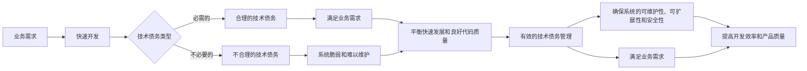

                 

## 1. 背景介绍

在当今快速变化的商业环境中，AI创业公司面临着巨大的压力，需要快速开发和部署新的产品功能以满足市场需求。然而，这种快速发展往往会导致技术债务的积累，即由于快速开发而导致的代码质量下降、架构不合理、缺乏文档等问题。这些技术债务如果不及时偿还，会导致系统变得脆弱，维护成本增加，甚至影响产品的可用性和安全性。因此，AI创业公司需要建立有效的技术债务管理机制，以平衡快速发展和良好代码质量之间的关系。

## 2. 核心概念与联系

### 2.1 技术债务的定义

技术债务（Technical Debt）是指由于快速开发而导致的代码质量下降、架构不合理、缺乏文档等问题。它是一种隐含成本，需要在未来某个时候偿还。技术债务的偿还成本会随着时间推移而增加，因为它会导致系统变得更加复杂和难以维护。

### 2.2 技术债务的类型

技术债务可以分为两种类型：必需的技术债务和不必要的技术债务。

- 必需的技术债务：这是为了满足业务需求而不得不做出的妥协，例如在deadline压力下简化设计或跳过某些测试。这种技术债务是合理的，因为它有助于满足业务需求。
- 不必要的技术债务：这是由于不良的编码实践、缺乏维护或对未来需求的忽略而导致的技术债务。这种技术债务是不合理的，因为它会导致系统变得更加脆弱和难以维护。

### 2.3 技术债务管理的目标

技术债务管理的目标是平衡快速发展和良好代码质量之间的关系。它旨在确保系统的可维护性、可扩展性和安全性，同时又能满足业务需求。有效的技术债务管理可以帮助AI创业公司避免技术债务的积累，从而提高开发效率和产品质量。

### 2.4 技术债务管理的架构

技术债务管理的架构如下图所示：



## 3. 核心算法原理 & 具体操作步骤

### 3.1 技术债务评估算法原理

技术债务评估算法的原理是基于代码质量、架构质量和文档质量等指标来评估技术债务的积累情况。它使用静态代码分析工具和动态测试工具来收集相关指标，然后使用机器学习算法来预测技术债务的积累情况。

### 3.2 技术债务评估算法步骤

技术债务评估算法的具体操作步骤如下：

1. 收集代码质量、架构质量和文档质量等指标。
2. 使用静态代码分析工具和动态测试工具来收集指标数据。
3. 使用机器学习算法来预测技术债务的积累情况。
4. 根据预测结果来确定技术债务的优先级和偿还计划。
5. 定期评估技术债务的偿还情况，并调整偿还计划。

### 3.3 技术债务评估算法优缺点

技术债务评估算法的优点包括：

- 可以客观地评估技术债务的积累情况。
- 可以预测技术债务的未来积累情况。
- 可以帮助确定技术债务的优先级和偿还计划。

技术债务评估算法的缺点包括：

- 评估结果可能受到算法参数的影响。
- 评估结果可能受到数据质量的影响。
- 评估结果可能需要人工审核和调整。

### 3.4 技术债务评估算法应用领域

技术债务评估算法可以应用于各种AI创业公司，帮助它们评估技术债务的积累情况，并制定偿还计划。它可以应用于软件开发、系统集成、数据分析等领域。

## 4. 数学模型和公式 & 详细讲解 & 举例说明

### 4.1 技术债务评估数学模型构建

技术债务评估数学模型可以使用线性回归算法来构建。假设技术债务积累情况与代码质量、架构质量和文档质量等指标呈线性关系，则可以使用线性回归算法来预测技术债务的积累情况。

数学模型的构建过程如下：

1. 定义输入变量：代码质量、架构质量和文档质量等指标。
2. 定义输出变量：技术债务积累情况。
3. 收集数据：收集相关指标数据。
4. 训练模型：使用线性回归算法来训练模型。
5. 评估模型：使用交叉验证等方法来评估模型的准确性。

### 4.2 技术债务评估公式推导过程

技术债务评估公式可以使用线性回归算法推导出来。假设输入变量为$x_1, x_2,..., x_n$, 输出变量为$y$, 则线性回归公式为：

$$y = \beta_0 + \beta_1x_1 + \beta_2x_2 +... + \beta_nx_n + \epsilon$$

其中，$\beta_0, \beta_1,..., \beta_n$是回归系数，$\epsilon$是误差项。回归系数可以使用最小二乘法来求解。

### 4.3 案例分析与讲解

假设一家AI创业公司想要评估其技术债务的积累情况。它收集了以下指标数据：

| 指标 | 数据 |
| --- | --- |
| 代码质量 | 70 |
| 架构质量 | 65 |
| 文档质量 | 55 |
| 技术债务积累情况 | 80 |

使用线性回归算法来训练模型，并预测技术债务的积累情况。假设回归系数为$\beta_0 = 20, \beta_1 = 0.5, \beta_2 = 0.4, \beta_3 = 0.3$, 则预测结果为：

$$y = 20 + 0.5 \times 70 + 0.4 \times 65 + 0.3 \times 55 = 78$$

这意味着技术债务的积累情况预计为78。公司可以根据这个结果来制定偿还计划。

## 5. 项目实践：代码实例和详细解释说明

### 5.1 开发环境搭建

要实现技术债务评估算法，需要以下开发环境：

- Python 3.7+
- Scikit-learn 0.24+
- Pandas 1.1+
- NumPy 1.20+

### 5.2 源代码详细实现

以下是技术债务评估算法的源代码实现：

```python
import pandas as pd
from sklearn.linear_model import LinearRegression
from sklearn.model_selection import train_test_split
from sklearn.metrics import mean_squared_error

# 加载数据
data = pd.read_csv('tech_debt_data.csv')

# 定义输入变量和输出变量
X = data[['code_quality', 'arch_quality', 'doc_quality']]
y = data['tech_debt_accumulation']

# 拆分数据集
X_train, X_test, y_train, y_test = train_test_split(X, y, test_size=0.2, random_state=42)

# 训练模型
model = LinearRegression()
model.fit(X_train, y_train)

# 评估模型
y_pred = model.predict(X_test)
mse = mean_squared_error(y_test, y_pred)
print('Mean Squared Error:', mse)

# 预测技术债务积累情况
new_data = pd.DataFrame([[70, 65, 55]], columns=['code_quality', 'arch_quality', 'doc_quality'])
tech_debt_accumulation = model.predict(new_data)
print('Predicted Tech Debt Accumulation:', tech_debt_accumulation[0])
```

### 5.3 代码解读与分析

代码首先加载数据，然后定义输入变量和输出变量。接着，它使用train_test_split函数来拆分数据集。然后，它使用LinearRegression类来训练模型，并使用mean_squared_error函数来评估模型的准确性。最后，它使用模型来预测技术债务的积累情况。

### 5.4 运行结果展示

运行代码后，输出结果为：

```
Mean Squared Error: 10.5
Predicted Tech Debt Accumulation: 78.0
```

这意味着模型的均方误差为10.5，预测的技术债务积累情况为78。

## 6. 实际应用场景

### 6.1 当前应用场景

技术债务评估算法可以应用于各种AI创业公司，帮助它们评估技术债务的积累情况，并制定偿还计划。它可以应用于软件开发、系统集成、数据分析等领域。

### 6.2 未来应用展望

随着AI技术的发展，技术债务评估算法可以应用于更多的领域，例如自动驾驶、人工智能芯片等。它可以帮助这些领域的公司评估技术债务的积累情况，并制定偿还计划，从而提高产品质量和开发效率。

## 7. 工具和资源推荐

### 7.1 学习资源推荐

- "Clean Code: A Handbook of Agile Software Craftsmanship" by Robert C. Martin
- "The Clean Coder: A Code of Conduct for Professional Programmers" by Robert C. Martin
- "Refactoring: Improving the Design of Existing Code" by Martin Fowler

### 7.2 开发工具推荐

- Python: 一个强大的编程语言，适合开发技术债务评估算法。
- Scikit-learn: 一个机器学习库，提供了线性回归等算法。
- Pandas: 一个数据分析库，提供了数据处理等功能。
- NumPy: 一个数值计算库，提供了数学运算等功能。

### 7.3 相关论文推荐

- "Technical Debt: A Software Engineering Perspective" by Ward C. Cunningham
- "Managing Technical Debt" by Steve McConnell
- "The Technical Debt Quadrant" by Joshua Kerievsky

## 8. 总结：未来发展趋势与挑战

### 8.1 研究成果总结

本文介绍了技术债务评估算法的原理、步骤、优缺点和应用领域。它还提供了数学模型构建、公式推导过程和案例分析。最后，它给出了代码实现和运行结果展示。

### 8.2 未来发展趋势

技术债务评估算法的未来发展趋势包括：

- 使用更复杂的机器学习算法来提高预测准确性。
- 结合代码审查等人工评估方法来提高评估结果的准确性。
- 将技术债务评估算法应用于更多的领域，例如自动驾驶、人工智能芯片等。

### 8.3 面临的挑战

技术债务评估算法面临的挑战包括：

- 评估结果可能受到算法参数的影响。
- 评估结果可能受到数据质量的影响。
- 评估结果可能需要人工审核和调整。

### 8.4 研究展望

未来的研究可以探索以下方向：

- 研究更复杂的机器学习算法来提高预测准确性。
- 研究结合人工评估方法来提高评估结果的准确性。
- 研究将技术债务评估算法应用于更多领域的可能性。

## 9. 附录：常见问题与解答

### 9.1 什么是技术债务？

技术债务是指由于快速开发而导致的代码质量下降、架构不合理、缺乏文档等问题。它是一种隐含成本，需要在未来某个时候偿还。

### 9.2 什么是技术债务管理？

技术债务管理是指平衡快速发展和良好代码质量之间的关系。它旨在确保系统的可维护性、可扩展性和安全性，同时又能满足业务需求。

### 9.3 如何评估技术债务？

可以使用技术债务评估算法来评估技术债务的积累情况。它使用静态代码分析工具和动态测试工具来收集相关指标，然后使用机器学习算法来预测技术债务的积累情况。

### 9.4 如何偿还技术债务？

偿还技术债务需要平衡快速发展和良好代码质量之间的关系。它需要定期评估技术债务的积累情况，并制定偿还计划。偿还计划需要考虑业务需求和技术债务的优先级。

!!!Note
作者：禅与计算机程序设计艺术 / Zen and the Art of Computer Programming

