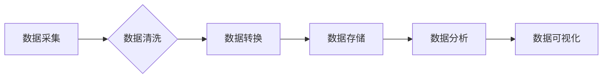

>  人工智能，数据管理，商业模式，数据可视化，机器学习，深度学习，云计算

## 1. 背景介绍

人工智能（AI）正以惊人的速度发展，渗透到各个行业，重塑着商业模式和社会结构。从自动驾驶到个性化推荐，从医疗诊断到金融风险评估，AI技术的应用场景日益广泛。然而，AI创业的成功并非仅仅依赖于先进的算法和技术，更需要对数据管理进行深入思考和规划。数据是AI发展的基石，高质量的数据能够驱动算法的学习和优化，最终转化为商业价值。

## 2. 核心概念与联系

**2.1 数据管理与AI的关系**

数据管理是AI创业的核心环节，它涉及到数据的收集、存储、处理、分析和利用等各个方面。数据管理的质量直接影响着AI模型的性能和商业价值。

**2.2 数据生命周期**

数据的生命周期包括以下几个阶段：

* **数据采集:** 从各种来源收集数据，例如传感器数据、用户行为数据、社会媒体数据等。
* **数据清洗:** 去除数据中的噪声、缺失值和重复数据，确保数据的准确性和完整性。
* **数据转换:** 将数据转换为适合AI模型处理的格式，例如结构化数据、文本数据、图像数据等。
* **数据存储:** 将数据存储在安全可靠的数据库或数据仓库中，方便后续的访问和分析。
* **数据分析:** 使用机器学习、深度学习等算法对数据进行分析，挖掘数据中的潜在价值。
* **数据可视化:** 将数据分析结果以图表、图形等形式呈现，方便用户理解和决策。

**2.3 数据管理架构**

数据管理架构通常包括以下几个组件：

* **数据采集系统:** 用于收集来自不同来源的数据。
* **数据清洗系统:** 用于清洗和预处理数据。
* **数据存储系统:** 用于存储数据，例如关系型数据库、NoSQL数据库、数据湖等。
* **数据分析平台:** 用于进行数据分析和挖掘，例如Hadoop、Spark等。
* **数据可视化工具:** 用于将数据分析结果以图表、图形等形式呈现。

**Mermaid 流程图**



## 3. 核心算法原理 & 具体操作步骤

**3.1 算法原理概述**

机器学习算法是AI的核心技术之一，它能够从数据中学习模式和规律，并根据学习到的知识进行预测或分类。常见的机器学习算法包括：

* **监督学习:** 利用标记数据训练模型，例如分类、回归等。
* **无监督学习:** 利用未标记数据发现数据中的潜在结构，例如聚类、降维等。
* **强化学习:** 通过试错学习，在环境中获得最大奖励。

**3.2 算法步骤详解**

以监督学习为例，其基本步骤如下：

1. **数据准备:** 收集、清洗、转换数据，并将其分为训练集、验证集和测试集。
2. **模型选择:** 根据任务需求选择合适的机器学习算法。
3. **模型训练:** 使用训练集训练模型，调整模型参数，使模型能够准确地预测或分类。
4. **模型评估:** 使用验证集评估模型的性能，选择性能最好的模型。
5. **模型测试:** 使用测试集评估模型的最终性能。
6. **模型部署:** 将训练好的模型部署到生产环境中，用于实际应用。

**3.3 算法优缺点**

不同的机器学习算法具有不同的优缺点，需要根据具体任务需求进行选择。例如，决策树算法易于理解和解释，但泛化能力较弱；支持向量机算法泛化能力强，但训练时间较长。

**3.4 算法应用领域**

机器学习算法广泛应用于各个领域，例如：

* **图像识别:** 自动识别图像中的物体、场景等。
* **自然语言处理:** 处理和理解自然语言文本，例如机器翻译、文本摘要等。
* **推荐系统:** 根据用户的历史行为推荐感兴趣的内容。
* **预测分析:** 预测未来事件的发生概率，例如销售预测、风险评估等。

## 4. 数学模型和公式 & 详细讲解 & 举例说明

**4.1 数学模型构建**

机器学习算法通常基于数学模型进行构建，例如线性回归模型、逻辑回归模型、神经网络模型等。这些模型通过数学公式来描述数据之间的关系，并利用算法进行参数优化，最终实现预测或分类的目标。

**4.2 公式推导过程**

以线性回归模型为例，其目标是找到一条直线，能够最佳地拟合数据点。线性回归模型的数学公式如下：

$$y = wx + b$$

其中：

* $y$ 是预测值
* $x$ 是输入特征
* $w$ 是权重参数
* $b$ 是偏置参数

**4.3 案例分析与讲解**

假设我们有一组数据，包含房屋面积和房屋价格的信息。我们可以使用线性回归模型来预测房屋价格。

* 训练数据：

| 房屋面积 (平方米) | 房屋价格 (万元) |
|---|---|
| 60 | 100 |
| 80 | 150 |
| 100 | 200 |
| 120 | 250 |

* 使用线性回归模型训练数据，得到模型参数 $w$ 和 $b$。
* 将新的房屋面积输入模型，得到预测的房屋价格。

## 5. 项目实践：代码实例和详细解释说明

**5.1 开发环境搭建**

* Python 3.x
* Jupyter Notebook
* scikit-learn

**5.2 源代码详细实现**

```python
import pandas as pd
from sklearn.linear_model import LinearRegression
from sklearn.model_selection import train_test_split

# 加载数据
data = pd.read_csv('house_data.csv')

# 分割数据
X = data[['面积']]
y = data['价格']
X_train, X_test, y_train, y_test = train_test_split(X, y, test_size=0.2, random_state=42)

# 创建线性回归模型
model = LinearRegression()

# 训练模型
model.fit(X_train, y_train)

# 预测测试数据
y_pred = model.predict(X_test)

# 评估模型性能
print('模型系数:', model.coef_)
print('模型截距:', model.intercept_)
```

**5.3 代码解读与分析**

* 首先，我们使用 pandas 库加载数据，并使用 scikit-learn 库的 train_test_split 函数将数据分割成训练集和测试集。
* 然后，我们创建线性回归模型，并使用 fit 函数训练模型。
* 最后，我们使用 predict 函数预测测试数据，并使用模型系数和截距来评估模型性能。

**5.4 运行结果展示**

运行代码后，会输出模型系数和截距，以及预测结果。

## 6. 实际应用场景

**6.1 商业模式创新**

数据管理可以帮助AI创业公司创新商业模式，例如：

* **个性化推荐:** 利用用户行为数据，为用户提供个性化的产品或服务推荐。
* **精准营销:** 利用用户画像数据，精准地进行营销推广。
* **智能客服:** 利用自然语言处理技术，提供智能化的客服服务。

**6.2 运营效率提升**

数据管理可以帮助AI创业公司提升运营效率，例如：

* **数据分析:** 利用数据分析工具，挖掘数据中的潜在价值，优化运营策略。
* **自动化流程:** 利用AI技术，自动化完成一些重复性的工作，提高工作效率。
* **风险控制:** 利用数据分析，识别潜在的风险，并采取相应的措施进行控制。

**6.3 产品研发加速**

数据管理可以帮助AI创业公司加速产品研发，例如：

* **用户反馈分析:** 利用用户反馈数据，改进产品功能和体验。
* **市场趋势分析:** 利用市场数据，了解用户需求和市场趋势，开发新的产品。
* **产品测试:** 利用数据模拟，进行产品测试和验证。

**6.4 未来应用展望**

随着人工智能技术的不断发展，数据管理在AI创业中的作用将更加重要。未来，数据管理将更加智能化、自动化和可视化，能够更好地支持AI创业公司的发展。

## 7. 工具和资源推荐

**7.1 学习资源推荐**

* **书籍:**
    * 《数据科学实战》
    * 《机器学习实战》
    * 《深度学习》
* **在线课程:**
    * Coursera
    * edX
    * Udacity

**7.2 开发工具推荐**

* **Python:** 
    * pandas
    * scikit-learn
    * TensorFlow
    * PyTorch
* **数据库:**
    * MySQL
    * PostgreSQL
    * MongoDB

**7.3 相关论文推荐**

* 《Attention Is All You Need》
* 《Deep Learning》
* 《Generative Adversarial Networks》

## 8. 总结：未来发展趋势与挑战

**8.1 研究成果总结**

数据管理在AI创业中扮演着越来越重要的角色，它能够帮助AI创业公司创新商业模式、提升运营效率、加速产品研发。

**8.2 未来发展趋势**

未来，数据管理将更加智能化、自动化和可视化，能够更好地支持AI创业公司的发展。

* **数据智能化:** 利用人工智能技术，自动完成数据清洗、转换和分析等任务。
* **数据自动化:** 利用自动化工具，实现数据管理流程的自动化。
* **数据可视化:** 利用数据可视化工具，将数据分析结果以图表、图形等形式呈现，方便用户理解和决策。

**8.3 面临的挑战**

数据管理在AI创业中也面临着一些挑战，例如：

* **数据质量问题:** 数据的准确性、完整性和一致性是数据管理的关键问题。
* **数据安全问题:** 数据的隐私和安全需要得到保障。
* **数据成本问题:** 数据的采集、存储和分析都需要一定的成本投入。

**8.4 研究展望**

未来，我们需要继续研究和探索数据管理在AI创业中的应用，解决数据管理面临的挑战，推动数据管理技术的发展。

## 9. 附录：常见问题与解答

**9.1 如何保证数据质量？**

数据质量可以通过以下措施来保证：

* 数据采集时，要确保数据来源可靠，数据格式规范。
* 数据清洗时，要使用合适的算法和工具，去除数据中的噪声、缺失值和重复数据。
* 数据转换时，要确保数据格式转换正确，数据类型一致。

**9.2 如何保护数据安全？**

数据安全可以通过以下措施来保护：

* 使用加密技术，保护数据的传输和存储安全。
* 设置访问权限控制，限制对数据的访问范围。
* 定期进行数据备份，防止数据丢失。

**9.3 数据管理的成本如何控制？**

数据管理的成本可以通过以下措施来控制：

* 选择合适的数据库和数据存储方案，降低存储成本。
* 使用开源工具和平台，降低软件成本。
* 优化数据管理流程，提高效率，降低人力成本。


作者：禅与计算机程序设计艺术 / Zen and the Art of Computer Programming 
<end_of_turn>