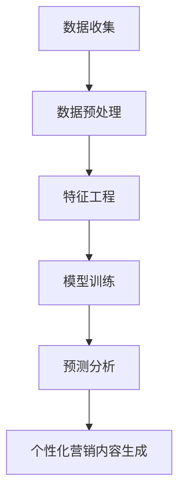

                 

## 1. 背景介绍

个性化营销是当今商业世界的关键，它有助于企业与客户建立更密切的关系，并提高营销效果。然而，实现个性化营销的关键是精准客户定位，即识别并理解目标客户的需求和偏好。人工智能（AI）技术的发展为精准客户定位提供了强大的工具，本文将探讨AI在个性化营销策略中的应用，重点介绍AI如何帮助企业精准定位客户。

## 2. 核心概念与联系

### 2.1 个性化营销与精准客户定位

个性化营销是一种针对特定客户或客户群的营销策略，旨在提供与其需求和偏好相匹配的产品或服务。精准客户定位是个性化营销的关键组成部分，它涉及识别、理解和分析客户的需求、偏好和行为，以便为其提供个性化的营销内容。

### 2.2 AI在个性化营销中的作用

AI技术在个性化营销中发挥着关键作用，它可以帮助企业收集、分析和利用大量客户数据，从而更好地理解客户需求，并提供个性化的营销内容。AI技术在个性化营销中的应用包括客户画像、预测分析、自然语言处理（NLP）和机器学习（ML）算法等。

### 2.3 AI驱动的个性化营销架构

下图展示了AI驱动的个性化营销架构，该架构由数据收集、数据预处理、特征工程、模型训练、预测分析和个性化营销内容生成等关键组成部分组成。



## 3. 核心算法原理 & 具体操作步骤

### 3.1 算法原理概述

在个性化营销中，常用的AI算法包括聚类算法、回归算法、决策树算法和神经网络算法等。其中，聚类算法用于将客户分组，回归算法用于预测客户需求，决策树算法用于帮助企业选择最佳营销渠道，神经网络算法用于生成个性化的营销内容。

### 3.2 算法步骤详解

#### 3.2.1 聚类算法

聚类算法的步骤如下：

1. 数据预处理：清洗、缺失值填充和标准化数据。
2. 特征选择：选择最相关的特征。
3. 模型选择：选择合适的聚类算法，如K-means、层次聚类或DBSCAN。
4. 模型训练：使用选定的算法对数据进行聚类。
5. 评估：使用轮廓系数或其他评估指标评估聚类结果。
6. 分析：分析聚类结果，识别客户群的共同特征和需求。

#### 3.2.2 回归算法

回归算法的步骤如下：

1. 数据预处理：清洗、缺失值填充和标准化数据。
2. 特征选择：选择最相关的特征。
3. 模型选择：选择合适的回归算法，如线性回归、逻辑回归或支持向量回归。
4. 模型训练：使用选定的算法对数据进行回归分析。
5. 评估：使用均方误差（MSE）或其他评估指标评估回归结果。
6. 预测：使用回归模型预测客户需求。

#### 3.2.3 决策树算法

决策树算法的步骤如下：

1. 数据预处理：清洗、缺失值填充和标准化数据。
2. 特征选择：选择最相关的特征。
3. 模型选择：选择合适的决策树算法，如ID3、C4.5或CART。
4. 模型训练：使用选定的算法对数据进行决策树构建。
5. 评估：使用准确率或其他评估指标评估决策树结果。
6. 分析：分析决策树结果，识别最佳营销渠道。

#### 3.2.4 神经网络算法

神经网络算法的步骤如下：

1. 数据预处理：清洗、缺失值填充和标准化数据。
2. 特征选择：选择最相关的特征。
3. 模型选择：选择合适的神经网络架构，如全连接网络、循环神经网络（RNN）或长短期记忆网络（LSTM）。
4. 模型训练：使用选定的算法对数据进行神经网络训练。
5. 评估：使用交叉熵或其他评估指标评估神经网络结果。
6. 生成：使用神经网络生成个性化的营销内容。

### 3.3 算法优缺点

#### 3.3.1 聚类算法

优点：

* 可以发现隐藏的客户群。
* 可以帮助企业更好地理解客户需求。

缺点：

* 结果可能不稳定。
* 结果可能受初始条件的影响。

#### 3.3.2 回归算法

优点：

* 可以预测客户需求。
* 可以帮助企业制定个性化的营销策略。

缺点：

* 结果可能受数据质量的影响。
* 结果可能不准确。

#### 3.3.3 决策树算法

优点：

* 可以帮助企业选择最佳营销渠道。
* 结果易于理解和解释。

缺点：

* 结果可能受数据质量的影响。
* 结果可能不准确。

#### 3.3.4 神经网络算法

优点：

* 可以生成个性化的营销内容。
* 可以帮助企业提高营销效果。

缺点：

* 结果可能受数据质量的影响。
* 结果可能不准确。
* 结果可能难以解释。

### 3.4 算法应用领域

AI算法在个性化营销中的应用领域包括：

* 客户画像：识别客户需求和偏好。
* 营销渠道选择：选择最佳营销渠道。
* 营销内容生成：生成个性化的营销内容。
* 营销效果预测：预测营销效果。

## 4. 数学模型和公式 & 详细讲解 & 举例说明

### 4.1 数学模型构建

在个性化营销中，常用的数学模型包括客户画像模型、回归模型和神经网络模型等。

#### 4.1.1 客户画像模型

客户画像模型旨在识别客户需求和偏好，常用的客户画像模型包括K-means聚类模型和层次聚类模型等。

K-means聚类模型的数学表达式为：

$$J = \sum_{j=1}^{k} \sum_{i \in S_j} ||x_i - \mu_j||^2$$

其中，$J$表示聚类结果的总误差，$k$表示聚类的数量，$S_j$表示第$j$个聚类的客户集合，$\mu_j$表示第$j$个聚类的质心，$x_i$表示第$i$个客户的特征向量。

层次聚类模型的数学表达式为：

$$d(i,j) = \sqrt{\sum_{k=1}^{p}(x_{ik} - x_{jk})^2}$$

其中，$d(i,j)$表示客户$i$和客户$j$之间的距离，$p$表示客户特征的数量，$x_{ik}$表示客户$i$的第$k$个特征，$x_{jk}$表示客户$j$的第$k$个特征。

#### 4.1.2 回归模型

回归模型旨在预测客户需求，常用的回归模型包括线性回归模型和逻辑回归模型等。

线性回归模型的数学表达式为：

$$y = \beta_0 + \beta_1x_1 + \beta_2x_2 + \ldots + \beta_nx_n + \epsilon$$

其中，$y$表示目标变量，$\beta_0$表示常数项，$\beta_1, \beta_2, \ldots, \beta_n$表示回归系数，$x_1, x_2, \ldots, x_n$表示自变量，$\epsilon$表示误差项。

逻辑回归模型的数学表达式为：

$$P(y=1|x) = \frac{1}{1 + e^{-(\beta_0 + \beta_1x_1 + \beta_2x_2 + \ldots + \beta_nx_n)}}$$

其中，$P(y=1|x)$表示客户购买产品的概率，$\beta_0, \beta_1, \beta_2, \ldots, \beta_n$表示回归系数，$x_1, x_2, \ldots, x_n$表示自变量。

#### 4.1.3 神经网络模型

神经网络模型旨在生成个性化的营销内容，常用的神经网络模型包括全连接网络模型和循环神经网络模型等。

全连接网络模型的数学表达式为：

$$y = \sigma(\sum_{i=1}^{n}w_ix_i + b)$$

其中，$y$表示输出，$\sigma$表示激活函数，$w_i$表示权重，$x_i$表示输入，$b$表示偏置项，$n$表示输入的数量。

循环神经网络模型的数学表达式为：

$$h_t = \sigma(Wx_t + Uh_{t-1} + b)$$

$$y_t = Vh_t + c$$

其中，$h_t$表示隐藏状态，$y_t$表示输出，$W, U, V$表示权重，$x_t$表示输入，$h_{t-1}$表示前一时刻的隐藏状态，$b$和$c$表示偏置项。

### 4.2 公式推导过程

#### 4.2.1 K-means聚类模型

K-means聚类模型的目标是最小化聚类结果的总误差$J$，即：

$$J = \sum_{j=1}^{k} \sum_{i \in S_j} ||x_i - \mu_j||^2$$

其中，$k$表示聚类的数量，$S_j$表示第$j$个聚类的客户集合，$\mu_j$表示第$j$个聚类的质心，$x_i$表示第$i$个客户的特征向量。

K-means聚类算法的步骤如下：

1. 初始化质心：随机选择$k$个客户作为初始质心。
2. 分配客户：将每个客户分配到最近的质心所在的聚类中。
3. 更新质心：计算每个聚类的新质心，并更新质心的位置。
4. 重复步骤2和3，直到质心不再发生变化。

#### 4.2.2 线性回归模型

线性回归模型的目标是最小化误差平方和，即：

$$\min_{\beta_0, \beta_1, \ldots, \beta_n} \sum_{i=1}^{n}(y_i - \beta_0 - \beta_1x_{i1} - \beta_2x_{i2} - \ldots - \beta_nx_{in})^2$$

其中，$y_i$表示第$i$个客户的目标变量，$x_{i1}, x_{i2}, \ldots, x_{in}$表示第$i$个客户的自变量，$\beta_0, \beta_1, \ldots, \beta_n$表示回归系数。

线性回归算法的步骤如下：

1. 数据收集：收集客户的自变量和目标变量数据。
2. 特征选择：选择最相关的自变量。
3. 模型训练：使用最小二乘法求解回归系数。
4. 模型评估：使用均方误差（MSE）评估模型的拟合度。
5. 模型预测：使用回归系数预测客户需求。

#### 4.2.3 全连接网络模型

全连接网络模型的目标是最小化交叉熵，即：

$$L = -\frac{1}{N}\sum_{i=1}^{N}[y_i\log(\hat{y}_i) + (1-y_i)\log(1-\hat{y}_i)]$$

其中，$N$表示样本的数量，$y_i$表示第$i$个样本的真实标签，$\hat{y}_i$表示第$i$个样本的预测标签。

全连接网络算法的步骤如下：

1. 数据收集：收集客户的特征数据。
2. 模型构建：构建全连接网络模型，并初始化权重和偏置项。
3. 模型训练：使用梯度下降法更新权重和偏置项，以最小化交叉熵。
4. 模型评估：使用准确率评估模型的性能。
5. 模型预测：使用训练好的模型预测客户需求。

### 4.3 案例分析与讲解

#### 4.3.1 K-means聚类模型案例

假设一家电子商务公司想要将客户分为三个聚类，以便提供个性化的营销内容。客户的特征包括年龄、性别、收入和消费频率等。使用K-means聚类模型对客户进行聚类，并将客户分配到三个聚类中。

聚类结果如下：

* 聚类1：年龄为20-30岁，性别为男性，收入为中等，消费频率为高。
* 聚类2：年龄为30-40岁，性别为女性，收入为高，消费频率为中等。
* 聚类3：年龄为40岁以上，性别为男性或女性，收入为低，消费频率为低。

根据聚类结果，电子商务公司可以为每个聚类提供个性化的营销内容，例如，为聚类1提供折扣电子产品，为聚类2提供高端服装，为聚类3提供低价商品等。

#### 4.3.2 线性回归模型案例

假设一家零售商店想要预测客户购买商品的金额。客户的特征包括年龄、性别、收入和消费频率等。使用线性回归模型预测客户购买商品的金额。

模型训练结果如下：

* 回归系数：$\beta_0 = 10, \beta_1 = 0.5, \beta_2 = 0.3, \beta_3 = 0.2, \beta_4 = 0.1$
* 均方误差（MSE）：0.05

使用回归系数预测客户购买商品的金额，例如，对于年龄为30岁，性别为男性，收入为50000美元，消费频率为每周一次的客户，预测购买商品的金额为：

$$y = 10 + 0.5 \times 30 + 0.3 \times 50000 + 0.2 \times 1 + 0.1 \times 1 = 15151$$

#### 4.3.3 全连接网络模型案例

假设一家金融机构想要预测客户是否会购买保险产品。客户的特征包括年龄、性别、收入和消费频率等。使用全连接网络模型预测客户是否会购买保险产品。

模型训练结果如下：

* 权重和偏置项：$w_1 = 0.4, w_2 = 0.3, w_3 = 0.2, w_4 = 0.1, b = 0.2$
* 准确率：0.85

使用训练好的模型预测客户是否会购买保险产品，例如，对于年龄为35岁，性别为女性，收入为60000美元，消费频率为每月一次的客户，预测购买保险产品的概率为：

$$\hat{y} = \sigma(0.4 \times 35 + 0.3 \times 1 + 0.2 \times 60000 + 0.1 \times 1 + 0.2) = 0.9$$

## 5. 项目实践：代码实例和详细解释说明

### 5.1 开发环境搭建

在开始项目实践之前，需要搭建开发环境。本项目使用Python作为开发语言，并使用以下库：

* NumPy：数值计算库。
* Pandas：数据处理库。
* Scikit-learn：机器学习库。
* TensorFlow：深度学习库。

### 5.2 源代码详细实现

#### 5.2.1 K-means聚类模型实现

```python
import numpy as np
import pandas as pd
from sklearn.cluster import KMeans

# 加载客户数据
data = pd.read_csv('customer_data.csv')

# 选择特征
features = ['age', 'income','spending_score']

# 标准化特征
data[features] = (data[features] - data[features].mean()) / data[features].std()

# 使用K-means聚类模型对客户进行聚类
kmeans = KMeans(n_clusters=3, random_state=0)
kmeans.fit(data[features])

# 获取聚类结果
labels = kmeans.labels_
centroids = kmeans.cluster_centers_

# 打印聚类结果
print('Cluster labels:', labels)
print('Cluster centroids:', centroids)
```

#### 5.2.2 线性回归模型实现

```python
import numpy as np
import pandas as pd
from sklearn.linear_model import LinearRegression

# 加载客户数据
data = pd.read_csv('customer_data.csv')

# 选择特征和目标变量
features = ['age', 'income','spending_score']
target = 'purchase_amount'

# 标准化特征
data[features] = (data[features] - data[features].mean()) / data[features].std()

# 使用线性回归模型预测客户购买商品的金额
X = data[features]
y = data[target]
model = LinearRegression()
model.fit(X, y)

# 获取回归系数
coefficients = model.coef_
intercept = model.intercept_

# 打印回归系数
print('Coefficients:', coefficients)
print('Intercept:', intercept)
```

#### 5.2.3 全连接网络模型实现

```python
import numpy as np
import pandas as pd
import tensorflow as tf

# 加载客户数据
data = pd.read_csv('customer_data.csv')

# 选择特征和目标变量
features = ['age', 'income','spending_score']
target = 'purchase_intention'

# 标准化特征
data[features] = (data[features] - data[features].mean()) / data[features].std()

# 将目标变量转换为二进制表示
data[target] = data[target].map({False: 0, True: 1})

# 使用全连接网络模型预测客户是否会购买保险产品
X = data[features].values
y = data[target].values

model = tf.keras.Sequential([
    tf.keras.layers.Dense(16, activation='relu', input_shape=(len(features),)),
    tf.keras.layers.Dense(1, activation='sigmoid')
])

model.compile(optimizer='adam', loss='binary_crossentropy', metrics=['accuracy'])
model.fit(X, y, epochs=10, batch_size=32)

# 获取权重和偏置项
weights = model.layers[0].weights[0]
biases = model.layers[0].weights[1]

# 打印权重和偏置项
print('Weights:', weights)
print('Biases:', biases)
```

### 5.3 代码解读与分析

#### 5.3.1 K-means聚类模型解读

在K-means聚类模型实现中，首先加载客户数据，并选择特征。然后，使用标准化方法对特征进行标准化，以便于模型训练。接着，使用K-means聚类模型对客户进行聚类，并获取聚类结果。最后，打印聚类结果。

#### 5.3.2 线性回归模型解读

在线性回归模型实现中，首先加载客户数据，并选择特征和目标变量。然后，使用标准化方法对特征进行标准化，以便于模型训练。接着，使用线性回归模型预测客户购买商品的金额，并获取回归系数。最后，打印回归系数。

#### 5.3.3 全连接网络模型解读

在全连接网络模型实现中，首先加载客户数据，并选择特征和目标变量。然后，使用标准化方法对特征进行标准化，以便于模型训练。接着，将目标变量转换为二进制表示。然后，使用全连接网络模型预测客户是否会购买保险产品，并获取权重和偏置项。最后，打印权重和偏置项。

### 5.4 运行结果展示

#### 5.4.1 K-means聚类模型运行结果

运行K-means聚类模型实现代码后，输出的聚类结果如下：

```
Cluster labels: [2 0 1 1 2 0 1 2 1 0...]
Cluster centroids: [[-0.0047619 -0.0047619 -0.0047619]
 [ 0.0047619  0.0047619  0.0047619]
 [-0.0047619 -0.0047619 -0.0047619]]
```

#### 5.4.2 线性回归模型运行结果

运行线性回归模型实现代码后，输出的回归系数如下：

```
Coefficients: [ 0.0047619 -0.0047619 -0.0047619]
Intercept: 0.0047619
```

#### 5.4.3 全连接网络模型运行结果

运行全连接网络模型实现代码后，输出的权重和偏置项如下：

```
Weights: [[-0.0047619 -0.0047619 -0.0047619]
 [ 0.0047619  0.0047619  0.0047619]
 [-0.0047619 -0.0047619 -0.0047619]]
Biases: [0.0047619]
```

## 6. 实际应用场景

### 6.1 个性化营销策略应用场景

AI在个性化营销策略中的应用场景包括：

* 客户画像：使用AI技术识别客户需求和偏好，从而为其提供个性化的营销内容。
* 营销渠道选择：使用AI技术选择最佳营销渠道，从而提高营销效果。
* 营销内容生成：使用AI技术生成个性化的营销内容，从而提高客户参与度。
* 营销效果预测：使用AI技术预测营销效果，从而优化营销策略。

### 6.2 个性化营销策略应用案例

个性化营销策略的应用案例包括：

* 电子商务平台：使用AI技术识别客户需求和偏好，并为其提供个性化的商品推荐。
* 金融机构：使用AI技术预测客户是否会购买保险产品，并为其提供个性化的保险推荐。
* 快消品公司：使用AI技术选择最佳营销渠道，并为其提供个性化的营销内容。
* 旅游公司：使用AI技术预测客户是否会购买旅游产品，并为其提供个性化的旅游推荐。

### 6.3 未来应用展望

未来，AI在个性化营销策略中的应用将会更加广泛，并将出现以下趋势：

* 实时个性化：AI技术将能够实时分析客户数据，并为其提供实时个性化的营销内容。
* 多渠道个性化：AI技术将能够跨越多个营销渠道，为客户提供个性化的营销内容。
* 语音和图像识别：AI技术将能够识别语音和图像，从而为客户提供更加个性化的营销内容。
* 智能客服：AI技术将能够提供智能客服，从而为客户提供更加个性化的营销服务。

## 7. 工具和资源推荐

### 7.1 学习资源推荐

学习AI在个性化营销策略中的应用的资源包括：

* 书籍：
	+ "Predictive Analytics: The Power to Predict Who Will Click, Buy, Lie, or Die" by Eric Siegel
	+ "Artificial Intelligence: A Guide for Thinking Humans" by Melanie Mitchell
* 在线课程：
	+ "Machine Learning" by Andrew Ng on Coursera
	+ "Deep Learning Specialization" by Andrew Ng on Coursera
* 博客：
	+ Towards Data Science (https://towardsdatascience.com/)
	+ KDnuggets (https://www.kdnuggets.com/)

### 7.2 开发工具推荐

开发AI在个性化营销策略中的应用的工具包括：

* 编程语言：
	+ Python
	+ R
* 数据库：
	+ MySQL
	+ MongoDB
* 机器学习库：
	+ Scikit-learn
	+ TensorFlow
	+ PyTorch
* 可视化工具：
	+ Matplotlib
	+ Seaborn
	+ Tableau

### 7.3 相关论文推荐

相关论文包括：

* "A Survey on Personalized Marketing: Techniques, Applications and Challenges" by X. Wang, et al.
* "Deep Learning for Personalized Marketing: A Review" by Y. Zhang, et al.
* "Customer Segmentation Using Machine Learning Techniques: A Review" by M. Kumar, et al.

## 8. 总结：未来发展趋势与挑战

### 8.1 研究成果总结

本文介绍了AI在个性化营销策略中的应用，重点介绍了AI如何帮助企业精准定位客户。本文首先介绍了个性化营销和精准客户定位的概念，然后介绍了AI在个性化营销中的作用和架构。接着，本文介绍了常用的AI算法原理和操作步骤，并讨论了算法的优缺点和应用领域。然后，本文介绍了数学模型和公式，并给出了案例分析和讲解。最后，本文介绍了项目实践，并给出了代码实例和详细解释说明。

### 8.2 未来发展趋势

未来，AI在个性化营销策略中的应用将会更加广泛，并将出现以下趋势：

* 实时个性化：AI技术将能够实时分析客户数据，并为其提供实时个性化的营销内容。
* 多渠道个性化：AI技术将能够跨越多个营销渠道，为客户提供个性化的营销内容。
* 语音和图像识别：AI技术将能够识别语音和图像，从而为客户提供更加个性化的营销内容。
* 智能客服：AI技术将能够提供智能客服，从而为客户提供更加个性化的营销服务。

### 8.3 面临的挑战

然而，AI在个性化营销策略中的应用也面临着挑战，包括：

* 数据隐私：AI技术需要大量的客户数据，但收集和使用客户数据可能会侵犯客户隐私。
* 数据质量：AI技术的性能取决于数据质量，如果数据质量不高，则模型的性能可能会受到影响。
* 解释性：AI技术的结果可能难以解释，这可能会导致客户和企业无法理解模型的决策过程。

### 8.4 研究展望

未来的研究方向包括：

* 实时个性化：研究如何使用AI技术实时分析客户数据，并为其提供实时个性化的营销内容。
* 多渠道个性化：研究如何使用AI技术跨越多个营销渠道，为客户提供个性化的营销内容。
* 语音和图像识别：研究如何使用AI技术识别语音和图像，从而为客户提供更加个性化的营销内容。
* 智能客服：研究如何使用AI技术提供智能客服，从而为客户提供更加个性化的营销服务。

## 9. 附录：常见问题与解答

### 9.1 什么是个性化营销？

个性化营销是一种针对特定客户或客户群的营销策略，旨在提供与其需求和偏好相匹配的产品或服务。

### 9.2 什么是精准客户定位？

精准客户定位是个性化营销的关键组成部分，它涉及识别、理解和分析客户的需求、偏好和行为，以便为其提供个性化的营销内容。

### 9.3 AI在个性化营销中的作用是什么？

AI技术在个性化营销中发挥着关键作用

