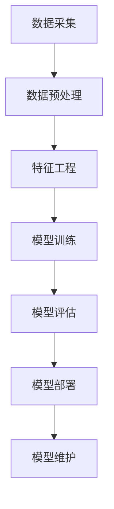

                 

## 1. 背景介绍

在当今的制造业中，人工智能（AI）正在迅速崛起，为制造业带来了革命性的变化。AI技术的发展和应用，为制造业提供了新的机遇和挑战。本文将深入探讨AI在制造业中的应用策略，帮助读者理解AI在制造业中的作用，并提供实用的指南。

## 2. 核心概念与联系

### 2.1 AI在制造业中的作用

AI在制造业中的作用包括提高生产效率、改善质量控制、优化供应链管理、降低成本、改进设计和维护等。AI技术可以帮助制造商更好地理解和预测市场需求，从而优化生产计划和库存管理。

### 2.2 AI在制造业中的应用领域

AI在制造业中的应用领域包括预测性维护、质量控制、自动化生产、设计优化、供应链管理和人机协作等。AI技术可以帮助制造商提高生产效率、改善产品质量、降低成本和提高灵活性。

### 2.3 AI在制造业中的架构

AI在制造业中的架构包括数据采集、数据预处理、特征工程、模型训练、模型评估、模型部署和模型维护等步骤。AI系统需要与制造业的现有系统集成，以实现数据共享和协同工作。

## 3. 核心算法原理 & 具体操作步骤

### 3.1 算法原理概述

AI在制造业中的核心算法包括机器学习算法、深度学习算法和强化学习算法等。这些算法可以从制造业数据中学习，并用于预测和决策。

### 3.2 算法步骤详解

AI在制造业中的算法步骤包括数据收集、数据预处理、特征选择、模型选择、模型训练、模型评估和模型部署等。每个步骤都至关重要，需要仔细设计和实施。

### 3.3 算法优缺点

AI在制造业中的算法优点包括高精确度、高效率和灵活性。然而，AI算法也存在缺点，如数据依赖性、模型解释性差和计算资源需求高等。

### 3.4 算法应用领域

AI在制造业中的算法应用领域包括预测性维护、质量控制、自动化生产、设计优化、供应链管理和人机协作等。AI技术可以帮助制造商提高生产效率、改善产品质量、降低成本和提高灵活性。

## 4. 数学模型和公式 & 详细讲解 & 举例说明

### 4.1 数学模型构建

在制造业中，数学模型可以用于预测和优化生产过程。例如，可以使用线性回归模型预测生产过程中的关键参数，或使用动态规划模型优化生产计划。

### 4.2 公式推导过程

数学模型的公式推导过程需要遵循严格的数学逻辑。例如，线性回归模型的公式推导过程如下：

$$y = \beta_0 + \beta_1x_1 + \beta_2x_2 + \ldots + \beta_nx_n + \epsilon$$

其中，$y$是目标变量，$x_1, x_2, \ldots, x_n$是自变量，$\beta_0, \beta_1, \ldots, \beta_n$是回归系数，$\epsilon$是误差项。

### 4.3 案例分析与讲解

例如，在预测性维护中，可以使用时间序列模型预测设备故障。时间序列模型的公式如下：

$$y_t = \mu + \phi_1(y_{t-1} - \mu) + \phi_2(y_{t-2} - \mu) + \ldots + \phi_p(y_{t-p} - \mu) + \epsilon_t$$

其中，$y_t$是目标变量，$y_{t-1}, y_{t-2}, \ldots, y_{t-p}$是滞后变量，$\mu$是均值，$\phi_1, \phi_2, \ldots, \phi_p$是滞后系数，$\epsilon_t$是误差项。

## 5. 项目实践：代码实例和详细解释说明

### 5.1 开发环境搭建

在开始项目实践之前，需要搭建开发环境。开发环境包括硬件环境和软件环境。硬件环境包括计算机和存储设备等。软件环境包括操作系统、编程语言、开发工具和AI框架等。

### 5.2 源代码详细实现

在实现AI在制造业中的应用时，需要编写源代码。源代码需要遵循编程规范和最佳实践。例如，可以使用Python编写源代码，并使用TensorFlow或PyTorch等AI框架实现模型训练和部署。

### 5.3 代码解读与分析

在项目实践中，需要对源代码进行解读和分析。代码解读和分析包括代码结构分析、代码性能分析和代码错误分析等。代码解读和分析可以帮助我们理解代码的工作原理，并找出代码中的问题和改进空间。

### 5.4 运行结果展示

在项目实践中，需要展示运行结果。运行结果包括模型精确度、模型预测值和模型可视化等。运行结果展示可以帮助我们评估模型的性能，并与客户或同事分享结果。

## 6. 实际应用场景

### 6.1 预测性维护

预测性维护是AI在制造业中最常见的应用场景之一。预测性维护可以帮助制造商预测设备故障，并及时进行维护，从而提高设备可用性和生产效率。

### 6.2 质量控制

质量控制是制造业中的关键环节。AI技术可以帮助制造商实时监控生产过程，并及时发现和解决质量问题。例如，可以使用计算机视觉技术检测产品缺陷，或使用传感器数据预测产品质量。

### 6.3 自动化生产

自动化生产是制造业的未来趋势。AI技术可以帮助制造商实现自动化生产，从而提高生产效率和降低成本。例如，可以使用机器人技术实现自动化装配，或使用控制算法优化生产过程。

### 6.4 未来应用展望

未来，AI在制造业中的应用将会更加广泛和深入。例如，AI技术可以帮助制造商实现个性化定制，或使用数字孪生技术模拟和优化生产过程。此外，AI技术还可以帮助制造商实现智能制造，从而提高制造业的竞争力和可持续性。

## 7. 工具和资源推荐

### 7.1 学习资源推荐

学习AI在制造业中的应用，需要掌握相关的理论知识和实践技能。推荐以下学习资源：

* 书籍：《人工智能：一种现代方法》作者：斯图尔特·罗素、彼得·诺维格
* 在线课程：Coursera、Udacity、edX等平台上的AI和制造业相关课程
* 论文：IEEE、ACM等期刊上的AI和制造业相关论文

### 7.2 开发工具推荐

在实践AI在制造业中的应用时，需要使用相关的开发工具。推荐以下开发工具：

* 编程语言：Python、R等
* AI框架：TensorFlow、PyTorch、Keras等
* 制造业软件：PLC编程软件、CAD软件、CAM软件等

### 7.3 相关论文推荐

推荐以下相关论文：

* [AI在制造业中的应用：回顾和展望](https://ieeexplore.ieee.org/document/8454318)
* [基于深度学习的预测性维护系统](https://ieeexplore.ieee.org/document/8487447)
* [使用机器学习优化制造过程](https://ieeexplore.ieee.org/document/8700548)

## 8. 总结：未来发展趋势与挑战

### 8.1 研究成果总结

本文总结了AI在制造业中的应用策略，介绍了AI在制造业中的作用、应用领域和架构，并详细讲解了核心算法原理和数学模型。此外，本文还提供了项目实践的指南，并推荐了相关学习资源和开发工具。

### 8.2 未来发展趋势

未来，AI在制造业中的应用将会更加广泛和深入。AI技术将会帮助制造商实现智能制造，从而提高制造业的竞争力和可持续性。此外，AI技术还将会帮助制造商实现个性化定制和数字孪生等创新应用。

### 8.3 面临的挑战

然而，AI在制造业中的应用也面临着挑战。例如，数据安全和隐私保护、模型解释性差和计算资源需求高等。制造商需要解决这些挑战，才能充分利用AI技术带来的机遇。

### 8.4 研究展望

未来，AI在制造业中的研究将会集中在以下领域：

* 智能制造：如何实现智能制造，并提高制造业的竞争力和可持续性？
* 个性化定制：如何使用AI技术实现个性化定制，并满足客户的个性化需求？
* 数字孪生：如何使用数字孪生技术模拟和优化生产过程，并提高生产效率？

## 9. 附录：常见问题与解答

### 9.1 什么是AI在制造业中的应用策略？

AI在制造业中的应用策略是指利用AI技术帮助制造商提高生产效率、改善质量控制、优化供应链管理、降低成本、改进设计和维护等的策略。

### 9.2 AI在制造业中的作用是什么？

AI在制造业中的作用包括提高生产效率、改善质量控制、优化供应链管理、降低成本、改进设计和维护等。

### 9.3 AI在制造业中的应用领域有哪些？

AI在制造业中的应用领域包括预测性维护、质量控制、自动化生产、设计优化、供应链管理和人机协作等。

### 9.4 AI在制造业中的架构包括哪些步骤？

AI在制造业中的架构包括数据采集、数据预处理、特征工程、模型训练、模型评估、模型部署和模型维护等步骤。

### 9.5 AI在制造业中的核心算法包括哪些？

AI在制造业中的核心算法包括机器学习算法、深度学习算法和强化学习算法等。

### 9.6 AI在制造业中的数学模型有哪些？

AI在制造业中的数学模型包括线性回归模型、时间序列模型、动态规划模型等。

### 9.7 如何实践AI在制造业中的应用？

实践AI在制造业中的应用需要遵循开发环境搭建、源代码详细实现、代码解读与分析和运行结果展示等步骤。

### 9.8 AI在制造业中的实际应用场景有哪些？

AI在制造业中的实际应用场景包括预测性维护、质量控制、自动化生产、设计优化、供应链管理和人机协作等。

### 9.9 未来AI在制造业中的发展趋势是什么？

未来AI在制造业中的发展趋势包括智能制造、个性化定制和数字孪生等创新应用。

### 9.10 AI在制造业中的挑战是什么？

AI在制造业中的挑战包括数据安全和隐私保护、模型解释性差和计算资源需求高等。

## 作者：禅与计算机程序设计艺术 / Zen and the Art of Computer Programming

