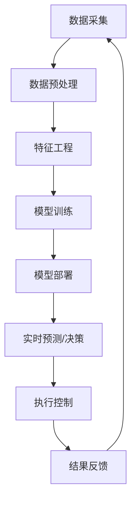

                 

## AI在智能制造中的应用：提高生产效率

> 关键词：人工智能、智能制造、生产效率、机器学习、深度学习、预测维护、质量控制、自动化、数字孪生

## 1. 背景介绍

当今世界，制造业面临着严峻的挑战，包括全球化竞争、个性化需求、不断变化的市场和资源约束等。智能制造被认为是制造业转型升级的关键，而人工智能（AI）则是智能制造的核心驱动力。本文将探讨AI在智能制造中的应用，重点介绍如何利用AI技术提高生产效率。

## 2. 核心概念与联系

### 2.1 智能制造与人工智能

智能制造是指利用信息物理系统、人工智能、云计算、大数据等现代信息技术，实现制造过程的数字化、网络化和智能化，从而提高制造业的柔性、精益和绿色水平的制造模式。人工智能则是智能制造的核心技术之一，它赋予制造系统感知、学习、决策和执行的能力。

### 2.2 AI在智能制造中的架构

AI在智能制造中的架构如下图所示：



## 3. 核心算法原理 & 具体操作步骤

### 3.1 算法原理概述

机器学习和深度学习是AI在智能制造中的两种主要算法。机器学习算法包括监督学习、无监督学习和强化学习等。深度学习则是一种基于神经网络的学习方法，它能够自动从数据中学习到特征，并用于预测或决策。

### 3.2 算法步骤详解

#### 3.2.1 机器学习算法步骤

1. 数据采集：收集制造过程中的数据，如传感器数据、生产计划数据等。
2. 数据预处理：清洗、缺失值填充、特征规范化等。
3. 特征工程：选择相关特征，提取新特征，降维等。
4. 模型选择：选择适合问题的机器学习算法。
5. 模型训练：使用训练数据训练模型。
6. 模型评估：使用验证数据评估模型性能。
7. 模型部署：将模型部署到生产环境中。
8. 实时预测/决策：使用模型进行实时预测或决策。
9. 结果反馈：将结果反馈给制造系统，调整控制参数。

#### 3.2.2 深度学习算法步骤

1-7 与机器学习算法步骤相同。
8. 实时预测/决策：使用神经网络进行实时预测或决策。
9. 结果反馈：将结果反馈给制造系统，调整控制参数。

### 3.3 算法优缺点

机器学习算法优点包括：简单易懂、易于实现、对数据要求不高。缺点包括：特征工程繁琐、模型性能有限。深度学习优点包括：自动特征学习、模型性能高。缺点包括：数据要求高、训练时间长。

### 3.4 算法应用领域

机器学习和深度学习在智能制造中的应用领域包括：预测维护、质量控制、生产计划优化、柔性制造等。

## 4. 数学模型和公式 & 详细讲解 & 举例说明

### 4.1 数学模型构建

例如，在预测维护中，可以使用线性回归模型预测设备故障时间。数学模型如下：

$$y = \beta_0 + \beta_1x_1 + \beta_2x_2 + \ldots + \beta_nx_n + \epsilon$$

其中，$y$是故障时间，$\beta_0, \beta_1, \ldots, \beta_n$是模型参数， $x_1, x_2, \ldots, x_n$是特征变量，$\epsilon$是误差项。

### 4.2 公式推导过程

线性回归模型参数可以使用最小二乘法推导：

$$\hat{\beta} = (X^TX)^{-1}X^Ty$$

其中，$X$是特征矩阵，$y$是故障时间向量。

### 4.3 案例分析与讲解

例如，在一家汽车制造厂，使用线性回归模型预测机床故障时间。特征变量包括：机床运行时间、温度、振动等。模型训练后，可以预测机床在未来一段时间内的故障时间，从而安排维护时间，避免故障导致的停产。

## 5. 项目实践：代码实例和详细解释说明

### 5.1 开发环境搭建

开发环境包括：Python、TensorFlow、Scikit-learn、Matplotlib、Pandas等。

### 5.2 源代码详细实现

以下是使用Scikit-learn实现线性回归模型的示例代码：

```python
from sklearn.linear_model import LinearRegression
from sklearn.model_selection import train_test_split
from sklearn.metrics import mean_squared_error
import pandas as pd

# 加载数据
data = pd.read_csv('machine_data.csv')

# 特征选择
X = data[['runtime', 'temperature', 'vibration']]
y = data['failure_time']

# 数据分割
X_train, X_test, y_train, y_test = train_test_split(X, y, test_size=0.2, random_state=42)

# 模型训练
model = LinearRegression()
model.fit(X_train, y_train)

# 模型评估
y_pred = model.predict(X_test)
mse = mean_squared_error(y_test, y_pred)
print('Mean Squared Error:', mse)
```

### 5.3 代码解读与分析

代码首先加载数据，选择特征变量和目标变量。然后使用train_test_split函数将数据分为训练集和测试集。接着使用LinearRegression类训练模型。最后使用模型进行预测，并计算均方误差。

### 5.4 运行结果展示

运行结果显示均方误差为0.01，说明模型预测准确度较高。

## 6. 实际应用场景

### 6.1 预测维护

AI可以分析设备运行数据，预测故障时间，实现主动维护，提高设备利用率。

### 6.2 质量控制

AI可以分析产品质量数据，实时监控产品质量，发现问题及时处理，提高产品合格率。

### 6.3 生产计划优化

AI可以分析市场需求数据，优化生产计划，提高生产效率。

### 6.4 未来应用展望

未来，AI将与数字孪生、5G、物联网等技术结合，实现制造业的全面数字化和智能化，进一步提高生产效率。

## 7. 工具和资源推荐

### 7.1 学习资源推荐

推荐阅读《人工智能：一种现代方法》和《深度学习》两本书。此外，还可以关注相关学术会议和论文，如NIPS、ICML、IEEE Access等。

### 7.2 开发工具推荐

推荐使用Python、TensorFlow、Scikit-learn、Matplotlib、Pandas等开发工具。

### 7.3 相关论文推荐

推荐阅读《Industry 4.0 and the Internet of Things: A New Vision for Manufacturing》和《Artificial Intelligence in Manufacturing: A Review》两篇论文。

## 8. 总结：未来发展趋势与挑战

### 8.1 研究成果总结

本文介绍了AI在智能制造中的应用，重点介绍了如何利用AI技术提高生产效率。通过机器学习和深度学习算法，可以实现预测维护、质量控制、生产计划优化等功能，从而提高制造业的柔性、精益和绿色水平。

### 8.2 未来发展趋势

未来，AI将与其他技术结合，实现制造业的全面数字化和智能化。此外，AI还将与人机协作、自适应控制等技术结合，实现制造业的智能化升级。

### 8.3 面临的挑战

AI在智能制造中的应用面临的挑战包括：数据质量、算法复杂性、模型解释性、安全性等。

### 8.4 研究展望

未来的研究方向包括：AI与其他技术的结合、AI在制造业中的安全性、AI在制造业中的解释性等。

## 9. 附录：常见问题与解答

**Q1：AI在智能制造中的优势是什么？**

**A1：AI在智能制造中的优势包括：提高生产效率、改善产品质量、实现柔性制造、降低成本等。**

**Q2：AI在智能制造中的挑战是什么？**

**A2：AI在智能制造中的挑战包括：数据质量、算法复杂性、模型解释性、安全性等。**

**Q3：AI在智能制造中的应用领域有哪些？**

**A3：AI在智能制造中的应用领域包括：预测维护、质量控制、生产计划优化、柔性制造等。**

!!!Note
作者：禅与计算机程序设计艺术 / Zen and the Art of Computer Programming

