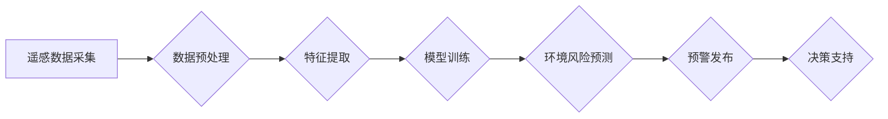

>人工智能，环境监测，预警系统，机器学习，深度学习，遥感数据，环境保护

## 1. 背景介绍

全球气候变化和环境污染问题日益严峻，迫切需要高效、精准的环境监测和预警系统来应对这些挑战。传统环境监测方法往往依赖于人工观测和采样，效率低下、成本高昂，难以实现实时、大范围的监测。而人工智能（AI）技术的快速发展为环境保护领域带来了新的机遇。

AI技术，特别是机器学习和深度学习，能够从海量环境数据中提取有价值的信息，识别环境变化趋势，并进行精准的预测和预警。AI驱动的环境监测系统能够实现实时、自动化、大规模的监测，为环境保护决策提供科学依据，有效提高环境保护效率。

## 2. 核心概念与联系

**2.1 环境监测与预警系统**

环境监测与预警系统旨在实时监测环境质量，识别潜在的环境风险，并及时发出预警，以便采取相应的措施进行防治。

**2.2 人工智能技术**

人工智能技术是指模拟人类智能行为的计算机科学领域。机器学习是AI的重要分支，它通过算法学习数据中的模式，并根据学习到的模式进行预测和决策。深度学习是机器学习的进一步发展，它利用多层神经网络模拟人类大脑的学习过程，能够处理更复杂的数据，并取得更优的性能。

**2.3 遥感数据**

遥感数据是指通过卫星、飞机等平台获取的地球表面信息。遥感数据能够提供大范围、高分辨率的环境信息，是环境监测的重要数据来源。

**2.4 数据融合**

数据融合是指将来自不同来源的数据进行整合和分析，以获得更全面、更准确的环境信息。

**2.5 流程图**



## 3. 核心算法原理 & 具体操作步骤

**3.1 算法原理概述**

环境监测与预警系统通常采用机器学习算法进行环境风险预测。常见的机器学习算法包括支持向量机（SVM）、决策树、随机森林、神经网络等。这些算法通过学习历史环境数据中的模式，建立环境风险预测模型，并对新的环境数据进行预测。

**3.2 算法步骤详解**

1. **数据收集:** 收集来自不同来源的环境数据，例如遥感数据、气象数据、水质数据等。
2. **数据预处理:** 对收集到的数据进行清洗、转换、归一化等处理，以去除噪声、异常值，并使其适合机器学习算法的训练。
3. **特征提取:** 从预处理后的数据中提取具有代表性的特征，例如温度、湿度、植被覆盖度等。
4. **模型训练:** 选择合适的机器学习算法，并利用提取的特征数据进行模型训练。训练过程的目标是使模型能够准确地预测环境风险。
5. **模型评估:** 对训练好的模型进行评估，例如使用测试数据进行预测，并计算模型的准确率、召回率等指标。
6. **模型部署:** 将经过评估的模型部署到环境监测系统中，用于实时预测环境风险。

**3.3 算法优缺点**

* **优点:**
    * 能够从海量数据中提取有价值的信息，识别环境变化趋势。
    * 能够实现实时、自动化、大规模的监测。
    * 能够提高环境保护决策的准确性和效率。
* **缺点:**
    * 需要大量的训练数据，数据质量对模型性能有重要影响。
    * 模型训练过程复杂，需要专业的技术人员进行操作。
    * 模型的解释性较差，难以理解模型的决策过程。

**3.4 算法应用领域**

* **空气质量监测与预警:** 预测空气污染水平，及时发出预警，提醒公众采取防护措施。
* **水质监测与预警:** 监测水体污染情况，预测水质变化趋势，及时采取措施进行防治。
* **森林火灾监测与预警:** 监测森林火灾风险，预测火灾发生区域，及时发出预警，组织灭火救援。
* **海洋环境监测:** 监测海洋污染、海洋生物多样性等，为海洋保护提供科学依据。

## 4. 数学模型和公式 & 详细讲解 & 举例说明

**4.1 数学模型构建**

环境风险预测模型通常采用回归模型或分类模型。回归模型用于预测连续变量，例如空气污染浓度；分类模型用于预测离散变量，例如森林火灾风险等级。

**4.2 公式推导过程**

例如，使用线性回归模型预测空气污染浓度，模型公式如下：

$$
y = \beta_0 + \beta_1x_1 + \beta_2x_2 + ... + \beta_nx_n + \epsilon
$$

其中：

* $y$ 是空气污染浓度
* $x_1, x_2, ..., x_n$ 是预测变量，例如温度、湿度、风速等
* $\beta_0, \beta_1, ..., \beta_n$ 是模型参数
* $\epsilon$ 是误差项

模型参数可以通过最小二乘法估计。

**4.3 案例分析与讲解**

假设我们想要预测某城市某日的空气污染浓度，收集了该城市过去一周的温度、湿度、风速等数据，以及相应的空气污染浓度数据。我们可以使用线性回归模型对这些数据进行训练，建立空气污染浓度预测模型。

训练完成后，我们可以将模型应用于新的数据，例如预测下周某日的空气污染浓度。

## 5. 项目实践：代码实例和详细解释说明

**5.1 开发环境搭建**

* 操作系统：Windows/Linux/macOS
* Python 版本：3.6+
* 必要的库：NumPy、Pandas、Scikit-learn、Matplotlib等

**5.2 源代码详细实现**

```python
import numpy as np
from sklearn.linear_model import LinearRegression
from sklearn.model_selection import train_test_split
from sklearn.metrics import mean_squared_error

# 加载数据
data = pd.read_csv('air_quality_data.csv')

# 选择特征和目标变量
X = data[['temperature', 'humidity', 'wind_speed']]
y = data['pollution_concentration']

# 将数据划分为训练集和测试集
X_train, X_test, y_train, y_test = train_test_split(X, y, test_size=0.2, random_state=42)

# 创建线性回归模型
model = LinearRegression()

# 训练模型
model.fit(X_train, y_train)

# 对测试集进行预测
y_pred = model.predict(X_test)

# 计算模型性能
mse = mean_squared_error(y_test, y_pred)
print(f'Mean Squared Error: {mse}')

# 可视化预测结果
plt.scatter(y_test, y_pred)
plt.xlabel('Actual Pollution Concentration')
plt.ylabel('Predicted Pollution Concentration')
plt.title('Linear Regression Model Performance')
plt.show()
```

**5.3 代码解读与分析**

* 代码首先加载环境数据，并选择特征和目标变量。
* 然后将数据划分为训练集和测试集，用于训练和评估模型。
* 创建线性回归模型，并使用训练数据进行模型训练。
* 训练完成后，使用测试数据进行预测，并计算模型性能指标。
* 最后，可视化预测结果，观察模型的预测效果。

**5.4 运行结果展示**

运行代码后，会输出模型的性能指标，例如均方误差（MSE）。同时，还会生成一个散点图，展示实际污染浓度与预测污染浓度的关系。

## 6. 实际应用场景

**6.1 空气质量监测与预警**

AI驱动的空气质量监测系统能够实时监测空气污染水平，识别污染源，并预测污染浓度变化趋势。系统可以向公众发布预警信息，提醒采取防护措施，例如减少户外活动、佩戴口罩等。

**6.2 水质监测与预警**

AI驱动的水质监测系统能够实时监测水体污染情况，识别污染源，并预测水质变化趋势。系统可以向相关部门发布预警信息，以便采取措施进行防治。

**6.3 森林火灾监测与预警**

AI驱动的森林火灾监测系统能够利用遥感数据和气象数据，识别森林火灾风险区域，预测火灾发生概率，并及时发出预警信息，组织灭火救援。

**6.4 未来应用展望**

随着AI技术的不断发展，其在环境保护领域的应用将更加广泛和深入。例如：

* **环境风险评估:** 利用AI技术对环境风险进行评估，为环境决策提供科学依据。
* **环境治理优化:** 利用AI技术优化环境治理方案，提高治理效率。
* **环境保护监管:** 利用AI技术加强环境保护监管，提高监管力度。

## 7. 工具和资源推荐

**7.1 学习资源推荐**

* **书籍:**
    * 《深度学习》
    * 《机器学习实战》
    * 《Python机器学习》
* **在线课程:**
    * Coursera: 深度学习
    * edX: 机器学习
    * Udacity: AI工程师

**7.2 开发工具推荐**

* **Python:** 
    * NumPy
    * Pandas
    * Scikit-learn
    * TensorFlow
    * PyTorch
* **数据可视化工具:**
    * Matplotlib
    * Seaborn
    * Plotly

**7.3 相关论文推荐**

* **环境监测与预警:**
    * "Air Quality Forecasting Using Machine Learning: A Review"
    * "Deep Learning for Environmental Monitoring and Prediction"
* **遥感数据分析:**
    * "Remote Sensing Image Classification Using Deep Learning"
    * "Applications of Deep Learning in Remote Sensing"

## 8. 总结：未来发展趋势与挑战

**8.1 研究成果总结**

AI技术在环境监测与预警领域取得了显著成果，能够有效提高环境监测效率，并为环境保护决策提供科学依据。

**8.2 未来发展趋势**

* **模型精度提升:** 随着算法和模型的不断改进，环境风险预测模型的精度将进一步提升。
* **数据融合:** 将来自不同来源的数据进行融合，构建更全面、更准确的环境监测模型。
* **边缘计算:** 将AI模型部署到边缘设备，实现实时、本地化的环境监测。
* **可解释性增强:** 研究更可解释的AI模型，提高模型的透明度和可信度。

**8.3 面临的挑战**

* **数据质量:** 环境数据往往存在噪声、缺失值等问题，需要进行有效的数据清洗和处理。
* **模型解释性:** 许多AI模型的决策过程难以解释，这限制了模型的应用和推广。
* **计算资源:** 训练大型AI模型需要大量的计算资源，这对于一些资源有限的机构来说是一个挑战。

**8.4 研究展望**

未来，AI技术在环境保护领域的应用将更加广泛和深入，为构建更加可持续的未来贡献力量。


## 9. 附录：常见问题与解答

**9.1 如何选择合适的AI算法？**

选择合适的AI算法取决于具体的应用场景和数据特点。例如，对于预测连续变量，可以使用线性回归、支持向量回归等算法；对于预测离散变量，可以使用决策树、随机森林、支持向量机等算法。

**9.2 如何处理环境数据中的噪声和缺失值？**

可以使用数据清洗和处理技术来处理环境数据中的噪声和缺失值。例如，可以使用均值填充、中位数填充等方法处理缺失值；可以使用滑动平均、中值滤波等方法处理噪声。

**9.3 如何评估AI模型的性能？**

可以使用多种指标来评估AI模型的性能，例如均方误差（MSE）、平均绝对