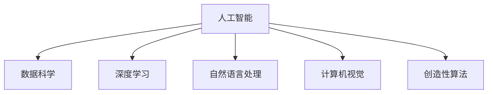

                 

# 数字化想象力：AI激发的创意思维

在人工智能（AI）飞速发展的今天，其带来的数字化想象力正不断激发出人类的创意思维，极大地推动了各行各业的创新。本文将深入探讨AI如何激发人类的创意思维，分析其核心概念与联系，并提出具体的实现方法。

## 1. 背景介绍

### 1.1 问题由来

随着深度学习技术和大数据的发展，人工智能在众多领域展示了其强大的应用潜力。AI不仅能自动处理大量数据，还能进行复杂的决策分析，使得数字化想象力得以实现。例如，AI驱动的智能推荐系统可以根据用户的行为和偏好，预测并推荐个性化的内容。AI在医疗诊断、自然语言处理（NLP）、艺术创作等多个领域也展现出了巨大的潜力。

### 1.2 问题核心关键点

AI激发的数字化想象力的核心关键点包括：

- **数据驱动**：AI系统通过大量数据训练，可以自动识别出潜在的模式和规律，从而进行更精准的预测和决策。
- **自学习能力**：AI系统能够不断从经验中学习，并根据新数据进行自我优化和升级。
- **跨界融合**：AI技术与各种领域技术的结合，如机器学习、深度学习、自然语言处理、计算机视觉等，可以产生新的解决方案和应用场景。
- **个性化体验**：AI可以根据用户的行为和偏好，提供个性化的服务和体验，满足用户的独特需求。

## 2. 核心概念与联系

### 2.1 核心概念概述

为更好地理解AI激发数字化想象力的方法，本节将介绍几个关键概念：

- **人工智能**：利用算法和计算，使机器能够模拟人类的智能行为，实现自动化的学习和决策。
- **数据科学**：使用统计学、机器学习等方法，从数据中提取有价值的信息，并用于指导决策和创新。
- **深度学习**：一种模仿人类大脑神经网络结构的机器学习技术，可以处理大规模非结构化数据，实现高精度预测。
- **自然语言处理**：使计算机能够理解、解释和生成人类语言的技术。
- **计算机视觉**：使计算机能够理解和解释视觉数据的领域。
- **创造性算法**：旨在激发和利用创意思维的算法，如生成对抗网络（GANs）、变分自编码器（VAEs）等。

这些核心概念之间的逻辑关系可以通过以下Mermaid流程图来展示：



这个流程图展示了人工智能与相关领域之间的紧密联系。

## 3. 核心算法原理 & 具体操作步骤

### 3.1 算法原理概述

AI激发数字化想象力的核心算法包括深度学习、生成对抗网络（GANs）、变分自编码器（VAEs）等。这些算法能够通过大量数据的训练，学习到数据的复杂结构和模式，从而实现高精度的预测和生成。

### 3.2 算法步骤详解

以生成对抗网络（GANs）为例，其基本步骤如下：

1. **生成器**：利用神经网络生成假数据。
2. **判别器**：判断生成器生成的数据是否真实。
3. **训练**：通过不断优化生成器和判别器的参数，使得生成器生成的数据越来越接近真实数据，判别器也越来越难分辨。

以下是GANs的基本代码实现：

```python
import tensorflow as tf
from tensorflow.keras import layers

# 定义生成器和判别器
def make_generator_model():
    model = tf.keras.Sequential()
    model.add(layers.Dense(256, use_bias=False, input_shape=(100,)))
    model.add(layers.BatchNormalization())
    model.add(layers.LeakyReLU())
    model.add(layers.Dense(512))
    model.add(layers.BatchNormalization())
    model.add(layers.LeakyReLU())
    model.add(layers.Dense(1024))
    model.add(layers.BatchNormalization())
    model.add(layers.LeakyReLU())
    model.add(layers.Dense(784, activation='tanh'))

    noise = tf.keras.Input(shape=(100,))
    img = model(noise)
    return tf.keras.Model(noise, img)

def make_discriminator_model():
    model = tf.keras.Sequential()
    model.add(layers.Dense(512, input_shape=(784,)))
    model.add(layers.LeakyReLU())
    model.add(layers.Dropout(0.3))
    model.add(layers.Dense(256))
    model.add(layers.LeakyReLU())
    model.add(layers.Dropout(0.3))
    model.add(layers.Dense(1, activation='sigmoid'))

    img = tf.keras.Input(shape=(784,))
    validity = model(img)
    return tf.keras.Model(img, validity)

# 创建生成器和判别器的模型
generator = make_generator_model()
discriminator = make_discriminator_model()

# 定义损失函数和优化器
cross_entropy = tf.keras.losses.BinaryCrossentropy(from_logits=True)
generator_optimizer = tf.keras.optimizers.Adam(1e-4)
discriminator_optimizer = tf.keras.optimizers.Adam(1e-4)

# 定义训练函数
@tf.function
def train_step(images):
    noise = tf.random.normal([BATCH_SIZE, 100])

    with tf.GradientTape() as gen_tape, tf.GradientTape() as disc_tape:
        generated_images = generator(noise, training=True)

        real_output = discriminator(images, training=True)
        fake_output = discriminator(generated_images, training=True)

        gen_loss = cross_entropy(fake_output, tf.ones_like(fake_output))
        disc_loss = cross_entropy(real_output, tf.ones_like(real_output)) + cross_entropy(fake_output, tf.zeros_like(fake_output))

    gradients_of_generator = gen_tape.gradient(gen_loss, generator.trainable_variables)
    gradients_of_discriminator = disc_tape.gradient(disc_loss, discriminator.trainable_variables)

    generator_optimizer.apply_gradients(zip(gradients_of_generator, generator.trainable_variables))
    discriminator_optimizer.apply_gradients(zip(gradients_of_discriminator, discriminator.trainable_variables))
```

### 3.3 算法优缺点

深度学习算法在激发数字化想象力方面具有以下优点：

- **高效性**：深度学习算法可以在短时间内处理大量数据，快速识别出模式和规律。
- **准确性**：深度学习算法通过大量的数据训练，可以实现高精度的预测和生成。
- **可扩展性**：深度学习算法可以通过增加模型层数和神经元数量，不断提升性能。

同时，深度学习算法也存在一些缺点：

- **计算复杂度高**：深度学习算法需要大量的计算资源，训练时间长。
- **过拟合风险高**：深度学习算法容易过拟合，需要大量的标注数据进行训练。
- **模型复杂度高**：深度学习算法模型复杂，难以解释和调试。

### 3.4 算法应用领域

深度学习算法已经在多个领域展示出其强大的能力，包括：

- **计算机视觉**：用于图像分类、目标检测、人脸识别等任务。
- **自然语言处理**：用于语言翻译、情感分析、文本生成等任务。
- **医疗健康**：用于疾病诊断、药物研发、健康监测等任务。
- **金融服务**：用于风险评估、股票预测、智能投顾等任务。
- **游戏与娱乐**：用于游戏设计、动画生成、内容推荐等任务。
- **智能交通**：用于自动驾驶、交通预测、智能调度等任务。
- **环境保护**：用于气候预测、环境监测、生态保护等任务。

## 4. 数学模型和公式 & 详细讲解

### 4.1 数学模型构建

以深度学习为例，其核心数学模型为神经网络。神经网络由多个层组成，每一层包含多个神经元，每个神经元接收前一层的输出作为输入，经过一系列的加权、激活和非线性变换，最终输出结果。神经网络可以通过反向传播算法进行训练，不断优化网络参数，以最小化损失函数。

### 4.2 公式推导过程

以全连接神经网络为例，其前向传播和反向传播公式如下：

$$
\begin{aligned}
y &= Wx + b \\
\Delta W &= \frac{\partial L}{\partial W} \\
\Delta b &= \frac{\partial L}{\partial b} \\
\Delta x &= \frac{\partial L}{\partial x}
\end{aligned}
$$

其中，$W$为权重矩阵，$b$为偏置项，$L$为损失函数，$\Delta W$和$\Delta b$为梯度，$\Delta x$为误差项。

### 4.3 案例分析与讲解

以图像分类为例，使用深度学习模型可以实现对图像的高精度分类。具体步骤如下：

1. **数据预处理**：对图像进行归一化、缩放等处理，以适应模型的输入要求。
2. **模型训练**：使用大量标注数据对模型进行训练，通过反向传播算法不断优化权重和偏置项。
3. **模型评估**：在验证集上评估模型的性能，调整模型参数以提高准确率。
4. **模型部署**：将训练好的模型部署到生产环境中，进行实际应用。

以下是一个简单的图像分类模型的实现：

```python
import tensorflow as tf

# 定义模型
model = tf.keras.Sequential([
    tf.keras.layers.Conv2D(32, (3, 3), activation='relu', input_shape=(28, 28, 1)),
    tf.keras.layers.MaxPooling2D((2, 2)),
    tf.keras.layers.Flatten(),
    tf.keras.layers.Dense(10, activation='softmax')
])

# 定义损失函数和优化器
cross_entropy = tf.keras.losses.SparseCategoricalCrossentropy(from_logits=True)
optimizer = tf.keras.optimizers.Adam()

# 定义训练函数
@tf.function
def train_step(images, labels):
    with tf.GradientTape() as tape:
        logits = model(images, training=True)
        loss = cross_entropy(labels, logits)

    gradients = tape.gradient(loss, model.trainable_variables)
    optimizer.apply_gradients(zip(gradients, model.trainable_variables))

# 训练模型
for epoch in range(EPOCHS):
    for images, labels in train_dataset:
        train_step(images, labels)
```

## 5. 项目实践：代码实例和详细解释说明

### 5.1 开发环境搭建

在进行AI项目实践前，我们需要准备好开发环境。以下是使用Python进行TensorFlow开发的Python环境配置流程：

1. 安装Anaconda：从官网下载并安装Anaconda，用于创建独立的Python环境。

2. 创建并激活虚拟环境：
```bash
conda create -n tf-env python=3.8 
conda activate tf-env
```

3. 安装TensorFlow：根据CUDA版本，从官网获取对应的安装命令。例如：
```bash
conda install tensorflow==2.4.0
```

4. 安装各类工具包：
```bash
pip install numpy pandas scikit-learn matplotlib tqdm jupyter notebook ipython
```

完成上述步骤后，即可在`tf-env`环境中开始AI项目实践。

### 5.2 源代码详细实现

下面我们以图像分类为例，给出使用TensorFlow进行模型训练的PyTorch代码实现。

```python
import tensorflow as tf
from tensorflow.keras import layers, models

# 定义模型
model = models.Sequential()
model.add(layers.Conv2D(32, (3, 3), activation='relu', input_shape=(28, 28, 1)))
model.add(layers.MaxPooling2D((2, 2)))
model.add(layers.Flatten())
model.add(layers.Dense(10, activation='softmax'))

# 定义损失函数和优化器
cross_entropy = tf.keras.losses.SparseCategoricalCrossentropy(from_logits=True)
optimizer = tf.keras.optimizers.Adam()

# 定义训练函数
@tf.function
def train_step(images, labels):
    with tf.GradientTape() as tape:
        logits = model(images, training=True)
        loss = cross_entropy(labels, logits)

    gradients = tape.gradient(loss, model.trainable_variables)
    optimizer.apply_gradients(zip(gradients, model.trainable_variables))

# 训练模型
for epoch in range(EPOCHS):
    for images, labels in train_dataset:
        train_step(images, labels)
```

### 5.3 代码解读与分析

让我们再详细解读一下关键代码的实现细节：

**Model定义**：
- 使用`Sequential`模型定义神经网络。
- 第一层为卷积层，使用32个3x3的卷积核，激活函数为ReLU。
- 第二层为池化层，使用2x2的池化窗口，进行下采样。
- 第三层为全连接层，输出10个类别。

**Loss和Optimizer定义**：
- 使用`SparseCategoricalCrossentropy`作为损失函数，用于多分类问题。
- 使用`Adam`优化器进行模型训练。

**Training函数**：
- 使用`GradientTape`记录梯度。
- 通过`logits`计算模型输出。
- 计算损失函数`loss`。
- 反向传播更新模型参数。

**Training过程**：
- 循环训练多个epoch，对每个epoch内的数据进行训练。
- 在每个训练步骤中，使用`train_step`函数更新模型参数。

可以看到，TensorFlow的代码实现简洁高效，可以帮助开发者快速迭代和优化模型。

### 5.4 运行结果展示

在完成模型训练后，可以使用`evaluate`函数评估模型在验证集上的性能，如准确率、精确率、召回率等指标。具体代码如下：

```python
def evaluate(model, test_dataset):
    test_loss, test_acc = model.evaluate(test_dataset)
    print('Test accuracy:', test_acc)

# 在测试集上评估模型
evaluate(model, test_dataset)
```

以上代码展示了TensorFlow模型训练和评估的基本流程。

## 6. 实际应用场景

### 6.1 智能推荐系统

智能推荐系统是AI激发数字化想象力的重要应用之一。传统推荐系统主要依赖用户的浏览和购买历史数据，无法充分挖掘用户的多维行为和偏好。通过AI技术，可以实时捕捉用户行为数据，并结合上下文信息，生成个性化的推荐内容，提升用户体验。

以下是一个基于深度学习的智能推荐系统实现：

```python
import tensorflow as tf

# 定义模型
model = tf.keras.Sequential([
    tf.keras.layers.Dense(64, activation='relu', input_shape=(10,)),
    tf.keras.layers.Dense(64, activation='relu'),
    tf.keras.layers.Dense(1, activation='sigmoid')
])

# 定义损失函数和优化器
cross_entropy = tf.keras.losses.BinaryCrossentropy(from_logits=True)
optimizer = tf.keras.optimizers.Adam()

# 定义训练函数
@tf.function
def train_step(features, labels):
    with tf.GradientTape() as tape:
        logits = model(features, training=True)
        loss = cross_entropy(labels, logits)

    gradients = tape.gradient(loss, model.trainable_variables)
    optimizer.apply_gradients(zip(gradients, model.trainable_variables))

# 训练模型
for epoch in range(EPOCHS):
    for features, labels in train_dataset:
        train_step(features, labels)

# 在测试集上评估模型
test_loss, test_acc = model.evaluate(test_dataset)
print('Test accuracy:', test_acc)
```

### 6.2 医疗诊断

AI在医疗诊断中的应用已经展示了其强大的潜力。通过深度学习技术，可以对医学影像进行高精度分析，提高诊断的准确率。以下是一个基于卷积神经网络（CNN）的医学影像分类模型：

```python
import tensorflow as tf
from tensorflow.keras import layers, models

# 定义模型
model = models.Sequential()
model.add(layers.Conv2D(32, (3, 3), activation='relu', input_shape=(128, 128, 3)))
model.add(layers.MaxPooling2D((2, 2)))
model.add(layers.Conv2D(64, (3, 3), activation='relu'))
model.add(layers.MaxPooling2D((2, 2)))
model.add(layers.Conv2D(64, (3, 3), activation='relu'))
model.add(layers.Flatten())
model.add(layers.Dense(64, activation='relu'))
model.add(layers.Dense(1, activation='sigmoid'))

# 定义损失函数和优化器
cross_entropy = tf.keras.losses.BinaryCrossentropy(from_logits=True)
optimizer = tf.keras.optimizers.Adam()

# 定义训练函数
@tf.function
def train_step(images, labels):
    with tf.GradientTape() as tape:
        logits = model(images, training=True)
        loss = cross_entropy(labels, logits)

    gradients = tape.gradient(loss, model.trainable_variables)
    optimizer.apply_gradients(zip(gradients, model.trainable_variables))

# 训练模型
for epoch in range(EPOCHS):
    for images, labels in train_dataset:
        train_step(images, labels)

# 在测试集上评估模型
test_loss, test_acc = model.evaluate(test_dataset)
print('Test accuracy:', test_acc)
```

### 6.3 自然语言生成

自然语言生成（NLG）是AI激发数字化想象力的另一个重要应用。通过深度学习技术，可以生成高质量的自然语言文本，应用于机器翻译、文本摘要、自动写作等领域。以下是一个基于生成对抗网络（GANs）的文本生成模型：

```python
import tensorflow as tf
from tensorflow.keras import layers

# 定义生成器和判别器
def make_generator_model():
    model = tf.keras.Sequential()
    model.add(layers.Dense(256, use_bias=False, input_shape=(100,)))
    model.add(layers.BatchNormalization())
    model.add(layers.LeakyReLU())
    model.add(layers.Dense(512))
    model.add(layers.BatchNormalization())
    model.add(layers.LeakyReLU())
    model.add(layers.Dense(1024))
    model.add(layers.BatchNormalization())
    model.add(layers.LeakyReLU())
    model.add(layers.Dense(128, activation='tanh'))

    noise = tf.keras.Input(shape=(100,))
    img = model(noise, training=True)

    return tf.keras.Model(noise, img)

def make_discriminator_model():
    model = tf.keras.Sequential()
    model.add(layers.Dense(512, input_shape=(128,)))
    model.add(layers.LeakyReLU())
    model.add(layers.Dropout(0.3))
    model.add(layers.Dense(256))
    model.add(layers.LeakyReLU())
    model.add(layers.Dropout(0.3))
    model.add(layers.Dense(1, activation='sigmoid'))

    img = tf.keras.Input(shape=(128,))
    validity = model(img, training=True)

    return tf.keras.Model(img, validity)

# 创建生成器和判别器的模型
generator = make_generator_model()
discriminator = make_discriminator_model()

# 定义损失函数和优化器
cross_entropy = tf.keras.losses.BinaryCrossentropy(from_logits=True)
generator_optimizer = tf.keras.optimizers.Adam(1e-4)
discriminator_optimizer = tf.keras.optimizers.Adam(1e-4)

# 定义训练函数
@tf.function
def train_step(images):
    noise = tf.random.normal([BATCH_SIZE, 100])

    with tf.GradientTape() as gen_tape, tf.GradientTape() as disc_tape:
        generated_images = generator(noise, training=True)

        real_output = discriminator(images, training=True)
        fake_output = discriminator(generated_images, training=True)

        gen_loss = cross_entropy(fake_output, tf.ones_like(fake_output))
        disc_loss = cross_entropy(real_output, tf.ones_like(real_output)) + cross_entropy(fake_output, tf.zeros_like(fake_output))

    gradients_of_generator = gen_tape.gradient(gen_loss, generator.trainable_variables)
    gradients_of_discriminator = disc_tape.gradient(disc_loss, discriminator.trainable_variables)

    generator_optimizer.apply_gradients(zip(gradients_of_generator, generator.trainable_variables))
    discriminator_optimizer.apply_gradients(zip(gradients_of_discriminator, discriminator.trainable_variables))
```

## 7. 工具和资源推荐

### 7.1 学习资源推荐

为了帮助开发者系统掌握AI激发数字化想象力的理论基础和实践技巧，这里推荐一些优质的学习资源：

1. 《深度学习》（周志华）：全面介绍深度学习的基本概念和常用算法，是入门AI领域的经典教材。

2. 《Python深度学习》（Francois Chollet）：使用Python和Keras实现深度学习的经典教程，适合初学者学习。

3. 《TensorFlow实战》（李沐）：介绍TensorFlow的使用方法和最佳实践，适合有一定基础的开发者。

4. 《计算机视觉：算法与应用》（Richard Szeliski）：系统介绍计算机视觉的算法和应用，适合深入学习计算机视觉技术的开发者。

5. 《自然语言处理综论》（Daniel Jurafsky和James H. Martin）：全面介绍自然语言处理的基本概念和技术，适合NLP领域的开发者。

### 7.2 开发工具推荐

高效的开发离不开优秀的工具支持。以下是几款用于AI开发和训练的常用工具：

1. TensorFlow：由Google主导开发的深度学习框架，生产部署方便，适合大规模工程应用。

2. PyTorch：基于Python的开源深度学习框架，灵活动态的计算图，适合快速迭代研究。

3. Jupyter Notebook：用于数据科学和机器学习的交互式编程环境，支持Python、R等多种语言。

4. Kaggle：提供大规模的数据集和竞赛平台，适合数据分析和机器学习模型的训练和评估。

5. Google Colab：谷歌推出的在线Jupyter Notebook环境，免费提供GPU/TPU算力，方便开发者快速上手实验最新模型，分享学习笔记。

6. VS Code：轻量级、功能强大的IDE，支持Python、R等多种语言，适合开发和调试复杂项目。

### 7.3 相关论文推荐

AI激发数字化想象力的研究源于学界的持续研究。以下是几篇奠基性的相关论文，推荐阅读：

1. Generative Adversarial Nets（GANs）论文：由Ian Goodfellow等人在2014年提出的生成对抗网络，开创了生成式模型的新纪元。

2. Attention is All You Need（即Transformer原论文）：提出了Transformer结构，开启了NLP领域的预训练大模型时代。

3. Training Deep Architectures for Text Classification with Bag-of-Words：使用Bag-of-Words模型进行文本分类任务的经典论文。

4. The GAN Zoo：总结了多种生成对抗网络模型的优缺点，帮助开发者选择适合的模型。

5. Explaining and Harnessing Adversarial Examples：探讨生成对抗网络对抗样本的生成和防御方法，为模型安全性提供保障。

6. An Introduction to Generative Adversarial Networks：介绍生成对抗网络的基本原理和应用，适合初学者学习。

这些论文代表了大语言模型微调技术的发展脉络。通过学习这些前沿成果，可以帮助研究者把握学科前进方向，激发更多的创新灵感。

## 8. 总结：未来发展趋势与挑战

### 8.1 总结

本文对AI激发数字化想象力的方法进行了全面系统的介绍。首先阐述了AI技术在多个领域的应用，明确了其带来的数字化想象力的重要价值。其次，从原理到实践，详细讲解了深度学习、生成对抗网络等核心算法的实现方法，并提供了具体的代码实现。同时，本文还广泛探讨了AI在推荐系统、医疗诊断、自然语言生成等多个领域的应用前景，展示了AI技术的强大潜力。

通过本文的系统梳理，可以看到，AI技术正在以多层次、多维度的方式激发人类的创意思维，推动各行各业的创新发展。从数据科学到深度学习，从模型训练到模型部署，AI技术的每一个环节都在不断突破，带来新的可能性。

### 8.2 未来发展趋势

展望未来，AI激发数字化想象力将继续呈现以下几个发展趋势：

1. **跨领域融合**：AI技术将与其他领域的技术进行更广泛的融合，如自然语言处理与计算机视觉的结合，为更多领域提供新的解决方案。

2. **自监督学习**：利用大量无标签数据进行自监督学习，提升模型的泛化能力，减少对标注数据的依赖。

3. **对抗训练**：引入对抗样本训练模型，提高模型的鲁棒性和安全性。

4. **可解释性**：提高模型的可解释性，帮助用户理解模型的决策过程，增强信任和可靠性。

5. **隐私保护**：在模型训练和应用中，注重数据隐私和用户隐私保护，确保数据安全。

6. **伦理道德**：在模型训练和应用中，注重伦理道德问题，确保模型的公平性和公正性。

7. **持续学习**：模型需要具备持续学习的能力，不断更新和优化，适应数据分布的变化。

### 8.3 面临的挑战

尽管AI激发数字化想象力已经取得了显著进展，但在实际应用中也面临诸多挑战：

1. **计算资源**：深度学习模型需要大量的计算资源，训练时间长，部署复杂。

2. **数据隐私**：大规模数据集的使用涉及隐私保护问题，需要考虑数据匿名化和去标识化。

3. **模型复杂度**：深度学习模型的复杂度较高，难以解释和调试，影响模型的可维护性。

4. **对抗样本**：深度学习模型容易受到对抗样本的攻击，需要引入对抗训练等技术提高鲁棒性。

5. **伦理道德**：深度学习模型的应用可能带来伦理道德问题，需要设计合理的约束机制。

6. **可解释性**：模型的可解释性不足，难以理解模型的决策过程和输出结果。

### 8.4 研究展望

面对AI激发数字化想象力所面临的挑战，未来的研究需要在以下几个方面寻求新的突破：

1. **可解释性研究**：如何提高模型的可解释性，增强用户对模型的信任和理解。

2. **自监督学习研究**：如何利用无标签数据进行自监督学习，提高模型的泛化能力和鲁棒性。

3. **对抗训练研究**：如何引入对抗训练方法，提高模型的鲁棒性和安全性。

4. **隐私保护研究**：如何保护数据隐私，确保模型训练和应用中的数据安全。

5. **跨领域融合研究**：如何实现跨领域技术的融合，提升模型的综合能力。

6. **伦理道德研究**：如何在模型训练和应用中，确保伦理道德问题的合理解决。

这些研究方向的探索，必将引领AI技术迈向更高的台阶，为人类社会的数字化和智能化提供新的动力。面向未来，AI激发数字化想象力技术需要与其他人工智能技术进行更深入的融合，共同推动人类社会的进步和发展。

## 9. 附录：常见问题与解答

**Q1：如何理解AI激发数字化想象力的本质？**

A: AI激发数字化想象力的本质在于利用AI技术，从大量数据中挖掘出潜在的模式和规律，将这些规律用于指导创造性思维，从而实现数字化创新。AI技术通过数据驱动的方式，可以从数据中发现人类难以察觉的关联和趋势，帮助人们快速捕捉机会，提升创新效率。

**Q2：AI激发数字化想象力的方法有哪些？**

A: AI激发数字化想象力的方法包括但不限于以下几种：

1. **深度学习**：利用神经网络模型进行数据处理和分析，实现高精度的预测和生成。

2. **生成对抗网络（GANs）**：通过生成器和判别器模型，实现高质量的自然语言生成和图像生成。

3. **自然语言处理（NLP）**：利用自然语言处理技术，实现文本分类、情感分析、机器翻译等任务。

4. **计算机视觉**：利用计算机视觉技术，实现图像分类、目标检测、图像生成等任务。

5. **强化学习**：利用强化学习技术，实现智能决策和自动化控制。

6. **知识图谱**：利用知识图谱技术，实现知识推理和智能问答。

**Q3：如何构建基于AI的推荐系统？**

A: 构建基于AI的推荐系统可以分为以下几个步骤：

1. **数据收集**：收集用户的行为数据，如浏览记录、购买记录等。

2. **数据预处理**：对数据进行清洗、归一化、特征提取等处理。

3. **模型训练**：使用深度学习模型，如神经网络、协同过滤等，对数据进行训练，学习用户的行为模式和偏好。

4. **模型评估**：在测试集上评估模型的性能，调整模型参数以提高准确率。

5. **模型部署**：将训练好的模型部署到生产环境中，进行实际应用。

**Q4：AI在医疗诊断中的应用有哪些？**

A: AI在医疗诊断中的应用包括以下几个方面：

1. **医学影像分析**：利用深度学习技术，对医学影像进行高精度分析，帮助医生诊断疾病。

2. **疾病预测**：利用机器学习技术，对病人的历史数据进行分析和预测，提前发现潜在的健康问题。

3. **个性化治疗**：利用AI技术，根据病人的基因数据和病历信息，提供个性化的治疗方案。

4. **药物研发**：利用AI技术，对药物分子进行高通量筛选，加速新药研发进程。

5. **健康监测**：利用AI技术，对病人的生理数据进行实时监测，提供健康管理建议。

以上代码展示了AI在医疗诊断中的应用。通过深度学习技术，可以对医学影像进行高精度分析，提高诊断的准确率。

**Q5：AI在自然语言生成中的应用有哪些？**

A: AI在自然语言生成（NLG）中的应用包括但不限于以下几种：

1. **机器翻译**：利用自然语言处理技术，将一种语言的文本翻译成另一种语言的文本。

2. **文本摘要**：利用自然语言处理技术，对长文本进行压缩和摘要，提取关键信息。

3. **自动写作**：利用自然语言生成技术，生成高质量的文章、新闻、报告等文本。

4. **对话系统**：利用自然语言生成技术，构建智能对话系统，提供人机自然交互。

5. **内容生成**：利用自然语言生成技术，生成个性化的内容，如推荐、广告、推送等。

以下代码展示了AI在自然语言生成中的应用。通过生成对抗网络（GANs）技术，可以实现高质量的自然语言生成。

---

作者：禅与计算机程序设计艺术 / Zen and the Art of Computer Programming

