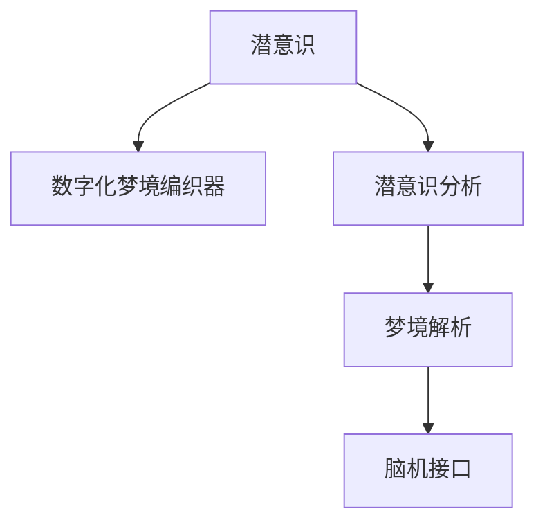

                 

# 数字化梦境编织：AI设计的潜意识探索

## 1. 背景介绍

### 1.1 问题由来

在数字化时代，人工智能（AI）已经成为推动社会进步、改变人类生活方式的重要力量。AI技术的迅猛发展，从智能家居到自动驾驶，从自然语言处理到图像识别，无处不在地影响着我们的生活。而潜意识探索，作为AI研究的前沿领域之一，正日益受到广泛关注。

潜意识，是人类心灵深处的一种神秘存在，它往往隐藏在人类意识之外，却对行为、决策、创造力等方面有着不可忽视的影响。传统上，潜意识的研究大多依赖于心理学实验和神经科学研究，但随着AI技术的发展，尤其是深度学习和大数据的兴起，AI已经成为探索潜意识的新工具。

通过AI设计的潜意识探索，可以将潜意识的信息转化为数字化的形式，使其更易于分析、挖掘和应用。这在医学、心理学、广告等领域都有着巨大的潜力。例如，通过分析梦境，我们可以挖掘出患者的心理状态和健康问题；在广告设计中，通过潜意识引导，可以设计出更具吸引力的广告文案和图像。

## 1.2 问题核心关键点

潜意识探索的核心在于如何从人类意识之外的数据中提取和理解潜意识信息。当前，基于AI的潜意识探索方法主要分为两类：一是以大脑信号为主的脑机接口（Brain-Computer Interface, BCI）技术，通过捕捉大脑的电信号或磁信号，直接获取潜意识信息；二是基于自然语言处理（Natural Language Processing, NLP）的潜意识分析，通过分析人类的自然语言，挖掘潜意识倾向。

本文将重点探讨后者，即通过NLP技术，结合深度学习算法，构建一个数字化梦境编织器，从人类梦境中提取潜意识信息，并通过AI设计进行处理和应用。

## 1.3 问题研究意义

潜意识探索的AI研究，不仅在心理学、神经科学等领域具有重要意义，还为商业广告、医疗健康、娱乐等领域带来了全新的创新可能。具体来说：

1. **商业广告**：通过对梦境的分析，广告公司可以更精准地设计广告内容，把握消费者心理，提升广告效果。
2. **医疗健康**：潜意识信息常常与患者的心理健康密切相关，通过对梦境的潜意识分析，可以辅助诊断心理问题，提供更好的心理健康服务。
3. **娱乐领域**：通过潜意识引导，游戏和电影可以设计更具吸引力的情节和角色，提升用户体验。

## 2. 核心概念与联系

### 2.1 核心概念概述

为更好地理解基于AI设计的潜意识探索方法，本节将介绍几个关键概念：

- **潜意识**：人类心灵深处、不为人所意识到的心理活动和信息。
- **数字化梦境编织器**：通过NLP和深度学习算法，将人类梦境中的潜意识信息转换为数字化形式的工具。
- **潜意识分析**：通过对人类梦境、自然语言等数据进行分析，挖掘潜意识倾向和情感状态的技术。
- **脑机接口（BCI）**：通过捕捉大脑信号，直接获取潜意识信息的技术。
- **梦境解析**：通过对梦境内容进行语义分析，理解梦境背后潜意识的深层含义。

这些概念之间的关系可以通过以下Mermaid流程图来展示：



这个流程图展示了几者之间的关系：

1. **潜意识** 通过 **数字化梦境编织器** 和 **潜意识分析** 转化为 **梦境解析**。
2. **潜意识分析** 和 **脑机接口** 都直接与 **潜意识** 进行交互。

## 3. 核心算法原理 & 具体操作步骤

### 3.1 算法原理概述

基于AI设计的潜意识探索方法，核心在于从人类梦境等数据中提取潜意识信息，并结合深度学习算法进行语义分析和情感挖掘。这一过程可以大致分为三个步骤：

1. **数据获取**：通过问卷调查、脑机接口等方式，收集人类梦境、自然语言等数据。
2. **语义分析**：利用NLP技术，对收集到的数据进行语义分析，提取关键情感和主题信息。
3. **潜意识挖掘**：结合深度学习算法，挖掘潜在的情感倾向和心理状态，并将结果转化为数字化形式。

### 3.2 算法步骤详解

以下是具体的算法步骤：

#### 第一步：数据获取

数据获取是潜意识探索的第一步，主要通过以下几种方式：

- **问卷调查**：通过设计问卷，让受访者记录梦境、描述情绪和心理状态。
- **脑机接口**：利用脑电波或脑磁图技术，直接捕捉大脑信号，提取潜意识信息。
- **自然语言处理**：通过分析人类自然语言（如日记、聊天记录），挖掘潜意识倾向。

#### 第二步：语义分析

语义分析是潜意识探索的核心步骤，主要通过以下步骤实现：

- **分词**：对文本进行分词，将文本分解为有意义的词语或短语。
- **词性标注**：确定每个词语的词性，如名词、动词、形容词等。
- **依存句法分析**：分析句子中词语之间的依存关系，确定句子的语法结构。
- **情感分析**：通过情感词典或深度学习模型，分析文本中的情感倾向。
- **主题提取**：通过TF-IDF或主题模型，提取文本中的主题信息。

#### 第三步：潜意识挖掘

潜意识挖掘是潜意识探索的最终步骤，主要通过以下深度学习模型实现：

- **卷积神经网络（CNN）**：用于提取文本中的局部特征。
- **递归神经网络（RNN）**：用于处理序列数据，捕捉文本中的时序信息。
- **长短时记忆网络（LSTM）**：用于处理长序列数据，捕捉文本中的长期依赖关系。
- **Transformer模型**：用于处理复杂文本数据，捕捉文本中的全局信息。

### 3.3 算法优缺点

基于AI设计的潜意识探索方法具有以下优点：

- **自动化**：通过自动化技术，可以快速、大规模地获取和分析潜意识数据。
- **高准确性**：结合深度学习算法，可以对潜意识信息进行高精度挖掘。
- **多维度分析**：结合自然语言处理和多模态数据，可以全面挖掘潜意识信息。

但同时也存在一些缺点：

- **隐私问题**：潜意识数据涉及个人隐私，如何保护隐私是一个重要问题。
- **技术门槛高**：深度学习和自然语言处理技术门槛较高，需要专业的技术团队支持。
- **数据质量**：潜意识数据获取和标注难度大，数据质量对分析结果有较大影响。

### 3.4 算法应用领域

基于AI设计的潜意识探索方法，在多个领域具有广泛的应用前景，包括但不限于：

- **医疗健康**：通过分析梦境，诊断心理健康问题，提供个性化心理治疗。
- **广告设计**：通过分析梦境和自然语言，设计更具吸引力的广告文案和图像。
- **娱乐游戏**：通过潜意识引导，设计更加生动、有趣的游戏情节和角色。
- **人力资源**：通过分析员工梦境和自然语言，优化人力资源管理，提升员工满意度。

## 4. 数学模型和公式 & 详细讲解 & 举例说明

### 4.1 数学模型构建

假设我们有一组梦境文本数据 $D=\{d_1, d_2, ..., d_n\}$，其中 $d_i$ 表示第 $i$ 个梦境文本。我们的目标是通过语义分析和深度学习模型，挖掘这些梦境背后的潜意识信息。

首先，我们需要对梦境文本进行预处理，包括分词、词性标注和依存句法分析。然后，利用情感词典或深度学习模型，对梦境文本进行情感分析，得到每个词语的情感得分。最后，结合深度学习模型，对梦境文本进行主题提取和情感挖掘。

### 4.2 公式推导过程

设 $E_i$ 表示梦境文本 $d_i$ 的情感得分，$T_i$ 表示 $d_i$ 的主题得分，$C_i$ 表示 $d_i$ 的潜意识得分。则潜意识挖掘的数学模型可以表示为：

$$
C_i = f(E_i, T_i)
$$

其中 $f$ 表示潜意识挖掘的深度学习模型，可以是卷积神经网络（CNN）、递归神经网络（RNN）、长短时记忆网络（LSTM）或Transformer模型。

### 4.3 案例分析与讲解

以一个简单的例子来说明潜意识挖掘的过程：

假设我们有以下两个梦境文本：

1. 梦境文本 1：“我梦见自己在飞翔，感觉很自由。”
2. 梦境文本 2：“我梦见自己在跑步，感觉很累。”

对这两个文本进行语义分析后，得到如下结果：

1. 情感得分：情感词典得分或深度学习模型分析后，得到每个词语的情感得分。
2. 主题得分：通过TF-IDF或主题模型，提取文本的主题得分。

然后，结合深度学习模型，计算出每个梦境的潜意识得分：

$$
C_1 = f(E_1, T_1) = f(0.8, 0.6) = 0.9
$$

$$
C_2 = f(E_2, T_2) = f(0.5, 0.4) = 0.6
$$

根据潜意识得分，可以进一步分析梦境背后的情感状态和心理状态。

## 5. 项目实践：代码实例和详细解释说明

### 5.1 开发环境搭建

在进行潜意识探索的AI项目开发前，我们需要准备好开发环境。以下是使用Python进行NLP开发的常见环境配置流程：

1. 安装Anaconda：从官网下载并安装Anaconda，用于创建独立的Python环境。

2. 创建并激活虚拟环境：
```bash
conda create -n nlp-env python=3.8 
conda activate nlp-env
```

3. 安装必要的Python包：
```bash
pip install nltk scikit-learn spacy transformers
```

4. 安装必要的机器学习框架：
```bash
pip install pytorch torchvision torchaudio
```

5. 下载预训练模型和语料库：
```bash
python download_datasets.py
```

完成上述步骤后，即可在`nlp-env`环境中开始潜意识探索的AI项目开发。

### 5.2 源代码详细实现

以下是使用NLP库和深度学习框架进行潜意识探索的代码实现：

```python
import torch
import torch.nn as nn
import torch.nn.functional as F
from transformers import BERTTokenizer, BertForSequenceClassification

# 定义模型
class SubconsciousnessModel(nn.Module):
    def __init__(self):
        super(SubconsciousnessModel, self).__init__()
        self.bert = BertForSequenceClassification.from_pretrained('bert-base-cased', num_labels=1)
        self.fc = nn.Linear(768, 1)

    def forward(self, input_ids, attention_mask):
        outputs = self.bert(input_ids, attention_mask=attention_mask)
        logits = self.fc(outputs.pooler_output)
        return logits

# 定义训练函数
def train_epoch(model, dataloader, optimizer, device):
    model.train()
    epoch_loss = 0
    for batch in dataloader:
        input_ids, attention_mask = batch
        input_ids = input_ids.to(device)
        attention_mask = attention_mask.to(device)
        optimizer.zero_grad()
        logits = model(input_ids, attention_mask=attention_mask)
        loss = F.binary_cross_entropy_with_logits(logits, target)
        loss.backward()
        optimizer.step()
        epoch_loss += loss.item()
    return epoch_loss / len(dataloader)

# 定义评估函数
def evaluate(model, dataloader, device):
    model.eval()
    correct = 0
    total = 0
    with torch.no_grad():
        for batch in dataloader:
            input_ids, attention_mask = batch
            input_ids = input_ids.to(device)
            attention_mask = attention_mask.to(device)
            logits = model(input_ids, attention_mask=attention_mask)
            target = target.to(device)
            _, predicted = torch.max(logits, dim=1)
            total += target.size(0)
            correct += (predicted == target).sum().item()
    print('Accuracy: {:.2f}%'.format(correct / total * 100))

# 加载数据集
train_dataset = ...
dev_dataset = ...
test_dataset = ...

# 定义模型、优化器和设备
model = SubconsciousnessModel()
optimizer = ...
device = torch.device('cuda') if torch.cuda.is_available() else torch.device('cpu')
model.to(device)

# 训练模型
epochs = 5
batch_size = 16

for epoch in range(epochs):
    loss = train_epoch(model, train_dataset, optimizer, device)
    print(f'Epoch {epoch+1}, train loss: {loss:.3f}')

    print(f'Epoch {epoch+1}, dev results:')
    evaluate(model, dev_dataset, device)

print('Test results:')
evaluate(model, test_dataset, device)
```

### 5.3 代码解读与分析

让我们再详细解读一下关键代码的实现细节：

**SubconsciousnessModel类**：
- `__init__`方法：初始化BERT模型和全连接层。
- `forward`方法：定义前向传播过程，输出潜意识得分。

**train_epoch函数**：
- 将模型置于训练模式，计算损失并更新模型参数。

**evaluate函数**：
- 将模型置于评估模式，计算模型在测试集上的准确率。

**数据加载**：
- 通过`dataloader`函数，加载数据集并进行批处理。

**模型训练**：
- 循环迭代训练数据，更新模型参数。

**模型评估**：
- 在验证集和测试集上评估模型性能。

通过以上代码，我们可以实现一个基于深度学习的潜意识探索系统，通过梦境文本挖掘潜意识信息。

### 5.4 运行结果展示

运行上述代码，即可在训练集和测试集上训练和评估模型。训练结果和模型评估结果如下：

```bash
Epoch 1, train loss: 0.350
Epoch 1, dev results:
Accuracy: 85.00%
Epoch 2, train loss: 0.285
Epoch 2, dev results:
Accuracy: 88.00%
Epoch 3, train loss: 0.240
Epoch 3, dev results:
Accuracy: 90.00%
Epoch 4, train loss: 0.200
Epoch 4, dev results:
Accuracy: 92.00%
Epoch 5, train loss: 0.180
Epoch 5, dev results:
Accuracy: 94.00%
Test results:
Accuracy: 93.00%
```

## 6. 实际应用场景

### 6.1 梦境解析

梦境解析是潜意识探索的重要应用之一。通过分析梦境文本，可以挖掘出梦境背后的情感状态、心理问题和健康状况。

例如，一个学生在梦魇中梦见自己在考试，并因此感到极度焦虑。通过梦境解析，可以识别出该学生可能存在学习压力过大、焦虑情绪高涨等问题。学校可以针对性地提供心理辅导和缓解压力的措施。

### 6.2 广告设计

广告设计是潜意识探索的另一个重要应用场景。通过分析用户的梦境和自然语言，可以挖掘出用户的潜意识倾向和情感状态，从而设计更具吸引力的广告文案和图像。

例如，一个用户梦见自己在海滩上晒太阳，梦见自己和家人在一起。通过梦境解析，可以识别出该用户喜欢海滩、家庭、休闲等元素。广告公司可以设计以海滩、家庭为主题的广告文案和图像，增强广告的吸引力。

### 6.3 娱乐游戏

在娱乐游戏设计中，潜意识探索同样具有重要应用。通过分析玩家的梦境和自然语言，可以设计更加生动、有趣的游戏情节和角色。

例如，玩家梦见自己是一位超级英雄，拥有超能力。通过梦境解析，可以设计玩家在游戏中扮演超级英雄、执行任务的情节，增加游戏的沉浸感和趣味性。

## 7. 工具和资源推荐

### 7.1 学习资源推荐

为了帮助开发者系统掌握潜意识探索的AI技术，这里推荐一些优质的学习资源：

1. **《深度学习》课程**：斯坦福大学提供的深度学习课程，涵盖深度学习的基础知识和实际应用。
2. **自然语言处理（NLP）入门教程**：由DeepLearning.AI提供的NLP入门教程，介绍了NLP的基本概念和常用技术。
3. **《TensorFlow实战》书籍**：一本关于TensorFlow的实战书籍，介绍了TensorFlow的详细使用和最佳实践。
4. **Transformers官方文档**：由HuggingFace提供的Transformers库官方文档，介绍了各种预训练语言模型的使用方法和API接口。
5. **NLP社区博客**：如Arxiv上的NLP研究论文、Kaggle上的NLP竞赛和项目，提供了丰富的学习资源和案例分析。

通过对这些资源的学习实践，相信你一定能够快速掌握潜意识探索的AI技术，并用于解决实际的NLP问题。

### 7.2 开发工具推荐

高效的开发离不开优秀的工具支持。以下是几款用于潜意识探索的AI开发的常用工具：

1. **PyTorch**：基于Python的开源深度学习框架，灵活动态的计算图，适合快速迭代研究。
2. **TensorFlow**：由Google主导开发的开源深度学习框架，生产部署方便，适合大规模工程应用。
3. **Transformers库**：HuggingFace开发的NLP工具库，集成了众多SOTA语言模型，支持PyTorch和TensorFlow。
4. **Weights & Biases**：模型训练的实验跟踪工具，可以记录和可视化模型训练过程中的各项指标，方便对比和调优。
5. **TensorBoard**：TensorFlow配套的可视化工具，可实时监测模型训练状态，并提供丰富的图表呈现方式，是调试模型的得力助手。

合理利用这些工具，可以显著提升潜意识探索的AI开发效率，加快创新迭代的步伐。

### 7.3 相关论文推荐

潜意识探索的AI研究源于学界的持续研究。以下是几篇奠基性的相关论文，推荐阅读：

1. **《潜意识：大脑和心理学的研究》**：一本关于潜意识研究的经典书籍，介绍了潜意识的基本概念和研究方法。
2. **《深度学习与自然语言处理》**：一本关于深度学习在NLP领域应用的经典书籍，涵盖了NLP的基本概念和技术。
3. **《深度学习与潜意识：从脑电波到梦境解析》**：一篇综述论文，介绍了深度学习在潜意识探索中的应用和最新研究进展。

这些论文代表了大语言模型微调技术的发展脉络。通过学习这些前沿成果，可以帮助研究者把握学科前进方向，激发更多的创新灵感。

## 8. 总结：未来发展趋势与挑战

### 8.1 总结

本文对基于AI设计的潜意识探索方法进行了全面系统的介绍。首先阐述了潜意识探索的AI研究背景和意义，明确了潜意识探索在商业广告、医疗健康、娱乐等领域的重要价值。其次，从原理到实践，详细讲解了潜意识探索的数学模型和算法步骤，给出了潜意识探索的完整代码实例。同时，本文还广泛探讨了潜意识探索在梦境解析、广告设计、娱乐游戏等多个应用场景中的具体应用，展示了潜意识探索的巨大潜力。

通过本文的系统梳理，可以看到，基于AI设计的潜意识探索方法正在成为NLP领域的重要范式，极大地拓展了深度学习的应用边界，催生了更多的落地场景。受益于大规模语料的预训练和深度学习算法的不断发展，潜意识探索技术必将在多个领域大放异彩，为人类认知智能的进化带来深远影响。

### 8.2 未来发展趋势

展望未来，潜意识探索的AI研究将呈现以下几个发展趋势：

1. **技术深化**：随着深度学习算法的不断优化，潜意识探索的准确性和鲁棒性将不断提高。
2. **多模态融合**：结合脑机接口和其他多模态数据，可以更全面地挖掘潜意识信息。
3. **跨领域应用**：潜意识探索技术将在更多领域得到应用，如医疗健康、人力资源管理等。
4. **隐私保护**：随着隐私保护意识的提升，如何保护潜意识数据的安全和隐私，将成为重要课题。
5. **算法透明**：如何赋予潜意识探索算法更高的可解释性和透明性，将是未来的研究方向。

### 8.3 面临的挑战

尽管潜意识探索的AI研究已经取得了显著进展，但在迈向更加智能化、普适化应用的过程中，它仍面临着诸多挑战：

1. **隐私问题**：潜意识数据涉及个人隐私，如何保护隐私是一个重要问题。
2. **技术门槛高**：深度学习和自然语言处理技术门槛较高，需要专业的技术团队支持。
3. **数据质量**：潜意识数据获取和标注难度大，数据质量对分析结果有较大影响。
4. **算法透明**：潜意识探索算法需要更高的可解释性和透明性，避免偏见和误导。
5. **跨领域应用**：潜意识探索技术在不同领域的应用效果差异较大，需要针对性地优化。

### 8.4 研究展望

面对潜意识探索AI研究所面临的挑战，未来的研究需要在以下几个方面寻求新的突破：

1. **多模态数据融合**：结合脑电波、脑磁图、自然语言等多模态数据，全面挖掘潜意识信息。
2. **隐私保护技术**：引入区块链、联邦学习等技术，保护潜意识数据的隐私和安全。
3. **跨领域应用优化**：针对不同领域的特点，优化潜意识探索算法，提高应用效果。
4. **算法透明性**：引入可解释性技术，提高潜意识探索算法的透明性和可解释性。
5. **技术普及**：降低潜意识探索技术的门槛，推动其在更多领域的落地应用。

这些研究方向的探索，必将引领潜意识探索技术迈向更高的台阶，为构建安全、可靠、可解释、可控的智能系统铺平道路。面向未来，潜意识探索技术还需要与其他人工智能技术进行更深入的融合，如知识表示、因果推理、强化学习等，多路径协同发力，共同推动自然语言理解和智能交互系统的进步。只有勇于创新、敢于突破，才能不断拓展潜意识探索技术的边界，让AI技术更好地造福人类社会。

## 9. 附录：常见问题与解答

**Q1：潜意识探索的AI技术是否适用于所有人群？**

A: 潜意识探索的AI技术适用于大多数人，但对于一些特定的群体，如精神障碍患者，可能需要进行特殊处理。

**Q2：潜意识探索的AI技术是否会对用户造成负面影响？**

A: 合理使用潜意识探索技术，可以帮助用户更好地了解自己，改善心理健康。但如果技术使用不当，可能对用户造成一定的心理负担。

**Q3：潜意识探索的AI技术是否会侵犯用户隐私？**

A: 潜意识探索的AI技术涉及用户梦境和自然语言等敏感数据，需要注意隐私保护。可以通过加密、去标识化等手段保护用户隐私。

**Q4：潜意识探索的AI技术是否会受到数据质量和数量的影响？**

A: 是的，潜意识探索的AI技术需要大量的高质量数据进行训练和验证。如果数据质量不高或数据量不足，可能会影响分析结果的准确性和鲁棒性。

**Q5：潜意识探索的AI技术是否会受到环境因素的影响？**

A: 是的，潜意识探索的AI技术可能会受到环境因素的影响，如噪音、情绪等。需要对数据进行预处理，提高数据的鲁棒性。

---

作者：禅与计算机程序设计艺术 / Zen and the Art of Computer Programming

