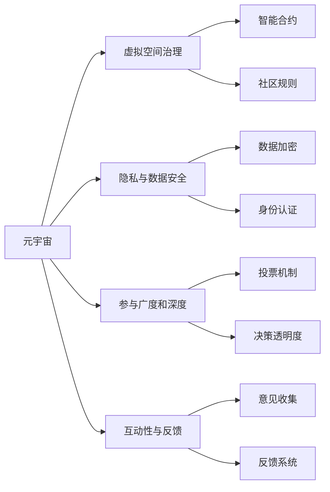

                 

# 数字化民主:元宇宙时代的公民参与

在技术迅猛发展的今天，数字化民主已然成为政府与公民共同关注的焦点。元宇宙时代的到来，不仅为数字化民主赋予了新的形式与内涵，也提出了诸多挑战与机遇。本文将深入探讨数字化民主在元宇宙时代的新面貌，包括核心概念、算法原理、实践策略及未来展望，为数字化民主的持续发展提供思路。

## 1. 背景介绍

### 1.1 问题由来

数字化民主（Digital Democracy）是指通过电子信息技术实现公民参与政治过程的方式。在互联网、大数据等技术推动下，数字化民主正逐渐成为现代民主制度的重要组成部分。然而，传统的数字化民主方式在效率、透明度和广泛性等方面存在一定的局限性。

随着元宇宙技术的发展，虚拟现实、增强现实和区块链等技术的融合，为数字化民主带来了新的可能性。元宇宙作为一种全新的数字空间，使得数字化民主不再局限于传统的线上线下融合，而是向虚拟世界拓展，为民主参与提供了全新的场景和平台。

### 1.2 问题核心关键点

元宇宙时代的数字化民主的核心关键点包括：

- **虚拟空间治理**：如何在虚拟空间中实现有效的治理和监督机制，避免现实世界中的问题在新空间中重现。
- **隐私与数据安全**：在数字化和虚拟化进程中，如何保障公民的隐私和数据安全，防止信息泄露和滥用。
- **参与广度和深度**：如何提升公民在虚拟空间中的参与广度和深度，使得民主参与更加全面和深入。
- **互动性与反馈**：如何设计良好的互动机制，使得公民能通过虚拟平台有效表达意见并得到反馈。

### 1.3 问题研究意义

研究元宇宙时代的数字化民主，对于提升政府治理能力、推动公民参与、实现信息透明等方面具有重要意义。具体而言：

1. **提升治理效率**：数字化民主能够通过在线平台实现快速高效的政治参与和决策过程。
2. **增强透明度**：通过数字化平台公开决策过程和结果，提高政治透明度和公众信任。
3. **扩大参与面**：元宇宙技术可以打破时间和空间的限制，使得更多公民能够参与到民主过程中。
4. **保障公民权利**：数字化平台能更好地保障公民的知情权、表达权和参与权。
5. **促进社会融合**：虚拟空间的多样性和包容性能够促进不同背景人群的交流和融合。

## 2. 核心概念与联系

### 2.1 核心概念概述

为更好地理解元宇宙时代的数字化民主，本节将介绍几个关键概念：

- **元宇宙（Metaverse）**：一个由多个虚拟空间互联构成的数字世界，用户可以在其中进行交互、工作和社交。
- **虚拟空间治理（Governance in Virtual Space）**：在元宇宙中，通过智能合约、社区规则等机制，实现虚拟空间的有效管理与监督。
- **隐私与数据安全（Privacy and Data Security）**：在数字化和虚拟化进程中，保护公民的个人信息和数据不被滥用或泄露。
- **参与广度和深度（Breadth and Depth of Participation）**：在虚拟空间中，如何提高公民参与的政治广度和深度。
- **互动性与反馈（Interactivity and Feedback）**：在虚拟空间中，如何设计良好的互动机制，使得公民能够有效表达意见并得到反馈。

这些概念之间通过以下Mermaid流程图展示其联系：



此图展示了元宇宙中的几个关键概念及其相互关系：

1. 元宇宙作为底层平台，通过虚拟空间治理、隐私与数据安全、参与广度和深度、互动性与反馈等机制实现民主参与。
2. 智能合约和社区规则是虚拟空间治理的核心，保障参与过程的公正性和透明性。
3. 数据加密和身份认证是隐私与数据安全的基石，确保公民信息不被滥用。
4. 投票机制和决策透明度是参与广度和深度的重要组成部分，提升参与者的积极性和信任度。
5. 意见收集和反馈系统是互动性的重要保障，使得公民能及时获得反馈并调整参与策略。

## 3. 核心算法原理 & 具体操作步骤

### 3.1 算法原理概述

元宇宙时代的数字化民主算法原理主要基于分布式账本技术、共识机制和交互协议。这些技术共同构成了数字化民主的核心算法框架。

1. **分布式账本技术**：区块链等分布式账本技术提供了不可篡改的记录存储机制，保障了民主决策过程的透明性和公正性。
2. **共识机制**：通过各种共识算法，如PoS、PoW、DPoS等，确保网络中的各个节点对决策过程达成一致，提升决策效率和准确性。
3. **交互协议**：设计良好的交互协议，使得公民能通过虚拟平台高效地进行意见表达和交流。

### 3.2 算法步骤详解

基于上述原理，数字化民主的算法步骤主要包括以下几个关键环节：

**Step 1: 平台搭建**
- 利用区块链等分布式账本技术，搭建元宇宙平台。
- 设计智能合约和社区规则，建立虚拟空间治理机制。
- 实现数据加密和身份认证机制，保障公民隐私和数据安全。

**Step 2: 参与机制设计**
- 设计投票机制，确保决策过程的公正性和透明性。
- 引入互动协议，提高公民参与的广度和深度。
- 设计反馈系统，保证意见表达和反馈的及时性和有效性。

**Step 3: 技术实现**
- 利用智能合约和区块链技术，实现投票和反馈的记录和验证。
- 引入自然语言处理技术，对公民意见进行分析和整合。
- 实现跨平台交互协议，确保不同用户之间的无缝对接。

**Step 4: 模型优化**
- 通过机器学习等技术，优化参与机制和交互协议。
- 引入区块链扩展技术，如分片、侧链等，提升平台的扩展性和性能。
- 定期更新平台，确保其功能和安全性。

### 3.3 算法优缺点

元宇宙时代的数字化民主算法具有以下优点：

1. **透明与公正**：基于区块链等分布式账本技术，保障了决策过程的透明性和公正性。
2. **高效与便捷**：通过智能合约和共识机制，提升了决策和参与的效率和便捷性。
3. **安全性与隐私保护**：数据加密和身份认证机制确保了公民隐私和数据的安全性。

同时，该算法也存在一些局限性：

1. **技术门槛高**：实现数字化民主需要高水平的技术支撑，可能导致一定的技术门槛。
2. **可扩展性问题**：随着用户数量和参与度的增加，平台性能和扩展性可能面临挑战。
3. **监管与法律问题**：如何在元宇宙中实施有效的监管和法律保障，仍需进一步探索。

### 3.4 算法应用领域

元宇宙时代的数字化民主算法在多个领域有广泛的应用前景：

- **政府治理**：通过虚拟空间实现政府决策和公共服务的透明化、便捷化。
- **社会参与**：在虚拟空间中促进公众参与和舆论监督，提升社会治理水平。
- **公共教育**：利用虚拟平台进行在线教育，推动教育公平和普及。
- **企业治理**：通过虚拟空间优化企业决策和员工参与机制。
- **国际合作**：通过虚拟空间促进跨国交流和合作，推动全球治理。

## 4. 数学模型和公式 & 详细讲解 & 举例说明

### 4.1 数学模型构建

本节将使用数学语言对元宇宙时代数字化民主的核心算法进行更加严格的刻画。

假设数字化民主平台为一个去中心化的区块链网络，每个节点代表一个参与者。参与者的行为可以表示为一个向量 $\mathbf{x} = [x_1, x_2, ..., x_n]$，其中 $x_i$ 表示第 $i$ 个节点的行为数据。

定义平台的共识算法为 $f$，投票结果为 $\mathbf{y}$，则数学模型可以表示为：

$$
\mathbf{y} = f(\mathbf{x}, \mathbf{w})
$$

其中 $\mathbf{w}$ 为共识算法的权重向量，影响共识过程的决策结果。

### 4.2 公式推导过程

假设一个简单的加权投票机制，投票结果为所有节点行为的加权和：

$$
y_i = \sum_{j=1}^n w_j x_j
$$

其中 $w_j$ 为节点 $j$ 的投票权重。若所有节点的权重相同，则投票结果为所有节点行为的简单平均：

$$
y_i = \frac{\sum_{j=1}^n x_j}{n}
$$

在实际应用中，投票权重和行为数据可以采用机器学习模型进行优化，如线性回归、逻辑回归等。

### 4.3 案例分析与讲解

以一个简单的民主选举为例，假设公民可以通过虚拟平台进行投票。每个公民的投票行为可以用一个 $[0,1]$ 区间内的数值表示，投票结果为所有公民投票行为的总和，即：

$$
y = \sum_{i=1}^n x_i
$$

其中 $y$ 表示最终的投票结果，$x_i$ 表示第 $i$ 个公民的投票行为。通过这种加权平均的投票机制，可以确保投票结果的透明性和公正性，同时提高参与的效率和便捷性。

## 5. 项目实践：代码实例和详细解释说明

### 5.1 开发环境搭建

在进行数字化民主项目实践前，我们需要准备好开发环境。以下是使用Python进行Web3开发的环境配置流程：

1. 安装Anaconda：从官网下载并安装Anaconda，用于创建独立的Python环境。

2. 创建并激活虚拟环境：
```bash
conda create -n web3-env python=3.8 
conda activate web3-env
```

3. 安装相关库：
```bash
conda install web3
pip install requests flask jsonrpcclient
```

4. 安装以太坊工具：
```bash
pip install eth-blockchain eth-compatible
```

5. 配置以太坊节点：
```bash
pip install eth-geth
```

完成上述步骤后，即可在`web3-env`环境中开始项目实践。

### 5.2 源代码详细实现

这里我们以一个简单的投票系统为例，展示如何使用Python和Web3技术实现数字化民主平台。

首先，定义投票函数：

```python
from web3 import Web3
from flask import Flask, request, jsonify

app = Flask(__name__)
w3 = Web3(Web3.HTTPProvider('http://127.0.0.1:8545'))

@app.route('/vote', methods=['POST'])
def vote():
    data = request.get_json()
    voter_address = data['address']
    candidate_address = data['candidate']
    value = data['value']
    
    # 向智能合约提交投票
    tx = w3.eth.sendTransaction({'to': candidate_address, 'value': value})
    return jsonify({'message': 'Vote submitted successfully.'})
```

然后，部署智能合约：

```python
from ethcontract import CompileSource
from ethcontract import make_all_using_solidity

# 编译智能合约
contract_source = CompileSource("""pragma solidity ^0.6.0;
contract Voting {
    uint256 public vote_count = 0;
    uint256 public total_votes = 0;
    mapping(address => uint256) public vote_map;
    
    function vote(address candidate, uint256 value) public {
        require(msg.sender != address(0));
        require(candidate != address(0));
        vote_map[msg.sender] = value;
        vote_count += value;
        total_votes += 1;
    }
    
    function get_vote_count(address voter) public view returns (uint256) {
        return vote_map[voter];
    }
    
    function get_total_votes() public view returns (uint256) {
        return total_votes;
    }
}
""")

# 创建智能合约实例
contract_abi = make_all_using_solidity(contract_source['data'])
contract_addr = w3.eth.contract(address=contract_source['address'], abi=contract_abi).address

# 在区块链上部署智能合约
tx = w3.eth.sendTransaction({'to': contract_addr, 'value': 0, 'gas': 3000000})
w3.eth.waitForTransactionReceipt(tx)
```

最后，启动Web服务：

```python
if __name__ == '__main__':
    app.run(debug=True, host='0.0.0.0', port=5000)
```

启动后，通过Web服务向智能合约提交投票，即可实现数字化民主投票系统。

### 5.3 代码解读与分析

让我们再详细解读一下关键代码的实现细节：

**投票函数**：
- 接收来自前端的投票请求，包含投票人的地址、候选人的地址和投票值。
- 调用智能合约的`vote`函数提交投票，并返回投票结果。

**智能合约**：
- 定义了一个`Voting`合约，记录投票总数、每个投票人的投票值。
- 通过`vote`函数提交投票，`get_vote_count`和`get_total_votes`函数分别获取投票人和投票总数。

**Web服务部署**：
- 使用Flask框架创建Web服务，绑定端口5000。
- 启动服务后，前端可以通过HTTP请求提交投票。

该代码示例展示了如何利用Web3技术和智能合约实现一个简单的投票系统，构建数字化民主平台的基础功能。

## 6. 实际应用场景

### 6.1 智慧城市治理

智慧城市治理是元宇宙时代数字化民主的重要应用场景之一。通过数字化民主平台，市民可以参与城市规划、公共服务评价、公共安全监督等各个方面，提升城市治理的透明度和效率。

具体应用包括：

- **城市规划**：市民可以通过虚拟平台对城市建设方案进行投票和反馈，确保城市规划符合公众需求。
- **公共服务评价**：市民可以对城市公共服务进行评价和打分，提供数据支持城市服务优化。
- **公共安全监督**：市民可以通过虚拟平台提交公共安全问题，并参与问题解决方案的讨论和投票。

### 6.2 企业内部管理

数字化民主在企业内部管理中也具有广泛的应用前景。通过虚拟平台，员工可以参与公司决策、项目评审、绩效考核等过程，提升企业管理的透明性和公正性。

具体应用包括：

- **公司决策**：员工可以通过虚拟平台对公司重大决策进行投票和反馈，确保决策过程的公正性和透明性。
- **项目评审**：项目评审团队可以通过虚拟平台进行项目评审和评分，确保评审过程的公正性。
- **绩效考核**：员工可以通过虚拟平台参与绩效考核的评价和反馈，提升考核过程的公平性。

### 6.3 社会公益项目

数字化民主在社会公益项目中也具有重要作用。通过虚拟平台，公众可以参与公益项目的评选和监督，确保公益资金的透明使用和公正分配。

具体应用包括：

- **公益项目评选**：市民可以通过虚拟平台参与公益项目的评选和投票，确保评选过程的公正性和透明性。
- **公益资金监督**：市民可以通过虚拟平台监督公益资金的使用情况，确保资金透明和公正。
- **公益效果评估**：市民可以对公益项目的效果进行评估和反馈，促进公益项目的持续优化。

### 6.4 未来应用展望

随着元宇宙技术的发展，数字化民主将呈现以下几个发展趋势：

1. **虚拟空间治理的完善**：元宇宙平台将不断优化虚拟空间治理机制，确保参与过程的公正性和透明性。
2. **隐私与数据安全的提升**：通过更先进的加密技术和身份认证机制，保护公民的隐私和数据安全。
3. **参与机制的创新**：引入更多互动机制和反馈系统，提升公民参与的广度和深度。
4. **跨平台互操作**：实现不同虚拟平台之间的互操作，打破平台壁垒，促进跨平台参与。
5. **区块链技术的扩展**：引入更多区块链扩展技术，提升平台的扩展性和性能。

## 7. 工具和资源推荐

### 7.1 学习资源推荐

为了帮助开发者系统掌握数字化民主的理论基础和实践技巧，这里推荐一些优质的学习资源：

1. **《区块链技术与数字民主》**：介绍了区块链技术和数字化民主的基本概念和应用场景。
2. **《Web3.0与数字民主》**：讲解了Web3.0技术和数字化民主平台的构建方法。
3. **《分布式账本与智能合约》**：详细介绍了分布式账本技术和智能合约的设计和实现。
4. **《自然语言处理与数字化民主》**：探讨了自然语言处理技术在数字化民主中的应用。
5. **《元宇宙与数字化民主》**：分析了元宇宙技术在数字化民主中的作用和潜力。

通过对这些资源的学习实践，相信你一定能够快速掌握数字化民主的技术框架和实现细节。

### 7.2 开发工具推荐

高效的开发离不开优秀的工具支持。以下是几款用于数字化民主开发的常用工具：

1. **Python**：基于Python的高性能Web框架，如Flask、Django等，适合快速开发Web服务。
2. **Web3.js**：用于与区块链交互的JavaScript库，支持多个以太坊客户端。
3. **IPython**：交互式Python环境，方便调试和测试代码。
4. **Jupyter Notebook**：用于数据可视化和代码执行的在线笔记本工具，适合跨平台开发。
5. **VS Code**：现代化的开发环境，支持多种编程语言和插件。

合理利用这些工具，可以显著提升数字化民主开发的效率，加快创新迭代的步伐。

### 7.3 相关论文推荐

数字化民主的研究源于学界的持续探索。以下是几篇奠基性的相关论文，推荐阅读：

1. **《数字民主与区块链技术》**：探讨了区块链技术在数字化民主中的作用和挑战。
2. **《分布式账本与透明治理》**：分析了分布式账本技术在透明治理中的应用。
3. **《智能合约与公共决策》**：介绍了智能合约在公共决策中的设计与应用。
4. **《自然语言处理与公共参与》**：探讨了自然语言处理技术在公共参与中的应用。
5. **《元宇宙与数字治理》**：分析了元宇宙技术在数字治理中的作用和前景。

这些论文代表了大规模语言模型微调技术的发展脉络。通过学习这些前沿成果，可以帮助研究者把握学科前进方向，激发更多的创新灵感。

## 8. 总结：未来发展趋势与挑战

### 8.1 总结

本文对元宇宙时代的数字化民主进行了全面系统的介绍。首先阐述了数字化民主在元宇宙时代的背景和意义，明确了数字化民主在提升政府治理能力、推动公民参与等方面的重要作用。其次，从原理到实践，详细讲解了数字化民主的核心算法和实现步骤，提供了数字化民主平台构建的完整代码示例。同时，本文还广泛探讨了数字化民主在智慧城市治理、企业内部管理、社会公益项目等多个领域的应用前景，展示了数字化民主的广阔前景。

通过本文的系统梳理，可以看到，元宇宙时代的数字化民主正处于蓬勃发展阶段，其未来发展潜力不可限量。

### 8.2 未来发展趋势

展望未来，元宇宙时代的数字化民主将呈现以下几个发展趋势：

1. **技术融合创新**：数字化民主将与其他新兴技术（如AI、物联网、VR/AR等）进行深度融合，提升民主参与的效率和质量。
2. **平台生态建设**：构建多元化的数字化民主平台生态，推动不同平台之间的互操作和互联互通。
3. **全球治理应用**：在元宇宙中实现全球范围内的民主参与和治理，促进国际合作与交流。
4. **政策法规完善**：制定和完善数字化民主相关的政策和法规，保障公民权利和平台安全。
5. **社会影响评估**：研究数字化民主对社会、经济、文化等方面的影响，推动数字化民主的可持续健康发展。

以上趋势凸显了元宇宙时代数字化民主的巨大潜力，为构建安全、高效、包容的数字民主社会提供了新的思路。

### 8.3 面临的挑战

尽管元宇宙时代的数字化民主具有广阔前景，但在实际应用中仍面临诸多挑战：

1. **技术壁垒**：数字化民主的实现需要高水平的技术支撑，技术门槛较高。
2. **数据隐私**：在数字化和虚拟化进程中，如何保障公民的隐私和数据安全，防止信息泄露和滥用。
3. **法律和监管**：如何在元宇宙中实施有效的监管和法律保障，确保平台的公正性和透明性。
4. **用户接受度**：如何提升公众对数字化民主的接受度和参与度，克服传统习惯和心理障碍。
5. **平台安全**：保障平台的安全性，防止黑客攻击和数据篡改。

### 8.4 研究展望

面对数字化民主所面临的挑战，未来的研究需要在以下几个方面寻求新的突破：

1. **技术创新**：开发更加高效、安全、可扩展的技术，提升数字化民主的实现能力。
2. **隐私保护**：引入先进的隐私保护技术，确保公民隐私和数据安全。
3. **法规和政策**：制定和完善数字化民主相关的法规和政策，确保平台的公正性和透明性。
4. **社会参与**：通过教育引导和政策激励，提升公众对数字化民主的接受度和参与度。
5. **平台安全**：开发安全防护机制，保障平台的安全性。

这些研究方向的探索，必将引领元宇宙时代的数字化民主走向更高的台阶，为构建安全、可靠、可解释、可控的智能系统铺平道路。面向未来，数字化民主需要与其他人工智能技术进行更深入的融合，如知识表示、因果推理、强化学习等，多路径协同发力，共同推动民主制度的发展。只有勇于创新、敢于突破，才能不断拓展数字化民主的边界，让民主技术更好地服务于社会。

## 9. 附录：常见问题与解答

**Q1：数字化民主是否适用于所有公民？**

A: 数字化民主旨在打破时间和空间的限制，使得所有公民能够平等参与。然而，在实际应用中，仍然需要考虑公民的年龄、教育水平、数字素养等因素，确保参与的公平性和广泛性。

**Q2：数字化民主如何保障数据隐私？**

A: 数字化民主平台应采用先进的数据加密技术和身份认证机制，确保公民数据的安全性和隐私性。同时，建立严格的数据访问控制和审计机制，防止数据泄露和滥用。

**Q3：数字化民主面临的主要挑战是什么？**

A: 数字化民主面临的主要挑战包括技术壁垒、数据隐私、法律和监管、用户接受度、平台安全等。克服这些挑战需要多方面的努力，包括技术创新、政策制定、教育引导、安全防护等。

**Q4：数字化民主的未来发展方向是什么？**

A: 数字化民主的未来发展方向包括技术融合创新、平台生态建设、全球治理应用、政策法规完善、社会影响评估等。只有通过多方面的努力，才能实现数字化民主的可持续健康发展。

作者：禅与计算机程序设计艺术 / Zen and the Art of Computer Programming

