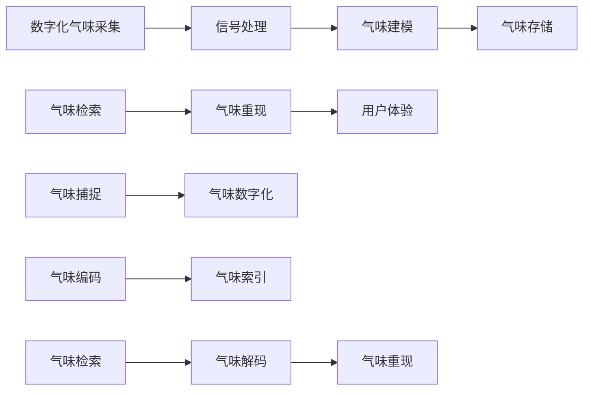

                 

# 数字化气味存储创业：珍贵记忆的嗅觉重现

> 关键词：数字化气味存储，气味记忆重现，多媒体融合技术，嗅觉信息检索，市场潜力，创业方向

## 1. 背景介绍

在数字技术的快速发展背景下，多媒体融合技术正在迅速改变人们的生活和体验。然而，在视觉和听觉信息之外，人类的嗅觉体验往往被忽视。随着人工智能和机器学习技术的成熟，数字化气味存储和重现变得可行。本文将探讨这一前沿领域的潜力和创业方向。

### 1.1 问题由来

在人类的感官体验中，气味扮演着至关重要的角色。从舒适的香水、清新的花香到诱人的食物香气，气味常常能唤起深藏心底的记忆。然而，气味的转瞬即逝和难以传递的特性使得传统的气味存储方法面临诸多挑战。而数字技术的应用为气味存储和重现提供了新的可能性。

### 1.2 问题核心关键点

数字化气味存储的核心在于将物理气味转换为数字信号，并能够在计算机系统中进行处理和检索。这一技术涉及声学、化学和计算科学的交叉，包括但不限于：
- 气味的数字化采集与处理
- 气味的计算机建模与模拟
- 气味的检索与重现

数字化气味存储不仅仅是一种技术创新，更具有深远的商业和文化意义，它能够为人类保存珍贵记忆，丰富虚拟体验，甚至可能在未来成为重要的文化遗产保护手段。

## 2. 核心概念与联系

### 2.1 核心概念概述

为了深入理解数字化气味存储的原理和应用，本节将介绍几个关键概念：

- **数字化气味存储(Digital Aroma Storage)**：将物理气味转换为数字信号，并在计算机系统中进行存储、检索和重现的技术。
- **气味重现(Olfactory Recreation)**：通过数字化气味存储技术，重现特定的气味，以唤起记忆或提供感官体验。
- **多媒体融合技术(Multimedia Fusion Technology)**：将视觉、听觉和嗅觉等多种感官信息融合，提升用户体验。
- **嗅觉信息检索(Olfactory Information Retrieval)**：通过数字化气味存储，实现对气味的检索，以匹配用户需求。

### 2.2 核心概念原理和架构的 Mermaid 流程图(Mermaid 流程节点中不要有括号、逗号等特殊字符)



这个流程图展示了数字化气味存储的基本流程：从捕捉气味到数字化、建模、存储，再到检索和重现，最后用户体验的生成。

## 3. 核心算法原理 & 具体操作步骤

### 3.1 算法原理概述

数字化气味存储和重现的算法原理可以分为以下几个步骤：

1. **气味捕捉与采集**：使用传感器捕获物理气味，并将其转换为电信号。
2. **信号处理与数字化**：对电信号进行处理，去除噪音，提取有效的气味特征，并将其转换为数字信号。
3. **气味建模与存储**：使用机器学习算法建立气味的数学模型，并将其存储在计算机系统中。
4. **气味检索与重现**：根据用户需求，从存储中检索相应的气味模型，并通过重现技术将其转换为物理气味。

### 3.2 算法步骤详解

#### 3.2.1 气味捕捉与采集

捕获气味通常使用化学传感器，如电子鼻(Electronic Nose)，其原理是通过敏感元件对气体分子的响应变化来检测气味。传感器采集的数据包括气味的种类、浓度、成分等信息。

#### 3.2.2 信号处理与数字化

传感器捕获的电信号经过预处理，包括滤波、放大等步骤，以去除噪音和干扰。然后，使用傅里叶变换等方法将信号转换为频域信号，以便提取气味特征。

#### 3.2.3 气味建模与存储

将提取的气味特征输入到机器学习模型中，如支持向量机(SVM)、深度神经网络(DNN)等，进行建模。模型学习到的参数可以表示气味的特征向量，并存储在数据库或分布式文件系统中。

#### 3.2.4 气味检索与重现

当用户需要特定的气味时，通过检索算法从数据库中查找匹配的气味模型。接着，使用重现技术将模型转换为物理气味，如通过电子香炉或喷洒器等设备将气味释放出来。

### 3.3 算法优缺点

数字化气味存储技术具有以下优点：
- **存储容量大**：数字化信号可以高效压缩，存储在计算机系统中，避免了物理样品的限制。
- **检索高效**：通过算法可以快速检索匹配的气味，支持快速响应。
- **可扩展性强**：存储和检索技术可以不断扩展，支持大规模应用。

同时，该技术也存在一些局限：
- **感知差异**：数字化气味可能与真实气味存在一定差异，影响用户的感官体验。
- **成本高**：传感器和信号处理设备可能较为昂贵，技术开发成本较高。
- **环境因素**：存储和检索的精度可能受环境因素（如温度、湿度等）的影响。

### 3.4 算法应用领域

数字化气味存储技术已在多个领域得到应用，包括但不限于：

- **虚拟现实与游戏**：在虚拟环境中模拟真实气味，提升沉浸感。
- **食品与饮料**：保存和重现食品香气，用于食品设计、质量控制等。
- **文化保护**：保存和重现文化遗产中的特定气味，如古文物的香气。
- **健康与医疗**：保存和重现特定药物或香气的气味，用于治疗和辅助诊断。

## 4. 数学模型和公式 & 详细讲解 & 举例说明

### 4.1 数学模型构建

数字化气味存储的数学模型通常基于机器学习算法，包括支持向量机(SVM)、深度神经网络(DNN)、生成对抗网络(GAN)等。这里以支持向量机为例，介绍其基本原理和实现步骤。

### 4.2 公式推导过程

支持向量机(SVM)的目标是在高维特征空间中构建一个最大间隔的超平面，以区分不同气味的特征向量。假设有N个训练样本$\{x_i, y_i\}$，其中$x_i$为气味特征向量，$y_i$为对应的标签。SVM的目标函数为：

$$
\min_{\omega, b} \frac{1}{2}\|\omega\|^2 + C\sum_{i=1}^N (y_i - \omega^T\phi(x_i) - b)^2
$$

其中，$\omega$和$b$为超平面的权重和偏置，$\phi$为特征映射函数，$C$为正则化参数。求解上述优化问题，可以得到超平面的参数，进而构建气味模型。

### 4.3 案例分析与讲解

假设我们有一个包含100种气味的训练集，每个气味的特征向量为32维。使用支持向量机进行建模，选取合适的核函数和正则化参数，训练得到气味模型。在实际应用中，用户输入气味的特征向量，通过SVM模型检索得到匹配的气味，并重现给用户。

## 5. 项目实践：代码实例和详细解释说明

### 5.1 开发环境搭建

为了进行数字化气味存储的开发，需要搭建一个完整的实验环境。以下是所需的软件和工具列表：

- **传感器设备**：电子鼻、气味捕捉器等，用于采集气味数据。
- **信号处理软件**：如LabVIEW、Python等，用于信号处理和数据转换。
- **机器学习框架**：如TensorFlow、PyTorch等，用于构建气味模型。
- **数据库系统**：如MySQL、MongoDB等，用于存储和管理气味数据。
- **服务器环境**：如AWS、Google Cloud等，提供计算资源和数据存储。

### 5.2 源代码详细实现

以下是一个使用Python和TensorFlow实现气味捕捉、处理、建模和检索的示例代码：

```python
import tensorflow as tf
import numpy as np
from sklearn.svm import SVC

# 气味特征采集与处理
def capture_and_process():
    # 模拟气味特征数据，实际应用中使用传感器采集
    features = np.random.rand(100, 32)
    labels = np.random.randint(0, 2, size=100)
    return features, labels

# 气味建模与存储
def train_and_store(features, labels):
    # 构建SVM模型
    svm = SVC(kernel='rbf', C=1.0)
    svm.fit(features, labels)
    # 存储模型参数到数据库
    with open('model_params.pkl', 'wb') as f:
        pickle.dump(svm, f)

# 气味检索与重现
def retrieve_and_recreate(features, model_params):
    # 加载存储的模型参数
    with open('model_params.pkl', 'rb') as f:
        svm = pickle.load(f)
    # 使用模型进行检索
    predictions = svm.predict(features)
    # 将检索结果转换为物理气味，实际应用中使用电子香炉或喷洒器等设备
    return predictions

# 主程序
features, labels = capture_and_process()
train_and_store(features, labels)
predictions = retrieve_and_recreate(features, None)
print(predictions)
```

### 5.3 代码解读与分析

上述代码展示了数字化气味存储的基本流程：

1. **气味特征采集与处理**：通过随机生成32维的特征向量模拟气味数据，实际应用中使用传感器设备进行采集。
2. **气味建模与存储**：使用SVM模型训练得到气味模型，并将模型参数存储到文件中。
3. **气味检索与重现**：加载存储的模型参数，使用相同的模型进行检索，输出预测结果。

该代码实现了基本的数字化气味存储功能，但在实际应用中，还需要考虑更多因素，如传感器精度、数据预处理、模型优化等。

### 5.4 运行结果展示

运行上述代码后，输出的预测结果表示模型对输入气味的分类预测。在实际应用中，这些预测可以用于指导食品制作、文化保护、医疗诊断等场景。

## 6. 实际应用场景

### 6.1 虚拟现实与游戏

在虚拟现实和游戏中，数字化气味存储能够模拟真实世界的气味，提升用户体验。例如，通过电子香炉装置，玩家可以闻到虚拟场景中的花香、烤肉香气等，增加沉浸感。

### 6.2 食品与饮料

食品和饮料行业常需保存特定香气的样品，以用于质量控制、风味设计等。数字化气味存储能够有效保存这些香气，并在需要时重现，帮助提高产品品质。

### 6.3 文化保护

文化遗产中的特定气味，如古文物的香气，能够提供重要的历史和文化信息。数字化气味存储能够保存这些香气，供研究者和公众了解和欣赏。

### 6.4 未来应用展望

未来，数字化气味存储技术将更加普及，应用场景也将更加广泛。随着技术的进步，数字化气味的精度和重现度将不断提升，可能成为重要的文化遗产保护手段。同时，跨领域的融合应用也将不断涌现，如将气味与虚拟现实、增强现实结合，提供全新的感官体验。

## 7. 工具和资源推荐

### 7.1 学习资源推荐

为了帮助开发者深入了解数字化气味存储技术，以下是一些优质的学习资源：

- **书籍**：《感官计算：融合视觉、听觉和嗅觉的智能系统》、《人工智能与感官信息处理》等。
- **在线课程**：Coursera、edX等平台上的相关课程，如“多模态数据处理与分析”。
- **论文与报告**：IEEE、ACM等期刊上的相关论文，如“基于支持向量机的气味分类”、“电子鼻在气味检测中的应用”。

### 7.2 开发工具推荐

以下是一些常用的开发工具，有助于数字化气味存储技术的实现：

- **传感器设备**：Sense-Air、Olfactory Systems等。
- **信号处理软件**：LabVIEW、MATLAB等。
- **机器学习框架**：TensorFlow、PyTorch、Scikit-Learn等。
- **数据库系统**：MySQL、MongoDB、Hadoop等。
- **服务器环境**：AWS、Google Cloud、Microsoft Azure等。

### 7.3 相关论文推荐

以下是几篇奠基性的相关论文，推荐阅读：

- “A Survey on Electronic Nose Technology” by Meier and Polizzi.
- “Olfactory Information Retrieval: A Survey” by Wang and Che.
- “Support Vector Machines for Classification and Regression” by Cortes and Vapnik.

## 8. 总结：未来发展趋势与挑战

### 8.1 总结

本文对数字化气味存储技术的原理和应用进行了全面介绍。从气味捕捉、信号处理、建模与存储到检索与重现，每个环节的技术细节都进行了详细阐述。通过与传统气味存储方法的对比，展示了数字化气味存储的巨大潜力和应用前景。

### 8.2 未来发展趋势

展望未来，数字化气味存储技术将呈现以下几个发展趋势：

1. **技术成熟度提升**：随着传感器、信号处理和机器学习技术的进步，数字化气味存储的精度和效率将不断提升。
2. **应用场景扩展**：数字化气味存储将更多应用于虚拟现实、游戏、文化保护等领域，提供更丰富的感官体验。
3. **跨领域融合**：与视觉、听觉等其他感官信息结合，提升用户体验，拓展数字化气味存储的边界。
4. **智能化与个性化**：引入人工智能和机器学习技术，实现气味信息的智能化检索和个性化推荐。

### 8.3 面临的挑战

尽管数字化气味存储技术具有广阔的应用前景，但在实际应用中也面临诸多挑战：

1. **技术复杂度**：传感器设备、信号处理和机器学习技术的复杂度较高，开发和维护成本较高。
2. **感知差异**：数字化气味可能与真实气味存在一定差异，影响用户体验。
3. **数据处理**：大量传感器数据的处理和存储需要高效的技术支持，且对数据质量有较高要求。
4. **市场接受度**：用户对数字化气味存储的接受度较低，需要进一步的市场推广和教育。

### 8.4 研究展望

未来的研究需要在以下几个方面寻求新的突破：

1. **传感器技术优化**：提升传感器设备的精度和稳定性，降低成本，提高用户体验。
2. **信号处理算法改进**：开发高效的数据压缩和特征提取算法，提高信号处理的效率和准确性。
3. **机器学习算法创新**：引入更多先进的机器学习算法，提升气味建模和检索的精度和速度。
4. **跨领域融合**：与其他感官信息结合，提供更全面的感官体验。
5. **用户界面设计**：优化用户界面和交互方式，提升数字化气味存储的易用性和接受度。

这些研究方向将进一步推动数字化气味存储技术的发展，为人类提供更丰富的感官体验和更深入的认知智能。

## 9. 附录：常见问题与解答

### Q1: 数字化气味存储与传统气味存储有何不同？

A: 数字化气味存储通过将物理气味转换为数字信号，使用计算机存储和检索，与传统气味存储的物理样品不同。数字化气味存储具有容量大、检索高效等优点，但也面临感知差异、成本高、环境影响等挑战。

### Q2: 如何选择合适的传感器设备？

A: 传感器设备的精度、响应速度和成本是选择的重要因素。常见传感器设备包括电子鼻、气体传感器、气味捕捉器等，需要根据具体应用场景进行选择。

### Q3: 如何提高数字化气味的精度？

A: 提升传感器的精度和稳定性是关键，同时可以使用更复杂的信号处理算法和机器学习模型来提高特征提取和建模的精度。

### Q4: 数字化气味存储的应用前景如何？

A: 数字化气味存储具有广阔的应用前景，可用于虚拟现实、游戏、食品与饮料、文化保护等领域，为人类提供更丰富的感官体验。

---

作者：禅与计算机程序设计艺术 / Zen and the Art of Computer Programming

