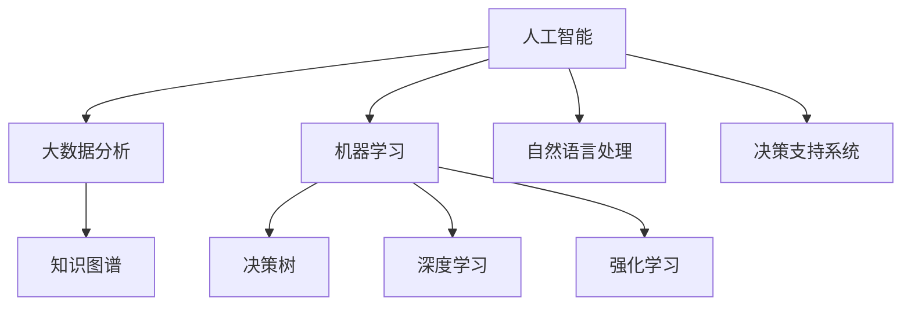

                 

## 1. 背景介绍

### 1.1 问题由来
随着信息技术的飞速发展，人类的生活和学习方式正在经历深刻变革。智能化技术的广泛应用使得决策过程中充满了数据分析和预测的元素。人工智能(AI)以其高效、准确、规模化的优势，在众多领域逐步替代了传统的人类决策。然而，人工智能在提升效率的同时，也面临着数据伦理、可解释性、安全性等诸多挑战。如何在利用AI技术的优势的同时，进一步增强人类的直觉判断，实现智能化与人类经验的有机结合，成为了一个亟待解决的问题。

### 1.2 问题核心关键点
在当前的数字化时代，如何通过AI技术更好地辅助人类决策，提升决策的科学性和效率，成为了热点话题。数字化直觉（Digital Intuition）的概念应运而生，旨在将AI技术的理性分析与人类经验直觉相结合，形成更强大的决策能力。

数字化直觉的实现关键在于：
1. **数据驱动决策**：利用大数据分析和机器学习算法，挖掘数据中的潜在模式和关联。
2. **知识图谱构建**：通过符号化知识与机器学习模型的结合，构建先验知识体系。
3. **直觉增强**：通过AI模型的辅助决策，增强人类决策的准确性和鲁棒性。
4. **智能交互**：通过自然语言处理技术，实现与AI系统的智能对话，优化决策过程。

### 1.3 问题研究意义
数字化直觉的研究对于提升人类决策的科学性和效率具有重要意义：

1. **提高决策准确性**：结合AI的强大数据处理能力与人类直觉判断，能够在复杂环境中做出更为准确和高效的决策。
2. **增强决策速度**：利用AI的快速分析和处理能力，能够显著缩短决策周期。
3. **促进知识共享**：将大量隐性知识转换为显性知识，便于团队协作和经验传承。
4. **提升决策可解释性**：将决策过程和依据进行可视化，增加决策透明度和信任度。
5. **增强决策安全性**：利用AI进行风险评估和预测，降低决策失误和潜在风险。

## 2. 核心概念与联系

### 2.1 核心概念概述

为更好地理解数字化直觉，本节将介绍几个关键核心概念：

- **人工智能（AI）**：一种旨在模拟人类智能行为的技术，包括学习、推理、自我修正等。
- **大数据分析**：通过收集、存储、分析海量数据，从中挖掘出潜在模式和关联。
- **机器学习（ML）**：一种利用算法使计算机系统从数据中自动学习的技术，实现模式识别、预测和决策。
- **自然语言处理（NLP）**：使计算机能够理解、处理和生成人类语言的技术。
- **知识图谱**：一种用于表示和查询知识结构化信息的技术，通过符号化的知识库构建知识网络。
- **决策树**：一种用于分类和回归的统计模型，通过树形结构展现决策过程。
- **深度学习**：一种基于神经网络结构的机器学习方法，能够处理复杂非线性问题。
- **强化学习（RL）**：一种通过试错优化行为策略的学习方法，常用于自动驾驶、游戏等场景。
- **决策支持系统（DSS）**：一种集成AI技术，为决策者提供数据支持、分析建议和决策辅助的系统。

这些核心概念之间的逻辑关系可以通过以下Mermaid流程图来展示：



这个流程图展示了一系列核心概念的关联：

1. 人工智能技术通过大数据分析和机器学习获得海量数据和知识。
2. 自然语言处理技术实现对人类语言的理解与生成，辅助决策。
3. 知识图谱通过符号化知识构建，为决策提供先验支持。
4. 深度学习和强化学习技术提供强大的模式识别和策略优化能力。
5. 决策支持系统集成以上技术，提供决策辅助。

这些概念共同构成了数字化直觉的理论基础，使得AI与人类决策能力紧密结合。

## 3. 核心算法原理 & 具体操作步骤
### 3.1 算法原理概述

数字化直觉的核心算法原理主要包括数据驱动决策、知识图谱构建、AI辅助决策和智能交互等。这些算法原理相互结合，形成一个完整的决策辅助系统。

- **数据驱动决策**：利用大数据分析和机器学习算法，挖掘数据中的潜在模式和关联，作为决策依据。
- **知识图谱构建**：通过符号化知识与机器学习模型的结合，构建先验知识体系，作为决策的知识储备。
- **AI辅助决策**：通过AI模型辅助决策，增强决策的准确性和鲁棒性，同时提升决策速度。
- **智能交互**：通过自然语言处理技术，实现与AI系统的智能对话，优化决策过程。

这些算法原理在数字化直觉的实现中扮演着重要角色，相互协同提升决策的科学性和效率。

### 3.2 算法步骤详解

数字化直觉的实现通常遵循以下步骤：

**Step 1: 数据收集与预处理**
- 收集与决策任务相关的海量数据，包括结构化数据（如数据库、表格）和半结构化数据（如文本、图像）。
- 对数据进行清洗、去重和标注，确保数据质量和一致性。

**Step 2: 特征提取与分析**
- 利用机器学习算法，如PCA、LDA、FAC等，从原始数据中提取关键特征。
- 使用深度学习模型（如CNN、RNN、Transformers等）对数据进行建模，挖掘潜在的模式和关联。
- 构建知识图谱，将结构化知识与数据模型进行融合，形成结构化的知识网络。

**Step 3: 决策模型构建**
- 使用决策树、随机森林、神经网络等模型进行决策树的构建。
- 集成多种算法模型，形成具有鲁棒性的综合决策模型。
- 引入AI辅助决策，通过深度学习模型进行数据预测和决策建议。

**Step 4: 交互界面设计与实现**
- 设计自然语言处理界面，实现与AI系统的智能对话。
- 集成可视化工具，对决策过程和结果进行可视化展示。
- 实现决策报告和建议，辅助决策者进行决策。

**Step 5: 持续优化与反馈**
- 根据实际决策结果进行模型评估和优化。
- 收集决策者反馈，优化模型和交互界面。
- 持续迭代，不断提升决策模型的科学性和效率。

### 3.3 算法优缺点

数字化直觉的算法具有以下优点：
1. **高效性**：利用大数据分析和机器学习算法，快速挖掘数据中的模式和关联，辅助决策。
2. **准确性**：通过符号化知识和AI辅助决策，显著提升决策的准确性和鲁棒性。
3. **透明性**：将决策过程和依据进行可视化展示，增加决策的透明度和信任度。
4. **可解释性**：利用AI模型提供决策建议，解释决策依据和过程，便于理解和接受。

然而，数字化直觉也存在以下缺点：
1. **依赖高质量数据**：数据质量和数量的提升是实现数字化直觉的基础。
2. **算法复杂度高**：算法的复杂性和计算资源的消耗可能影响系统效率。
3. **模型偏见**：数据和算法中的偏见可能影响决策的公平性和公正性。
4. **安全性问题**：决策系统的安全性可能受到网络攻击和数据泄露的威胁。
5. **伦理道德问题**：AI决策可能引发伦理和道德问题，需要严格控制和监督。

### 3.4 算法应用领域

数字化直觉已经在多个领域得到了广泛应用，例如：

- **金融决策**：在股票市场、风险评估、贷款审批等金融决策中，利用大数据分析和AI辅助决策，提升决策的科学性和准确性。
- **医疗诊断**：在疾病诊断、治疗方案选择等医疗决策中，利用知识图谱和深度学习模型，辅助医生进行精准诊断。
- **智能制造**：在生产调度和质量控制等智能制造决策中，利用数据驱动决策和AI辅助优化，提升生产效率和质量。
- **智能交通**：在交通流量预测、路径规划等智能交通决策中，利用大数据分析和AI模型，优化交通管理和调度。
- **智能零售**：在库存管理、商品推荐等智能零售决策中，利用数据挖掘和AI辅助决策，提升用户体验和销售效率。

除了上述这些经典应用外，数字化直觉技术还在更多场景中得到创新性地应用，如智慧城市、教育、物流等，为各行各业带来了全新的决策支持能力。

## 4. 数学模型和公式 & 详细讲解 & 举例说明

### 4.1 数学模型构建

数字化直觉的数学模型主要基于机器学习、深度学习、符号推理和自然语言处理等理论，构建一个集成化的决策辅助系统。以下是对几个关键数学模型的介绍：

**数据驱动决策模型**：
- **线性回归**：形式化表示为 $y = \beta_0 + \beta_1x_1 + ... + \beta_nx_n + \epsilon$，其中 $y$ 为决策目标，$x_1,...,x_n$ 为特征变量，$\beta$ 为回归系数，$\epsilon$ 为误差项。
- **决策树**：形式化表示为 $DecisionTree(T)$，其中 $T$ 表示决策树的根节点。
- **随机森林**：通过集成多个决策树，提升模型的准确性和鲁棒性。

**知识图谱构建模型**：
- **知识图谱表示**：通常使用三元组形式 $(h, r, t)$ 表示，其中 $h$ 为头实体，$r$ 为关系，$t$ 为尾实体。
- **知识推理**：利用逻辑推理规则，从知识图谱中推理出新的知识和事实。

**AI辅助决策模型**：
- **神经网络模型**：如多层感知器（MLP）、卷积神经网络（CNN）、循环神经网络（RNN）、Transformer等，用于处理非线性模式。
- **强化学习模型**：如Q-learning、SARSA等，用于优化决策策略。

**智能交互模型**：
- **自然语言处理模型**：如BERT、GPT等，用于处理和理解自然语言。
- **对话系统模型**：如Seq2Seq、Transformer等，用于生成对话回复。

### 4.2 公式推导过程

以下是几个关键数学模型的推导过程：

**线性回归**：
假设输入特征为 $x_1, ..., x_n$，输出为目标变量 $y$，回归系数为 $\beta$，误差项为 $\epsilon$。根据最小二乘法，目标函数为：
$$ \min_{\beta} \sum_{i=1}^N (y_i - \beta_0 - \beta_1x_{i1} - ... - \beta_nx_{in})^2 $$
求解该目标函数，得到回归系数 $\beta$ 的估计值：
$$ \beta = (\sum_{i=1}^N x_i x_i^T)^{-1} \sum_{i=1}^N x_i y_i $$
$$ \beta_0 = \bar{y} - \sum_{i=1}^n \beta_i \bar{x}_i $$

**决策树**：
假设输入特征为 $x_1, ..., x_n$，输出为目标变量 $y$。决策树的构建过程如下：
1. 选择最佳特征 $x_j$ 作为决策树的根节点。
2. 根据特征 $x_j$ 将数据集分成两个子集 $S_1, S_2$。
3. 递归构建决策树的左子树 $T_1$ 和右子树 $T_2$。

**知识图谱推理**：
假设知识图谱中包含三元组 $(h, r, t)$，推理规则为 $\phi(h, r, t)$，推理过程如下：
1. 从知识图谱中获取三元组 $(h, r, t)$。
2. 根据推理规则 $\phi(h, r, t)$，推导出新的三元组 $(h', r', t')$。
3. 将新推导的三元组加入知识图谱，更新图谱。

**神经网络模型**：
假设输入为 $x_1, ..., x_n$，输出为目标变量 $y$。神经网络模型的构建过程如下：
1. 输入层，将输入特征 $x_1, ..., x_n$ 输入网络。
2. 隐藏层，通过权重矩阵和偏置项计算中间结果。
3. 输出层，通过激活函数计算最终输出 $y$。

**强化学习模型**：
假设状态空间为 $S$，动作空间为 $A$，奖励函数为 $R(s, a)$。强化学习的目标是通过试错学习，最大化期望累积奖励 $J(s_0)$。Q-learning算法的更新公式为：
$$ Q(s, a) \leftarrow Q(s, a) + \alpha (R + \gamma \max Q(s', a') - Q(s, a)) $$
其中 $s$ 为当前状态，$a$ 为当前动作，$s'$ 为下一个状态，$a'$ 为下一个动作。

### 4.3 案例分析与讲解

以下通过一个金融风险评估的例子，详细讲解数字化直觉的数学模型和算法步骤：

假设一个银行需要评估某客户申请贷款的风险，已知该客户的信用历史、收入情况、职业等特征，银行的决策目标为评估客户的违约风险 $y$。

**Step 1: 数据收集与预处理**
- 收集客户的信用历史、收入情况、职业等特征数据。
- 对数据进行清洗、去重和标注。

**Step 2: 特征提取与分析**
- 利用线性回归模型，从原始数据中提取关键特征，如信用评分、收入水平等。
- 构建知识图谱，将客户的信用历史、职业等信息表示为三元组形式。
- 使用神经网络模型，对客户的特征进行建模，挖掘潜在的模式和关联。

**Step 3: 决策模型构建**
- 使用决策树模型，构建决策树。
- 使用随机森林模型，集成多个决策树，提升模型的准确性和鲁棒性。
- 引入AI辅助决策，通过神经网络模型进行数据预测和决策建议。

**Step 4: 交互界面设计与实现**
- 设计自然语言处理界面，实现与AI系统的智能对话。
- 集成可视化工具，对决策过程和结果进行可视化展示。
- 实现决策报告和建议，辅助决策者进行决策。

**Step 5: 持续优化与反馈**
- 根据实际决策结果进行模型评估和优化。
- 收集决策者反馈，优化模型和交互界面。
- 持续迭代，不断提升决策模型的科学性和效率。

## 5. 项目实践：代码实例和详细解释说明

### 5.1 开发环境搭建

在进行数字化直觉项目实践前，我们需要准备好开发环境。以下是使用Python进行PyTorch开发的环境配置流程：

1. 安装Anaconda：从官网下载并安装Anaconda，用于创建独立的Python环境。

2. 创建并激活虚拟环境：
```bash
conda create -n pytorch-env python=3.8 
conda activate pytorch-env
```

3. 安装PyTorch：根据CUDA版本，从官网获取对应的安装命令。例如：
```bash
conda install pytorch torchvision torchaudio cudatoolkit=11.1 -c pytorch -c conda-forge
```

4. 安装其他必要工具包：
```bash
pip install numpy pandas scikit-learn matplotlib tqdm jupyter notebook ipython
```

完成上述步骤后，即可在`pytorch-env`环境中开始数字化直觉实践。

### 5.2 源代码详细实现

我们以一个简单的金融风险评估系统为例，给出使用PyTorch和TensorFlow对决策树模型进行训练和预测的代码实现。

首先，定义金融风险评估的数据集：

```python
import pandas as pd
from sklearn.model_selection import train_test_split

data = pd.read_csv('loan_data.csv')
features = data.drop('default', axis=1)
labels = data['default']
features_train, features_test, labels_train, labels_test = train_test_split(features, labels, test_size=0.2, random_state=42)
```

然后，定义决策树模型：

```python
from sklearn.ensemble import DecisionTreeClassifier
from sklearn.pipeline import Pipeline

pipeline = Pipeline([
    ('feature_selection', SelectKBest(k=3)),
    ('classification', DecisionTreeClassifier(max_depth=3))
])

pipeline.fit(features_train, labels_train)
```

接着，定义训练和评估函数：

```python
from sklearn.metrics import classification_report

def train_model(model, X, y):
    model.fit(X, y)
    return model

def evaluate_model(model, X, y):
    predictions = model.predict(X)
    return classification_report(y, predictions)
```

最后，启动训练流程并在测试集上评估：

```python
model = train_model(pipeline, features_train, labels_train)
print(evaluate_model(model, features_test, labels_test))
```

以上就是使用PyTorch对决策树模型进行金融风险评估的完整代码实现。可以看到，通过利用Scikit-learn等工具，我们能够很方便地构建和训练决策树模型。

### 5.3 代码解读与分析

让我们再详细解读一下关键代码的实现细节：

**数据集定义**：
- 使用Pandas库读取CSV格式的数据集。
- 使用Scikit-learn的train_test_split方法将数据集划分为训练集和测试集。

**决策树模型定义**：
- 使用Scikit-learn的Pipeline方法，将特征选择和分类器模型串联起来。
- 特征选择使用SelectKBest方法，选择3个最佳特征。
- 分类器使用DecisionTreeClassifier方法，设置最大深度为3。

**训练和评估函数**：
- 定义训练函数train_model，使用Pipeline模型进行训练。
- 定义评估函数evaluate_model，使用Scikit-learn的classification_report方法输出分类指标。

**训练流程**：
- 使用train_model函数在训练集上训练模型。
- 使用evaluate_model函数在测试集上评估模型性能。

可以看到，Scikit-learn等工具使得决策树模型的实现变得简洁高效。开发者可以将更多精力放在数据处理、模型改进等高层逻辑上，而不必过多关注底层的实现细节。

当然，工业级的系统实现还需考虑更多因素，如模型的保存和部署、超参数的自动搜索、更灵活的任务适配层等。但核心的决策树构建和评估方法基本与此类似。

## 6. 实际应用场景
### 6.1 智能决策系统

数字化直觉技术在智能决策系统中有着广泛的应用。智能决策系统通过整合多种数据源，结合AI技术，提供智能化的决策支持。

在金融领域，智能决策系统可以用于风险评估、投资决策等。系统通过整合客户数据、市场数据、内部数据等，利用大数据分析和AI模型，进行综合决策。

在医疗领域，智能决策系统可以用于疾病诊断、治疗方案选择等。系统通过整合电子病历、医学文献、基因信息等，利用知识图谱和深度学习模型，进行精准诊断。

在智能制造领域，智能决策系统可以用于生产调度和质量控制等。系统通过整合生产数据、设备数据、员工数据等，利用数据驱动决策和AI模型，进行优化调度。

在智能交通领域，智能决策系统可以用于交通流量预测、路径规划等。系统通过整合交通数据、天气数据、地理信息等，利用大数据分析和AI模型，进行智能调度。

在智能零售领域，智能决策系统可以用于库存管理、商品推荐等。系统通过整合销售数据、客户数据、市场数据等，利用数据挖掘和AI模型，进行精准推荐。

### 6.2 未来应用展望

随着数字化直觉技术的发展，未来将有更多领域受益于该技术。以下是几个可能的未来应用场景：

- **智慧城市**：在城市治理、环境保护、应急管理等方面，数字化直觉技术可以提供智能化的决策支持，提升城市管理效率和质量。
- **教育**：在教育评估、课程推荐、学习路径规划等方面，数字化直觉技术可以提供个性化的决策支持，提升教育效果和公平性。
- **物流**：在货物运输、配送路径优化、仓库管理等方面，数字化直觉技术可以提供智能化的决策支持，提升物流效率和安全性。
- **能源**：在能源需求预测、能源调度、智能电网等方面，数字化直觉技术可以提供智能化的决策支持，提升能源利用效率和安全性。
- **农业**：在农作物种植、病虫害预测、产量预测等方面，数字化直觉技术可以提供智能化的决策支持，提升农业生产效率和收益。

未来，数字化直觉技术将在更多领域得到应用，为各行各业带来全新的决策支持能力。

## 7. 工具和资源推荐
### 7.1 学习资源推荐

为了帮助开发者系统掌握数字化直觉的理论基础和实践技巧，这里推荐一些优质的学习资源：

1. **《人工智能：现代方法》**：该书系统介绍了人工智能的基础理论和应用方法，是深度学习领域的经典教材。
2. **DeepLearning.AI**：由Andrew Ng教授创办的在线课程，涵盖深度学习、机器学习、强化学习等课程，适合初学者和进阶者学习。
3. **《Python深度学习》**：该书详细介绍了使用Python进行深度学习开发的实践技巧，涵盖TensorFlow、Keras等框架。
4. **PyTorch官方文档**：PyTorch的官方文档提供了详细的API和教程，适合快速上手。
5. **Scikit-learn官方文档**：Scikit-learn的官方文档提供了详细的API和教程，适合数据处理和模型构建。

通过对这些资源的学习实践，相信你一定能够快速掌握数字化直觉的核心概念和实践方法，并用于解决实际的决策问题。

### 7.2 开发工具推荐

高效的开发离不开优秀的工具支持。以下是几款用于数字化直觉开发的常用工具：

1. **PyTorch**：基于Python的开源深度学习框架，灵活动态的计算图，适合快速迭代研究。
2. **TensorFlow**：由Google主导开发的开源深度学习框架，生产部署方便，适合大规模工程应用。
3. **Scikit-learn**：用于数据处理、特征提取和模型构建的Python库，简单易用。
4. **Jupyter Notebook**：基于Python的交互式开发环境，支持代码编写、可视化展示、版本控制等。
5. **TensorBoard**：TensorFlow配套的可视化工具，可实时监测模型训练状态，并提供丰富的图表呈现方式。

合理利用这些工具，可以显著提升数字化直觉系统的开发效率，加快创新迭代的步伐。

### 7.3 相关论文推荐

数字化直觉的研究源于学界的持续研究。以下是几篇奠基性的相关论文，推荐阅读：

1. **《大规模数据集下的机器学习：原理与算法》**：介绍机器学习在大数据环境下的应用，涵盖监督学习、非监督学习、半监督学习等方法。
2. **《符号推理与决策支持系统》**：介绍符号推理技术在决策支持系统中的应用，提升决策的透明性和可解释性。
3. **《基于深度学习的金融风险评估》**：介绍使用深度学习模型进行金融风险评估的技术，提升决策的准确性和鲁棒性。
4. **《知识图谱在医疗决策中的应用》**：介绍知识图谱在医疗领域的应用，提升疾病诊断和治疗方案的精准性。
5. **《智能交通系统中的大数据分析与决策支持》**：介绍大数据分析在智能交通系统中的应用，提升交通流量预测和路径规划的科学性。

这些论文代表了大规模数据驱动决策理论的发展脉络，对于理解数字化直觉的理论基础具有重要参考价值。

## 8. 总结：未来发展趋势与挑战
### 8.1 总结

本文对数字化直觉技术进行了全面系统的介绍。首先阐述了数字化直觉的背景和研究意义，明确了其结合AI技术的优势。其次，从原理到实践，详细讲解了数字化直觉的数学模型和算法步骤，给出了数字化直觉任务开发的完整代码实例。同时，本文还广泛探讨了数字化直觉技术在金融、医疗、智能制造等多个领域的应用前景，展示了其广泛的适用性和潜力。此外，本文精选了数字化直觉技术的各类学习资源，力求为读者提供全方位的技术指引。

通过本文的系统梳理，可以看到，数字化直觉技术在提升人类决策的科学性和效率方面具有重要意义。其在多领域的应用展示了其强大的决策支持能力，为各行各业带来了新的发展机遇。未来，随着技术不断进步，数字化直觉技术将进一步融合AI技术，提升决策的精准性和鲁棒性，推动智能化与人类经验有机结合，为人类决策智能化发展提供新的动力。

### 8.2 未来发展趋势

展望未来，数字化直觉技术将呈现以下几个发展趋势：

1. **智能化与人类经验结合**：数字化直觉技术将更加注重结合人类直觉和经验，提升决策的透明性和可解释性。
2. **多模态数据融合**：通过融合文本、图像、语音等多模态数据，提升决策的全面性和准确性。
3. **知识图谱的深化应用**：利用知识图谱进行更深入的符号推理和知识推理，提升决策的鲁棒性和可解释性。
4. **跨领域应用的拓展**：数字化直觉技术将在更多领域得到应用，如智慧城市、教育、物流等。
5. **持续学习与适应**：数字化直觉系统将具备持续学习的能力，能够不断适应数据分布的变化。
6. **分布式计算与存储**：利用分布式计算和存储技术，提升数字化直觉系统的可扩展性和效率。

以上趋势凸显了数字化直觉技术的发展方向，这些方向的探索发展，将进一步提升数字化直觉的决策支持能力，为人类决策智能化发展提供新的动力。

### 8.3 面临的挑战

尽管数字化直觉技术已经取得了显著进展，但在实际应用中仍面临诸多挑战：

1. **数据质量和数量不足**：高质量、大样本数据的获取是数字化直觉技术的基础，数据质量不高、数量不足会影响决策的科学性。
2. **模型复杂度高**：模型的复杂性和计算资源的消耗可能影响系统的效率，需要进行资源优化。
3. **模型偏见和公平性**：数据和算法中的偏见可能影响决策的公平性和公正性，需要进行数据预处理和算法优化。
4. **系统安全性问题**：数字化直觉系统的安全性可能受到网络攻击和数据泄露的威胁，需要进行安全防护。
5. **决策可解释性**：数字化直觉系统的决策过程和依据需要可视化展示，增加决策的透明度和信任度。
6. **伦理道德问题**：数字化直觉系统的决策可能引发伦理和道德问题，需要进行严格控制和监督。

### 8.4 研究展望

面对数字化直觉技术面临的挑战，未来的研究需要在以下几个方面寻求新的突破：

1. **数据质量提升**：通过数据清洗、标注和增强，提升数据质量和数量。
2. **模型优化与资源优化**：开发更加高效、资源消耗更低的模型，提升系统效率。
3. **算法公平性与伦理道德**：通过算法优化和数据预处理，提升决策的公平性和公正性，避免伦理道德问题。
4. **安全防护与隐私保护**：加强数字化直觉系统的安全防护，保护数据隐私和系统安全。
5. **决策透明性与可解释性**：通过可视化展示和解释，提升数字化直觉系统的透明性和可解释性。
6. **跨领域应用拓展**：将数字化直觉技术应用于更多领域，推动智能化与人类经验有机结合。

这些研究方向的探索，将引领数字化直觉技术迈向更高的台阶，为构建安全、可靠、可解释、可控的智能系统铺平道路。面向未来，数字化直觉技术还需要与其他人工智能技术进行更深入的融合，如知识表示、因果推理、强化学习等，多路径协同发力，共同推动智能化决策的进步。只有勇于创新、敢于突破，才能不断拓展数字化直觉的边界，让智能决策技术更好地造福人类社会。

## 9. 附录：常见问题与解答

**Q1: 什么是数字化直觉？**

A: 数字化直觉是一种结合AI技术和人类直觉，实现智能化决策的技术。它通过数据驱动决策、知识图谱构建、AI辅助决策和智能交互等方法，提升决策的科学性和效率。

**Q2: 数字化直觉与传统决策系统有何不同？**

A: 数字化直觉通过结合AI技术和人类直觉，提升了决策的科学性和效率。传统决策系统主要依赖人工经验和手动计算，决策过程缓慢且易受主观因素影响。数字化直觉则通过数据驱动和AI辅助，能够快速、准确地做出决策。

**Q3: 如何评估数字化直觉系统的性能？**

A: 评估数字化直觉系统的性能可以从多个维度进行：
1. 准确性：使用分类、回归等指标评估模型预测的准确性。
2. 鲁棒性：通过对抗样本、噪声数据等测试模型的鲁棒性。
3. 可解释性：使用可视化工具展示模型决策过程和依据，评估模型的透明性和可解释性。
4. 效率：评估系统的响应速度和资源消耗，提升系统效率。

**Q4: 数字化直觉系统的实现难点有哪些？**

A: 数字化直觉系统的实现难点主要包括：
1. 数据质量：高质量、大样本数据的获取是实现数字化直觉的基础。
2. 算法复杂性：模型的复杂性和计算资源的消耗可能影响系统效率。
3. 模型偏见：数据和算法中的偏见可能影响决策的公平性和公正性。
4. 安全性问题：系统安全性可能受到网络攻击和数据泄露的威胁。
5. 决策透明性：决策过程和依据需要可视化展示，增加决策透明性和信任度。

**Q5: 数字化直觉系统的应用场景有哪些？**

A: 数字化直觉系统的应用场景包括但不限于：
1. 金融决策：风险评估、投资决策等。
2. 医疗诊断：疾病诊断、治疗方案选择等。
3. 智能制造：生产调度和质量控制等。
4. 智能交通：交通流量预测、路径规划等。
5. 智能零售：库存管理、商品推荐等。
6. 智慧城市：城市治理、环境保护等。
7. 教育：教育评估、课程推荐等。
8. 物流：货物运输、配送路径优化等。
9. 能源：能源需求预测、能源调度等。
10. 农业：农作物种植、病虫害预测等。

通过这些问题和解答，相信读者能够更全面地理解数字化直觉技术及其应用，为进一步深入学习和研究提供帮助。

---

作者：禅与计算机程序设计艺术 / Zen and the Art of Computer Programming

