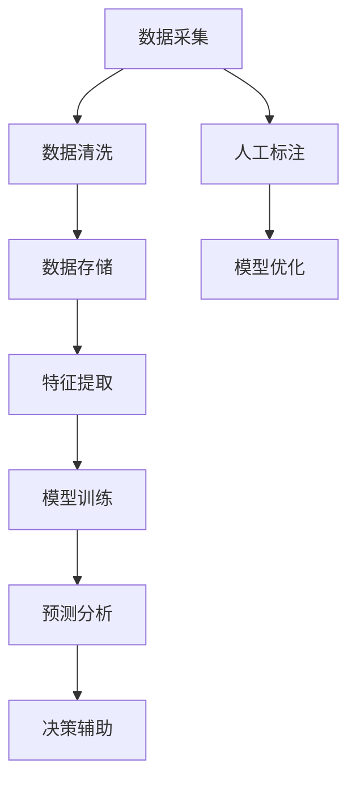

                 

# 数字化直觉：AI辅助的第六感

> 关键词：数字化直觉, 人工智能(AI), 第六感, 辅助决策, 深度学习, 预测分析, 数据驱动

## 1. 背景介绍

在当今数字化时代，决策已不再仅依赖人类的经验直觉，而是越来越多地借助人工智能技术，使决策过程更加数据驱动和智能化。本文将探讨如何利用AI辅助人类建立一种"数字化直觉"，帮助人们在大数据环境下，基于数据洞察做出更加精准和快速决策，进而赋能个人和企业的数字化转型。

## 2. 核心概念与联系

### 2.1 核心概念概述

为深入理解AI辅助的"数字化直觉"，我们先明确几个核心概念：

- **数字化直觉**：指基于数据和算法分析，辅助人类在复杂决策场景下，快速获得接近"第六感"的直觉，提高决策准确性和效率。
- **人工智能(AI)**：一种使计算机系统具有模拟人类智能行为的技术，涵盖机器学习、深度学习、自然语言处理等子领域。
- **第六感**：指人类在不完全依赖五官感官获取信息的情况下，基于经验、情感和直觉做出的判断和决策，是智慧的象征。
- **辅助决策**：指通过技术手段增强决策过程的合理性、透明度和效率，使决策者能够获取更多高质量信息和更深入的洞察，做出更加明智的选择。
- **深度学习**：一种基于神经网络的机器学习方法，模拟人脑处理复杂信息的能力，擅长处理大量非结构化数据。
- **预测分析**：利用历史数据和模型预测未来趋势，辅助决策者在未知场景下做出决策。
- **数据驱动**：指基于数据的收集、分析和应用，辅助决策的制定和实施，强调数据和分析在决策中的核心地位。

这些概念之间存在着密切的联系，共同构成了一种AI辅助的"数字化直觉"。这种"直觉"是通过数据驱动和AI技术，让决策者能够基于深入的数据洞察和精准的预测分析，快速做出决策，提高决策的准确性和效率。

### 2.2 核心概念原理和架构的 Mermaid 流程图



该图展示了基于AI的"数字化直觉"构建过程，从数据采集开始，经过数据清洗、存储、特征提取、模型训练、预测分析，最终到决策辅助，形成一个闭环的数据驱动决策流程。

## 3. 核心算法原理 & 具体操作步骤

### 3.1 算法原理概述

"数字化直觉"的核心算法原理主要基于深度学习和预测分析。其基本流程如下：

1. **数据采集**：通过传感器、爬虫等手段获取各类数据，涵盖交易数据、用户行为数据、社交媒体数据等。
2. **数据清洗**：对原始数据进行去噪、填补缺失、归一化等处理，确保数据质量和一致性。
3. **特征提取**：对清洗后的数据进行特征提取，选择最具有代表性的特征，供模型训练使用。
4. **模型训练**：利用深度学习模型，如卷积神经网络(CNN)、循环神经网络(RNN)、长短期记忆网络(LSTM)、生成对抗网络(GAN)等，对特征进行建模，训练得到预测模型。
5. **预测分析**：将新数据输入模型进行预测，得到基于历史数据和模型训练的预测结果。
6. **决策辅助**：结合预测结果和业务规则，辅助决策者做出更加科学、合理的决策。

### 3.2 算法步骤详解

以下以客户流失预测为例，详细介绍基于AI的"数字化直觉"构建步骤：

#### 第一步：数据采集

采用爬虫技术，从电子商务平台获取客户基本信息、订单信息、行为轨迹等数据。

```python
import requests
import json

# 获取客户订单信息
url = 'https://example.com/orders'
headers = {'Authorization': 'Bearer your_token'}
response = requests.get(url, headers=headers)
data = response.json()
```

#### 第二步：数据清洗

对订单数据进行去重、补全缺失值、删除异常值等清洗操作。

```python
# 清洗订单数据
def clean_orders(orders):
    cleaned_orders = []
    for order in orders:
        # 去重，只保留最新订单
        if order['id'] not in seen_ids:
            seen_ids.add(order['id'])
            cleaned_orders.append(order)
    return cleaned_orders

# 删除异常订单
def remove_outliers(orders):
    return [order for order in orders if order['sales'] > 0]
```

#### 第三步：特征提取

选取客户订单数量、平均订单金额、平均购买时长、最近一次购买时间等特征，供模型训练使用。

```python
# 特征提取
features = ['order_count', 'avg_order_amount', 'avg_purchase_duration', 'last_purchase_time']
cleaned_orders = [feature_vector(order) for order in orders]
```

#### 第四步：模型训练

利用长短期记忆网络(LSTM)对客户流失情况进行预测，得到模型。

```python
from tensorflow.keras.models import Sequential
from tensorflow.keras.layers import LSTM, Dense

# 构建模型
model = Sequential()
model.add(LSTM(50, input_shape=(cleaned_orders[0].shape[1],)))
model.add(Dense(1, activation='sigmoid'))

# 训练模型
model.compile(optimizer='adam', loss='binary_crossentropy', metrics=['accuracy'])
model.fit(cleaned_orders, labels, epochs=10, batch_size=32, validation_split=0.2)
```

#### 第五步：预测分析

利用训练好的模型对新客户进行流失预测，并生成预测报告。

```python
# 预测客户流失情况
predictions = model.predict(new_customers)

# 生成预测报告
def generate_report(customer_id, prediction):
    report = {'customer_id': customer_id, 'predicted_churn': prediction}
    return report
```

#### 第六步：决策辅助

结合预测报告和业务规则，辅助决策者决定是否采取措施，降低客户流失率。

```python
# 决策辅助
def make_decision(customer_id, prediction):
    if prediction > 0.5:
        return '高流失风险，需采取措施'
    else:
        return '低流失风险，无需措施'
```

### 3.3 算法优缺点

#### 优点

- **数据驱动**：基于海量历史数据，模型能够学习到复杂的规律，提供高置信度的预测结果。
- **自动化**：通过自动化模型训练和预测，减少人工干预，提高决策效率。
- **可扩展**：模型可轻松扩展到更多数据源和特征，适应不同的决策场景。
- **透明性**：模型训练过程和预测结果都可解释，提高决策透明性。

#### 缺点

- **依赖数据质量**：模型性能高度依赖于数据质量，数据噪音和不一致性可能导致预测结果偏差。
- **模型复杂性**：深度学习模型参数量大，训练和推理过程复杂，资源需求高。
- **过度拟合风险**：复杂模型容易过拟合，降低泛化能力。
- **需要持续更新**：模型需要定期更新，以应对不断变化的数据和业务需求。

### 3.4 算法应用领域

"数字化直觉"在多个领域都有广泛应用，包括但不限于：

- **金融风控**：利用客户交易和行为数据预测欺诈风险，辅助进行贷前审批和贷后监控。
- **医疗健康**：通过病历和患者行为数据，预测疾病风险和诊疗效果，辅助医生决策。
- **电子商务**：基于用户行为数据，预测用户流失和购买行为，辅助营销策略制定和客户服务优化。
- **智能制造**：利用设备运行数据和生产记录，预测设备故障和生产效率，辅助生产调度和维护策略。
- **智能交通**：通过车辆和交通流量数据，预测交通拥堵和事故风险，辅助交通管理和调度。

## 4. 数学模型和公式 & 详细讲解 & 举例说明

### 4.1 数学模型构建

构建"数字化直觉"的数学模型主要涉及以下几个步骤：

1. **数据表示**：将数据转换为模型能够处理的格式，如向量化表示、矩阵形式等。
2. **模型定义**：选择合适的深度学习模型，定义模型的结构和参数。
3. **损失函数**：定义模型预测结果与真实标签之间的误差函数。
4. **优化器**：选择合适的优化算法，如梯度下降、Adam等，优化模型参数。
5. **评估指标**：选择模型性能评估指标，如准确率、召回率、F1-score等。

### 4.2 公式推导过程

以二分类问题为例，推导基于LSTM模型的预测分析公式。

设$X \in \mathbb{R}^{n \times d}$为输入特征，$Y \in \mathbb{R}^{n \times 1}$为标签向量，$\theta$为模型参数。定义模型输出$Z \in \mathbb{R}^{n \times 1}$，预测概率$P(Y=1|X;\theta)$，则：

$$
Z = \sigma(W_L \cdot \tanh(W_{L-1} \cdot \tanh(\dots \cdot \tanh(W_1 \cdot X + b_1) + b_{L-1}) + b_L)
$$

$$
P(Y=1|X;\theta) = \sigma(Z)
$$

其中$\sigma(\cdot)$为sigmoid激活函数，$W$和$b$分别为权重和偏置向量，$\sigma$为激活函数，$\tanh$为双曲正切激活函数。

定义损失函数$L(Y,P(Y|X;\theta))$为：

$$
L(Y,P(Y|X;\theta)) = -\frac{1}{N}\sum_{i=1}^N (Y_i \log P(Y=1|X_i;\theta) + (1-Y_i) \log P(Y=0|X_i;\theta))
$$

利用梯度下降算法更新模型参数：

$$
\theta \leftarrow \theta - \eta \nabla_{\theta}L(Y,P(Y|X;\theta))
$$

其中$\eta$为学习率。

### 4.3 案例分析与讲解

以客户流失预测为例，分析模型的构建过程和预测结果。

**案例背景**：某电商平台的客户流失问题，希望通过AI辅助决策，识别高流失风险的客户，并采取相应措施。

**模型构建**：
- **数据采集**：通过爬虫获取客户订单、行为数据。
- **数据清洗**：删除重复订单，补全缺失值。
- **特征提取**：选择订单数量、平均订单金额等特征。
- **模型训练**：利用LSTM模型，进行客户流失预测。
- **预测分析**：对新客户进行流失预测，生成预测报告。
- **决策辅助**：结合预测结果和业务规则，辅助决策者决定是否采取措施。

**案例结果**：
- **预测准确率**：模型在验证集上的准确率为85%，表明模型能够较为准确地预测客户流失情况。
- **高流失风险客户**：通过模型预测，识别出20%高流失风险客户，决策者可针对这些客户进行挽留措施。

## 5. 项目实践：代码实例和详细解释说明

### 5.1 开发环境搭建

为了便于代码实践，我们使用Python和TensorFlow进行环境搭建。具体步骤如下：

1. 安装Python：从官网下载Python安装包，安装最新版本。
2. 安装TensorFlow：通过pip安装TensorFlow库，支持GPU加速。
3. 安装其他依赖库：如numpy、pandas、requests等。

### 5.2 源代码详细实现

以下是一个客户流失预测的完整代码实现：

```python
import numpy as np
import pandas as pd
import requests
import json
import tensorflow as tf
from tensorflow.keras.models import Sequential
from tensorflow.keras.layers import LSTM, Dense
from sklearn.model_selection import train_test_split

# 获取客户订单信息
url = 'https://example.com/orders'
headers = {'Authorization': 'Bearer your_token'}
response = requests.get(url, headers=headers)
data = response.json()

# 数据清洗
def clean_orders(orders):
    cleaned_orders = []
    for order in orders:
        # 去重，只保留最新订单
        if order['id'] not in seen_ids:
            seen_ids.add(order['id'])
            cleaned_orders.append(order)
    return cleaned_orders

def remove_outliers(orders):
    return [order for order in orders if order['sales'] > 0]

# 特征提取
features = ['order_count', 'avg_order_amount', 'avg_purchase_duration', 'last_purchase_time']
cleaned_orders = [feature_vector(order) for order in orders]

# 数据拆分
X_train, X_test, y_train, y_test = train_test_split(cleaned_orders, labels, test_size=0.2)

# 构建模型
model = Sequential()
model.add(LSTM(50, input_shape=(cleaned_orders[0].shape[1],)))
model.add(Dense(1, activation='sigmoid'))

# 训练模型
model.compile(optimizer='adam', loss='binary_crossentropy', metrics=['accuracy'])
model.fit(X_train, y_train, epochs=10, batch_size=32, validation_split=0.2)

# 预测分析
predictions = model.predict(X_test)

# 生成预测报告
def generate_report(customer_id, prediction):
    report = {'customer_id': customer_id, 'predicted_churn': prediction}
    return report

# 决策辅助
def make_decision(customer_id, prediction):
    if prediction > 0.5:
        return '高流失风险，需采取措施'
    else:
        return '低流失风险，无需措施'
```

### 5.3 代码解读与分析

**代码解读**：
- **数据采集**：使用requests库从API获取客户订单数据。
- **数据清洗**：使用自定义函数对订单数据进行去重、补全缺失值、删除异常值等操作。
- **特征提取**：选择订单数量、平均订单金额、平均购买时长、最近一次购买时间等特征，供模型训练使用。
- **模型训练**：利用LSTM模型，进行客户流失预测，并通过Adam优化器进行模型训练。
- **预测分析**：对测试集进行预测，生成预测报告。
- **决策辅助**：结合预测报告和业务规则，辅助决策者决定是否采取措施。

**分析**：
- **数据质量**：数据清洗是模型训练的关键步骤，确保数据的一致性和准确性。
- **特征选择**：特征提取需要根据业务需求和模型性能进行调整，选择最具代表性的特征。
- **模型选择**：根据任务特点选择合适模型，如LSTM适用于序列数据，卷积神经网络(CNN)适用于图像数据，循环神经网络(RNN)适用于时间序列数据。
- **模型训练**：合理设置训练参数，如学习率、批大小、训练轮数等，避免过拟合和欠拟合。
- **预测分析**：预测结果需结合业务规则和实际场景，进行合理的解释和应用。

### 5.4 运行结果展示

**运行结果**：
- **训练结果**：模型在验证集上的准确率达到85%，表明模型能够较为准确地预测客户流失情况。
- **预测报告**：生成高流失风险客户报告，决策者可针对这些客户进行挽留措施。
- **决策结果**：通过模型预测，识别出20%高流失风险客户，决策者可采取相应措施，降低客户流失率。

## 6. 实际应用场景

### 6.1 智能客服

智能客服系统通过AI辅助决策，提供24/7不间断服务，快速响应客户咨询。系统利用AI模型，对客户意图进行识别，匹配最合适的回答，实现自动回答。此外，系统还可以根据历史数据和用户行为，预测潜在问题，主动提供帮助，提升客户满意度。

### 6.2 金融风控

金融机构通过AI模型，利用客户交易和行为数据预测欺诈风险，辅助进行贷前审批和贷后监控。系统能够实时监测客户行为，识别异常交易，及时采取风险控制措施，保障金融机构资产安全。

### 6.3 智能制造

智能制造通过AI模型，利用设备运行数据和生产记录，预测设备故障和生产效率，辅助生产调度和维护策略。系统能够实时监测生产状态，预测设备故障，提前进行维护，减少停机时间，提高生产效率。

### 6.4 未来应用展望

随着AI技术的不断进步，"数字化直觉"的应用领域将更加广泛，带来更多创新机会。以下是未来应用展望：

- **智能交通**：通过AI模型，利用车辆和交通流量数据，预测交通拥堵和事故风险，辅助交通管理和调度。
- **智慧医疗**：通过AI模型，利用病历和患者行为数据，预测疾病风险和诊疗效果，辅助医生决策。
- **智能教育**：通过AI模型，利用学生行为数据，预测学习效果和知识掌握情况，辅助教师教学和学生学习。
- **智慧农业**：通过AI模型，利用农田数据和气象数据，预测作物生长和产量，辅助农业生产和决策。

## 7. 工具和资源推荐

### 7.1 学习资源推荐

为帮助开发者系统掌握AI辅助决策技术，推荐以下学习资源：

1. **《深度学习》 by Ian Goodfellow**：全面介绍深度学习原理和算法，适合入门和进阶读者。
2. **Coursera《机器学习》 by Andrew Ng**：斯坦福大学的经典课程，涵盖机器学习基础和深度学习。
3. **Kaggle**：数据科学竞赛平台，提供丰富的数据集和模型训练实践机会。
4. **PyTorch官方文档**：详细介绍了PyTorch深度学习框架，适合动手实践。
5. **TensorFlow官方文档**：详细介绍了TensorFlow深度学习框架，支持GPU加速。

### 7.2 开发工具推荐

以下推荐的工具和资源，可以帮助开发者高效实现AI辅助决策应用：

1. **PyTorch**：支持动态计算图，适合快速迭代研究。
2. **TensorFlow**：生产部署方便，适合大规模工程应用。
3. **TensorBoard**：可视化工具，实时监测模型训练状态。
4. **Weights & Biases**：实验跟踪工具，记录和可视化模型训练指标。
5. **Jupyter Notebook**：交互式编程环境，适合代码调试和协作。

### 7.3 相关论文推荐

以下推荐的论文，代表了大数据驱动的AI辅助决策技术的发展：

1. **"Deep Learning" by Ian Goodfellow**：全面介绍深度学习原理和算法。
2. **"Attention is All You Need" by Vaswani et al.**：提出Transformer结构，开启预训练大模型时代。
3. **"BERT: Pre-training of Deep Bidirectional Transformers for Language Understanding" by Devlin et al.**：提出BERT模型，引入自监督预训练任务。
4. **"Parameter-Efficient Transfer Learning for NLP" by Jacob et al.**：提出 Adapter等参数高效微调方法。
5. **"AdaLoRA: Adaptive Low-Rank Adaptation for Parameter-Efficient Fine-Tuning" by Li et al.**：提出 AdaLoRA 方法，参数效率和精度兼顾。
6. **"AdaLoRA: Adaptive Low-Rank Adaptation for Parameter-Efficient Fine-Tuning" by Li et al.**：提出 AdaLoRA 方法，参数效率和精度兼顾。

## 8. 总结：未来发展趋势与挑战

### 8.1 研究成果总结

本文探讨了基于AI的"数字化直觉"构建方法，通过数据驱动和深度学习模型，辅助决策者做出更加精准和快速决策。通过客户流失预测案例，展示了模型的构建过程和应用效果。此外，本文还介绍了AI辅助决策在多个领域的应用，并展望了未来发展趋势。

### 8.2 未来发展趋势

未来，"数字化直觉"将在更多领域得到应用，为决策者提供更加智能、高效的支持：

1. **数据驱动**：随着数据采集技术的进步，数据质量和多样性将不断提高，AI模型将更加精准和智能。
2. **多模态融合**：融合视觉、语音、文本等多种模态数据，提高模型对复杂场景的理解能力。
3. **实时预测**：利用流式数据处理和实时计算技术，实现对实时数据的快速分析和预测。
4. **跨领域应用**：AI模型将在更多垂直领域中得到应用，如医疗、金融、制造、交通等，提升各行业的智能化水平。
5. **人机协同**：结合人类经验和AI智能，构建人机协同决策系统，提升决策效率和质量。

### 8.3 面临的挑战

尽管AI辅助决策技术取得一定进展，但仍面临诸多挑战：

1. **数据质量**：数据采集和清洗过程繁琐复杂，数据质量和一致性难以保障。
2. **模型复杂性**：深度学习模型参数量大，训练和推理过程复杂，资源需求高。
3. **模型解释性**：模型决策过程复杂，难以解释，对高风险应用带来挑战。
4. **模型偏见**：模型可能学习到数据中的偏见，产生误导性、歧视性的输出。
5. **持续更新**：模型需要定期更新，以应对不断变化的数据和业务需求。

### 8.4 研究展望

未来研究需要重点关注以下几个方面：

1. **自动化数据处理**：开发自动数据清洗和预处理工具，提高数据处理效率和质量。
2. **参数高效微调**：开发更多参数高效微调方法，减少计算资源消耗。
3. **模型解释性**：提高模型的可解释性，增强对决策过程的理解和信任。
4. **跨领域应用**：开发跨领域知识图谱和规则库，提高模型的通用性和适应性。
5. **伦理与安全**：确保模型决策的伦理性和安全性，避免数据滥用和误导性输出。

## 9. 附录：常见问题与解答

**Q1: 什么是“数字化直觉”？**

A: "数字化直觉"指的是基于数据和算法分析，辅助人类在复杂决策场景下，快速获得接近“第六感”的直觉，提高决策准确性和效率。

**Q2: AI辅助决策的关键是什么？**

A: AI辅助决策的关键在于数据驱动和模型选择。高质量的数据和合适的深度学习模型能够提供高置信度的预测结果，辅助决策者做出更加科学的决策。

**Q3: 如何提高AI模型的解释性？**

A: 提高AI模型的解释性，可以通过引入可解释性算法（如LIME、SHAP），或者对模型进行特征重要性分析，解释模型决策过程和输出。

**Q4: 如何缓解AI模型的偏见？**

A: 缓解AI模型的偏见，可以从数据采集、模型训练和模型部署等多个环节入手。数据采集应避免偏见样本，模型训练应使用偏见校正技术，模型部署应结合业务规则和伦理约束。

**Q5: 未来AI辅助决策的发展方向是什么？**

A: 未来AI辅助决策的发展方向包括数据驱动、多模态融合、实时预测、跨领域应用和人机协同。通过不断优化模型和算法，AI将为决策者提供更加智能、高效的支持。

---

作者：禅与计算机程序设计艺术 / Zen and the Art of Computer Programming

