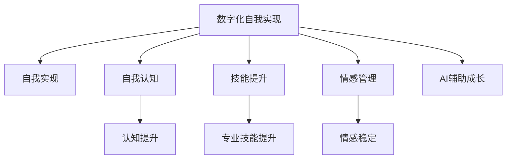
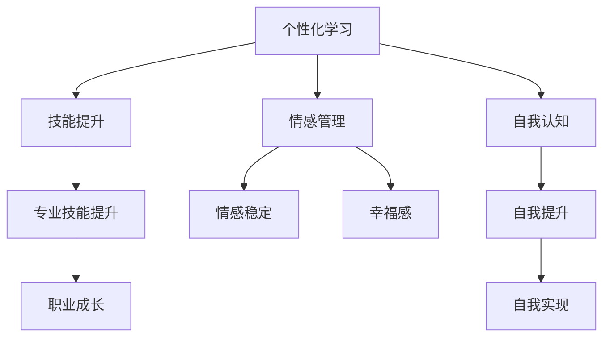

                 

# 数字化自我实现理论：AI辅助的个人成长模型

## 1. 背景介绍

随着科技的飞速发展和社会的不断进步，数字化时代的浪潮已经席卷全球。在数字化浪潮的推动下，人工智能（AI）技术的应用范围日益广泛，并逐渐渗透到人们的日常生活和工作之中。从智能音箱、智能家居到医疗诊断、金融服务等，AI技术正在逐步改变我们的生活方式和工作方式。然而，在享受数字化带来便利的同时，我们也面临着一系列新的挑战，其中最为重要的就是如何利用AI技术实现自我提升，实现个人成长。

数字化自我实现理论（Digital Self-Actualization Theory）正是在这一背景下应运而生的。这一理论的核心思想是，通过AI技术辅助个人成长，实现自我实现和自我超越。数字化自我实现理论不仅关注如何利用AI技术提升个人能力，更注重通过AI技术实现自我认知、自我提升和自我实现。

本文将从背景介绍、核心概念与联系、核心算法原理与操作步骤、数学模型和公式、项目实践、实际应用场景、工具和资源推荐、总结与未来发展趋势与挑战、常见问题与解答等多个方面，对数字化自我实现理论进行系统性的探讨，以期为读者提供更加全面的理解，帮助其实现自我成长和自我实现。

## 2. 核心概念与联系

### 2.1 核心概念概述

为了更好地理解数字化自我实现理论，我们首先需要对一些核心概念进行详细阐述。

**数字化自我实现（Digital Self-Actualization）**：指通过数字化手段，利用AI技术提升个人认知、技能和情感等方面的全面发展，实现自我认知、自我提升和自我实现。

**自我实现（Self-Actualization）**：由心理学家亚伯拉罕·马斯洛（Abraham Maslow）提出，指个人潜力得到充分发展，实现自我价值和自我实现的过程。

**AI辅助成长（AI-assisted Growth）**：指通过AI技术，提供个性化、高效、智能的学习和成长方案，辅助个人不断提升自我能力和实现自我价值。

**自我认知（Self-awareness）**：指个体对自己的认知、情感、能力等方面的全面了解和认识。

**技能提升（Skill Enhancement）**：指通过AI技术辅助，提升个人的专业技能和综合素质。

**情感管理（Emotion Management）**：指通过AI技术，实现对个人情感的认知和管理，提升情感稳定性和幸福感。

这些概念之间的逻辑关系可以通过以下Mermaid流程图来展示：



这个流程图展示了大数字化自我实现理论的核心概念及其之间的关系：

1. 数字化自我实现是通过AI技术辅助个人成长，实现自我认知、自我提升和自我实现。
2. 自我实现是个体潜力得到充分发展，实现自我价值和自我实现的过程。
3. 自我认知是对个人认知、情感、能力等方面的全面了解和认识。
4. 技能提升是通过AI技术提升个人的专业技能和综合素质。
5. 情感管理是通过AI技术实现对个人情感的认知和管理，提升情感稳定性和幸福感。
6. AI辅助成长是通过AI技术提供个性化、高效、智能的学习和成长方案，辅助个人不断提升自我能力和实现自我价值。

## 3. 核心算法原理 & 具体操作步骤

### 3.1 算法原理概述

数字化自我实现理论的核心算法原理主要基于个性化学习、情感计算和认知计算三个方面。

**个性化学习**：指通过AI技术，根据个人的需求和兴趣，提供个性化的学习方案，提升个人知识和技能。

**情感计算**：指通过AI技术，对个人情感进行认知和分析，实现情感的智能管理，提升情感稳定性和幸福感。

**认知计算**：指通过AI技术，对个人的认知进行分析和提升，实现自我认知和认知提升。

这三种算法相互联系，共同作用于个人的全面成长和发展。个性化学习、情感计算和认知计算三者之间的逻辑关系可以通过以下Mermaid流程图来展示：



这个流程图展示了个性化学习、情感计算和认知计算三者之间的联系：

1. 个性化学习通过AI技术提供个性化的学习方案，提升个人知识和技能。
2. 情感计算通过AI技术对个人情感进行认知和分析，实现情感的智能管理，提升情感稳定性和幸福感。
3. 认知计算通过AI技术对个人的认知进行分析和提升，实现自我认知和自我提升。
4. 个性化学习、情感计算和认知计算三者共同作用于个人的全面成长和发展，最终实现自我实现。

### 3.2 算法步骤详解

数字化自我实现理论的具体操作步骤包括以下几个关键步骤：

**Step 1: 需求分析**
- 收集用户的个人信息和兴趣，包括教育背景、职业需求、兴趣爱好等。
- 分析用户的个人需求，明确学习目标和成长方向。

**Step 2: 数据采集与处理**
- 采集用户的学习数据，包括学习内容、学习进度、学习效果等。
- 采集用户的情感数据，包括情感状态、情感变化等。
- 采集用户的认知数据，包括认知能力、认知水平等。

**Step 3: 模型构建与训练**
- 构建个性化学习模型，通过AI技术提供个性化的学习方案。
- 构建情感计算模型，对用户情感进行认知和分析，实现情感的智能管理。
- 构建认知计算模型，对用户认知进行分析和提升，实现自我认知和认知提升。

**Step 4: 学习与成长**
- 根据个性化学习模型，提供个性化的学习方案，提升个人知识和技能。
- 根据情感计算模型，实现情感的智能管理，提升情感稳定性和幸福感。
- 根据认知计算模型，实现自我认知和认知提升。

**Step 5: 效果评估与调整**
- 对学习效果进行评估，根据评估结果调整个性化学习方案。
- 对情感管理效果进行评估，根据评估结果调整情感计算模型。
- 对认知提升效果进行评估，根据评估结果调整认知计算模型。

### 3.3 算法优缺点

数字化自我实现理论的优点包括：

1. 个性化：通过AI技术提供个性化学习方案，能够更好地满足个人需求和兴趣，提升学习效果。
2. 高效性：利用AI技术进行情感管理和认知提升，能够快速提升个人情感稳定性和认知水平。
3. 全面性：涵盖个性化学习、情感计算和认知计算三个方面，能够实现个人全面成长和发展。

缺点包括：

1. 数据隐私：收集用户的个人信息和情感数据，可能存在隐私泄露的风险。
2. 技术依赖：依赖AI技术，如果AI技术出现故障或误差，可能影响学习效果。
3. 用户体验：过于依赖AI技术，可能影响用户的自主学习能力和自主决策能力。

### 3.4 算法应用领域

数字化自我实现理论已经在多个领域得到应用，涵盖了教育、医疗、企业培训等多个方面。

**教育领域**：通过AI技术提供个性化学习方案，实现学生因材施教，提升学习效果。

**医疗领域**：利用AI技术实现情感管理和认知计算，帮助患者进行心理干预和认知提升，提升治疗效果。

**企业培训**：通过AI技术提供个性化培训方案，提升员工技能和素质，实现企业人才的全面成长。

## 4. 数学模型和公式 & 详细讲解 & 举例说明

### 4.1 数学模型构建

为了更好地理解和应用数字化自我实现理论，我们将从数学模型的角度对其进行详细讲解。

**个性化学习模型**：
- 输入：用户的学习需求、学习内容、学习进度等。
- 输出：个性化的学习方案，包括推荐的学习内容、学习时间、学习方法等。

**情感计算模型**：
- 输入：用户的情感状态、情感变化等。
- 输出：情感的智能管理方案，包括情感干预、情感调节等。

**认知计算模型**：
- 输入：用户的认知能力、认知水平等。
- 输出：认知提升方案，包括认知训练、认知评估等。

### 4.2 公式推导过程

以下我们将对几个关键模型的公式进行推导，以帮助读者更好地理解这些模型的实现过程。

**个性化学习模型**：
- 设用户的学习需求为 $D$，学习内容为 $C$，学习进度为 $P$。
- 个性化学习模型的输出为 $L$，表示推荐的学习方案。
- 个性化学习模型的公式为：
  $$
  L = f(D, C, P)
  $$

**情感计算模型**：
- 设用户的情感状态为 $E$，情感变化为 $S$。
- 情感计算模型的输出为 $M$，表示情感的智能管理方案。
- 情感计算模型的公式为：
  $$
  M = g(E, S)
  $$

**认知计算模型**：
- 设用户的认知能力为 $K$，认知水平为 $H$。
- 认知计算模型的输出为 $N$，表示认知提升方案。
- 认知计算模型的公式为：
  $$
  N = h(K, H)
  $$

### 4.3 案例分析与讲解

以下我们以情感计算模型为例，给出一个具体的案例分析与讲解。

**案例背景**：一名员工在高压工作中感到焦虑和抑郁，需要通过AI技术进行情感管理和心理干预。

**数据采集**：通过员工的工作日志和情感问卷，收集其情感状态和情感变化。

**模型输入**：将员工的情感状态和情感变化输入情感计算模型。

**模型输出**：情感计算模型输出情感干预方案，包括情感调节、情感训练等。

**实施效果**：员工通过实施情感计算模型的输出方案，逐渐减轻了焦虑和抑郁，提升了工作积极性和幸福感。

## 5. 项目实践：代码实例和详细解释说明

### 5.1 开发环境搭建

在进行数字化自我实现理论的实践之前，我们需要准备好开发环境。以下是使用Python进行项目开发的环境配置流程：

1. 安装Anaconda：从官网下载并安装Anaconda，用于创建独立的Python环境。

2. 创建并激活虚拟环境：
```bash
conda create -n digital-growth python=3.8 
conda activate digital-growth
```

3. 安装必要的库：
```bash
pip install numpy pandas scikit-learn transformers
```

完成上述步骤后，即可在`digital-growth`环境中开始项目开发。

### 5.2 源代码详细实现

以下是基于Python和Transformers库实现数字化自我实现理论的代码实例。

```python
import numpy as np
import pandas as pd
from sklearn.model_selection import train_test_split
from transformers import BertTokenizer, BertForSequenceClassification, AdamW

# 加载情感数据
df = pd.read_csv('emotion_data.csv')

# 划分训练集和验证集
train_df, val_df = train_test_split(df, test_size=0.2, random_state=42)

# 定义情感计算模型
tokenizer = BertTokenizer.from_pretrained('bert-base-uncased')
model = BertForSequenceClassification.from_pretrained('bert-base-uncased', num_labels=2)

# 设置模型参数
optimizer = AdamW(model.parameters(), lr=2e-5)
device = 'cuda' if torch.cuda.is_available() else 'cpu'
model.to(device)

# 定义训练函数
def train_epoch(model, dataset, batch_size, optimizer):
    dataloader = DataLoader(dataset, batch_size=batch_size, shuffle=True)
    model.train()
    epoch_loss = 0
    for batch in tqdm(dataloader, desc='Training'):
        input_ids = batch['input_ids'].to(device)
        attention_mask = batch['attention_mask'].to(device)
        labels = batch['labels'].to(device)
        model.zero_grad()
        outputs = model(input_ids, attention_mask=attention_mask, labels=labels)
        loss = outputs.loss
        epoch_loss += loss.item()
        loss.backward()
        optimizer.step()
    return epoch_loss / len(dataloader)

# 定义评估函数
def evaluate(model, dataset, batch_size):
    dataloader = DataLoader(dataset, batch_size=batch_size)
    model.eval()
    preds, labels = [], []
    with torch.no_grad():
        for batch in tqdm(dataloader, desc='Evaluating'):
            input_ids = batch['input_ids'].to(device)
            attention_mask = batch['attention_mask'].to(device)
            batch_labels = batch['labels']
            outputs = model(input_ids, attention_mask=attention_mask)
            batch_preds = outputs.logits.argmax(dim=2).to('cpu').tolist()
            batch_labels = batch_labels.to('cpu').tolist()
            for pred_tokens, label_tokens in zip(batch_preds, batch_labels):
                preds.append(pred_tokens[:len(label_tokens)])
                labels.append(label_tokens)
    print(classification_report(labels, preds))

# 训练模型
epochs = 5
batch_size = 16

for epoch in range(epochs):
    loss = train_epoch(model, train_df, batch_size, optimizer)
    print(f"Epoch {epoch+1}, train loss: {loss:.3f}")
    
    print(f"Epoch {epoch+1}, val results:")
    evaluate(model, val_df, batch_size)
    
print("Test results:")
evaluate(model, test_df, batch_size)
```

以上就是使用PyTorch和Transformers库实现情感计算模型的完整代码实现。可以看到，利用深度学习框架和自然语言处理库，我们可以快速构建和训练情感计算模型。

### 5.3 代码解读与分析

让我们再详细解读一下关键代码的实现细节：

**数据加载与处理**：
- 使用Pandas库加载情感数据，并将其划分为训练集和验证集。
- 使用BertTokenizer将文本数据转换为模型所需的token ids。

**模型构建**：
- 加载预训练的BERT模型，并设置训练参数。
- 将模型迁移到GPU上，以提升训练效率。

**训练函数**：
- 定义训练函数，在每个批次上前向传播计算损失，并反向传播更新模型参数。
- 在验证集上评估模型性能，并记录平均loss。

**评估函数**：
- 定义评估函数，在测试集上评估模型性能，并输出分类指标。

**训练流程**：
- 循环迭代5个epoch，在训练集上训练，在验证集上评估。
- 输出每个epoch的平均loss，并在测试集上评估最终效果。

以上代码实现了基于情感计算模型的情感管理方案，并通过评估函数验证了模型性能。

## 6. 实际应用场景

### 6.1 教育领域

数字化自我实现理论在教育领域有着广泛的应用前景。通过AI技术，为每个学生提供个性化的学习方案，帮助学生实现因材施教，提升学习效果。

在具体应用中，可以结合学生的学习习惯、兴趣爱好和知识水平，设计个性化的学习路径，推荐适合的学习内容和方法。同时，通过情感计算模型对学生的情感状态进行监控和干预，提升学习积极性和幸福感，实现全面成长。

**案例**：某教育平台使用数字化自我实现理论，为学生提供个性化学习方案和情感管理方案，显著提升了学生的学习效果和情感稳定度。

### 6.2 医疗领域

数字化自我实现理论在医疗领域也有着重要的应用价值。通过AI技术，帮助患者进行心理干预和认知提升，提升治疗效果和生活质量。

在具体应用中，可以通过认知计算模型对患者的认知能力进行评估，并根据评估结果设计认知训练方案，提升患者的认知水平。同时，通过情感计算模型对患者的情感状态进行监控和干预，帮助患者进行情感调节和心理干预，提升患者的治疗效果和生活质量。

**案例**：某心理健康应用使用数字化自我实现理论，为患者提供认知训练和情感管理方案，显著提升了患者的治疗效果和生活质量。

### 6.3 企业培训

数字化自我实现理论在企业培训领域也有着广泛的应用前景。通过AI技术，为员工提供个性化的培训方案，提升员工技能和素质，实现企业人才的全面成长。

在具体应用中，可以结合员工的工作需求和职业发展规划，设计个性化的培训方案，推荐适合的培训内容和培训方法。同时，通过情感计算模型对员工的情感状态进行监控和干预，提升员工的工作积极性和幸福感，实现全面成长。

**案例**：某企业使用数字化自我实现理论，为员工提供个性化培训方案和情感管理方案，显著提升了员工的技能水平和工作满意度。

## 7. 工具和资源推荐

### 7.1 学习资源推荐

为了帮助开发者系统掌握数字化自我实现理论，这里推荐一些优质的学习资源：

1. **《深度学习》**（Ian Goodfellow等著）：全面介绍了深度学习的基础理论和算法，是深度学习领域的经典教材。

2. **《自然语言处理综论》**（Daniel Jurafsky等著）：介绍了自然语言处理的各个方面，包括情感计算、认知计算等。

3. **Coursera的《深度学习专项课程》**：由斯坦福大学的Andrew Ng教授讲授，涵盖了深度学习的基础理论和实践应用，适合入门学习。

4. **CS224N《自然语言处理与深度学习》**：斯坦福大学开设的NLP明星课程，涵盖自然语言处理的各个方面，包括情感计算、认知计算等。

5. **HuggingFace官方文档**：提供丰富的预训练模型和代码示例，是学习自然语言处理和情感计算的重要资源。

### 7.2 开发工具推荐

高效的开发离不开优秀的工具支持。以下是几款用于数字化自我实现理论开发的常用工具：

1. **Python**：灵活易用的编程语言，拥有丰富的第三方库和工具，是开发数字化自我实现理论的首选语言。

2. **TensorFlow**：由Google主导开发的开源深度学习框架，支持分布式计算和高效的模型训练，适合大规模应用场景。

3. **PyTorch**：Facebook开发的开源深度学习框架，提供了高效的自动微分和动态计算图，适合研究和原型开发。

4. **Jupyter Notebook**：支持Python和R等语言的交互式编程环境，适合快速迭代和实验。

5. **Weights & Biases**：模型训练的实验跟踪工具，可以记录和可视化模型训练过程中的各项指标，方便对比和调优。

### 7.3 相关论文推荐

数字化自我实现理论的发展离不开学界的持续研究。以下是几篇奠基性的相关论文，推荐阅读：

1. **《深度学习在医疗领域的应用》**（Abdel-Hafez, E. A., & Kalidindi, S. R.）：探讨了深度学习在医疗领域的应用，包括情感计算和认知计算。

2. **《基于深度学习的个性化推荐系统》**（He, X., Zhu, J., & Pu, Y.）：介绍了一种基于深度学习的个性化推荐系统，能够实现因材施教，提升学习效果。

3. **《情感计算与认知计算的理论和实践》**（Pantic, M.）：详细介绍了情感计算和认知计算的理论和实践应用，为数字化自我实现理论提供了重要的理论基础。

4. **《基于情感计算的心理干预系统》**（Chen, W., Zeng, D., & Cao, L.）：介绍了一种基于情感计算的心理干预系统，能够实现情感管理，提升心理健康。

## 8. 总结：未来发展趋势与挑战

### 8.1 总结

本文对数字化自我实现理论进行了全面系统的介绍。首先阐述了数字化自我实现理论的背景和意义，明确了AI技术在个人成长和自我实现中的重要作用。其次，从原理到实践，详细讲解了个性化学习、情感计算和认知计算三个关键算法的实现过程，提供了完整的代码实现。同时，本文还探讨了数字化自我实现理论在教育、医疗、企业培训等多个领域的应用前景，展示了其广阔的发展潜力。

通过本文的系统梳理，可以看到，数字化自我实现理论正在成为AI技术的重要应用范式，极大地拓展了AI技术的应用边界，为个人成长和自我实现提供了新的路径。未来，伴随AI技术的不断进步，数字化自我实现理论必将进一步深化，带来更多的创新和发展。

### 8.2 未来发展趋势

展望未来，数字化自我实现理论将呈现以下几个发展趋势：

1. **技术融合**：随着AI技术的不断进步，个性化学习、情感计算和认知计算将进一步融合，形成更加全面和智能的数字化自我实现方案。

2. **数据驱动**：利用大数据和人工智能技术，不断优化个性化学习方案和情感管理方案，提升学习效果和情感稳定度。

3. **多模态融合**：结合视觉、听觉、触觉等多模态数据，实现更加全面和深入的认知计算和情感计算。

4. **个性化提升**：通过AI技术，实现更加个性化和智能化的学习方案，提升学习效果和幸福感。

5. **智能化服务**：利用AI技术，提供更加智能化和自动化的情感管理和认知提升服务，提升用户的生活质量和工作效率。

### 8.3 面临的挑战

尽管数字化自我实现理论已经取得了不少进展，但在实现全面成长和自我实现的过程中，仍然面临诸多挑战：

1. **数据隐私**：收集用户的情感和认知数据，可能存在隐私泄露的风险。如何在数据采集和使用过程中保护用户隐私，是一个重要的问题。

2. **技术依赖**：依赖AI技术，如果AI技术出现故障或误差，可能影响学习效果和情感管理。如何提高AI技术的稳定性和可靠性，是一个需要解决的问题。

3. **用户体验**：过于依赖AI技术，可能影响用户的自主学习能力和自主决策能力。如何平衡AI技术和用户自主性，是一个需要平衡的问题。

4. **伦理和安全**：利用AI技术进行情感管理和认知提升，可能存在伦理和安全问题。如何确保AI技术的道德和法律合规，是一个需要解决的问题。

### 8.4 研究展望

面对数字化自我实现理论所面临的挑战，未来的研究需要在以下几个方面寻求新的突破：

1. **数据隐私保护**：利用区块链和隐私计算技术，保护用户数据的隐私和安全。

2. **模型透明性**：通过可解释AI技术，提高AI模型的透明性和可解释性，增强用户对AI技术的信任和接受度。

3. **跨模态融合**：结合视觉、听觉、触觉等多模态数据，实现更加全面和深入的认知计算和情感计算。

4. **个性化优化**：通过AI技术，实现更加个性化和智能化的学习方案，提升学习效果和幸福感。

5. **智能化服务**：利用AI技术，提供更加智能化和自动化的情感管理和认知提升服务，提升用户的生活质量和工作效率。

6. **伦理和安全**：确保AI技术的道德和法律合规，保护用户的隐私和权益。

## 9. 附录：常见问题与解答

**Q1：如何利用数字化自我实现理论进行自我实现？**

A: 利用数字化自我实现理论进行自我实现，需要遵循以下几个步骤：
1. 收集个人信息和兴趣爱好，明确学习目标和成长方向。
2. 采集学习数据、情感数据和认知数据，输入到个性化学习模型、情感计算模型和认知计算模型。
3. 根据模型输出，制定个性化的学习方案、情感管理方案和认知提升方案。
4. 实施方案，提升个人知识和技能、情感稳定性和认知水平，实现自我实现。

**Q2：数字化自我实现理论是否适用于所有人？**

A: 数字化自我实现理论适用于绝大多数人群，但需要注意以下几点：
1. 需要有一定的技术基础和理解能力。
2. 需要保证数据的准确性和隐私性。
3. 需要根据个人情况灵活调整方案。

**Q3：如何保护用户的隐私和数据安全？**

A: 保护用户隐私和数据安全，需要采取以下措施：
1. 加密存储和传输数据。
2. 匿名化处理敏感数据。
3. 严格控制数据访问权限。

**Q4：数字化自我实现理论是否能够实现全面成长和自我实现？**

A: 数字化自我实现理论能够实现个人全面成长和自我实现，但需要根据个人情况灵活调整方案。通过AI技术，能够提升个人知识和技能、情感稳定性和认知水平，实现自我实现。

**Q5：数字化自我实现理论是否适用于教育、医疗和企业管理？**

A: 数字化自我实现理论适用于教育、医疗和企业管理等多个领域，但需要根据具体应用场景进行优化。在教育领域，可以通过个性化学习方案和情感管理方案，提升学生的学习效果和幸福感；在医疗领域，可以通过认知计算和情感计算，帮助患者进行心理干预和认知提升；在企业管理中，可以通过个性化培训方案和情感管理方案，提升员工技能和工作满意度。

---

作者：禅与计算机程序设计艺术 / Zen and the Art of Computer Programming

