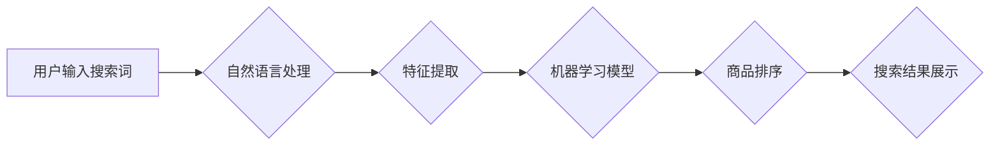

> AI、电商、搜索优化、推荐系统、自然语言处理、机器学习、深度学习、用户行为分析

## 1. 背景介绍

电子商务的蓬勃发展为消费者提供了便捷的购物体验，但也给商家带来了新的挑战。如何精准地将用户需求与商品匹配，提升用户搜索体验和转化率，成为电商平台亟需解决的关键问题。传统的搜索引擎依靠关键词匹配和人工规则，难以满足用户日益复杂的搜索需求。

近年来，人工智能（AI）技术在电商领域得到了广泛应用，特别是搜索优化技术。AI算法能够分析海量用户数据，理解用户意图，并根据用户行为、商品属性等多方面因素，提供更精准、更个性化的搜索结果，从而提升用户体验和商业价值。

## 2. 核心概念与联系

**2.1 搜索优化技术**

搜索优化技术旨在提高搜索引擎结果页（SERP）中特定网页的排名，使其更容易被用户发现。在电商平台，搜索优化技术主要用于提升商品在搜索结果中的排名，从而提高商品曝光率和转化率。

**2.2 人工智能（AI）**

人工智能是指模拟人类智能行为的计算机系统。在电商搜索优化中，AI技术主要包括：

* **自然语言处理（NLP）:**  理解和处理人类语言，例如分析用户搜索词语的意图、语义等。
* **机器学习（ML）:** 从数据中学习模式和规律，例如预测用户搜索行为、商品需求等。
* **深度学习（DL）:**  一种更高级的机器学习方法，能够处理更复杂的数据，例如图像识别、语音识别等。

**2.3 核心架构**

电商平台的AI搜索优化系统通常由以下几个模块组成：



**2.3.1 用户输入搜索词:** 用户在电商平台输入搜索词，例如“男装衬衫”。

**2.3.2 自然语言处理:** NLP模块对用户输入的搜索词进行分析，例如识别关键词、理解语义等。

**2.3.3 特征提取:**  提取用户搜索词和商品属性等相关特征，例如颜色、品牌、价格等。

**2.3.4 机器学习模型:**  ML模型根据提取的特征，预测用户对商品的兴趣程度，并对商品进行排序。

**2.3.5 商品排序:**  根据ML模型的预测结果，对商品进行排序，将最相关的商品显示在搜索结果的第一页。

**2.3.6 搜索结果展示:**  将排序后的商品展示给用户，用户可以根据自己的需求选择商品。

## 3. 核心算法原理 & 具体操作步骤

### 3.1  算法原理概述

电商平台的AI搜索优化系统通常采用基于机器学习的算法，例如：

* **协同过滤:**  根据用户的历史购买行为和商品的购买记录，预测用户对商品的兴趣程度。
* **内容过滤:**  根据商品的属性和描述，预测用户对商品的兴趣程度。
* **深度学习:**  利用深度神经网络，从海量用户数据中学习更复杂的模式和规律，提高搜索结果的精准度。

### 3.2  算法步骤详解

**3.2.1 协同过滤算法步骤:**

1. **数据收集:** 收集用户历史购买行为和商品购买记录数据。
2. **用户-商品矩阵构建:** 将用户和商品映射到一个矩阵中，每个单元格表示用户对商品的评分或购买行为。
3. **相似用户/商品查找:**  根据用户行为或商品属性，查找与目标用户或目标商品相似的用户或商品。
4. **预测评分:**  根据相似用户的评分或购买行为，预测目标用户对目标商品的兴趣程度。

**3.2.2 内容过滤算法步骤:**

1. **商品特征提取:**  提取商品的属性和描述信息，例如颜色、品牌、价格、材质等。
2. **用户兴趣建模:**  根据用户的历史购买行为和浏览记录，构建用户的兴趣模型。
3. **商品相似度计算:**  根据商品特征和用户兴趣模型，计算商品之间的相似度。
4. **推荐商品:**  推荐与用户兴趣相符的商品。

**3.2.3 深度学习算法步骤:**

1. **数据预处理:**  对海量用户数据进行清洗、转换和特征工程。
2. **模型构建:**  构建深度神经网络模型，例如卷积神经网络（CNN）或循环神经网络（RNN）。
3. **模型训练:**  利用训练数据训练深度神经网络模型。
4. **模型评估:**  使用测试数据评估模型的性能。
5. **模型部署:**  将训练好的模型部署到生产环境中，用于实时搜索优化。

### 3.3  算法优缺点

| 算法类型 | 优点 | 缺点 |
|---|---|---|
| 协同过滤 |  能够发现用户之间的隐性关联，推荐个性化商品 | 需要大量用户数据，对冷启动问题敏感 |
| 内容过滤 |  能够根据商品属性和描述推荐商品，对冷启动问题不敏感 |  容易陷入“同质化推荐”问题，缺乏个性化 |
| 深度学习 |  能够学习更复杂的模式和规律，提高搜索结果的精准度 |  需要大量数据和计算资源，模型训练复杂 |

### 3.4  算法应用领域

* **电商搜索推荐:**  推荐用户感兴趣的商品，提高商品曝光率和转化率。
* **个性化内容推荐:**  根据用户的兴趣爱好，推荐个性化的新闻、视频、音乐等内容。
* **用户画像分析:**  分析用户的行为数据，构建用户画像，为精准营销提供支持。

## 4. 数学模型和公式 & 详细讲解 & 举例说明

### 4.1  数学模型构建

**协同过滤算法**

协同过滤算法的核心是用户-商品矩阵，该矩阵表示用户对商品的评分或购买行为。

假设有N个用户和M个商品，则用户-商品矩阵可以表示为一个N x M的矩阵，其中每个单元格(u,i)表示用户u对商品i的评分或购买行为。

**内容过滤算法**

内容过滤算法的核心是商品特征向量和用户兴趣向量。

假设商品有K个特征，则每个商品可以表示为一个K维的特征向量。

用户兴趣向量可以表示为一个K维的向量，其中每个元素表示用户对某个特征的兴趣程度。

**深度学习算法**

深度学习算法通常使用神经网络模型，模型的结构和参数需要根据具体任务进行设计。

### 4.2  公式推导过程

**协同过滤算法中的协同过滤评分预测公式:**

$$
\hat{r}_{ui} = \bar{r}_u + \frac{\sum_{v \in N(u)} (r_{uv} - \bar{r}_v) * sim(u,v)}{\sum_{v \in N(u)} sim(u,v)}
$$

其中:

* $\hat{r}_{ui}$:  预测用户u对商品i的评分
* $\bar{r}_u$:  用户u的平均评分
* $r_{uv}$:  用户u对商品v的实际评分
* $sim(u,v)$:  用户u和用户v之间的相似度

**内容过滤算法中的余弦相似度计算公式:**

$$
sim(i,j) = \frac{i \cdot j}{||i|| ||j||}
$$

其中:

* $i$:  商品i的特征向量
* $j$:  商品j的特征向量
* $i \cdot j$:  商品i和商品j的点积
* $||i||$:  商品i的特征向量的长度
* $||j||$:  商品j的特征向量的长度

### 4.3  案例分析与讲解

**协同过滤算法案例:**

假设有三个用户和三个商品，用户-商品矩阵如下:

| 用户 | 商品1 | 商品2 | 商品3 |
|---|---|---|---|
| 用户1 | 5 | 3 | 4 |
| 用户2 | 4 | 5 | 2 |
| 用户3 | 3 | 4 | 5 |

我们可以使用协同过滤算法预测用户1对商品3的评分。

首先，我们需要找到与用户1相似的用户，例如用户2。

然后，我们可以使用公式计算用户1对商品3的预测评分。

**内容过滤算法案例:**

假设有三个商品，每个商品有三个特征，用户兴趣向量如下:

* 用户1: [0.8, 0.5, 0.2]
* 用户2: [0.2, 0.8, 0.5]

我们可以使用余弦相似度计算商品之间的相似度，并根据用户兴趣向量推荐商品。

## 5. 项目实践：代码实例和详细解释说明

### 5.1  开发环境搭建

* **操作系统:**  Linux/macOS/Windows
* **编程语言:**  Python
* **库依赖:**  pandas, numpy, scikit-learn, tensorflow/pytorch

### 5.2  源代码详细实现

```python
# 协同过滤算法示例代码

import pandas as pd
from sklearn.metrics.pairwise import cosine_similarity

# 加载用户-商品矩阵数据
data = pd.read_csv('user_item_matrix.csv')

# 计算用户之间的相似度
user_similarity = cosine_similarity(data)

# 预测用户1对商品3的评分
user_id = 1
item_id = 3
predicted_rating = data.iloc[user_id, :].mean() + (
    (data.iloc[:, item_id] - data.iloc[:, item_id].mean()) * user_similarity[user_id]
).sum() / user_similarity[user_id].sum()

print(f'预测用户{user_id}对商品{item_id}的评分: {predicted_rating}')
```

### 5.3  代码解读与分析

* **数据加载:**  首先，我们使用pandas库加载用户-商品矩阵数据。
* **相似度计算:**  使用sklearn库的cosine_similarity函数计算用户之间的相似度。
* **评分预测:**  根据协同过滤算法的公式，预测用户对商品的评分。

### 5.4  运行结果展示

运行上述代码，可以得到用户1对商品3的预测评分。

## 6. 实际应用场景

**6.1 搜索结果个性化:**

根据用户的搜索历史、浏览记录、购买行为等数据，为每个用户提供个性化的搜索结果，提升用户体验。

**6.2 商品推荐:**

根据用户的兴趣爱好和购买行为，推荐用户可能感兴趣的商品，提高商品曝光率和转化率。

**6.3 搜索结果排序优化:**

根据用户的搜索意图和商品属性，优化商品的排序规则，提升搜索结果的精准度。

**6.4 个性化广告投放:**

根据用户的兴趣爱好和行为数据，精准投放个性化广告，提高广告效果。

### 6.4  未来应用展望

* **多模态搜索:**  结合文本、图像、语音等多模态数据，实现更精准的搜索体验。
* **实时搜索优化:**  利用实时数据流，动态调整搜索结果，提供更及时、更准确的搜索体验。
* **跨平台搜索:**  实现用户在不同平台（例如手机、电脑、智能设备）上的无缝搜索体验。

## 7. 工具和资源推荐

### 7.1  学习资源推荐

* **书籍:**
    * 《深度学习》
    * 《机器学习实战》
    * 《自然语言处理入门》
* **在线课程:**
    * Coursera: 深度学习、机器学习
    * edX: 自然语言处理、数据科学
* **博客和网站:**
    * Towards Data Science
    * Machine Learning Mastery
    * Analytics Vidhya

### 7.2  开发工具推荐

* **Python:**  主流的机器学习和深度学习编程语言。
* **TensorFlow/PyTorch:**  流行的深度学习框架。
* **Scikit-learn:**