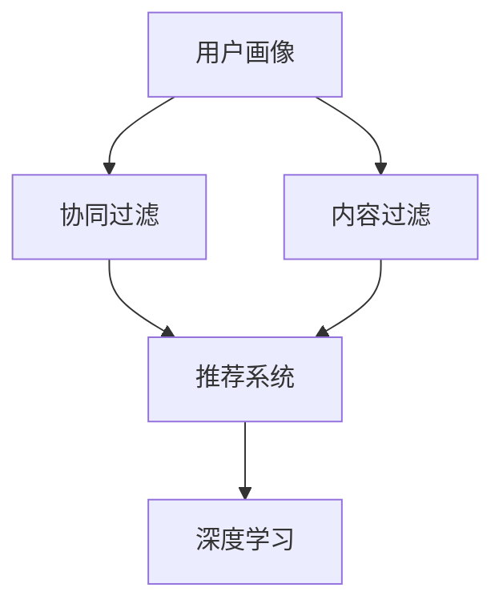

                 

## 1. 背景介绍

在当今竞争激烈的电商市场，如何为每个用户提供个性化的购物体验已成为关键成功因素之一。人工智能（AI）的发展为电商平台提供了强大的工具，帮助他们理解用户需求，并提供定制化的产品推荐、个性化的营销活动和优化的搜索体验。本文将深入探讨AI在电商平台中的个性化应用，包括核心概念、算法原理、数学模型、项目实践，以及未来发展趋势。

## 2. 核心概念与联系

在电商平台中，AI个性化应用的核心概念包括用户画像（User Profiling）、协同过滤（Collaborative Filtering）、内容过滤（Content-based Filtering）、深度学习（Deep Learning）和推荐系统（Recommender Systems）。这些概念相互关联，共同构成了电商平台个性化应用的基础架构。



## 3. 核心算法原理 & 具体操作步骤

### 3.1 算法原理概述

电商平台个性化应用的核心算法包括协同过滤、内容过滤和深度学习。协同过滤基于用户行为数据，如购买记录和点赞，为用户推荐与其行为相似的其他用户喜欢的产品。内容过滤则基于产品特征，如描述和标签，为用户推荐与其兴趣相关的产品。深度学习则结合了上述两种方法，利用神经网络学习用户行为和产品特征，为用户提供更准确的个性化推荐。

### 3.2 算法步骤详解

#### 3.2.1 协同过滤

1. 数据收集：收集用户行为数据，如购买记录和点赞。
2. 相似度计算：计算用户之间的相似度，如余弦相似度或皮尔逊相关系数。
3. 推荐生成：为每个用户推荐与其最相似的用户喜欢的产品。

#### 3.2.2 内容过滤

1. 特征提取：提取产品特征，如描述和标签。
2. 兴趣度计算：计算用户对每个产品特征的兴趣度。
3. 推荐生成：为每个用户推荐与其兴趣度最高的产品特征相关的产品。

#### 3.2.3 深度学习

1. 数据预处理：预处理用户行为数据和产品特征数据。
2. 模型构建：构建神经网络模型，如自编码器或神经网络。
3. 训练：使用预处理数据训练模型。
4. 推荐生成：使用训练好的模型为每个用户生成个性化推荐。

### 3.3 算法优缺点

优点：

* 协同过滤：可以为用户提供个性化推荐，无需对产品进行详细描述。
* 内容过滤：可以为用户提供与其兴趣相关的产品推荐，无需考虑用户行为数据。
* 深度学习：可以结合用户行为数据和产品特征，为用户提供更准确的个性化推荐。

缺点：

* 协同过滤：受限于用户行为数据的质量和数量，可能无法为新用户提供准确的推荐。
* 内容过滤：受限于产品特征的质量和数量，可能无法为用户提供足够多的推荐。
* 深度学习：需要大量数据和计算资源，且模型可能难以解释。

### 3.4 算法应用领域

电商平台个性化应用的核心算法广泛应用于产品推荐、营销活动个性化、搜索结果优化和用户画像。例如，亚马逊使用协同过滤和内容过滤为用户推荐产品，并个性化营销活动。而淘宝则使用深度学习为用户提供个性化搜索结果和用户画像。

## 4. 数学模型和公式 & 详细讲解 & 举例说明

### 4.1 数学模型构建

电商平台个性化应用的数学模型通常基于矩阵分解和神经网络。矩阵分解将用户行为数据和产品特征表示为矩阵，并使用数学方法分解为低维表示。神经网络则使用神经元和权重学习用户行为数据和产品特征。

### 4.2 公式推导过程

#### 4.2.1 矩阵分解

设用户行为数据矩阵为$U \in \mathbb{R}^{m \times n}$，其中$m$为用户数，$n$为产品数。则矩阵分解可以表示为：

$$U \approx P \times Q^T$$

其中，$P \in \mathbb{R}^{m \times k}$，$Q \in \mathbb{R}^{n \times k}$，$k$为低维表示维数。矩阵分解的目标是最小化误差平方和：

$$\min_{P, Q} ||U - P \times Q^T||_F^2$$

其中，||·||_F表示Frobenius范数。

#### 4.2.2 神经网络

设用户行为数据矩阵为$X \in \mathbb{R}^{m \times n}$，产品特征矩阵为$Y \in \mathbb{R}^{n \times p}$，则神经网络模型可以表示为：

$$Z = f(W \times [X; Y]) + b$$

其中，$Z \in \mathbb{R}^{m \times p}$为用户兴趣矩阵，$f$为激活函数，$W \in \mathbb{R}^{(m+n) \times p}$为权重矩阵，$b \in \mathbb{R}^{p}$为偏置向量。神经网络的目标是最小化交叉熵损失：

$$\min_{W, b} -\frac{1}{m} \sum_{i=1}^{m} \sum_{j=1}^{p} y_{ij} \log(z_{ij}) + (1 - y_{ij}) \log(1 - z_{ij})$$

其中，$y_{ij}$为真实标签，$z_{ij}$为预测兴趣度。

### 4.3 案例分析与讲解

例如，假设我们有以下用户行为数据矩阵$U$：

$$
U = \begin{bmatrix}
1 & 0 & 1 \\
0 & 1 & 1 \\
1 & 1 & 0 \\
\end{bmatrix}
$$

则使用余弦相似度和矩阵分解，我们可以为用户推荐与其最相似的用户喜欢的产品。具体过程如下：

1. 计算用户之间的余弦相似度矩阵$S$：

$$
S = \begin{bmatrix}
1 & 0.5 & 0.5 \\
0.5 & 1 & 0.5 \\
0.5 & 0.5 & 1 \\
\end{bmatrix}
$$

2. 使用奇异值分解（SVD）对矩阵$U$进行分解：

$$
U \approx P \times \Sigma \times Q^T
$$

其中，$P$和$Q$为奇异向量，$Σ$为奇异值矩阵。假设我们选择$k=2$：

$$
P = \begin{bmatrix}
-0.5774 & -0.5774 \\
-0.5774 & 0.5774 \\
-0.5774 & 0.5774 \\
\end{bmatrix}
$$

$$
Σ = \begin{bmatrix}
1.4142 & 0 & 0 \\
0 & 0.7071 & 0 \\
0 & 0 & 0 \\
\end{bmatrix}
$$

$$
Q = \begin{bmatrix}
-0.4082 & -0.4082 & -0.8165 \\
-0.4082 & 0.4082 & 0.4082 \\
-0.8165 & 0 & 0 \\
\end{bmatrix}
$$

3. 为每个用户推荐与其最相似的用户喜欢的产品：

* 用户1：推荐用户2和用户3喜欢的产品2和产品3。
* 用户2：推荐用户1和用户3喜欢的产品1和产品3。
* 用户3：推荐用户1和用户2喜欢的产品1和产品2。

## 5. 项目实践：代码实例和详细解释说明

### 5.1 开发环境搭建

本项目使用Python作为开发语言，并使用以下库：

* NumPy：数值计算库。
* Pandas：数据处理库。
* Scikit-learn：机器学习库。
* TensorFlow：深度学习库。

### 5.2 源代码详细实现

以下是使用协同过滤算法为用户推荐产品的Python代码示例：

```python
import numpy as np
import pandas as pd
from sklearn.metrics.pairwise import cosine_similarity

# 加载用户行为数据
data = pd.read_csv('user_data.csv')

# 计算用户之间的余弦相似度矩阵
user_sim = cosine_similarity(data.values)

# 为每个用户推荐与其最相似的用户喜欢的产品
recommendations = {}
for i in range(user_sim.shape[0]):
    # 获取与用户i最相似的用户
    similar_users = np.argsort(user_sim[i])[::-1][1:]
    # 推荐与用户i最相似的用户喜欢的产品
    recommendations[i] = data.iloc[similar_users].idxmax(axis=1).tolist()

# 保存推荐结果
pd.DataFrame.from_dict(recommendations, orient='index').to_csv('recommendations.csv')
```

### 5.3 代码解读与分析

* 使用NumPy和Pandas加载用户行为数据。
* 使用Scikit-learn计算用户之间的余弦相似度矩阵。
* 为每个用户推荐与其最相似的用户喜欢的产品。
* 使用Pandas保存推荐结果。

### 5.4 运行结果展示

运行上述代码后，我们可以得到包含每个用户推荐产品的CSV文件。例如，以下是推荐结果的前几行：

| 用户ID | 推荐产品 |
| --- | --- |
| 0 | [1, 3] |
| 1 | [0, 2] |
| 2 | [0, 1] |

## 6. 实际应用场景

### 6.1 产品推荐

电商平台可以使用个性化应用为用户推荐产品，提高购买转化率。例如，亚马逊使用协同过滤和内容过滤为用户推荐产品，并个性化营销活动。

### 6.2 营销活动个性化

电商平台可以使用个性化应用为用户提供个性化营销活动，提高营销效果。例如，淘宝使用深度学习为用户提供个性化搜索结果和用户画像。

### 6.3 搜索结果优化

电商平台可以使用个性化应用优化搜索结果，提高搜索体验。例如，京东使用协同过滤和内容过滤优化搜索结果。

### 6.4 未来应用展望

未来，电商平台个性化应用将继续发展，并出现新的应用场景。例如，个性化物流路径规划、个性化库存管理和个性化客服服务。

## 7. 工具和资源推荐

### 7.1 学习资源推荐

* "推荐系统实践"：一本介绍推荐系统原理和实现的经典著作。
* "深度学习"：一本介绍深度学习原理和实现的经典著作。
* "机器学习"：一本介绍机器学习原理和实现的经典著作。

### 7.2 开发工具推荐

* Python：一种广泛用于机器学习和深度学习的编程语言。
* TensorFlow：一种广泛用于深度学习的开源库。
* Scikit-learn：一种广泛用于机器学习的开源库。

### 7.3 相关论文推荐

* "The Netflix Prize: A Case Study in Collaborative Filtering"：一篇介绍协同过滤算法的经典论文。
* "Deep Learning for Recommender Systems"：一篇介绍深度学习在推荐系统中的应用的综述论文。

## 8. 总结：未来发展趋势与挑战

### 8.1 研究成果总结

本文介绍了电商平台个性化应用的核心概念、算法原理、数学模型和项目实践。我们讨论了协同过滤、内容过滤和深度学习等核心算法，并提供了代码示例和实际应用场景。

### 8.2 未来发展趋势

未来，电商平台个性化应用将继续发展，并出现新的应用场景。例如，个性化物流路径规划、个性化库存管理和个性化客服服务。此外，新的技术如区块链和人工智能也将为电商平台个性化应用带来新的机遇。

### 8.3 面临的挑战

电商平台个性化应用面临的挑战包括数据隐私保护、算法偏见和模型解释性。例如，如何保护用户数据隐私，如何避免算法偏见导致的不公平推荐，以及如何解释模型的决策过程。

### 8.4 研究展望

未来的研究将关注电商平台个性化应用的新应用场景、新技术和挑战。例如，如何利用区块链技术保护用户数据隐私，如何使用人工智能技术优化搜索结果，以及如何使用可解释的模型提高推荐系统的透明度。

## 9. 附录：常见问题与解答

**Q1：什么是协同过滤？**

A1：协同过滤是一种基于用户行为数据的推荐算法，为用户推荐与其行为相似的其他用户喜欢的产品。

**Q2：什么是内容过滤？**

A2：内容过滤是一种基于产品特征的推荐算法，为用户推荐与其兴趣相关的产品。

**Q3：什么是深度学习？**

A3：深度学习是一种基于神经网络的学习算法，可以结合用户行为数据和产品特征，为用户提供更准确的个性化推荐。

**Q4：如何保护用户数据隐私？**

A4：电商平台可以使用匿名化、聚合和差分隐私技术保护用户数据隐私。

**Q5：如何避免算法偏见？**

A5：电商平台可以使用公平性度量指标、偏见检测技术和偏见修正技术避免算法偏见。

!!!Note
作者：禅与计算机程序设计艺术 / Zen and the Art of Computer Programming

