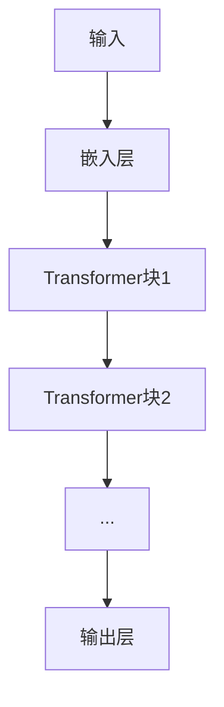

                 

- AI大模型
- 创业
- 挑战
- 机遇
- 创新
- 算法
- 算力

## 1. 背景介绍

当前，人工智能（AI）领域正处于一个快速发展的时期，其中大模型（Large Language Models）的出现和应用引起了广泛的关注。大模型是一种能够理解和生成人类语言的AI模型，其在自然语言处理（NLP）、计算机视觉、推荐系统等领域取得了显著的成就。然而，大模型的创业之路并非一帆风顺，挑战和机遇并存。本文将从技术、商业和监管等角度分析大模型创业面临的挑战和机遇，并提供一些建议和展望。

## 2. 核心概念与联系

### 2.1 大模型的定义

大模型是指具有数十亿甚至数千亿参数的深度学习模型，能够理解和生成人类语言，并展示出类似人类的推理和理解能力。大模型的训练需要大量的数据和计算资源，因此其开发和部署成本很高。

### 2.2 大模型的架构

大模型的架构通常是基于Transformer结构的，如图1所示。Transformer模型由自注意力机制和位置编码组成，能够处理序列数据，如文本和时间序列。大模型通常由数百层到数千层的Transformer块组成，每层包含多个自注意力头和全连接层。



### 2.3 大模型的训练

大模型的训练需要大量的数据和计算资源。通常，大模型需要在数千个GPU上训练数千个小时，才能收敛到一个合理的解。此外，大模型的训练需要大量的数据标注，这也是一个昂贵和耗时的过程。

## 3. 核心算法原理 & 具体操作步骤

### 3.1 算法原理概述

大模型的核心算法是Transformer模型，其基于自注意力机制和位置编码。自注意力机制允许模型关注输入序列的不同部分，位置编码则帮助模型理解输入序列的顺序。大模型通过在Transformer块上堆叠多个自注意力头和全连接层，进一步增强其表示能力。

### 3.2 算法步骤详解

大模型的训练过程如下：

1. 数据预处理：对输入数据进行分词、标注和嵌入等预处理操作。
2. 模型初始化：初始化模型参数，通常使用 Xavier 初始化方法。
3. 前向传播：将预处理后的数据输入模型，进行前向传播，得到输出。
4. 计算损失：计算模型输出和真实值之间的损失，通常使用交叉熵损失。
5. 反向传播：计算梯度，更新模型参数。
6. 重复步骤3-5，直到模型收敛。

### 3.3 算法优缺点

大模型的优点包括：

* 表示能力强：大模型能够表示复杂的语义关系，并生成人类语言。
* 通用性强：大模型可以在多个任务上取得良好表现，如NLP、计算机视觉和推荐系统。
* 可解释性强：大模型的输出可以通过注意力权重进行解释，帮助理解模型的决策过程。

大模型的缺点包括：

* 训练成本高：大模型需要大量的数据和计算资源，训练成本很高。
* 部署成本高：大模型的部署需要大量的算力和存储资源，成本也很高。
* 训练数据偏见：大模型的表现受训练数据的质量和偏见影响很大。

### 3.4 算法应用领域

大模型的应用领域包括：

* 自然语言处理：大模型可以用于文本生成、翻译、问答系统和文本分类等任务。
* 计算机视觉：大模型可以用于图像分类、物体检测和图像生成等任务。
* 推荐系统：大模型可以用于个性化推荐、内容生成和用户画像等任务。

## 4. 数学模型和公式 & 详细讲解 & 举例说明

### 4.1 数学模型构建

大模型的数学模型可以表示为：

$$h_t = \text{Transformer}(x_t, h_{t-1})$$

其中，$h_t$是时间步$t$的隐藏状态，$x_t$是时间步$t$的输入，$h_{t-1}$是时间步$t-1$的隐藏状态。

### 4.2 公式推导过程

Transformer模型的自注意力机制可以表示为：

$$Q = W^Qx, K = W^Kx, V = W^Vx$$

$$z = \text{softmax}(\frac{QK^T}{\sqrt{d_k}})V$$

其中，$W^Q, W^K, W^V$是学习参数，$d_k$是查询和键的维度。

### 4.3 案例分析与讲解

例如，在文本生成任务中，大模型可以生成下一个单词的概率分布，并选择概率最高的单词作为输出。图2所示为大模型在文本生成任务中的示意图。


## 5. 项目实践：代码实例和详细解释说明

### 5.1 开发环境搭建

大模型的开发需要GPU集群和大量的存储资源。通常，开发者需要使用分布式训练框架，如PyTorch或TensorFlow，在多个GPU上并行训练模型。

### 5.2 源代码详细实现

大模型的源代码通常由多个模块组成，包括数据预处理、模型定义、损失函数、优化器和训练循环等。以下是大模型训练循环的伪代码：

```python
for epoch in range(num_epochs):
    for batch in train_loader:
        optimizer.zero_grad()
        outputs = model(inputs)
        loss = criterion(outputs, labels)
        loss.backward()
        optimizer.step()
```

### 5.3 代码解读与分析

在训练循环中，开发者需要定义模型、损失函数和优化器。模型通常是基于Transformer结构定义的，损失函数通常是交叉熵损失，优化器通常是Adam或SGD等。开发者还需要定义数据预处理和数据加载等操作。

### 5.4 运行结果展示

大模型的运行结果通常是生成的文本、图像或推荐列表等。开发者需要定义评估指标，如BLEU、ROUGE或precision@k等，来评估模型的表现。

## 6. 实际应用场景

### 6.1 当前应用

大模型当前的应用包括：

* 文本生成：大模型可以用于生成新闻标题、推文或小说等。
* 翻译：大模型可以用于机器翻译，并取得了接近人类翻译质量的成就。
* 问答系统：大模型可以用于构建问答系统，并回答用户的问题。

### 6.2 未来应用展望

未来，大模型的应用将会扩展到更多领域，如：

* 个性化推荐：大模型可以用于个性化推荐，并生成个性化的推荐列表。
* 自动驾驶：大模型可以用于理解和生成语音指令，并帮助自动驾驶系统理解环境。
* 智能客服：大模型可以用于构建智能客服系统，并帮助企业处理客户咨询。

## 7. 工具和资源推荐

### 7.1 学习资源推荐

* "Attention is All You Need"：大模型的开创性论文，介绍了Transformer模型的原理和应用。
* "The Illustrated Transformer"：一篇介绍Transformer模型的入门级文章，提供了大量的可视化示例。
* "Hugging Face Transformers"：一个开源的Transformer模型库，提供了大量的预训练模型和示例代码。

### 7.2 开发工具推荐

* PyTorch：一个流行的深度学习框架，支持分布式训练和动态计算图。
* TensorFlow：一个流行的深度学习框架，支持分布式训练和静态计算图。
* CUDA：一个用于GPU加速的平台，支持并行计算和高性能计算。

### 7.3 相关论文推荐

* "BERT: Pre-training of Deep Bidirectional Transformers for Language Understanding"：介绍了BERT模型的原理和应用，是大模型的代表性工作之一。
* "T5: Text-to-Text Transfer Transformer"：介绍了T5模型的原理和应用，是大模型的另一代表性工作。
* "Longformer: The Long-Document Transformer"：介绍了Longformer模型的原理和应用，是大模型的又一代表性工作。

## 8. 总结：未来发展趋势与挑战

### 8.1 研究成果总结

大模型在自然语言处理、计算机视觉和推荐系统等领域取得了显著的成就，并展示出了强大的表示能力和通用性。然而，大模型的训练和部署成本很高，并且受训练数据的质量和偏见影响很大。

### 8.2 未来发展趋势

未来，大模型的发展趋势包括：

* 更大的模型：大模型的参数数量将会进一步增加，以提高表示能力和通用性。
* 更少的数据：大模型将会使用更少的数据进行训练，以节省成本和减少偏见。
* 更强的可解释性：大模型的可解释性将会得到改进，以帮助理解模型的决策过程。

### 8.3 面临的挑战

大模型面临的挑战包括：

* 算力和存储资源：大模型的训练和部署需要大量的算力和存储资源，成本很高。
* 数据偏见：大模型的表现受训练数据的质量和偏见影响很大，需要进行数据清洗和偏见调整。
* 监管和隐私：大模型的部署需要遵循严格的监管和隐私保护要求，需要进行数据保护和隐私保护措施。

### 8.4 研究展望

未来，大模型的研究将会集中在以下几个方向：

* 更强的表示能力：研究更强的表示方法，以提高大模型的表示能力和通用性。
* 更低的成本：研究更低成本的训练和部署方法，以节省成本和扩大大模型的应用范围。
* 更强的可解释性：研究更强的可解释性方法，以帮助理解大模型的决策过程。

## 9. 附录：常见问题与解答

### 9.1 什么是大模型？

大模型是指具有数十亿甚至数千亿参数的深度学习模型，能够理解和生成人类语言，并展示出类似人类的推理和理解能力。

### 9.2 大模型的优点是什么？

大模型的优点包括表示能力强、通用性强和可解释性强等。

### 9.3 大模型的缺点是什么？

大模型的缺点包括训练成本高、部署成本高和训练数据偏见等。

### 9.4 大模型的应用领域有哪些？

大模型的应用领域包括自然语言处理、计算机视觉和推荐系统等。

### 9.5 大模型的未来发展趋势是什么？

大模型的未来发展趋势包括更大的模型、更少的数据和更强的可解释性等。

## 作者：禅与计算机程序设计艺术 / Zen and the Art of Computer Programming

