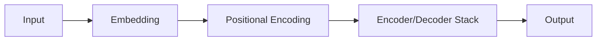

                 

## 1. 背景介绍

当前，人工智能（AI）技术正在迅速发展，大模型（Large Language Models）已经成为AI领域的热点之一。这些模型具有强大的理解和生成文本的能力，为各行各业带来了巨大的创业机遇。然而，如何应对未来行业发展趋势，并成功创业，是一个需要深入思考的问题。本文将从技术、商业和战略角度，探讨AI大模型创业的机遇与挑战，并提供一些建议和实践指南。

## 2. 核心概念与联系

### 2.1 AI大模型的定义

AI大模型是指通过大规模数据训练而获得的，具有强大理解和生成能力的模型。它们通常基于Transformer架构，可以处理长序列数据，并具有出色的零样本学习能力。

### 2.2 Transformer架构

Transformer是一种注意力机制，它允许模型在处理输入序列时关注不同位置的信息。下图是Transformer架构的Mermaid流程图：



### 2.3 AI大模型的应用领域

AI大模型的应用领域非常广泛，包括自然语言处理（NLP）、计算机视觉、生物信息学、材料科学等。它们可以用于文本生成、翻译、问答系统、搜索引擎、内容推荐等任务。

## 3. 核心算法原理 & 具体操作步骤

### 3.1 算法原理概述

AI大模型的核心是Transformer架构，它使用自注意力机制（Self-Attention）和前向传播（Feed-Forward）网络来处理输入序列。模型通过多层Transformer块堆叠来提高表示能力。

### 3.2 算法步骤详解

1. **Embedding**：将输入token映射到向量表示。
2. **Positional Encoding**：为每个token添加位置信息。
3. **Transformer Encoder/Decoder**：使用多层Transformer块处理输入序列。
4. **Output**：生成输出序列。

### 3.3 算法优缺点

**优点**：
- 可以处理长序列数据。
- 具有出色的零样本学习能力。
- 可以生成人类可读的文本。

**缺点**：
- 训练和推理需要大量计算资源。
- 存在过拟合和泄漏问题。
- 缺乏解释性。

### 3.4 算法应用领域

AI大模型的应用领域非常广泛，包括自然语言处理（NLP）、计算机视觉、生物信息学、材料科学等。它们可以用于文本生成、翻译、问答系统、搜索引擎、内容推荐等任务。

## 4. 数学模型和公式 & 详细讲解 & 举例说明

### 4.1 数学模型构建

AI大模型的数学模型可以表示为：

$$h_t = \text{FF}(x_t) + \text{Self-Attention}(x_t, x_t, x_t)$$

其中，$h_t$是时间步$t$的隐藏状态，$x_t$是时间步$t$的输入，$FF$是前向传播网络，$\text{Self-Attention}$是自注意力机制。

### 4.2 公式推导过程

自注意力机制的推导过程如下：

$$Q = x_tW^Q, K = x_tW^K, V = x_tW^V$$

$$Attention(Q, K, V) = \text{softmax}\left(\frac{QK^T}{\sqrt{d_k}}\right)V$$

其中，$W^Q, W^K, W^V$是学习参数，$d_k$是查询（Query）和键（Key）的维度。

### 4.3 案例分析与讲解

例如，在文本生成任务中，输入序列为"Translate the following English text to French：Hello, how are you?"，输出序列为"Traduit le texte anglais suivant en français：Bonjour, comment ça va？"

## 5. 项目实践：代码实例和详细解释说明

### 5.1 开发环境搭建

要开发AI大模型，需要安装以下软件和库：

- Python 3.7+
- PyTorch 1.7+
- Transformers library

### 5.2 源代码详细实现

以下是一个简单的AI大模型（BERT）的实现示例：

```python
from transformers import BertTokenizer, BertForMaskedLM

tokenizer = BertTokenizer.from_pretrained('bert-base-uncased')
model = BertForMaskedLM.from_pretrained('bert-base-uncased')

inputs = tokenizer("Hello, I'm a [MASK] model.", return_tensors="pt")
outputs = model(**inputs)
predictions = outputs[0]
```

### 5.3 代码解读与分析

- `BertTokenizer`用于将文本转换为BERT可以处理的输入格式。
- `BertForMaskedLM`是BERT的掩码语言模型版本，用于预测掩码位置的单词。
- `return_tensors="pt"`将输入转换为PyTorch张量。

### 5.4 运行结果展示

运行上述代码后，`predictions`变量将包含模型对掩码位置的预测。例如，预测结果可能是"model"。

## 6. 实际应用场景

### 6.1 当前应用

AI大模型当前已广泛应用于各种行业，包括金融、医疗、零售、娱乐等。它们用于文本生成、翻译、问答系统、搜索引擎、内容推荐等任务。

### 6.2 未来应用展望

未来，AI大模型有望在更多领域得到应用，包括自动驾驶、物联网、虚拟现实等。它们还将帮助我们更好地理解和生成人类语言，从而推动人机交互的发展。

## 7. 工具和资源推荐

### 7.1 学习资源推荐

- "Attention is All You Need"论文：<https://arxiv.org/abs/1706.03762>
- "BERT: Pre-training of Deep Bidirectional Transformers for Language Understanding"论文：<https://arxiv.org/abs/1810.04805>
- Hugging Face Transformers library：<https://huggingface.co/transformers/>

### 7.2 开发工具推荐

- PyTorch：<https://pytorch.org/>
- TensorFlow：<https://www.tensorflow.org/>
- Jupyter Notebook：<https://jupyter.org/>

### 7.3 相关论文推荐

- "ELMo: Embeddings for Language Modeling"：<https://arxiv.org/abs/1802.05365>
- "ULMFiT: A Simple Approach to Train Deep Language Models"：<https://arxiv.org/abs/1801.06146>

## 8. 总结：未来发展趋势与挑战

### 8.1 研究成果总结

AI大模型已经取得了显著的研究成果，包括BERT、RoBERTa、T5等。它们在各种NLP任务上取得了 state-of-the-art 的结果。

### 8.2 未来发展趋势

未来，AI大模型的发展趋势包括：

- **模型规模**：模型规模将继续扩大，以提高表示能力。
- **多模式学习**：模型将能够处理多模式数据，如文本、图像、音频等。
- **解释性**：模型将变得更加解释性，以帮助我们理解其决策过程。

### 8.3 面临的挑战

AI大模型面临的挑战包括：

- **计算资源**：大规模模型需要大量计算资源。
- **数据泄漏**：模型可能会泄漏训练数据中的信息。
- **偏见**：模型可能会受到训练数据中的偏见影响。

### 8.4 研究展望

未来的研究将关注模型解释性、多模式学习、小数据集下的学习等领域。

## 9. 附录：常见问题与解答

**Q：AI大模型需要多少计算资源？**

**A**：这取决于模型的规模。例如，BERT-base需要4个NVIDIA Tesla V100 GPU，而BERT-large需要16个。

**Q：AI大模型是否会泄漏训练数据？**

**A**：是的，AI大模型可能会泄漏训练数据中的信息。例如，模型可能会生成与训练数据中存在的文本非常相似的文本。

**Q：AI大模型是否会受到偏见影响？**

**A**：是的，AI大模型可能会受到训练数据中的偏见影响。例如，如果训练数据中男性和女性的比例不平衡，模型可能会对男性和女性的理解有偏见。

---

作者：禅与计算机程序设计艺术 / Zen and the Art of Computer Programming

