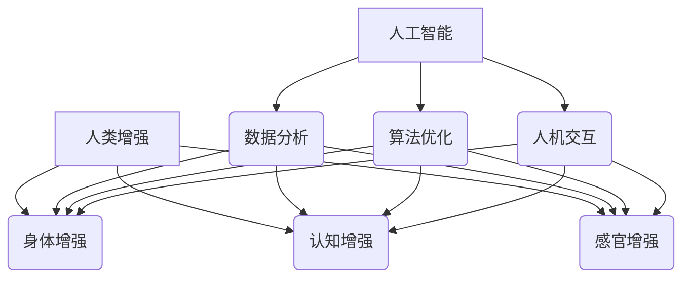

## AI时代的人类增强：道德考虑与身体增强的未来发展机遇、挑战及趋势预测

**关键词：** 人类增强、人工智能、伦理道德、身体增强、未来趋势

## 1. 背景介绍

人类对超越自身极限的渴望由来已久。从神话传说中的神力到科幻小说中的超人，都反映了我们对更强大能力的追求。如今，随着人工智能 (AI) 、生物技术、纳米技术等领域的飞速发展，人类增强正逐渐从科幻走向现实。

人类增强是指利用技术手段来提升人类的身体机能、感官能力或认知水平。AI作为一种强大的赋能技术，在推动人类增强方面扮演着至关重要的角色。然而，与任何颠覆性技术一样，AI赋能的人类增强也引发了一系列伦理道德和社会挑战。

## 2. 核心概念与联系

### 2.1 人类增强

人类增强可以分为三大类：

* **身体增强:**  通过机械、电子或生物技术增强人体机能，例如：
    *  外骨骼机器人：增强力量和耐力
    *  植入式芯片：提供夜视、增强现实等功能
    *  基因编辑：改善肌肉生长、提高免疫力

* **认知增强:**  通过药物、植入物或脑机接口等技术手段提高认知能力，例如：
    *  记忆增强药物：提高记忆力和学习能力
    *  神经植入物：治疗帕金森病、阿尔茨海默病等神经系统疾病
    *  脑机接口：实现大脑与计算机的直接交互

* **感官增强:**  通过技术手段扩展或增强人类感官，例如：
    *  人工视网膜：帮助失明者恢复视力
    *  超声波传感器：感知周围环境

### 2.2 人工智能

人工智能是指由人制造出来的系统所表现出来的智能。在人类增强领域，AI主要应用于以下方面：

* **数据分析:**  分析海量生物数据，为个性化增强方案提供依据
* **算法优化:**  优化增强设备的性能和效率
* **人机交互:**  实现人与增强设备的自然交互

### 2.3 核心概念联系




## 3. 核心算法原理 & 具体操作步骤

由于人类增强是一个跨学科领域，涉及众多技术和方法，本节将以“基于脑机接口的运动功能恢复”为例，介绍其核心算法原理和操作步骤。

### 3.1 算法原理概述

* **脑电信号采集:**  利用脑电图 (EEG) 等技术采集大脑运动皮层的电信号。
* **信号处理与解码:**  使用机器学习算法对脑电信号进行降噪、特征提取和解码，识别出与运动意图相关的脑电模式。
* **神经反馈训练:**  将解码后的运动意图转化为控制信号，驱动外部设备 (如机械臂、外骨骼) 或刺激瘫痪肢体肌肉，帮助患者完成运动。

### 3.2 算法步骤详解

1. **数据采集:**  让患者想象执行特定动作 (如抓握、伸展)，同时采集其脑电信号。
2. **特征提取:**  使用信号处理技术提取脑电信号中的特征，例如：
    *  频域特征：脑电信号在不同频率段的能量分布
    *  时域特征：脑电信号的波峰、波谷等时间特征
3. **模型训练:**  利用机器学习算法 (如支持向量机、神经网络) 训练一个能够将脑电特征映射到运动意图的模型。
4. **实时解码:**  将患者的实时脑电信号输入训练好的模型，解码出其运动意图。
5. **控制输出:**  将解码后的运动意图转化为控制信号，驱动外部设备或刺激肌肉。

### 3.3 算法优缺点

* **优点:**  非侵入性、安全性高、可实现复杂运动控制。
* **缺点:**  脑电信号易受干扰、解码精度有待提高、需要进行长时间训练。

### 3.4 算法应用领域

* **医疗康复:**  帮助瘫痪、中风等患者恢复运动功能。
* **假肢控制:**  控制智能假肢，使其更加灵活自然。
* **人机交互:**  实现更直观、高效的人机交互方式。


## 4. 数学模型和公式 & 详细讲解 & 举例说明

### 4.1 数学模型构建

以线性判别分析 (LDA) 算法为例，介绍其在脑电信号解码中的应用。LDA是一种监督学习算法，其目标是找到一个投影方向，使得不同类别样本在该方向上的投影 möglichst weit voneinander entfernt sind.

假设我们有两类脑电信号，分别对应于“左手运动”和“右手运动”。LDA的目标是找到一个投影方向 $\mathbf{w}$，使得两类信号在该方向上的投影 möglichst weit voneinander entfernt sind.

### 4.2 公式推导过程

LDA的目标函数可以表示为：

$$
J(\mathbf{w}) = \frac{\mathbf{w}^T \mathbf{S}_B \mathbf{w}}{\mathbf{w}^T \mathbf{S}_W \mathbf{w}}
$$

其中：

* $\mathbf{S}_B$ 是类间散布矩阵，表示不同类别样本均值之间的差异。
* $\mathbf{S}_W$ 是类内散布矩阵，表示同一类别样本之间的差异。

为了最大化目标函数 $J(\mathbf{w})$，我们需要找到 $\mathbf{w}$ 的最优解。可以通过求解以下广义特征值问题得到：

$$
\mathbf{S}_B \mathbf{w} = \lambda \mathbf{S}_W \mathbf{w}
$$

其中 $\lambda$ 是特征值。

### 4.3 案例分析与讲解

假设我们采集了100个“左手运动”和100个“右手运动”的脑电信号样本。我们可以使用LDA算法找到一个投影方向，使得两类信号在该方向上的投影 möglichst weit voneinander entfernt sind. 通过计算，我们可以得到一个最优的投影方向 $\mathbf{w}$。然后，我们可以将新的脑电信号样本投影到该方向上，根据其投影值判断其属于哪一类运动意图。


## 5. 项目实践：代码实例和详细解释说明

### 5.1 开发环境搭建

* Python 3.7+
* NumPy
* SciPy
* matplotlib
* scikit-learn

### 5.2 源代码详细实现

```python
import numpy as np
from sklearn.discriminant_analysis import LinearDiscriminantAnalysis

# 加载脑电信号数据
left_hand_data = np.load("left_hand_data.npy")
right_hand_data = np.load("right_hand_data.npy")

# 创建标签
labels = np.concatenate((np.zeros(len(left_hand_data)), np.ones(len(right_hand_data))))

# 合并数据
data = np.concatenate((left_hand_data, right_hand_data))

# 创建LDA模型
lda = LinearDiscriminantAnalysis()

# 训练模型
lda.fit(data, labels)

# 预测新样本
new_sample = np.load("new_sample.npy")
prediction = lda.predict(new_sample)

# 打印预测结果
print("预测结果:", prediction)
```

### 5.3 代码解读与分析

* 首先，我们加载了预先处理好的脑电信号数据和标签。
* 然后，我们使用 `sklearn.discriminant_analysis` 模块中的 `LinearDiscriminantAnalysis` 类创建了一个 LDA 模型。
* 接着，我们使用 `fit()` 方法训练模型，并使用 `predict()` 方法预测新样本的类别。
* 最后，我们打印了预测结果。

### 5.4 运行结果展示

假设 `new_sample.npy` 中存储的是一个“左手运动”的脑电信号样本，那么程序将输出：

```
预测结果: [0.]
```

这表明模型成功地将该样本分类为“左手运动”。


## 6. 实际应用场景

### 6.1 医疗健康

* **残疾人辅助:**  为肢体残疾人士提供义肢控制、外骨骼助力等辅助功能。
* **神经系统疾病治疗:**  治疗帕金森病、阿尔茨海默病等神经系统疾病，改善患者生活质量。
* **精神健康监测:**  监测抑郁症、焦虑症等精神疾病，提供早期预警和干预。

### 6.2 教育培训

* **个性化学习:**  根据学生的个体差异，提供个性化的学习内容和节奏。
* **技能训练:**  利用虚拟现实、增强现实等技术，提供沉浸式、高效的技能训练。
* **认知能力提升:**  开发提高注意力、记忆力、学习能力等认知能力的工具和方法。

### 6.3 其他领域

* **军事:**  增强士兵的体能、感知能力和作战效能。
* **体育竞技:**  提高运动员的训练效率和比赛成绩。
* **艺术创作:**  扩展艺术家的创作手段和表达方式。

### 6.4 未来应用展望

随着技术的进步，AI赋能的人类增强将更加安全、高效、便捷，其应用场景也将更加广泛。未来，我们可以预见以下应用场景：

* **人机融合:**  实现人与机器的深度融合，创造出能力远超人类的“超级人类”。
* **意识上传:**  将人类意识上传到计算机，实现数字永生。
* **基因编辑:**  通过基因编辑技术，从根本上提升人类的智力和体能。


## 7. 工具和资源推荐

### 7.1 学习资源推荐

* **书籍:**
    *  《超级智能:路线图、危险性与应对策略》
    *  《未来简史》
    *  《人类增强:道德、法律和政治问题》
* **网站:**
    *  Future of Humanity Institute
    *  Center for Genetics and Society
    *  The Conversation

### 7.2 开发工具推荐

* **脑机接口:**  OpenBCI, Emotiv, Neurosky
* **机器学习:**  TensorFlow, PyTorch, scikit-learn
* **数据分析:**  Pandas, NumPy, matplotlib

### 7.3 相关论文推荐

*  "Brain-computer interfaces for communication and control"
*  "Human enhancement: concepts, ethics and policy"
*  "The ethics of artificial intelligence"


## 8. 总结：未来发展趋势与挑战

### 8.1 研究成果总结

AI赋能的人类增强是一个充满希望和挑战的领域。近年来，该领域取得了一系列突破性进展，例如：

*  脑机接口技术日益成熟，可以实现对外部设备的复杂控制。
*  基因编辑技术取得重大突破，为治疗遗传性疾病和提升人类潜能提供了新的可能性。
*  人工智能算法不断优化，可以更加精准地分析和预测人类行为。

### 8.2 未来发展趋势

未来，AI赋能的人类增强将朝着以下方向发展：

*  更加安全可靠的技术
*  更加个性化的增强方案
*  更加广泛的应用场景

### 8.3 面临的挑战

*  伦理道德挑战:  如何确保人类增强的公平性、安全性、可控性？
*  社会公平挑战:  如何避免人类增强加剧社会不平等？
*  技术风险挑战:  如何防范人类增强技术被滥用？

### 8.4 研究展望

为了更好地应对挑战，推动AI赋能的人类增强健康发展，我们需要：

*  加强伦理道德研究，制定相关法律法规。
*  促进技术交流与合作，共同推动技术进步。
*  加强公众科普，提高公众对人类增强的认知。

## 9. 附录：常见问题与解答

### 9.1 人类增强会带来哪些风险？

人类增强可能会带来以下风险：

*  **安全风险:**  增强技术本身可能存在安全隐患，例如植入物故障、基因编辑脱靶等。
*  **伦理风险:**  人类增强可能会挑战现有的伦理道德观念，例如改变人类的本质、加剧社会不平等等。
*  **社会风险:**  人类增强可能会引发社会动荡，例如增强人与非增强人之间的冲突。

### 9.2 人类增强会取代人类吗？

目前看来，人类增强还远远没有达到取代人类的程度。人类增强旨在提升人类的能力，而不是取代人类。未来，人类和增强人可能会共存，共同创造更美好的未来。

### 9.3 如何参与人类增强研究？

如果您对人类增强研究感兴趣，可以通过以下途径参与其中：

*  加入相关研究机构或企业。
*  关注相关学术会议和期刊。
*  参与相关社会讨论和活动。


**作者：禅与计算机程序设计艺术 / Zen and the Art of Computer Programming** 