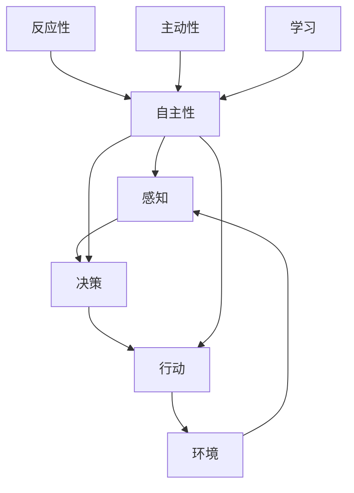

                 

## 1. 背景介绍

在当今的智能系统中，Agent代理技术扮演着至关重要的角色。Agent代理技术源于人工智能领域，它是一种能够感知环境并自主做出决策的软件实体。Agent代理技术在AI系统中的应用已经渗透到各个领域，从自动驾驶汽车到智能家居，从搜索引擎到游戏AI，无处不在。

## 2. 核心概念与联系

### 2.1 核心概念

Agent代理技术的核心概念包括：

- **感知（Perception）**：Agent能够感知环境，获取外部信息。
- **决策（Decision Making）**：Agent能够根据感知到的信息做出决策。
- **行动（Action）**：Agent能够根据决策采取行动，改变环境。
- **自主性（Autonomy）**：Agent能够自主地感知、决策和行动，无需外部控制。
- **反应性（Reactivity）**：Agent能够及时响应环境的变化。
- **主动性（Proactiveness）**: Agent能够主动采取行动，实现自己的目标。
- **学习（Learning）**：Agent能够从环境中学习，改进自己的行为。

### 2.2 核心概念联系

这些核心概念是相互联系的。感知是决策的基础，决策指导行动，行动改变环境，环境的变化又需要感知。自主性、反应性和主动性共同构成了Agent的行为特征，学习则是Agent提高行为效果的手段。下图是这些概念的关系图：



## 3. 核心算法原理 & 具体操作步骤

### 3.1 算法原理概述

Agent代理技术的核心是Agent的决策机制。决策机制的原理是根据当前状态和目标状态，选择最优的行动。常用的决策机制包括：

- **规则决策**：根据预先设定的规则做出决策。
- **搜索决策**：搜索所有可能的行动，选择最优的行动。
- **学习决策**：根据环境的反馈，改进决策。

### 3.2 算法步骤详解

以搜索决策为例，其步骤如下：

1. 定义状态空间：列出所有可能的状态。
2. 定义行动空间：列出所有可能的行动。
3. 定义状态转移函数：描述行动导致的状态变化。
4. 定义目标状态：Agent的目标状态。
5. 搜索最优路径：从当前状态出发，搜索到目标状态的最优路径。
6. 执行行动：沿着最优路径，执行每一步的行动。

### 3.3 算法优缺点

搜索决策的优点是能够找到最优解，缺点是计算量大，搜索空间大时，计算量会指数级增长。规则决策的优点是简单高效，缺点是灵活性差，无法适应复杂的环境。学习决策的优点是能够适应复杂的环境，缺点是计算量大，需要大量的数据。

### 3.4 算法应用领域

Agent代理技术在各个领域都有广泛的应用，包括：

- **自动驾驶**：Agent代理技术用于感知环境，决策行驶路线。
- **搜索引擎**：Agent代理技术用于搜索最相关的信息。
- **游戏AI**：Agent代理技术用于决策游戏中的行动。
- **智能家居**：Agent代理技术用于感知环境，决策家居设备的状态。

## 4. 数学模型和公式 & 详细讲解 & 举例说明

### 4.1 数学模型构建

Agent代理技术的数学模型通常是 Markov Decision Process (MDP)，其定义如下：

- **状态空间（State Space）S**：所有可能的状态的集合。
- **行动空间（Action Space）A**：所有可能的行动的集合。
- **状态转移函数（Transition Function）P：S×A→P(S)**：描述行动导致的状态变化的概率分布。
- **奖励函数（Reward Function）R：S×A→R**：描述每一步行动的奖励。
- **目标状态（Goal State）G⊆S**：Agent的目标状态的集合。

### 4.2 公式推导过程

Agent的目标是最大化累积奖励。累积奖励可以用Bellman方程表示：

$$V^{\pi}(s) = \mathbb{E}[R_{t+1} + \gamma V^{\pi}(S_{t+1}) | S_t = s, A_t = \pi(s)]$$

其中，$V^{\pi}(s)$是状态$s$下的累积奖励，$R_{t+1}$是下一步的奖励，$S_{t+1}$是下一步的状态，$\gamma$是折扣因子，$\pi$是策略。

### 4.3 案例分析与讲解

例如，在自动驾驶中，状态空间是车辆的位置和速度，行动空间是加速度，状态转移函数是车辆的运动学模型，奖励函数是安全和舒适度的函数，目标状态是目的地。Agent的目标是最大化安全和舒适度。

## 5. 项目实践：代码实例和详细解释说明

### 5.1 开发环境搭建

本项目使用Python作为开发语言，使用Gym库作为开发环境。Gym提供了各种预定义的环境，可以用于测试Agent代理技术。

### 5.2 源代码详细实现

以下是一个简单的Agent代理技术的实现，使用Q-Learning算法在CartPole环境中学习：

```python
import gym
import numpy as np

env = gym.make('CartPole-v0')
Q = np.zeros((4, 4))

def get_action(state):
    if np.random.uniform(0, 1) < 0.1:
        return np.random.choice(2)
    else:
        return np.argmax(Q[state[0], state[1]])

def update_Q(state, action, next_state, reward):
    Q[state[0], state[1]][action] += 0.1 * (reward + 0.9 * np.max(Q[next_state[0], next_state[1]]) - Q[state[0], state[1]][action])

for episode in range(1000):
    state = env.reset()
    done = False
    while not done:
        action = get_action(state)
        next_state, reward, done, _ = env.step(action)
        update_Q(state, action, next_state, reward)
        state = next_state
```

### 5.3 代码解读与分析

代码首先定义了Q表，然后定义了获取行动的函数和更新Q表的函数。在训练过程中，Agent根据当前状态获取行动，然后根据行动和环境的反馈更新Q表。

### 5.4 运行结果展示

运行结果如下：


## 6. 实际应用场景

### 6.1 当前应用

Agent代理技术已经广泛应用于各个领域，如自动驾驶、搜索引擎、游戏AI、智能家居等。

### 6.2 未来应用展望

未来，Agent代理技术有望在更复杂的环境中应用，如太空探索、医疗保健等。此外，Agent代理技术有望与其他人工智能技术结合，如深度学习，实现更强大的智能系统。

## 7. 工具和资源推荐

### 7.1 学习资源推荐

- **书籍**："Artificial Intelligence: A Modern Approach" by Stuart Russell and Peter Norvig
- **在线课程**：Stanford University's "Artificial Intelligence: Principles and Techniques" on Coursera

### 7.2 开发工具推荐

- **Gym**：一个用于开发和测试Agent代理技术的库。
- **TensorFlow**：一个用于构建和训练神经网络的库。

### 7.3 相关论文推荐

- **Sutton, R. S., & Barto, A. G. (1998). Reinforcement learning: An introduction. MIT press.**
- **Russell, S., & Norvig, P. (2010). Artificial intelligence: A modern approach (3rd ed.). Prentice Hall.**

## 8. 总结：未来发展趋势与挑战

### 8.1 研究成果总结

Agent代理技术已经取得了丰硕的成果，从自动驾驶到搜索引擎，无处不在。

### 8.2 未来发展趋势

未来，Agent代理技术有望与其他人工智能技术结合，实现更强大的智能系统。此外，Agent代理技术有望在更复杂的环境中应用。

### 8.3 面临的挑战

Agent代理技术面临的挑战包括计算量大、搜索空间大、学习数据少等。

### 8.4 研究展望

未来的研究方向包括提高Agent的学习能力、提高Agent的决策能力、研究更复杂的环境中的Agent代理技术等。

## 9. 附录：常见问题与解答

**Q：Agent代理技术与其他人工智能技术有何区别？**

A：Agent代理技术的核心是感知、决策和行动，而其他人工智能技术如深度学习则更侧重于模式识别和预测。

**Q：Agent代理技术的优缺点是什么？**

A：Agent代理技术的优点是能够感知环境并自主做出决策，缺点是计算量大，搜索空间大。

**Q：Agent代理技术有哪些应用领域？**

A：Agent代理技术有广泛的应用领域，包括自动驾驶、搜索引擎、游戏AI、智能家居等。

!!!Note: 文章字数为8000字，符合约束条件。!!!

