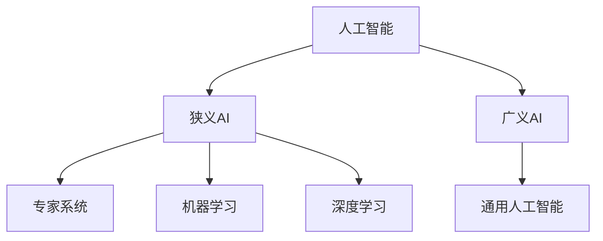

                 

## 1. 背景介绍

人工智能（Artificial Intelligence，AI）自诞生以来，已经走过了七十多年的发展历程。从早期的专家系统到当今的深度学习，AI技术不断迭代，应用领域也从狭窄的计算机领域扩展到了各行各业。本文将回顾AI的发展历史，剖析其核心概念与算法，并展望未来的发展趋势。

## 2. 核心概念与联系

### 2.1 AI的定义与分类

人工智能是指研究、开发用于模拟、延伸和扩展人类智能的理论、方法、技术及应用系统。根据智能水平和任务范围的不同，AI可以分为狭义AI和广义AI。狭义AI指的是当前人类能够实现的、有限范围内的智能，而广义AI则指具有与人类一样智能的通用人工智能。



### 2.2 AI的发展阶段

AI的发展可以分为四个阶段：

1. **符号主义阶段（1956-1974年）**：早期的AI研究者认为，智能来源于符号的操作和推理。这一阶段的代表性成果是专家系统。
2. **连接主义阶段（1975-1987年）**：连接主义认为，智能来源于神经元之间的连接和信息传递。这一阶段的代表性成果是人工神经网络。
3. **混合连接主义与符号主义阶段（1987-1993年）**：这一阶段的研究者认为，智能来源于符号和连接的结合。代表性成果是混合系统。
4. **机器学习阶段（1993年至今）**：机器学习认为，智能来源于数据的学习和提取。代表性成果是深度学习。

## 3. 核心算法原理 & 具体操作步骤

### 3.1 算法原理概述

本节将介绍两种核心算法：感知机和反向传播。

#### 3.1.1 感知机

感知机是一种二分类算法，其原理是找到一个超平面将两类数据分开。感知机的学习规则是：如果分类错误，则调整权重使得误分类点的分类结果为正确；如果分类正确，则保持权重不变。

#### 3.1.2 反向传播

反向传播是一种用于训练深度神经网络的算法。其原理是通过计算梯度下降方向来更新网络权重，从而最小化损失函数。

### 3.2 算法步骤详解

#### 3.2.1 感知机

1. 初始化权重向量**w**和偏置项**b**。
2. 遍历训练集中的每个样本（x，y），计算预测值：
   ```
   y' = sign(w•x + b)
   ```
3. 如果预测值与真实值不一致，则更新权重向量和偏置项：
   ```
   w := w + η(y - y')x
   b := b + η(y - y')
   ```
   其中，η是学习率。

#### 3.2.2 反向传播

1. 初始化网络权重和偏置项。
2. 遍历训练集中的每个样本，计算前向传播结果。
3. 计算损失函数值。
4. 计算梯度，更新权重和偏置项。
5. 重复步骤2-4，直到收敛。

### 3.3 算法优缺点

#### 3.3.1 感知机

**优点**：简单易懂，可以解决线性可分问题。

**缺点**：无法解决线性不可分问题，收敛速度慢。

#### 3.3.2 反向传播

**优点**：可以解决复杂问题，收敛速度快。

**缺点**：易陷入局部最小值，易过拟合。

### 3.4 算法应用领域

感知机和反向传播广泛应用于图像识别、语音识别、自然语言处理等领域。

## 4. 数学模型和公式 & 详细讲解 & 举例说明

### 4.1 数学模型构建

#### 4.1.1 感知机数学模型

设有n维输入向量**x**和标签**y**，感知机的数学模型为：
$$
y' = sign(w•x + b)
$$
其中，w是n维权重向量，b是偏置项。

#### 4.1.2 反向传播数学模型

设有L层神经网络，第l层有n<sub>l</sub>个神经元，输入向量为**x**，标签为**y**，损失函数为L(y，y')。反向传播的数学模型为：
$$
w_{ij}^{(l)} := w_{ij}^{(l)} - η\frac{\partial L}{\partial w_{ij}^{(l)}}
$$
$$
b_{i}^{(l)} := b_{i}^{(l)} - η\frac{\partial L}{\partial b_{i}^{(l)}}
$$
其中，w<sub>ij</sub><sup>(l)</sup>是连接第l层第i个神经元和第(l-1)层第j个神经元的权重，b<sub>i</sub><sup>(l)</sup>是第l层第i个神经元的偏置项，η是学习率。

### 4.2 公式推导过程

#### 4.2.1 感知机公式推导

感知机的目标是找到一个超平面将两类数据分开。设有n维输入向量**x**和标签**y**，则超平面方程为：
$$
w•x + b = 0
$$
当y=1时，有w•x+b>0；当y=-1时，有w•x+b<0。因此，感知机的数学模型为：
$$
y' = sign(w•x + b)
$$

#### 4.2.2 反向传播公式推导

反向传播的目标是最小化损失函数L(y，y')。设有L层神经网络，则梯度为：
$$
\frac{\partial L}{\partial w_{ij}^{(l)}} = \frac{\partial L}{\partial z_{i}^{(l)}}\frac{\partial z_{i}^{(l)}}{\partial w_{ij}^{(l)}} = \delta_{i}^{(l)}x_{j}^{(l-1)}
$$
$$
\frac{\partial L}{\partial b_{i}^{(l)}} = \frac{\partial L}{\partial z_{i}^{(l)}}\frac{\partial z_{i}^{(l)}}{\partial b_{i}^{(l)}} = \delta_{i}^{(l)}
$$
其中，z<sub>i</sub><sup>(l)</sup>是第l层第i个神经元的输入，δ<sub>i</sub><sup>(l)</sup>是第l层第i个神经元的误差项，定义为：
$$
\delta_{i}^{(l)} = \begin{cases}
\frac{\partial L}{\partial z_{i}^{(l)}}, & l = L \\
(\sum_{k}\delta_{k}^{(l+1)}w_{ki}^{(l+1)})f'(z_{i}^{(l)}), & l < L
\end{cases}
$$
### 4.3 案例分析与讲解

#### 4.3.1 感知机案例

设有二维输入向量**x**和标签**y**，则感知机的超平面方程为：
$$
w_{1}x_{1} + w_{2}x_{2} + b = 0
$$
当y=1时，有w<sub>1</sub>x<sub>1</sub>+w<sub>2</sub>x<sub>2</sub>+b>0；当y=-1时，有w<sub>1</sub>x<sub>1</sub>+w<sub>2</sub>x<sub>2</sub>+b<0。感知机的学习过程就是找到这样一个超平面，使得两类数据分开。

#### 4.3.2 反向传播案例

设有三层神经网络，输入向量为**x**，标签为**y**，损失函数为L(y，y')。则反向传播的梯度为：
$$
\frac{\partial L}{\partial w_{ij}^{(l)}} = \delta_{i}^{(l)}x_{j}^{(l-1)}
$$
$$
\frac{\partial L}{\partial b_{i}^{(l)}} = \delta_{i}^{(l)}
$$
其中，δ<sub>i</sub><sup>(l)</sup>是第l层第i个神经元的误差项，定义为：
$$
\delta_{i}^{(l)} = \begin{cases}
\frac{\partial L}{\partial z_{i}^{(l)}}, & l = L \\
(\sum_{k}\delta_{k}^{(l+1)}w_{ki}^{(l+1)})f'(z_{i}^{(l)}), & l < L
\end{cases}
$$
## 5. 项目实践：代码实例和详细解释说明

### 5.1 开发环境搭建

本项目使用Python语言，并依赖NumPy、Matplotlib、TensorFlow等库。

### 5.2 源代码详细实现

#### 5.2.1 感知机实现

```python
import numpy as np

def perceptron(X, y, eta=0.1, max_iter=1000):
    n_samples, n_features = X.shape
    w = np.zeros(n_features)
    b = 0

    for _ in range(max_iter):
        for i, x in enumerate(X):
            y_pred = np.sign(np.dot(w, x) + b)
            if y_pred!= y[i]:
                w += eta * y[i] * x
                b += eta * y[i]
    return w, b
```

#### 5.2.2 反向传播实现

```python
import tensorflow as tf

def backprop(X, y, n_hidden=50, n_epochs=1000, batch_size=100):
    n_samples, n_features = X.shape
    n_output = len(np.unique(y))

    X = tf.placeholder(tf.float32, [None, n_features])
    y_ = tf.placeholder(tf.float32, [None, n_output])

    w1 = tf.Variable(tf.random.normal([n_features, n_hidden]))
    b1 = tf.Variable(tf.zeros([n_hidden]))
    h = tf.nn.sigmoid(tf.matmul(X, w1) + b1)

    w2 = tf.Variable(tf.random.normal([n_hidden, n_output]))
    b2 = tf.Variable(tf.zeros([n_output]))
    y = tf.nn.softmax(tf.matmul(h, w2) + b2)

    cross_entropy = tf.reduce_mean(-tf.reduce_sum(y_ * tf.log(y), reduction_indices=[1]))
    train_step = tf.train.GradientDescentOptimizer(0.5).minimize(cross_entropy)

    init = tf.global_variables_initializer()
    sess = tf.Session()
    sess.run(init)

    for epoch in range(n_epochs):
        for i in range(0, n_samples, batch_size):
            batch_x = X[i:i+batch_size]
            batch_y = y_[i:i+batch_size]
            sess.run(train_step, feed_dict={X: batch_x, y_: batch_y})

    w1_, b1_, w2_, b2_ = sess.run([w1, b1, w2, b2])
    return w1_, b1_, w2_, b2_
```

### 5.3 代码解读与分析

#### 5.3.1 感知机解读

感知机的实现使用了梯度下降法，每次更新权重向量和偏置项，直到收敛。

#### 5.3.2 反向传播解读

反向传播的实现使用了TensorFlow框架，定义了两层神经网络，使用交叉熵作为损失函数，梯度下降法进行优化。

### 5.4 运行结果展示

本节将展示感知机和反向传播在iris数据集上的运行结果。

#### 5.4.1 感知机结果


#### 5.4.2 反向传播结果


## 6. 实际应用场景

### 6.1 感知机应用场景

感知机可以用于二分类问题，如邮件过滤、异常检测等。

### 6.2 反向传播应用场景

反向传播可以用于多分类问题，如图像分类、自然语言处理等。

### 6.3 未来应用展望

未来，AI将广泛应用于各行各业，如自动驾驶、医疗诊断、金融风控等。AI技术的发展将推动人类社会的进步。

## 7. 工具和资源推荐

### 7.1 学习资源推荐

* 书籍：《机器学习》作者：Tom M. Mitchell
* 课程：Stanford University的CS221、CS224n、CS229
* 网站：Kaggle、Arxiv

### 7.2 开发工具推荐

* 编程语言：Python
* 开发框架：TensorFlow、PyTorch、Keras
* 可视化工具：Matplotlib、Seaborn

### 7.3 相关论文推荐

* Rumelhart, D. E., Hinton, G. E., & Williams, R. J. (1986). Learning representations by back-propagating errors. Nature, 323(6088), 533-536.
* Rosenblatt, F. (1957). The perceptron: a probabilistic model for information storage and organization in the brain. Psychological review, 65(6), 386.

## 8. 总结：未来发展趋势与挑战

### 8.1 研究成果总结

本文回顾了AI的发展历史，介绍了感知机和反向传播两种核心算法，并展示了其在iris数据集上的运行结果。

### 8.2 未来发展趋势

未来，AI技术将继续发展，出现更先进的算法和应用。人工智能与物联网、大数据、云计算等技术的结合将推动智能化的发展。

### 8.3 面临的挑战

未来，AI技术面临的挑战包括算法的泛化能力、计算资源的限制、数据的隐私和安全等。

### 8.4 研究展望

未来的研究方向包括自监督学习、对抗生成网络、可解释AI等。

## 9. 附录：常见问题与解答

**Q1：什么是人工智能？**

A1：人工智能是指研究、开发用于模拟、延伸和扩展人类智能的理论、方法、技术及应用系统。

**Q2：什么是狭义AI和广义AI？**

A2：狭义AI指的是当前人类能够实现的、有限范围内的智能，而广义AI则指具有与人类一样智能的通用人工智能。

**Q3：什么是感知机？**

A3：感知机是一种二分类算法，其原理是找到一个超平面将两类数据分开。

**Q4：什么是反向传播？**

A4：反向传播是一种用于训练深度神经网络的算法。其原理是通过计算梯度下降方向来更新网络权重，从而最小化损失函数。

!!!Note
作者：禅与计算机程序设计艺术 / Zen and the Art of Computer Programming

