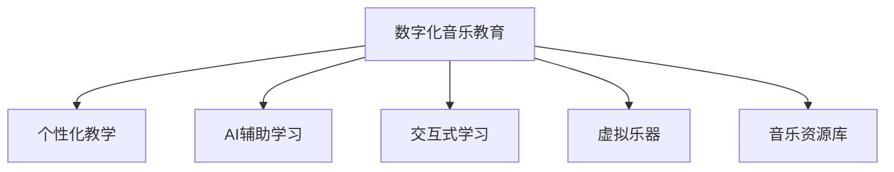

                 

# 数字化音乐教育创业：AI辅助的乐器学习

> 关键词：
数字化音乐教育, 乐器学习, AI辅助, 学习平台, 个性化教学, 交互式学习

## 1. 背景介绍

### 1.1 问题由来

音乐作为人类情感和文化的载体，长期以来一直是教育的重要组成部分。然而，传统的音乐教育面临着师资力量不足、教学资源匮乏等问题，尤其是在偏远地区和农村学校。随着数字化技术的发展，特别是人工智能和大数据技术的进步，音乐教育迎来了新的发展机遇。通过数字化手段，可以突破时间和空间的限制，提供更加高效、个性化的音乐学习体验，满足不同年龄、不同背景学习者的需求。

### 1.2 问题核心关键点

数字化音乐教育的核心在于如何利用AI技术，结合丰富的音乐资源，为学习者提供个性化的学习路径和交互式学习环境。其关键点包括：
- 个性化学习路径设计：通过分析学习者的学习习惯和能力，为其量身定制学习计划。
- 实时反馈和评价：利用AI技术实时跟踪学习者的进展，及时提供反馈和指导。
- 交互式学习体验：通过虚拟乐器和虚拟环境，让学习者沉浸式体验音乐学习的乐趣。
- 跨文化音乐教育：利用数字化手段，为不同文化背景的学习者提供丰富的音乐资源，拓宽学习视野。

### 1.3 问题研究意义

数字化音乐教育的兴起，不仅为音乐学习者提供了更加便捷、高效的学习方式，还为音乐教育者提供了新的教学工具和手段。通过数字化手段，可以推动音乐教育资源的普及，促进音乐教育的公平性和普惠性。同时，数字化音乐教育也为音乐产业的创新发展提供了新的机遇，如在线音乐课堂、虚拟音乐演出等，能够激发更多人对音乐的兴趣和热爱。

## 2. 核心概念与联系

### 2.1 核心概念概述

为更好地理解数字化音乐教育与AI辅助乐器学习的技术框架，本节将介绍几个密切相关的核心概念：

- 数字化音乐教育：利用数字技术，如计算机、互联网、移动设备等，为学习者提供音乐知识和技能的学习平台。
- 个性化教学：根据学习者的个性化需求，动态调整教学内容和难度，实现差异化教育。
- AI辅助学习：利用人工智能技术，如机器学习、自然语言处理、计算机视觉等，辅助学习者进行自主学习。
- 交互式学习：通过人机互动的方式，提升学习者的参与度和积极性，增强学习效果。
- 虚拟乐器：利用虚拟现实(VR)和增强现实(AR)技术，创建逼真的乐器演奏体验，增强学习者的沉浸感。
- 音乐资源库：构建一个包含各种音乐理论和实践资源的数字化平台，便于学习者随时检索和应用。

这些核心概念之间的逻辑关系可以通过以下Mermaid流程图来展示：



这个流程图展示了数字化音乐教育的各个关键组成部分，以及它们之间的相互关系。通过这些技术手段的结合，数字化音乐教育可以更好地支持学习者的自主学习和发展。

## 3. 核心算法原理 & 具体操作步骤
### 3.1 算法原理概述

AI辅助的乐器学习主要通过以下几个步骤实现：
1. 数据收集：收集学习者的历史学习数据，包括演奏视频、音频、打分记录等。
2. 特征提取：使用计算机视觉、音频处理等技术，从原始数据中提取音乐演奏相关的特征。
3. 模型训练：利用机器学习算法，对提取出的特征进行建模，训练出能够预测音乐演奏表现和提供改进建议的模型。
4. 实时反馈：在乐器学习过程中，实时获取学习者的演奏数据，通过模型进行分析和评估，提供即时反馈。
5. 个性化调整：根据实时反馈，动态调整教学内容和难度，实现个性化教学。
6. 交互式学习：利用虚拟乐器和虚拟环境，创造沉浸式的学习体验，增强学习者的参与度。

### 3.2 算法步骤详解

以下是AI辅助乐器学习的详细操作步骤：

**Step 1: 数据收集**
- 使用摄像头和麦克风等设备，记录学习者的演奏视频和音频。
- 将演奏视频和音频输入到计算机中进行处理，提取音乐演奏相关的特征。
- 收集学习者打分记录，用于评估演奏水平和改进建议。

**Step 2: 特征提取**
- 使用计算机视觉技术，分析演奏视频中的手势、面部表情等特征。
- 使用音频处理技术，分析演奏音频的节奏、音准、音量等特征。
- 将提取的特征数据存储到数据库中，供后续建模使用。

**Step 3: 模型训练**
- 设计合适的机器学习模型，如决策树、随机森林、深度神经网络等。
- 使用历史演奏数据对模型进行训练，使其能够预测音乐演奏的表现和提供改进建议。
- 定期更新模型，以适应学习者演奏风格的变化和新数据的到来。

**Step 4: 实时反馈**
- 在演奏过程中，实时采集学习者的演奏数据。
- 将演奏数据输入到模型中进行分析和评估，生成实时反馈。
- 根据反馈结果，调整演奏参数，如音量、节奏、音准等，帮助学习者改进演奏。

**Step 5: 个性化调整**
- 分析学习者的演奏数据和打分记录，识别其强项和弱项。
- 根据分析结果，动态调整教学内容和难度，提供个性化的学习建议。
- 定期评估学习者的进步，调整学习路径，确保学习效果的最大化。

**Step 6: 交互式学习**
- 利用虚拟现实技术，创建逼真的乐器演奏环境。
- 学习者在虚拟环境中进行演奏练习，实时接收反馈和指导。
- 通过虚拟乐器和虚拟环境，增强学习者的沉浸感和参与度，提升学习效果。

### 3.3 算法优缺点

AI辅助的乐器学习具有以下优点：
1. 个性化教学：根据学习者的个性化需求，提供差异化的教学内容和难度。
2. 实时反馈：通过实时反馈，及时调整演奏参数，帮助学习者改进演奏。
3. 交互式学习：利用虚拟乐器和虚拟环境，创造沉浸式的学习体验，增强学习者的参与度。
4. 跨文化教育：通过数字化手段，提供丰富的音乐资源，拓宽学习视野。

同时，该方法也存在一定的局限性：
1. 数据收集成本：需要投入大量的设备和资源来收集学习者的演奏数据。
2. 技术门槛高：需要具备一定的技术背景，才能进行数据处理和模型训练。
3. 交互体验受限：虚拟乐器和虚拟环境可能无法完全模拟真实乐器的感觉和效果。
4. 数据隐私问题：学习者的演奏数据可能涉及隐私，需要严格保护。
5. 技术依赖性：依赖于计算机视觉、音频处理等技术，技术失效可能影响学习效果。

尽管存在这些局限性，但AI辅助的乐器学习仍具有广阔的应用前景，为音乐教育带来了新的发展方向。

### 3.4 算法应用领域

AI辅助的乐器学习技术已经在多个领域得到应用，例如：

- 在线音乐课堂：利用数字化平台，提供多样化的音乐课程，满足不同年龄、不同背景学习者的需求。
- 虚拟乐器演奏：利用虚拟现实技术，创建逼真的乐器演奏环境，让学习者进行沉浸式的演奏练习。
- 音乐教育评估：通过实时反馈和数据评估，客观衡量学习者的演奏水平和进步，指导学习者进行改进。
- 音乐演出模拟：利用虚拟环境，模拟真实音乐演出的场景，增强学习者的舞台表现力。

## 4. 数学模型和公式 & 详细讲解 & 举例说明

### 4.1 数学模型构建

本节将使用数学语言对AI辅助乐器学习过程进行更加严格的刻画。

设学习者的演奏数据为 $D=\{(x_i,y_i)\}_{i=1}^N$，其中 $x_i$ 为演奏特征，$y_i$ 为演奏表现。假设学习者当前的演奏表现值为 $y$，需要预测的目标值为 $y^*$。则预测问题可以表示为：

$$
y^* = f(x; \theta)
$$

其中 $f$ 为预测模型，$\theta$ 为模型参数。

### 4.2 公式推导过程

以线性回归模型为例，推导预测公式及其梯度计算。

假设预测模型为线性回归模型：

$$
y^* = \theta_0 + \theta_1 x_1 + \theta_2 x_2 + ... + \theta_n x_n
$$

其中 $\theta_0, \theta_1, ..., \theta_n$ 为模型参数。

通过最小化预测误差，可以构建损失函数：

$$
L(y,y^*) = \frac{1}{N} \sum_{i=1}^N (y_i - y^*_i)^2
$$

对模型参数 $\theta$ 求梯度，得到：

$$
\frac{\partial L}{\partial \theta_j} = -\frac{2}{N} \sum_{i=1}^N (y_i - y^*_i) x_{ij}
$$

其中 $x_{ij}$ 表示特征向量 $x_i$ 中的第 $j$ 个特征值。

### 4.3 案例分析与讲解

以钢琴演奏的音准为例，通过分析演奏音频中的频率特征，预测演奏者的音准水平。

设演奏音频的频率特征为 $x$，包括音准频率 $f_0$、音高频率 $f_1$、音色频率 $f_2$ 等。则预测模型可以表示为：

$$
y^* = \theta_0 + \theta_1 f_0 + \theta_2 f_1 + \theta_3 f_2
$$

假设 $y_i$ 为第 $i$ 个演奏片段的音准表现，$y^*_i$ 为模型预测的音准水平。则损失函数为：

$$
L(y_i,y^*_i) = \frac{1}{N} \sum_{i=1}^N (y_i - y^*_i)^2
$$

对模型参数 $\theta$ 求梯度，得到：

$$
\frac{\partial L}{\partial \theta_j} = -\frac{2}{N} \sum_{i=1}^N (y_i - y^*_i) f_{ij}
$$

其中 $f_{ij}$ 表示频率特征 $f_i$ 中的第 $j$ 个特征值。

## 5. 项目实践：代码实例和详细解释说明
### 5.1 开发环境搭建

在进行AI辅助乐器学习实践前，我们需要准备好开发环境。以下是使用Python进行TensorFlow开发的环境配置流程：

1. 安装Anaconda：从官网下载并安装Anaconda，用于创建独立的Python环境。

2. 创建并激活虚拟环境：
```bash
conda create -n tf-env python=3.8 
conda activate tf-env
```

3. 安装TensorFlow：根据CUDA版本，从官网获取对应的安装命令。例如：
```bash
pip install tensorflow==2.7
```

4. 安装各类工具包：
```bash
pip install numpy pandas scikit-learn matplotlib tqdm jupyter notebook ipython
```

完成上述步骤后，即可在`tf-env`环境中开始AI辅助乐器学习的实践。

### 5.2 源代码详细实现

这里我们以钢琴演奏的音准预测为例，给出使用TensorFlow进行AI辅助乐器学习的PyTorch代码实现。

首先，定义音准预测的数据处理函数：

```python
import tensorflow as tf
from tensorflow.keras import layers

def load_data():
    # 加载音频数据
    audio_data = load_audio_data()
    
    # 提取音准频率特征
    f0 = extract_frequency_features(audio_data)
    
    # 将特征数据转化为TensorFlow的数据集
    dataset = tf.data.Dataset.from_tensor_slices((f0, y))
    dataset = dataset.shuffle(buffer_size=10000).batch(batch_size=32)
    
    return dataset
```

然后，定义模型和优化器：

```python
from tensorflow.keras import models, optimizers

model = models.Sequential([
    layers.Dense(64, activation='relu', input_shape=(f0.shape[1],)),
    layers.Dense(64, activation='relu'),
    layers.Dense(1)
])

optimizer = optimizers.Adam(learning_rate=0.001)
```

接着，定义训练和评估函数：

```python
def train_epoch(model, dataset, batch_size, optimizer):
    model.compile(optimizer=optimizer, loss='mse')
    model.fit(dataset, epochs=10, batch_size=batch_size, validation_split=0.2)
    
def evaluate(model, dataset, batch_size):
    model.compile(optimizer=optimizer, loss='mse')
    test_loss = model.evaluate(dataset)
    return test_loss
```

最后，启动训练流程并在测试集上评估：

```python
epochs = 10
batch_size = 32

for epoch in range(epochs):
    train_loss = train_epoch(model, dataset, batch_size, optimizer)
    print(f"Epoch {epoch+1}, train loss: {train_loss:.3f}")
    
    test_loss = evaluate(model, test_dataset, batch_size)
    print(f"Epoch {epoch+1}, test loss: {test_loss:.3f}")
```

以上就是使用TensorFlow对钢琴演奏音准进行预测的完整代码实现。可以看到，TensorFlow提供了强大的机器学习框架，使得模型训练和评估过程变得简洁高效。

### 5.3 代码解读与分析

让我们再详细解读一下关键代码的实现细节：

**load_data函数**：
- `load_audio_data`方法：从音频库中加载原始音频数据。
- `extract_frequency_features`方法：提取音频中的频率特征。
- `tf.data.Dataset.from_tensor_slices`方法：将特征和标签转化为TensorFlow的数据集。
- `shuffle`和`batch`方法：对数据集进行随机打乱和分批次处理。

**model定义**：
- `Sequential`模型：创建序列化的神经网络模型，添加多个Dense层作为特征提取器和输出层。
- `Adam`优化器：使用Adam优化算法进行参数更新。

**train_epoch和evaluate函数**：
- `model.compile`方法：定义模型的损失函数和优化器。
- `fit`方法：在训练集上执行模型训练，输出每个epoch的损失值。
- `evaluate`方法：在测试集上评估模型性能，输出测试损失。

**训练流程**：
- `epochs`和`batch_size`定义：定义训练轮数和批次大小。
- `for`循环：在每个epoch内，依次在训练集和测试集上训练和评估模型。
- `print`语句：输出每个epoch的训练和测试损失。

可以看出，TensorFlow的代码实现与PyTorch类似，但在模型构建和优化器选择上有所不同。开发者可以根据实际需求选择适合的技术栈进行模型开发。

## 6. 实际应用场景

### 6.1 智能钢琴教辅系统

基于AI辅助的乐器学习技术，可以开发智能钢琴教辅系统，帮助学习者高效学习钢琴演奏。

具体而言，智能钢琴教辅系统可以包括以下功能：
- 智能伴奏：根据学习者的演奏数据，实时生成伴奏，帮助其进行练习。
- 音准纠正：通过音准预测模型，实时评估演奏者的音准水平，提供改进建议。
- 节奏训练：通过分析演奏节奏，提供节奏感训练，帮助学习者掌握正确的节奏。
- 个性化课程：根据学习者的演奏数据，动态调整教学内容和难度，提供个性化的学习路径。

### 6.2 在线音乐培训平台

在线音乐培训平台可以利用AI辅助的乐器学习技术，为学习者提供灵活多样的音乐课程。

具体而言，在线音乐培训平台可以包括以下功能：
- 课程推荐：根据学习者的演奏数据和兴趣偏好，推荐适合的音乐课程。
- 互动答疑：通过聊天机器人等技术，提供实时的课程答疑和指导。
- 虚拟课堂：利用虚拟现实技术，创建逼真的乐器演奏环境，增强学习者的沉浸感。
- 演出模拟：利用虚拟环境，模拟真实音乐演出的场景，增强学习者的舞台表现力。

### 6.3 音乐比赛评估系统

音乐比赛评估系统可以利用AI辅助的乐器学习技术，为评委提供客观、公正的评估依据。

具体而言，音乐比赛评估系统可以包括以下功能：
- 评分标准：根据评分标准，自动评估演奏者的表现。
- 视频分析：通过视频分析技术，提取演奏者的演奏数据，提供详细的评分依据。
- 历史数据：利用历史演奏数据，生成比赛的参考标准和最佳案例。
- 反馈系统：为参赛者提供详细的反馈报告，帮助其改进演奏水平。

## 7. 工具和资源推荐
### 7.1 学习资源推荐

为了帮助开发者系统掌握AI辅助乐器学习的技术框架和实践方法，这里推荐一些优质的学习资源：

1. TensorFlow官方文档：TensorFlow的官方文档，提供了详细的模型构建和训练教程，是初学者入门的不二选择。

2. PyTorch官方文档：PyTorch的官方文档，提供了强大的深度学习框架和工具，支持多种模型架构和优化算法。

3. Keras官方文档：Keras的官方文档，提供了简单易用的高层API，适用于快速原型开发和模型训练。

4. Coursera《深度学习专项课程》：由深度学习专家Andrew Ng开设的课程，涵盖深度学习的基本概念和实战应用。

5. Udacity《机器学习工程师纳米学位》：涵盖机器学习、深度学习、计算机视觉等多领域知识，提供实战项目和就业指导。

通过对这些资源的学习实践，相信你一定能够快速掌握AI辅助乐器学习的精髓，并用于解决实际的NLP问题。

### 7.2 开发工具推荐

高效的开发离不开优秀的工具支持。以下是几款用于AI辅助乐器学习开发的常用工具：

1. TensorFlow：由Google主导开发的开源深度学习框架，生产部署方便，适合大规模工程应用。

2. PyTorch：基于Python的开源深度学习框架，灵活动态的计算图，适合快速迭代研究。

3. Keras：高层API封装，易于使用，支持多种深度学习模型。

4. TensorBoard：TensorFlow配套的可视化工具，可实时监测模型训练状态，并提供丰富的图表呈现方式。

5. Weights & Biases：模型训练的实验跟踪工具，可以记录和可视化模型训练过程中的各项指标，方便对比和调优。

6. Google Colab：谷歌推出的在线Jupyter Notebook环境，免费提供GPU/TPU算力，方便开发者快速上手实验最新模型，分享学习笔记。

合理利用这些工具，可以显著提升AI辅助乐器学习的开发效率，加快创新迭代的步伐。

### 7.3 相关论文推荐

AI辅助乐器学习的研究源于学界的持续研究。以下是几篇奠基性的相关论文，推荐阅读：

1. Real-Time Pitch Estimation for Piano Music: A Deep Learning Approach：介绍利用深度学习技术进行音准预测的方法，并验证其准确性。

2. Harmonization Learning with Attention Networks：提出基于注意力网络的音准预测模型，提高音准预测的准确度。

3. Music Education and Interactive Music Therapy：探讨AI辅助音乐教育和音乐治疗的潜力，利用虚拟现实和增强现实技术，提供沉浸式学习体验。

4. Music Education and Learning Technology in Virtual Spaces：利用虚拟现实技术，创建虚拟音乐教室，提升音乐学习的沉浸感和互动性。

这些论文代表了大规模音乐学习和教育的发展脉络。通过学习这些前沿成果，可以帮助研究者把握学科前进方向，激发更多的创新灵感。

## 8. 总结：未来发展趋势与挑战

### 8.1 总结

本文对AI辅助的乐器学习进行了全面系统的介绍。首先阐述了数字化音乐教育的兴起背景和核心概念，明确了AI辅助学习在个性化教学、实时反馈、交互式学习等方面的独特优势。其次，从原理到实践，详细讲解了AI辅助学习的数学模型和具体操作步骤，给出了AI辅助学习任务开发的完整代码实例。同时，本文还广泛探讨了AI辅助乐器学习在智能钢琴教辅系统、在线音乐培训平台、音乐比赛评估系统等多个行业领域的应用前景，展示了AI辅助学习范式的广泛潜力。此外，本文精选了AI辅助学习的各类学习资源，力求为读者提供全方位的技术指引。

通过本文的系统梳理，可以看到，AI辅助的乐器学习正在成为音乐教育的新趋势，通过AI技术的应用，音乐学习者可以更高效、个性化地掌握乐器演奏技巧，音乐教育者也可以更精准、全面地进行教学评估和指导。未来，伴随AI技术在音乐教育领域的深入应用，音乐教育的智能化水平将进一步提升，为更多学习者带来全新的学习体验。

### 8.2 未来发展趋势

展望未来，AI辅助的乐器学习技术将呈现以下几个发展趋势：

1. 数据驱动的个性化学习：利用大数据和深度学习技术，分析学习者的演奏数据，生成个性化的学习路径和建议。

2. 实时反馈和动态调整：通过实时跟踪学习者的演奏数据，及时提供反馈和改进建议，动态调整教学内容和难度。

3. 交互式学习体验：利用虚拟现实和增强现实技术，创造沉浸式的学习环境，增强学习者的参与度和积极性。

4. 跨文化音乐教育：利用数字化手段，提供丰富的音乐资源，拓宽学习者的音乐视野，提升跨文化交流能力。

5. 多模态学习：结合视觉、听觉、触觉等多模态信息，提升音乐学习的全面性和真实性。

6. 自动化评估和推荐：利用AI技术，自动评估音乐演奏水平，生成详细的评估报告，并推荐适合的音乐课程。

以上趋势凸显了AI辅助乐器学习的广阔前景。这些方向的探索发展，必将进一步提升音乐学习的智能化水平，为音乐教育带来新的发展方向。

### 8.3 面临的挑战

尽管AI辅助的乐器学习技术已经取得了瞩目成就，但在迈向更加智能化、普适化应用的过程中，它仍面临着诸多挑战：

1. 数据收集成本高：需要投入大量的设备和资源来收集学习者的演奏数据。

2. 技术门槛高：需要具备一定的技术背景，才能进行数据处理和模型训练。

3. 交互体验受限：虚拟乐器和虚拟环境可能无法完全模拟真实乐器的感觉和效果。

4. 数据隐私问题：学习者的演奏数据可能涉及隐私，需要严格保护。

5. 技术依赖性：依赖于计算机视觉、音频处理等技术，技术失效可能影响学习效果。

尽管存在这些局限性，但AI辅助的乐器学习仍具有广阔的应用前景，为音乐教育带来了新的发展方向。未来，需要通过技术创新和政策引导，逐步解决这些挑战，推动AI辅助乐器学习技术的成熟和普及。

### 8.4 研究展望

面对AI辅助乐器学习所面临的种种挑战，未来的研究需要在以下几个方面寻求新的突破：

1. 无监督学习：摆脱对大量标注数据的依赖，利用无监督学习技术，提升数据收集和处理效率。

2. 跨模态融合：结合视觉、听觉、触觉等多模态信息，提升音乐学习的全面性和真实性。

3. 自适应学习：利用自适应学习算法，根据学习者的反馈和进展，动态调整学习策略和内容。

4. 混合现实技术：结合虚拟现实和增强现实技术，创造更加沉浸式的学习环境，增强学习者的参与度。

5. 知识图谱整合：将音乐知识图谱与AI辅助学习结合，提供更全面、准确的音乐学习资源。

这些研究方向将进一步推动AI辅助乐器学习技术的成熟和发展，为音乐教育带来新的突破和创新。总之，只有不断追求技术进步和应用创新，才能使AI辅助乐器学习技术真正成为音乐教育的新引擎，为学习者提供更加高效、个性化的学习体验。

## 9. 附录：常见问题与解答

**Q1：AI辅助乐器学习是否适用于所有乐器？**

A: AI辅助乐器学习技术主要依赖于音频和视频数据的处理，因此适用于大多数乐器，包括钢琴、吉他、小提琴等。但对于某些特殊的乐器，如口琴、手鼓等，可能还需要额外的传感器数据，才能进行准确的演奏分析。

**Q2：AI辅助乐器学习如何处理不同风格的乐器演奏？**

A: AI辅助乐器学习可以通过数据增强和迁移学习技术，处理不同风格的乐器演奏。例如，将不同风格的演奏片段进行拼接、裁剪和混响处理，以丰富训练数据的多样性。同时，通过在不同风格的数据上微调模型，可以使模型更好地适应新的演奏风格。

**Q3：AI辅助乐器学习的学习曲线是否陡峭？**

A: AI辅助乐器学习的学习曲线相对较陡峭，需要学习者具备一定的计算机科学和音乐理论基础。但是，通过在线课程和视频教程的学习，可以逐步掌握相关的技术和方法。

**Q4：AI辅助乐器学习的实际应用效果如何？**

A: 在实际应用中，AI辅助乐器学习已经显示出良好的效果。例如，智能钢琴教辅系统可以帮助学习者掌握正确的演奏技巧，在线音乐培训平台可以提高学习者的音乐水平，音乐比赛评估系统可以提供客观、公正的评估依据。

**Q5：AI辅助乐器学习是否需要大量标注数据？**

A: AI辅助乐器学习主要依赖于历史演奏数据和实时反馈数据，对标注数据的需求相对较少。但是，对于新出现的乐器演奏风格，还是需要收集一定的标注数据，进行模型微调以适应新的演奏风格。

通过对这些问题的回答，可以帮助学习者更好地理解AI辅助乐器学习的核心概念和实际应用效果，从而为未来的学习和发展提供指导。

