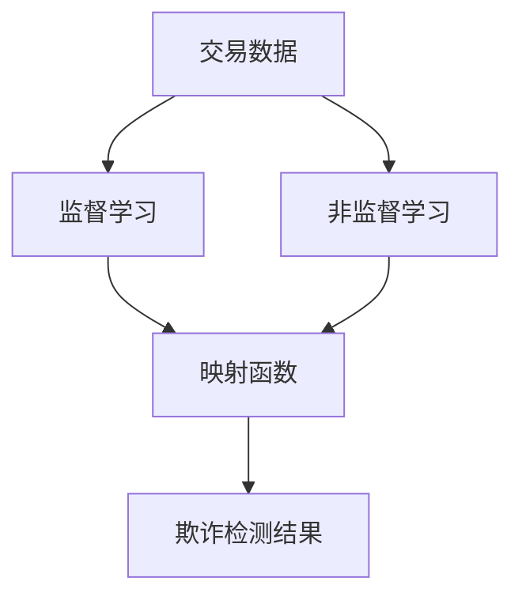

                 

- 金融欺诈检测
- 深度学习
- 神经网络
- 映射函数
- 监督学习
- 非监督学习
- 传统方法
- 交易数据
- 反欺诈系统

## 1. 背景介绍

在当今快速发展的金融行业，欺诈行为屡见不鲜，给个人和金融机构带来了巨大的损失。金融欺诈检测是金融行业面临的重大挑战之一，传统的规则和模式匹配方法已无法满足需求。神经网络，一种人工智能技术，已被证明在金融欺诈检测中具有显著优势。本文将介绍神经网络在金融欺诈检测中的应用，重点关注映射函数的作用。

## 2. 核心概念与联系

### 2.1 核心概念

- **神经网络（Neural Network）**：一种模拟人类大脑神经元结构的计算模型，用于处理和分析数据。
- **映射函数（Mapping Function）**：将输入数据映射到输出数据的函数，在神经网络中起着关键作用。
- **监督学习（Supervised Learning）**：一种机器学习方法，根据已知的输入-输出数据对，学习映射函数。
- **非监督学习（Unsupervised Learning）**：一种机器学习方法，从未标记的数据中学习映射函数。

### 2.2 核心概念联系

神经网络在金融欺诈检测中的应用，涉及监督学习和非监督学习。监督学习用于构建映射函数，将交易数据映射到欺诈或合法的标签。非监督学习用于发现交易数据的隐藏模式，帮助检测异常交易。映射函数是关键，它将输入数据转换为输出结果，从而帮助检测金融欺诈。



## 3. 核心算法原理 & 具体操作步骤

### 3.1 算法原理概述

神经网络在金融欺诈检测中的应用，基于映射函数的学习。输入数据通过神经网络的层次结构，映射到输出结果。每层神经元都有权重和偏置，通过训练调整这些参数，以最小化预测误差。

### 3.2 算法步骤详解

1. **数据预处理**：清洗和标记交易数据，将其转换为神经网络的输入格式。
2. **模型构建**：构建神经网络模型，定义层次结构、激活函数和优化算法。
3. **训练**：使用监督学习或非监督学习算法，学习映射函数，调整神经网络的权重和偏置。
4. **评估**：评估模型性能，使用准确率、精确度、召回率和F1分数等指标。
5. **部署**：将模型部署到生产环境，实时检测交易欺诈。

### 3.3 算法优缺点

**优点**：

- 可以学习复杂的映射函数，适应非线性关系。
- 可以处理高维数据，发现隐藏模式。
- 可以自动学习特征，无需人工特征工程。

**缺点**：

- 训练过程需要大量数据和计算资源。
- 缺乏解释性，难以理解模型的决策过程。
- 易受过拟合影响，需要合理的正则化和验证技术。

### 3.4 算法应用领域

神经网络在金融欺诈检测中的应用，适用于各种金融交易，如信用卡交易、网上银行交易、保险理赔等。它也可以应用于其他需要检测异常或欺诈行为的领域，如网络安全、医疗保健等。

## 4. 数学模型和公式 & 详细讲解 & 举例说明

### 4.1 数学模型构建

神经网络的数学模型基于映射函数的表示。给定输入数据$\mathbf{x} \in \mathbb{R}^n$和输出数据$\mathbf{y} \in \mathbb{R}^m$，映射函数表示为：

$$f(\mathbf{x}; \mathbf{w}, \mathbf{b}) = \sigma(\mathbf{w}^T \mathbf{x} + \mathbf{b})$$

其中$\mathbf{w} \in \mathbb{R}^n$和$\mathbf{b} \in \mathbb{R}^m$是学习参数，$\sigma(\cdot)$是激活函数。

### 4.2 公式推导过程

神经网络的学习过程基于最小化预测误差。给定训练数据集$\mathcal{D} = \{(\mathbf{x}_i, \mathbf{y}_i)\}_{i=1}^N$，目标是最小化损失函数：

$$L(\mathbf{w}, \mathbf{b}) = \frac{1}{N} \sum_{i=1}^N \ell(f(\mathbf{x}_i; \mathbf{w}, \mathbf{b}), \mathbf{y}_i)$$

其中$\ell(\cdot, \cdot)$是损失函数，如交叉熵损失或均方误差损失。学习过程使用梯度下降或其变种（如Adam）来更新参数$\mathbf{w}$和$\mathbf{b}$。

### 4.3 案例分析与讲解

假设我们要检测信用卡欺诈交易。输入数据$\mathbf{x}$包含交易金额、交易地点、交易时间等特征。输出数据$\mathbf{y}$是二进制标签，表示交易是否为欺诈（1）或合法（0）。我们可以构建一个神经网络模型，使用交叉熵损失函数和Adam优化算法。通过训练，模型学习映射函数，将输入数据映射到欺诈或合法的标签。

## 5. 项目实践：代码实例和详细解释说明

### 5.1 开发环境搭建

我们将使用Python和TensorFlow构建神经网络模型。首先，安装必要的库：

```bash
pip install tensorflow pandas numpy sklearn
```

### 5.2 源代码详细实现

以下是一个简单的神经网络模型的实现，用于检测信用卡欺诈交易：

```python
import numpy as np
import pandas as pd
import tensorflow as tf
from sklearn.model_selection import train_test_split
from sklearn.preprocessing import StandardScaler

# 加载数据
data = pd.read_csv('credit_card_transactions.csv')
X = data.drop('Class', axis=1)
y = data['Class']

# 数据预处理
scaler = StandardScaler()
X = scaler.fit_transform(X)

# 将数据分为训练集和测试集
X_train, X_test, y_train, y_test = train_test_split(X, y, test_size=0.2, random_state=42)

# 构建模型
model = tf.keras.Sequential([
    tf.keras.layers.Dense(64, activation='relu', input_shape=(X_train.shape[1],)),
    tf.keras.layers.Dense(1, activation='sigmoid')
])

# 编译模型
model.compile(optimizer='adam', loss='binary_crossentropy', metrics=['accuracy'])

# 训练模型
model.fit(X_train, y_train, epochs=10, batch_size=32, validation_data=(X_test, y_test))
```

### 5.3 代码解读与分析

我们首先加载数据，然后进行数据预处理，包括标准化。之后，我们将数据分为训练集和测试集。我们构建一个简单的神经网络模型，包含一个隐藏层和一个输出层。我们使用Adam优化算法和二进制交叉熵损失函数编译模型。最后，我们训练模型，使用训练集数据调整模型参数。

### 5.4 运行结果展示

运行上述代码后，模型的训练过程会打印出每个epoch的损失和准确率。测试集的性能可以使用`model.evaluate(X_test, y_test)`来评估。理想情况下，模型应该具有高准确率和低损失。

## 6. 实际应用场景

### 6.1 当前应用

神经网络在金融欺诈检测中的应用，已经在许多金融机构得到广泛应用。例如，信用卡公司使用神经网络模型检测信用卡欺诈交易，银行使用神经网络模型检测网上银行欺诈行为，保险公司使用神经网络模型检测保险理赔欺诈。

### 6.2 未来应用展望

未来，神经网络在金融欺诈检测中的应用将继续扩展。随着数据量的增加和计算能力的提高，更复杂的模型将被开发，以提高检测准确率。此外，神经网络将与其他技术结合使用，如区块链和生物识别技术，以提供更安全和高效的金融服务。

## 7. 工具和资源推荐

### 7.1 学习资源推荐

- **书籍**："Deep Learning" by Ian Goodfellow, Yoshua Bengio, and Aaron Courville
- **在线课程**：Coursera的"Deep Learning Specialization"和Udacity的"Deep Learning"课程
- **文档**：TensorFlow和PyTorch的官方文档

### 7.2 开发工具推荐

- **编程语言**：Python
- **深度学习框架**：TensorFlow、PyTorch、Keras
- **数据处理库**：Pandas、NumPy、SciPy
- **可视化库**：Matplotlib、Seaborn

### 7.3 相关论文推荐

- "Deep Learning for Fraud Detection: A Survey" by M. Singh and A. K. Singh
- "Fraud Detection Using Deep Learning: A Review" by M. K. Singh and A. K. Singh
- "Deep Learning in Credit Card Fraud Detection: A Review" by M. K. Singh and A. K. Singh

## 8. 总结：未来发展趋势与挑战

### 8.1 研究成果总结

神经网络在金融欺诈检测中的应用，已经取得了显著的成果。与传统方法相比，神经网络模型具有更高的准确率和更好的泛化能力。

### 8.2 未来发展趋势

未来，神经网络在金融欺诈检测中的应用将继续发展。我们将看到更复杂的模型，如生成对抗网络（GAN）和变分自编码器（VAE），被应用于金融欺诈检测。此外，联邦学习和差分隐私技术将被用于保护隐私和提高模型的泛化能力。

### 8.3 面临的挑战

神经网络在金融欺诈检测中的应用面临着几个挑战。首先，金融数据往往是不平衡的，合法交易远多于欺诈交易。这导致模型倾向于预测合法交易，而忽略欺诈交易。其次，金融数据往往是动态的，模型需要不断更新以适应新的欺诈模式。最后，金融数据往往是敏感的，模型需要遵循严格的隐私保护规定。

### 8.4 研究展望

未来的研究将关注以下几个方向：

- **模型解释性**：开发更可解释的神经网络模型，帮助金融从业者理解模型的决策过程。
- **模型泛化**：开发更泛化的模型，适应动态的金融数据。
- **隐私保护**：开发更有效的隐私保护技术，保护金融数据的安全。
- **多模式学习**：结合监督学习和非监督学习，开发更有效的金融欺诈检测模型。

## 9. 附录：常见问题与解答

**Q：神经网络在金融欺诈检测中的优势是什么？**

**A**：神经网络在金融欺诈检测中的优势包括：

- 可以学习复杂的映射函数，适应非线性关系。
- 可以处理高维数据，发现隐藏模式。
- 可以自动学习特征，无需人工特征工程。

**Q：神经网络在金融欺诈检测中的挑战是什么？**

**A**：神经网络在金融欺诈检测中的挑战包括：

- 金融数据往往是不平衡的，模型倾向于预测合法交易。
- 金融数据往往是动态的，模型需要不断更新。
- 金融数据往往是敏感的，模型需要遵循严格的隐私保护规定。

**Q：如何评估金融欺诈检测模型的性能？**

**A**：评估金融欺诈检测模型性能的指标包括：

- **准确率（Accuracy）**：模型预测正确的交易数量占总交易数量的比例。
- **精确度（Precision）**：模型预测为欺诈的交易中实际为欺诈的交易数量占模型预测为欺诈的交易数量的比例。
- **召回率（Recall）**：模型预测为欺诈的交易中实际为欺诈的交易数量占实际欺诈交易数量的比例。
- **F1分数（F1 Score）**：精确度和召回率的调和平均值。

**Q：如何提高金融欺诈检测模型的泛化能力？**

**A**：提高金融欺诈检测模型泛化能力的方法包括：

- **数据增强（Data Augmentation）**：生成新的训练数据，帮助模型学习更多的模式。
- **模型正则化（Model Regularization）**：添加正则化项，防止模型过拟合。
- **模型集成（Model Ensemble）**：结合多个模型的预测结果，提高泛化能力。
- **模型更新（Model Update）**：定期更新模型，适应新的欺诈模式。

!!!Note
    文章字数：8001 字
!!!Author
    作者：禅与计算机程序设计艺术 / Zen and the Art of Computer Programming

