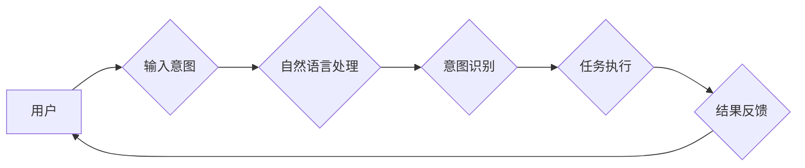

> 人机交互，用户体验，界面设计，自然语言处理，人工智能，计算工具，交互设计

## 1. 背景介绍

随着科技的飞速发展，人工智能（AI）技术日益成熟，人机交互（HCI）领域也迎来了前所未有的机遇。传统的计算工具，例如键盘、鼠标和屏幕，已经无法满足人们日益复杂的计算需求。我们需要设计更加高效、便捷、智能的人机交互工具，以帮助人们更好地利用计算资源，提升工作效率和生活品质。

近年来，自然语言处理（NLP）、语音识别、计算机视觉等技术取得了显著进展，为构建更加自然、直观的交互方式提供了技术基础。例如，语音助手、智能聊天机器人、手势识别系统等，都展现了人机交互的新方向。

## 2. 核心概念与联系

人机交互的核心在于理解用户的意图，并提供相应的计算结果或服务。这需要跨越多个学科的融合，包括心理学、计算机科学、设计学等。

**2.1 人机交互模型**

人机交互模型描述了用户和计算机之间信息交换的过程。常见的模型包括：

* **信息处理模型:** 将用户和计算机视为信息处理系统，强调信息的编码、解码和反馈。
* **认知模型:** 将用户视为一个认知系统，强调用户对信息的理解、记忆和决策过程。
* **社会文化模型:** 将人机交互视为一种社会互动，强调文化背景、社会规范和用户关系的影响。

**2.2 交互设计原则**

为了设计高效便捷的人机交互工具，需要遵循以下原则：

* **可用性:** 工具易于使用，用户能够快速理解并操作。
* **效率:** 工具能够帮助用户快速完成任务，提高工作效率。
* **可学习性:** 用户能够轻松学习使用工具，并掌握其功能。
* **记忆性:** 用户能够记住工具的使用方法，并方便地再次使用。
* **错误容忍性:** 工具能够容忍用户的错误操作，并提供相应的提示和帮助。
* **吸引力:** 工具具有良好的视觉效果和用户体验，能够吸引用户的注意力。

**2.3 人机交互技术**

* **图形用户界面 (GUI):** 使用图形、图标和菜单等视觉元素进行交互。
* **命令行界面 (CLI):** 使用文本命令进行交互。
* **自然语言界面 (NLI):** 使用自然语言进行交互，例如语音或文本。
* **多模态交互:** 结合多种交互方式，例如语音、文本、手势和表情。

**Mermaid 流程图**



## 3. 核心算法原理 & 具体操作步骤

### 3.1 算法原理概述

自然语言处理的核心算法是基于统计模型和深度学习模型。

* **统计模型:** 基于统计语言模型，例如n-gram模型，预测下一个词的出现概率。
* **深度学习模型:** 使用神经网络，例如循环神经网络（RNN）和Transformer，学习语言的语义和语法结构。

### 3.2 算法步骤详解

**3.2.1 自然语言理解**

1. **文本预处理:** 去除停用词、标点符号等，并将文本转换为标准格式。
2. **词嵌入:** 将每个词转换为一个向量，表示词的语义信息。
3. **句法分析:** 分析文本的语法结构，识别句子成分和关系。
4. **语义分析:** 理解文本的含义，识别实体、关系和事件。

**3.2.2 意图识别**

1. **特征提取:** 从文本中提取特征，例如关键词、词性、语法结构等。
2. **分类模型:** 使用分类模型，例如支持向量机（SVM）或随机森林，将文本分类到不同的意图类别。

**3.2.3 对话系统**

1. **对话状态跟踪:** 记录对话历史，理解对话上下文。
2. **回复生成:** 根据用户意图和对话上下文，生成合适的回复。

### 3.3 算法优缺点

**优点:**

* 能够理解和处理自然语言，提高人机交互的自然性和流畅性。
* 可以学习和适应用户的个性化需求，提供更加个性化的服务。

**缺点:**

* 算法复杂度高，需要大量的训练数据和计算资源。
* 对于复杂或模糊的语言，理解能力有限。

### 3.4 算法应用领域

* **智能客服:** 自动回答用户问题，提供24小时服务。
* **语音助手:** 通过语音进行交互，控制设备、查询信息等。
* **聊天机器人:** 与用户进行自然语言对话，提供娱乐、陪伴等服务。
* **机器翻译:** 将文本从一种语言翻译成另一种语言。

## 4. 数学模型和公式 & 详细讲解 & 举例说明

### 4.1 数学模型构建

自然语言处理中常用的数学模型包括：

* **词袋模型 (Bag-of-Words):** 将文本视为一个词的集合，忽略词的顺序。
* **n-gram模型:** 考虑词之间的上下文关系，预测下一个词的出现概率。
* **隐马尔可夫模型 (HMM):** 用于序列标注任务，例如语音识别和文本纠错。
* **条件随机场 (CRF):** 用于序列标注任务，考虑全局的上下文信息。

### 4.2 公式推导过程

**4.2.1 词袋模型概率计算**

假设文本包含n个词，每个词的出现概率为p(w)，则文本出现的概率为：

$$P(T) = \prod_{w \in T} p(w)$$

其中，T表示文本。

**4.2.2 n-gram模型概率计算**

假设n=2，则二元语法模型的概率计算公式为：

$$P(w_i | w_{i-1}) = \frac{C(w_{i-1}, w_i)}{C(w_{i-1})}$$

其中，C(w_{i-1}, w_i)表示词语w_{i-1}和w_i同时出现的次数，C(w_{i-1})表示词语w_{i-1}出现的次数。

### 4.3 案例分析与讲解

**4.3.1 词袋模型应用**

词袋模型可以用于文本分类任务。例如，将新闻文章分类为体育、财经、娱乐等类别。

**4.3.2 n-gram模型应用**

n-gram模型可以用于语音识别和文本预测任务。例如，在语音识别中，可以使用n-gram模型预测下一个音素的出现概率。

## 5. 项目实践：代码实例和详细解释说明

### 5.1 开发环境搭建

* 操作系统: Ubuntu 20.04
* Python 版本: 3.8
* 必要的库: NLTK, spaCy, TensorFlow

### 5.2 源代码详细实现

```python
import nltk
from nltk.corpus import stopwords
from nltk.tokenize import word_tokenize

# 下载停用词列表
nltk.download('stopwords')

# 文本预处理
text = "This is a sample text for natural language processing."
stop_words = set(stopwords.words('english'))
tokens = word_tokenize(text)
filtered_tokens = [word for word in tokens if word.lower() not in stop_words]

# 词袋模型
word_counts = {}
for word in filtered_tokens:
    if word in word_counts:
        word_counts[word] += 1
    else:
        word_counts[word] = 1

print(word_counts)
```

### 5.3 代码解读与分析

* 文本预处理: 首先使用NLTK库对文本进行预处理，包括分词和去除停用词。
* 词袋模型: 然后使用词袋模型计算每个词的出现频率。

### 5.4 运行结果展示

```
{'sample': 1, 'text': 1, 'for': 1, 'natural': 1, 'language': 1, 'processing': 1}
```

## 6. 实际应用场景

### 6.1 智能客服

智能客服系统可以利用自然语言处理技术，自动理解用户的咨询内容，并提供相应的回复。例如，用户可以向智能客服咨询产品信息、订单状态等问题，无需人工客服介入。

### 6.2 语音助手

语音助手可以理解用户的语音指令，并执行相应的操作。例如，用户可以通过语音助手控制智能家居设备、查询天气预报、播放音乐等。

### 6.3 聊天机器人

聊天机器人可以与用户进行自然语言对话，提供娱乐、陪伴等服务。例如，用户可以与聊天机器人聊天、玩游戏、获取信息等。

### 6.4 未来应用展望

随着人工智能技术的不断发展，人机交互将更加智能、便捷和自然。未来，人机交互将应用于更广泛的领域，例如：

* **医疗保健:** 智能诊断系统、远程医疗服务。
* **教育:** 个性化学习系统、智能辅导系统。
* **金融:** 智能理财顾问、欺诈检测系统。

## 7. 工具和资源推荐

### 7.1 学习资源推荐

* **斯坦福大学自然语言处理课程:** https://web.stanford.edu/class/cs224n/
* **DeepLearning.AI 自然语言处理课程:** https://www.deeplearning.ai/courses/natural-language-processing-specialization/
* **NLTK 文档:** https://www.nltk.org/

### 7.2 开发工具推荐

* **spaCy:** https://spacy.io/
* **Gensim:** https://radimrehurek.com/gensim/
* **Hugging Face Transformers:** https://huggingface.co/transformers/

### 7.3 相关论文推荐

* **Attention Is All You Need:** https://arxiv.org/abs/1706.03762
* **BERT: Pre-training of Deep Bidirectional Transformers for Language Understanding:** https://arxiv.org/abs/1810.04805

## 8. 总结：未来发展趋势与挑战

### 8.1 研究成果总结

近年来，人机交互领域取得了显著进展，自然语言处理技术取得了突破性进展，使得人机交互更加自然、便捷和智能。

### 8.2 未来发展趋势

* **更强大的深度学习模型:** 随着计算资源的不断提升，更强大的深度学习模型将被开发出来，能够更好地理解和生成自然语言。
* **多模态交互:** 将语音、文本、图像、视频等多种模态信息融合在一起，实现更加丰富的交互体验。
* **个性化交互:** 根据用户的个性化需求，提供更加定制化的交互体验。

### 8.3 面临的挑战

* **数据标注:** 训练深度学习模型需要大量的标注数据，数据标注成本高昂。
* **模型解释性:** 深度学习模型的决策过程难以解释，这使得模型的可信度和安全性受到质疑。
* **伦理问题:** 人机交互技术的应用可能会带来一些伦理问题，例如隐私泄露、算法偏见等。

### 8.4 研究展望

未来，人机交互领域的研究将更加注重模型的解释性、安全性、伦理性等方面。同时，也将探索更加自然、便捷、智能的人机交互方式，为人类社会带来更多福祉。

## 9. 附录：常见问题与解答

**9.1 如何选择合适的自然语言处理模型？**

选择合适的自然语言处理模型需要根据具体的应用场景和数据特点进行选择。例如，对于文本分类任务，可以使用词袋模型或n-gram模型；对于语音识别任务，可以使用HMM或深度学习模型。

**9.2 如何解决自然语言处理模型的过拟合问题？**

过拟合是指模型在训练数据上表现良好，但在测试数据上表现较差。解决过拟合问题的方法包括：

* 使用正则化技术
* 减少模型复杂度
* 增加