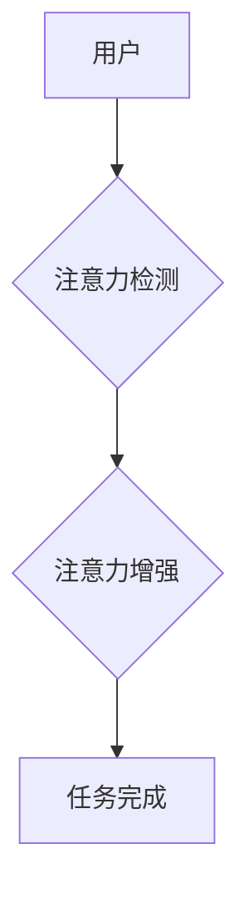

> 人类注意力增强，专注力，注意力，商业应用，人工智能，深度学习，脑机接口，未来趋势

## 1. 背景介绍

在当今信息爆炸的时代，人类面临着前所未有的信息过载挑战。注意力，作为我们获取、处理和理解信息的关键能力，显得尤为重要。然而，随着科技的进步和生活节奏的加快，人们的注意力持续下降，专注力难以持久，这严重影响了工作效率、学习成果和生活质量。

注意力增强技术应运而生，旨在通过科技手段提升人类的注意力和专注力。该技术涵盖了多个领域，包括人工智能、神经科学、心理学和生物工程等。近年来，随着深度学习、脑机接口等技术的快速发展，注意力增强技术取得了显著进展，并逐渐在商业领域得到应用。

## 2. 核心概念与联系

**2.1  注意力机制**

注意力机制是深度学习领域的重要技术，其灵感来源于人类的视觉注意力机制。在处理信息时，人类会将注意力集中在最相关的信息上，忽略无关的信息。注意力机制通过赋予不同输入不同权重，模拟了这种选择性关注的行为，从而提高了模型的学习效率和准确性。

**2.2  专注力**

专注力是指一个人能够持续地集中注意力在某一特定任务或目标上，排除干扰的能力。专注力是注意力的一种高级形式，它需要更强的意志力和控制力。

**2.3  商业应用场景**

注意力增强技术在商业领域具有广泛的应用前景，例如：

* **提升员工工作效率:** 通过注意力增强技术，可以帮助员工集中注意力，提高工作效率，减少错误率。
* **增强客户体验:** 在电商、金融等领域，注意力增强技术可以帮助企业更好地理解客户需求，提供更个性化的服务体验。
* **提高营销效果:** 通过注意力增强技术，可以帮助企业设计更吸引人的广告，提高营销效果。

**2.4  架构图**



## 3. 核心算法原理 & 具体操作步骤

**3.1  算法原理概述**

注意力增强算法通常基于深度学习模型，例如循环神经网络（RNN）或卷积神经网络（CNN）。这些模型可以学习到人类注意力机制的特征，并根据用户的行为和生理信号，动态调整注意力权重，从而增强用户的专注力。

**3.2  算法步骤详解**

1. **数据采集:** 收集用户的行为数据，例如眼动轨迹、脑电波、心率等，以及任务完成情况等。
2. **数据预处理:** 对采集到的数据进行清洗、转换和特征提取，以便于模型训练。
3. **模型训练:** 使用深度学习算法训练注意力增强模型，使其能够学习到用户的注意力模式和增强策略。
4. **模型评估:** 使用测试数据评估模型的性能，例如注意力持续时间、任务完成效率等。
5. **模型部署:** 将训练好的模型部署到实际应用场景中，例如智能手机、电脑、VR设备等。

**3.3  算法优缺点**

**优点:**

* **个性化:** 可以根据用户的不同特点和需求，定制个性化的注意力增强策略。
* **可扩展性:** 可以与其他技术，例如脑机接口、虚拟现实等，进行结合，实现更强大的功能。
* **数据驱动:** 基于大量数据训练，能够不断优化和改进算法性能。

**缺点:**

* **数据隐私:** 收集用户的生理数据需要考虑隐私保护问题。
* **算法复杂度:** 深度学习模型的训练和部署需要较高的技术水平和计算资源。
* **伦理问题:** 注意力增强技术可能会被滥用，例如控制用户的行为或思想，因此需要谨慎使用。

**3.4  算法应用领域**

注意力增强算法的应用领域非常广泛，包括：

* **教育:** 帮助学生集中注意力，提高学习效率。
* **医疗:** 帮助患者治疗注意力缺陷多动障碍（ADHD）等疾病。
* **游戏:** 增强玩家的游戏体验，提高游戏沉浸感。
* **安全:** 帮助驾驶员保持注意力，预防交通事故。

## 4. 数学模型和公式 & 详细讲解 & 举例说明

**4.1  数学模型构建**

注意力机制通常使用一个注意力权重来表示模型对不同输入的关注程度。注意力权重可以由一个可学习的参数矩阵计算得到。

**4.2  公式推导过程**

假设输入序列为 $x = (x_1, x_2, ..., x_n)$，输出序列为 $y = (y_1, y_2, ..., y_m)$。注意力权重 $a_{ij}$ 表示模型对输入 $x_i$ 对输出 $y_j$ 的关注程度。

注意力权重可以根据以下公式计算：

$$a_{ij} = \frac{exp(score(x_i, y_j))}{\sum_{k=1}^{n} exp(score(x_k, y_j))}$$

其中，$score(x_i, y_j)$ 是一个计算 $x_i$ 和 $y_j$ 之间相关性的函数，例如点积或多层感知机。

**4.3  案例分析与讲解**

例如，在机器翻译任务中，注意力机制可以帮助模型关注源语言句子中与目标语言句子相关的重要词语，从而提高翻译质量。

## 5. 项目实践：代码实例和详细解释说明

**5.1  开发环境搭建**

* Python 3.7+
* TensorFlow 2.0+
* PyTorch 1.0+
* Jupyter Notebook

**5.2  源代码详细实现**

```python
import tensorflow as tf

# 定义注意力机制
def attention_layer(inputs, attention_weights):
  context_vector = tf.matmul(inputs, attention_weights)
  return context_vector

# 定义模型
class AttentionModel(tf.keras.Model):
  def __init__(self, vocab_size, embedding_dim, hidden_dim):
    super(AttentionModel, self).__init__()
    self.embedding = tf.keras.layers.Embedding(vocab_size, embedding_dim)
    self.lstm = tf.keras.layers.LSTM(hidden_dim)
    self.attention = attention_layer

  def call(self, inputs):
    embedded = self.embedding(inputs)
    lstm_output = self.lstm(embedded)
    attention_weights = self.attention(lstm_output, lstm_output)
    return attention_weights

# 实例化模型
model = AttentionModel(vocab_size=10000, embedding_dim=128, hidden_dim=256)

# 训练模型
model.compile(optimizer='adam', loss='mse')
model.fit(x_train, y_train, epochs=10)
```

**5.3  代码解读与分析**

* 该代码实现了一个简单的注意力机制模型，用于文本序列处理。
* 模型首先使用嵌入层将单词转换为向量表示。
* 然后使用LSTM层对序列进行编码，得到隐藏状态。
* 最后使用注意力层计算注意力权重，并将注意力权重与隐藏状态进行加权求和，得到最终的输出。

**5.4  运行结果展示**

运行结果展示需要根据具体的应用场景和数据集进行分析。

## 6. 实际应用场景

**6.1  教育领域**

注意力增强技术可以帮助学生集中注意力，提高学习效率。例如，一些教育软件可以根据学生的注意力水平，动态调整学习内容和难度，并提供个性化的学习建议。

**6.2  医疗领域**

注意力增强技术可以帮助患者治疗注意力缺陷多动障碍（ADHD）等疾病。例如，一些脑机接口设备可以监测患者的脑电波，并通过反馈机制帮助患者增强注意力。

**6.3  游戏领域**

注意力增强技术可以增强玩家的游戏体验，提高游戏沉浸感。例如，一些游戏可以根据玩家的注意力水平，动态调整游戏难度和场景，并提供个性化的游戏奖励。

**6.4  未来应用展望**

随着科技的进步，注意力增强技术将有更广泛的应用场景，例如：

* **远程办公:** 帮助远程办公人员集中注意力，提高工作效率。
* **驾驶辅助:** 帮助驾驶员保持注意力，预防交通事故。
* **虚拟现实:** 增强虚拟现实体验，提高沉浸感。

## 7. 工具和资源推荐

**7.1  学习资源推荐**

* **书籍:**
    * 《深度学习》
    * 《注意力机制》
* **在线课程:**
    * Coursera: 深度学习
    * Udacity: 计算机视觉
* **博客:**
    * TensorFlow Blog
    * PyTorch Blog

**7.2  开发工具推荐**

* **深度学习框架:** TensorFlow, PyTorch
* **数据可视化工具:** Matplotlib, Seaborn
* **代码编辑器:** VS Code, Sublime Text

**7.3  相关论文推荐**

* 《Attention Is All You Need》
* 《BERT: Pre-training of Deep Bidirectional Transformers for Language Understanding》
* 《Transformer-XL: Attentive Language Models Beyond a Fixed-Length Context》

## 8. 总结：未来发展趋势与挑战

**8.1  研究成果总结**

近年来，注意力增强技术取得了显著进展，在多个领域得到了应用。深度学习算法、脑机接口技术等技术的不断发展，为注意力增强技术的发展提供了强有力的支撑。

**8.2  未来发展趋势**

* **更精准的注意力增强:** 通过更深入的理解人类注意力机制，开发更精准、更有效的注意力增强策略。
* **更个性化的注意力增强:** 根据用户的不同特点和需求，定制个性化的注意力增强方案。
* **更广泛的应用场景:** 将注意力增强技术应用到更多领域，例如医疗、教育、安全等。

**8.3  面临的挑战**

* **数据隐私:** 收集用户的生理数据需要考虑隐私保护问题。
* **算法复杂度:** 深度学习模型的训练和部署需要较高的技术水平和计算资源。
* **伦理问题:** 注意力增强技术可能会被滥用，因此需要谨慎使用。

**8.4  研究展望**

未来，注意力增强技术将继续朝着更精准、更个性化、更广泛的方向发展。随着科技的进步，注意力增强技术将为人类带来更多福祉，帮助我们更好地应对信息时代带来的挑战。

## 9. 附录：常见问题与解答

**9.1  注意力增强技术是否安全？**

注意力增强技术本身是安全的，但需要谨慎使用。例如，在收集用户数据时，需要确保数据安全和隐私保护。

**9.2  注意力增强技术是否会让人上瘾？**

注意力增强技术本身不会让人上瘾，但过度使用可能会导致注意力依赖。因此，需要适度使用，并注意休息和放松。

**9.3  注意力增强技术是否适用于所有人？**

注意力增强技术并非适用于所有人，例如，一些患有注意力缺陷多动障碍（ADHD）等疾病的人群，需要在医生的指导下使用。


作者：禅与计算机程序设计艺术 / Zen and the Art of Computer Programming 
<end_of_turn>