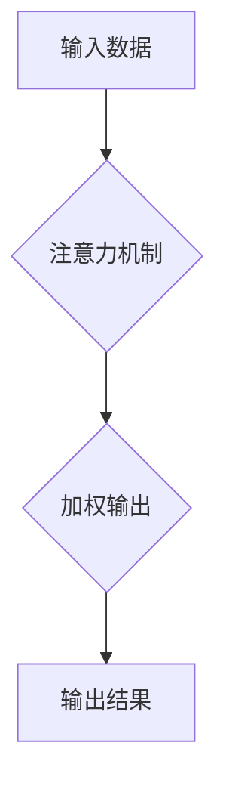

> 人类注意力，注意力增强，深度学习，神经网络，教育科技，专注力训练，认知科学

## 1. 背景介绍

在当今信息爆炸的时代，人类的注意力面临着前所未有的挑战。来自社交媒体、电子游戏、新闻推送等各种信息源的不断干扰，使得人们难以集中精力完成任务，学习效率也随之降低。注意力力的下降不仅影响着个人的学习和工作，也对社会整体的生产力和创新能力构成威胁。

教育领域也深受注意力问题困扰。传统的教学模式往往难以满足学生多元化的学习需求，学生的注意力难以集中，学习效果不佳。因此，如何提升学生的注意力，增强他们的专注力，成为教育界亟待解决的重要问题。

## 2. 核心概念与联系

**2.1 注意力机制**

注意力机制是近年来深度学习领域取得的重要突破，它能够帮助模型模拟人类的注意力机制，专注于输入数据中最重要的部分。注意力机制的核心思想是通过一个加权机制，将输入数据中的不同部分赋予不同的权重，从而突出重要信息，抑制无关信息。

**2.2 人类注意力与深度学习**

人类的注意力是一个复杂的心理过程，涉及到多个脑区协同工作。深度学习模型通过模仿人类大脑的神经网络结构，学习和模拟注意力机制。

**2.3 注意力增强与教育**

注意力增强技术可以帮助学生提高专注力，增强学习效率。通过训练学生的注意力机制，可以帮助他们更好地理解和记忆知识，提高学习成绩。

**Mermaid 流程图**



## 3. 核心算法原理 & 具体操作步骤

**3.1 算法原理概述**

注意力机制的算法原理主要基于以下几个方面：

* **查询（Query）、键（Key）、值（Value）:** 将输入数据分解为查询、键和值三个部分。查询向量用于表示模型当前关注的方面，键向量用于表示输入数据中不同部分的特征，值向量用于表示输入数据中不同部分的具体信息。
* **注意力分数:** 通过计算查询向量与键向量的相似度，得到注意力分数。注意力分数表示模型对不同输入部分的关注程度。
* **加权求和:** 将注意力分数与值向量进行加权求和，得到加权输出。加权输出包含了输入数据中重要信息的综合表示。

**3.2 算法步骤详解**

1. **输入数据预处理:** 将输入数据转换为模型可处理的格式。
2. **查询、键、值计算:** 将输入数据分解为查询、键和值三个部分。
3. **注意力分数计算:** 计算查询向量与键向量的相似度，得到注意力分数。
4. **注意力加权:** 将注意力分数与值向量进行加权求和，得到加权输出。
5. **输出结果:** 将加权输出作为模型的输出结果。

**3.3 算法优缺点**

**优点:**

* 可以有效地模拟人类的注意力机制，提高模型的学习能力。
* 可以处理长序列数据，例如文本和音频。
* 可以应用于多种机器学习任务，例如机器翻译、文本摘要和问答系统。

**缺点:**

* 计算复杂度较高，训练时间较长。
* 需要大量的训练数据才能达到较好的效果。

**3.4 算法应用领域**

注意力机制在机器学习领域有着广泛的应用，例如：

* **自然语言处理:** 机器翻译、文本摘要、问答系统、情感分析等。
* **计算机视觉:** 图像识别、目标检测、图像分割等。
* **语音识别:** 语音转文本、语音合成等。

## 4. 数学模型和公式 & 详细讲解 & 举例说明

**4.1 数学模型构建**

注意力机制的数学模型可以表示为以下公式：

$$
\text{Attention}(Q, K, V) = \text{softmax}\left(\frac{Q K^T}{\sqrt{d_k}}\right) V
$$

其中：

* $Q$：查询向量
* $K$：键向量
* $V$：值向量
* $d_k$：键向量的维度
* $\text{softmax}$：softmax函数，用于将注意力分数归一化

**4.2 公式推导过程**

1. **计算注意力分数:**

$$
\text{score}(Q, K) = \frac{Q K^T}{\sqrt{d_k}}
$$

该公式计算查询向量与键向量的点积，并除以键向量的维度开根号，以规范化注意力分数。

2. **应用softmax函数:**

$$
\text{attention}(Q, K, V) = \text{softmax}(\text{score}(Q, K)) V
$$

softmax函数将注意力分数转换为概率分布，使得每个输入部分的注意力权重在0到1之间。

**4.3 案例分析与讲解**

假设我们有一个句子“我爱学习编程”，我们想要使用注意力机制来找出句子中最重要的部分。

* $Q$：查询向量表示模型当前关注的方面。
* $K$：键向量表示每个单词的特征。
* $V$：值向量表示每个单词的具体信息。

通过计算注意力分数，我们可以发现“学习编程”这两个词语的注意力分数最高，说明它们是句子中最重要的部分。

## 5. 项目实践：代码实例和详细解释说明

**5.1 开发环境搭建**

* Python 3.7+
* TensorFlow 2.0+
* PyTorch 1.0+

**5.2 源代码详细实现**

```python
import tensorflow as tf

# 定义注意力机制层
class AttentionLayer(tf.keras.layers.Layer):
    def __init__(self, units):
        super(AttentionLayer, self).__init__()
        self.Wq = tf.keras.layers.Dense(units)
        self.Wk = tf.keras.layers.Dense(units)
        self.Wv = tf.keras.layers.Dense(units)
        self.dense = tf.keras.layers.Dense(units)

    def call(self, inputs):
        Q = self.Wq(inputs)
        K = self.Wk(inputs)
        V = self.Wv(inputs)
        attention_scores = tf.matmul(Q, K, transpose_b=True) / tf.math.sqrt(tf.cast(tf.shape(Q)[-1], tf.float32))
        attention_weights = tf.nn.softmax(attention_scores, axis=-1)
        output = tf.matmul(attention_weights, V)
        return self.dense(output)

# 实例化注意力机制层
attention_layer = AttentionLayer(units=128)

# 输入数据
inputs = tf.random.normal(shape=(32, 10, 64))

# 通过注意力机制层进行处理
outputs = attention_layer(inputs)

# 打印输出结果
print(outputs.shape)
```

**5.3 代码解读与分析**

* 该代码定义了一个注意力机制层，并实现了注意力机制的计算过程。
* 输入数据是一个32个样本，每个样本长度为10，维度为64的张量。
* 通过注意力机制层进行处理后，输出结果是一个32个样本，长度为10，维度为128的张量。

**5.4 运行结果展示**

运行该代码后，会输出一个32x10x128的张量，表示经过注意力机制处理后的输出结果。

## 6. 实际应用场景

**6.1 教育领域**

* **个性化学习:** 根据学生的注意力特点，定制个性化的学习内容和节奏。
* **注意力训练:** 通过游戏化和互动化的方式，帮助学生提高注意力集中能力。
* **学习效果评估:** 通过分析学生的注意力分布，评估学习效果，及时调整教学策略。

**6.2 其他领域**

* **医疗保健:** 帮助医生分析患者的脑电波，诊断注意力缺陷多动障碍等疾病。
* **人机交互:** 开发更智能的人机交互系统，能够更好地理解用户的意图和需求。
* **自动驾驶:** 帮助自动驾驶系统更好地感知周围环境，提高安全性。

**6.4 未来应用展望**

随着人工智能技术的不断发展，注意力增强技术将在更多领域得到应用，例如：

* **虚拟现实和增强现实:** 在虚拟现实和增强现实环境中，注意力增强技术可以帮助用户更好地沉浸在虚拟世界中，提高交互体验。
* **脑机接口:** 通过脑机接口技术，可以将注意力增强技术应用于脑功能的恢复和增强。
* **跨学科融合:** 注意力增强技术可以与其他学科，例如认知科学、心理学和教育学，进行跨学科融合，推动人类对注意力机制的更深入理解。

## 7. 工具和资源推荐

**7.1 学习资源推荐**

* **书籍:**
    * 《深度学习》
    * 《Attention Is All You Need》
* **在线课程:**
    * Coursera: 深度学习
    * Udacity: 自然语言处理
* **博客:**
    * Jay Alammar's Blog
    * Distill.pub

**7.2 开发工具推荐**

* **TensorFlow:** 开源深度学习框架
* **PyTorch:** 开源深度学习框架
* **Keras:** 高级深度学习API

**7.3 相关论文推荐**

* 《Attention Is All You Need》
* 《BERT: Pre-training of Deep Bidirectional Transformers for Language Understanding》
* 《Transformer-XL: Attentive Language Models Beyond a Fixed-Length Context》

## 8. 总结：未来发展趋势与挑战

**8.1 研究成果总结**

近年来，注意力机制在机器学习领域取得了显著的进展，并在自然语言处理、计算机视觉等领域取得了突破性成果。注意力机制能够有效地模拟人类的注意力机制，提高模型的学习能力和泛化能力。

**8.2 未来发展趋势**

* **更强大的注意力机制:** 研究更强大的注意力机制，例如自注意力机制、多头注意力机制和可变形注意力机制。
* **注意力机制的应用扩展:** 将注意力机制应用于更多领域，例如医疗保健、自动驾驶和脑机接口。
* **注意力机制的理论研究:** 深入研究注意力机制的理论基础，例如注意力机制的生物学机制和认知科学意义。

**8.3 面临的挑战**

* **计算复杂度:** 现有的注意力机制计算复杂度较高，难以应用于大规模数据和复杂任务。
* **数据依赖性:** 注意力机制需要大量的训练数据才能达到较好的效果。
* **可解释性:** 注意力机制的决策过程难以解释，这限制了其在一些应用场景中的应用。

**8.4 研究展望**

未来，注意力机制的研究将继续朝着更强大、更灵活、更可解释的方向发展。随着人工智能技术的不断发展，注意力机制将发挥越来越重要的作用，推动人类社会进步。

## 9. 附录：常见问题与解答

**9.1 如何选择合适的注意力机制？**

选择合适的注意力机制取决于具体的应用场景和任务需求。例如，对于文本序列数据，自注意力机制效果较好；对于图像数据，空间注意力机制效果较好。

**9.2 注意力机制的训练方法是什么？**

注意力机制的训练方法与其他深度学习模型类似，通常使用反向传播算法进行训练。

**9.3 注意力机制的应用场景有哪些？**

注意力机制的应用场景非常广泛，例如自然语言处理、计算机视觉、语音识别等。

作者：禅与计算机程序设计艺术 / Zen and the Art of Computer Programming


<end_of_turn>