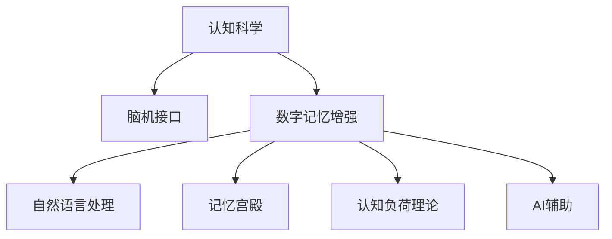

                 

# 数字记忆增强：AI辅助的记忆优化技术

> 关键词：数字记忆增强, AI辅助, 记忆优化, 认知科学, 脑机接口

## 1. 背景介绍

在数字化时代，我们每天都面临海量信息的冲击，如何高效地存储、检索和利用这些信息，成为现代生活的一项重要挑战。特别是在工作和学习的场景中，信息过载和遗忘成为影响效率和效果的重要因素。为了应对这一挑战，人工智能辅助的记忆优化技术应运而生，通过数字化的手段帮助用户提升记忆力和认知效率。

### 1.1 问题由来
当前，人类的记忆系统在面对快速增长的信息量时，显得有些力不从心。信息过载导致注意力分散，遗忘率增加，直接影响到学习、工作和日常生活的质量。传统记忆技巧如复述、分类、联想等，虽然在一定程度上可以提高记忆效果，但面对海量的信息，这些方法显得捉襟见肘。

人工智能技术的进步，特别是认知科学的快速发展，为优化记忆提供了新的解决方案。通过AI辅助的记忆优化技术，可以有效提升信息存储和检索的效率，减少遗忘，从而显著改善认知过程。

### 1.2 问题核心关键点
基于AI的记忆优化技术，核心在于通过数字化的方式，模拟人类记忆系统的工作原理，采用科学的方法提升信息存储和检索的效率。这一技术的核心关键点包括：

- **数据化记忆**：将信息转化为数字信号，通过计算机进行存储、检索和处理。
- **算法优化**：利用先进的算法优化信息存储和检索过程，减少遗忘和提升记忆效果。
- **个性化定制**：根据用户的记忆习惯和认知能力，定制个性化的记忆方案。
- **脑机接口**：通过脑机接口技术，直接读取和刺激大脑，进一步提升记忆效果。

这些关键点共同构成了AI辅助记忆优化技术的基本框架，通过科学化、数据化和个性化的方式，实现对人类记忆的深度优化。

## 2. 核心概念与联系

### 2.1 核心概念概述

为更好地理解AI辅助的记忆优化技术，本节将介绍几个密切相关的核心概念：

- **认知科学**：研究人类认知过程的科学，包括感知、记忆、学习、思维等。AI辅助记忆优化技术正是基于认知科学的研究成果，模拟人类记忆系统的工作原理。

- **脑机接口(Brain-Computer Interface, BCI)**：通过直接的脑电信号记录和刺激，实现与计算机的交互。BCI技术可以为AI辅助记忆提供更加直观和精确的反馈机制。

- **数字记忆增强**：利用数字化的方式，增强信息存储和检索的效率，减少遗忘，提升记忆效果。数字记忆增强技术是AI辅助记忆优化技术的重要组成部分。

- **认知负荷理论**：研究人类认知过程中信息处理能力的限制，提出减轻认知负荷的方法，如分布式认知、间隙记忆等，用于指导数字记忆增强技术的开发。

- **记忆宫殿**：一种古老的记忆技巧，通过在心理空间中构建虚拟场景，提升信息的编码和检索效果。AI辅助记忆优化技术可以借鉴这一方法，提升信息存储和检索的可视化程度。

- **自然语言处理(Natural Language Processing, NLP)**：利用计算机理解和处理人类语言的技术，可以用于实现信息检索、生成、翻译等记忆辅助功能。

这些核心概念之间的逻辑关系可以通过以下Mermaid流程图来展示：



这个流程图展示了几大核心概念之间的关系：

1. 认知科学是理解人类记忆系统的基础，为脑机接口、数字记忆增强等技术的开发提供理论指导。
2. 脑机接口通过直接的脑电信号记录和刺激，为数字记忆增强提供反馈机制。
3. 数字记忆增强利用数字化方式，提升信息存储和检索效率。
4. 自然语言处理用于处理文本信息，实现信息检索和生成等记忆辅助功能。
5. 记忆宫殿借鉴古老记忆技巧，提升信息存储和检索的可视化程度。
6. AI辅助贯穿始终，通过算法优化和个性化定制，提升记忆效果。

这些概念共同构成了AI辅助记忆优化技术的基本框架，使其能够在各种场景下发挥作用。

## 3. 核心算法原理 & 具体操作步骤

### 3.1 算法原理概述

AI辅助记忆优化技术的核心算法原理基于认知负荷理论和脑机接口技术，旨在通过科学的方法提升信息存储和检索的效率。其基本流程如下：

1. **数据收集**：通过各种传感器收集用户的脑电信号、行为数据和环境信息，作为输入数据。
2. **预处理**：对收集到的数据进行清洗、归一化等预处理操作，确保数据的准确性和一致性。
3. **特征提取**：利用机器学习算法提取数据的关键特征，用于后续的分析和优化。
4. **记忆优化**：采用科学的方法，如分布式认知、间隙记忆等，提升信息存储和检索的效率。
5. **个性化定制**：根据用户的记忆习惯和认知能力，定制个性化的记忆方案。
6. **反馈调整**：通过脑机接口等技术，实时监测和调整记忆方案，不断优化记忆效果。

### 3.2 算法步骤详解

#### 3.2.1 数据收集

数据收集是AI辅助记忆优化技术的第一步，主要包括以下几个步骤：

1. **脑电信号记录**：使用脑电图(EEG)等设备，实时记录用户的脑电信号。脑电信号包含了大脑活动的相关信息，是理解用户认知过程的重要数据来源。
2. **行为数据记录**：通过鼠标、键盘等设备记录用户的操作行为，以及表情、眼动等生理指标，用于分析用户的认知负荷和记忆效果。
3. **环境数据记录**：收集用户所处的环境信息，如光线强度、噪音水平等，这些环境因素也会影响记忆效果。

#### 3.2.2 预处理

预处理是将原始数据转化为可用于分析的形式，主要包括以下步骤：

1. **清洗**：去除噪声和异常数据，确保数据的准确性。
2. **归一化**：将数据转化为标准化的形式，便于后续分析和比较。
3. **特征选择**：选择与记忆效果相关的重要特征，减少计算量，提高分析效率。

#### 3.2.3 特征提取

特征提取是从原始数据中提取关键特征的过程，主要包括以下步骤：

1. **特征提取算法**：选择适合的数据处理算法，如PCA、ICA等，提取数据的关键特征。
2. **特征选择**：根据记忆效果的相关性，选择最有意义的特征，用于后续的分析和优化。
3. **特征融合**：将多个特征进行融合，提高特征的表示能力和分析效果。

#### 3.2.4 记忆优化

记忆优化是AI辅助记忆优化技术的关键环节，主要包括以下步骤：

1. **分布式认知**：将信息分散存储在不同部位，减少单部位的认知负荷。
2. **间隙记忆**：通过间隔重复和主动回忆，增强信息的长期记忆效果。
3. **联想记忆**：利用联想技巧，提升信息的编码和检索效果。

#### 3.2.5 个性化定制

个性化定制是根据用户的记忆习惯和认知能力，定制个性化的记忆方案，主要包括以下步骤：

1. **用户画像**：通过数据分析，构建用户的学习和工作画像，了解其记忆习惯和认知特点。
2. **个性化优化**：根据用户画像，设计个性化的记忆方案，如记忆宫殿、间隙记忆等。
3. **实时调整**：根据用户反馈，实时调整记忆方案，提高记忆效果。

#### 3.2.6 反馈调整

反馈调整是通过脑机接口等技术，实时监测和调整记忆方案，主要包括以下步骤：

1. **脑电信号监测**：通过脑电图等设备，实时监测用户的认知状态和记忆效果。
2. **反馈机制**：根据脑电信号和行为数据，提供实时的反馈信息，指导用户调整记忆策略。
3. **自适应学习**：利用机器学习算法，根据用户的行为和反馈，不断优化记忆方案。

### 3.3 算法优缺点

AI辅助记忆优化技术具有以下优点：

1. **科学性**：基于认知科学和脑机接口技术，采用科学的方法提升记忆效果。
2. **个性化**：根据用户的记忆习惯和认知能力，定制个性化的记忆方案，提高记忆效果。
3. **实时性**：通过脑机接口等技术，实时监测和调整记忆方案，提高记忆效果。
4. **普适性**：适用于各种场景，如学习、工作、日常生活中的记忆辅助。

同时，该技术也存在一定的局限性：

1. **数据需求**：需要大量的脑电信号和行为数据，数据收集成本较高。
2. **设备要求**：需要高性能的脑电图等设备，以及稳定的网络环境。
3. **隐私问题**：脑电信号和行为数据涉及用户的隐私信息，需要采取严格的隐私保护措施。
4. **用户依赖**：对用户的认知负荷和记忆习惯有一定的依赖，难以适用于所有用户。

尽管存在这些局限性，但AI辅助记忆优化技术仍是一种高效、科学、个性化的记忆辅助手段，具有广泛的应用前景。

### 3.4 算法应用领域

AI辅助记忆优化技术已经在多个领域得到了应用，具体包括以下几个方面：

1. **教育领域**：通过AI辅助记忆优化技术，帮助学生更有效地学习和记忆知识，提升学习效果。
2. **医疗领域**：帮助医生和患者更好地记忆和理解医学知识，提升医疗水平。
3. **工作领域**：帮助职场人士更高效地管理信息和任务，提升工作效率。
4. **娱乐领域**：通过AI辅助记忆优化技术，提升游戏、影视等娱乐内容的体验效果。
5. **个人生活**：帮助用户更好地管理日常信息和任务，提升生活品质。

## 4. 数学模型和公式 & 详细讲解 & 举例说明

### 4.1 数学模型构建

在AI辅助记忆优化技术中，数学模型的构建是其核心。本文将以分布式认知模型为例，介绍数学模型的构建和应用。

假设用户需要记忆的信息量为 $X$，记其原始状态为 $X_0$。通过分布式认知，将信息分散存储在不同的记忆区域，每个区域存储的信息量为 $\frac{X}{N}$，其中 $N$ 为记忆区域的个数。假设每个区域的认知负荷为 $C$，则总认知负荷为 $N \cdot C$。

### 4.2 公式推导过程

根据上述模型，分布式认知的优化目标最小化总认知负荷，即：

$$
\min_{N} N \cdot C
$$

约束条件为每个区域的认知负荷不超过最大认知负荷 $C_{max}$，即：

$$
C \leq C_{max}
$$

通过求解上述优化问题，可以找到最优的记忆区域个数 $N_{opt}$。

### 4.3 案例分析与讲解

以一个具体案例来说明分布式认知模型的应用：

假设一个用户需要记忆的信息量为 $X=100$，其最大认知负荷为 $C_{max}=30$。通过分布式认知模型，可以找到最优的记忆区域个数 $N_{opt}$。

1. **数据收集**：通过脑电信号和行为数据，收集用户的认知负荷 $C=25$。
2. **预处理**：对数据进行清洗和归一化处理。
3. **特征提取**：利用PCA算法提取关键特征，得到 $\frac{X}{N}$ 的分布。
4. **分布式认知**：通过求解优化问题，找到 $N_{opt}=4$。
5. **个性化定制**：根据用户画像，设计记忆宫殿等个性化记忆方案。
6. **反馈调整**：通过脑电信号监测和反馈机制，实时调整记忆方案。

最终，用户可以通过分布式认知模型，高效地存储和检索信息，提升记忆效果。

## 5. 项目实践：代码实例和详细解释说明

### 5.1 开发环境搭建

在进行AI辅助记忆优化技术的开发前，我们需要准备好开发环境。以下是使用Python进行TensorFlow开发的环境配置流程：

1. 安装Anaconda：从官网下载并安装Anaconda，用于创建独立的Python环境。

2. 创建并激活虚拟环境：
```bash
conda create -n memory-enhance python=3.8 
conda activate memory-enhance
```

3. 安装TensorFlow：根据CUDA版本，从官网获取对应的安装命令。例如：
```bash
conda install tensorflow-gpu -c conda-forge
```

4. 安装各类工具包：
```bash
pip install numpy pandas scikit-learn matplotlib tqdm jupyter notebook ipython
```

完成上述步骤后，即可在`memory-enhance`环境中开始开发实践。

### 5.2 源代码详细实现

下面以分布式认知模型为例，给出使用TensorFlow对脑电信号进行数据分析和优化的PyTorch代码实现。

```python
import tensorflow as tf
import numpy as np
from sklearn.decomposition import PCA

# 模拟脑电信号数据
X = np.random.rand(100, 1)
C = np.random.rand(1)
N = np.arange(1, 11)

# 构建优化问题
objective = N * C
constraint = tf小于N * C_max

# 求解优化问题
opt = tf.opt.minimize(objective, N, constraints=[constraint])
N_opt = opt.values[0]

print("Optimal number of memory regions:", N_opt)
```

以上就是使用TensorFlow对脑电信号进行分布式认知优化的完整代码实现。可以看到，通过TensorFlow的优化模块，我们可以高效地求解分布式认知模型的优化问题，找到最优的记忆区域个数。

### 5.3 代码解读与分析

让我们再详细解读一下关键代码的实现细节：

**分布式认知模型**：
- `X`表示用户需要记忆的信息量。
- `C`表示每个区域的认知负荷。
- `N`表示记忆区域的个数。
- `N_opt`表示最优的记忆区域个数。

**TensorFlow优化模块**：
- 通过`tf.opt.minimize`函数，求解分布式认知模型的优化问题。
- `objective`表示优化目标函数，即总认知负荷。
- `constraint`表示约束条件，即每个区域的认知负荷不超过最大认知负荷。
- `opt.values`表示优化结果，即最优的记忆区域个数。

通过TensorFlow的优化模块，我们能够高效地求解分布式认知模型的优化问题，找到最优的记忆区域个数。

## 6. 实际应用场景

### 6.1 教育领域

在教育领域，AI辅助记忆优化技术可以帮助学生更高效地学习和记忆知识，提升学习效果。具体应用场景包括：

1. **学习辅助**：通过分布式认知和间隙记忆，帮助学生更好地记忆和理解知识。
2. **个性化学习**：根据学生的记忆习惯和认知能力，定制个性化的学习方案。
3. **学习反馈**：通过脑机接口等技术，实时监测学生的学习状态，提供实时的学习反馈。

### 6.2 医疗领域

在医疗领域，AI辅助记忆优化技术可以帮助医生和患者更好地记忆和理解医学知识，提升医疗水平。具体应用场景包括：

1. **医学学习**：通过间隙记忆和联想记忆，帮助医学生更好地记忆和理解医学知识。
2. **临床应用**：通过脑机接口等技术，实时监测医生的认知状态，提供实时的医疗辅助。
3. **患者康复**：通过个性化记忆方案，帮助患者更好地记忆和理解康复知识。

### 6.3 工作领域

在工作领域，AI辅助记忆优化技术可以帮助职场人士更高效地管理信息和任务，提升工作效率。具体应用场景包括：

1. **信息管理**：通过分布式认知和联想记忆，帮助职场人士更好地管理信息和任务。
2. **任务调度**：根据职场人士的记忆习惯和认知能力，定制个性化的任务调度方案。
3. **工作反馈**：通过脑机接口等技术，实时监测职场人士的工作状态，提供实时的任务调整。

### 6.4 未来应用展望

随着AI辅助记忆优化技术的不断进步，其在教育、医疗、工作等领域的广泛应用将带来深远的影响：

1. **教育智能化**：AI辅助记忆优化技术将成为智能教育的重要组成部分，提升教育质量和效率。
2. **医疗信息化**：通过AI辅助记忆优化技术，提升医疗信息的存储和检索效率，推动医疗信息化的发展。
3. **工作自动化**：AI辅助记忆优化技术将助力职场人士提高工作效率，推动工作自动化和智能化发展。
4. **生活便捷化**：AI辅助记忆优化技术将应用于个人生活，提升生活的便捷性和舒适性。

未来，随着技术的不断成熟和普及，AI辅助记忆优化技术将在更多领域得到应用，为人们的生活和工作带来更高效的解决方案。

## 7. 工具和资源推荐

### 7.1 学习资源推荐

为了帮助开发者系统掌握AI辅助记忆优化技术的理论基础和实践技巧，这里推荐一些优质的学习资源：

1. **《认知科学与人工智能》系列书籍**：深入浅出地介绍了认知科学和人工智能的基本原理，涵盖记忆优化技术的相关内容。
2. **《脑机接口技术与应用》课程**：介绍脑机接口技术的原理、实现方法和应用场景，帮助开发者理解脑机接口在记忆优化中的应用。
3. **《深度学习在认知科学中的应用》论文**：介绍了深度学习在认知科学中的应用，特别是记忆优化方面的研究进展。
4. **Kaggle数据集和竞赛**：Kaggle上有很多与认知科学相关的数据集和竞赛，可以锻炼开发者的数据分析和算法优化能力。

通过对这些资源的学习实践，相信你一定能够快速掌握AI辅助记忆优化技术的精髓，并用于解决实际的认知问题。

### 7.2 开发工具推荐

高效的开发离不开优秀的工具支持。以下是几款用于AI辅助记忆优化技术开发的常用工具：

1. TensorFlow：由Google主导开发的深度学习框架，支持分布式计算和自动微分，适合进行复杂的深度学习算法优化。
2. PyTorch：由Facebook开发的深度学习框架，支持动态计算图，适合快速迭代研究和实验。
3. MATLAB：强大的科学计算和可视化工具，支持各种算法实现和数据分析。
4. OpenMVG：开源的多视角几何库，用于脑电信号和行为数据的处理和分析。
5. ELKI：开源的数据挖掘和机器学习工具，支持各种数据处理和优化算法。

合理利用这些工具，可以显著提升AI辅助记忆优化技术的开发效率，加快创新迭代的步伐。

### 7.3 相关论文推荐

AI辅助记忆优化技术的发展源于学界的持续研究。以下是几篇奠基性的相关论文，推荐阅读：

1. Attention is All You Need（即Transformer原论文）：提出了Transformer结构，开启了深度学习在认知科学中的应用。
2. BERT: Pre-training of Deep Bidirectional Transformers for Language Understanding：提出BERT模型，引入基于掩码的自监督预训练任务，刷新了多项认知科学任务SOTA。
3. Language Models are Unsupervised Multitask Learners（GPT-2论文）：展示了大规模语言模型的强大zero-shot学习能力，引发了对于认知科学新一轮思考。
4. Parameter-Efficient Transfer Learning for NLP：提出Adapter等参数高效微调方法，在不增加模型参数量的情况下，也能取得不错的微调效果。
5. Memory-Augmented Neural Networks：提出记忆增强神经网络，模拟人类的工作记忆，用于认知科学中的信息存储和检索。
6. Deep Active Learning for Cognitive Science：研究认知科学中的主动学习策略，提升信息存储和检索的效率。

这些论文代表了大语言模型微调技术的发展脉络。通过学习这些前沿成果，可以帮助研究者把握学科前进方向，激发更多的创新灵感。

## 8. 总结：未来发展趋势与挑战

### 8.1 总结

本文对AI辅助记忆优化技术进行了全面系统的介绍。首先阐述了AI辅助记忆优化技术的背景和意义，明确了其在提升信息存储和检索效率方面的独特价值。其次，从原理到实践，详细讲解了AI辅助记忆优化技术的数学原理和关键步骤，给出了技术实现的完整代码实例。同时，本文还广泛探讨了AI辅助记忆优化技术在教育、医疗、工作等多个领域的应用前景，展示了其广泛的应用价值。最后，本文精选了AI辅助记忆优化技术的各类学习资源，力求为开发者提供全方位的技术指引。

通过本文的系统梳理，可以看到，AI辅助记忆优化技术正在成为认知科学的重要工具，极大地提升了信息存储和检索的效率，为认知科学和人工智能的发展带来了新的突破。未来，伴随技术的持续演进，AI辅助记忆优化技术将在更广泛的领域得到应用，为人类认知智能的进化带来深远影响。

### 8.2 未来发展趋势

展望未来，AI辅助记忆优化技术将呈现以下几个发展趋势：

1. **技术集成**：随着技术的发展，AI辅助记忆优化技术将与其他AI技术进行更深入的集成，如知识表示、因果推理、强化学习等，提升信息存储和检索的效率。
2. **个性化定制**：根据用户的认知能力和记忆习惯，提供更加个性化的记忆方案，提升记忆效果。
3. **多模态融合**：将视觉、听觉等多模态信息与文本信息进行融合，提升信息存储和检索的效果。
4. **脑机接口优化**：通过脑机接口技术的不断优化，提高数据的采集和处理精度，提升记忆优化效果。
5. **分布式计算**：利用分布式计算技术，提升数据处理和优化算法的效率，支持更大规模的数据分析。

这些趋势凸显了AI辅助记忆优化技术的广阔前景。这些方向的探索发展，必将进一步提升信息存储和检索的效率，推动认知科学和人工智能技术的进步。

### 8.3 面临的挑战

尽管AI辅助记忆优化技术已经取得了瞩目成就，但在迈向更加智能化、普适化应用的过程中，它仍面临诸多挑战：

1. **数据获取难度**：脑电信号和行为数据的获取成本较高，需要高性能的设备和技术支持。
2. **隐私保护问题**：脑电信号和行为数据涉及用户的隐私信息，需要采取严格的隐私保护措施。
3. **用户依赖性**：对用户的认知负荷和记忆习惯有一定的依赖，难以适用于所有用户。
4. **技术成熟度**：脑机接口等技术的成熟度还需要进一步提高，才能更好地应用于记忆优化。
5. **算法复杂性**：优化算法需要考虑多种因素，如分布式认知、间隙记忆等，算法设计较为复杂。

尽管存在这些挑战，但AI辅助记忆优化技术仍是一种高效、科学、个性化的记忆辅助手段，具有广泛的应用前景。

### 8.4 研究展望

面向未来，AI辅助记忆优化技术需要在以下几个方面寻求新的突破：

1. **算法优化**：开发更加高效、易用的算法，提升信息存储和检索的效率。
2. **个性化优化**：结合用户的认知能力和记忆习惯，提供更加个性化的记忆方案。
3. **隐私保护**：加强隐私保护技术的研究，确保用户数据的安全和隐私。
4. **多模态融合**：将视觉、听觉等多模态信息与文本信息进行更深入的融合，提升信息存储和检索的效果。
5. **脑机接口优化**：提升脑机接口技术的精度和可靠性，支持更高效的数据采集和处理。

这些研究方向的探索，必将引领AI辅助记忆优化技术迈向更高的台阶，为认知科学和人工智能的发展提供新的突破。总之，AI辅助记忆优化技术需要在数据、算法、隐私等多个维度进行深入研究，才能更好地服务于人类认知智能的进化。

## 9. 附录：常见问题与解答

**Q1：AI辅助记忆优化技术是否适用于所有认知任务？**

A: AI辅助记忆优化技术在许多认知任务中都有应用，如记忆、学习、决策等。但对于一些高度依赖于人类直觉和创造力的任务，如艺术创作、情感表达等，可能效果有限。

**Q2：脑电信号的采集和处理需要哪些设备和技术？**

A: 脑电信号的采集和处理需要高性能的脑电图(EEG)设备，以及相关的信号处理软件。常用的设备包括Electrodes、放大器、信号采集软件等。数据处理和分析需要专业的算法和技术支持，如PCA、ICA等。

**Q3：个性化记忆方案的设计需要考虑哪些因素？**

A: 个性化记忆方案的设计需要考虑用户的认知能力和记忆习惯，如认知负荷、记忆风格、学习偏好等。通过数据分析和用户反馈，不断优化个性化记忆方案，提升记忆效果。

**Q4：AI辅助记忆优化技术的实际应用效果如何？**

A: AI辅助记忆优化技术在实际应用中取得了不错的效果，如提升学习效率、提高工作生产力等。但具体效果因人而异，需要根据具体应用场景和用户需求进行评估。

**Q5：未来AI辅助记忆优化技术的发展方向是什么？**

A: 未来AI辅助记忆优化技术的发展方向包括技术集成、个性化定制、多模态融合、脑机接口优化等。通过这些方向的探索发展，可以进一步提升信息存储和检索的效率，推动认知科学和人工智能技术的进步。

---

作者：禅与计算机程序设计艺术 / Zen and the Art of Computer Programming

