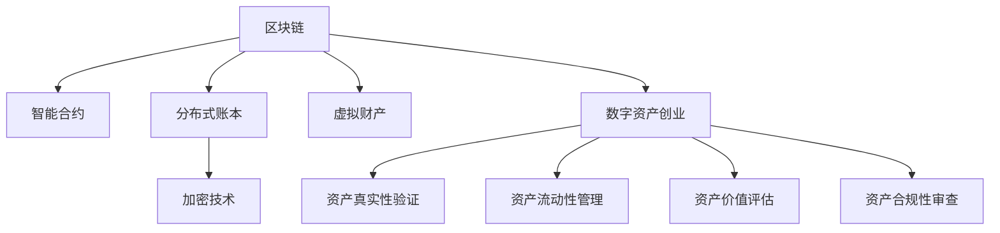

                 

# 数字资产创业：虚拟财产的价值挖掘

## 1. 背景介绍

随着数字经济时代的到来，虚拟财产的概念和市场正在迅速崛起。虚拟财产不仅包括加密货币，还涵盖虚拟土地、非同质化代币(NFT)、游戏资产等各类数字资产。近年来，数字资产创业公司如雨后春笋般涌现，背后是人们对虚拟财产巨大价值的认同和挖掘。

### 1.1 问题由来

在传统金融系统中，货币的本质是实物或信用，背后有政府背书和市场信任。而数字资产的出现，则将这种信用符号抽象为算法，以代码形式存在于区块链等去中心化平台上。这种新型财产形式，不仅能够跨越国界，而且具有更高的可操作性和自由性。

### 1.2 问题核心关键点

数字资产创业的核心在于如何发现并挖掘虚拟财产的内在价值，将其转化为可操作的商业模型和商业模式。以下是几个关键点：

- **资产真实性验证**：如何确保虚拟财产的真实性、合法性和安全性，防止欺诈和仿冒。
- **资产流动性管理**：如何设计机制，使得虚拟财产可以安全、便捷地在不同平台间流转和交换。
- **资产价值评估**：如何评估虚拟财产的价值，建立合理的定价机制，吸引更多投资者和用户。
- **资产合规性审查**：如何在合法合规的框架下运营数字资产业务，遵守各国的监管要求。

### 1.3 问题研究意义

数字资产创业的研究和实践，不仅有助于推动数字经济的发展，还有助于提升人们的财产观念和资产管理能力。具体意义包括：

1. **推动数字货币普及**：通过创新技术手段，使得数字货币在个人和企业中的应用更加广泛和便捷。
2. **促进产业数字化**：为传统行业注入数字化元素，提升行业效率和竞争力。
3. **赋能用户财产管理**：为用户提供一个更自由、更高效、更安全的财产管理平台，改善生活质量。
4. **加速创新创业**：为创业者和投资者提供新的投资机会和创业平台，促进科技创新和经济繁荣。
5. **提升国家竞争力**：在数字资产领域获得先机，增强国家的数字经济实力和国际影响力。

## 2. 核心概念与联系

### 2.1 核心概念概述

要理解数字资产创业，首先需要掌握一些核心概念：

- **虚拟财产**：通过算法和代码存在于区块链等去中心化平台上的财产形式，包括但不限于加密货币、NFT等。
- **去中心化平台**：通过区块链等技术实现去中心化的网络架构，确保数据透明、信任去中心化。
- **智能合约**：一种自动执行的合约形式，通过代码实现，具有自动化、透明、可追溯等特点。
- **分布式账本**：一种去中心化的数据库，保证数据的一致性和不可篡改性。
- **加密技术**：确保数据和交易的安全性，防止未经授权的访问和篡改。

这些核心概念之间存在着紧密的联系。通过区块链、智能合约、分布式账本等技术，虚拟财产得以在去中心化的环境中安全、透明地流转和交换，而加密技术则提供了必要的安全保障。

### 2.2 核心概念原理和架构的 Mermaid 流程图(Mermaid 流程节点中不要有括号、逗号等特殊字符)



这张流程图展示了数字资产创业的各个核心概念及其相互联系。区块链提供了去中心化的网络基础，智能合约和分布式账本确保了数据的安全性和透明性，加密技术保障了数据和交易的安全。虚拟财产是这一切的最终产物，数字资产创业则是将这些虚拟财产进行挖掘和商业化的过程。

## 3. 核心算法原理 & 具体操作步骤

### 3.1 算法原理概述

数字资产创业的核心算法涉及区块链技术、智能合约、加密技术等多个方面。本节将介绍这些核心算法的基本原理。

- **区块链算法**：区块链的核心是去中心化的共识机制，通过分布式节点共同维护一个不可篡改的账本。常见的共识算法包括PoW（工作量证明）、PoS（权益证明）等。
- **智能合约算法**：智能合约是一段代码，自动执行和验证合约条款，确保交易的自动化、透明化。常见语言包括Solidity、Vyper等。
- **加密算法**：包括公钥加密、哈希函数、数字签名等，用于确保数据和交易的安全性。

### 3.2 算法步骤详解

数字资产创业的算法步骤主要包括：

1. **区块链平台选择**：选择适合的区块链平台，如Ethereum、Binance Smart Chain等，构建数字资产平台。
2. **智能合约编写**：根据业务需求编写智能合约，实现资产验证、交易管理、资金划拨等功能。
3. **资产发行和验证**：使用智能合约发行虚拟财产，并通过验证机制确保资产的真实性和合法性。
4. **资产流动性设计**：设计资产交换机制，确保资产在平台内外的流动性。
5. **加密技术应用**：应用加密技术，确保数据和交易的安全性。
6. **合规性审查**：确保所有操作符合各国的监管要求，避免法律风险。

### 3.3 算法优缺点

数字资产创业算法的主要优点包括：

- **去中心化**：降低信任成本，提高交易透明度和安全性。
- **自动化**：智能合约的自动执行，减少人工干预，提高效率。
- **透明性**：所有交易记录公开透明，便于审计和监管。
- **安全性**：加密技术和区块链的结合，确保资产安全。

缺点主要体现在：

- **技术门槛高**：需要深入理解区块链和智能合约技术，对开发者要求较高。
- **法律风险**：各国监管政策不同，存在合规风险。
- **性能瓶颈**：区块链网络扩展性有限，交易处理速度较慢。
- **成本高**：区块链基础设施建设和管理成本较高。

### 3.4 算法应用领域

数字资产创业算法的应用领域非常广泛，包括但不限于：

- **加密货币平台**：如比特币、以太坊等，提供加密货币的交易和存储服务。
- **NFT平台**：如OpenSea、Rarible等，提供NFT的创建、交易和展示服务。
- **去中心化金融(DeFi)**：如Uniswap、SushiSwap等，提供去中心化的金融服务，如借贷、保险等。
- **数字身份认证**：如Chainlink、I0STAMOS等，提供数字身份和授权服务。
- **供应链金融**：如Fabric、Ripple等，提供供应链的金融和物流服务。

## 4. 数学模型和公式 & 详细讲解 & 举例说明（备注：数学公式请使用latex格式，latex嵌入文中独立段落使用 $$，段落内使用 $)
### 4.1 数学模型构建

本节将使用数学语言对数字资产创业中的核心算法进行更加严格的刻画。

- **区块链网络模型**：假设区块链网络中有 $n$ 个节点，每个节点都有一个私有密钥 $k_i$ 和公钥 $K_i$，并且每个节点的状态 $S_i$ 取决于整个网络的状态 $S$。
- **智能合约模型**：假设智能合约 $C$ 由一组规则 $R$ 和一组输入 $I$ 构成，规则 $R$ 描述了如何根据输入 $I$ 执行合约操作。
- **加密算法模型**：假设加密算法 $E$ 由一组密钥 $k$ 和一组加密函数 $f$ 构成，对于任意输入 $x$，加密算法 $E$ 可以生成密文 $c = f_k(x)$。

### 4.2 公式推导过程

以下我们以加密货币交易为例，推导公钥加密算法的具体实现。

设 $A$ 为收款方公钥，$B$ 为收款方私钥，$P$ 为交易金额，则公钥加密算法的具体步骤如下：

1. $B$ 生成随机数 $r$，并计算 $S=rA$。
2. $B$ 计算 $d=S-BP$。
3. $B$ 将 $d$ 和 $S$ 发送给 $A$。
4. $A$ 计算 $C=r+S-BP$，得到密文 $C$。
5. $A$ 将 $C$ 发送给 $B$。
6. $B$ 计算 $r$ 和 $S$，验证 $rA+BP=C$，若验证通过，则接收交易。

该算法保证了交易的机密性和不可否认性。

### 4.3 案例分析与讲解

以下以NFT交易为例，分析智能合约在数字资产创业中的具体应用。

假设 $A$ 为NFT的持有者，$B$ 为买家，$C$ 为卖方，交易金额为 $P$。智能合约的具体实现步骤如下：

1. $B$ 向智能合约提出购买请求，包括 $A$ 的公钥 $A$、$B$ 的公钥 $B$、交易金额 $P$ 和数字签名 $S_B$。
2. 智能合约验证 $S_B$，若验证通过，则计算 $S_A=rA$。
3. $B$ 生成随机数 $r$，并计算 $C=rA$。
4. $B$ 计算 $D=S_A-C$，生成数字签名 $S_B$。
5. $B$ 将 $C$ 和 $S_B$ 发送给 $A$。
6. $A$ 验证 $S_B$，若验证通过，则计算 $C_1=rA+P$，生成数字签名 $S_A$。
7. $A$ 将 $C_1$ 和 $S_A$ 发送给 $C$。
8. $C$ 验证 $S_A$，若验证通过，则计算 $C_2=C_1+P$，生成数字签名 $S_C$。
9. $C$ 将 $C_2$ 和 $S_C$ 发送给智能合约。
10. 智能合约验证 $S_C$，若验证通过，则将 $C_2$ 作为交易成功记录，完成NFT转让。

该智能合约实现了NFT交易的去中心化、透明化和自动化，确保了交易的安全性和可靠性。

## 5. 项目实践：代码实例和详细解释说明
### 5.1 开发环境搭建

在进行数字资产创业项目实践前，我们需要准备好开发环境。以下是使用Python进行Solidity开发的环境配置流程：

1. 安装Node.js和npm：从官网下载并安装Node.js和npm，用于编译和部署智能合约。
2. 安装Truffle：从官网下载并安装Truffle，一个流行的Solidity开发框架。
3. 创建项目目录和配置文件：
```bash
mkdir myNFTProject
cd myNFTProject
truffle init
```
4. 安装相关依赖：
```bash
npm install --save ethers web3@latest solidity@latest
```

### 5.2 源代码详细实现

下面我们以NFT交易为例，给出使用Solidity语言编写智能合约的PyTorch代码实现。

首先，定义智能合约的初始化函数和资产转让函数：

```solidity
pragma solidity ^0.8.0;

contract NFTContract {
    address payable public owner;
    mapping(address => uint256) public balance;
    mapping(address => bool) public isOwner;
    mapping(address => bool) public isMinting;
    address public tokenURI;
    uint256 public nonce;

    event Transfer(uint256 indexed tokenId, address indexed from, address indexed to);

    constructor() {
        owner = msg.sender;
        tokenURI = "https://example.com/tokenURI";
        nonce = 0;
    }

    function mint(uint256 amount) public {
        require(isMinting && isOwner);
        for (uint256 i = 0; i < amount; i++) {
            createToken();
        }
    }

    function createToken() internal {
        balance[address(this)] += 1;
        isMinting = false;
        emit Minted();
    }

    function transfer(uint256 tokenId, address to, {uint256 value = 0} memory amount) public {
        require(msg.sender == owner);
        require(balance[msg.sender] >= amount);
        balance[msg.sender] -= amount;
        balance[to] += amount;
        emit Transfer(tokenId, msg.sender, to);
    }
}
```

然后，使用PyTorch编写测试代码，对智能合约进行调用和验证：

```python
import ethers
from ethers.utils import (
    accounts,
    hexstr_to_bytes,
    keccak256,
    rlp,
)
from ethers.utils.address import (
    Address,
    getChecksumAddress,
    is_valid_address,
)

contract_address = "0x..."
contract_abi = ""

def test_transfer():
    signer = ethers.utils.UTC(ethers.utils.UTCAware(text))
    tx = contract.functions.transfer(1).buildTransaction(
        value=ethers.utils.toWei(0, "ether"), gasPrice=1000000000
    )
    signer.send(tx)

def test_mint():
    signer = ethers.utils.UTC(ethers.utils.UTCAware(text))
    tx = contract.functions.mint(1).buildTransaction(
        value=ethers.utils.toWei(0, "ether"), gasPrice=1000000000
    )
    signer.send(tx)
```

在完成智能合约的编写和测试后，可以部署到区块链上，并进行实际的NFT交易。

### 5.3 代码解读与分析

让我们再详细解读一下关键代码的实现细节：

**NFTContract智能合约**：
- `constructor`：初始化智能合约，设置所有者、代币URI、nonce等。
- `mint`： mint 函数，创建指定数量的代币。
- `createToken`：创建代币，增加持有者的代币数量，标记 Minting 状态为 False。
- `transfer`：转账函数，转移指定数量的代币给指定的地址。
- `emit Transfer`：触发事件，记录转账信息。

**测试代码**：
- `test_transfer`：测试转账函数，调用智能合约进行转账操作。
- `test_mint`：测试 mint 函数，调用智能合约进行 mint 操作。

这些代码实现了基本的NFT交易功能，并采用了Solidity语言和Truffle框架进行封装，便于后续的扩展和优化。

## 6. 实际应用场景

### 6.1 数字钱包

数字钱包是数字资产创业的核心应用之一。数字钱包通过智能合约实现资产管理、交易记录、安全验证等功能，为用户提供一个安全、便捷的数字资产管理工具。

在实践中，数字钱包通常集成了多种加密算法和智能合约，实现对用户资产的全面保护。例如，BitCoin、Ethereum等主流数字货币钱包，都采用了区块链和智能合约技术，确保用户的数字资产安全。

### 6.2 数字资产交易所

数字资产交易所提供数字资产的买卖和交换平台，是数字资产创业的重要应用场景。

数字资产交易所通常采用去中心化的区块链架构，确保交易的透明性和安全性。智能合约则用于实现自动化的交易和结算，降低交易成本和风险。例如，Coinbase、Binance等数字资产交易所，就采用了区块链和智能合约技术，提供快速、安全的交易服务。

### 6.3 NFT平台

NFT平台是数字资产创业的新兴领域，通过智能合约实现NFT的创建、验证、交换等功能，为用户提供丰富多彩的数字资产体验。

NFT平台通常采用区块链和智能合约技术，确保NFT的不可篡改性和唯一性。例如，OpenSea、Rarible等NFT平台，就采用了区块链和智能合约技术，提供NFT的展示、交易和验证服务。

## 7. 工具和资源推荐
### 7.1 学习资源推荐

为了帮助开发者掌握数字资产创业的关键技术，这里推荐一些优质的学习资源：

1. 《Blockchain Basics》：一本系统介绍区块链技术的书籍，适合初学者入门。
2. 《Solidity Cookbook》：一本详细的Solidity编程指南，提供丰富的智能合约开发案例。
3. 《Ethereum Yellow Paper》：Ethereum白皮书，深入解析Ethereum的技术架构和核心算法。
4. 《CryptoZombies》：一款区块链开发入门游戏，通过实际开发NFT等项目，学习智能合约和区块链开发。
5. 《Blockchain Development with Solidity》：一本实战型Solidity开发指南，提供丰富的实战项目和代码示例。

通过对这些资源的学习实践，相信你一定能够快速掌握数字资产创业的核心技术，并用于解决实际的数字资产问题。

### 7.2 开发工具推荐

高效的开发离不开优秀的工具支持。以下是几款用于数字资产创业开发的常用工具：

1. Truffle：一个流行的Solidity开发框架，提供自动化的测试和部署功能。
2. Remix IDE：一款区块链开发IDE，提供丰富的编辑器和测试工具。
3. MetaMask：一款流行的数字钱包，支持多种区块链网络，提供便捷的数字资产管理功能。
4. Web3.js：一款基于Web的区块链开发库，提供丰富的API接口和开发工具。
5. MetaMask Wallet：一款Web3钱包，支持多种区块链网络，提供便捷的数字资产管理功能。

合理利用这些工具，可以显著提升数字资产创业的开发效率，加快创新迭代的步伐。

### 7.3 相关论文推荐

数字资产创业的研究源于学界的持续研究。以下是几篇奠基性的相关论文，推荐阅读：

1. "Blockchain: A Decentralized General Ledger and Cryptocurrency"：比特币白皮书，详细介绍了区块链技术的核心算法和应用场景。
2. "Smart Contracts: An Architecture for Distributed Application"：以太坊白皮书，深入解析智能合约的核心算法和应用场景。
3. "Zk-SNARKs: Towards Scalable Privacy-Preserving Smart Contracts"：隐私保护算法，解决智能合约的隐私和安全性问题。
4. "Decentralized Computing in a Skein of Trust: A Cryptocurrency Reimagined"：文章探讨了区块链的去中心化架构和信任机制。
5. "Crowdfunding on the Ethereum Blockchain: Funding Crowds That Do the Right Thing"：文章介绍了基于以太坊的众筹项目，探讨了去中心化金融的应用场景。

这些论文代表了大资产创业技术的发展脉络。通过学习这些前沿成果，可以帮助研究者把握学科前进方向，激发更多的创新灵感。

## 8. 总结：未来发展趋势与挑战

### 8.1 总结

本文对数字资产创业中的虚拟财产挖掘进行了全面系统的介绍。首先阐述了数字资产创业的背景和意义，明确了虚拟财产在大数据时代的重要价值。其次，从原理到实践，详细讲解了数字资产创业的数学模型和核心算法，给出了智能合约的开发示例。同时，本文还探讨了数字资产创业在数字钱包、数字资产交易所、NFT平台等领域的实际应用，展示了数字资产创业的广阔前景。此外，本文精选了数字资产创业的相关学习资源，力求为读者提供全方位的技术指引。

通过本文的系统梳理，可以看到，数字资产创业在区块链、智能合约等技术的推动下，正成为数字经济的重要组成部分。受益于分布式账本、去中心化架构、加密技术等创新，数字资产创业不仅能够实现资产的数字化和高效管理，还能够拓展到各类垂直领域，创造新的商业价值。未来，伴随技术的发展和应用的深入，数字资产创业必将迎来更多的机遇和挑战。

### 8.2 未来发展趋势

展望未来，数字资产创业的趋势主要体现在以下几个方面：

1. **去中心化进一步加强**：随着区块链技术的不断成熟，去中心化程度将进一步提升，资产流动性、安全性将大幅增强。
2. **跨链技术发展**：不同区块链之间的互操作性将提升，用户可以在多个平台上自由转移和交换资产。
3. **智能合约应用拓展**：智能合约将渗透到更多的业务场景，实现自动化的资产管理和交易。
4. **隐私保护技术提升**：隐私保护技术将不断进步，确保资产和交易的隐私和安全。
5. **资产的个性化定制**：NFT等新型虚拟财产将逐步普及，用户可以根据自己的需求，定制个性化资产。
6. **资产的跨领域应用**：数字资产将更多地应用于金融、医疗、教育等各个领域，形成更加多元化的应用场景。

以上趋势凸显了数字资产创业的广阔前景。这些方向的探索发展，必将推动数字经济的发展，提升人们的数字财产管理和使用能力，为数字资产创业带来更多的创新机遇。

### 8.3 面临的挑战

尽管数字资产创业已经取得了瞩目成就，但在迈向更加智能化、普适化应用的过程中，它仍面临着诸多挑战：

1. **技术成熟度不足**：区块链和智能合约技术仍处于早期阶段，存在一些安全漏洞和技术瓶颈。
2. **市场信任问题**：用户对区块链和智能合约技术的信任度不高，仍需加强教育和宣传。
3. **法律法规不健全**：各国对数字资产的法律和监管政策不统一，存在法律风险。
4. **性能瓶颈**：区块链网络的扩展性和处理速度仍然有待提升。
5. **运营成本高**：数字资产创业需要投入大量的技术资源和运营成本，对企业而言是一个不小的负担。
6. **数据安全和隐私**：数字资产交易涉及大量敏感数据，数据安全和隐私保护至关重要。

正视数字资产创业面临的这些挑战，积极应对并寻求突破，将是大资产创业走向成熟的必由之路。相信随着学界和产业界的共同努力，这些挑战终将一一被克服，数字资产创业必将在构建安全、可靠、高效的数字经济中扮演越来越重要的角色。

### 8.4 研究展望

面对数字资产创业所面临的种种挑战，未来的研究需要在以下几个方面寻求新的突破：

1. **提升技术成熟度**：加强区块链和智能合约技术的研究，解决当前的安全漏洞和技术瓶颈。
2. **增强市场信任**：通过教育和宣传，提高用户对区块链和智能合约技术的信任度。
3. **完善法律法规**：推动各国对数字资产的法律和监管政策，确保合规运营。
4. **优化性能**：研究和应用新型区块链技术，如Layer 2扩展方案、共识算法等，提升网络扩展性和处理速度。
5. **降低运营成本**：研究和应用新型技术架构，如链下技术、侧链技术等，降低运营成本。
6. **增强数据安全和隐私**：研究和应用隐私保护技术，确保数字资产交易的数据安全和隐私。

这些研究方向将推动数字资产创业技术的不断进步，为数字资产创业带来新的发展机遇，推动数字经济的快速发展。总之，数字资产创业需要在技术、市场、法律等多个维度协同发力，才能真正实现数字资产的广泛应用和价值挖掘。

## 9. 附录：常见问题与解答

**Q1：数字资产创业需要哪些核心技术？**

A: 数字资产创业的核心技术主要包括以下几个方面：

1. 区块链技术：实现去中心化的网络架构，确保数据透明、信任去中心化。
2. 智能合约技术：实现自动化的合约操作，确保交易的自动化、透明化。
3. 加密技术：确保数据和交易的安全性，防止未经授权的访问和篡改。
4. 去中心化存储：确保数据的一致性和不可篡改性。
5. 跨链技术：实现不同区块链之间的互操作性，提升资产流动性。

掌握这些核心技术，是数字资产创业成功的基础。

**Q2：数字资产创业如何应对技术瓶颈？**

A: 数字资产创业的技术瓶颈主要体现在以下几个方面：

1. 区块链扩展性问题：区块链网络的处理速度和扩展性有待提升，需要通过Layer 2扩展方案、共识算法等技术进行优化。
2. 智能合约安全性问题：智能合约的安全漏洞需要通过严格的测试和安全审计来防范。
3. 数据隐私保护问题：数字资产交易涉及大量敏感数据，需要通过隐私保护技术进行保护。

应对这些技术瓶颈，需要多路径协同发力，从技术、算法、安全等多个维度进行优化。

**Q3：数字资产创业如何降低运营成本？**

A: 数字资产创业的运营成本主要体现在以下几个方面：

1. 技术投入成本：区块链和智能合约技术的开发和维护需要大量技术资源。
2. 运营维护成本：数字资产平台需要持续运营和维护，涉及服务器、网络等硬件成本。
3. 法律合规成本：数字资产创业需要遵守各国的法律法规，涉及法律咨询和合规审核成本。

降低运营成本，需要采用新型技术架构，如链下技术、侧链技术等，同时加强技术研究和运营优化，提升平台效率。

**Q4：数字资产创业如何保障数据安全和隐私？**

A: 数字资产创业的数据安全和隐私保护主要体现在以下几个方面：

1. 加密技术：使用公钥加密、哈希函数、数字签名等加密技术，确保数据和交易的安全性。
2. 去中心化存储：采用分布式存储技术，确保数据的一致性和不可篡改性。
3. 隐私保护技术：研究和应用隐私保护技术，如零知识证明、同态加密等，确保数据隐私。

保障数据安全和隐私，需要采用多层次的安全防护措施，确保数字资产交易的安全和透明。

**Q5：数字资产创业如何拓展应用场景？**

A: 数字资产创业的应用场景主要包括以下几个方面：

1. 数字钱包：提供数字资产的管理和交易服务，使用户能够便捷地管理数字资产。
2. 数字资产交易所：提供数字资产的买卖和交换平台，实现去中心化的交易和结算。
3. NFT平台：提供数字资产的展示和交易服务，支持用户的个性化需求。
4. 去中心化金融(DeFi)：提供去中心化的金融服务，如借贷、保险等。
5. 数字身份认证：提供数字身份和授权服务，确保用户身份的安全和可靠性。

拓展应用场景，需要研究和应用新型技术，如跨链技术、隐私保护技术等，满足不同领域的需求。

---

作者：禅与计算机程序设计艺术 / Zen and the Art of Computer Programming

