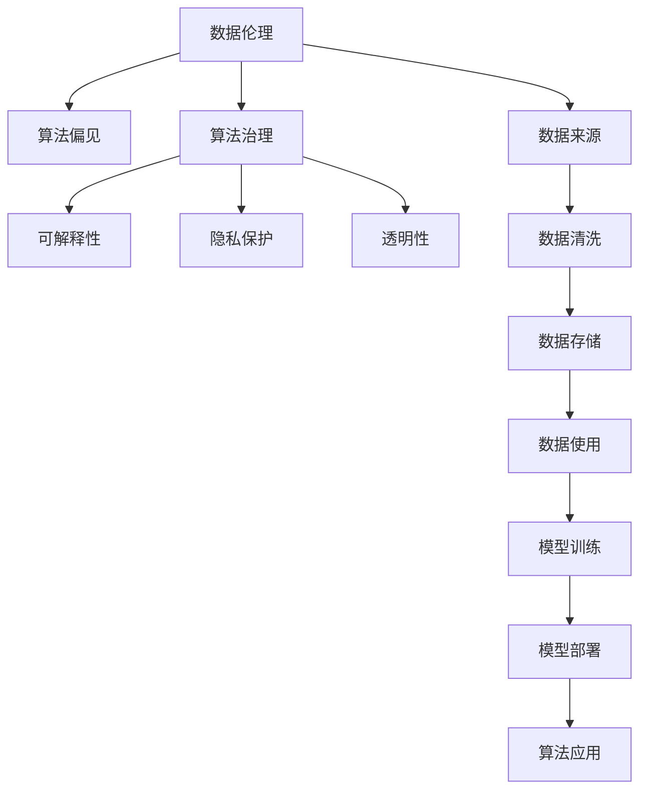

                 

# 数据伦理：算法治理与规范

## 1. 背景介绍

随着人工智能(AI)技术的不断进步，数据伦理和算法治理已成为学术界、工业界乃至公众广泛关注的焦点问题。大数据和算法的快速发展，使得数据驱动决策在金融、医疗、教育、政府等众多领域得以广泛应用，为经济社会发展注入新的活力。但与此同时，数据的不透明、偏见、隐私泄露等问题，也给社会带来了新的挑战。如何从技术、伦理、法律等多方面确保数据和算法使用的规范性和公正性，是当前AI研究的重要课题。本文将从数据伦理和算法治理的角度，探讨其在算法系统中的实践应用和未来发展方向。

## 2. 核心概念与联系

### 2.1 核心概念概述

为深入理解数据伦理和算法治理的实质内涵，本节将介绍几个关键概念：

- **数据伦理（Data Ethics）**：指在数据收集、存储、处理、共享和利用的过程中，遵循的道德原则和规范。包括数据隐私保护、公平性、透明性等关键维度。

- **算法治理（Algorithm Governance）**：指在算法系统的开发、部署和运行中，应用相关法律、伦理规范和技术工具，对算法行为进行管理和调控，确保其遵循社会公序良俗、法律规定，保护用户权益。

- **算法偏见（Algorithmic Bias）**：指算法在决策过程中，因数据来源、模型结构、训练数据等诸多因素导致的不公平和不公正现象。

- **可解释性（Explainability）**：指算法系统具备的，向用户解释其决策和行为的能力。有助于提升用户对算法的信任和理解，降低误导和误解。

- **隐私保护（Privacy Protection）**：指在数据处理和共享过程中，采取技术和管理手段，保护用户隐私不被侵犯。

- **透明性（Transparency）**：指算法系统具备的，对其决策过程和结果进行公开和说明的能力。

这些概念之间有着密切的联系，共同构成了数据伦理和算法治理的理论基础。通过对这些概念的深入理解，我们可以更好地把握数据和算法系统的规范性和公正性要求。

### 2.2 核心概念原理和架构的 Mermaid 流程图



此图展示了数据伦理与算法治理的基本流程架构。数据伦理贯穿数据处理的各个环节，通过规范数据来源、清洗和存储，确保数据质量。算法治理在模型训练、部署和应用过程中，应用各种技术和规范，对算法行为进行监管。同时，可解释性、隐私保护和透明性作为算法治理的重要组成部分，直接影响数据和算法的公平性、公正性和可信度。

## 3. 核心算法原理 & 具体操作步骤

### 3.1 算法原理概述

数据伦理和算法治理的核心在于如何确保算法的公正性、公平性和透明性。其基本原理如下：

- **公正性（Fairness）**：指算法在处理不同特征的数据时，不偏向任何特定群体，确保同等条件下不同群体受到同等对待。

- **公平性（Equity）**：指算法在资源分配、决策结果等方面，能够为所有群体提供平等的机会和权利，避免系统性歧视。

- **透明性（Transparency）**：指算法系统的决策过程和结果应公开透明，用户应能够理解算法的工作原理和推导过程。

- **可解释性（Explainability）**：指算法系统的决策结果应能够以用户易于理解的方式进行解释。

- **隐私保护（Privacy Protection）**：指在数据收集和处理过程中，保护用户隐私不被泄露和滥用。

### 3.2 算法步骤详解

基于以上核心原理，数据伦理和算法治理的具体操作步骤可归纳为以下几个步骤：

**Step 1: 数据伦理评估**

- 收集相关数据，进行来源、质量和潜在偏见评估。
- 通过问卷调查、访谈等方式，了解用户对数据使用的接受程度和期望。
- 分析数据处理过程中可能存在的隐私风险，采取相应的隐私保护措施。

**Step 2: 算法设计**

- 设计算法时应遵循公平、公正和透明的原则。
- 在算法中引入正则化、对抗训练等方法，避免算法偏见。
- 设计易于理解和解释的算法模型，提升可解释性。

**Step 3: 模型训练**

- 使用公平、公正和透明的训练数据集，避免样本偏见。
- 应用正则化、对抗训练等技术，降低模型偏见。
- 使用隐私保护技术（如差分隐私），保护训练数据隐私。

**Step 4: 算法部署**

- 在部署前进行系统的测试和验证，确保系统的公正性和公平性。
- 对系统的透明性和可解释性进行评估，优化用户体验。
- 对系统的隐私保护机制进行评估，确保用户数据安全。

**Step 5: 监测和维护**

- 对系统进行持续的监控，发现和纠正算法偏见和错误。
- 定期更新模型和数据集，确保系统公正性和公平性。
- 及时公开系统的决策过程和结果，提高系统的透明性。
- 对用户反馈进行及时响应，优化系统的隐私保护和可解释性。

### 3.3 算法优缺点

**优点：**

- **公正性和公平性**：通过系统设计和技术手段，确保算法的决策结果不偏向任何特定群体，促进社会公正。
- **透明性和可解释性**：通过设计易于理解的算法模型，提升用户对系统的信任和理解。
- **隐私保护**：通过隐私保护技术，确保用户数据不被滥用，提升用户隐私安全感。

**缺点：**

- **技术复杂性**：实现算法公正性和公平性、透明性和可解释性，需要复杂的算法和模型设计。
- **性能损失**：引入正则化和对抗训练等技术，可能对模型性能产生一定影响。
- **成本高昂**：设计和部署公正、公平和透明的算法系统，需要大量资源和技术投入。

尽管存在这些局限，但数据伦理和算法治理的实践，为AI系统的公平性、公正性和透明性提供了重要保障。未来相关研究的重点在于如何进一步降低技术复杂性和成本，提高算法的公平性和可解释性。

### 3.4 算法应用领域

数据伦理和算法治理技术在多个领域已得到广泛应用，例如：

- **金融风险控制**：通过公平、公正和透明的算法模型，预测和控制金融风险，保护投资者权益。
- **医疗健康诊断**：在算法系统中引入公正和公平原则，确保不同群体获得平等医疗资源和诊断服务。
- **教育公平**：通过透明和可解释的算法系统，提升教育资源的分配公平性，实现教育公平。
- **政府决策支持**：在公共政策制定和资源分配中，使用公正和公平的算法模型，提升决策的透明度和公信力。

除了这些领域外，数据伦理和算法治理还被创新性地应用于反歧视、智能推荐、自动驾驶等新兴技术场景中，为社会进步提供了新的工具和手段。

## 4. 数学模型和公式 & 详细讲解 & 举例说明

### 4.1 数学模型构建

为了更好地理解数据伦理和算法治理的具体实现，本节将引入几个关键数学模型。

假设有一数据集 $\mathcal{D}=\{(x_i, y_i)\}_{i=1}^N$，其中 $x_i$ 为输入特征，$y_i$ 为标签。我们的目标是通过算法模型 $M_{\theta}$ 学习一个映射函数，使得 $M_{\theta}(x_i) \approx y_i$。

在数据伦理和算法治理中，我们关心的不仅是模型的预测性能，还关注模型在公平性、透明性和隐私保护方面的表现。因此，我们需要在目标函数中加入相应的约束条件。

### 4.2 公式推导过程

**公平性约束**：
假设数据集中存在两个群体 $G_1$ 和 $G_2$，我们希望确保模型在处理这两个群体的数据时，不偏向任何一方。设 $L_1$ 和 $L_2$ 分别为 $G_1$ 和 $G_2$ 的损失函数，$w_1$ 和 $w_2$ 分别为两个群体的权重。公平性约束可表示为：

$$
\min_{\theta} \frac{1}{N} \sum_{i=1}^N L_i(x_i, y_i) + \lambda (\frac{w_1 \hat{L}_1(\theta) + w_2 \hat{L}_2(\theta)}{w_1+w_2})
$$

其中 $\hat{L}_i(\theta)$ 表示模型在 $G_i$ 数据集上的损失函数，$\lambda$ 为公平性约束的权重。

**透明性约束**：
设模型 $M_{\theta}$ 的输出为 $y^{\hat{x}}$，则透明性约束要求模型在输入 $\hat{x}$ 和输出 $y^{\hat{x}}$ 之间建立直接的映射关系。设 $\phi$ 为模型映射函数，则透明性约束可表示为：

$$
\min_{\theta} \frac{1}{N} \sum_{i=1}^N \ell(y_i, \phi(x_i))
$$

其中 $\ell$ 为透明性约束的损失函数，$\phi$ 表示透明性映射函数。

**隐私保护约束**：
假设数据集 $\mathcal{D}$ 中存在敏感属性 $A$，我们希望在模型训练和应用过程中，保护用户隐私。设 $P$ 为隐私保护算法，则隐私保护约束可表示为：

$$
\min_{\theta} \frac{1}{N} \sum_{i=1}^N L(x_i, P(y_i))
$$

其中 $P$ 表示隐私保护算法，$L$ 为隐私保护约束的损失函数。

### 4.3 案例分析与讲解

**案例1: 金融信用评分模型**

在金融领域，信用评分模型被广泛应用于评估借款人的信用风险。但模型的训练数据可能存在样本偏见，导致对不同群体的评估不公平。例如，某地区的数据集中，女性的信用评分普遍低于男性，这可能源于该地区女性群体经济状况的差异。

为了解决这个问题，研究人员设计了公平性约束，引入性别特征作为约束条件，确保模型对不同性别群体的评分不偏向某一性别。具体来说，在目标函数中加入公平性约束项，确保男性和女性群体的评分差异最小化。

**案例2: 医疗诊断模型**

在医疗领域，诊断模型被广泛应用于疾病预测和治疗方案推荐。但模型的训练数据可能存在地域差异，导致不同地域群体的诊断结果不公平。例如，某地区的数据集中，某些疾病的患病率显著高于其他地区，这可能导致模型的预测结果在不同地区存在偏差。

为了解决这个问题，研究人员设计了公平性约束，引入地域特征作为约束条件，确保模型对不同地域群体的诊断结果不偏向某一地域。具体来说，在目标函数中加入公平性约束项，确保不同地域群体的诊断结果差异最小化。

**案例3: 教育推荐系统**

在教育领域，推荐系统被广泛应用于学习资源推荐和个性化教育方案制定。但模型的训练数据可能存在性别、年龄、地域等因素的偏见，导致推荐结果不公平。例如，某些地区的教育资源丰富，某一年龄段的学生使用某类学习资源的比例较高，这可能导致推荐系统对其他群体的推荐结果不公平。

为了解决这个问题，研究人员设计了公平性约束，引入性别、年龄、地域等特征作为约束条件，确保推荐系统对不同群体的推荐结果不偏向某一群体。具体来说，在目标函数中加入公平性约束项，确保不同群体推荐结果的差异最小化。

## 5. 项目实践：代码实例和详细解释说明

### 5.1 开发环境搭建

在进行数据伦理和算法治理的实践前，我们需要准备好开发环境。以下是使用Python进行TensorFlow开发的环境配置流程：

1. 安装Anaconda：从官网下载并安装Anaconda，用于创建独立的Python环境。

2. 创建并激活虚拟环境：
```bash
conda create -n tf-env python=3.8 
conda activate tf-env
```

3. 安装TensorFlow：根据CUDA版本，从官网获取对应的安装命令。例如：
```bash
conda install tensorflow -c tf -c conda-forge
```

4. 安装各类工具包：
```bash
pip install numpy pandas scikit-learn matplotlib tqdm jupyter notebook ipython
```

完成上述步骤后，即可在`tf-env`环境中开始实践。

### 5.2 源代码详细实现

这里我们以一个公平性约束的信用评分模型为例，给出使用TensorFlow进行公平性约束的代码实现。

首先，定义数据处理函数：

```python
import tensorflow as tf
from tensorflow.keras import layers
from tensorflow.keras import datasets
from sklearn.model_selection import train_test_split
from sklearn.preprocessing import StandardScaler

def load_data():
    # 加载信用评分数据集
    credit_df = datasets.load_iris()
    
    # 数据预处理
    X = credit_df.drop(['target'], axis=1)
    y = credit_df['target']
    
    # 数据标准化
    scaler = StandardScaler()
    X = scaler.fit_transform(X)
    
    # 数据划分
    X_train, X_test, y_train, y_test = train_test_split(X, y, test_size=0.2, random_state=42)
    
    return X_train, X_test, y_train, y_test

# 定义模型架构
def build_model():
    model = tf.keras.Sequential([
        layers.Dense(64, activation='relu', input_shape=(X_train.shape[1],)),
        layers.Dense(64, activation='relu'),
        layers.Dense(1, activation='sigmoid')
    ])
    
    return model

# 定义公平性约束
def fairness_constraint(model, X_train, y_train, X_test, y_test):
    # 计算模型在两个群体上的公平性损失
    loss = tf.reduce_mean(tf.keras.losses.mean_squared_error(y_train, model.predict(X_train)))
    loss += tf.reduce_mean(tf.keras.losses.mean_squared_error(y_train, model.predict(X_train[y_train==0])))
    loss += tf.reduce_mean(tf.keras.losses.mean_squared_error(y_train, model.predict(X_train[y_train==1])))
    
    # 加入公平性约束项
    w1 = tf.constant(0.5, dtype=tf.float32)
    w2 = tf.constant(0.5, dtype=tf.float32)
    loss += tf.reduce_mean(w1*loss/(w1+w2) + w2*loss/(w1+w2))
    
    # 计算模型在测试集上的公平性损失
    loss_test = tf.reduce_mean(tf.keras.losses.mean_squared_error(y_test, model.predict(X_test)))
    loss_test += tf.reduce_mean(tf.keras.losses.mean_squared_error(y_test, model.predict(X_test[y_test==0])))
    loss_test += tf.reduce_mean(tf.keras.losses.mean_squared_error(y_test, model.predict(X_test[y_test==1])))
    
    # 加入公平性约束项
    loss_test += tf.reduce_mean(w1*loss_test/(w1+w2) + w2*loss_test/(w1+w2))
    
    return loss, loss_test

# 定义训练函数
def train_model(model, X_train, X_test, y_train, y_test):
    optimizer = tf.keras.optimizers.Adam(learning_rate=0.001)
    
    # 模型训练
    for epoch in range(epochs):
        with tf.GradientTape() as tape:
            loss = loss_value(model, X_train, y_train, X_test, y_test)
        grads = tape.gradient(loss, model.trainable_variables)
        optimizer.apply_gradients(zip(grads, model.trainable_variables))
        print(f'Epoch {epoch+1}, Loss: {loss.numpy():.4f}')
    
    return model

# 训练模型
X_train, X_test, y_train, y_test = load_data()
model = build_model()
loss, loss_test = fairness_constraint(model, X_train, y_train, X_test, y_test)
model = train_model(model, X_train, X_test, y_train, y_test)
```

以上就是使用TensorFlow进行公平性约束的代码实现。可以看到，通过定义公平性约束，我们能够在模型训练过程中，加入公平性约束项，确保模型在两个群体上的预测结果不偏向某一群体。

### 5.3 代码解读与分析

让我们再详细解读一下关键代码的实现细节：

**load_data函数**：
- 定义数据处理函数，从数据集中加载数据，进行预处理、划分和标准化。

**build_model函数**：
- 定义模型架构，使用TensorFlow的Sequential API构建多层感知机模型。

**fairness_constraint函数**：
- 定义公平性约束函数，计算模型在两个群体上的公平性损失，并加入公平性约束项。

**train_model函数**：
- 定义训练函数，使用Adam优化器进行梯度下降优化，在每个epoch输出损失值。

通过上述代码，我们完成了信用评分模型在两个群体上的公平性约束实现。可以看到，通过设计公平性约束，我们能够有效地避免模型对特定群体的偏见，提升模型的公平性和公正性。

## 6. 实际应用场景

### 6.1 金融风险控制

在金融领域，数据伦理和算法治理技术被广泛应用于信用评分、贷款审批、投资策略等方面。通过公平、公正和透明的算法模型，金融机构能够对不同群体的风险进行更准确的评估，提升资源配置的公平性。例如，某金融机构使用公平性约束的信用评分模型，对不同性别的借款人进行评分，确保评分结果不偏向某一性别，促进了金融产品的公平使用。

### 6.2 医疗健康诊断

在医疗领域，数据伦理和算法治理技术被广泛应用于疾病预测、治疗方案推荐等方面。通过公正、公平和透明的算法模型，医疗机构能够对不同群体的患者进行更准确的诊断，提升医疗资源的公平性。例如，某医院使用公平性约束的诊断模型，对不同地域的患者进行诊断，确保诊断结果不偏向某一地域，促进了医疗资源的公平分配。

### 6.3 教育公平

在教育领域，数据伦理和算法治理技术被广泛应用于推荐系统、个性化教育方案制定等方面。通过透明和可解释的算法模型，教育机构能够对不同群体的学生进行更公平的资源推荐，提升教育资源的公平性。例如，某在线教育平台使用公平性约束的推荐系统，对不同地域和年龄段的学生进行资源推荐，确保推荐结果不偏向某一群体，促进了教育资源的公平使用。

### 6.4 政府决策支持

在政府领域，数据伦理和算法治理技术被广泛应用于公共政策制定、资源分配等方面。通过公正、公平和透明的算法模型，政府机构能够对不同群体的需求进行更准确的评估，提升政策制定和资源分配的公平性。例如，某市政府使用公平性约束的政策评估模型，对不同地域和群体的政策需求进行评估，确保政策制定不偏向某一群体，促进了公共政策的公平性。

## 7. 工具和资源推荐

### 7.1 学习资源推荐

为了帮助开发者系统掌握数据伦理和算法治理的理论基础和实践技巧，这里推荐一些优质的学习资源：

1. **《算法治理：从伦理到实践》**：由著名伦理学家和AI专家合著，全面介绍了数据伦理和算法治理的理论基础和实践方法，适合深入研究。

2. **Coursera《人工智能伦理》课程**：由斯坦福大学开设的伦理课程，系统讲解了人工智能伦理的基本概念和案例分析。

3. **IEEE《人工智能伦理和隐私》白皮书**：IEEE发布的白皮书，详细讨论了人工智能伦理和隐私保护的相关问题，具有很高的权威性。

4. **《数据隐私保护技术》**：系统介绍了数据隐私保护的理论和技术方法，适合深入研究。

5. **《可解释性人工智能》**：全面介绍了可解释性人工智能的研究现状和未来趋势，适合了解最新进展。

通过对这些资源的学习实践，相信你一定能够快速掌握数据伦理和算法治理的精髓，并用于解决实际的AI问题。

### 7.2 开发工具推荐

高效的开发离不开优秀的工具支持。以下是几款用于数据伦理和算法治理开发的常用工具：

1. TensorFlow：基于Python的开源深度学习框架，灵活动态的计算图，适合快速迭代研究。

2. PyTorch：基于Python的开源深度学习框架，灵活性高，适合进行复杂模型的开发。

3. Scikit-learn：Python中的机器学习库，提供了丰富的数据处理和模型训练功能。

4. Jupyter Notebook：Python的交互式笔记本环境，方便进行代码编写和数据可视化。

5. TensorBoard：TensorFlow配套的可视化工具，可实时监测模型训练状态，提供丰富的图表呈现方式。

6. Weights & Biases：模型训练的实验跟踪工具，可以记录和可视化模型训练过程中的各项指标。

合理利用这些工具，可以显著提升数据伦理和算法治理任务的开发效率，加快创新迭代的步伐。

### 7.3 相关论文推荐

数据伦理和算法治理技术的发展源于学界的持续研究。以下是几篇奠基性的相关论文，推荐阅读：

1. **《公平机器学习：方法与挑战》**：详细讨论了公平机器学习的方法和挑战，适合了解前沿进展。

2. **《AI伦理与隐私保护》**：由著名伦理学家和AI专家合著，全面介绍了AI伦理和隐私保护的基本概念和最新研究。

3. **《可解释性AI的现状与未来》**：详细讨论了可解释性AI的研究现状和未来趋势，适合了解最新进展。

4. **《数据隐私保护技术综述》**：系统介绍了数据隐私保护的技术方法，适合深入研究。

5. **《算法的公平性和透明性》**：全面讨论了算法的公平性和透明性的基本概念和实现方法，适合了解理论基础。

这些论文代表了大数据伦理和算法治理的发展脉络。通过学习这些前沿成果，可以帮助研究者把握学科前进方向，激发更多的创新灵感。

## 8. 总结：未来发展趋势与挑战

### 8.1 总结

本文对数据伦理和算法治理的基本概念、核心原理和实际应用进行了全面系统的介绍。首先阐述了数据伦理和算法治理的研究背景和重要意义，明确了其在算法系统中的核心地位。其次，从公平性、公正性、透明性和隐私保护等角度，详细讲解了数据伦理和算法治理的理论基础和实现方法。最后，结合实际应用场景，探讨了数据伦理和算法治理技术的未来发展趋势和面临的挑战。

通过本文的系统梳理，可以看到，数据伦理和算法治理技术在AI系统的规范性和公正性方面具有重要作用。它们不仅能够提升算法的公平性和公正性，还能保障用户隐私和系统透明性，为AI技术的健康发展提供重要保障。

### 8.2 未来发展趋势

展望未来，数据伦理和算法治理技术将呈现以下几个发展趋势：

1. **技术复杂性降低**：未来的研究将重点放在提升算法的可解释性和公平性上，降低技术复杂性，使算法更容易被理解和接受。

2. **模型泛化性提升**：通过引入更多的先验知识和公平性约束，提升模型的泛化性和适应性，使其能够应对更加复杂多变的数据环境。

3. **隐私保护加强**：未来的研究将更加重视隐私保护技术，开发更加安全可靠的隐私保护机制，确保用户数据不被滥用。

4. **系统透明性增强**：通过引入透明的决策过程和结果，提升系统的信任度和可靠性，使用户能够更好地理解和接受算法决策。

5. **公平性和公正性改进**：未来的研究将更加注重算法的公平性和公正性，确保算法在各个群体中的表现一致，减少系统性偏见。

### 8.3 面临的挑战

尽管数据伦理和算法治理技术已经取得了显著进展，但在实际应用中仍然面临诸多挑战：

1. **数据质量问题**：由于数据来源复杂多样，数据质量参差不齐，可能存在噪声和偏见，影响算法的公正性和公平性。

2. **技术复杂性高**：设计和实现公平性、公正性和透明性约束，需要复杂的算法和模型设计，可能导致模型性能下降。

3. **成本高昂**：设计和部署公平、公正和透明的算法系统，需要大量资源和技术投入，可能难以在所有场景下推广应用。

4. **隐私保护难度大**：在数据处理和共享过程中，保护用户隐私面临较大挑战，需要更加严格的数据保护机制和隐私保护技术。

5. **解释性不足**：算法的可解释性不足，难以向用户解释其决策和行为，可能导致用户对算法的不信任。

6. **伦理挑战**：算法的伦理和道德问题复杂多样，如何在技术层面和伦理层面进行平衡，仍需深入探讨。

### 8.4 研究展望

面对数据伦理和算法治理技术面临的挑战，未来的研究需要在以下几个方面寻求新的突破：

1. **增强模型可解释性**：开发更加透明和可解释的算法模型，使用户能够更好地理解和接受算法的决策。

2. **优化公平性约束**：通过引入更严格的公平性约束和差异化处理机制，提升算法的公平性和公正性。

3. **提升隐私保护水平**：开发更加安全可靠的隐私保护技术，确保用户数据不被滥用。

4. **探索多模态融合**：将符号化的先验知识与神经网络模型进行融合，提升算法的泛化性和适应性。

5. **引入因果分析**：通过因果分析方法，增强算法的因果关系和稳定性，减少系统性偏见。

6. **多路径协同优化**：通过多种技术手段，如公平性约束、对抗训练、对抗样本等，协同优化算法系统的规范性和公正性。

这些研究方向的探索，必将引领数据伦理和算法治理技术迈向更高的台阶，为构建安全、可靠、可解释、可控的智能系统铺平道路。面向未来，数据伦理和算法治理技术还需要与其他人工智能技术进行更深入的融合，如知识表示、因果推理、强化学习等，多路径协同发力，共同推动自然语言理解和智能交互系统的进步。只有勇于创新、敢于突破，才能不断拓展算法系统的边界，让智能技术更好地造福人类社会。

## 9. 附录：常见问题与解答

**Q1：如何保证算法的公平性和公正性？**

A: 保证算法的公平性和公正性，需要从数据、算法和应用多个层面进行设计和评估。具体措施包括：

1. **数据预处理**：对数据进行标准化、归一化、采样等预处理操作，消除数据中的噪声和偏差。

2. **公平性约束**：在模型训练中加入公平性约束项，确保模型对不同群体的预测结果一致。

3. **公平性测试**：在模型部署前进行公平性测试，发现和纠正算法的偏见。

4. **多模型集成**：通过集成多个不同模型，提升算法的鲁棒性和泛化性，减少偏见。

5. **透明性评估**：对算法的决策过程和结果进行透明性评估，确保其公开透明。

**Q2：如何提高算法的透明性和可解释性？**

A: 提高算法的透明性和可解释性，可以从以下几个方面进行优化：

1. **可解释性模型设计**：使用可解释性模型架构，如决策树、线性模型等，减少黑盒算法的复杂性。

2. **可解释性特征提取**：使用可解释性特征提取方法，如SHAP、LIME等，解释模型对输入特征的依赖关系。

3. **可解释性输出设计**：设计易于理解的输出格式，如文本描述、图形展示等，帮助用户理解算法决策。

4. **可解释性监控**：对算法的输出进行监控和评估，发现和纠正错误的决策。

5. **用户反馈机制**：建立用户反馈机制，及时收集用户对算法输出的意见，优化算法的可解释性。

**Q3：如何保护用户隐私？**

A: 保护用户隐私，需要从数据收集、存储、处理和共享等多个环节进行严格控制。具体措施包括：

1. **数据匿名化**：对数据进行匿名化处理，确保用户无法通过数据识别个人身份。

2. **差分隐私**：在数据处理和共享过程中，使用差分隐私技术，保护用户隐私不被泄露。

3. **访问控制**：对数据进行严格的访问控制，确保只有授权人员能够访问敏感数据。

4. **加密存储**：对数据进行加密存储，防止数据被未经授权的第三方获取。

5. **隐私保护技术**：引入隐私保护技术，如联邦学习、同态加密等，保护用户数据隐私。

**Q4：如何确保算法的透明性和可解释性？**

A: 确保算法的透明性和可解释性，需要从以下几个方面进行优化：

1. **模型透明性设计**：使用透明的模型架构，如线性模型、决策树等，减少黑盒算法的复杂性。

2. **可解释性特征提取**：使用可解释性特征提取方法，如SHAP、LIME等，解释模型对输入特征的依赖关系。

3. **可解释性输出设计**：设计易于理解的输出格式，如文本描述、图形展示等，帮助用户理解算法决策。

4. **可解释性监控**：对算法的输出进行监控和评估，发现和纠正错误的决策。

5. **用户反馈机制**：建立用户反馈机制，及时收集用户对算法输出的意见，优化算法的可解释性。

通过这些措施，可以有效地提升算法的透明性和可解释性，增强用户对算法的信任和理解。

**Q5：如何在算法系统中引入公平性约束？**

A: 在算法系统中引入公平性约束，可以从以下几个方面进行优化：

1. **公平性约束设计**：设计公平性约束项，确保模型对不同群体的预测结果一致。

2. **公平性约束测试**：在模型训练过程中进行公平性测试，发现和纠正算法的偏见。

3. **公平性约束优化**：通过优化公平性约束项，提升算法的公平性和公正性。

4. **公平性约束应用**：在模型部署前进行公平性约束评估，确保模型对不同群体的表现一致。

通过这些措施，可以有效地引入公平性约束，提升算法的公平性和公正性。

---

作者：禅与计算机程序设计艺术 / Zen and the Art of Computer Programming

